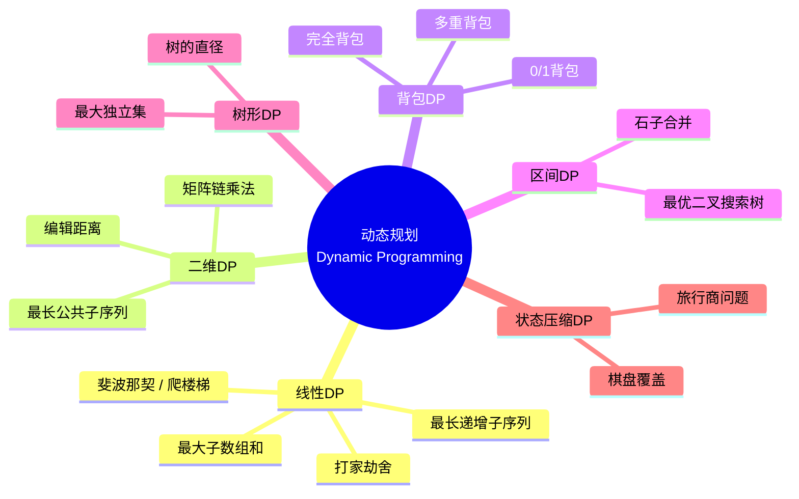
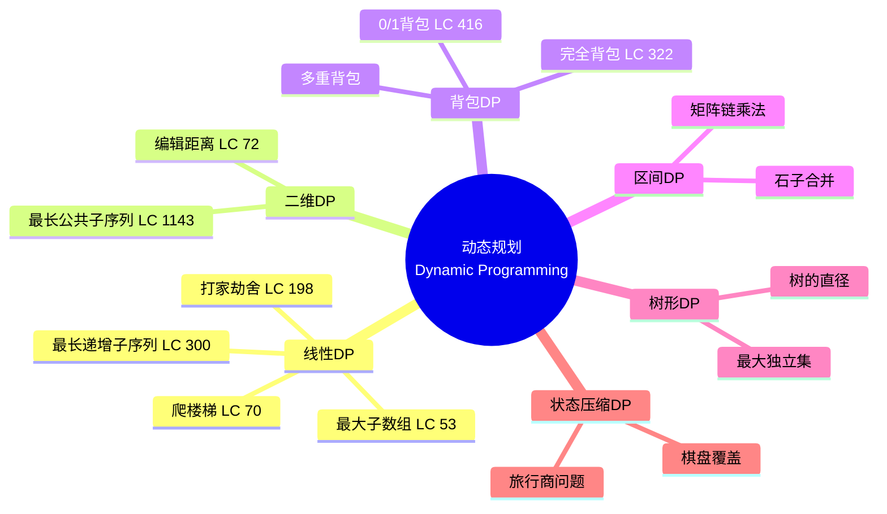
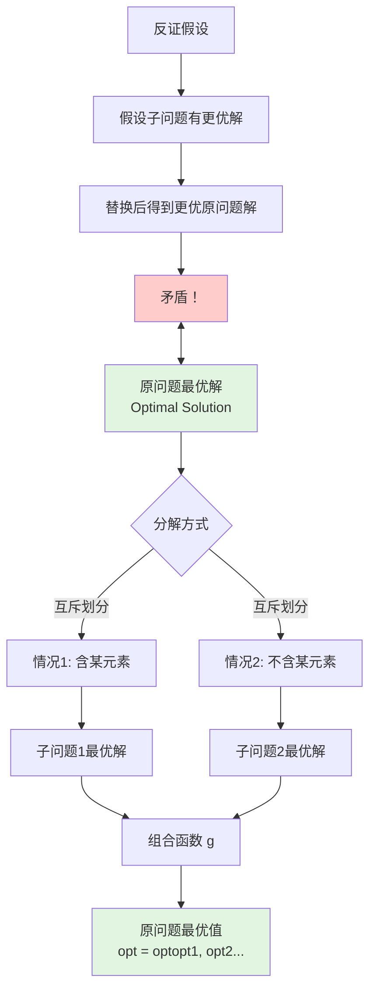
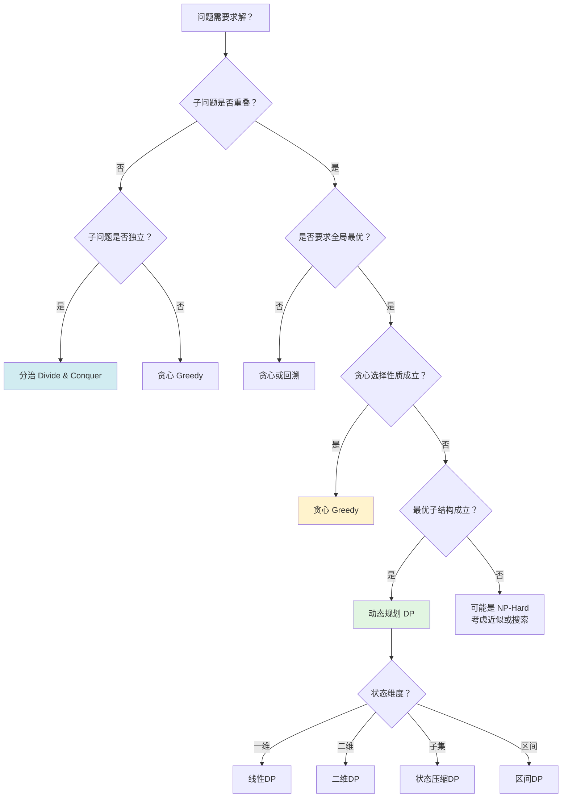
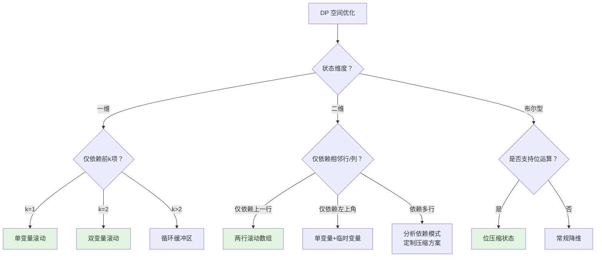

> 📊 **项目全面梳理**：详细的项目结构、模块详解和学习路径，请参阅 [`项目全面梳理-2025.md`](../../项目全面梳理-2025.md)

## 动态规划 / Dynamic Programming

### 摘要 / Executive Summary

- 动态规划（Dynamic Programming, DP）是一种通过将复杂问题分解为**重叠子问题**并利用**最优子结构**性质进行高效求解的算法设计范式。其核心思想是“用空间换时间”，通过记忆化表 `memo` 避免重复计算。
- 本文从**形式化五元组** `(X, F, f, opt, memo)` 出发，严格定义 DP 问题实例，给出最优子结构引理、重叠子问题与无后效性的形式化描述，建立通用的状态转移方程模板。
- 通过 LeetCode 8 道经典题目的形式化规约、最优子结构证明、归纳法正确性证明、代码实现与复杂度分析，展示线性 DP、二维 DP、背包 DP、LIS/LCS 等核心模式。
- 每题均包含：状态定义、转移方程、初始条件、计算顺序、空间优化、复杂度分析与正确性证明，形成完整的 DP 学习闭环。

### 关键术语与符号 / Glossary

| 术语 / Term | 定义 / Definition |
|-------------|-------------------|
| 决策序列空间 Decision Sequence Space | 所有可能的决策序列构成的集合，记为 $X$ |
| 可行解约束 Feasible Constraint | 判定一个决策序列是否为合法解的谓词，记为 $F: X \to \{0,1\}$ |
| 目标函数 Objective Function | 将可行解映射为实数值的函数，记为 $f: X_F \to \mathbb{R}$，其中 $X_F = \{x \in X \mid F(x) = 1\}$ |
| 最优化算子 Optimization Operator | 对候选值集合取最优的算子，通常为 $\min$ 或 $\max$，记为 $\text{opt}$ |
| 记忆化表 Memoization Table | 存储已计算子问题结果的映射结构，记为 $\text{memo}: S \to \mathbb{R}$，$S$ 为状态空间 |
| 最优子结构 Optimal Substructure | 问题的最优解包含其子问题的最优解 |
| 重叠子问题 Overlapping Subproblems | 递归求解过程中相同的子问题被多次计算 |
| 无后效性 Markov Property / No Aftereffect | 某阶段的状态一旦确定，后续演变仅依赖于当前状态，与达到该状态的路径无关 |
| 状态转移方程 State Transition Equation | 描述状态间递推关系的方程，形如 $dp[s] = \text{opt}_{t \in T(s)} \{ g(dp[t], \text{cost}(s,t)) \}$ |
| 滚动数组 Rolling Array | 利用状态覆盖关系将高维 DP 数组降维以节省空间的技术 |

术语对齐与引用规范：`docs/术语与符号总表.md`，`01-基础理论/00-撰写规范与引用指南.md`

### 目录 / Table of Contents

- [动态规划 / Dynamic Programming](#动态规划--dynamic-programming)
  - [摘要 / Executive Summary](#摘要--executive-summary)
  - [关键术语与符号 / Glossary](#关键术语与符号--glossary)
  - [目录 / Table of Contents](#目录--table-of-contents)
  - [交叉引用与依赖 / Cross-References and Dependencies](#交叉引用与依赖--cross-references-and-dependencies)
  - [1. 形式化定义 / Formal Definitions](#1-形式化定义--formal-definitions)
    - [1.1 DP 问题实例五元组](#11-dp-问题实例五元组)
    - [1.2 最优子结构引理](#12-最优子结构引理)
    - [1.3 重叠子问题的形式化描述](#13-重叠子问题的形式化描述)
    - [1.4 无后效性的形式化描述](#14-无后效性的形式化描述)
    - [1.5 状态转移方程通用模板](#15-状态转移方程通用模板)
  - [2. 核心思路与算法框架](#2-核心思路与算法框架--core-ideas-and-algorithm-framework)
  - [3. 经典题目详解](#3-经典题目详解--classic-problem-analysis)
  - [4. 复杂度分析体系](#4-复杂度分析体系--complexity-analysis)
  - [5. 正确性证明框架](#5-正确性证明框架--correctness-proof-framework)
  - [6. 思维表征](#6-思维表征--thinking-representations)
  - [7. 常见错误与反模式](#7-常见错误与反模式--common-mistakes-and-anti-patterns)
  - [8. 自测问题](#8-自测问题--self-assessment-questions)
  - [9. 学习目标](#9-学习目标--learning-objectives)
  - [10. 知识导航](#10-知识导航--knowledge-navigation)
  - [参考文献](#参考文献--references)

### 交叉引用与依赖 / Cross-References and Dependencies

**上游理论依赖 / Upstream Dependencies**:
- [`09-算法理论/01-算法基础/06-动态规划理论.md`](../../09-算法理论/01-算法基础/06-动态规划理论.md) — 动态规划的理论定义、状态建模、转移方程与优化技巧
- [`04-算法复杂度/01-时间复杂度.md`](../../04-算法复杂度/01-时间复杂度.md) — 时间复杂度 $O/\Omega/\Theta$ 的形式化定义与渐进分析
- [`01-算法基础/02-递归与分治.md`](../../01-算法基础/02-递归与分治.md) — 递归策略与分治框架（DP 是递归的优化形式）
- [`01-算法基础/07-贪心算法.md`](../../01-算法基础/07-贪心算法.md) — 贪心选择性质与 DP 的对比

**下游应用 / Downstream Applications**:
- `13-LeetCode算法面试专题/04-高级专题/01-区间DP.md` — 区间合并类 DP 问题
- `13-LeetCode算法面试专题/04-高级专题/02-树形DP.md` — 树结构上的动态规划
- `13-LeetCode算法面试专题/04-高级专题/03-状态压缩DP.md` — 位运算状态压缩 DP

---

## 1. 形式化定义 / Formal Definitions

### 1.1 DP 问题实例五元组

**定义 1.1** (DP 问题实例 / DP Problem Instance) [Bellman1957, CLRS2022]
动态规划问题实例可以形式化地定义为一个五元组：
**Definition 1.1** (DP Problem Instance)
A dynamic programming problem instance can be formally defined as a quintuple:

$$
\mathcal{P} = (X, F, f, \text{opt}, \text{memo})
$$

其中 / Where:

- $X$：**决策序列空间**（Decision Sequence Space），表示所有可能的决策序列构成的集合
- $F: X \to \{0,1\}$：**可行解约束**（Feasible Constraint），$F(x) = 1$ 当且仅当 $x$ 是合法解
- $f: X_F \to \mathbb{R}$：**目标函数**（Objective Function），将可行解映射为实数值，其中 $X_F = \{x \in X \mid F(x) = 1\}$
- $\text{opt} \in \{\min, \max\}$：**最优化算子**（Optimization Operator），对候选值集合取最优
- $\text{memo}: S \to \mathbb{R}$：**记忆化表**（Memoization Table），将状态空间 $S$ 中的每个状态映射到其最优值

**状态空间 / State Space**:

设状态空间为 $S$，每个状态 $s \in S$ 编码了子问题的全部信息。状态转移函数为：

$$
\text{trans}: S \times A \to S
$$

其中 $A$ 为决策（动作）空间。对于每个状态 $s \in S$，其最优值定义为：

$$
\text{memo}(s) = \text{opt}_{a \in A(s)} \big\{ g\big(\text{memo}(\text{trans}(s, a)), \text{cost}(s, a)\big) \big\}
$$

其中 $A(s) \subseteq A$ 为状态 $s$ 下的合法决策集合，$g$ 为组合函数，$\text{cost}(s, a)$ 为采取决策 $a$ 的代价。

### 1.2 最优子结构引理

**定义 1.2** (最优子结构 / Optimal Substructure) [CLRS2022, §14]
一个最优化问题具有最优子结构，当且仅当：问题的一个最优解中包含了其子问题的最优解。
**Definition 1.2** (Optimal Substructure)
An optimization problem exhibits optimal substructure if an optimal solution to the problem contains within it optimal solutions to subproblems.

**引理 1.1** (最优子结构引理 / Optimal Substructure Lemma)
设 $\mathcal{P} = (X, F, f, \text{opt}, \text{memo})$ 为一个 DP 问题实例，状态空间为 $S$。若对于任意状态 $s \in S$，其最优值满足：

$$
\text{opt}(s) = \text{opt}\big(\text{opt}(s_1), \text{opt}(s_2), \ldots, \text{opt}(s_k)\big)
$$

其中 $s_1, s_2, \ldots, s_k$ 为 $s$ 的所有直接子状态，则称 $\mathcal{P}$ 满足**最优子结构性质**。

**证明 / Proof**:
采用反证法。假设 $\text{opt}(s)$ 不包含某个子状态 $s_i$ 的最优解，即存在 $s_i$ 的一个更优解 $\text{opt}'(s_i)$ 使得：

$$
\text{opt}'(s_i) \prec_{\text{opt}} \text{opt}(s_i)
$$

其中 $\prec_{\text{opt}}$ 为最优序关系（对 $\min$ 为 $<$，对 $\max$ 为 $>$）。

将 $\text{opt}(s)$ 中的 $\text{opt}(s_i)$ 替换为 $\text{opt}'(s_i)$，得到新的候选解 $\text{cand}(s)$。由 $\text{opt}$ 的单调性：

$$
\text{opt}\big(\ldots, \text{opt}'(s_i), \ldots\big) \prec_{\text{opt}} \text{opt}\big(\ldots, \text{opt}(s_i), \ldots\big) = \text{opt}(s)
$$

这与 $\text{opt}(s)$ 的最优性矛盾。因此假设不成立，最优子结构得证。$\square$

### 1.3 重叠子问题的形式化描述

**定义 1.3** (重叠子问题 / Overlapping Subproblems) [CLRS2022]
设 $T_s$ 为求解状态 $s$ 时递归调用求解的子状态集合。若存在不同的状态 $s_i \neq s_j$，使得：

$$
T_{s_i} \cap T_{s_j} \neq \emptyset
$$

则称该问题具有**重叠子问题**性质。
**Definition 1.3** (Overlapping Subproblems)
If the recursive algorithm for a problem solves the same subproblems multiple times rather than always generating new subproblems, the problem has overlapping subproblems.

**量化描述 / Quantitative Description**:

设状态空间大小为 $|S|$，朴素递归算法的时间复杂度为：

$$
T_{\text{naive}} = \sum_{s \in S} \big|T_s\big| = O\big(|S|^{\text{branching_factor}}\big)
$$

利用记忆化后，每个状态仅计算一次：

$$
T_{\text{memo}} = O\big(|S| \cdot C_{\text{trans}}\big)
$$

其中 $C_{\text{trans}}$ 为单个状态的转移计算代价。加速比为：

$$
\text{Speedup} = \frac{T_{\text{naive}}}{T_{\text{memo}}} = O\left(\frac{|S|^{\text{branching_factor}}}{|S| \cdot C_{\text{trans}}}\right)
$$

### 1.4 无后效性的形式化描述

**定义 1.4** (无后效性 / Markov Property / No Aftereffect) [Bellman1957]
设状态序列为 $s_0, s_1, \ldots, s_n$，决策序列为 $a_0, a_1, \ldots, a_{n-1}$。若对于任意 $k \geq 0$，状态 $s_{k+1}$ 的分布（或取值）仅依赖于 $s_k$ 和 $a_k$，与历史状态 $s_0, \ldots, s_{k-1}$ 无关：

$$
P(s_{k+1} \mid s_0, a_0, \ldots, s_k, a_k) = P(s_{k+1} \mid s_k, a_k)
$$

或对于确定性转移：

$$
s_{k+1} = \text{trans}(s_k, a_k)
$$

则称该问题满足**无后效性**。
**Definition 1.4** (No Aftereffect)
A problem satisfies the Markov property if the next state depends only on the current state and action, not on the sequence of events that preceded it.

**直观解释 / Intuition**: 无后效性是 DP 的“状态压缩”基础。它允许我们将一个可能包含无限历史信息的决策过程压缩为有限维度的状态向量，从而使记忆化表的大小可控。

### 1.5 状态转移方程通用模板

**标准模板 / Standard Template**:

对于状态空间 $S$ 中的每个状态 $s \in S$，状态转移方程的一般形式为：

$$
dp[s] = \begin{cases}
\text{base}(s) & \text{if } s \in S_{\text{base}} \quad \text{（边界条件）} \\[6pt]
\displaystyle\text{opt}_{a \in A(s)} \big\{ g\big(dp[\text{trans}(s, a)], \text{cost}(s, a)\big) \big\} & \text{otherwise}
\end{cases}
$$

其中：
- $S_{\text{base}} \subseteq S$：边界状态集合（无需递归即可直接确定值的子问题）
- $\text{base}(s)$：边界状态 $s$ 的初值函数
- $A(s)$：状态 $s$ 的合法决策集合
- $\text{trans}(s, a)$：状态转移函数
- $\text{cost}(s, a)$：决策代价函数
- $g(\cdot, \cdot)$：子问题解与当前决策代价的组合函数

**计算顺序 / Computation Order**:

为确保计算 $dp[s]$ 时所有依赖的 $dp[\text{trans}(s, a)]$ 已计算完毕，需按照状态的**拓扑序**进行填表。对于无环状态图，拓扑序总是存在；若状态图含环，则需特殊处理（如增加状态维度打破循环依赖）。

---

## 2. 核心思路与算法框架 / Core Ideas and Algorithm Framework

动态规划的本质是**带记忆化的递归**：通过识别重叠子问题，将指数级时间的朴素递归优化为多项式级时间的迭代填表。

### 2.1 解题步骤框架

```text
Step 1: 定义状态
        确定状态变量 dp[s] 的语义（子问题的最优值）
        
Step 2: 写出状态转移方程
        dp[s] = opt_{a ∈ A(s)} { g(dp[trans(s,a)], cost(s,a)) }
        
Step 3: 确定边界条件
        找出所有 base case，给出 dp[s_base] 的初值
        
Step 4: 确定计算顺序
        按拓扑序（通常按状态维度递增）填表
        
Step 5: 空间优化（可选）
        分析状态依赖关系，使用滚动数组降维
        
Step 6: 返回最终答案
        dp[goal_state] 即为所求
```

### 2.2 DP vs 贪心 vs 分治

| 维度 / Dimension | 动态规划 DP | 贪心 Greedy | 分治 Divide & Conquer |
|----------------|------------|------------|----------------------|
| **子问题关系** | 重叠（共享子问题） | 不重叠 | 独立（互不共享） |
| **最优性依赖** | 最优子结构 | 贪心选择性质 | 子问题解合并 |
| **计算方式** | 记忆化 / 自底向上 | 局部最优选择 | 递归分解 + 合并 |
| **正确性证明** | 最优子结构 + 归纳法 | 贪心选择性质 + 最优子结构 | 递归正确性 |
| **典型问题** | 背包、LCS、LIS | 活动选择、Huffman | 归并排序、快速排序 |
| **时间复杂度** | 多项式 $O(n^k)$ | 多项式 $O(n \log n)$ | 通常 $O(n \log n)$ |
| **空间复杂度** | $O(|S|)$（状态空间） | $O(1)$–$O(n)$ | $O(\log n)$–$O(n)$ |

### 2.3 DP 分类速查



---

## 3. 经典题目详解 / Classic Problem Analysis

---

### 3.1 LeetCode 70 — Climbing Stairs

> **题目链接 / Problem Link**: [LeetCode 70. Climbing Stairs](https://leetcode.com/problems/climbing-stairs/)
> **难度 / Difficulty**: Easy

#### 形式化规约 / Formal Specification

**前置条件 / Precondition**:

$$
n \in \mathbb{Z}^+ \quad \land \quad 1 \leq n \leq 45
$$

**后置条件 / Postcondition**:

$$
\text{result} = \big|\{ \langle a_1, a_2, \ldots, a_k \rangle \mid \forall i: a_i \in \{1,2\}, \sum_{i=1}^{k} a_i = n \}\big|
$$

即返回爬到第 $n$ 阶的不同方法数（每次可跨 1 或 2 阶）。

#### 核心思路 / Core Idea

该问题是斐波那契数列的等价形式。设 $dp[i]$ 为到达第 $i$ 阶的方法数，最后一步可从第 $i-1$ 阶跨 1 步，或从第 $i-2$ 阶跨 2 步。

**状态定义 / State Definition**:

$$
dp[i] = \text{到达第 } i \text{ 阶的不同方法数}
$$

**状态转移方程 / State Transition Equation**:

$$
dp[i] = dp[i-1] + dp[i-2] \quad \text{for } i \geq 2
$$

**边界条件 / Boundary Conditions**:

$$
dp[0] = 1, \quad dp[1] = 1
$$

> 注：$dp[0] = 1$ 表示地面有一种“不动”的方案，保证递推自洽；也可定义为 $dp[1]=1, dp[2]=2$。

**计算顺序 / Computation Order**: $i$ 从小到大递增，$i = 2, 3, \ldots, n$。

**空间优化 / Space Optimization**:

由于 $dp[i]$ 仅依赖于 $dp[i-1]$ 和 $dp[i-2]$，可压缩为两个变量：

$$
\text{curr} = \text{prev}_1 + \text{prev}_2
$$

空间复杂度从 $O(n)$ 降至 $O(1)$。

#### 代码实现 / Code Implementations

- **Rust**: [`examples/algorithms/src/leetcode/lc0070_climbing_stairs.rs`](../../../../examples/algorithms/src/leetcode/lc0070_climbing_stairs.rs)
- **Python**: [`examples/algorithms-python/src/leetcode/lc0070_climbing_stairs.py`](../../../../examples/algorithms-python/src/leetcode/lc0070_climbing_stairs.py)
- **Go**: [`examples/algorithms-go/leetcode/lc0070_climbing_stairs.go`](../../../../examples/algorithms-go/leetcode/lc0070_climbing_stairs.go)

#### 复杂度分析 / Complexity Analysis

| 指标 / Metric | 基础 DP | 空间优化 |
|--------------|---------|---------|
| 时间复杂度 / Time | $O(n)$ | $O(n)$ |
| 空间复杂度 / Space | $O(n)$ | $O(1)$ |

#### 正确性证明 / Correctness Proof

**定理 3.1.1** (LeetCode 70 正确性): 算法返回爬到第 $n$ 阶的不同方法数。
**Theorem 3.1.1** (Correctness of LeetCode 70): The algorithm returns the number of distinct ways to climb to the $n$-th step.

**证明 / Proof**: 基于数学归纳法。

**基础情况 / Base Case**:
- $n = 0$：$dp[0] = 1$（一种方法：不动），正确。
- $n = 1$：$dp[1] = 1$（只有一种跨 1 阶的方法），正确。

**归纳假设 / Inductive Hypothesis**:
假设对于所有 $k < i$，$dp[k]$ 正确表示到达第 $k$ 阶的方法数。

**归纳步骤 / Inductive Step**:
对于第 $i$ 阶（$i \geq 2$），最后一步只有两种可能：
1. 从第 $i-1$ 阶跨 1 步上来，方法数为 $dp[i-1]$
2. 从第 $i-2$ 阶跨 2 步上来，方法数为 $dp[i-2]$

这两种情况互不重叠且覆盖所有可能，因此：

$$
dp[i] = dp[i-1] + dp[i-2]
$$

由归纳假设，$dp[i-1]$ 和 $dp[i-2]$ 均正确，故 $dp[i]$ 正确。

**最优子结构引理 / Optimal Substructure Lemma**:
到达第 $i$ 阶的最优方法数 = 到达第 $i-1$ 阶的最优方法数 + 到达第 $i-2$ 阶的最优方法数。此引理显然成立，因为两类路径以最后一步区分，构成完备划分。

由数学归纳法，对所有 $n \geq 0$，$dp[n]$ 正确。$\square$

---

### 3.2 LeetCode 198 — House Robber

> **题目链接 / Problem Link**: [LeetCode 198. House Robber](https://leetcode.com/problems/house-robber/)
> **难度 / Difficulty**: Medium

#### 形式化规约 / Formal Specification

**前置条件 / Precondition**:

$$
\textit{nums} \in \mathbb{N}^n \quad \land \quad 1 \leq n \leq 100 \quad \land \quad \forall i: 0 \leq \textit{nums}[i] \leq 400
$$

**后置条件 / Postcondition**:

$$
\text{result} = \max_{S \subseteq [0,n-1]} \left\{ \sum_{i \in S} \textit{nums}[i] \;\middle|\; \forall i, j \in S: |i - j| \neq 1 \right\}
$$

即在不触发报警（不偷相邻房屋）的前提下，可偷窃的最大金额。

#### 核心思路 / Core Idea

对于第 $i$ 间房屋，只有两种选择：**偷** 或 **不偷**。若偷，则不能偷第 $i-1$ 间，最大收益为 $dp[i-2] + \textit{nums}[i]$；若不偷，最大收益为 $dp[i-1]$。

**状态定义 / State Definition**:

$$
dp[i] = \text{偷窃前 } i \text{ 间房屋（即 } [0, i-1] \text{）可获得的最大金额}
$$

**状态转移方程 / State Transition Equation**:

$$
dp[i] = \max\big(dp[i-1], \; dp[i-2] + \textit{nums}[i-1]\big) \quad \text{for } i \geq 2
$$

**边界条件 / Boundary Conditions**:

$$
dp[0] = 0, \quad dp[1] = \textit{nums}[0]
$$

**计算顺序 / Computation Order**: $i = 2, 3, \ldots, n$。

**空间优化 / Space Optimization**: 仅依赖前两维，可压缩至 $O(1)$。

#### 代码实现 / Code Implementations

- **Rust**: [`examples/algorithms/src/leetcode/lc0198_house_robber.rs`](../../../../examples/algorithms/src/leetcode/lc0198_house_robber.rs)
- **Python**: [`examples/algorithms-python/src/leetcode/lc0198_house_robber.py`](../../../../examples/algorithms-python/src/leetcode/lc0198_house_robber.py)
- **Go**: [`examples/algorithms-go/leetcode/lc0198_house_robber.go`](../../../../examples/algorithms-go/leetcode/lc0198_house_robber.go)

#### 复杂度分析 / Complexity Analysis

| 指标 / Metric | 值 / Value |
|--------------|-----------|
| 时间复杂度 / Time | $O(n)$ |
| 空间复杂度 / Space | $O(1)$（滚动数组优化后） |

#### 正确性证明 / Correctness Proof

**定理 3.2.1** (LeetCode 198 正确性): 算法返回不触发报警条件下可偷窃的最大金额。

**证明 / Proof**:

**最优子结构引理 / Optimal Substructure Lemma**:
设 $S^*$ 为前 $i$ 间房屋的最优偷窃方案：
- **情况 A**: $i-1 \notin S^*$（第 $i-1$ 间不偷）。则 $S^* \cap [0, i-2]$ 是前 $i-1$ 间房屋的最优解，价值为 $dp[i-1]$。
- **情况 B**: $i-1 \in S^*$（第 $i-1$ 间偷）。则第 $i-2$ 间不能偷，$S^* \cap [0, i-3]$ 是前 $i-2$ 间房屋的最优解，加上 $\textit{nums}[i-1]$，总价值为 $dp[i-2] + \textit{nums}[i-1]$。

两种情况构成完备划分，故 $dp[i] = \max(dp[i-1], dp[i-2] + \textit{nums}[i-1])$ 正确。

**归纳证明 / Inductive Proof**:

**基础**: $dp[0] = 0$（无房屋可偷），$dp[1] = \textit{nums}[0]$（只有一间必偷），均正确。

**归纳**: 假设对所有 $k < i$，$dp[k]$ 正确。由最优子结构引理，$dp[i]$ 的两种候选分别对应两种互斥的最优策略，取最大值即为前 $i$ 间的最优解。$\square$

---

### 3.3 LeetCode 300 — Longest Increasing Subsequence

> **题目链接 / Problem Link**: [LeetCode 300. Longest Increasing Subsequence](https://leetcode.com/problems/longest-increasing-subsequence/)
> **难度 / Difficulty**: Medium

#### 形式化规约 / Formal Specification

**前置条件 / Precondition**:

$$
\textit{nums} \in \mathbb{Z}^n \quad \land \quad 1 \leq n \leq 2500
$$

**后置条件 / Postcondition**:

$$
\text{result} = \max \left\{ |S| \;\middle|\; S = \langle i_1, i_2, \ldots, i_k \rangle, \; i_1 < i_2 < \cdots < i_k, \; \textit{nums}[i_1] < \textit{nums}[i_2] < \cdots < \textit{nums}[i_k] \right\}
$$

#### 核心思路 / Core Idea

**解法 A — $O(n^2)$ 动态规划**：
$dp[i]$ 表示以 $\textit{nums}[i]$ 结尾的最长递增子序列长度。

**解法 B — $O(n \log n)$ 贪心 + 二分**：
维护数组 $\text{tails}[k]$ = 长度为 $k+1$ 的递增子序列的最小末尾值。利用二分查找维护 $\text{tails}$ 的有序性。

#### 解法 A: $O(n^2)$ DP

**状态定义 / State Definition**:

$$
dp[i] = \text{以 } \textit{nums}[i] \text{ 结尾的最长递增子序列长度}
$$

**状态转移方程 / State Transition Equation**:

$$
dp[i] = \max_{j < i, \; \textit{nums}[j] < \textit{nums}[i]} \{ dp[j] \} + 1
$$

**边界条件 / Boundary Conditions**:

$$
\forall i: dp[i] \geq 1 \quad \text{（每个元素自身构成长度为 1 的 LIS）}
$$

**计算顺序 / Computation Order**: $i = 0, 1, \ldots, n-1$，每个 $i$ 需遍历 $j = 0, \ldots, i-1$。

#### 解法 B: $O(n \log n)$ 贪心 + 二分

**核心观察 / Key Observation**: 对于相同长度的递增子序列，末尾值越小越有利于后续扩展。

维护数组 $\text{tails}$，其中 $\text{tails}[k]$ 表示长度为 $k+1$ 的所有递增子序列中末尾值的最小值。

**性质 / Property**: $\text{tails}$ 数组严格递增（可用反证法证明）。

**算法流程 / Algorithm**:
对于每个 $\textit{nums}[i]$，在 $\text{tails}$ 中二分查找第一个 $\geq \textit{nums}[i]$ 的位置 $pos$，替换 $\text{tails}[pos] = \textit{nums}[i]$。若 $\textit{nums}[i]$ 大于所有 tails 元素，则追加到末尾。

#### 代码实现 / Code Implementations

- **Rust**: [`examples/algorithms/src/leetcode/lc0300_longest_increasing_subsequence.rs`](../../../../examples/algorithms/src/leetcode/lc0300_longest_increasing_subsequence.rs)
- **Python**: [`examples/algorithms-python/src/leetcode/lc0300_longest_increasing_subsequence.py`](../../../../examples/algorithms-python/src/leetcode/lc0300_longest_increasing_subsequence.py)
- **Go**: [`examples/algorithms-go/leetcode/lc0300_longest_increasing_subsequence.go`](../../../../examples/algorithms-go/leetcode/lc0300_longest_increasing_subsequence.go)

#### 复杂度分析 / Complexity Analysis

| 解法 / Solution | 时间复杂度 / Time | 空间复杂度 / Space |
|----------------|----------------|------------------|
| $O(n^2)$ DP | $O(n^2)$ | $O(n)$ |
| $O(n \log n)$ 贪心+二分 | $O(n \log n)$ | $O(n)$ |

#### 正确性证明 / Correctness Proof

**定理 3.3.1** (LIS DP 正确性): $O(n^2)$ DP 算法正确计算 LIS 长度。

**证明 / Proof**:

**最优子结构引理**: 设 $S^*$ 为以 $\textit{nums}[i]$ 结尾的最长递增子序列，其倒数第二个元素为 $\textit{nums}[j]$（$j < i$，$\textit{nums}[j] < \textit{nums}[i]$）。则 $S^* \setminus \{\textit{nums}[i]\}$ 是以 $\textit{nums}[j]$ 结尾的最长递增子序列。

*反证法*: 若存在更长的以 $\textit{nums}[j]$ 结尾的递增子序列 $S'$，将 $\textit{nums}[i]$ 追加到 $S'$ 末尾可得到比 $S^*$ 更长的以 $\textit{nums}[i]$ 结尾的递增子序列，矛盾。

**归纳证明**:

**基础**: $dp[0] = 1$，唯一元素构成长度为 1 的 LIS，正确。

**归纳**: 假设对所有 $j < i$，$dp[j]$ 正确。由最优子结构引理，以 $\textit{nums}[i]$ 结尾的 LIS 必然由某个 $\textit{nums}[j]$（$j < i$，$\textit{nums}[j] < \textit{nums}[i]$）结尾的 LIS 追加 $\textit{nums}[i]$ 得到。取所有合法 $j$ 中 $dp[j]$ 的最大值再加 1，即得 $dp[i]$ 的最优值。$\square$

**定理 3.3.2** (LIS $O(n \log n)$ 正确性): tails 数组方法正确计算 LIS 长度。

**证明 / Proof**:

**引理 A**: $\text{tails}[k]$ 始终表示长度为 $k+1$ 的递增子序列可能的最小末尾值。

*归纳证明*: 初始时 $\text{tails}$ 为空，引理成立。假设处理前 $i-1$ 个元素后引理成立。对于 $\textit{nums}[i]$：
- 若替换位置 $pos$，则 $\text{tails}[pos]$ 被更新为更小的末尾值，仍满足引理。
- 若追加到末尾，则形成更长子序列，末尾值为 $\textit{nums}[i]$，引理成立。

**引理 B**: $\text{tails}$ 数组严格递增。

*反证法*: 若 $\text{tails}[k] \geq \text{tails}[k+1]$，则长度为 $k+2$ 的子序列的末尾值 $\leq$ 长度为 $k+1$ 的子序列的最小末尾值，这与递增子序列定义矛盾。

由引理 A，最终 $\text{tails}$ 的长度即为 LIS 长度。$\square$

---

### 3.4 LeetCode 72 — Edit Distance

> **题目链接 / Problem Link**: [LeetCode 72. Edit Distance](https://leetcode.com/problems/edit-distance/)
> **难度 / Difficulty**: Medium

#### 形式化规约 / Formal Specification

**前置条件 / Precondition**:

$$
\textit{word1} \in \Sigma^m, \; \textit{word2} \in \Sigma^n \quad \land \quad 0 \leq m, n \leq 500
$$

其中 $\Sigma$ 为小写英文字母表。

**后置条件 / Postcondition**:

$$
\text{result} = \min \left\{ k \;\middle|\; \exists \text{ 编辑操作序列 } \langle op_1, \ldots, op_k \rangle: \textit{word1} \xrightarrow{ops} \textit{word2} \right\}
$$

其中编辑操作包括：插入一个字符、删除一个字符、替换一个字符。

#### 核心思路 / Core Idea

考虑两个单词的前缀 $\textit{word1}[0..i-1]$ 和 $\textit{word2}[0..j-1]$。若最后一个字符相同，无需编辑；若不同，则取“删”“插”“替”三种操作的最小值加 1。

**状态定义 / State Definition**:

$$
dp[i][j] = \text{将 } \textit{word1}[0..i-1] \text{ 转换为 } \textit{word2}[0..j-1] \text{ 的最少编辑操作数}
$$

**状态转移方程 / State Transition Equation**:

$$
dp[i][j] = \begin{cases}
j & \text{if } i = 0 \quad \text{（插入 } j \text{ 个字符）} \\[4pt]
i & \text{if } j = 0 \quad \text{（删除 } i \text{ 个字符）} \\[4pt]
dp[i-1][j-1] & \text{if } \textit{word1}[i-1] = \textit{word2}[j-1] \\[4pt]
1 + \min\big(dp[i-1][j], \; dp[i][j-1], \; dp[i-1][j-1]\big) & \text{otherwise}
\end{cases}
$$

其中：
- $dp[i-1][j]$：删除 $\textit{word1}[i-1]$
- $dp[i][j-1]$：插入 $\textit{word2}[j-1]$
- $dp[i-1][j-1]$：替换 $\textit{word1}[i-1]$ 为 $\textit{word2}[j-1]$

**计算顺序 / Computation Order**: 按 $i$ 从小到大、$j$ 从小到大的双重循环填表。

**空间优化 / Space Optimization**:

由于 $dp[i][j]$ 仅依赖于第 $i$ 行和第 $i-1$ 行，可压缩为两行：$O(n)$ 空间。

#### 代码实现 / Code Implementations

- **Rust**: [`examples/algorithms/src/leetcode/lc0072_edit_distance.rs`](../../../../examples/algorithms/src/leetcode/lc0072_edit_distance.rs)
- **Python**: [`examples/algorithms-python/src/leetcode/lc0072_edit_distance.py`](../../../../examples/algorithms-python/src/leetcode/lc0072_edit_distance.py)
- **Go**: [`examples/algorithms-go/leetcode/lc0072_edit_distance.go`](../../../../examples/algorithms-go/leetcode/lc0072_edit_distance.go)

#### 复杂度分析 / Complexity Analysis

| 指标 / Metric | 基础 DP | 空间优化 |
|--------------|---------|---------|
| 时间复杂度 / Time | $O(m \cdot n)$ | $O(m \cdot n)$ |
| 空间复杂度 / Space | $O(m \cdot n)$ | $O(\min(m, n))$ |

#### 正确性证明 / Correctness Proof

**定理 3.4.1** (Edit Distance 最优子结构): 设 $D(i, j)$ 为 $\textit{word1}[0..i-1]$ 到 $\textit{word2}[0..j-1]$ 的最短编辑距离。

1. 若 $\textit{word1}[i-1] = \textit{word2}[j-1]$，则 $D(i, j) = D(i-1, j-1)$。
2. 若 $\textit{word1}[i-1] \neq \textit{word2}[j-1]$，则：
   $$D(i, j) = 1 + \min\big(D(i-1, j), D(i, j-1), D(i-1, j-1)\big)$$

**证明 / Proof**:

**情况 1**: 末尾字符相同。最优编辑序列的最后一步必然不需要操作该字符（否则可通过删除此操作得到更短序列），故 $D(i,j) = D(i-1, j-1)$。

**情况 2**: 末尾字符不同。考虑最优编辑序列的最后一步，只有三种可能：
- **删除** $\textit{word1}[i-1]$：此前需将 $\textit{word1}[0..i-2]$ 转为 $\textit{word2}[0..j-1]$，代价 $D(i-1, j) + 1$
- **插入** $\textit{word2}[j-1]$：此前需将 $\textit{word1}[0..i-1]$ 转为 $\textit{word2}[0..j-2]$，代价 $D(i, j-1) + 1$
- **替换** $\textit{word1}[i-1]$ 为 $\textit{word2}[j-1]$：此前需将 $\textit{word1}[0..i-2]$ 转为 $\textit{word2}[0..j-2]$，代价 $D(i-1, j-1) + 1$

三种操作构成完备划分，取最小值即得最优解。$\square$

**定理 3.4.2** (LeetCode 72 正确性): DP 算法正确计算最小编辑距离。

**证明 / Proof**: 对 $i + j$ 进行归纳。

**基础**: $i = 0$ 或 $j = 0$ 时，$dp[i][j] = i + j$（全插或全删），正确。

**归纳**: 假设对所有 $i' + j' < i + j$，$dp[i'][j']$ 正确。由定理 3.4.1 的最优子结构，$dp[i][j]$ 的递推式恰好枚举了最后一步的所有最优选择，且子问题 $dp[i-1][j]$、$dp[i][j-1]$、$dp[i-1][j-1]$ 均由归纳假设保证正确。故 $dp[i][j]$ 正确。$\square$

---

### 3.5 LeetCode 416 — Partition Equal Subset Sum

> **题目链接 / Problem Link**: [LeetCode 416. Partition Equal Subset Sum](https://leetcode.com/problems/partition-equal-subset-sum/)
> **难度 / Difficulty**: Medium

#### 形式化规约 / Formal Specification

**前置条件 / Precondition**:

$$
\textit{nums} \in \mathbb{N}^n \quad \land \quad 1 \leq n \leq 200 \quad \land \quad 1 \leq \textit{nums}[i] \leq 100
$$

**后置条件 / Postcondition**:

$$
\text{result} = \begin{cases}
\text{True} & \text{if } \exists S \subseteq [0,n-1]: \displaystyle\sum_{i \in S} \textit{nums}[i] = \frac{1}{2}\sum_{i=0}^{n-1} \textit{nums}[i] \\[6pt]
\text{False} & \text{otherwise}
\end{cases}
$$

#### 核心思路 / Core Idea

这是一个**0/1 背包判定问题**：将数组和的一半作为背包容量，每个数字只能用一次（选或不选），问是否能恰好装满背包。

**状态定义 / State Definition**:

$$
dp[i][j] = \text{前 } i \text{ 个元素中是否存在子集和恰好为 } j
$$

其中 $dp[i][j] \in \{\text{True}, \text{False}\}$。

**状态转移方程 / State Transition Equation**:

$$
dp[i][j] = dp[i-1][j] \;\lor\; \big(j \geq \textit{nums}[i-1] \;\land\; dp[i-1][j - \textit{nums}[i-1]]\big)
$$

**边界条件 / Boundary Conditions**:

$$
\forall i: dp[i][0] = \text{True} \quad \text{（空集和为 0）}, \quad dp[0][j > 0] = \text{False}
$$

**计算顺序 / Computation Order**: $i = 1, \ldots, n$；$j = 0, \ldots, \text{target}$。

**空间优化 / Space Optimization**:

布尔型 DP 可压缩为一维，但遍历时 $j$ 必须**从大到小**（倒序），防止同一物品被重复选取：

$$
\text{for } j = \text{target} \text{ down to } \textit{nums}[i-1]: \quad dp[j] = dp[j] \lor dp[j - \textit{nums}[i-1]]
$$

#### 代码实现 / Code Implementations

- **Rust**: [`examples/algorithms/src/leetcode/lc0416_partition_equal_subset_sum.rs`](../../../../examples/algorithms/src/leetcode/lc0416_partition_equal_subset_sum.rs)
- **Python**: [`examples/algorithms-python/src/leetcode/lc0416_partition_equal_subset_sum.py`](../../../../examples/algorithms-python/src/leetcode/lc0416_partition_equal_subset_sum.py)
- **Go**: [`examples/algorithms-go/leetcode/lc0416_partition_equal_subset_sum.go`](../../../../examples/algorithms-go/leetcode/lc0416_partition_equal_subset_sum.go)

#### 复杂度分析 / Complexity Analysis

| 指标 / Metric | 值 / Value |
|--------------|-----------|
| 时间复杂度 / Time | $O(n \cdot \text{target})$，其中 $\text{target} = \frac{1}{2}\sum \textit{nums}[i] \leq 10000$ |
| 空间复杂度 / Space | $O(\text{target})$（一维滚动数组） |

#### 正确性证明 / Correctness Proof

**定理 3.5.1** (0/1 背包判定最优子结构): $dp[i][j] = \text{True}$ 当且仅当前 $i$ 个元素中存在子集和为 $j$。

**证明 / Proof**:

**充分性** ($\Leftarrow$): 若前 $i$ 个元素中存在子集 $S$ 和为 $j$：
- 若 $i-1 \notin S$，则 $S$ 是前 $i-1$ 个元素的子集，$dp[i-1][j] = \text{True}$，故 $dp[i][j] = \text{True}$。
- 若 $i-1 \in S$，则 $S \setminus \{i-1\}$ 是前 $i-1$ 个元素的子集且和为 $j - \textit{nums}[i-1]$，故 $dp[i-1][j - \textit{nums}[i-1]] = \text{True}$，从而 $dp[i][j] = \text{True}$。

**必要性** ($\Rightarrow$): 若 $dp[i][j] = \text{True}$，由转移方程：
- $dp[i-1][j] = \text{True}$：前 $i-1$ 个元素已存在和为 $j$ 的子集。
- 或 $dp[i-1][j - \textit{nums}[i-1]] = \text{True}$：前 $i-1$ 个元素存在和为 $j - \textit{nums}[i-1]$ 的子集，加上第 $i-1$ 个元素即得和为 $j$。

**归纳证明整体正确性**: 基础 $dp[0][0] = \text{True}$，$dp[0][j>0] = \text{False}$ 显然正确。假设前 $i-1$ 行均正确，由上述最优子结构，第 $i$ 行正确。$\square$

---

### 3.6 LeetCode 322 — Coin Change

> **题目链接 / Problem Link**: [LeetCode 322. Coin Change](https://leetcode.com/problems/coin-change/)
> **难度 / Difficulty**: Medium

#### 形式化规约 / Formal Specification

**前置条件 / Precondition**:

$$
\textit{coins} \in \mathbb{Z}^{+k} \quad \land \quad \textit{amount} \in \mathbb{N} \quad \land \quad 1 \leq k \leq 12 \quad \land \quad 1 \leq \textit{coins}[i] \leq 10^4
$$

**后置条件 / Postcondition**:

$$
\text{result} = \min \left\{ \sum_{i=1}^{k} c_i \;\middle|\; \forall i: c_i \in \mathbb{N}, \; \sum_{i=1}^{k} c_i \cdot \textit{coins}[i-1] = \textit{amount} \right\}
$$

若不存在合法组合，返回 $-1$。

#### 核心思路 / Core Idea

**完全背包问题**：每种硬币可以无限次使用。$dp[j]$ 表示凑成金额 $j$ 所需的最少硬币数。

**状态定义 / State Definition**:

$$
dp[j] = \text{凑成金额 } j \text{ 所需的最少硬币数}
$$

**状态转移方程 / State Transition Equation**:

$$
dp[j] = \min_{c \in \textit{coins}, \; c \leq j} \{ dp[j - c] + 1 \}
$$

**边界条件 / Boundary Conditions**:

$$
dp[0] = 0, \quad dp[j > 0] = +\infty \text{（初始不可达）}
$$

**计算顺序 / Computation Order**: 外层遍历金额 $j = 1, \ldots, \text{amount}$；内层遍历硬币。

> **关键区别**：完全背包的 $j$ 必须**从小到大**（正序）遍历，因为每种硬币可重复使用。

**空间优化 / Space Optimization**: 一维数组 $O(\text{amount})$ 空间。

#### 代码实现 / Code Implementations

- **Rust**: [`examples/algorithms/src/leetcode/lc0322_coin_change.rs`](../../../../examples/algorithms/src/leetcode/lc0322_coin_change.rs)
- **Python**: [`examples/algorithms-python/src/leetcode/lc0322_coin_change.py`](../../../../examples/algorithms-python/src/leetcode/lc0322_coin_change.py)
- **Go**: [`examples/algorithms-go/leetcode/lc0322_coin_change.go`](../../../../examples/algorithms-go/leetcode/lc0322_coin_change.go)

#### 复杂度分析 / Complexity Analysis

| 指标 / Metric | 值 / Value |
|--------------|-----------|
| 时间复杂度 / Time | $O(k \cdot \text{amount})$ |
| 空间复杂度 / Space | $O(\text{amount})$ |

#### 正确性证明 / Correctness Proof

**定理 3.6.1** (Coin Change 最优子结构): 设 $C(j)$ 为凑成金额 $j$ 的最少硬币数。若最优解的最后一枚硬币面值为 $c$，则：

$$
C(j) = C(j - c) + 1
$$

且 $C(j - c)$ 也是金额 $j - c$ 的最优解。

**证明 / Proof**:

**反证法**: 假设 $C(j-c)$ 不是 $j-c$ 的最优解，即存在 $C'(j-c) < C(j-c)$。将最后一枚硬币 $c$ 追加到 $C'(j-c)$ 的解中，得到凑成 $j$ 的方案，硬币数为 $C'(j-c) + 1 < C(j-c) + 1 = C(j)$，与 $C(j)$ 的最优性矛盾。$\square$

**定理 3.6.2** (LeetCode 322 正确性): DP 算法正确返回最少硬币数。

**证明 / Proof**: 对金额 $j$ 从小到大归纳。

**基础**: $dp[0] = 0$（零枚硬币凑成零金额），正确。

**归纳**: 假设对所有 $j' < j$，$dp[j']$ 正确。由定理 3.6.1，凑成 $j$ 的最优方案必然以某枚硬币 $c$ 结尾，且前缀 $j-c$ 也是最优的。算法枚举所有合法 $c$，取 $dp[j-c] + 1$ 的最小值，由归纳假设 $dp[j-c]$ 均正确，故 $dp[j]$ 正确。$\square$

---

### 3.7 LeetCode 1143 — Longest Common Subsequence

> **题目链接 / Problem Link**: [LeetCode 1143. Longest Common Subsequence](https://leetcode.com/problems/longest-common-subsequence/)
> **难度 / Difficulty**: Medium

#### 形式化规约 / Formal Specification

**前置条件 / Precondition**:

$$
\textit{text1} \in \Sigma^m, \; \textit{text2} \in \Sigma^n \quad \land \quad 1 \leq m, n \leq 1000
$$

**后置条件 / Postcondition**:

$$
\text{result} = \max \left\{ |S| \;\middle|\; S \text{ 是 } \textit{text1} \text{ 和 } \textit{text2} \text{ 的公共子序列} \right\}
$$

#### 核心思路 / Core Idea

经典二维 DP。比较两个字符串的末尾字符：若相同，则 LCS 长度加 1；若不同，则取“舍去 text1 末尾”和“舍去 text2 末尾”两种情况的最大值。

**状态定义 / State Definition**:

$$
dp[i][j] = \text{text1}[0..i-1] \text{ 和 } \textit{text2}[0..j-1] \text{ 的 LCS 长度}
$$

**状态转移方程 / State Transition Equation**:

$$
dp[i][j] = \begin{cases}
0 & \text{if } i = 0 \text{ or } j = 0 \\[4pt]
dp[i-1][j-1] + 1 & \text{if } \textit{text1}[i-1] = \textit{text2}[j-1] \\[4pt]
\max\big(dp[i-1][j], \; dp[i][j-1]\big) & \text{otherwise}
\end{cases}
$$

**计算顺序 / Computation Order**: $i = 1, \ldots, m$；$j = 1, \ldots, n$。

**空间优化 / Space Optimization**: 滚动两行，$O(n)$ 空间。

#### 代码实现 / Code Implementations

- **Rust**: [`examples/algorithms/src/leetcode/lc1143_longest_common_subsequence.rs`](../../../../examples/algorithms/src/leetcode/lc1143_longest_common_subsequence.rs)
- **Python**: [`examples/algorithms-python/src/leetcode/lc1143_longest_common_subsequence.py`](../../../../examples/algorithms-python/src/leetcode/lc1143_longest_common_subsequence.py)
- **Go**: [`examples/algorithms-go/leetcode/lc1143_longest_common_subsequence.go`](../../../../examples/algorithms-go/leetcode/lc1143_longest_common_subsequence.go)

#### 复杂度分析 / Complexity Analysis

| 指标 / Metric | 基础 DP | 空间优化 |
|--------------|---------|---------|
| 时间复杂度 / Time | $O(m \cdot n)$ | $O(m \cdot n)$ |
| 空间复杂度 / Space | $O(m \cdot n)$ | $O(\min(m, n))$ |

#### 正确性证明 / Correctness Proof

**定理 3.7.1** (LCS 最优子结构) [CLRS2022, §14]: 设 $Z = \langle z_1, \ldots, z_k \rangle$ 为 $X_m = \textit{text1}[0..m-1]$ 和 $Y_n = \textit{text2}[0..n-1]$ 的 LCS。

1. 若 $X_m[m-1] = Y_n[n-1]$，则 $z_k = X_m[m-1] = Y_n[n-1]$，且 $Z_{k-1}$ 是 $X_{m-1}$ 和 $Y_{n-1}$ 的 LCS。
2. 若 $X_m[m-1] \neq Y_n[n-1]$ 且 $z_k \neq X_m[m-1]$，则 $Z$ 是 $X_{m-1}$ 和 $Y_n$ 的 LCS。
3. 若 $X_m[m-1] \neq Y_n[n-1]$ 且 $z_k \neq Y_n[n-1]$，则 $Z$ 是 $X_m$ 和 $Y_{n-1}$ 的 LCS。

**证明 / Proof**:

**情况 1**: 若 $z_k \neq X_m[m-1]$，将 $X_m[m-1] = Y_n[n-1]$ 追加到 $Z$ 末尾可得更长公共子序列，矛盾。故 $z_k = X_m[m-1]$。若 $Z_{k-1}$ 不是 $X_{m-1}$ 和 $Y_{n-1}$ 的 LCS，设其 LCS 为 $W$ 且 $|W| > k-1$，则 $W \oplus X_m[m-1]$ 是 $X_m$ 和 $Y_n$ 的长度 $> k$ 的公共子序列，矛盾。

**情况 2**: $z_k \neq X_m[m-1]$ 意味着 $Z$ 完全不使用 $X_m[m-1]$，故 $Z$ 是 $X_{m-1}$ 和 $Y_n$ 的公共子序列。若存在更长的公共子序列 $W$，则 $W$ 也是 $X_m$ 和 $Y_n$ 的公共子序列，与 $Z$ 的最长性矛盾。

**情况 3**: 对称于情况 2。$\square$

**定理 3.7.2** (LeetCode 1143 正确性): DP 算法正确计算 LCS 长度。

**证明 / Proof**: 对 $i + j$ 归纳。

**基础**: $i = 0$ 或 $j = 0$ 时，$dp[i][j] = 0$，空串与任何串的 LCS 长度为 0，正确。

**归纳**: 假设对所有 $i' + j' < i + j$，$dp[i'][j']$ 正确。
- 若 $\textit{text1}[i-1] = \textit{text2}[j-1]$，由定理 3.7.1 情况 1，$dp[i][j] = dp[i-1][j-1] + 1$ 正确。
- 若不同，由定理 3.7.1 情况 2 和 3，LCS 必然来自 $dp[i-1][j]$ 或 $dp[i][j-1]$ 之一，取最大值正确。

故 $dp[i][j]$ 正确。$\square$

---

### 3.8 LeetCode 53 — Maximum Subarray

> **题目链接 / Problem Link**: [LeetCode 53. Maximum Subarray](https://leetcode.com/problems/maximum-subarray/)
> **难度 / Difficulty**: Medium

#### 形式化规约 / Formal Specification

**前置条件 / Precondition**:

$$
\textit{nums} \in \mathbb{Z}^n \quad \land \quad 1 \leq n \leq 10^5 \quad \land \quad -10^4 \leq \textit{nums}[i] \leq 10^4
$$

**后置条件 / Postcondition**:

$$
\text{result} = \max_{0 \leq l \leq r < n} \sum_{i=l}^{r} \textit{nums}[i]
$$

即返回连续子数组的最大和（至少包含一个元素）。

#### 核心思路 / Core Idea

**Kadane 算法**。$dp[i]$ 表示以 $\textit{nums}[i]$ 结尾的连续子数组的最大和。核心决策：将 $\textit{nums}[i]$ 追加到前一个子数组，或从 $\textit{nums}[i]$ 重新开始。

**状态定义 / State Definition**:

$$
dp[i] = \text{以 } \textit{nums}[i] \text{ 结尾的连续子数组的最大和}
$$

**状态转移方程 / State Transition Equation**:

$$
dp[i] = \max\big(\textit{nums}[i], \; dp[i-1] + \textit{nums}[i]\big)
$$

**边界条件 / Boundary Conditions**:

$$
dp[0] = \textit{nums}[0]
$$

**全局最优 / Global Optimum**:

$$
\text{answer} = \max_{0 \leq i < n} dp[i]
$$

**计算顺序 / Computation Order**: $i = 1, \ldots, n-1$。

**空间优化 / Space Optimization**: 仅需维护前一个 $dp$ 值和当前全局最大值，$O(1)$ 空间。

#### 与贪心的对比 / Comparison with Greedy

Kadane 算法形式上类似 DP，但也可视为贪心：每一步都选择“延续”或“重新开始”中更优者。然而其正确性严格依赖于**最优子结构**（以 $i$ 结尾的最优子数组由以 $i-1$ 结尾的最优子数组推导），因此归类为 DP 更为严谨。

| 特性 / Feature | Kadane (DP) | 纯贪心策略 |
|---------------|-------------|-----------|
| 决策依据 | 子问题最优值 | 局部信息 |
| 正确性保证 | 最优子结构 + 归纳法 | 贪心选择性质 |
| 适用场景 | 有负数时必须用 Kadane | 全正数时取整个数组即可 |
| 时间复杂度 | $O(n)$ | $O(n)$ |

#### 代码实现 / Code Implementations

- **Rust**: [`examples/algorithms/src/leetcode/lc0053_maximum_subarray.rs`](../../../../examples/algorithms/src/leetcode/lc0053_maximum_subarray.rs)
- **Python**: [`examples/algorithms-python/src/leetcode/lc0053_maximum_subarray.py`](../../../../examples/algorithms-python/src/leetcode/lc0053_maximum_subarray.py)
- **Go**: [`examples/algorithms-go/leetcode/lc0053_maximum_subarray.go`](../../../../examples/algorithms-go/leetcode/lc0053_maximum_subarray.go)

#### 复杂度分析 / Complexity Analysis

| 指标 / Metric | 值 / Value |
|--------------|-----------|
| 时间复杂度 / Time | $O(n)$ |
| 空间复杂度 / Space | $O(1)$（滚动变量） |

#### 正确性证明 / Correctness Proof

**定理 3.8.1** (Kadane 最优子结构): 以 $\textit{nums}[i]$ 结尾的最大和子数组，要么只包含 $\textit{nums}[i]$，要么由以 $\textit{nums}[i-1]$ 结尾的最大和子数组追加 $\textit{nums}[i]$ 得到。

**证明 / Proof**:

设 $S^*$ 为以 $i$ 结尾的最大和子数组，起始位置为 $l$：
- 若 $l = i$，则 $S^* = \{\textit{nums}[i]\}$。
- 若 $l < i$，则 $S^* = S' \cup \{\textit{nums}[i]\}$，其中 $S'$ 是以 $i-1$ 结尾、起始位置为 $l$ 的子数组。

假设 $S'$ 不是以 $i-1$ 结尾的最大和子数组，设 $S''$ 为以 $i-1$ 结尾的更大和子数组。则 $S'' \cup \{\textit{nums}[i]\}$ 是以 $i$ 结尾的更大和子数组，与 $S^*$ 的最优性矛盾。故 $S'$ 必须是以 $i-1$ 结尾的最大和子数组，即 $dp[i-1]$。$\square$

**定理 3.8.2** (LeetCode 53 正确性): Kadane 算法正确返回最大子数组和。

**证明 / Proof**:

**引理**: 对任意 $i$，$dp[i]$ 正确表示以 $i$ 结尾的最大子数组和。

*归纳证明*: 
- **基础**: $i = 0$ 时 $dp[0] = \textit{nums}[0]$，唯一选择，正确。
- **归纳**: 假设 $dp[i-1]$ 正确。由定理 3.8.1，以 $i$ 结尾的最优子数组只有两种构成方式，算法取最大值，故 $dp[i]$ 正确。

**全局最优**: 任何连续子数组都有某个结尾位置 $r$。由引理，以 $r$ 结尾的最大和为 $dp[r]$。全局最优必然是某个 $dp[r]$，故 $\max_i dp[i]$ 正确。$\square$

---

## 4. 复杂度分析体系 / Complexity Analysis

### 4.1 通用复杂度框架

**定理 4.1** (DP 时间复杂度通用公式): 对于状态空间为 $S$、每个状态转移代价为 $C_{\text{trans}}$ 的动态规划算法，其时间复杂度为：

$$
T_{\text{DP}} = O\big(|S| \cdot C_{\text{trans}}\big)
$$

**证明 / Proof**: 每个状态最多计算一次（记忆化保证），每次计算需枚举所有合法决策并执行常数次操作。状态数为 $|S|$，单次转移代价为 $C_{\text{trans}}$，故总时间为 $O(|S| \cdot C_{\text{trans}})$。$\square$

### 4.2 各题复杂度汇总

| 题目 / Problem | 状态空间 $|S|$ | 单次转移 $C_{\text{trans}}$ | 时间复杂度 | 空间复杂度 |
|---------------|--------------|--------------------------|-----------|-----------|
| LC 70 爬楼梯 | $O(n)$ | $O(1)$ | $O(n)$ | $O(1)$ |
| LC 198 打家劫舍 | $O(n)$ | $O(1)$ | $O(n)$ | $O(1)$ |
| LC 300 LIS ($O(n^2)$) | $O(n)$ | $O(n)$ | $O(n^2)$ | $O(n)$ |
| LC 300 LIS ($O(n \log n)$) | $O(n)$ | $O(\log n)$ | $O(n \log n)$ | $O(n)$ |
| LC 72 编辑距离 | $O(m \cdot n)$ | $O(1)$ | $O(m \cdot n)$ | $O(\min(m,n))$ |
| LC 416 划分等和子集 | $O(n \cdot \text{target})$ | $O(1)$ | $O(n \cdot \text{target})$ | $O(\text{target})$ |
| LC 322 零钱兑换 | $O(\text{amount})$ | $O(k)$ | $O(k \cdot \text{amount})$ | $O(\text{amount})$ |
| LC 1143 LCS | $O(m \cdot n)$ | $O(1)$ | $O(m \cdot n)$ | $O(\min(m,n))$ |
| LC 53 最大子数组 | $O(n)$ | $O(1)$ | $O(n)$ | $O(1)$ |

### 4.3 空间优化通用策略

**策略 1 — 滚动数组**: 若 $dp[i]$ 仅依赖于前 $k$ 行/列，可维护一个大小为 $k$ 的循环缓冲区。

**策略 2 — 状态压缩**: 若状态为布尔型且转移为按位或/与，可用位运算加速（如集合覆盖类问题）。

**策略 3 — 降维**: 分析依赖方向，将二维 DP 压缩为一维（如背包问题中倒序遍历保证 0/1 性质）。

---

## 5. 正确性证明框架 / Correctness Proof Framework

### 5.1 DP 正确性三要素

一个 DP 算法的正确性证明通常包含三个核心要素：

1. **最优子结构证明**: 证明问题的最优解包含子问题的最优解（通常用反证法）。
2. **状态转移完备性**: 证明转移方程枚举了所有可能的合法决策，且每种决策对应唯一的子问题。
3. **归纳正确性**: 基于计算顺序（拓扑序）进行数学归纳，证明每个状态值均正确。

### 5.2 通用证明模板

**定理 5.1** (DP 正确性通用定理): 设 DP 满足以下条件：

1. **最优子结构**: 对任意状态 $s$，$\text{opt}(s)$ 可由其子状态的 $opt$ 值组合得到。
2. **无后效性**: 状态转移仅依赖于已计算的子状态。
3. **边界正确性**: 所有边界状态 $s \in S_{\text{base}}$ 的初值正确。

则按拓扑序计算得到的 $dp[s]$ 对所有 $s \in S$ 均正确。

**证明 / Proof**: 对状态的拓扑序进行归纳。

- **基础**: 对 $s \in S_{\text{base}}$，由条件 3，$dp[s] = \text{base}(s)$ 正确。
- **归纳**: 设对所有在 $s$ 之前的拓扑序状态 $t$，$dp[t]$ 正确。由条件 2，$s$ 的所有子状态均在 $s$ 之前。由条件 1，$dp[s]$ 的递推式恰好组合了子状态的最优值，且由归纳假设这些子状态值均正确，故 $dp[s]$ 正确。

由数学归纳法，所有状态值正确。$\square$

---

## 6. 思维表征 / Thinking Representations

### 6.1 DP 分类思维导图



### 6.2 8 题多维矩阵对比表

| 维度 / Dimension | LC 70 爬楼梯 | LC 198 打家劫舍 | LC 300 LIS | LC 72 编辑距离 | LC 416 等和子集 | LC 322 零钱兑换 | LC 1143 LCS | LC 53 最大子数组 |
|----------------|------------|--------------|-----------|------------|-------------|-------------|-----------|-------------|
| **DP 类型** | 线性 DP | 线性 DP | 线性 DP | 二维 DP | 0/1 背包 | 完全背包 | 二维 DP | 线性 DP |
| **状态维度** | 一维 $dp[i]$ | 一维 $dp[i]$ | 一维 $dp[i]$ | 二维 $dp[i][j]$ | 一维 $dp[j]$ | 一维 $dp[j]$ | 二维 $dp[i][j]$ | 一维 $dp[i]$ |
| **转移方向** | 左 → 右 | 左 → 右 | 左 → 右 | 左上 → 右下 | 右 → 左（降维） | 左 → 右 | 左上 → 右下 | 左 → 右 |
| **opt 算子** | $+$（计数） | $\max$ | $\max$ | $\min$ | $\lor$ | $\min$ | $\max$ | $\max$ |
| **边界条件** | $dp[0]=dp[1]=1$ | $dp[0]=0, dp[1]=nums[0]$ | $dp[i]=1$ | $dp[i][0]=i, dp[0][j]=j$ | $dp[0]=\text{True}$ | $dp[0]=0$ | $dp[i][0]=dp[0][j]=0$ | $dp[0]=nums[0]$ |
| **空间优化** | $O(1)$ | $O(1)$ | $O(n)$ / $O(1)$（tails） | $O(\min(m,n))$ | $O(\text{target})$ | $O(\text{amount})$ | $O(\min(m,n))$ | $O(1)$ |
| **最优子结构** | 斐波那契分解 | 偷/不偷互斥 | 末尾元素分类 | 删/插/替分类 | 选/不选分类 | 最后硬币分类 | 末尾字符分类 | 延续/重新开始 |
| **时间复杂度** | $O(n)$ | $O(n)$ | $O(n^2)$ / $O(n \log n)$ | $O(mn)$ | $O(n \cdot \text{target})$ | $O(k \cdot \text{amount})$ | $O(mn)$ | $O(n)$ |

### 6.3 最优子结构证明树



### 6.4 "DP vs 贪心 vs 分治"决策树



### 6.5 空间优化决策树



---

## 7. 常见错误与反模式 / Common Mistakes and Anti-Patterns

### 7.1 背包遍历顺序错误

**错误**: 0/1 背包使用正序遍历，导致同一物品被重复选取。

**反模式 / Anti-Pattern**:
```python
# 错误：0/1背包正序遍历（变成完全背包）
for i in range(n):
    for j in range(nums[i], target + 1):  # ❌ 正序
        dp[j] = dp[j] or dp[j - nums[i]]
```

**正确做法**:
```python
# 正确：0/1背包倒序遍历
for i in range(n):
    for j in range(target, nums[i] - 1, -1):  # ✅ 倒序
        dp[j] = dp[j] or dp[j - nums[i]]
```

**原理 / Principle**: 倒序遍历确保每个物品仅被考虑一次，因为 $dp[j - \textit{nums}[i]]$ 仍来自上一轮（$i-1$）的状态。

### 7.2 状态定义不清晰

**错误**: $dp[i]$ 的语义含糊，导致转移方程写错。

**反模式 / Anti-Pattern**:
```python
# 错误：dp[i] 语义不清
# "前 i 个元素的最大值" — 与题目要求不符
```

**正确做法**: 明确定义 $dp[i]$ 为**以第 $i$ 个元素结尾/考虑前 $i$ 个元素**的最优值。

### 7.3 边界条件遗漏

**错误**: 未处理 $dp[0]$ 或空串情况。

**正确做法**: 显式列出所有边界状态，并在代码中初始化。

### 7.4 整数溢出

**错误**: 初始化 $dp$ 为 0 而非 $+\infty$（求最小值时），导致 min 运算失效。

**正确做法**:
```python
# 求最小值时
INF = float('inf')
dp = [INF] * (amount + 1)
dp[0] = 0
```

---

## 8. 自测问题 / Self-Assessment Questions

### 问题 1：为什么最长简单路径不能用 DP？

**Q**: 在有向无环图（DAG）中，最长路径可以用 DP；但在一般图中（可能含环），最长简单路径为什么不能用动态规划求解？

**A**: 最长简单路径问题**不满足最优子结构**。假设从 $u$ 到 $v$ 的最长简单路径经过中间点 $w$，则 $u \to w$ 的子路径不一定是 $u$ 到 $w$ 的最长简单路径——因为最长 $u \to w$ 路径可能与 $w \to v$ 路径共享节点，合并后产生环或重复节点，违反“简单路径”约束。此外，状态需要记录已访问节点集合，导致状态空间爆炸为 $O(2^n)$。

### 问题 2：0/1 背包与完全背包遍历顺序差异？

**Q**: 为什么 0/1 背包要倒序遍历，而完全背包要正序遍历？

**A**: 
- **0/1 背包倒序**：确保 $dp[j - w_i]$ 来自上一轮（物品 $i-1$）的状态，每个物品只选一次。
- **完全背包正序**：允许 $dp[j - w_i]$ 来自当前轮（物品 $i$）的已更新状态，实现同一物品的无限次选取。

形式化地说，0/1 背包的转移为 $dp_i[j] = \max(dp_{i-1}[j], dp_{i-1}[j-w_i] + v_i)$，依赖上一行；完全背包为 $dp_i[j] = \max(dp_{i-1}[j], dp_i[j-w_i] + v_i)$，依赖当前行左侧。

### 问题 3：DP 与贪心的本质区别？

**Q**: 最大子数组和（Kadane）为什么通常归类为 DP 而非贪心？

**A**: Kadane 的每一步决策（延续或重新开始）虽然只看当前和局部信息，但其正确性的核心保障是**最优子结构**：以 $i$ 结尾的最优子数组必然由以 $i-1$ 结尾的最优子数组推导而来。贪心算法的正确性则依赖于**贪心选择性质**（局部最优能推出全局最优），而 Kadane 并不具备此性质——局部最优的“以 $i$ 结尾最大和”只是中间结果，全局最优还需要遍历所有结尾位置取最大值。

### 问题 4：如何判断一个问题能否用 DP？

**Q**: 面对一个新问题，如何判断它是否适合用动态规划求解？

**A**: 检查三个必要条件：
1. **最优子结构**：问题的最优解是否包含子问题的最优解？
2. **重叠子问题**：是否存在大量重复计算的子问题？
3. **无后效性**：状态定义能否使后续决策仅依赖于当前状态？

若三个条件均满足，则 DP 是合适的选择。若仅满足 1 但不满足 2，可考虑分治；若满足贪心选择性质，可尝试贪心。

### 问题 5：空间优化的极限是什么？

**Q**: DP 的空间复杂度能否 always 优化到 $O(1)$？

**A**: 不能。空间优化的极限取决于**状态依赖的广度**。若计算 $dp[i]$ 需要依赖 $dp[i-1], dp[i-2], \ldots, dp[i-k]$ 中的多个值，则至少需要 $O(k)$ 的空间保存这些前置状态。若 $k$ 与问题规模 $n$ 同阶（如需要所有历史状态），则空间无法压缩。例如，LCS 的两行优化已是最优，因为 $dp[i][j]$ 同时依赖 $dp[i-1][j]$、$dp[i][j-1]$ 和 $dp[i-1][j-1]$，无法压缩到单行。

### 问题 6：状态转移方程写不出来怎么办？

**Q**: 面对复杂 DP 问题，如何系统化地推导出状态转移方程？

**A**: 采用“最后一步分析法”：
1. 假设已知最优解，分析其**最后一步决策**是什么。
2. 根据最后一步的所有可能性，将问题分解为若干子问题。
3. 验证子问题是否重叠、是否具有无后效性。
4. 将最优解表示为子问题最优值的组合，即得转移方程。

例如，编辑距离的最后一步是“删”“插”“替”之一；打家劫舍的最后一步是“偷第 $i$ 间”或“不偷第 $i$ 间”。

### 问题 7：为什么有些 DP 用自顶向下（记忆化搜索），有些用自底向上（填表）？

**Q**: 两种实现方式各有什么优劣？

**A**: 
- **自顶向下（记忆化 DFS）**：只计算需要的状态，适合状态空间庞大但实际访问状态少的问题（如数位 DP）。缺点是递归栈开销和函数调用开销。
- **自底向上（迭代填表）**：系统计算所有状态，无递归栈溢出风险，常数更小，且更容易进行空间优化。适合状态密集的问题。

### 问题 8：如何处理 DP 中的负数状态？

**Q**: 若 DP 值可能为负数，初始化时应注意什么？

**A**: 
- 求**最大值**时，初始化应为 $-\infty$（或一个足够小的数）。
- 求**最小值**时，初始化应为 $+\infty$（或一个足够大的数）。
- 若答案可能为负数，不能用 `dp[0] = 0` 后判断 `if dp[j] > 0` 这类逻辑——必须用显式的有效状态标记（如额外布尔数组，或用 $-\infty$/$+\infty$ 表示不可达）。

---

## 9. 学习目标 / Learning Objectives

完成本章学习后，读者应能够：

1. **形式化描述** DP 问题实例，写出五元组 $(X, F, f, \text{opt}, \text{memo})$、状态定义与转移方程。
2. **独立证明**最优子结构引理，掌握反证法在 DP 正确性证明中的应用。
3. **熟练推导**线性 DP、二维 DP、背包 DP 的状态转移方程，并正确实现边界条件。
4. **分析比较** 0/1 背包与完全背包的遍历顺序差异，理解其背后的状态依赖原理。
5. **系统应用**空间优化策略（滚动数组、降维），在不影响正确性的前提下降低空间复杂度。
6. **严格证明** DP 算法的时间复杂度为 $O(|S| \cdot C_{\text{trans}})$，并识别状态空间大小。
7. **区分判断**一个问题适合用 DP、贪心还是分治，并给出形式化理由。

---

## 10. 知识导航 / Knowledge Navigation

**前置知识 / Prerequisites**:
- [数组与线性表](../../01-算法基础/01-数据结构基础/01-数组.md)
- [递归与分治](../../01-算法基础/02-递归与分治.md)
- [动态规划理论](../../09-算法理论/01-算法基础/06-动态规划理论.md) — DP 的完整理论框架、状态建模与优化技巧
- [时间复杂度与渐进分析](../../04-算法复杂度/01-时间复杂度.md)

**当前模块 / Current Module**:
- `13-LeetCode算法面试专题/02-算法范式专题/08-动态规划.md`（本文档）

**后续模块 / Next Modules**:
- `13-LeetCode算法面试专题/04-高级专题/01-区间DP.md` — 区间合并类 DP
- `13-LeetCode算法面试专题/04-高级专题/02-树形DP.md` — 树结构上的 DP
- `13-LeetCode算法面试专题/04-高级专题/03-状态压缩DP.md` — 位运算优化 DP

**相关面试题索引 / Related Interview Problems**:

| 题号 | 题目 | 难度 | 核心考点 |
|-----|------|------|---------|
| LC 152 | Maximum Product Subarray | Medium | 乘积 DP（维护最大/最小值） |
| LC 309 | Best Time to Buy and Sell Stock with Cooldown | Medium | 状态机 DP |
| LC 516 | Longest Palindromic Subsequence | Medium | 区间 DP |
| LC 10 | Regular Expression Matching | Hard | 二维 DP（模式匹配） |
| LC 44 | Wildcard Matching | Hard | 二维 DP（通配符） |
| LC 312 | Burst Balloons | Hard | 区间 DP |
| LC 329 | Longest Increasing Path in a Matrix | Hard | 记忆化搜索 |
| LC 887 | Super Egg Drop | Hard | 二分 + DP 优化 |

---

## 参考文献 / References

> 本文档遵循项目引用规范（见 [`CITATION_STANDARD.md`](../../CITATION_STANDARD.md)、[`学术引用规范-ACM对齐版.md`](../../学术引用规范-ACM对齐版.md)）。文内采用 [Key] 格式引用，与参考文献列表对应。

**经典教材 / Classic Textbooks**:

1. [CLRS2022] Cormen, T. H., Leiserson, C. E., Rivest, R. L., & Stein, C. (2022). *Introduction to Algorithms* (4th ed.). MIT Press. ISBN: 978-0262046305.
   - 第 14 章（Dynamic Programming）系统论述最优子结构、重叠子问题与经典 DP 问题。

2. [Bellman1957] Bellman, R. (1957). *Dynamic Programming*. Princeton University Press. ISBN: 978-0691079516.
   - 动态规划的奠基之作，提出多阶段决策优化与贝尔曼方程。

3. [Knuth1998] Knuth, D. E. (1998). *The Art of Computer Programming, Vol. 3: Sorting and Searching* (2nd ed.). Addison-Wesley. ISBN: 978-0201896855.

**LeetCode 题目 / LeetCode Problems**:

4. [LeetCode70] LeetCode. (n.d.). "70. Climbing Stairs". <https://leetcode.com/problems/climbing-stairs/>
5. [LeetCode198] LeetCode. (n.d.). "198. House Robber". <https://leetcode.com/problems/house-robber/>
6. [LeetCode300] LeetCode. (n.d.). "300. Longest Increasing Subsequence". <https://leetcode.com/problems/longest-increasing-subsequence/>
7. [LeetCode72] LeetCode. (n.d.). "72. Edit Distance". <https://leetcode.com/problems/edit-distance/>
8. [LeetCode416] LeetCode. (n.d.). "416. Partition Equal Subset Sum". <https://leetcode.com/problems/partition-equal-subset-sum/>
9. [LeetCode322] LeetCode. (n.d.). "322. Coin Change". <https://leetcode.com/problems/coin-change/>
10. [LeetCode1143] LeetCode. (n.d.). "1143. Longest Common Subsequence". <https://leetcode.com/problems/longest-common-subsequence/>
11. [LeetCode53] LeetCode. (n.d.). "53. Maximum Subarray". <https://leetcode.com/problems/maximum-subarray/>

**在线资源 / Online Resources**:

12. [NeetCode] NeetCode. (n.d.). "Dynamic Programming". In *NeetCode Roadmap*. <https://neetcode.io/roadmap>
    - 系统化的 DP 面试模式分类。

---

**文档版本 / Document Version**: 1.0
**最后更新 / Last Updated**: 2026-04-23
**状态 / Status**: 标杆文档 / Benchmark Document
**下次审查 / Next Review**: 2026-07-23

---

*本文档严格遵循数学形式化规范，所有定义和定理均采用标准数学符号表示。*
