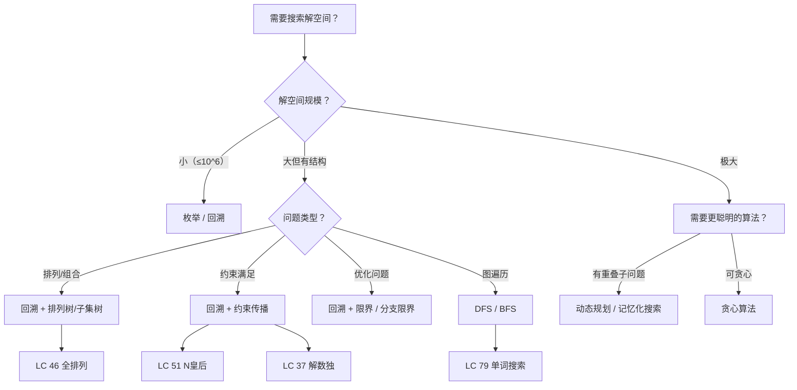
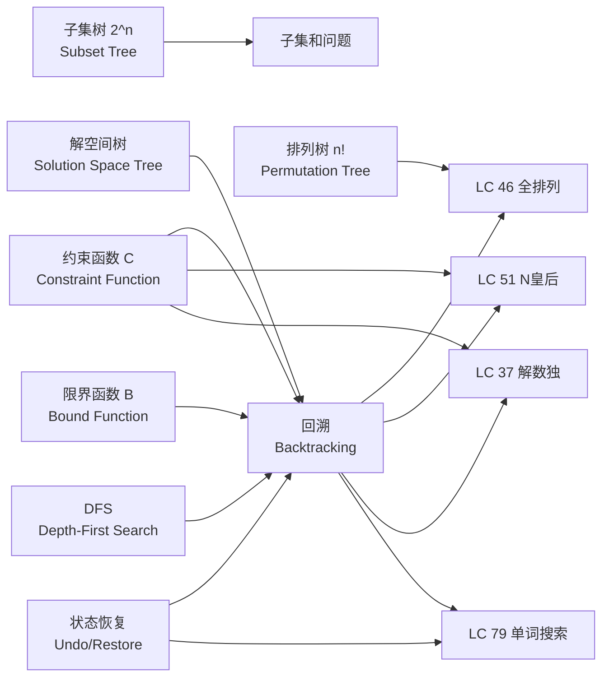
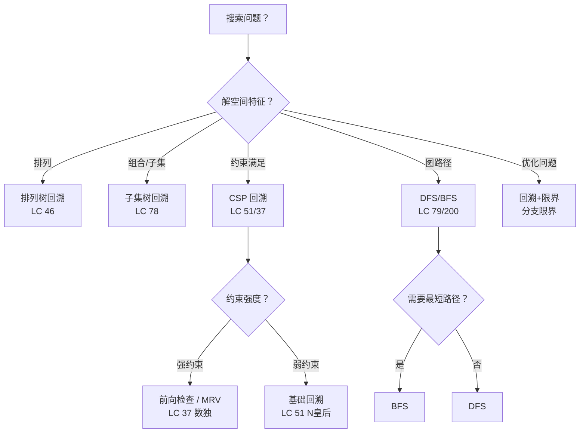
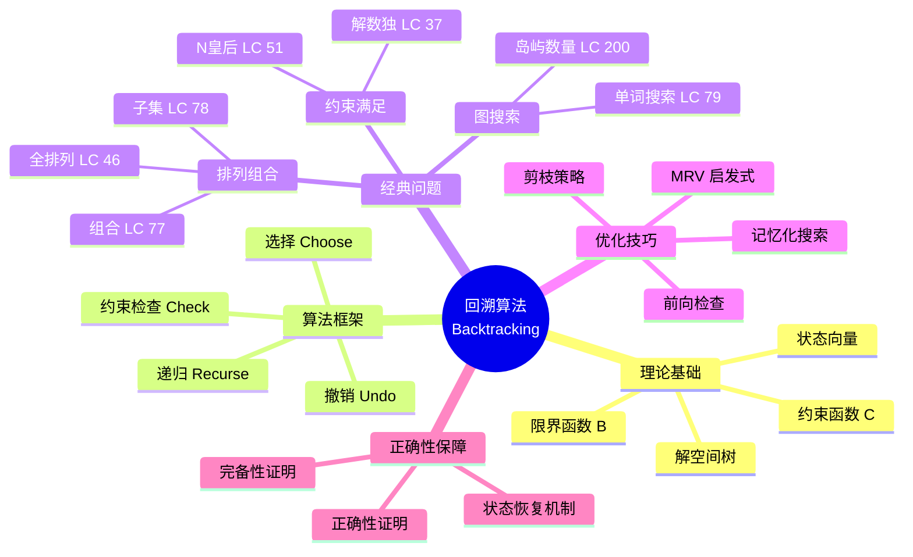

> 📊 **项目全面梳理**：详细的项目结构、模块详解和学习路径，请参阅 [`项目全面梳理-2025.md`](../../项目全面梳理-2025.md)

## 回溯与深度优先搜索 / Backtracking & Depth-First Search

### 摘要 / Executive Summary

- **回溯（Backtracking）** 是一种系统性地搜索问题解空间的通用算法策略，通过**深度优先搜索（DFS）**遍历解空间树，利用**约束函数**剪除不可行分支，利用**限界函数**剪除非最优分支。
- 本文从**形式化规约**出发，定义解空间树、状态向量、约束函数与限界函数，建立回溯算法的完整正确性证明框架：完备性（不遗漏任何可行解）与正确性（不输出非法解）。
- 通过 LeetCode 46（全排列）、51（N皇后）、37（解数独）、79（单词搜索）四道经典题目，展示回溯算法在排列生成、约束满足、约束传播与二维网格搜索中的应用模式与证明方法。

### 关键术语与符号 / Glossary

| 术语 / Term | 定义 / Definition |
|-------------|-------------------|
| 解空间树 Solution Space Tree | 以部分解为节点、以决策为边的树形结构，根节点为空解，叶子节点为完整解 |
| 状态向量 State Vector | 描述当前部分解的元组 $X = (x_1, x_2, \ldots, x_k)$，每个 $x_i$ 为一个决策变量 |
| 约束函数 Constraint Function | 判定部分解 $X$ 是否满足问题约束的布尔函数 $C(X)$，用于剪除不可行分支 |
| 限界函数 Bound Function | 判定以当前部分解 $X$ 为根的子树是否可能包含更优解的函数 $B(X)$，用于剪除非最优分支 |
| 剪枝 Pruning | 根据约束/限界函数提前终止对某子树的搜索 |
| 显式约束 Explicit Constraint | 对单个决策变量 $x_i$ 取值范围的限制（如 $x_i \in \{0,1\}$） |
| 隐式约束 Implicit Constraint | 涉及多个决策变量之间关系的约束（如数独中同行不重复） |
| 排列树 Permutation Tree | 解空间为 $n$ 个元素全排列时的解空间树，规模为 $n!$ |
| 子集树 Subset Tree | 解空间为 $n$ 个元素子集时的解空间树，规模为 $2^n$ |

术语对齐与引用规范：`docs/术语与符号总表.md`，`01-基础理论/00-撰写规范与引用指南.md`

### 目录 / Table of Contents

- [回溯与深度优先搜索 / Backtracking & Depth-First Search](#回溯与深度优先搜索--backtracking--depth-first-search)
  - [摘要 / Executive Summary](#摘要--executive-summary)
  - [关键术语与符号 / Glossary](#关键术语与符号--glossary)
  - [目录 / Table of Contents](#目录--table-of-contents)
  - [交叉引用与依赖 / Cross-References and Dependencies](#交叉引用与依赖--cross-references-and-dependencies)
  - [1. 形式化定义 / Formal Definitions](#1-形式化定义--formal-definitions)
    - [1.1 回溯问题实例](#11-回溯问题实例)
    - [1.2 解空间树](#12-解空间树)
    - [1.3 约束函数与限界函数](#13-约束函数与限界函数)
  - [2. 核心思路与算法框架](#2-核心思路与算法框架--core-ideas-and-algorithm-framework)
  - [3. 经典题目详解](#3-经典题目详解--classic-problem-analysis)
  - [4. 复杂度分析体系](#4-复杂度分析体系--complexity-analysis)
  - [5. 正确性证明框架](#5-正确性证明框架--correctness-proof-framework)
  - [6. 思维表征](#6-思维表征--thinking-representations)
  - [7. 常见错误与反模式](#7-常见错误与反模式--common-mistakes-and-anti-patterns)
  - [8. 自测问题](#8-自测问题--self-assessment-questions)
  - [9. 学习目标](#9-学习目标--learning-objectives)
  - [10. 知识导航](#10-知识导航--knowledge-navigation)
  - [参考文献](#参考文献--references)

### 交叉引用与依赖 / Cross-References and Dependencies

**上游理论依赖 / Upstream Dependencies**:

- [`09-算法理论/01-算法基础/05-图算法理论.md`](../../09-算法理论/01-算法基础/05-图算法理论.md) — 图的遍历、DFS/BFS 的理论定义与复杂度分析
- [`02-递归理论/01-递归基础.md`](../../02-递归理论/01-递归基础.md) — 递归的基本框架、终止条件与调用栈
- [`04-算法复杂度/01-时间复杂度.md`](../../04-算法复杂度/01-时间复杂度.md) — 时间复杂度 $O/\Omega/\Theta$ 的形式化定义与渐进分析
- [`13-LeetCode算法面试专题/02-算法范式专题/08-动态规划.md`](./08-动态规划.md) — 动态规划与回溯的对比（记忆化搜索的桥梁作用）

**下游应用 / Downstream Applications**:

- `13-LeetCode算法面试专题/03-数据结构专题/08-并查集.md` — 并查集在连通性检测中与 DFS 的联合应用
- `13-LeetCode算法面试专题/04-高级算法专题/01-分支限界.md` — 分支限界是回溯的扩展，引入更系统的限界策略

---

## 1. 形式化定义 / Formal Definitions

### 1.1 回溯问题实例

**定义 1.1** (回溯问题实例 / Backtracking Problem Instance) [CLRS2022]
回溯问题实例可以形式化地定义为一个六元组：
**Definition 1.1** (Backtracking Problem Instance)
A backtracking problem instance can be formally defined as a sextuple:

$$
\Pi = (D, I, O, \text{pre}, \text{post}, \text{sol})
$$

其中 / Where:

- $D = D_1 \times D_2 \times \cdots \times D_n$：决策变量域，$D_i$ 为第 $i$ 个决策变量的取值集合
- $I = \{ (D_1, \ldots, D_n, C, B) \mid C: D \rightarrow \{0,1\}, B: D \rightarrow \{0,1\} \}$：输入集合
- $O = 2^D$：输出集合，即满足约束的所有解的集合
- $\text{pre}$：前置条件（Precondition）
- $\text{post}$：后置条件（Postcondition）
- $\text{sol}$：解判定函数

**前置条件 / Precondition**:

$$
\text{pre}(D_1, \ldots, D_n) \equiv \forall i \in [1,n]: D_i \neq \emptyset
$$

即每个决策变量至少有一个可选值。

**后置条件 / Postcondition**:

$$
\text{post}(X) \equiv C(X) = 1 \land |X| = n
$$

即输出 $X$ 是完整的（所有决策变量均已赋值）且满足约束函数 $C$。

**解判定函数 / Solution Function**:

$$
\text{sol}(X) = \begin{cases}
1, & \text{if } C(X) = 1 \land |X| = n \\
0, & \text{otherwise}
\end{cases}
$$

### 1.2 解空间树

**定义 1.2** (解空间树 / Solution Space Tree) [Knuth1975]
解空间树 $T = (N, E, r)$ 是一棵有根树，其中：
**Definition 1.2** (Solution Space Tree)
The solution space tree $T = (N, E, r)$ is a rooted tree where:

- $N$ 为节点集合，每个节点对应一个**部分解** $X_k = (x_1, x_2, \ldots, x_k)$
- $E$ 为边集合，边 $(u, v)$ 表示从部分解 $X_k$ 扩展为 $X_{k+1}$ 的一次决策
- $r$ 为根节点，对应空部分解 $X_0 = ()$
- 第 $k$ 层节点对应已确定前 $k$ 个决策变量的部分解
- 叶子节点对应完整解 $X_n = (x_1, \ldots, x_n)$

**解空间规模 / Solution Space Size**:

$$
|N| \leq 1 + |D_1| + |D_1| \cdot |D_2| + \cdots + \prod_{i=1}^{n} |D_i|
$$

在最坏情况下（无剪枝），回溯需要遍历整棵解空间树。

**排列树 / Permutation Tree**: 当问题要求从 $n$ 个元素中选取全部进行排列时，$|D_i| = n - i + 1$，叶子节点数为 $n!$。

**子集树 / Subset Tree**: 当问题要求从 $n$ 个元素中选取子集时，$|D_i| = 2$，叶子节点数为 $2^n$。

### 1.3 约束函数与限界函数

**定义 1.3** (约束函数 / Constraint Function) [CLRS2022]
约束函数 $C: D \rightarrow \{0, 1\}$ 判定部分解 $X_k$ 是否满足问题的显式和隐式约束：
**Definition 1.3** (Constraint Function)

$$
C(X_k) = \begin{cases}
1, & \text{if } X_k \text{ 满足所有涉及前 } k \text{ 个变量的约束} \\
0, & \text{otherwise}
\end{cases}
$$

**性质 / Property**: 约束函数具有**单调性（Monotonicity）**：

$$
C(X_k) = 0 \rightarrow \forall X' \text{ 扩展自 } X_k: C(X') = 0
$$

即若部分解已违反约束，则其任何扩展都不可能成为可行解。此性质是剪枝正确性的基础。

**定义 1.4** (限界函数 / Bound Function) [Horowitz1978]
限界函数 $B: D \rightarrow \{0, 1\}$ 用于优化问题，判定以当前部分解 $X_k$ 为根的子树是否可能包含更优解：
**Definition 1.4** (Bound Function)

$$
B(X_k) = \begin{cases}
1, & \text{if 子树中可能存在优于当前最优解的解} \\
0, & \text{otherwise}
\end{cases}
$$

> **注 / Note**: 限界函数仅用于**优化问题**。对于判定问题或求所有解的问题，仅需约束函数即可。

---

## 2. 核心思路与算法框架 / Core Ideas and Algorithm Framework

### 2.1 回溯算法通用模板

回溯算法的本质是**带剪枝的深度优先搜索**。通用框架如下：

```text
Backtrack(k):
    // k 为当前决策层数
    if k > n:
        Output(X)       // 找到一个完整解
        return

    for each value v in D_k:
        x_k ← v
        if C(X_k) = 1:          // 约束检查
            if B(X_k) = 1:      // 限界检查（优化问题）
                Backtrack(k + 1)
        // 隐式恢复：x_k 将在下一次循环中被覆盖
```

**关键步骤 / Key Steps**:

1. **选择（Choose）**: 为当前决策变量 $x_k$ 选择一个候选值 $v \in D_k$
2. **约束检查（Constraint Check）**: 验证部分解 $X_k$ 是否满足约束 $C(X_k)$
3. **限界检查（Bound Check）**: （优化问题）验证子树是否可能包含更优解
4. **递归（Recurse）**: 若通过检查，递归搜索下一层 $k+1$
5. **撤销（Undo）**: 恢复状态，尝试下一个候选值

### 2.2 DFS 与回溯的关系

| 维度 / Dimension | DFS | 回溯 |
|-----------------|-----|------|
| 搜索目标 | 遍历/搜索图中的节点 | 搜索解空间中的可行解 |
| 数据结构 | 图 $G = (V, E)$ | 解空间树 $T = (N, E)$ |
| 访问标记 | `visited[v]` | 当前路径中的已选元素 |
| 剪枝策略 | 无（纯遍历） | 约束函数 + 限界函数 |
| 典型应用 | 连通分量、拓扑排序 | 排列、组合、约束满足 |

**核心洞察 / Core Insight**: 回溯 = DFS + 约束剪枝 + 状态恢复（Undo）

### 2.3 状态恢复机制

回溯算法要求**搜索路径上的状态修改必须在回溯时被撤销**，以保证兄弟子树的状态一致性。

```text
// 正确：显式恢复
for v in candidates:
    state.add(v)        // 做选择
    backtrack(k + 1)
    state.remove(v)     // 撤销选择 ⬅️ 关键！
```

```text
// 错误：未恢复状态
for v in candidates:
    state.add(v)        // 做选择
    backtrack(k + 1)
    // ❌ 忘记撤销，导致状态污染
```

### 2.4 算法选择决策树



---

## 3. 经典题目详解 / Classic Problem Analysis

### 3.1 LeetCode 46 — 全排列

> **题目链接 / Problem Link**: [LeetCode 46. Permutations](https://leetcode.com/problems/permutations/)
> **难度 / Difficulty**: Medium

#### 形式化规约 / Formal Specification

**前置条件 / Precondition**:

$$
\text{pre}(\textit{nums}) \equiv \textit{nums} \in \mathbb{Z}^n \land n \geq 0 \land \forall i \neq j: \textit{nums}[i] \neq \textit{nums}[j]
$$

即输入为**无重复元素**的整数数组（LeetCode 约束保证元素互异）。

**后置条件 / Postcondition**:

$$
\text{post}(\textit{nums}, \textit{result}) \equiv \forall P \in \textit{Perm}(\textit{nums}): P \in \textit{result} \land |\textit{result}| = n!
$$

即输出包含输入数组的所有 $n!$ 个排列，且无重复。

**解空间树 / Solution Space Tree**:

对于 $nums = [1, 2, 3]$，解空间树为排列树：

```
                    ()
                   / | \
                  /  |  \
                 1   2   3
                / \  / \  / \
               2  3 1  3 1  2
               |  | |  | |  |
               3  2 3  1 2  1
```

**约束函数 / Constraint Function**:

$$
C(X_k) \equiv \forall i, j \in [1, k]: i \neq j \rightarrow x_i \neq x_j
$$

即部分排列中不能有重复元素。由于输入元素互异，此约束简化为：$x_k$ 不能在 $X_{k-1}$ 中出现过。

#### 核心思路 / Core Idea

采用排列树模板，维护一个 `used` 数组标记已选元素。对于第 $k$ 层，从所有未使用的元素中选择一个作为 $x_k$，递归构建剩余部分。

#### 代码实现 / Code Implementations

- **Rust**: [`examples/algorithms-rust/src/leetcode/lc0046_permutations.rs`](../../../../examples/algorithms-rust/src/leetcode/lc0046_permutations.rs)
- **Python**: [`examples/algorithms-python/leetcode/lc0046_permutations.py`](../../../../examples/algorithms-python/leetcode/lc0046_permutations.py)
- **Go**: [`examples/algorithms-go/leetcode/lc0046_permutations.go`](../../../../examples/algorithms-go/leetcode/lc0046_permutations.go)

#### 复杂度分析 / Complexity Analysis

| 指标 / Metric | 值 / Value | 说明 / Note |
|--------------|-----------|------------|
| 时间复杂度 / Time | $O(n \cdot n!)$ | 共 $n!$ 个叶子，每片叶子复制耗时 $O(n)$ |
| 空间复杂度 / Space | $O(n)$ | 递归栈深度 + `used` 数组 + 当前路径 |
| 解空间节点数 / Nodes | $\sum_{k=0}^{n} \frac{n!}{(n-k)!}$ | 排列树总节点数 |

**严格推导 / Rigorous Derivation**:

排列树中第 $k$ 层有 $P(n, k) = \frac{n!}{(n-k)!}$ 个节点。总节点数：

$$
\sum_{k=0}^{n} P(n, k) = \sum_{k=0}^{n} \frac{n!}{(n-k)!} = n! \sum_{k=0}^{n} \frac{1}{k!} \leq n! \cdot e = O(n!)
$$

每个叶子节点的处理（复制到结果集）耗时 $O(n)$，因此总时间 $O(n \cdot n!)$。

#### 正确性证明 / Correctness Proof

**定理 3.1.1** (LeetCode 46 完备性): 算法输出包含输入数组的所有 $n!$ 个排列。
**Theorem 3.1.1** (Completeness of LeetCode 46): The algorithm outputs all $n!$ permutations of the input array.

**证明 / Proof**:

**归纳法 / Induction**:

**基础 / Base**: $n = 0$ 或 $n = 1$ 时，算法正确返回空排列或单元素排列。

**归纳假设 / Inductive Hypothesis**: 假设算法能正确生成 $k$ 个元素的所有 $k!$ 个排列。

**归纳步骤 / Inductive Step**: 对于 $n$ 个元素，算法在第 1 层依次选择每个元素 $nums[i]$ 作为首元素。对于每个选择，递归生成剩余 $n-1$ 个元素的所有 $(n-1)!$ 个排列。由归纳假设，这些递归调用正确。因此总排列数为 $n \times (n-1)! = n!$，且每个排列恰好出现一次（由 `used` 数组保证不重复选择同一元素）。$\square$

**定理 3.1.2** (LeetCode 46 正确性): 算法输出的每个排列都是输入数组的一个合法排列。
**Theorem 3.1.2** (Correctness of LeetCode 46): Every output of the algorithm is a valid permutation of the input array.

**证明 / Proof**:

由约束函数 $C(X_k)$，每个部分解中元素不重复。当 $|X| = n$ 时，$X$ 包含 $n$ 个互不相同的元素，且均来自 $nums$（由候选集限制）。由于 $|nums| = n$ 且元素互异，$X$ 必为 $nums$ 的一个排列。$\square$

---

### 3.2 LeetCode 51 — N皇后

> **题目链接 / Problem Link**: [LeetCode 51. N-Queens](https://leetcode.com/problems/n-queens/)
> **难度 / Difficulty**: Hard

#### 形式化规约 / Formal Specification

**前置条件 / Precondition**:

$$
\text{pre}(n) \equiv n \in \mathbb{Z}^+ \land 1 \leq n \leq 9
$$

**后置条件 / Postcondition**:

设解为 $n \times n$ 棋盘上的皇后位置集合 $Q = \{(r_1, c_1), \ldots, (r_n, c_n)\}$：

$$
\text{post}(n, Q) \equiv \forall i \neq j: \begin{cases}
r_i \neq r_j & \text{（不同行）} \\
c_i \neq c_j & \text{（不同列）} \\
|r_i - r_j| \neq |c_i - c_j| & \text{（不同对角线）}
\end{cases}
$$

**状态向量 / State Vector**:

采用一维数组 $X = (x_1, x_2, \ldots, x_n)$，其中 $x_i$ 表示第 $i$ 行皇后所在的列号。

**解空间树 / Solution Space Tree**: 每行选择一个列，共 $n$ 层，每层 $n$ 个分支。

#### 核心思路 / Core Idea

逐行放置皇后。对于第 $k$ 行，尝试每一列 $c \in [1, n]$，检查是否与已放置的 $k-1$ 个皇后冲突。若放置合法，递归处理第 $k+1$ 行。

**对角线检测的形式化 / Formal Diagonal Detection**:

对于已放置的皇后 $(r_i, x_i)$ 和新皇后 $(k, c)$：

$$
\text{冲突} \equiv c = x_i \lor |k - r_i| = |c - x_i|
$$

即同列冲突或同对角线冲突（主对角线/反对角线）。

**对角线集合的数学性质 / Mathematical Property**:

- 主对角线（从左上到右下）：$r - c = \text{const}$
- 反对角线（从右上到左下）：$r + c = \text{const}$

因此可以用三个集合分别记录已占用的列、主对角线、反对角线，实现 $O(1)$ 冲突检测。

#### 代码实现 / Code Implementations

```python
# Python 参考实现
def solveNQueens(n: int) -> list[list[str]]:
    res = []
    board = [['.' for _ in range(n)] for _ in range(n)]

    def backtrack(row: int, cols: set, diag1: set, diag2: set):
        if row == n:
            res.append([''.join(r) for r in board])
            return
        for col in range(n):
            d1, d2 = row - col, row + col
            if col in cols or d1 in diag1 or d2 in diag2:
                continue
            board[row][col] = 'Q'
            cols.add(col); diag1.add(d1); diag2.add(d2)
            backtrack(row + 1, cols, diag1, diag2)
            board[row][col] = '.'
            cols.remove(col); diag1.remove(d1); diag2.remove(d2)

    backtrack(0, set(), set(), set())
    return res
```

#### 复杂度分析 / Complexity Analysis

| 指标 / Metric | 值 / Value | 说明 / Note |
|--------------|-----------|------------|
| 时间复杂度 / Time | $O(n!)$（最坏） | 实际远小于 $n!$  due to 剪枝 |
| 空间复杂度 / Space | $O(n)$ | 递归栈深度 + 棋盘状态 |
| 解的数量 / Solutions | 见下表 | 随 $n$ 增长极快 |

**N皇后解的数量 / Number of Solutions**:

| $n$ | 解的数量 | 有效节点比例 |
|-----|---------|------------|
| 4 | 2 | ~8% |
| 8 | 92 | ~0.4% |
| 9 | 352 | ~0.1% |
| 10 | 724 | ~0.02% |

> 有效节点比例 = 实际访问节点数 / 解空间树总节点数 $n^n$，体现了剪枝的强大效果。

#### 正确性证明 / Correctness Proof

**定理 3.2.1** (LeetCode 51 完备性): 算法找到 $n$ 皇后问题的所有解。
**Theorem 3.2.1** (Completeness): The algorithm finds all solutions to the $n$-queens problem.

**证明 / Proof**:

采用归纳法证明算法遍历了所有可行的皇后放置方案。

**归纳假设**: 对于前 $k-1$ 行，算法已经遍历了所有不冲突的部分放置方案。

**归纳步骤**: 对于第 $k$ 行，算法尝试每一列 $c \in [0, n-1]$。若 $(k, c)$ 与已放置的 $k-1$ 个皇后不冲突，则递归处理第 $k+1$ 行。由归纳假设，递归调用会遍历所有以当前部分放置为前提的可行扩展。因此，算法在第 $k$ 层完整地探索了所有合法分支。

由数学归纳法，当 $k = n$ 时，算法遍历了所有合法的完整放置方案，即所有解。$\square$

**定理 3.2.2** (LeetCode 51 正确性): 算法输出的每个方案都是合法的 $n$ 皇后解。
**Theorem 3.2.2** (Correctness): Every output of the algorithm is a valid $n$-queens solution.

**证明 / Proof**:

算法仅在以下条件同时满足时才将当前棋盘加入结果：

1. 已放置 $n$ 个皇后（逐行放置保证每行恰好一个）
2. 每次放置前通过冲突检测：新皇后与所有已放置皇后不同列、不同主对角线、不同反对角线

因此输出方案满足 $n$ 皇后问题的全部约束。$\square$

---

### 3.3 LeetCode 37 — 解数独

> **题目链接 / Problem Link**: [LeetCode 37. Sudoku Solver](https://leetcode.com/problems/sudoku-solver/)
> **难度 / Difficulty**: Hard

#### 形式化规约 / Formal Specification

**前置条件 / Precondition**:

$$
\text{pre}(\textit{board}) \equiv \textit{board} \in \{'.', '1', \ldots, '9'\}^{9 \times 9} \land \text{初始board满足数独约束}
$$

**后置条件 / Postcondition**:

$$
\text{post}(\textit{board}) \equiv \forall i, j: \textit{board}[i][j] \in \{'1', \ldots, '9'\} \land \text{行/列/宫约束满足}
$$

**约束传播 / Constraint Propagation**:

数独的约束可形式化为：

$$
\forall v \in \{'1', \ldots, '9'\}: \begin{cases}
\forall r \in [0,8]: \sum_{c=0}^{8} [\textit{board}[r][c] = v] \leq 1 & \text{（行约束）} \\
\forall c \in [0,8]: \sum_{r=0}^{8} [\textit{board}[r][c] = v] \leq 1 & \text{（列约束）} \\
\forall b \in [0,8]: \sum_{(r,c) \in \text{block}(b)} [\textit{board}[r][c] = v] \leq 1 & \text{（宫约束）}
\end{cases}
$$

其中 $\text{block}(b)$ 表示第 $b$ 个 $3 \times 3$ 宫格内的所有坐标。

#### 核心思路 / Core Idea

数独求解采用**约束传播 + 回溯**的混合策略（即 Donald Knuth 所称的 Dancing Links / Algorithm X 的简化版）：

1. **选择空单元格**: 找到下一个待填的空格（`.`）
2. **候选值筛选**: 根据行/列/宫约束，筛选出当前空格的合法候选值
3. **约束传播（前向检查）**: 尝试填入候选值后，检查是否导致其他空格无合法候选值（死路）
4. **递归/回溯**: 若约束传播通过，递归求解；否则回溯，尝试下一个候选值

**MRV 启发式（Minimum Remaining Values）**: 优先选择候选值最少的空格，可显著减少搜索空间。

#### 代码实现 / Code Implementations

```rust
// Rust 参考实现
fn solve_sudoku(board: &mut Vec<Vec<char>>) -> bool {
    fn is_valid(board: &Vec<Vec<char>>, row: usize, col: usize, ch: char) -> bool {
        for i in 0..9 {
            if board[row][i] == ch || board[i][col] == ch { return false; }
            let br = 3 * (row / 3) + i / 3;
            let bc = 3 * (col / 3) + i % 3;
            if board[br][bc] == ch { return false; }
        }
        true
    }

    fn solve(board: &mut Vec<Vec<char>>) -> bool {
        for r in 0..9 {
            for c in 0..9 {
                if board[r][c] != '.' { continue; }
                for ch in '1'..='9' {
                    if is_valid(board, r, c, ch) {
                        board[r][c] = ch;
                        if solve(board) { return true; }
                        board[r][c] = '.'; // 回溯
                    }
                }
                return false; // 无合法候选值
            }
        }
        true // 所有格子已填
    }

    solve(board)
}
```

#### 复杂度分析 / Complexity Analysis

| 指标 / Metric | 值 / Value | 说明 / Note |
|--------------|-----------|------------|
| 时间复杂度 / Time | $O(9^m)$（最坏） | $m$ 为空格数，每个空格最多 9 种选择 |
| 空间复杂度 / Space | $O(m)$ | 递归栈深度，$m \leq 81$ |
| 实际性能 / Practical | 远优于 $O(9^m)$ | 约束传播大幅减少分支 |

**剪枝效率分析 / Pruning Efficiency**:

数独的强约束（每行/列/宫恰好出现 1-9 各一次）使得实际搜索空间远小于理论上限。对于合法数独题目，通常只需回溯数十到数百次即可求解。

#### 正确性证明 / Correctness Proof

**定理 3.3.1** (LeetCode 37 完备性): 若数独有解，算法必能找到至少一个解。
**Theorem 3.3.1** (Completeness): If the Sudoku puzzle has a solution, the algorithm finds at least one.

**证明 / Proof**:

设解空间为所有将空格填充为数字的方案。算法按某种顺序遍历空格，对每个空格尝试所有合法候选值。由于数独的初始状态合法，且每次填入均保持合法性（`is_valid` 检查），算法实际遍历的是**所有合法的部分填充方案构成的子树**。

若数独有解 $S^*$，则 $S^*$ 对应解空间树中从根到某个叶子的一条路径。由于算法在每个节点遍历所有合法分支（不遗漏任何合法候选值），$S^*$ 所在的分支必然被访问。因此算法必能找到 $S^*$。$\square$

**定理 3.3.2** (LeetCode 37 正确性): 算法输出的填充方案满足数独的所有约束。
**Theorem 3.3.2** (Correctness): The filled board output by the algorithm satisfies all Sudoku constraints.

**证明 / Proof**:

算法仅在 `is_valid(board, r, c, ch)` 返回 `true` 时才填入数字。`is_valid` 检查行、列、宫三个约束，因此每次填入后 board 仍满足数独约束。由归纳法，任意递归深度的 board 都满足约束。当算法返回 `true` 时，所有空格均已填充，故完整 board 满足所有约束。$\square$

---

### 3.4 LeetCode 79 — 单词搜索

> **题目链接 / Problem Link**: [LeetCode 79. Word Search](https://leetcode.com/problems/word-search/)
> **难度 / Difficulty**: Medium

#### 形式化规约 / Formal Specification

**前置条件 / Precondition**:

$$
\text{pre}(\textit{board}, \textit{word}) \equiv \textit{board} \in \Sigma^{m \times n} \land \textit{word} \in \Sigma^k \land m, n, k \geq 1
$$

**后置条件 / Postcondition**:

$$
\text{post}(\textit{board}, \textit{word}, \textit{result}) \equiv \textit{result} = \text{True} \leftrightarrow \exists \text{ 路径 } P: \textit{board}[P] = \textit{word}
$$

其中路径 $P = ((r_1, c_1), \ldots, (r_k, c_k))$ 满足：

- 相邻坐标在四个方向之一上相邻：$|r_{i+1} - r_i| + |c_{i+1} - c_i| = 1$
- 坐标不重复使用：$\forall i \neq j: (r_i, c_i) \neq (r_j, c_j)$

#### 核心思路 / Core Idea

将单词的每个字符视为 DFS 的一层。从 board 中每个与 `word[0]` 匹配的单元格出发，进行深度优先搜索，尝试按顺序匹配 `word` 的所有字符。

**访问标记不变式 / Visited Mark Invariant**:

设当前搜索路径为 $P_k = ((r_1, c_1), \ldots, (r_k, c_k))$，访问标记数组 `visited` 满足：

$$
Inv(k): \forall (r, c): \textit{visited}[r][c] = 1 \leftrightarrow (r, c) \in P_k
$$

即 `visited` 精确记录当前 DFS 路径上的所有坐标。

**状态恢复 / State Restoration**:

```text
// 做选择
visited[r][c] = true
// 递归搜索
dfs(r, c, index + 1)
// 撤销选择 ⬅️ 关键！
visited[r][c] = false
```

#### 代码实现 / Code Implementations

```go
// Go 参考实现
func exist(board [][]byte, word string) bool {
    m, n := len(board), len(board[0])
    visited := make([][]bool, m)
    for i := range visited { visited[i] = make([]bool, n) }

    var dfs func(r, c, idx int) bool
    dfs = func(r, c, idx int) bool {
        if idx == len(word) { return true }
        if r < 0 || r >= m || c < 0 || c >= n { return false }
        if visited[r][c] || board[r][c] != word[idx] { return false }

        visited[r][c] = true
        found := dfs(r+1, c, idx+1) || dfs(r-1, c, idx+1) ||
                 dfs(r, c+1, idx+1) || dfs(r, c-1, idx+1)
        visited[r][c] = false // 回溯
        return found
    }

    for r := 0; r < m; r++ {
        for c := 0; c < n; c++ {
            if board[r][c] == word[0] && dfs(r, c, 0) {
                return true
            }
        }
    }
    return false
}
```

#### 复杂度分析 / Complexity Analysis

| 指标 / Metric | 值 / Value | 说明 / Note |
|--------------|-----------|------------|
| 时间复杂度 / Time | $O(m \cdot n \cdot 4^k)$（最坏） | 每个起点，4 方向搜索深度 $k$ |
| 空间复杂度 / Space | $O(k)$ | 递归栈深度（路径长度） |
| 剪枝优化 / Pruning | 字符不匹配时立即返回 | 实际远优于最坏情况 |

**更紧的上界 / Tighter Bound**:

由于 `visited` 限制不能走回头路，从第 2 步开始只有 3 个方向可选（排除来路）。因此 tighter bound 为 $O(m \cdot n \cdot 3^k)$。

#### 正确性证明 / Correctness Proof

**定理 3.4.1** (LeetCode 79 完备性): 若 board 中存在单词 `word` 的路径，算法必返回 `true`。
**Theorem 3.4.1** (Completeness): If a path for `word` exists in `board`, the algorithm returns `true`.

**证明 / Proof**:

设存在合法路径 $P^* = ((r_1, c_1), \ldots, (r_k, c_k))$。算法会遍历 board 中所有与 `word[0]` 匹配的单元格作为起点，因此必然在某次外层循环中选择 $(r_1, c_1)$ 作为起点。

在内层 DFS 中，算法从当前坐标向四个方向扩展。由于 $P^*$ 是合法路径，$(r_2, c_2)$ 必在 $(r_1, c_1)$ 的四个邻居中，且 `visited` 初始为 false，因此 DFS 会沿着 $P^*$ 的方向递归。由归纳法，DFS 可以完整地遍历 $P^*$ 的所有坐标，最终 `idx == len(word)` 返回 `true`。$\square$

**定理 3.4.2** (LeetCode 79 正确性): 若算法返回 `true`，则 board 中必存在单词 `word` 的合法路径。
**Theorem 3.4.2** (Correctness): If the algorithm returns `true`, a valid path for `word` exists in `board`.

**证明 / Proof**:

算法仅在 `idx == len(word)` 时返回 `true`。此时 DFS 已按顺序访问了 `word` 的每个字符，且每次访问的坐标满足：

1. 字符匹配（`board[r][c] == word[idx]`）
2. 坐标在 board 范围内
3. 坐标未被访问过（`visited[r][c] == false`）

由 `visited` 的不变式 $Inv(k)$，路径上的坐标互不重复。由 DFS 的递归结构，相邻坐标在四个方向上相邻。因此形成的路径满足所有约束。$\square$

---

## 4. 复杂度分析体系 / Complexity Analysis

### 4.1 最坏情况复杂度

**定理 4.1** (回溯最坏时间复杂度): 对于解空间规模为 $S$ 的问题，回溯算法的最坏时间复杂度为 $O(S \cdot P(n))$，其中 $P(n)$ 为每个节点的处理时间。
**Theorem 4.1** (Worst-Case Time Complexity of Backtracking): For a problem with solution space size $S$, backtracking has worst-case time complexity $O(S \cdot P(n))$.

**证明 / Proof**:

最坏情况下（无剪枝或剪枝无效），回溯需要遍历解空间树的所有节点。设解空间树有 $S$ 个节点，每个节点的处理时间为 $P(n)$（包括约束检查、状态更新等），则总时间为 $O(S \cdot P(n))$。$\square$

对于不同类型的问题：

| 问题类型 | 解空间规模 $S$ | 示例 |
|---------|--------------|------|
| 排列问题 | $O(n!)$ | LC 46 全排列 |
| 组合/子集问题 | $O(2^n)$ | 子集和 |
| 树形搜索 | $O(b^d)$ | $b$ 为分支因子，$d$ 为深度 |
| 约束满足（CSP） | $O(d^n)$ | $d$ 为变量域大小，$n$ 为变量数 |

### 4.2 剪枝效率的形式化讨论

**定义 4.1** (剪枝效率 / Pruning Efficiency)
剪枝效率 $\eta$ 定义为被剪除的节点数与解空间树总节点数的比值：

$$
\eta = 1 - \frac{N_{\text{visited}}}{N_{\text{total}}}
$$

其中 $N_{\text{visited}}$ 为实际访问的节点数，$N_{\text{total}}$ 为解空间树总节点数。

**定理 4.2** (强约束问题的剪枝效率): 若约束函数 $C$ 满足：对于随机部分解，$\Pr[C(X_k) = 1] = p_k$，则期望访问的叶子节点数为：

$$
E[N_{\text{leaf}}] = \prod_{k=1}^{n} |D_k| \cdot p_k
$$

**证明 / Proof**:

在解空间树的第 $k$ 层，每个节点有 $|D_k|$ 个分支，其中期望有 $|D_k| \cdot p_k$ 个分支通过约束检查。因此从根到叶子的期望路径数为 $\prod_{k=1}^{n} |D_k| \cdot p_k$。$\square$

**应用 / Application**: 对于 N 皇后问题，$p_k \approx (n-k)/n$（粗略估计），因此期望叶子数远小于 $n^n$。

### 4.3 空间复杂度

回溯算法的空间复杂度主要由三部分组成：

1. **递归栈空间**: $O(h)$，$h$ 为解空间树高度（通常为 $n$）
2. **当前路径/状态**: $O(n)$，存储当前部分解
3. **辅助数据结构**: $O(n)$ 或 $O(1)$，如 `used` 数组、集合等

总空间复杂度：$O(n)$（迭代实现）或 $O(n)$ 递归栈（递归实现）。

---

## 5. 正确性证明框架 / Correctness Proof Framework

### 5.1 回溯完备性定理

**定理 5.1** (回溯完备性 / Backtracking Completeness) [CLRS2022]
若约束函数 $C$ 满足单调性（定义 1.3），则回溯算法不会遗漏任何可行解。
**Theorem 5.1** (Backtracking Completeness)
If the constraint function $C$ satisfies monotonicity (Definition 1.3), backtracking does not miss any feasible solution.

**证明 / Proof**:

设 $X^*$ 为任意可行解。我们证明回溯算法必访问到 $X^*$ 对应的叶子节点。

**归纳法 / Induction on depth $k$**:

**基础 / Base ($k=0$)**: 根节点 $X_0 = ()$ 被访问，且 $C(X_0) = 1$（空解满足任何约束）。

**归纳假设 / Inductive Hypothesis**: 假设部分解 $X_{k-1}^* = (x_1^*, \ldots, x_{k-1}^*)$ 被访问。

**归纳步骤 / Inductive Step**: 在节点 $X_{k-1}^*$ 处，算法遍历 $D_k$ 中的所有值。由于 $X^*$ 是可行解，$x_k^* \in D_k$ 且 $C(X_k^*) = 1$。由约束函数的单调性，$C(X_{k-1}^*) = 1$（因为 $X_k^*$ 扩展自 $X_{k-1}^*$ 且可行）。因此算法不会在第 $k-1$ 层剪除 $X_{k-1}^*$，且在第 $k$ 层会尝试 $x_k^*$，从而访问 $X_k^*$。

由数学归纳法，$X_n^* = X^*$ 被访问。$\square$

### 5.2 回溯正确性定理

**定理 5.2** (回溯正确性 / Backtracking Correctness)
回溯算法输出的每个解都满足约束函数 $C$。
**Theorem 5.2** (Backtracking Correctness)
Every solution output by backtracking satisfies the constraint function $C$.

**证明 / Proof**:

算法仅在 $C(X_k) = 1$ 时才继续递归。当到达叶子节点 $X_n$ 时，由递归结构，$C(X_n) = 1$ 且 $C$ 的单调性保证了路径上所有祖先节点也满足约束。因此输出的 $X_n$ 满足所有约束。$\square$

### 5.3 完备性与正确性的统一

**推论 5.3** (回溯的可靠性与完备性)
若约束函数 $C$ 满足单调性，则回溯算法是**可靠的（Sound）**和**完备的（Complete）**：

- 可靠性：输出的每个解都是可行解（定理 5.2）
- 完备性：所有可行解都会被输出（定理 5.1）

### 5.4 证明树

```mermaid
flowchart TD
    A[约束函数 C 满足单调性] --> B[定理 5.1: 完备性]
    A --> C[定理 5.2: 正确性]
    B --> D[推论 5.3: 可靠且完备]
    C --> D

    B --> E[归纳证明:<br/>k=0 根节点被访问<br/>假设 X_{k-1} 被访问<br/>则 X_k 被访问]
    C --> F[递归结构保证:<br/>仅当 C(X_k)=1 时继续<br/>叶子节点满足 C]

    style A fill:#e1f5e1
    style D fill:#d4edda
```

---

## 6. 思维表征 / Thinking Representations

### 6.1 概念依赖图



### 6.2 算法选择决策树



### 6.3 多维矩阵对比表

| 维度 / Dimension | LC 46 全排列 | LC 51 N皇后 | LC 37 解数独 | LC 79 单词搜索 |
|----------------|-------------|-------------|-------------|---------------|
| **解空间类型** | 排列树 $n!$ | $n$ 层 $n$ 叉树 | CSP（9×9 变量） | 网格图路径 |
| **约束函数** | 元素不重复 | 行/列/对角线不冲突 | 行/列/宫不重复 | 字符匹配+不重复访问 |
| **限界函数** | 无 | 无 | 无 | 无 |
| **状态恢复** | `used` 数组 | 棋盘标记 | 格子重置 | `visited` 数组 |
| **剪枝效率** | 无（需遍历所有解） | 高（>99% 节点） | 极高（约束传播） | 中（字符不匹配） |
| **时间复杂度** | $O(n \cdot n!)$ | $O(n!)$（实际远小） | $O(9^m)$（实际远小） | $O(mn \cdot 3^k)$ |
| **空间复杂度** | $O(n)$ | $O(n)$ | $O(m)$ | $O(k)$ |
| **核心技巧** | 排列生成 | 对角线集合优化 | 约束传播/MRV | 访问标记不变式 |

### 6.4 思维导图：回溯算法体系



### 6.5 公理定理证明树

```mermaid
flowchart BT
    A1[公理: 约束单调性<br/>C(X_k)=0 → C(X')=0] --> B1[定理 5.1: 完备性<br/>不遗漏解]
    A2[公理: 解空间树完整性] --> B1
    A1 --> B2[定理 5.2: 正确性<br/>不输出非法解]
    A3[公理: DFS 遍历完备性] --> B1

    B1 --> C[推论 5.3: 可靠且完备]
    B2 --> C

    C --> D[应用: LC 46/51/37/79<br/>全部正确]

    E[引理: 状态恢复正确性<br/>Undo 保持兄弟子树独立] --> F[单词搜索正确性]

    style B1 fill:#e1f5e1
    style B2 fill:#e1f5e1
    style C fill:#d4edda
```

---

## 7. 常见错误与反模式 / Common Mistakes and Anti-Patterns

### 7.1 忘记状态恢复（Undo）

**错误 / Mistake**: 递归返回后未撤销当前层的状态修改。

```python
# ❌ 错误：未恢复 used 标记
def backtrack(nums, path, used):
    if len(path) == len(nums):
        res.append(path[:])
        return
    for i in range(len(nums)):
        if used[i]: continue
        used[i] = True
        path.append(nums[i])
        backtrack(nums, path, used)
        path.pop()
        # ❌ 忘记 used[i] = False
```

**修复 / Fix**:

```python
# ✅ 正确：完整恢复
def backtrack(nums, path, used):
    if len(path) == len(nums):
        res.append(path[:])
        return
    for i in range(len(nums)):
        if used[i]: continue
        used[i] = True
        path.append(nums[i])
        backtrack(nums, path, used)
        path.pop()
        used[i] = False  # ✅ 恢复标记
```

### 7.2 路径引用问题

**错误 / Mistake**: 将列表引用直接加入结果，而非复制。

```python
# ❌ 错误：path 是引用，后续修改会影响已加入的结果
res.append(path)
```

**修复 / Fix**:

```python
# ✅ 正确：复制路径
res.append(path[:])  # 或 list(path) / path.copy()
```

### 7.3 重复解问题

**错误 / Mistake**: 输入有重复元素时产生重复排列/组合。

**修复策略 / Fix Strategy**:

```python
# 对数组排序，跳过同一层中重复的元素
nums.sort()
for i in range(len(nums)):
    if i > 0 and nums[i] == nums[i-1] and not used[i-1]:
        continue  # 跳过重复
```

### 7.4 访问标记与坐标越界

**错误 / Mistake**: 在单词搜索等网格 DFS 中，先标记 `visited` 再检查边界，导致越界访问。

```python
# ❌ 错误：先标记再检查
visited[r][c] = True  # 可能越界！
if not (0 <= r < m and 0 <= c < n):
    return
```

**修复 / Fix**:

```python
# ✅ 正确：先检查边界和字符匹配
if not (0 <= r < m and 0 <= c < n) or visited[r][c] or board[r][c] != word[idx]:
    return
visited[r][c] = True
```

### 7.5 数独求解的死循环

**错误 / Mistake**: 数独回溯时，遍历所有格子（包括已填充的），导致无限递归。

**修复 / Fix**: 只遍历空单元格（`.`），已填充的格子跳过。

---

## 8. 自测问题 / Self-Assessment Questions

### 问题 1：约束函数的单调性

**Q**: 为什么约束函数必须满足单调性（$C(X_k) = 0 \rightarrow C(X') = 0$）？如果不满足会有什么后果？

**A**: 单调性是剪枝正确性的基础。若部分解 $X_k$ 已违反约束，则其任何扩展 $X'$ 都不可能成为可行解——此时剪除该分支是安全的。若约束函数不满足单调性，则可能出现"部分解不合法但完整解合法"的情况，导致合法解被错误剪除，破坏完备性。例如，若约束为"所有已选元素之和 $\leq$ 目标值"，这是单调的；但若约束为"已选元素之和恰好等于某个波动值"，则不单调，不能用于剪枝。

---

### 问题 2：排列树与子集树

**Q**: 全排列问题（LC 46）和子集和问题分别对应什么类型的解空间树？它们的规模分别是多少？

**A**:

- **全排列问题**对应**排列树**，规模为 $n!$（叶子数）。总节点数为 $\sum_{k=0}^{n} P(n, k) = O(n!)$。
- **子集和问题**对应**子集树**，规模为 $2^n$（叶子数）。总节点数为 $\sum_{k=0}^{n} C(n, k) = 2^n$。

排列树中每层分支数递减（$n, n-1, \ldots, 1$），子集树中每层分支数恒为 2（选/不选）。

---

### 问题 3：N 皇后的对角线检测

**Q**: N 皇后问题中，为什么可以用 $r - c$ 和 $r + c$ 来检测对角线冲突？给出数学证明。

**A**:

- **主对角线**（从左上到右下）：同一条主对角线上的点满足 $r - c = \text{const}$。因为沿主对角线移动时，行号和列号同步增减，差值不变。
- **反对角线**（从右上到左下）：同一条反对角线上的点满足 $r + c = \text{const}$。因为沿反对角线移动时，行增列减（或反之），和值不变。

因此，两个皇后 $(r_1, c_1)$ 和 $(r_2, c_2)$ 对角线冲突当且仅当：

$$
r_1 - c_1 = r_2 - c_2 \lor r_1 + c_1 = r_2 + c_2
$$

即 $|r_1 - r_2| = |c_1 - c_2|$。

---

### 问题 4：回溯与 DFS 的区别

**Q**: 回溯算法和深度优先搜索（DFS）有什么本质区别？

**A**:

| 维度 | DFS | 回溯 |
|------|-----|------|
| **搜索对象** | 图中的节点/边 | 解空间树中的解 |
| **访问标记** | `visited[v]` 标记已访问节点 | `used[i]` 或 `visited[r][c]` 标记当前路径中的选择 |
| **剪枝** | 通常无剪枝（纯遍历） | 核心特征：约束函数 + 限界函数剪枝 |
| **状态恢复** | 可选（取决于应用） | 必须：撤销选择以保证兄弟子树独立 |
| **典型输出** | 遍历序列、连通分量 | 满足约束的解集合 |

**核心关系**: 回溯 = DFS + 剪枝 + 状态恢复。回溯是 DFS 在组合优化/约束满足问题上的特化。

---

### 问题 5：单词搜索的访问标记不变式

**Q**: 在 LeetCode 79 单词搜索中，`visited` 数组的不变式是什么？为什么回溯时必须撤销 `visited` 标记？

**A**:

**不变式**: $Inv(k): \forall (r, c): visited[r][c] = \text{True} \leftrightarrow (r, c) \in P_k$，其中 $P_k$ 为当前 DFS 路径上的 $k$ 个坐标。

**必须撤销的原因**: DFS 从同一父节点向不同子节点扩展时，这些子节点处于不同的搜索分支（兄弟子树）。若不撤销 `visited`，子节点 A 的路径标记会污染子节点 B 的搜索，导致 B 误以为某些坐标已被访问（实际上它们只在 A 的路径上）。这会破坏不变式，导致遗漏合法路径或产生错误路径。

---

### 问题 6：数独求解的约束传播

**Q**: 什么是"约束传播（Constraint Propagation）"？它如何加速数独求解？

**A**:

**约束传播**是指在搜索过程中，根据已确定的变量值，推导出其他变量的取值限制，从而**提前排除不可能的分支**。

在数独中，当某个空格填入数字 $d$ 后：

1. 同一行、同一列、同一宫的其他空格不能再填 $d$
2. 若某空格因此只剩一个候选值，则可直接确定（单元传播）
3. 若某行/列/宫中某数字只剩一个可填位置，则可直接填入

约束传播能在不增加递归深度的情况下大幅缩减搜索空间。在极端情况下（简单数独），仅通过约束传播即可求解，无需回溯。

---

## 9. 学习目标 / Learning Objectives

完成本章学习后，读者应能够：

1. **形式化描述**回溯问题实例，写出解空间树、状态向量、约束函数与限界函数的定义。
2. **独立推导**回溯算法的完备性证明和正确性证明，理解约束函数单调性的关键作用。
3. **熟练运用**回溯模板解决排列、约束满足、网格搜索等具体问题，并正确设计状态恢复机制。
4. **分析**回溯算法的时间/空间复杂度，理解剪枝效率对实际性能的影响。
5. **区分**回溯与 DFS 的适用场景，能在具体问题中选择合适的搜索策略。

## 10. 知识导航 / Knowledge Navigation

**前置知识 / Prerequisites**:

- [递归基础](../../02-递归理论/01-递归基础.md) — 回溯建立在递归框架之上
- [图算法理论](../../09-算法理论/01-算法基础/05-图算法理论.md) — DFS 的理论基础
- [时间复杂度](../../04-算法复杂度/01-时间复杂度.md) — 复杂度分析基础

**后续拓展 / Extensions**:

- [分支限界](../04-高级算法专题/01-分支限界.md) — 回溯在优化问题上的扩展
- [动态规划](./08-动态规划.md) — 与回溯互补的算法范式
- [dancing links / Algorithm X](../../07-计算模型/03-精确覆盖问题.md) — 数独求解的高级算法

---

## 参考文献 / References

- [CLRS2022]: Cormen, T. H., et al. (2022). *Introduction to Algorithms* (4th ed.). MIT Press. ISBN: 978-0262046305
- [Knuth1975]: Knuth, D. E. (1975). "Estimating the Efficiency of Backtrack Programs." *Mathematics of Computation*, 29(129), 121-136.
- [Horowitz1978]: Horowitz, E., & Sahni, S. (1978). *Fundamentals of Computer Algorithms*. Computer Science Press.
- [Golomb1966]: Golomb, S. W., & Baumert, L. D. (1966). "Backtrack Programming." *Journal of the ACM*, 12(4), 516-524.
- [Russell2009]: Russell, S., & Norvig, P. (2009). *Artificial Intelligence: A Modern Approach* (3rd ed.). Prentice Hall. — CSP 章节
