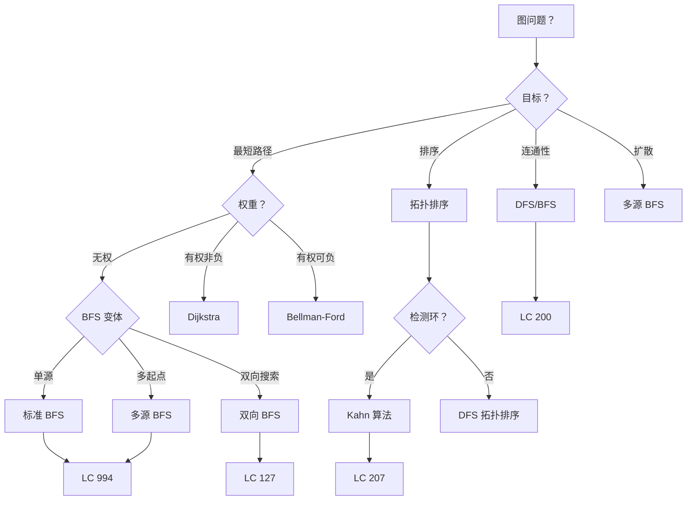

> 📊 **项目全面梳理**：详细的项目结构、模块详解和学习路径，请参阅 [`项目全面梳理-2025.md`](../../项目全面梳理-2025.md)

## BFS 与图搜索 / Breadth-First Search & Graph Search

### 摘要 / Executive Summary

- **广度优先搜索（BFS）** 是一种逐层扩展的图遍历策略，利用**队列（FIFO）**保证先访问距离起点近的节点。对于**无权图**，BFS 能够找到从起点到所有可达节点的**最短路径**。
- 本文从**形式化规约**出发，定义 BFS 的层级遍历性质、访问标记不变式和最短路径定理，建立完整的正确性证明框架。
- 通过 LeetCode 127（单词接龙，双向 BFS）、207（课程表，拓扑排序）、994（腐烂的橘子，多源 BFS）、200（岛屿数量，连通分量）四道经典题目，展示 BFS 在层级搜索、DAG 检测、多源扩散和连通分量计数中的应用模式。
- 本文档与 [`09-算法理论/01-算法基础/05-图算法理论.md`](../../09-算法理论/01-算法基础/05-图算法理论.md) 紧密关联，所有图论基础定义参见该文档。

### 关键术语与符号 / Glossary

| 术语 / Term | 定义 / Definition |
|-------------|-------------------|
| 层级遍历 Level-Order Traversal | 按距离起点的层次（最短路径长度）依次访问节点的遍历方式 |
| 最短路径性质 Shortest Path Property | 对于无权图，BFS 首次访问某节点时的路径即为最短路径 |
| 访问标记不变式 Visited Invariant | 已访问节点集合与当前队列状态之间的不变关系 |
| 拓扑排序 Topological Sort | 对有向无环图（DAG）的节点进行线性排序，使得所有边从前往后指向 |
| 入度 In-Degree | 指向某节点的有向边数量 |
| 多源 BFS Multi-Source BFS | 同时从多个起点开始 BFS，用于同时扩散或多起点最短路径问题 |
| 双向 BFS Bidirectional BFS | 同时从起点和终点进行 BFS，在中间相遇以加速搜索 |
| 连通分量 Connected Component | 无向图中的极大连通子图 |

术语对齐与引用规范：`docs/术语与符号总表.md`，`01-基础理论/00-撰写规范与引用指南.md`

### 目录 / Table of Contents

- [BFS 与图搜索 / Breadth-First Search & Graph Search](#bfs-与图搜索--breadth-first-search--graph-search)
  - [摘要 / Executive Summary](#摘要--executive-summary)
  - [关键术语与符号 / Glossary](#关键术语与符号--glossary)
  - [目录 / Table of Contents](#目录--table-of-contents)
  - [交叉引用与依赖 / Cross-References and Dependencies](#交叉引用与依赖--cross-references-and-dependencies)
  - [1. 形式化定义 / Formal Definitions](#1-形式化定义--formal-definitions)
    - [1.1 BFS 问题实例](#11-bfs-问题实例)
    - [1.2 层级遍历与距离函数](#12-层级遍历与距离函数)
    - [1.3 访问标记不变式](#13-访问标记不变式)
  - [2. 核心思路与算法框架](#2-核心思路与算法框架--core-ideas-and-algorithm-framework)
  - [3. 经典题目详解](#3-经典题目详解--classic-problem-analysis)
  - [4. 复杂度分析体系](#4-复杂度分析体系--complexity-analysis)
  - [5. 正确性证明框架](#5-正确性证明框架--correctness-proof-framework)
  - [6. 思维表征](#6-思维表征--thinking-representations)
  - [7. 常见错误与反模式](#7-常见错误与反模式--common-mistakes-and-anti-patterns)
  - [8. 自测问题](#8-自测问题--self-assessment-questions)
  - [9. 学习目标](#9-学习目标--learning-objectives)
  - [10. 知识导航](#10-知识导航--knowledge-navigation)
  - [参考文献](#参考文献--references)

### 交叉引用与依赖 / Cross-References and Dependencies

**上游理论依赖 / Upstream Dependencies**:

- [`09-算法理论/01-算法基础/05-图算法理论.md`](../../09-算法理论/01-算法基础/05-图算法理论.md) — 图的基本定义、DFS/BFS 理论、遍历正确性证明
- [`09-算法理论/01-算法基础/02-图论专题/`](../../09-算法理论/01-算法基础/) — 图论上游专题：图的表示、连通性、路径
- [`04-算法复杂度/01-时间复杂度.md`](../../04-算法复杂度/01-时间复杂度.md) — 时间复杂度 $O/\Omega/\Theta$ 的形式化定义
- [`13-LeetCode算法面试专题/02-算法范式专题/09-回溯与DFS.md`](./09-回溯与DFS.md) — DFS 与 BFS 的对比与互补

**下游应用 / Downstream Applications**:

- `13-LeetCode算法面试专题/03-数据结构专题/06-图.md` — 图数据结构的高级应用
- `13-LeetCode算法面试专题/04-高级算法专题/02-最短路径.md` — Dijkstra、Bellman-Ford 等加权最短路径算法

---

## 1. 形式化定义 / Formal Definitions

### 1.1 BFS 问题实例

**定义 1.1** (BFS 问题实例 / BFS Problem Instance) [CLRS2022]
BFS 问题实例可以形式化地定义为一个五元组：
**Definition 1.1** (BFS Problem Instance)

$$
\Pi = (G, s, \text{dist}, \text{pre}, \text{post})
$$

其中 / Where:

- $G = (V, E)$：无权图（Unweighted Graph），顶点集 $V$，边集 $E$
- $s \in V$：源节点（Source Vertex）
- $\text{dist}: V \rightarrow \mathbb{N} \cup \{\infty\}$：距离函数，$\text{dist}[v]$ 为 $s$ 到 $v$ 的最短路径长度
- $\text{pre}$：前置条件
- $\text{post}$：后置条件

**前置条件 / Precondition**:

$$
\text{pre}(G, s) \equiv G \text{ 是无权图} \land s \in V
$$

**后置条件 / Postcondition**:

$$
\text{post}(G, s, \text{dist}) \equiv \forall v \in V: \text{dist}[v] = \delta(s, v)
$$

其中 $\delta(s, v)$ 表示从 $s$ 到 $v$ 的最短路径长度（边数），若不可达则为 $\infty$。

**算法描述 / Algorithm Description**:

```text
BFS(G, s):
    for each v in V:
        dist[v] ← ∞
        visited[v] ← false
    dist[s] ← 0
    visited[s] ← true
    Q ← {s}

    while Q is not empty:
        u ← Q.dequeue()
        for each neighbor v of u:
            if not visited[v]:
                visited[v] ← true
                dist[v] ← dist[u] + 1
                Q.enqueue(v)
```

### 1.2 层级遍历与距离函数

**定义 1.2** (层级 / Level) [CLRS2022]
节点 $v$ 的层级 $L(v)$ 定义为从源点 $s$ 到 $v$ 的最短路径长度：
**Definition 1.2** (Level)

$$
L(v) = \delta(s, v)
$$

**层级遍历性质 / Level-Order Property**:

BFS 按照层级非递减的顺序访问节点。即若 $u$ 在 $v$ 之前出队，则：

$$
L(u) \leq L(v)
$$

**定义 1.3** (BFS 树 / BFS Tree)
由 BFS 过程中首次发现每个节点时的边构成的树（或森林，若不连通）。

$$
T_{\text{BFS}} = \{ (u, v) \mid v \text{ 首次被发现时经过边 } (u, v) \}
$$

### 1.3 访问标记不变式

**定义 1.4** (访问标记不变式 / Visited Invariant)
在 BFS 的每次 while 循环迭代开始时，以下不变式成立：
**Definition 1.4** (Visited Invariant)

$$
Inv(Q, \text{visited}): \forall v \in V: \text{visited}[v] = 1 \leftrightarrow (v = s \lor v \in Q \lor v \text{ 已从 } Q \text{ 中出队})
$$

用文字表述为："**一个节点被标记为已访问，当且仅当它已被入队（或已出队）。**"

> **直观解释 / Intuition**: 此不变式保证了每个节点最多被入队一次，从而确保时间复杂度为 $O(|V| + |E|)$。

---

## 2. 核心思路与算法框架 / Core Ideas and Algorithm Framework

### 2.1 BFS 通用模板

```text
BFS(G, s):
    queue ← [s]
    visited[s] ← true
    dist[s] ← 0

    while queue not empty:
        u ← queue.pop_front()
        process(u)                    // 处理当前节点
        for each v in adjacency[u]:
            if not visited[v]:
                visited[v] ← true
                dist[v] ← dist[u] + 1
                parent[v] ← u
                queue.push_back(v)
```

**关键性质 / Key Properties**:

1. **FIFO 保证层级顺序**: 先发现的节点先处理，确保按距离分层
2. **首次访问即最短路径**: 无权图中，首次到达某节点的路径即为最短路径
3. **每个节点只入队一次**: 由 `visited` 数组保证

### 2.2 多源 BFS 模板

```text
MultiSourceBFS(G, sources):
    queue ← sources
    for each s in sources:
        visited[s] ← true
        dist[s] ← 0

    while queue not empty:
        u ← queue.pop_front()
        for each v in adjacency[u]:
            if not visited[v]:
                visited[v] ← true
                dist[v] ← dist[u] + 1
                queue.push_back(v)
```

**与单源 BFS 的区别**: 初始化时将多个源点同时入队，相当于这些源点在第 0 层同时开始扩散。

### 2.3 双向 BFS 模板

```text
BidirectionalBFS(G, s, t):
    queue_s ← {s}, visited_s ← {s}
    queue_t ← {t}, visited_t ← {t}

    while queue_s not empty and queue_t not empty:
        // 从较小的一侧扩展
        if queue_s.size() > queue_t.size():
            swap(queue_s, queue_t)
            swap(visited_s, visited_t)

        for each u in queue_s.current_level():
            for each v in adjacency[u]:
                if v in visited_t:
                    return dist_s[u] + dist_t[v] + 1  // 找到交汇点
                if v not in visited_s:
                    visited_s.add(v)
                    dist_s[v] ← dist_s[u] + 1
                    queue_s.push(v)
```

**复杂度优势**: 单向 BFS 访问 $O(b^d)$ 个节点，双向 BFS 访问 $O(b^{d/2})$ 个节点（$b$ 为分支因子，$d$ 为最短距离）。

### 2.4 拓扑排序（Kahn 算法）

```text
KahnTopologicalSort(G):
    in_degree ← compute_in_degree(G)
    queue ← {v | in_degree[v] = 0}
    result ← []

    while queue not empty:
        u ← queue.pop_front()
        result.append(u)
        for each v in adjacency[u]:
            in_degree[v]--
            if in_degree[v] = 0:
                queue.push_back(v)

    if result.length < |V|:
        return "Graph has a cycle"
    return result
```

### 2.5 算法选择决策树

```mermaid
flowchart TD
    A[图搜索问题？] --> B{边权重？}
    B -->|无权| C{搜索目标？}
    B -->|有权非负| D[Dijkstra O((V+E)log V)]
    B -->|有权可负| E[Bellman-Ford O(VE)]

    C -->|最短路径| F{BFS 变体？}
    C -->|连通分量| G[DFS / BFS O(V+E)]
    C -->|拓扑排序| H[Kahn 算法 O(V+E)]
    C -->|层级遍历| I[标准 BFS]

    F -->|单源| J[标准 BFS O(V+E)]
    F -->|多源| K[多源 BFS]
    F -->|双向| L[双向 BFS O(b^{d/2})]

    J --> M[LC 994 腐烂的橘子]
    K --> M
    L --> N[LC 127 单词接龙]
    G --> O[LC 200 岛屿数量]
    H --> P[LC 207 课程表]
```

---

## 3. 经典题目详解 / Classic Problem Analysis

### 3.1 LeetCode 127 — 单词接龙

> **题目链接 / Problem Link**: [LeetCode 127. Word Ladder](https://leetcode.com/problems/word-ladder/)
> **难度 / Difficulty**: Hard

#### 形式化规约 / Formal Specification

**前置条件 / Precondition**:

$$
\text{pre}(\textit{beginWord}, \textit{endWord}, \textit{wordList}) \equiv \textit{beginWord}, \textit{endWord} \in \Sigma^n \land \textit{endWord} \in \textit{wordList}
$$

**后置条件 / Postcondition**:

$$
\text{post}(\textit{result}) \equiv \textit{result} = \min \{ |P| - 1 \mid P \text{ 为从 } \textit{beginWord} \text{ 到 } \textit{endWord} \text{ 的转换序列} \}
$$

其中转换序列 $P = (w_0, w_1, \ldots, w_k)$ 满足 $w_0 = \textit{beginWord}$，$w_k = \textit{endWord}$，且相邻单词恰好相差一个字符。

**图的建模 / Graph Modeling**:

将每个单词视为图中的一个节点，若两个单词恰好相差一个字符，则在它们之间连一条边。问题转化为求起点到终点的**最短路径**（边数）。

#### 核心思路 / Core Idea

采用**双向 BFS**，同时从 `beginWord` 和 `endWord` 开始搜索，当两侧搜索相遇时即找到最短路径。

**复杂度优化论证 / Complexity Optimization Argument**:

设最短转换序列长度为 $d$，分支因子为 $b$（每个单词的邻居数）：

| 策略 | 访问节点数 | 说明 |
|------|----------|------|
| 单向 BFS | $O(b^d)$ | 从起点扩展到距离 $d$ |
| 双向 BFS | $O(b^{d/2})$ | 两侧各扩展到距离 $d/2$ |

当 $b \approx 25$（26 个字母替换），$d \approx 10$ 时：

- 单向 BFS: $25^{10} \approx 9.5 \times 10^{13}$（理论上限，实际受 wordList 限制）
- 双向 BFS: $25^5 \approx 9.8 \times 10^6$

实际中由于 wordList 大小有限（通常 $\leq 5000$），双向 BFS 效率提升更为显著。

#### 代码实现 / Code Implementations

- **Python**: [`examples/algorithms-python/leetcode/lc0127_word_ladder.py`](../../../../examples/algorithms-python/leetcode/lc0127_word_ladder.py)
- **Rust**: [`examples/algorithms-rust/src/leetcode/lc0127_word_ladder.rs`](../../../../examples/algorithms-rust/src/leetcode/lc0127_word_ladder.rs)
- **Go**: [`examples/algorithms-go/leetcode/lc0127_word_ladder.go`](../../../../examples/algorithms-go/leetcode/lc0127_word_ladder.go)

#### 复杂度分析 / Complexity Analysis

| 指标 / Metric | 值 / Value | 说明 / Note |
|--------------|-----------|------------|
| 时间复杂度 / Time | $O(N \cdot L^2)$ 或 $O(N \cdot 26 \cdot L)$ | $N$ = wordList 大小，$L$ = 单词长度 |
| 空间复杂度 / Space | $O(N)$ | 访问标记 + 队列 |
| 双向优化 / Bidirectional | 实际访问节点数减半 | 尤其适用于 $d$ 较大的情况 |

**更精确的分析 / More Precise Analysis**:

对于每个单词，生成所有 $26 \cdot L$ 个可能的"一步变换"，检查是否在 wordList 中（用 HashSet 实现 $O(1)$ 查找）。因此单层扩展的时间为 $O(L \cdot 26)$，总时间为 $O(N \cdot L \cdot 26)$（最坏情况访问所有单词）。

#### 正确性证明 / Correctness Proof

**定理 3.1.1** (LeetCode 127 正确性): 双向 BFS 返回的转换序列长度是最短的。
**Theorem 3.1.1** (Correctness): Bidirectional BFS returns the length of the shortest transformation sequence.

**证明 / Proof**:

设最短路径长度为 $d$。双向 BFS 从两侧同时扩展，每轮扩展一层。设在某轮扩展后，从起点侧访问的节点集合为 $S_k$，从终点侧访问的节点集合为 $T_k$，其中 $k$ 为轮数。

**关键引理**: 若在第 $k$ 轮检测到交汇点（$S_k \cap T_k \neq \emptyset$），则 $2k - 1 \leq d \leq 2k$。

- 若 $d$ 为偶数，两侧各扩展 $d/2$ 层后相遇
- 若 $d$ 为奇数，一侧扩展 $(d+1)/2$ 层，另一侧扩展 $(d-1)/2$ 层后相遇

由于 BFS 的层级性质（定理 5.1），$S_k$ 中的节点距离起点 $\leq k$，$T_k$ 中的节点距离终点 $\leq k$。设交汇点为 $x \in S_k \cap T_k$，则存在路径 $s \leadsto x \leadsto t$，长度为 $\leq 2k$。若 $2k < d$，则与 $d$ 是最短路径矛盾。因此首次相遇时的路径长度即为 $d$。$\square$

---

### 3.2 LeetCode 207 — 课程表

> **题目链接 / Problem Link**: [LeetCode 207. Course Schedule](https://leetcode.com/problems/course-schedule/)
> **难度 / Difficulty**: Medium

#### 形式化规约 / Formal Specification

**前置条件 / Precondition**:

$$
\text{pre}(\textit{numCourses}, \textit{prerequisites}) \equiv \textit{numCourses} \geq 1 \land \forall (a, b) \in \textit{prerequisites}: 0 \leq a, b < \textit{numCourses}
$$

**后置条件 / Postcondition**:

$$
\text{post}(\textit{result}) \equiv \textit{result} = \text{True} \leftrightarrow G \text{ 是有向无环图（DAG）}
$$

其中图 $G = (V, E)$，$V = \{0, 1, \ldots, \textit{numCourses}-1\}$，$E = \{(b, a) \mid (a, b) \in \textit{prerequisites}\}$（边表示先修关系）。

#### 核心思路 / Core Idea

采用**拓扑排序（Kahn 算法）**检测 DAG。若图中存在环，则无法完成所有课程；否则可以。

**Kahn 算法步骤 / Kahn Algorithm Steps**:

1. 计算每个节点的入度
2. 将所有入度为 0 的节点入队（这些节点没有先修要求，可以立即学习）
3. 依次出队，将其邻接节点的入度减 1。若某邻接节点入度变为 0，则入队
4. 若最终出队的节点数等于总节点数，则图为 DAG；否则存在环

**拓扑排序终止条件 / Topological Sort Termination Condition**:

$$
\text{DAG} \leftrightarrow |\textit{result}| = |V|
$$

即拓扑排序能处理所有节点，当且仅当图为 DAG。

#### 代码实现 / Code Implementations

```python
# Python 参考实现（Kahn 算法）
def canFinish(numCourses: int, prerequisites: list[list[int]]) -> bool:
    graph = [[] for _ in range(numCourses)]
    in_degree = [0] * numCourses

    for a, b in prerequisites:
        graph[b].append(a)
        in_degree[a] += 1

    queue = collections.deque([i for i in range(numCourses) if in_degree[i] == 0])
    processed = 0

    while queue:
        u = queue.popleft()
        processed += 1
        for v in graph[u]:
            in_degree[v] -= 1
            if in_degree[v] == 0:
                queue.append(v)

    return processed == numCourses
```

#### 复杂度分析 / Complexity Analysis

| 指标 / Metric | 值 / Value | 说明 / Note |
|--------------|-----------|------------|
| 时间复杂度 / Time | $O(V + E)$ | $V$ = 课程数，$E$ = 先修关系数 |
| 空间复杂度 / Space | $O(V + E)$ | 邻接表 + 入度数组 + 队列 |

#### 正确性证明 / Correctness Proof

**定理 3.2.1** (Kahn 算法正确性): Kahn 算法返回 `True` 当且仅当图为 DAG。
**Theorem 3.2.1** (Correctness of Kahn's Algorithm): Kahn's algorithm returns `True` iff the graph is a DAG.

**证明 / Proof**:

**($\Rightarrow$) 若算法返回 `True`，则图为 DAG**:

算法返回 `True` 当且仅当所有 $V$ 个节点都被处理（出队）。假设图中存在环 $C = (v_1, v_2, \ldots, v_k, v_1)$。环中每个节点在环内至少有一条入边，因此环中所有节点的入度 $\geq 1$。这意味着环中没有任何节点会在初始时入队。当处理环外节点时，环内节点的入度可能减少，但由于环内每条边都指向环内节点，环的总入度（来自环外的入边）只能使环内某些节点入度降为 0。但若环内某节点入度变为 0 并入队，则它必然没有来自环内的未处理入边，这与环的定义矛盾（环中每个节点至少有一条来自环内的入边）。

因此，若存在环，至少有一个节点无法被处理，$|\textit{result}| < |V|$，算法返回 `False`。

**($\Leftarrow$) 若图为 DAG，则算法返回 `True`**:

对 DAG 进行归纳。任何 DAG 至少有一个入度为 0 的节点（否则每个节点至少有一条入边，沿入边反向追踪可形成环，矛盾）。因此初始队列非空。

每次从队列中取出入度为 0 的节点 $u$ 并移除，剩余图仍为 DAG（移除节点不会引入环）。由归纳假设，剩余节点可被全部处理。因此所有节点都被处理，$|\textit{result}| = |V|$，算法返回 `True`。$\square$

---

### 3.3 LeetCode 994 — 腐烂的橘子

> **题目链接 / Problem Link**: [LeetCode 994. Rotting Oranges](https://leetcode.com/problems/rotting-oranges/)
> **难度 / Difficulty**: Medium

#### 形式化规约 / Formal Specification

**前置条件 / Precondition**:

$$
\text{pre}(\textit{grid}) \equiv \textit{grid} \in \{0, 1, 2\}^{m \times n}
$$

其中 0 = 空单元格，1 = 新鲜橘子，2 = 腐烂橘子。

**后置条件 / Postcondition**:

$$
\text{post}(\textit{result}) \equiv \textit{result} = \begin{cases}
\min \{ t \mid \text{所有新鲜橘子在 } t \text{ 分钟后腐烂} \}, & \text{if 可达} \\
-1, & \text{if 存在不可达的新鲜橘子}
\end{cases}
$$

#### 核心思路 / Core Idea

采用**多源 BFS**。将所有初始腐烂橘子作为第 0 层的源点同时入队，每分钟（BFS 的一层）腐烂向四个方向扩散。BFS 的层数即为所需的最短分钟数。

**时间层数 = 最短分钟数 / Time Layers = Minimum Minutes**:

多源 BFS 保证：当一个新鲜橘子首次被访问时，其距离（BFS 层数）就是从最近的初始腐烂橘子到它的最短传播时间。

#### 代码实现 / Code Implementations

- **Rust**: [`examples/algorithms-rust/src/leetcode/lc0994_rotting_oranges.rs`](../../../../examples/algorithms-rust/src/leetcode/lc0994_rotting_oranges.rs)
- **Python**: [`examples/algorithms-python/leetcode/lc0994_rotting_oranges.py`](../../../../examples/algorithms-python/leetcode/lc0994_rotting_oranges.py)
- **Go**: [`examples/algorithms-go/leetcode/lc0994_rotting_oranges.go`](../../../../examples/algorithms-go/leetcode/lc0994_rotting_oranges.go)

#### 复杂度分析 / Complexity Analysis

| 指标 / Metric | 值 / Value | 说明 / Note |
|--------------|-----------|------------|
| 时间复杂度 / Time | $O(m \cdot n)$ | 每个单元格最多入队一次 |
| 空间复杂度 / Space | $O(m \cdot n)$ | 队列最多存储所有单元格 |

#### 正确性证明 / Correctness Proof

**定理 3.3.1** (LeetCode 994 正确性): 多源 BFS 返回的分钟数是最短的。
**Theorem 3.3.1** (Correctness): Multi-source BFS returns the minimum number of minutes.

**证明 / Proof**:

**归纳法 / Induction on BFS layer $t$**:

**基础 / Base ($t = 0$)**: 所有初始腐烂橘子距离为 0，正确。

**归纳假设 / Inductive Hypothesis**: 第 $t$ 层 BFS 访问的所有橘子，恰好在 $t$ 分钟后腐烂，且这些橘子是从最近的初始腐烂橘子出发的最短路径长度 $\leq t$ 的所有橘子。

**归纳步骤 / Inductive Step**: 第 $t+1$ 层 BFS 从第 $t$ 层的橘子向四个方向扩展。对于被扩展到的某个新鲜橘子 $o$，设其父节点为 $p$（第 $t$ 层的腐烂橘子）。由归纳假设，$p$ 在 $t$ 分钟后腐烂，因此 $o$ 在 $t+1$ 分钟后腐烂。

**最短性 / Optimality**: 假设存在另一条更短路径使 $o$ 在 $t' < t+1$ 分钟后腐烂。则该路径上 $o$ 的前驱应在第 $t'$ 层或更早被访问，从而 $o$ 应在第 $t'+1 \leq t$ 层被访问，与 $o$ 在第 $t+1$ 层首次被访问矛盾（BFS 的首次访问即最短路径性质，定理 5.1）。$\square$

---

### 3.4 LeetCode 200 — 岛屿数量

> **题目链接 / Problem Link**: [LeetCode 200. Number of Islands](https://leetcode.com/problems/number-of-islands/)
> **难度 / Difficulty**: Medium

#### 形式化规约 / Formal Specification

**前置条件 / Precondition**:

$$
\text{pre}(\textit{grid}) \equiv \textit{grid} \in \{'0', '1'\}^{m \times n}
$$

**后置条件 / Postcondition**:

$$
\text{post}(\textit{result}) \equiv \textit{result} = |\{ C \mid C \text{ 是 '1' 的连通分量} \}|
$$

#### 核心思路 / Core Idea

遍历网格，每当遇到未访问的 `'1'` 时，启动一次 DFS 或 BFS 遍历其连通区域，将该区域所有 `'1'` 标记为已访问。启动搜索的次数即为岛屿数量。

**DFS/BFS 等价性 / DFS/BFS Equivalence**:

对于连通分量计数问题，DFS 和 BFS 在功能上是等价的：

- 两者都能遍历连通区域内的所有节点
- 时间复杂度相同：$O(m \cdot n)$
- 空间复杂度差异：DFS 为 $O(m \cdot n)$（递归栈最坏情况），BFS 为 $O(\min(m, n))$（队列大小）

在实际应用中，DFS 代码更简洁（递归），BFS 可避免栈溢出风险（迭代）。

#### 代码实现 / Code Implementations

```go
// Go 参考实现（BFS）
func numIslands(grid [][]byte) int {
    if len(grid) == 0 { return 0 }
    m, n := len(grid), len(grid[0])
    count := 0

    bfs := func(r, c int) {
        queue := [][2]int{{r, c}}
        grid[r][c] = '0'
        for len(queue) > 0 {
            cell := queue[0]
            queue = queue[1:]
            cr, cc := cell[0], cell[1]
            dirs := [][2]int{{1,0}, {-1,0}, {0,1}, {0,-1}}
            for _, d := range dirs {
                nr, nc := cr+d[0], cc+d[1]
                if nr >= 0 && nr < m && nc >= 0 && nc < n && grid[nr][nc] == '1' {
                    grid[nr][nc] = '0'
                    queue = append(queue, [2]int{nr, nc})
                }
            }
        }
    }

    for r := 0; r < m; r++ {
        for c := 0; c < n; c++ {
            if grid[r][c] == '1' {
                count++
                bfs(r, c)
            }
        }
    }
    return count
}
```

#### 复杂度分析 / Complexity Analysis

| 指标 / Metric | 值 / Value | 说明 / Note |
|--------------|-----------|------------|
| 时间复杂度 / Time | $O(m \cdot n)$ | 每个单元格最多访问一次 |
| 空间复杂度 / Space | $O(\min(m, n))$（BFS）/ $O(m \cdot n)$（DFS） | BFS 队列 / DFS 递归栈 |

#### 正确性证明 / Correctness Proof

**定理 3.4.1** (LeetCode 200 正确性): 算法返回的岛屿数量等于 `'1'` 的连通分量数。
**Theorem 3.4.1** (Correctness): The algorithm returns the number of connected components of `'1'`.

**证明 / Proof**:

**完备性 / Completeness**: 设 $C$ 为任意一个 `'1'` 的连通分量。遍历网格时，第一次遇到 $C$ 中的某个单元格 $(r, c)$ 时，该单元格尚未被访问（因为 $C$ 中其他单元格也未被访问）。此时算法启动 BFS/DFS，将 $C$ 中所有单元格标记为已访问。因此每个连通分量恰好触发一次搜索。

**正确性 / Correctness**: 每次触发搜索时，`count` 增加 1，且搜索仅标记当前连通分量中的单元格（不会跨越 `'0'` 或网格边界）。因此 `count` 的增加次数恰好等于连通分量的数量。$\square$

---

## 4. 复杂度分析体系 / Complexity Analysis

### 4.1 BFS 时间复杂度严格推导

**定理 4.1** (BFS 时间复杂度): 对于图 $G = (V, E)$，BFS 的时间复杂度为 $O(|V| + |E|)$。
**Theorem 4.1** (Time Complexity of BFS): BFS runs in $O(|V| + |E|)$ time.

**证明 / Proof**:

**操作计数 / Operation Count**:

1. **初始化**: 初始化 `dist` 和 `visited` 数组，$O(|V|)$
2. **入队操作**: 每个节点最多入队一次，总计 $O(|V|)$
3. **出队操作**: 每个节点最多出队一次，总计 $O(|V|)$
4. **邻接表扫描**: 每条边最多被检查两次（无向图）或一次（有向图），总计 $O(|E|)$

总时间：$T(|V|, |E|) = O(|V|) + O(|V|) + O(|V|) + O(|E|) = O(|V| + |E|)$。$\square$

### 4.2 双向 BFS 复杂度分析

**定理 4.2** (双向 BFS 时间复杂度): 设分支因子为 $b$，最短路径长度为 $d$，双向 BFS 的时间复杂度为 $O(b^{d/2})$。
**Theorem 4.2** (Time Complexity of Bidirectional BFS): Bidirectional BFS runs in $O(b^{d/2})$ time.

**证明 / Proof**:

单向 BFS 需要扩展 $O(b^d)$ 个节点（最坏情况）。双向 BFS 从两侧同时扩展，每侧只需扩展到距离 $d/2$。因此每侧访问的节点数为 $O(b^{d/2})$，总访问节点数为 $O(2 \cdot b^{d/2}) = O(b^{d/2})$。$\square$

### 4.3 拓扑排序复杂度

**定理 4.3** (Kahn 算法时间复杂度): Kahn 算法的时间复杂度为 $O(|V| + |E|)$。
**Theorem 4.3** (Time Complexity of Kahn's Algorithm): Kahn's algorithm runs in $O(|V| + |E|)$ time.

**证明 / Proof**:

1. **计算入度**: 扫描所有边一次，$O(|E|)$
2. **初始化队列**: 扫描所有顶点，$O(|V|)$
3. **主循环**: 每个顶点出队一次，每条边被检查一次（当其起点出队时），总计 $O(|V| + |E|)$

总时间：$O(|V| + |E|)$。$\square$

### 4.4 空间复杂度

| 算法 | 空间复杂度 | 组成 |
|------|----------|------|
| 标准 BFS | $O(|V|)$ | 队列 $O(|V|)$ + 访问标记 $O(|V|)$ |
| 双向 BFS | $O(|V|)$ | 两侧队列 + 两侧访问标记 |
| 多源 BFS | $O(|V|)$ | 同标准 BFS |
| Kahn 拓扑排序 | $O(|V| + |E|)$ | 邻接表 $O(|V| + |E|)$ + 队列 $O(|V|)$ |

---

## 5. 正确性证明框架 / Correctness Proof Framework

### 5.1 BFS 最短路径定理（无权图）

**定理 5.1** (BFS 最短路径定理 / BFS Shortest Path Theorem) [CLRS2022]
对于无权图 $G = (V, E)$ 和源点 $s$，BFS 计算出的 $\text{dist}[v]$ 等于从 $s$ 到 $v$ 的最短路径长度 $\delta(s, v)$。
**Theorem 5.1** (BFS Shortest Path Theorem)
For an unweighted graph $G = (V, E)$ and source $s$, BFS computes $\text{dist}[v] = \delta(s, v)$ for all $v \in V$.

**证明 / Proof**:

基于循环不变式的三条件证明法。

**循环不变式 / Loop Invariant**:

在每次 while 循环迭代开始时（队列非空）：

1. **已访问节点的距离正确性**: $\forall v: \text{visited}[v] = \text{True} \rightarrow \text{dist}[v] = \delta(s, v)$
2. **队列中的节点距离非递减**: 设队列中的节点为 $Q = [v_1, v_2, \ldots, v_k]$，则 $\text{dist}[v_1] \leq \text{dist}[v_2] \leq \cdots \leq \text{dist}[v_k] \leq \text{dist}[v_1] + 1$

**初始化 / Initialization**:

初始时只有 $s$ 被访问，`dist[s] = 0 = δ(s, s)`。队列中只有 $s$，不变式显然成立。

**保持 / Maintenance**:

设 $u$ 为出队节点。对于 $u$ 的每个未访问邻居 $v$：

- `dist[v]` 被设为 `dist[u] + 1`
- 由归纳假设，`dist[u] = δ(s, u)`
- 存在路径 $s \leadsto u \rightarrow v$，长度为 `dist[u] + 1`，因此 $\delta(s, v) \leq \text{dist}[u] + 1 = \text{dist}[v]$
- 另一方面，任何从 $s$ 到 $v$ 的路径必须经过某个已访问节点（因为 $v$ 首次被发现）。最短路径上的前驱 $p$ 满足 $\delta(s, p) = \delta(s, v) - 1$。当 $p$ 被处理时，$v$ 应已被发现。因此 $\delta(s, v) \geq \text{dist}[v]$。

综上，$\text{dist}[v] = \delta(s, v)$。

关于队列单调性：新入队的节点 $v$ 满足 `dist[v] = dist[u] + 1`。由于队列中已有节点的距离 $\geq \text{dist}[u]$，且 $\leq \text{dist}[u] + 1$（由不变式 2），新节点 $v$ 入队后，队列尾部距离仍为 $\leq \text{dist}[u] + 1$。而队列头部（若还有节点）的距离 $\geq \text{dist}[u]$。因此单调性保持。

**终止 / Termination**:

当队列为空时，所有可达节点已被访问，其距离均为最短路径长度。不可达节点的 `dist` 保持为 $\infty$，也正确。$\square$

### 5.2 拓扑排序终止条件

**定理 5.2** (拓扑排序终止条件 / Topological Sort Termination Condition)
Kahn 算法能处理所有节点（$|\textit{result}| = |V|$）当且仅当图为 DAG。
**Theorem 5.2** (Topological Sort Termination Condition)
Kahn's algorithm processes all nodes iff the graph is a DAG.

**证明 / Proof**: 见定理 3.2.1 的证明。$\square$

### 5.3 证明树

```mermaid
flowchart TD
    A[图 G 无权] --> B[定理 5.1: BFS 最短路径]
    C[BFS 队列 FIFO] --> D[层级遍历性质]
    D --> B
    E[访问标记不变式] --> F[每个节点最多访问一次]
    F --> G[时间复杂度 O(V+E)]

    H[有向图 G] --> I[定理 5.2: DAG 检测]
    J[Kahn 算法: 入度为 0 的节点入队] --> K[移除节点后剩余图仍为 DAG]
    K --> I

    style B fill:#e1f5e1
    style I fill:#e1f5e1
```

---

## 6. 思维表征 / Thinking Representations

### 6.1 概念依赖图

```mermaid
flowchart LR
    A[图定义 G=(V,E)] --> B[BFS]
    C[队列 FIFO] --> B
    D[访问标记] --> B
    E[无权图] --> F[最短路径定理]
    B --> F
    G[层级遍历] --> H[多源 BFS]
    B --> H
    B --> I[双向 BFS]
    J[入度] --> K[拓扑排序]
    K --> L[DAG 检测]
    B --> M[连通分量]

    H --> N[LC 994 腐烂的橘子]
    I --> O[LC 127 单词接龙]
    K --> P[LC 207 课程表]
    M --> Q[LC 200 岛屿数量]
```

### 6.2 算法选择决策树



### 6.3 多维矩阵对比表

| 维度 / Dimension | LC 127 单词接龙 | LC 207 课程表 | LC 994 腐烂的橘子 | LC 200 岛屿数量 |
|----------------|---------------|-------------|-----------------|---------------|
| **图类型** | 隐式图（单词邻接） | 有向图（先修关系） | 网格图（4 邻接） | 网格图（4 邻接） |
| **BFS 变体** | 双向 BFS | Kahn 拓扑排序 | 多源 BFS | 标准 BFS/DFS |
| **搜索目标** | 最短路径长度 | DAG 检测 | 最长时间（层数） | 连通分量计数 |
| **时间复杂度** | $O(N \cdot L \cdot 26)$ | $O(V + E)$ | $O(m \cdot n)$ | $O(m \cdot n)$ |
| **空间复杂度** | $O(N)$ | $O(V + E)$ | $O(m \cdot n)$ | $O(\min(m,n))$（BFS） |
| **关键数据结构** | HashSet + 双队列 | 邻接表 + 入度数组 | 队列 + 网格 | 队列/递归栈 + 网格 |
| **正确性核心** | BFS 最短路径定理 | 拓扑排序终止条件 | 多源最短路径 | 连通分量遍历 |

### 6.4 思维导图：BFS 算法体系

```mermaid
mindmap
  root((BFS 与图搜索))
    理论基础
      图定义 G=(V,E)
      无权图最短路径
      层级遍历性质
      访问标记不变式
    BFS 变体
      标准 BFS
        单源最短路径
        层级遍历
      多源 BFS
        同时多起点扩散
        最短时间/距离
      双向 BFS
        从两端同时搜索
        复杂度 O(b^{d/2})
    相关算法
      拓扑排序
        Kahn 算法
        DAG 检测
      连通分量
        DFS 等价性
        并查集替代
    经典题目
      LC 127 单词接龙
      LC 207 课程表
      LC 994 腐烂的橘子
      LC 200 岛屿数量
    正确性保障
      BFS 最短路径定理
      拓扑排序终止条件
      循环不变式证明
```

### 6.5 公理定理证明树

```mermaid
flowchart BT
    A1[公理: 图 G=(V,E)] --> B1[定义 1.1: BFS 问题实例]
    A2[公理: 队列 FIFO 性质] --> B2[定义 1.2: 层级遍历]
    A3[公理: 无权图边权=1] --> C[定理 5.1: BFS 最短路径]
    B1 --> C
    B2 --> C

    D[引理: 访问标记保证每个节点入队一次] --> E[定理 4.1: 时间复杂度 O(V+E)]

    F[定义: 入度 / 有向无环图] --> G[定理 5.2: 拓扑排序终止条件]
    H[引理: DAG 必有入度为 0 的节点] --> G

    C --> I[应用: LC 127/994]
    G --> J[应用: LC 207]
    E --> K[所有 BFS 应用的时间复杂度]

    style C fill:#e1f5e1
    style G fill:#e1f5e1
    style E fill:#e1f5e1
```

---

## 7. 常见错误与反模式 / Common Mistakes and Anti-Patterns

### 7.1 BFS 中重复入队

**错误 / Mistake**: 未正确标记 `visited`，导致节点重复入队。

```python
# ❌ 错误：在入队前未标记 visited
for v in adj[u]:
    if v not in visited:
        queue.append(v)
        # ❌ 忘记 visited.add(v)，导致后续邻居再次入队
```

**修复 / Fix**:

```python
# ✅ 正确：入队时立即标记
for v in adj[u]:
    if v not in visited:
        visited.add(v)  # ✅ 立即标记
        queue.append(v)
```

> **原因**: 若不在入队时标记，当同一节点的多个邻居同时被发现时，该节点会被多次入队，导致时间复杂度退化。

### 7.2 双向 BFS 的交汇判断

**错误 / Mistake**: 仅在从队列取节点时判断交汇，而非在发现邻居时判断。

```python
# ❌ 错误：出队时才判断
u = queue_s.popleft()
if u in visited_t:
    return dist_s[u] + dist_t[u]
```

**修复 / Fix**:

```python
# ✅ 正确：发现邻居时立即判断
for v in adj[u]:
    if v in visited_t:
        return dist_s[u] + 1 + dist_t[v]  # 考虑边 (u,v)
```

### 7.3 拓扑排序中忘记更新入度

**错误 / Mistake**: Kahn 算法中出队后未正确减邻接入度。

```python
# ❌ 错误：未减少入度
u = queue.popleft()
for v in adj[u]:
    if in_degree[v] == 0:  # ❌ 未先减入度
        queue.append(v)
```

### 7.4 多源 BFS 初始化遗漏

**错误 / Mistake**: 多源 BFS 中未将所有源点同时入队，而是逐个处理。

```python
# ❌ 错误：逐个处理源点
for s in sources:
    bfs(s)  # 每次独立 BFS，时间复杂度 O(k * (V+E))
```

**修复 / Fix**:

```python
# ✅ 正确：所有源点同时入队
queue = deque(sources)
for s in sources:
    visited[s] = True
    dist[s] = 0
# 统一 BFS，时间复杂度 O(V+E)
```

### 7.5 岛屿数量中修改原数组的副作用

**错误 / Mistake**: 直接修改输入网格标记已访问，若题目要求不能修改输入则有问题。

**修复 / Fix**: 使用额外的 `visited` 数组，或确认题目允许修改输入。

---

## 8. 自测问题 / Self-Assessment Questions

### 问题 1：BFS 最短路径定理的前提

**Q**: BFS 最短路径定理（定理 5.1）要求图满足什么条件？若边有权值，BFS 还能找到最短路径吗？

**A**: BFS 最短路径定理要求图是**无权图**（或所有边权相等）。核心原因是 BFS 的层级性质依赖于"每条边对路径长度的贡献相同"。若边有权值：

- **非负权值**: 使用 Dijkstra 算法，时间 $O((V+E)\log V)$
- **可含负权**: 使用 Bellman-Ford 算法，时间 $O(VE)$
- **无权图**: BFS 最优，时间 $O(V+E)$

---

### 问题 2：双向 BFS 的复杂度优势

**Q**: 为什么双向 BFS 能将复杂度从 $O(b^d)$ 降低到 $O(b^{d/2})$？什么情况下应该使用双向 BFS？

**A**:

单向 BFS 需要遍历以起点为中心、半径为 $d$ 的"球体"中的所有节点，数量为 $O(b^d)$。双向 BFS 从两侧各遍历半径为 $d/2$ 的球体，每侧 $O(b^{d/2})$，总计 $O(b^{d/2})$。

**适用场景**:

- 明确知道起点和终点（双向都需要明确的目标）
- 分支因子 $b$ 较大且最短距离 $d$ 较大
- 图是隐式构建的（如单词接龙中的单词邻接图）

**不适用场景**: 只有一个源点、需要访问所有节点、或终点不唯一的问题。

---

### 问题 3：拓扑排序与环检测

**Q**: 为什么 Kahn 算法中，若最终处理的节点数 $< |V|$，则图中必有环？请给出严格证明。

**A**:

**反证法**: 假设图中无环（即为 DAG），但处理的节点数 $< |V|$。

任何 DAG 至少有一个入度为 0 的节点（否则沿入边反向追踪可形成环）。Kahn 算法不断移除入度为 0 的节点并更新邻接节点入度。移除节点不会引入新环，因此剩余图始终为 DAG。

若算法终止时还有未处理节点，则这些节点构成的子图中每个节点的入度都 $\geq 1$（否则会被入队处理）。但该子图是 DAG 的非空子图，必有入度为 0 的节点，矛盾。

因此，若有未处理节点，原图必含环。$\square$

---

### 问题 4：多源 BFS 与多次单源 BFS

**Q**: 多源 BFS 和分别对每个源点运行单源 BFS 有什么区别？为什么多源 BFS 更优？

**A**:

| 维度 | 多次单源 BFS | 多源 BFS |
|------|------------|---------|
| 时间复杂度 | $O(k \cdot (V + E))$ | $O(V + E)$ |
| 空间复杂度 | $O(V)$（每次独立） | $O(V)$ |
| 正确性 | 需要取所有源点的最小距离 | 天然得到最近源点的距离 |

多源 BFS 将所有源点在第 0 层同时入队，相当于构建了一个"超级源点"连接所有真实源点（边权为 0）。这样一次 BFS 即可得到每个节点到最近源点的距离。

---

### 问题 5：DFS 与 BFS 在连通分量计数中的等价性

**Q**: 为什么 LC 200（岛屿数量）中 DFS 和 BFS 都能得到正确答案？它们的时间/空间复杂度有何差异？

**A**:

**等价性原因**: DFS 和 BFS 都能完整遍历一个连通分量中的所有节点。只要从一个未访问的 `'1'` 出发，无论用 DFS 还是 BFS，都能标记该连通分量中的所有 `'1'`，且不会跨岛标记。

**复杂度差异**:

| 维度 | DFS | BFS |
|------|-----|-----|
| 时间 | $O(m \cdot n)$ | $O(m \cdot n)$ |
| 空间 | $O(m \cdot n)$（递归栈最坏） | $O(\min(m, n))$（队列） |
| 实现复杂度 | 简洁（递归） | 稍复杂（迭代+队列） |
| 栈溢出风险 | 有（大网格） | 无 |

对于极大网格（如 $10^6 \times 10^6$），BFS 更安全；一般场景下 DFS 代码更简洁。

---

### 问题 6：BFS 访问标记的时机

**Q**: BFS 中为什么要在入队时标记 `visited`，而不是在出队时标记？

**A**:

若在**出队时**标记，则同一节点可能在队列中重复出现。考虑节点 $u$ 有两个邻居 $v_1$ 和 $v_2$，两者几乎同时发现 $u$。若在入队时不标记，$v_1$ 会将 $u$ 入队，$v_2$ 也会将 $u$ 入队（因为 $u$ 尚未被标记）。这会导致 $u$ 在队列中出现多次，增加不必要的处理。

在**入队时**标记可保证每个节点最多入队一次，从而确保时间复杂度严格为 $O(V + E)$。

---

## 9. 学习目标 / Learning Objectives

完成本章学习后，读者应能够：

1. **形式化描述** BFS 问题实例，写出层级遍历性质、访问标记不变式和最短路径定理。
2. **独立推导** BFS 最短路径定理的完整证明，理解 FIFO 队列在证明中的关键作用。
3. **熟练运用** BFS 的各种变体（标准 BFS、多源 BFS、双向 BFS）解决具体问题。
4. **理解并实现** Kahn 拓扑排序算法，能严格证明其与 DAG 检测的等价性。
5. **比较分析** DFS 与 BFS 在不同问题上的适用性，能根据问题特征选择合适的遍历策略。

## 10. 知识导航 / Knowledge Navigation

**前置知识 / Prerequisites**:

- [图算法理论](../../09-算法理论/01-算法基础/05-图算法理论.md) — 图的基本定义、DFS/BFS 理论基础
- [回溯与 DFS](./09-回溯与DFS.md) — DFS 的详细讨论，与 BFS 的对比
- [队列与栈](../../03-数据结构/02-线性结构/02-队列.md) — BFS 依赖的核心数据结构

**后续拓展 / Extensions**:

- [最短路径算法](../04-高级算法专题/02-最短路径.md) — Dijkstra、Bellman-Ford 等加权图最短路径
- [并查集](../../03-数据结构/05-集合/01-并查集.md) — 连通分量问题的另一种解法
- [网络流](../../09-算法理论/01-算法基础/05-图算法理论.md#6-网络流--network-flow) — 图算法的高级应用

---

## 参考文献 / References

- [CLRS2022]: Cormen, T. H., et al. (2022). *Introduction to Algorithms* (4th ed.). MIT Press. ISBN: 978-0262046305
- [Moore1959]: Moore, E. F. (1959). "The shortest path through a maze." *Proceedings of the International Symposium on the Theory of Switching*, 285-292.
- [Kahn1962]: Kahn, A. B. (1962). "Topological sorting of large networks." *Communications of the ACM*, 5(11), 558-562.
- [Lee1961]: Lee, C. Y. (1961). "An algorithm for path connections and its applications." *IRE Transactions on Electronic Computers*, EC-10(3), 346-365.
- [Pohl1971]: Pohl, I. (1971). "Bi-directional search." *Machine Intelligence*, 6, 127-140.
