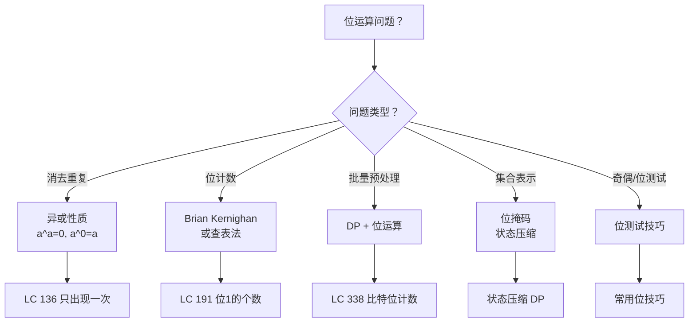
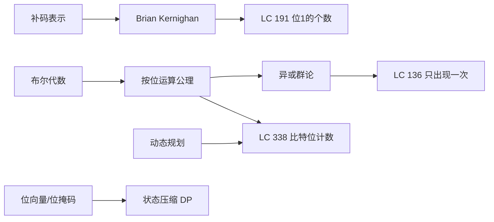
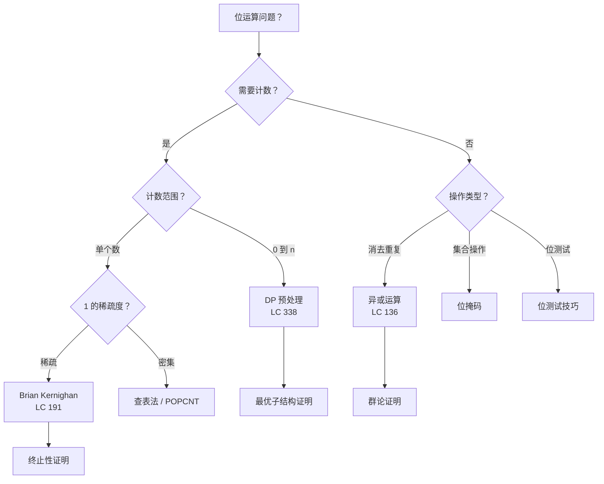
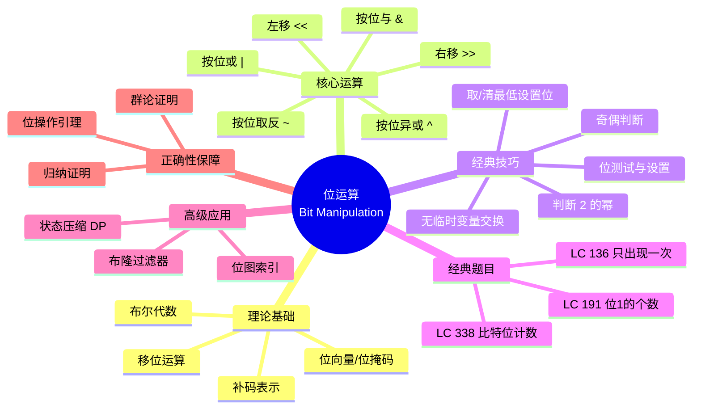

> 📊 **项目全面梳理**：详细的项目结构、模块详解和学习路径，请参阅 [`项目全面梳理-2025.md`](../../项目全面梳理-2025.md)

## 位运算 / Bit Manipulation

### 摘要 / Executive Summary

- **位运算（Bit Manipulation）** 是直接对二进制位进行操作的算法技术，利用整数的底层二进制表示实现 $O(1)$ 或 $O(n)$ 的高效计算。本文从**形式化定义**出发，建立位向量和位掩码的代数框架，给出按位运算的公理系统。
- 通过 LeetCode 136（只出现一次的数字，异或消去律）、191（位1的个数，Brian Kernighan 算法）、338（比特位计数，DP+位运算）三道经典题目，展示位运算在消去重复、位计数和批量预处理中的应用模式。
- 本文包含异或消去律的**群论证明**和 Brian Kernighan 算法每次消去最低位 1 的**终止性证明**，建立位运算算法的严格正确性框架。

### 关键术语与符号 / Glossary

| 术语 / Term | 定义 / Definition |
|-------------|-------------------|
| 位向量 Bit Vector | 用整数的二进制位表示集合元素的布尔成员关系，第 $i$ 位为 1 表示元素 $i$ 属于集合 |
| 位掩码 Bit Mask | 用于选择/屏蔽特定位的整数值，通过与（AND）、或（OR）、异或（XOR）操作实现位级控制 |
| 按位运算 Bitwise Operation | 对两个整数的对应二进制位分别进行逻辑运算：AND (&)、OR (\|)、XOR (^)、NOT (~) |
| 汉明权重 Hamming Weight | 一个整数的二进制表示中 1 的个数，也称为 population count |
| 最低有效位 LSB | Least Significant Bit，二进制表示中最右边的位（$2^0$ 位） |
| 最低设置位 Lowest Set Bit | 一个整数中值为 1 的最低位，如 `0b10100` 的最低设置位为 $2^2 = 4$ |
| 补码 Two's Complement | 有符号整数的二进制表示方式：正数不变，负数为其绝对值按位取反加 1 |

术语对齐与引用规范：`docs/术语与符号总表.md`，`01-基础理论/00-撰写规范与引用指南.md`

### 目录 / Table of Contents

- [位运算 / Bit Manipulation](#位运算--bit-manipulation)
  - [摘要 / Executive Summary](#摘要--executive-summary)
  - [关键术语与符号 / Glossary](#关键术语与符号--glossary)
  - [目录 / Table of Contents](#目录--table-of-contents)
  - [交叉引用与依赖 / Cross-References and Dependencies](#交叉引用与依赖--cross-references-and-dependencies)
- [1. 形式化定义 / Formal Definitions](#1-形式化定义--formal-definitions)
  - [1.1 位向量与位掩码](#11-位向量与位掩码)
  - [1.2 按位运算公理](#12-按位运算公理)
  - [1.3 移位运算](#13-移位运算)
- [2. 核心思路与算法框架 / Core Ideas and Algorithm Framework](#2-核心思路与算法框架--core-ideas-and-algorithm-framework)
  - [2.1 位运算核心技巧](#21-位运算核心技巧)
  - [2.2 异或运算的代数结构](#22-异或运算的代数结构)
  - [2.3 算法选择决策树](#23-算法选择决策树)
- [3. 经典题目详解 / Classic Problem Analysis](#3-经典题目详解--classic-problem-analysis)
  - [3.1 LeetCode 136 — 只出现一次的数字](#31-leetcode-136--只出现一次的数字)
    - [形式化规约 / Formal Specification](#形式化规约--formal-specification)
    - [核心思路 / Core Idea](#核心思路--core-idea)
    - [代码实现 / Code Implementations](#代码实现--code-implementations)
    - [复杂度分析 / Complexity Analysis](#复杂度分析--complexity-analysis)
    - [正确性证明 / Correctness Proof](#正确性证明--correctness-proof)
  - [3.2 LeetCode 191 — 位1的个数](#32-leetcode-191--位1的个数)
    - [形式化规约 / Formal Specification](#形式化规约--formal-specification-1)
    - [核心思路 / Core Idea](#核心思路--core-idea-1)
    - [代码实现 / Code Implementations](#代码实现--code-implementations-1)
    - [复杂度分析 / Complexity Analysis](#复杂度分析--complexity-analysis-1)
    - [正确性证明 / Correctness Proof](#正确性证明--correctness-proof-1)
  - [3.3 LeetCode 338 — 比特位计数](#33-leetcode-338--比特位计数)
    - [形式化规约 / Formal Specification](#形式化规约--formal-specification-2)
    - [核心思路 / Core Idea](#核心思路--core-idea-2)
    - [代码实现 / Code Implementations](#代码实现--code-implementations-2)
    - [复杂度分析 / Complexity Analysis](#复杂度分析--complexity-analysis-2)
    - [正确性证明 / Correctness Proof](#正确性证明--correctness-proof-2)
- [4. 复杂度分析体系 / Complexity Analysis](#4-复杂度分析体系--complexity-analysis)
  - [4.1 位运算的时间复杂度](#41-位运算的时间复杂度)
  - [4.2 批量位操作复杂度](#42-批量位操作复杂度)
- [5. 正确性证明框架 / Correctness Proof Framework](#5-正确性证明框架--correctness-proof-framework)
  - [5.1 异或消去律的群论证明](#51-异或消去律的群论证明)
  - [5.2 Brian Kernighan 每次消去最低位 1 的论证](#52-brian-kernighan-每次消去最低位-1-的论证)
  - [5.3 证明树](#53-证明树)
- [6. 思维表征 / Thinking Representations](#6-思维表征--thinking-representations)
  - [6.1 概念依赖图](#61-概念依赖图)
  - [6.2 算法选择决策树](#62-算法选择决策树)
  - [6.3 多维矩阵对比表](#63-多维矩阵对比表)
  - [6.4 思维导图：位运算知识体系](#64-思维导图位运算知识体系)
- [7. 常见错误与反模式 / Common Mistakes and Anti-Patterns](#7-常见错误与反模式--common-mistakes-and-anti-patterns)
  - [7.1 混淆逻辑运算与按位运算](#71-混淆逻辑运算与按位运算)
  - [7.2 移位溢出](#72-移位溢出)
  - [7.3 负数右移](#73-负数右移)
  - [7.4 忘记位宽限制](#74-忘记位宽限制)
  - [7.5  Brian Kernighan 算法对 0 的处理](#75--brian-kernighan-算法对-0-的处理)
- [8. 自测问题 / Self-Assessment Questions](#8-自测问题--self-assessment-questions)
  - [问题 1：异或群的性质](#问题-1异或群的性质)
  - [问题 2：`n & (n - 1)` 的数学原理](#问题-2n--n---1-的数学原理)
  - [问题 3：判断 2 的幂](#问题-3判断-2-的幂)
  - [问题 4：位运算与模运算的关系](#问题-4位运算与模运算的关系)
  - [问题 5：LC 338 的最优子结构](#问题-5lc-338-的最优子结构)
  - [问题 6：位掩码在集合操作中的应用](#问题-6位掩码在集合操作中的应用)
- [9. 学习目标 / Learning Objectives](#9-学习目标--learning-objectives)
- [10. 知识导航 / Knowledge Navigation](#10-知识导航--knowledge-navigation)
- [参考文献 / References](#参考文献--references)

### 交叉引用与依赖 / Cross-References and Dependencies

**上游理论依赖 / Upstream Dependencies**:

- `01-基础理论/01-数学基础/02-离散数学.md` — 布尔代数、群论基础
- `01-基础理论/01-数学基础/03-数论.md` — 整数的二进制表示与模运算
- `05-类型理论/01-类型系统基础.md` — 整数类型的位宽与溢出行为

**下游应用 / Downstream Applications**:

- `13-LeetCode算法面试专题/04-高级算法专题/03-状态压缩DP.md` — 位掩码在动态规划中的高级应用
- `13-LeetCode算法面试专题/03-数据结构专题/09-线段树.md` — 线段树的位运算优化技巧

---

## 1. 形式化定义 / Formal Definitions

### 1.1 位向量与位掩码

**定义 1.1** (位向量 / Bit Vector)
设全集 $U = \{0, 1, \ldots, n-1\}$，集合 $S \subseteq U$ 的位向量表示为一个 $n$ 位整数 $b_S$，其中：
**Definition 1.1** (Bit Vector)

$$
b_S = \sum_{i \in S} 2^i
$$

即第 $i$ 位为 1 当且仅当 $i \in S$。

**集合操作与位运算的对应 / Set Operations as Bitwise Operations**:

| 集合操作 | 位运算 | 公式 |
|---------|--------|------|
| 交集 $S \cap T$ | 按位与 | $b_{S \cap T} = b_S \ \& \ b_T$ |
| 并集 $S \cup T$ | 按位或 | $b_{S \cup T} = b_S \ | \ b_T$ |
| 对称差 $S \Delta T$ | 按位异或 | $b_{S \Delta T} = b_S \oplus b_T$ |
| 补集 $\overline{S}$ | 按位取反 | $b_{\overline{S}} = \sim b_S$（在 $n$ 位范围内） |

**定义 1.2** (位掩码 / Bit Mask)
位掩码 $M$ 是一个用于选择或修改特定位的整数值。对于位向量 $b$ 和掩码 $M$：
**Definition 1.2** (Bit Mask)

- **设置位**: $b \ | \ M$ — 将 $M$ 中为 1 的位在 $b$ 中设为 1
- **清除位**: $b \ \& \ \sim M$ — 将 $M$ 中为 1 的位在 $b$ 中设为 0
- **切换位**: $b \oplus M$ — 将 $M$ 中为 1 的位在 $b$ 中取反
- **测试位**: $(b \ \& \ M) \neq 0$ — 检查 $M$ 中为 1 的位在 $b$ 中是否至少有一个为 1

### 1.2 按位运算公理

**公理 1.1** (按位运算代数 / Bitwise Algebra)
对于任意位向量 $a, b, c \in \{0, 1\}^n$，按位运算满足以下公理：
**Axiom 1.1** (Bitwise Algebra)

**交换律 (Commutativity)**:
$$
a \ \& \ b = b \ \& \ a, \quad a \ | \ b = b \ | \ a, \quad a \oplus b = b \oplus a
$$

**结合律 (Associativity)**:
$$
(a \ \& \ b) \ \& \ c = a \ \& \ (b \ \& \ c), \quad (a \ | \ b) \ | \ c = a \ | \ (b \ | \ c), \quad (a \oplus b) \oplus c = a \oplus (b \oplus c)
$$

**分配律 (Distributivity)**:
$$
a \ \& \ (b \ | \ c) = (a \ \& \ b) \ | \ (a \ \& \ c), \quad a \ | \ (b \ \& \ c) = (a \ | \ b) \ \& \ (a \ | \ c)
$$

**德摩根律 (De Morgan's Laws)**:
$$
\sim(a \ \& \ b) = (\sim a) \ | \ (\sim b), \quad \sim(a \ | \ b) = (\sim a) \ \& \ (\sim b)
$$

**幂等律 (Idempotence)**:
$$
a \ \& \ a = a, \quad a \ | \ a = a, \quad a \oplus a = 0, \quad a \oplus 0 = a
$$

> **注**: 异或运算 $\oplus$ 与 AND/OR 之间**不满足**标准分配律，但满足：$a \ \& \ (b \oplus c) \neq (a \ \& \ b) \oplus (a \ \& \ c)$（一般情况）。

### 1.3 移位运算

**定义 1.3** (移位运算 / Shift Operations)
对于整数 $x$ 和非负整数 $k$：
**Definition 1.3** (Shift Operations)

- **左移**: $x \ll k = x \cdot 2^k$ — 所有位向左移动 $k$ 位，右侧补 0
- **逻辑右移**: $x \,\,\,\,\,\ggg k$ — 无符号右移，左侧补 0
- **算术右移**: $x \gg k$ — 有符号右移，左侧补符号位

**性质 / Properties**:

$$
(x \ll k) \gg k = x \quad \text{（当 $x$ 的低 $k$ 位均为 0 时）}
$$

$$
(x \gg k) \ll k = x \ \& \ \sim(2^k - 1) \quad \text{（清除低 $k$ 位）}
$$

---

## 2. 核心思路与算法框架 / Core Ideas and Algorithm Framework

### 2.1 位运算核心技巧

| 技巧 | 代码 / 公式 | 说明 |
|------|-----------|------|
| 判断奇偶 | `x & 1` | 最低位为 1 则为奇数 |
| 取最低设置位 | `x & (-x)` | 利用补码性质，得到 $2^{\text{ctz}(x)}$ |
| 清除最低设置位 | `x & (x - 1)` | Brian Kernighan 算法的核心操作 |
| 判断 2 的幂 | `x > 0 && (x & (x - 1)) == 0` | 2 的幂恰有一个位为 1 |
| 交换两数 | `a ^= b; b ^= a; a ^= b;` | 无临时变量的交换 |
| 取反第 $k$ 位 | `x ^ (1 << k)` | 异或 1 取反 |
| 设置第 $k$ 位 | `x \| (1 << k)` | 或 1 设置 |
| 清除第 $k$ 位 | `x & ~(1 << k)` | 与 0 清除 |

### 2.2 异或运算的代数结构

**定理 2.1** (异或交换群 / XOR Abelian Group)
设 $B_n = \{0, 1\}^n$ 为所有 $n$ 位位向量的集合，则 $(B_n, \oplus)$ 构成一个**阿贝尔群（交换群）**：
**Theorem 2.1** (XOR Abelian Group)

1. **封闭性**: $\forall a, b \in B_n: a \oplus b \in B_n$
2. **结合律**: $(a \oplus b) \oplus c = a \oplus (b \oplus c)$
3. **单位元**: $0$ 是单位元，$a \oplus 0 = a$
4. **逆元**: 每个元素是自逆的，$a \oplus a = 0$，因此 $a^{-1} = a$
5. **交换律**: $a \oplus b = b \oplus a$

**推论 / Corollary**: 在异或群中，方程 $a \oplus x = b$ 有唯一解 $x = a \oplus b$。

### 2.3 算法选择决策树



---

## 3. 经典题目详解 / Classic Problem Analysis

### 3.1 LeetCode 136 — 只出现一次的数字

> **题目链接 / Problem Link**: [LeetCode 136. Single Number](https://leetcode.com/problems/single-number/)
> **难度 / Difficulty**: Easy

#### 形式化规约 / Formal Specification

**前置条件 / Precondition**:

$$
\text{pre}(\textit{nums}) \equiv \textit{nums} \in \mathbb{Z}^n \land \exists! i: \text{count}(\textit{nums}, \textit{nums}[i]) = 1 \land \forall j \neq i: \text{count}(\textit{nums}, \textit{nums}[j]) = 2
$$

即数组中恰好有一个元素出现一次，其余元素均出现两次。

**后置条件 / Postcondition**:

$$
\text{post}(\textit{result}) \equiv \text{count}(\textit{nums}, \textit{result}) = 1
$$

#### 核心思路 / Core Idea

利用异或运算的性质：

$$
a \oplus a = 0, \quad a \oplus 0 = a, \quad a \oplus b = b \oplus a
$$

将所有元素异或在一起，成对的元素相互抵消，最终剩下的就是只出现一次的元素。

#### 代码实现 / Code Implementations

```rust
// Rust 实现
fn single_number(nums: Vec<i32>) -> i32 {
    nums.iter().fold(0, |acc, &x| acc ^ x)
}
```

```python
# Python 实现
class Solution:
    def singleNumber(self, nums: list[int]) -> int:
        result = 0
        for num in nums:
            result ^= num
        return result
```

```go
// Go 实现
func singleNumber(nums []int) int {
    result := 0
    for _, num := range nums {
        result ^= num
    }
    return result
}
```

#### 复杂度分析 / Complexity Analysis

| 指标 / Metric | 值 / Value | 说明 / Note |
|--------------|-----------|------------|
| 时间复杂度 / Time | $O(n)$ | 遍历数组一次，每步 $O(1)$ 异或 |
| 空间复杂度 / Space | $O(1)$ | 仅用一个整型变量 |

#### 正确性证明 / Correctness Proof

**定理 3.1.1** (LeetCode 136 正确性): 算法返回数组中只出现一次的元素。
**Theorem 3.1.1** (Correctness): The algorithm returns the element that appears exactly once.

**证明 / Proof**:

设数组中只出现一次的元素为 $x$，出现两次的元素为 $a_1, a_1, a_2, a_2, \ldots, a_k, a_k$。

算法计算：

$$
R = x \oplus a_1 \oplus a_1 \oplus a_2 \oplus a_2 \oplus \cdots \oplus a_k \oplus a_k
$$

由异或的交换律和结合律，可重排为：

$$
R = x \oplus (a_1 \oplus a_1) \oplus (a_2 \oplus a_2) \oplus \cdots \oplus (a_k \oplus a_k)
$$

由 $a \oplus a = 0$：

$$
R = x \oplus 0 \oplus 0 \oplus \cdots \oplus 0 = x \oplus 0 = x
$$

因此 $R = x$，算法正确。$\square$

**群论视角 / Group-Theoretic Perspective**:

由定理 2.1，$(B_{32}, \oplus)$ 构成阿贝尔群。数组元素的异或和即为群中的累加和。出现两次的元素相当于在群中加入其逆元（自身），相互抵消；只出现一次的元素 $x$ 没有对应的逆元抵消，因此最终和为 $x$。

---

### 3.2 LeetCode 191 — 位1的个数

> **题目链接 / Problem Link**: [LeetCode 191. Number of 1 Bits](https://leetcode.com/problems/number-of-1-bits/)
> **难度 / Difficulty**: Easy

#### 形式化规约 / Formal Specification

**前置条件 / Precondition**:

$$
\text{pre}(n) \equiv n \in \mathbb{Z} \land 0 \leq n \leq 2^{32} - 1
$$

**后置条件 / Postcondition**:

$$
\text{post}(\textit{result}) \equiv \textit{result} = \sum_{i=0}^{31} [\text{第 } i \text{ 位为 } 1]
$$

即 $result$ 等于 $n$ 的二进制表示中 1 的个数（汉明权重）。

#### 核心思路 / Core Idea

**Brian Kernighan 算法**: 利用性质 `n & (n - 1)` 清除 $n$ 的最低设置位（lowest set bit）。

**关键性质 / Key Property**:

设 $n > 0$，$n$ 的二进制表示为 $(b_{31} b_{30} \ldots b_k 1 0 \ldots 0)_2$，其中 $b_k$ 为最低设置位。则：

$$
n - 1 = (b_{31} b_{30} \ldots b_k 0 1 \ldots 1)_2
$$

因此：

$$
n \ \& \ (n - 1) = (b_{31} b_{30} \ldots b_k 0 0 \ldots 0)_2
$$

即**清除了最低设置位**。

**算法 / Algorithm**:

重复执行 `n &= n - 1` 直到 $n = 0$，执行次数即为 1 的个数。

#### 代码实现 / Code Implementations

```python
# Python 参考实现（Brian Kernighan 算法）
def hammingWeight(n: int) -> int:
    count = 0
    while n:
        n &= n - 1
        count += 1
    return count
```

```rust
// Rust 参考实现
fn hamming_weight(mut n: u32) -> i32 {
    let mut count = 0;
    while n != 0 {
        n &= n - 1;
        count += 1;
    }
    count
}
```

#### 复杂度分析 / Complexity Analysis

| 指标 / Metric | 值 / Value | 说明 / Note |
|--------------|-----------|------------|
| 时间复杂度 / Time | $O(k)$ | $k$ = 1 的个数，$k \leq 32$（对于 32 位整数） |
| 最坏时间 / Worst | $O(\log n)$ | 当所有位均为 1 时，$k = \lfloor \log_2 n \rfloor + 1$ |
| 空间复杂度 / Space | $O(1)$ | 仅用一个计数变量 |

**与逐位检查的比较 / Comparison with Bit-by-Bit Check**:

| 方法 | 时间复杂度 | 说明 |
|------|----------|------|
| 逐位检查 | $O(\log n)$ | 检查所有 32 位 |
| Brian Kernighan | $O(k)$ | 仅遍历设置为 1 的位 |
| 查表法 | $O(1)$ | 预计算 0-255 的汉明权重 |
| 内置指令 | $O(1)$ | CPU `POPCNT` 指令 |

#### 正确性证明 / Correctness Proof

**定理 3.2.1** (Brian Kernighan 算法正确性): 算法返回 $n$ 的二进制表示中 1 的个数。
**Theorem 3.2.1** (Correctness): The algorithm returns the number of 1 bits in $n$.

**证明 / Proof**:

**引理**: 对于 $n > 0$，$n \ \& \ (n - 1)$ 恰好清除 $n$ 的最低设置位，其余位不变。

**引理证明**: 设 $n$ 的最低设置位为第 $t$ 位（$n = (\ldots 1 0^t)_2$，$0^t$ 表示 $t$ 个 0）。则：

$$
n - 1 = (\ldots 0 1^t)_2
$$

按位与后，第 $t$ 位变为 0，高于 $t$ 的位不变，低于 $t$ 的位本来就是 0。因此恰好清除了最低设置位。$\square$

**主证明 / Main Proof**:

设 $n$ 初始有 $k$ 个 1。每次迭代清除一个 1，因此经过 $k$ 次迭代后 $n = 0$。计数器 `count` 每次迭代加 1，最终 `count = k`。$\square$

**终止性证明 / Termination Proof**:

每次迭代将 $n$ 替换为 $n \ \& \ (n - 1)$。由引理，当 $n > 0$ 时，结果的 1 的个数严格减少 1。因此经过有限步（最多 $k \leq 32$ 步）后，$n = 0$，循环终止。

---

### 3.3 LeetCode 338 — 比特位计数

> **题目链接 / Problem Link**: [LeetCode 338. Counting Bits](https://leetcode.com/problems/counting-bits/)
> **难度 / Difficulty**: Easy

#### 形式化规约 / Formal Specification

**前置条件 / Precondition**:

$$
\text{pre}(n) \equiv n \in \mathbb{Z} \land n \geq 0
$$

**后置条件 / Postcondition**:

$$
\text{post}(\textit{result}) \equiv \forall i \in [0, n]: \textit{result}[i] = \text{hammingWeight}(i)
$$

#### 核心思路 / Core Idea

利用**动态规划 + 位运算**实现 $O(n)$ 批量预处理。

**最优子结构 / Optimal Substructure**:

对于整数 $i$，设其最高设置位为 $2^m$（即 $2^m \leq i < 2^{m+1}$）。则：

$$
\text{hammingWeight}(i) = \text{hammingWeight}(i - 2^m) + 1
$$

即 $i$ 的 1 的个数 = 去掉最高设置位后的数的 1 的个数 + 1。

**更简洁的递推 / More Concise Recurrence**:

利用 `i & (i - 1)` 清除最低设置位的性质：

$$
\text{hammingWeight}(i) = \text{hammingWeight}(i \ \& \ (i - 1)) + 1
$$

或者利用 `i >> 1`（右移一位）：

$$
\text{hammingWeight}(i) = \text{hammingWeight}(i \gg 1) + (i \ \& \ 1)
$$

#### 代码实现 / Code Implementations

```python
# Python 实现（最优子结构 DP）
def countBits(n: int) -> list[int]:
    dp = [0] * (n + 1)
    for i in range(1, n + 1):
        dp[i] = dp[i >> 1] + (i & 1)
    return dp
```

```rust
// Rust 实现
fn count_bits(n: i32) -> Vec<i32> {
    let n = n as usize;
    let mut dp = vec![0; n + 1];
    for i in 1..=n {
        dp[i] = dp[i >> 1] + (i & 1) as i32;
    }
    dp
}
```

```go
// Go 实现
func countBits(n int) []int {
    dp := make([]int, n+1)
    for i := 1; i <= n; i++ {
        dp[i] = dp[i>>1] + (i & 1)
    }
    return dp
}
```

#### 复杂度分析 / Complexity Analysis

| 指标 / Metric | 值 / Value | 说明 / Note |
|--------------|-----------|------------|
| 时间复杂度 / Time | $O(n)$ | 每个数 $O(1)$ 计算 |
| 空间复杂度 / Space | $O(n)$ | 结果数组 |
| 对比逐位计算 / vs Bit-by-Bit | $O(n \log n)$ | 每个数 $O(\log n)$ |

#### 正确性证明 / Correctness Proof

**定理 3.3.1** (LeetCode 338 正确性): 对于所有 $i \in [0, n]$，`dp[i]` 等于 $i$ 的二进制表示中 1 的个数。
**Theorem 3.3.1** (Correctness): For all $i \in [0, n]$, `dp[i]` equals the number of 1 bits in $i$.

**证明 / Proof**:

采用**数学归纳法**。

**基础 / Base**: $i = 0$ 时，`dp[0] = 0`，$0$ 的二进制表示中没有 1，正确。

**归纳假设 / Inductive Hypothesis**: 假设对于所有 $j < i$，`dp[j]` 等于 $j$ 的汉明权重。

**归纳步骤 / Inductive Step**: 对于 $i > 0$：

$$i = (b_k b_{k-1} \ldots b_1 b_0)_2$$

$$i \gg 1 = (b_k b_{k-1} \ldots b_1)_2$$

$$i \ \& \ 1 = b_0$$

由递推式：

$$
\text{dp}[i] = \text{dp}[i \gg 1] + (i \ \& \ 1) = \text{hammingWeight}(i \gg 1) + b_0
$$

由归纳假设，`dp[i >> 1]` = hammingWeight$(i \gg 1)$。而 hammingWeight$(i)$ = hammingWeight$(i \gg 1) + b_0$（右移一位去掉最低位，最低位为 $b_0$）。因此 `dp[i]` = hammingWeight$(i)$。$\square$

---

## 4. 复杂度分析体系 / Complexity Analysis

### 4.1 位运算的时间复杂度

位运算操作（AND、OR、XOR、NOT、移位）在几乎所有现代 CPU 上都是**常数时间** $O(1)$，与操作数的位宽无关（对于固定位宽如 32/64 位）。

**定理 4.1** (位运算操作复杂度): 对于 $w$ 位整数，按位运算的时间复杂度为 $O(1)$（假设 $w$ 为常数，如 32 或 64）。
**Theorem 4.1** (Bitwise Operation Complexity): For $w$-bit integers, bitwise operations take $O(1)$ time.

### 4.2 批量位操作复杂度

| 算法 | 时间复杂度 | 空间复杂度 | 适用场景 |
|------|----------|----------|---------|
| 逐位扫描 | $O(n \cdot w)$ | $O(1)$ | 少量数字 |
| Brian Kernighan | $O(n \cdot k)$ | $O(1)$ | 稀疏位（$k$ 为 1 的个数） |
| 查表法 | $O(n)$ | $O(2^w)$ | 大量查询，$w$ 小 |
| DP 预处理 | $O(n)$ | $O(n)$ | 0 到 $n$ 的所有数 |
| CPU 指令 (POPCNT) | $O(n)$ | $O(1)$ | 硬件支持时最优 |

---

## 5. 正确性证明框架 / Correctness Proof Framework

### 5.1 异或消去律的群论证明

**定理 5.1** (异或消去律 / XOR Cancellation Law)
对于任意 $a, b \in B_n$：
**Theorem 5.1** (XOR Cancellation Law)

$$
a \oplus b = a \oplus c \rightarrow b = c
$$

**证明 / Proof**:

由定理 2.1，$(B_n, \oplus)$ 构成阿贝尔群。在群中，左消去律成立：

$$
a \oplus b = a \oplus c
$$

两边同时 $\oplus \ a$：

$$
(a \oplus a) \oplus b = (a \oplus a) \oplus c
$$

由 $a \oplus a = 0$：

$$
0 \oplus b = 0 \oplus c
$$

由 $0$ 是单位元：

$$
b = c \quad \square
$$

### 5.2 Brian Kernighan 每次消去最低位 1 的论证

**定理 5.2** (最低设置位清除 / Lowest Set Bit Clearance)
对于 $n > 0$，$n \ \& \ (n - 1)$ 恰好将 $n$ 的最低设置位变为 0，其余位不变。
**Theorem 5.2** (Lowest Set Bit Clearance)

**证明 / Proof**:

设 $n$ 的二进制表示为：

$$
n = (A 1 0^t)_2
$$

其中 $A$ 为高位部分（可为空），$1$ 为最低设置位，$0^t$ 表示 $t$ 个连续的 0（$t \geq 0$）。

计算 $n - 1$：

- 最低设置位变为 0
- 其右侧的 $t$ 个 0 变为 1（借位）
- 高位 $A$ 不变

因此：

$$
n - 1 = (A 0 1^t)_2
$$

按位与：

$$
n \ \& \ (n - 1) = (A 1 0^t)_2 \ \& \ (A 0 1^t)_2 = (A 0 0^t)_2
$$

即最低设置位被清除，其余位不变。$\square$

### 5.3 证明树

```mermaid
flowchart TD
    A[公理: 布尔代数] --> B[定理 2.1: 异或阿贝尔群]
    B --> C[定理 5.1: 异或消去律]
    C --> D[LC 136 正确性]

    E[补码定义: -n = ~n + 1] --> F[定理 5.2: 最低设置位清除]
    F --> G[Brian Kernighan 算法]
    G --> H[LC 191 正确性]

    I[最优子结构: dp[i] = dp[i>>1] + (i&1)] --> J[归纳证明]
    J --> K[LC 338 正确性]

    style B fill:#e1f5e1
    style C fill:#e1f5e1
    style F fill:#e1f5e1
```

---

## 6. 思维表征 / Thinking Representations

### 6.1 概念依赖图



### 6.2 算法选择决策树



### 6.3 多维矩阵对比表

| 维度 / Dimension | LC 136 只出现一次 | LC 191 位1的个数 | LC 338 比特位计数 |
|----------------|-----------------|----------------|-----------------|
| **核心运算** | 异或 $\oplus$ | `n & (n-1)` | 右移 + 位测试 |
| **数学基础** | 异或阿贝尔群 | 补码 + 最低设置位 | 最优子结构 DP |
| **时间复杂度** | $O(n)$ | $O(k)$，$k$ = 1 的个数 | $O(n)$ |
| **空间复杂度** | $O(1)$ | $O(1)$ | $O(n)$ |
| **关键证明** | 群论消去律 | 最低设置位清除引理 | 数学归纳法 |
| **优化方向** | 无 | POPCNT 指令 | 查表法 |
| **适用场景** | 成对消去 | 单个数汉明权重 | 批量预处理 |

### 6.4 思维导图：位运算知识体系



---

## 7. 常见错误与反模式 / Common Mistakes and Anti-Patterns

### 7.1 混淆逻辑运算与按位运算

**错误 / Mistake**: 在需要按位运算的场景使用逻辑运算。

```python
# ❌ 错误：逻辑与（短路求值）
result = a and b  # 返回 True/False 或 a/b 之一

# ✅ 正确：按位与
result = a & b    # 返回按位与的整数值
```

### 7.2 移位溢出

**错误 / Mistake**: 在 Python 中整数无上限，但其他语言中左移可能溢出。

```rust
// ❌ 错误：32 位整数左移 32 位是未定义行为（C/C++）或回绕
let x: u32 = 1;
let y = x << 32;  // Rust 编译错误！
```

### 7.3 负数右移

**错误 / Mistake**: 混淆算术右移和逻辑右移。

```python
# Python 中整数无符号，右移行为特殊
# 在 C/Java 中，有符号数右移是算术右移（补符号位）
# 在 Rust 中：
// i32 算术右移（补符号位）
let x: i32 = -8;
let y = x >> 1;  // = -4

// u32 逻辑右移（补 0）
let x: u32 = 0xFFFFFFF8;
let y = x >> 1;  // = 0x7FFFFFFC
```

### 7.4 忘记位宽限制

**错误 / Mistake**: 假设整数是 32 位，但在 64 位环境中运行。

```python
# ❌ 错误：假设 32 位
mask = 0xFFFFFFFF  # 在 Python 中不必要，但其他语言需注意
```

### 7.5  Brian Kernighan 算法对 0 的处理

**错误 / Mistake**: 未考虑 $n = 0$ 的情况。

```python
# ✅ 正确：while n 自然处理 0 的情况
while n:
    n &= n - 1
    count += 1
# n = 0 时循环不执行，count = 0，正确
```

---

## 8. 自测问题 / Self-Assessment Questions

### 问题 1：异或群的性质

**Q**: 证明 $(B_n, \oplus)$ 满足阿贝尔群的所有公理，并解释为什么 $a \oplus a = 0$ 意味着每个元素都是自身的逆元。

**A**:

**封闭性**: $a \oplus b$ 的每一位仅依赖于 $a$ 和 $b$ 对应位，结果仍为 $n$ 位位向量。

**结合律**: 逐位验证：$(a_i \oplus b_i) \oplus c_i = a_i \oplus (b_i \oplus c_i)$ 对所有 $i$ 成立（异或即模 2 加法，满足结合律）。

**单位元**: $0 = (0 \ldots 0)_2$，$a \oplus 0 = a$（每一位 $a_i \oplus 0 = a_i$）。

**逆元**: $a \oplus a = 0$，因此 $a$ 的逆元就是 $a$ 自身。这是异或群的独特性质——每个元素都是自逆的。

**交换律**: $a_i \oplus b_i = b_i \oplus a_i$，逐位成立。

---

### 问题 2：`n & (n - 1)` 的数学原理

**Q**: 为什么 `n & (n - 1)` 能清除 $n$ 的最低设置位？给出严格的二进制推导。

**A**:

设 $n > 0$，其二进制表示为 $n = (A 1 0^t)_2$，其中：

- $A$ 为高位部分
- $1$ 为最低设置位（位置 $t$）
- $0^t$ 为右侧的 $t$ 个 0

计算 $n - 1$：

- 右侧的 $t$ 个 0 需要借位，变为 $t$ 个 1
- 位置 $t$ 的 1 被借位，变为 0
- 高位 $A$ 不变

因此 $n - 1 = (A 0 1^t)_2$。

按位与：

$$
n \ \& \ (n - 1) = (A 1 0^t)_2 \ \& \ (A 0 1^t)_2 = (A 0 0^t)_2
$$

即最低设置位被清除为 0，其余位不变。

---

### 问题 3：判断 2 的幂

**Q**: 为什么 `n > 0 && (n & (n - 1)) == 0` 能判断 $n$ 是否为 2 的幂？

**A**:

**($\Rightarrow$) 若 $n$ 是 2 的幂，则条件成立**:

设 $n = 2^k$（$k \geq 0$），则 $n$ 的二进制表示为 $1$ 后跟 $k$ 个 0：$n = (10^k)_2$。

$n - 1 = (01^k)_2$（$k$ 个 1）。

$n \ \& \ (n - 1) = (10^k)_2 \ \& \ (01^k)_2 = 0$。

**($\Leftarrow$) 若条件成立，则 $n$ 是 2 的幂**:

$n > 0$ 且 $n \ \& \ (n - 1) = 0$。由定理 5.2，`n & (n - 1)` 清除最低设置位。若结果为 0，说明 $n$ 只有一个设置位，即 $n = 2^k$。$\square$

---

### 问题 4：位运算与模运算的关系

**Q**: 证明对于非负整数 $n$，$n \ \& \ 1 = n \bmod 2$，并解释 `n & (2^k - 1) == n % (2^k)` 为什么成立。

**A**:

$n \ \& \ 1$ 只保留 $n$ 的最低位。若最低位为 0，$n$ 为偶数，$n \bmod 2 = 0$；若最低位为 1，$n$ 为奇数，$n \bmod 2 = 1$。因此 $n \ \& \ 1 = n \bmod 2$。

更一般地，$2^k - 1 = (0\ldots01^k)_2$（低 $k$ 位全为 1，高位全为 0）。$n \ \& \ (2^k - 1)$ 只保留 $n$ 的低 $k$ 位，这恰好等于 $n \bmod 2^k$（因为除以 $2^k$ 的余数就是低 $k$ 位的值）。

---

### 问题 5：LC 338 的最优子结构

**Q**: 解释 LC 338 中 `dp[i] = dp[i >> 1] + (i & 1)` 为什么是正确的，并与 `dp[i] = dp[i & (i - 1)] + 1` 进行比较。

**A**:

**递推 1**: `dp[i] = dp[i >> 1] + (i & 1)`

$i >> 1$ 将 $i$ 右移一位，去掉最低位。`i & 1` 得到最低位的值。$i$ 的 1 的个数 = 去掉最低位后的数的 1 的个数 + 最低位的值。这是正确的因为右移一位不改变其他位的相对位置。

**递推 2**: `dp[i] = dp[i & (i - 1)] + 1`

`i & (i - 1)` 清除 $i$ 的最低设置位。因此 $i$ 的 1 的个数 = 清除一个 1 后的数的 1 的个数 + 1。

**比较**:

| 维度 | 递推 1 (i >> 1) | 递推 2 (i & (i-1)) |
|------|----------------|-------------------|
| 计算量 | 移位 + 位测试 | 减法 + 位与 |
| 直观性 | 更直观（去掉最低位） | 稍复杂（清除最低设置位） |
| 性能 | 在现代 CPU 上通常更快 | 稍慢 |
| 正确性 | 两者都正确 | 两者都正确 |

---

### 问题 6：位掩码在集合操作中的应用

**Q**: 如何用位掩码表示集合 $\{0, 2, 5\}$？若全集为 $\{0, 1, \ldots, 7\}$，求该集合与 $\{1, 2, 6\}$ 的交集、并集和对称差。

**A**:

集合 $\{0, 2, 5\}$ 的位掩码：$2^0 + 2^2 + 2^5 = 1 + 4 + 32 = 37 = (00100101)_2$

集合 $\{1, 2, 6\}$ 的位掩码：$2^1 + 2^2 + 2^6 = 2 + 4 + 64 = 70 = (01000110)_2$

- **交集**: $37 \ \& \ 70 = (00100101)_2 \ \& \ (01000110)_2 = (00000100)_2 = 4$，即 $\{2\}$
- **并集**: $37 \ | \ 70 = (01100111)_2 = 103$，即 $\{0, 1, 2, 5, 6\}$
- **对称差**: $37 \oplus 70 = (01100011)_2 = 99$，即 $\{0, 1, 5, 6\}$

---

## 9. 学习目标 / Learning Objectives

完成本章学习后，读者应能够：

1. **形式化描述**位向量和位掩码，理解按位运算的代数公理系统。
2. **独立推导**异或运算的阿贝尔群性质，并能应用群论证明位运算算法的正确性。
3. **熟练运用** Brian Kernighan 算法和 DP+位运算技巧解决位计数问题。
4. **分析**位运算算法的时间/空间复杂度，理解其与底层硬件的关系。
5. **设计**基于位掩码的集合操作，为状态压缩 DP 等高级应用打下基础。

## 10. 知识导航 / Knowledge Navigation

**前置知识 / Prerequisites**:

- 离散数学 — 布尔代数、群论基础
- 数论 — 整数的二进制表示
- 整数类型 — 位宽、补码、溢出

**后续拓展 / Extensions**:

- 状态压缩 DP — 位掩码在动态规划中的高级应用
- 布隆过滤器 — 位运算在概率数据结构中的应用

---

## 参考文献 / References

- [CLRS2022]: Cormen, T. H., et al. (2022). *Introduction to Algorithms* (4th ed.). MIT Press. ISBN: 978-0262046305
- [Kernighan1988]: Kernighan, B. W., & Ritchie, D. M. (1988). *The C Programming Language* (2nd ed.). Prentice Hall. — 汉明权重算法来源
- [Warren2012]: Warren, H. S. (2012). *Hacker's Delight* (2nd ed.). Addison-Wesley. — 位运算技巧大全
- [IEEE754]: IEEE Standard for Floating-Point Arithmetic (IEEE 754). — 浮点数位表示
- [Intel2023]: Intel 64 and IA-32 Architectures Software Developer's Manual. — POPCNT 指令参考

<!-- 自动补充的代码引用 -->
- [`lc0191_number_of_1_bits.go`](../../../examples/algorithms-go/leetcode/lc0191_number_of_1_bits.go)

<!-- 自动补充的代码引用 -->
- [`lc0338_counting_bits.py`](../../../examples/algorithms-python/leetcode/lc0338_counting_bits.py)

<!-- 自动补充的代码引用 -->
- [`lc0136_single_number.py`](../../../examples/algorithms-python/src/leetcode/lc0136_single_number.py)

<!-- 自动补充的代码引用 -->
- [`lc0191_number_of_1_bits.py`](../../../examples/algorithms-python/src/leetcode/lc0191_number_of_1_bits.py)

<!-- 自动补充的代码引用 -->
- [`lc0338_counting_bits.py`](../../../examples/algorithms-python/src/leetcode/lc0338_counting_bits.py)

<!-- 自动补充的代码引用 -->
- [`lc0136_single_number.rs`](../../../examples/algorithms-rust/src/leetcode/lc0136_single_number.rs)

<!-- 自动补充的代码引用 -->
- [`lc0136_single_number.rs`](../../../examples/algorithms/src/leetcode/lc0136_single_number.rs)

<!-- 自动补充的代码引用 -->
- [`lc0137_single_number_ii.py`](../../../examples/algorithms-python/src/leetcode/lc0137_single_number_ii.py)

<!-- 自动补充的代码引用 -->
- [`lc0260_single_number_iii.py`](../../../examples/algorithms-python/src/leetcode/lc0260_single_number_iii.py)
