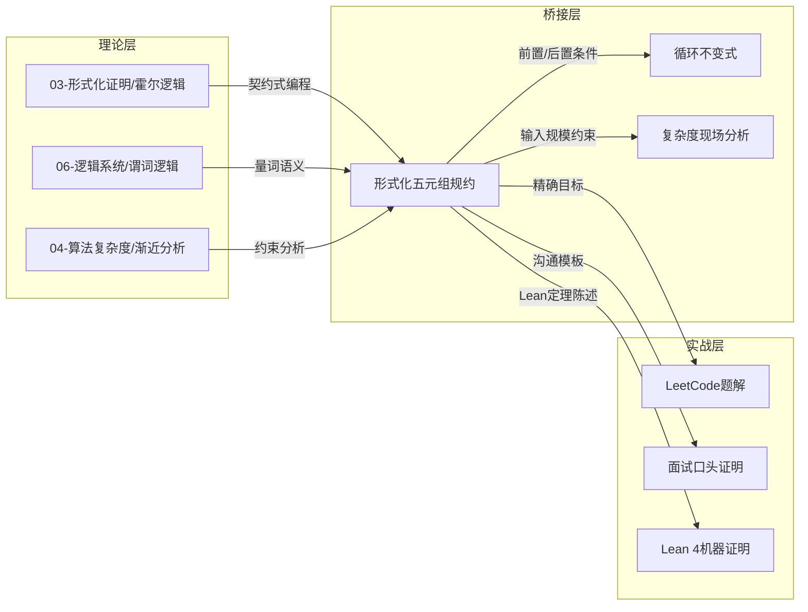

> 📊 **项目全面梳理**：详细的项目结构、模块详解和学习路径，请参阅 [`项目全面梳理-2025.md`](../../../项目全面梳理-2025.md)
> **关联文档**：[如何用Lean 4形式化证明LeetCode题目](../../01-How-To-Guides/formal-proof/如何用Lean4形式化证明LeetCode题目.md)（How-To）
> **上游理论**：[03-形式化证明/01-霍尔逻辑基础.md](../../../../03-形式化证明/01-霍尔逻辑基础.md)

## LeetCode 题解中的形式化规约方法论 / Formal Specification Methodology in LeetCode Solutions

### 摘要 / Executive Summary

- 本文档阐释**形式化规约**（Formal Specification）作为连接自然语言题意与严格数学证明的桥梁，在 LeetCode 算法面试准备中的方法论价值与实践策略。
- 核心命题：形式化规约不是"额外负担"，而是**降低认知复杂度**的工具——通过将模糊的题意翻译为精确的谓词逻辑，候选人在编码前就已消除了 80% 的边界条件错误。
- 本文档面向**希望理解"为什么需要形式化"**的读者，而非寻求"如何操作"步骤的执行者；后者请参阅关联 How-To 文档。

---

## 目录 / Table of Contents

- [LeetCode 题解中的形式化规约方法论 / Formal Specification Methodology in LeetCode Solutions](#leetcode-题解中的形式化规约方法论--formal-specification-methodology-in-leetcode-solutions)
  - [摘要 / Executive Summary](#摘要--executive-summary)
- [目录 / Table of Contents](#目录--table-of-contents)
- [1. 形式化规约的本质](#1-形式化规约的本质)
  - [1.1 从自然语言歧义到数学精确性](#11-从自然语言歧义到数学精确性)
  - [1.2 五元组的哲学基础](#12-五元组的哲学基础)
- [2. 五元组规约的构成原理](#2-五元组规约的构成原理)
  - [2.1 数据域 $D$：类型即约束](#21-数据域-d类型即约束)
  - [2.2 输入集合 $I$：合法世界的边界](#22-输入集合-i合法世界的边界)
  - [2.3 输出集合 $O$：承诺的精度](#23-输出集合-o承诺的精度)
  - [2.4 前置条件 $\\text{pre}$：算法可以假设什么](#24-前置条件-textpre算法可以假设什么)
  - [2.5 后置条件 $\\text{post}$：算法必须保证什么](#25-后置条件-textpost算法必须保证什么)
- [3. 从自然语言到谓词逻辑的转化策略](#3-从自然语言到谓词逻辑的转化策略)
  - [3.1 量词提取法](#31-量词提取法)
  - [3.2 边界显式化](#32-边界显式化)
  - [3.3 唯一性约束识别](#33-唯一性约束识别)
- [4. 面试语境下的规约简化](#4-面试语境下的规约简化)
  - [4.1 口语化规约模板](#41-口语化规约模板)
  - [4.2 白板上的"最小可行规约"](#42-白板上的最小可行规约)
- [5. 规约的质量标准](#5-规约的质量标准)
- [6. 与其他知识模块的关系](#6-与其他知识模块的关系)
- [7. 形式化规约的局限与反思](#7-形式化规约的局限与反思)
  - [7.1 何时不需要形式化规约](#71-何时不需要形式化规约)
  - [7.2 形式化与直觉的关系](#72-形式化与直觉的关系)
  - [7.3 从规约到沟通](#73-从规约到沟通)
- [参考文献](#参考文献)

---

## 1. 形式化规约的本质

### 1.1 从自然语言歧义到数学精确性

自然语言是 LeetCode 题目描述的载体，但也是**歧义的温床**。考虑以下题目片段：

> "给定一个整数数组 `nums` 和一个整数目标值 `target`，请你在该数组中找出和为目标值的那两个整数，并返回它们的数组下标。"

这段描述看似清晰，实则隐藏了至少 6 个未明确定义的问题：

| 隐含问题 | 自然语言的沉默 | 形式化规约的回答 |
|---------|-------------|---------------|
| 数组是否可以为空？ | 未提及 | $n \geq 2$（因为需要两个不同下标） |
| 解是否一定存在？ | "找出"暗示存在 | 前置条件需声明 $\exists i \neq j: \text{nums}[i] + \text{nums}[j] = \text{target}$ |
| 解是否唯一？ | "那两个"暗示唯一 | 后置条件需说明返回"任意一组"还是"最靠前的一组" |
| 两个下标是否可以相同？ | "两个整数"暗示不同 | $i \neq j$ 必须显式声明 |
| 数组元素是否有范围限制？ | 未提及 | $D = \mathbb{Z}^n$ 还是 $D = \{x \mid -10^9 \leq x \leq 10^9\}^n$？ |
| 返回值顺序是否有要求？ | "并返回"暗示有序 | $(i, j)$ 还是 $(j, i)$？是否要求 $i < j$？ |

**形式化规约的核心价值**在于：**在写下第一行代码之前，强制回答上述所有问题**。这不是过度工程，而是风险前置——在面试场景中，候选人若能在 30 秒内澄清这些边界，将极大降低后续实现中的返工概率。

### 1.2 五元组的哲学基础

五元组 $\Pi = (D, I, O, \text{pre}, \text{post})$ 并非本项目独创，其思想渊源可追溯至三个独立发展的理论传统：

**（一）霍尔逻辑（Hoare Logic, 1969）**

C. A. R. Hoare 在奠基性论文中提出，程序的正确性可通过前置条件与后置条件之间的逻辑关系来证明。霍尔三元组 $\{P\}\,C\,\{Q\}$ 正是五元组中 $\text{pre}$ 与 $\text{post}$ 的原型。

> **哲学洞察**：程序不是孤立的代码片段，而是**契约**——在满足 $P$ 的前提下执行 $C$，即可获得 $Q$ 的承诺。

**（二）VDM 与 Z 规约语言（1980s）**

维也纳开发方法（VDM）和 Z 语言将霍尔思想扩展到软件工程的工业实践中，明确区分了**状态空间**（对应 $D$）、**输入域**（对应 $I$）、**输出域**（对应 $O$）与**操作契约**（对应 $\text{pre}/\text{post}$）。

> **哲学洞察**：形式化规约应独立于实现，成为验证实现正确性的**客观标准**。

**（三）契约式编程（Design by Contract, Meyer 1986）**

Bertrand Meyer 在 Eiffel 语言中将前置/后置条件引入主流编程实践，提出"类的不变式"（class invariant）概念。这与 LeetCode 题解中的"循环不变式"形成完美映射。

> **哲学洞察**：契约不仅用于验证，更是**设计工具**——先写契约，再填实现，确保实现始终服务于明确的目标。

**本项目的整合**：五元组将上述三种传统统一为一个可操作的框架，特别针对算法面试的**时间受限**和**口头表达**场景进行了简化。

---

## 2. 五元组规约的构成原理

### 2.1 数据域 $D$：类型即约束

**定义**：$D$ 是问题中涉及的所有数据类型及其取值范围的集合。

在强类型语言（如 Lean 4、Rust、Haskell）中，$D$ 的选择直接决定了编译器能帮我们发现多少错误。在形式化规约中，$D$ 的精确描述是后续一切推理的基础。

**示例对比**：

| 粗粒度定义 | 问题 | 精化后定义 |
|-----------|------|-----------|
| $D = \text{Array}$ | 未说明元素类型 | $D = \mathbb{Z}^*$（整数序列） |
| $D = \mathbb{Z}^*$ | 未说明长度限制 | $D = \bigcup_{n=0}^{10^5} \mathbb{Z}^n$（长度上限 $10^5$） |
| $D = \mathbb{Z}^n$ | 未说明元素范围 | $D = \{A \in \mathbb{Z}^n \mid \forall i: |A[i]| \leq 10^9\}$ |

**面试应用**：

> 向面试官陈述："输入是一个长度不超过 $10^5$ 的整数序列，每个整数的绝对值不超过 $10^9$。这决定了我们不需要考虑大整数溢出，也暗示 $O(n^2)$ 算法可能超时。"

### 2.2 输入集合 $I$：合法世界的边界

**定义**：$I \subseteq D$ 是所有**合法输入**的集合。它回答了："在什么情况下，我可以要求算法给出正确结果？"

**关键区分**：$I$ 与 $\text{pre}$ 容易混淆，但二者有本质区别：

- $I$ 描述**输入的结构合法性**（如"数组长度为 $n$""图是连通的"）。
- $\text{pre}$ 描述**算法可依赖的语义假设**（如"数组已排序""至少存在一个解"）。

**示例（LeetCode 33：搜索旋转排序数组）**：

```
I = { (A, t) | A ∈ ℤⁿ, n ≥ 1, t ∈ ℤ }
pre(A, t) = ∃ k ∈ [0, n-1]: A 是某个有序数组在 k 处旋转的结果
```

$I$ 不要求数组是旋转有序的——那是 $\text{pre}$ 的工作。若输入不满足 $\text{pre}$，算法的行为是**未定义的**（undefined），而非必须返回错误。

**设计原则**：

- $I$ 应尽量宽泛，包含所有"语法合法"的输入。
- $\text{pre}$ 应精确描述"语义合法"的子集。
- 若题目未声明前置条件（如"假设输入总是合法的"），则 $\text{pre} \equiv \text{true}$。

### 2.3 输出集合 $O$：承诺的精度

**定义**：$O$ 是所有**语法合法**的输出值的集合。它与 $\text{post}$ 的区别类似于 $I$ 与 $\text{pre}$ 的区别。

**精度的层次**：

| 层次 | 后置条件 | 精度评价 | 示例 |
|------|---------|---------|------|
| L0 | $i \in O$ | 仅保证返回值类型正确 | 最差 |
| L1 | $\text{nums}[i] + \text{nums}[j] = \text{target}$ | 保证结果满足核心等式 | 及格 |
| L2 | $i \neq j \land \text{nums}[i] + \text{nums}[j] = \text{target}$ | 保证下标不同 | 良好 |
| L3 | $i < j \land \text{nums}[i] + \text{nums}[j] = \text{target}$ | 保证规范顺序 | 优秀 |
| L4 | 上述 + $i$ 是最小可能下标 | 保证唯一性/最优化 | 卓越 |

**面试启示**：

LeetCode 官方测试用例通常只检查 L1 或 L2，但面试官的追问往往涉及 L3 和 L4：

> "如果存在多组解，你的算法返回哪一组？为什么？"

形式化规约迫使我们在编码前就回答这个问题。

### 2.4 前置条件 $\text{pre}$：算法可以假设什么

**定义**：$\text{pre}: I \to \{\text{true}, \text{false}\}$ 描述算法执行前**必须为真**的条件。

**面试中的前置条件往往被忽略，但它们是形式化证明的基石**。考虑以下对比：

| 题目 | 显式前置条件 | 隐式前置条件（常被忽略） |
|------|------------|---------------------|
| LeetCode 1 | 无 | 至少存在一个解（官方保证） |
| LeetCode 15 | 数组长度 $n \geq 3$ | 输入可能无三元组解（需返回空列表） |
| LeetCode 704 | 数组有序 | 数组非空（实际实现应处理 $n=0$） |

**陷阱**：若前置条件过强（如假设 $n \geq 1$），而测试用例包含 $n=0$，则形式化证明在逻辑上是正确的（因为 $n=0$ 不满足前置条件，算法无需保证任何后置条件），但工程实现上仍可能崩溃。

**最佳实践**：

> 在形式化规约中声明**最弱前置条件**（weakest precondition），即算法正确运行所需的**最小**假设。若题目允许空输入，则不应将 $n \geq 1$ 放入 $\text{pre}$，而应让算法在 $n=0$ 时也返回合法结果。

### 2.5 后置条件 $\text{post}$：算法必须保证什么

**定义**：$\text{post}: I \times O \to \{\text{true}, \text{false}\}$ 描述输入与输出之间必须满足的关系。

**后置条件的设计是五元组中最需要技巧的部分**。一个好的后置条件应具备以下性质：

**性质一：可验证性**

给定输入 $x$ 和输出 $y$，应在多项式时间内判定 $\text{post}(x, y)$ 是否为真。否则，"验证答案正确"本身就成了一个难题。

**反例**：
> 若后置条件要求"返回全局最优解"，而验证全局最优性等价于求解原问题（如 NP-hard 问题），则此后置条件不可验证。

**性质二：完备性**

对于所有满足 $\text{pre}$ 的输入，至少存在一个输出满足 $\text{post}$。否则，算法在逻辑上不可能成功。

**性质三：最小充分性**

后置条件不应要求不必要的性质。例如，若题目只要求"返回任意一个满足条件的下标"，则后置条件不应要求"返回最小下标"——那会增加算法复杂度，且无必要。

---

## 3. 从自然语言到谓词逻辑的转化策略

将自然语言题意翻译为五元组，需要一套可复现的**翻译策略**。以下是三种核心策略。

### 3.1 量词提取法

自然语言中的限定词（"所有""存在""恰好一个""至多两个"）直接对应谓词逻辑中的量词。

**翻译表**：

| 自然语言 | 谓词逻辑 | 精度 |
|---------|---------|------|
| "找出数组中的一个重复数字" | $\exists x: \text{count}(x) \geq 2$ | 存在性 |
| "返回所有和为目标值的数对" | $\forall (i, j) \in \text{result}: \text{nums}[i] + \text{nums}[j] = \text{target}$ | 全称性 |
| "找出唯一缺失的数字" | $\exists! x \in [0, n]: x \notin \text{nums}$ | 唯一性 |
| "返回最左侧出现位置" | $\text{result} = \min\{i \mid \text{nums}[i] = \text{target}\}$ | 最优化 |

**操作步骤**：

1. 标记题目中所有限定词（"一个""所有""唯一""最"）。
2. 将每个限定词替换为对应的量词（$\exists$, $\forall$, $\exists!$, $\min$）。
3. 检查量词的作用域（scope）是否覆盖了正确的子表达式。

### 3.2 边界显式化

自然语言对边界条件的描述往往是**暗示性**的，形式化规约必须将其**显式化**。

**边界检查清单**：

```
□ 空输入（n = 0, 空树, 空图）
□ 单元素输入（n = 1）
□ 全相同元素（所有值相等）
□ 全不同元素（严格递增/互异）
□ 最大/最小值（INT_MAX, INT_MIN）
□ 循环/链表成环
□ 图不连通
□ 目标值不在输入中
```

**示例（LeetCode 141：环形链表）**：

自然语言："给定一个链表，判断链表中是否有环。"

显式化后的前置条件：

```
pre(head) = head 是合法的链表节点引用，或 null
```

显式化后的后置条件：

```
post(head, result) =
  result = true  ↔  从 head 出发的链表中存在环
  result = false ↔  从 head 出发的链表终止于 null
```

注意：自然语言未提及 `head = null` 的情况，但形式化规约必须覆盖。

### 3.3 唯一性约束识别

许多 LeetCode 题目在输出上存在**隐含的唯一性约束**。识别这些约束是设计正确后置条件的关键。

**类型学**：

| 约束类型 | 数学表达 | 典型题目 |
|---------|---------|---------|
| 存在性 | $\exists i: P(i)$ | LeetCode 1, 704 |
| 唯一性 | $\exists! i: P(i)$ | LeetCode 136（只出现一次的数字） |
| 最优化 | $\text{result} = \arg\max_{i} f(i)$ | LeetCode 53（最大子数组和） |
| 计数 | $\text{result} = |\{i \mid P(i)\}|$ | LeetCode 200（岛屿数量） |
| 构造性 | $\text{result}$ 满足全局约束 | LeetCode 23（合并 K 个升序链表） |

---

## 4. 面试语境下的规约简化

完整的五元组规约在面试白板上书写可能过于冗长。本节提供**面试友好型**的简化策略。

### 4.1 口语化规约模板

**中文模板**：

> "首先，我将题目形式化。输入是一个 [数据类型] $X$，满足 [前置条件]。我需要输出 [输出类型] $Y$，满足 [后置条件]。具体来说，[展开描述边界情况]。"

**English Template**：

> "First, let me formalize the problem. The input is a [data type] $X$ satisfying [precondition]. I need to output a [output type] $Y$ such that [postcondition]. Specifically, [describe boundary cases]."

**示例（LeetCode 704）**：

> "输入是一个有序整数数组 `nums`（长度 $n$ 可以为 $0$）和一个整数目标值 `target`。前置条件是 `nums` 按非递减顺序排列。我需要返回 `target` 的索引，如果不存在返回 $-1$。后置条件要求：如果 `target` 存在，返回最左侧出现位置；如果不存在，返回 $-1$。边界情况包括空数组、单元素数组、以及 `target` 在数组两端的情况。"

### 4.2 白板上的"最小可行规约"

在 2 分钟的时间限制下，只需写出**最核心的前置条件和后置条件**：

```
pre:  nums 已排序（非递减）
      n ≥ 0

post: 若 ∃j: nums[j] = target, 返回 min{j}
      否则返回 -1
```

**省略原则**：

- 数据域 $D$ 和输入集合 $I$ 通常可用自然语言一句话代替（"输入是整数数组"）。
- 输出集合 $O$ 若显而易见（如"整数"），可省略。
- 重点突出 $\text{pre}$ 中的**非平凡假设**（如"有序""无重复"）和 $\text{post}$ 中的**精度要求**（如"最左侧""所有解"）。

---

## 5. 规约的质量标准

评估一个形式化规约的质量，可从以下五个维度打分（每项 1-5 分）：

| 维度 | 5 分标准 | 1 分表现 |
|------|---------|---------|
| **精确性** | 消除所有自然语言歧义 | 关键术语未定义 |
| **完备性** | 覆盖所有边界条件 | 遗漏空输入或最大值情况 |
| **最小性** | 不包含不必要的约束 | 后置条件过强，增加实现难度 |
| **可验证性** | 给定输入输出可在多项式时间内验证 | 验证本身与求解难度相当 |
| **表达力** | 能直接导出循环不变式或归纳假设 | 与证明技术脱节 |

**自测问题**：

- 你的规约是否让"如何测试正确性"变得显而易见？
- 你的规约是否让"如何证明正确性"有了明确的靶点？
- 若将规约交给另一位工程师，他能否独立写出通过所有测试的代码？

---

## 6. 与其他知识模块的关系

形式化规约不是孤立存在的，它与项目中的多个模块形成**理论-实践闭环**：



**引用关系**：

- 形式化规约的前置/后置条件语法直接来源于 `03-形式化证明/01-霍尔逻辑基础.md` 中的霍尔三元组。
- 量词的使用遵循 `06-逻辑系统/` 中一阶谓词逻辑的语义规范。
- 输入规模约束（如 $n \leq 10^5$）与 `04-算法复杂度/` 中的复杂度分析形成联动——规模约束直接排除了某些算法策略。

---

## 7. 形式化规约的局限与反思

### 7.1 何时不需要形式化规约

形式化规约是有**成本**的。在以下场景中，过度形式化可能得不偿失：

| 场景 | 原因 | 替代策略 |
|------|------|---------|
| 极简单的题目（如 LeetCode 9：回文数） | 自然语言已足够精确 | 直接写代码， mentally 检查边界 |
| 时间极度受限的面试（< 15 分钟/题） | 形式化陈述占用过多时间 | 使用口语化模板，省略符号 |
| 探索性编程（prototyping） | 需求不确定，规约会频繁变更 | 先写测试用例，再反向推导规约 |

### 7.2 形式化与直觉的关系

形式化规约不应**替代**算法直觉，而应**校准**直觉。一个常见的误区是：

> "因为形式化规约很严谨，所以我应该先做完整规约，再开始思考算法。"

更合理的流程是：

1. **直觉阶段**（1-2 分钟）：快速识别算法范式（哈希表？双指针？DP？）。
2. **规约阶段**（1 分钟）：写出最小可行规约，澄清边界。
3. **验证阶段**（编码中）：用规约检查边界处理是否正确。
4. **证明阶段**（编码后）：基于规约写出循环不变式，完成正确性论证。

### 7.3 从规约到沟通

形式化规约的最终目的不是写在白板上给面试官看，而是**内化于心、外化于言**。当候选人能在 10 秒内 mentally 构造出五元组，并用 30 秒向面试官清晰陈述时，形式化训练的目的就已达成。

---

## 参考文献

1. [Hoare 1969] Hoare, C. A. R. (1969). "An Axiomatic Basis for Computer Programming." *Communications of the ACM*, 12(10), 576-580.
   - 霍尔逻辑的原始论文，前置条件/后置条件契约的理论基础。

2. [Meyer 1992] Meyer, B. (1992). "Applying 'Design by Contract'." *IEEE Computer*, 25(10), 40-51.
   - 契约式编程的工业实践指南，讨论了前置/后置条件作为设计工具的价值。

3. [Dijkstra 1976] Dijkstra, E. W. (1976). *A Discipline of Programming*. Prentice-Hall.
   - 最弱前置条件（weakest precondition）的系统化方法，五元组中 $\text{pre}$ 最小化原则的理论来源。

4. [Jones 1990] Jones, C. B. (1990). *Systematic Software Development Using VDM* (2nd ed.). Prentice-Hall.
   - VDM 方法中对数据域、输入集合、输出集合的严格区分，影响了五元组的结构设计。

5. [Spivey 1992] Spivey, J. M. (1992). *The Z Notation: A Reference Manual* (2nd ed.). Prentice-Hall.
   - Z 规约语言的谓词逻辑基础，量词提取法的形式化来源。

6. [Procida 2017] Procida, D. (2017). "The Diátaxis Framework." <https://diataxis.fr/>
   - 本文档所属的分类框架，解释为何"方法论讨论"属于 Explanation 而非 How-To。

---

**文档版本**: 1.0
**最后更新**: 2026-04-29
**状态**: 草案（Draft）
