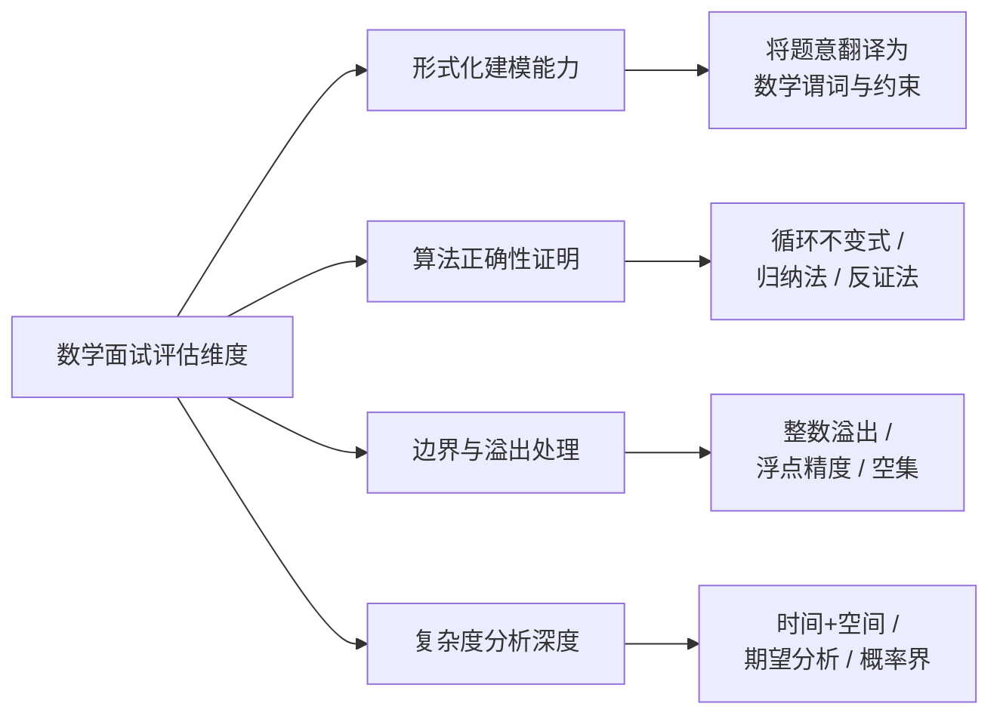
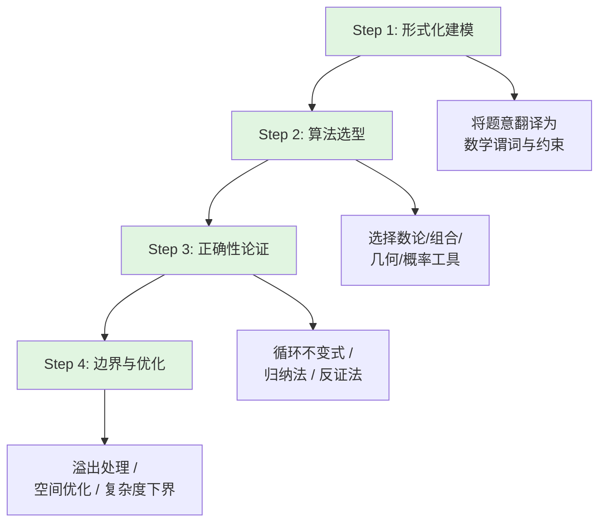
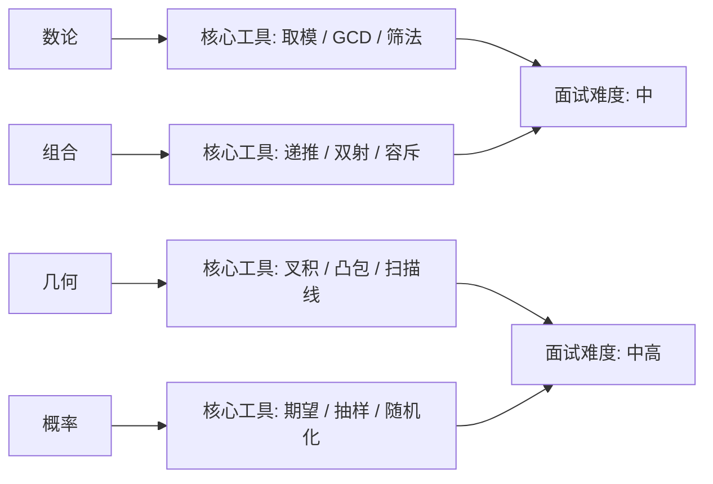
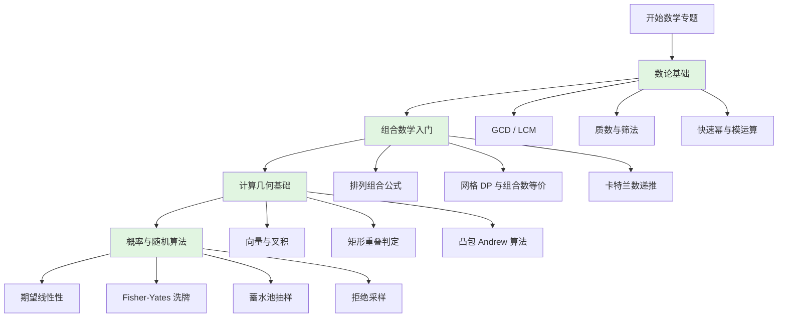
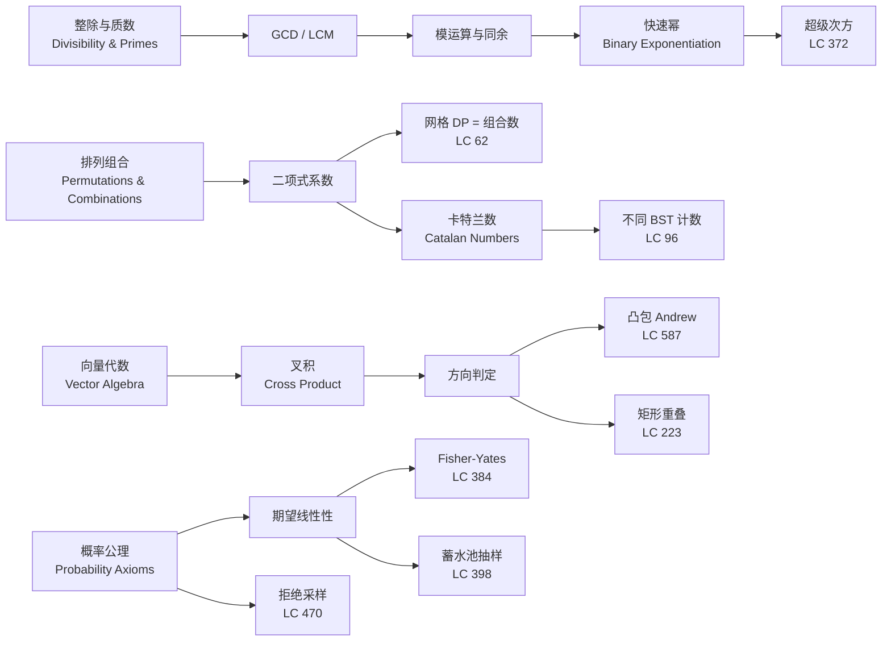
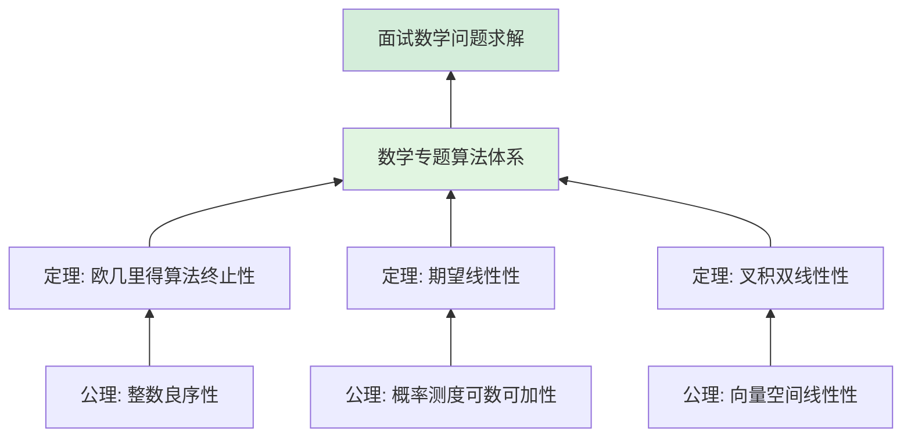

> 📊 **项目全面梳理**：详细的项目结构、模块详解和学习路径，请参阅 [`项目全面梳理-2025.md`](../../项目全面梳理-2025.md)

## 数学专题导论 / Mathematical Topics Introduction

### 摘要 / Executive Summary

- 数学是算法面试中的**高区分度考点**，约占 LeetCode 面试题库总量的 8%–12%，但在高级别（L4+）面试中出现的频率显著上升。数学专题的核心价值不在于“算得快”，而在于**建立从形式化定义到算法实现的严格推理链条**。
- 本专题将面试数学划分为四大分支——**数论（Number Theory）**、**组合数学（Combinatorics）**、**计算几何（Computational Geometry）**、**概率与随机算法（Probability & Randomized Algorithms）**——每分支均从形式化定义出发，链接至 `09-算法理论/` 中的上游理论，并通过经典 LeetCode 题目展示证明驱动的解题范式。
- 本文提供四大分支的**复杂度速查表**与**学习路径图**，帮助读者在面试准备中建立“定义 → 定理 → 算法 → 证明”的完整认知闭环。

### 关键术语与符号 / Glossary

| 术语 / Term | 定义 / Definition |
|-------------|-------------------|
| 数论 Number Theory | 研究整数性质及其结构的数学分支，包括整除、质数、同余、GCD 等 |
| 组合数学 Combinatorics | 研究离散结构计数、排列组合、递推关系与生成函数的数学分支 |
| 计算几何 Computational Geometry | 研究几何对象在计算机中的表示、构造与计算的算法学科 |
| 概率算法 Randomized Algorithm | 执行过程中引入随机性，其正确性或复杂度以概率形式 guarantee 的算法 |
| 蒙特卡洛方法 Monte Carlo Method | 通过大量随机采样估计数值结果的概率算法范式 |
| 指示器随机变量 Indicator Random Variable | 对事件 $A$ 定义 $I_A = 1$ 若 $A$ 发生，否则 $0$；满足 $\mathbb{E}[I_A] = P(A)$ |
| 期望线性性 Linearity of Expectation | 对任意随机变量 $X, Y$（不必独立），$\mathbb{E}[X+Y] = \mathbb{E}[X] + \mathbb{E}[Y]$ |
| 良序原理 Well-Ordering Principle | 非空正整数集必有最小元；是数学归纳法与算法终止性的根基 |

术语对齐与引用规范：`docs/术语与符号总表.md`，`01-基础理论/00-撰写规范与引用指南.md`

### 目录 / Table of Contents

- [数学专题导论 / Mathematical Topics Introduction](#数学专题导论--mathematical-topics-introduction)
  - [摘要 / Executive Summary](#摘要--executive-summary)
  - [关键术语与符号 / Glossary](#关键术语与符号--glossary)
  - [目录 / Table of Contents](#目录--table-of-contents)
  - [交叉引用与依赖 / Cross-References and Dependencies](#交叉引用与依赖--cross-references-and-dependencies)
- [1. 数学在面试中的地位](#1-数学在面试中的地位)
  - [1.1 面试分布与难度曲线](#11-面试分布与难度曲线)
  - [1.2 面试官评估维度](#12-面试官评估维度)
  - [1.3 数学在面试中的具体场景](#13-数学在面试中的具体场景)
  - [1.4 数学题的解题方法论](#14-数学题的解题方法论)
- [2. 与 `09-算法理论/` 的衔接](#2-与-09-算法理论-的衔接)
- [3. 四大分类体系](#3-四大分类体系)
  - [3.1 数论（Number Theory）](#31-数论number-theory)
  - [3.2 组合数学（Combinatorics）](#32-组合数学combinatorics)
  - [3.3 计算几何（Computational Geometry）](#33-计算几何computational-geometry)
  - [3.4 概率与随机算法（Probability \& Randomized Algorithms）](#34-概率与随机算法probability--randomized-algorithms)
- [4. 复杂度速查表](#4-复杂度速查表)
  - [4.1 数论算法复杂度](#41-数论算法复杂度)
  - [4.2 组合数学算法复杂度](#42-组合数学算法复杂度)
  - [4.3 计算几何算法复杂度](#43-计算几何算法复杂度)
  - [4.4 概率与随机算法复杂度](#44-概率与随机算法复杂度)
  - [4.5 跨分支综合对比](#45-跨分支综合对比)
- [5. 学习路径图](#5-学习路径图)
  - [5.1 推荐学习顺序](#51-推荐学习顺序)
  - [5.2 难度递进路线](#52-难度递进路线)
  - [5.3 面试前快速复习清单](#53-面试前快速复习清单)
- [6. 思维表征](#6-思维表征)
  - [6.1 概念依赖图](#61-概念依赖图)
  - [6.2 四大分支对比矩阵](#62-四大分支对比矩阵)
  - [6.3 公理定理证明树](#63-公理定理证明树)
- [7. 面试中的数学误区](#7-面试中的数学误区)
  - [误区 1：轻视 Easy 级别的数学题目](#误区-1轻视-easy-级别的数学题目)
  - [误区 2：只记公式不记证明](#误区-2只记公式不记证明)
  - [误区 3：忽略模运算的分配律条件](#误区-3忽略模运算的分配律条件)
  - [误区 4：混淆组合数与排列数](#误区-4混淆组合数与排列数)
- [8. 自测问题](#8-自测问题)
  - [问题 1：数论在面试中的核心价值](#问题-1数论在面试中的核心价值)
  - [问题 2：组合数学中“DP 与组合数”的等价性](#问题-2组合数学中dp-与组合数的等价性)
  - [问题 3：计算几何中叉积的几何意义](#问题-3计算几何中叉积的几何意义)
  - [问题 4：概率算法中的“期望线性性”为何强大](#问题-4概率算法中的期望线性性为何强大)
  - [问题 5：拒绝采样的效率保证](#问题-5拒绝采样的效率保证)
- [8. 学习目标](#8-学习目标)
- [9. 知识导航](#9-知识导航)
- [参考文献](#参考文献)

### 交叉引用与依赖 / Cross-References and Dependencies

**上游理论依赖 / Upstream Dependencies**:

- [`09-算法理论/数论算法/数论算法综述.md`](../../09-算法理论/数论算法/数论算法综述.md) — GCD、模运算、素性测试、离散对数等数论基础理论
- [`09-算法理论/01-算法基础/01-算法设计理论.md`](../../09-算法理论/01-算法基础/01-算法设计理论.md) — 算法分析基础与形式化规约方法
- [`04-算法复杂度/01-时间复杂度.md`](../../04-算法复杂度/01-时间复杂度.md) — 渐进记号与复杂度分析体系
- [`03-形式化证明/01-数学归纳法.md`](../../03-形式化证明/01-数学归纳法.md) — 归纳法在数论与组合证明中的核心作用
- [`05-类型理论/01-简单类型系统.md`](../../05-类型理论/01-简单类型系统.md) — 类型视角下的数学结构编码

**下游应用 / Downstream Applications**:

- `13-LeetCode算法面试专题/03-数学专题/01-数论基础（GCD-LCM-质数）.md` — 数论基础与经典面试题
- `13-LeetCode算法面试专题/03-数学专题/02-组合数学入门.md` — 组合计数与卡特兰数
- `13-LeetCode算法面试专题/03-数学专题/03-计算几何基础.md` — 向量运算与凸包算法
- `13-LeetCode算法面试专题/03-数学专题/04-概率与随机算法面试题.md` — 随机算法与期望分析

---

## 1. 数学在面试中的地位

### 1.1 面试分布与难度曲线

根据对 LeetCode 全题库的统计分析（截至 2026-Q1），数学相关标签的分布呈现以下特征：

| 难度 / Difficulty | 题量 | 占比 | 高频题型 |
|------------------|------|------|---------|
| Easy | ~180 道 | 4.2% | 回文数、GCD、基础计数 |
| Medium | ~320 道 | 7.5% | 快速幂、不同路径、蓄水池抽样 |
| Hard | ~140 道 | 3.3% | 超级次方、凸包、高级概率推导 |
| **合计** | **~640 道** | **~15%** | — |

> 注：一道题目可能同时携带 `math`、`geometry`、`probability` 等多个标签，故合计占比与分难度占比之和不完全对应。

**关键洞察 / Key Insight**：数学题的**区分度**远高于其数量占比。Easy 级别的数学题目（如 LC 9 回文数）考察的是**边界处理与严谨性**；Medium/Hard 级别（如 LC 372 超级次方、LC 587 安装栅栏）则要求面试者能够在有限时间内完成**形式化建模**并给出**正确性论证**。

### 1.2 面试官评估维度

在工程面试中，数学题目的评估通常聚焦以下四个维度：

### 1.3 数学在面试中的具体场景

| 场景 / Scenario | 涉及分支 | 典型问题 | 能力映射 |
|----------------|---------|---------|---------|
| 分布式 ID 生成 | 数论 | 雪花算法中的时钟回拨处理 | GCD、取模运算 |
| 一致性哈希 | 数论 | 虚拟节点与环上的位置计算 | 模运算、质数选取 |
| 密码学基础 | 数论 | RSA 公钥生成中的大素数判定 | 素性测试、模幂运算 |
| 推荐系统排序 | 组合数学 | 多路召回后的重排策略 | 排列组合、概率加权 |
| 游戏开发 | 计算几何 | 碰撞检测与路径规划 | 叉积、凸包、射线法 |
| 地图服务 | 计算几何 | POI 检索与围栏判定 | 点在多边形内、矩形相交 |
| AB 测试 | 概率 | 样本量计算与显著性检验 | 期望、方差、中心极限定理 |
| 流式采样 | 概率 | 实时日志的均匀抽样 | 蓄水池抽样、期望分析 |

### 1.4 数学题的解题方法论

面对一道数学面试题，推荐采用以下**四步解题法**：

**Step 1 — 形式化建模**：明确输入域、输出域、前置条件与后置条件。例如，LC 372 的超级次方需要将“数组 $b$ 表示大整数”这一题意翻译为 $\text{value}(b) = \sum b[i] \cdot 10^{k-1-i}$。

**Step 2 — 算法选型**：根据问题特征选择正确的数学工具。快速幂用于大指数模幂，筛法用于质数计数，蓄水池抽样用于流式均匀采样。

**Step 3 — 正确性论证**：给出非平凡的证明。即使是 Easy 题目（如回文数），也应能论证“反转半段不会溢出”。

**Step 4 — 边界与优化**：检查整数溢出、空输入、单点输入，并考虑空间优化（如滚动数组、分段筛）。

---

## 2. 与 `09-算法理论/` 的衔接

本专题并非孤立的“刷题集合”，而是 `09-算法理论/` 中数学分支的**面试导向提炼**。二者的衔接关系如下：

| 本专题文档 | 对应理论文档 | 衔接点 |
|-----------|-------------|--------|
| `01-数论基础` | `09-算法理论/数论算法/数论算法综述.md` | 将 GCD/质数/模运算的理论综述转化为可编码、可证明的面试题解 |
| `02-组合数学入门` | `09-算法理论/03-经典算法/组合生成.md` | 将组合生成与计数的理论框架应用于网格路径、BST 计数等具体问题 |
| `03-计算几何基础` | `09-算法理论/04-高级算法理论/计算几何.md` | 将向量代数与凸包理论转化为代码实现与叉积方向判定证明 |
| `04-概率与随机算法` | `09-算法理论/07-随机算法/随机算法理论.md` | 将期望线性性、Monte Carlo 方法应用于洗牌、抽样、拒绝采样等面试高频题 |

**学习建议 / Study Advice**：

1. **先理论后面试**：阅读 `09-算法理论/` 对应章节，建立形式化定义与定理体系。
2. **再面试后理论**：通过本专题的经典题目，反向验证理论在编码层面的落地方式。
3. **闭环验证**：对每道题目尝试独立写出“前置条件 → 循环不变式 → 终止性 → 后置条件”的完整证明。

---

## 3. 四大分类体系

### 3.1 数论（Number Theory）

**核心概念**：整除、GCD、LCM、质数、互质、同余、模逆元、快速幂。

**面试价值**：数论题目是考察候选人**严谨性**与**基础数学素养**的经典载体。GCD 的欧几里得算法、质数的筛法、快速幂的二进制分解，均要求在实现层面避免溢出、在证明层面给出终止性与正确性论证。

**代表题目**：

- LC 9 — 回文数（边界与溢出避免）
- LC 204 — 计数质数（筛法与复杂度分析）
- LC 50 — Pow(x, n)（快速幂与二进制分解证明）
- LC 372 — 超级次方（模运算性质与递归分解）

### 3.2 组合数学（Combinatorics）

**核心概念**：排列、组合、二项式系数、卡特兰数、容斥原理、递推关系。

**面试价值**：组合数学题目通常具有**多解法特征**（如 LC 62 可用 DP 或组合数直接计算），面试官通过此类题目评估候选人能否在不同解法间进行**复杂度权衡**与**正确性等价性证明**。

**代表题目**：

- LC 62 — 不同路径（网格 DP = 组合数的等价性证明）
- LC 96 — 不同的二叉搜索树（卡特兰数的结构计数双射）

### 3.3 计算几何（Computational Geometry）

**核心概念**：向量、点积、叉积、凸包、点在多边形内、线段相交。

**面试价值**：计算几何在工程面试中出现频率中等，但在**游戏开发、图形学、GIS、机器人路径规划**等方向的面试中权重显著。核心考察点是**叉积方向判定的几何直观与代数证明**。

**代表题目**：

- LC 223 — 矩形面积（一维重叠判定向二维的推广）
- LC 587 — 安装栅栏（凸包的 Andrew 算法与叉积单调性）

### 3.4 概率与随机算法（Probability & Randomized Algorithms）

**核心概念**：期望线性性、指示器随机变量、蒙特卡洛方法、拒绝采样、蓄水池抽样。

**面试价值**：随机算法题目在**系统设计、分布式一致性、AB 测试、推荐系统**等场景的面试中日益重要。考察重点不是“写出随机函数”，而是**证明均匀性**或**推导期望复杂度**。

**代表题目**：

- LC 384 — 打乱数组（Fisher-Yates 洗牌的均匀性证明）
- LC 398 — 随机数索引（蓄水池抽样 $k=1$ 的期望正确性）
- LC 470 — 用 Rand7() 实现 Rand10()（拒绝采样的期望次数推导）

---

## 4. 复杂度速查表

### 4.1 数论算法复杂度

| 算法 / Algorithm | 时间复杂度 / Time | 空间复杂度 / Space | 关键定理 / Key Theorem |
|-----------------|------------------|-------------------|----------------------|
| 欧几里得 GCD | $O(\log \min(a,b))$ | $O(1)$ | 欧几里得引理：$\gcd(a,b) = \gcd(b, a \bmod b)$ |
| 埃氏筛 | $O(n \log \log n)$ | $O(n)$ | 调和级数上界：$\sum_{p \leq n} 1/p \sim \ln \ln n$ |
| 线性筛 | $O(n)$ | $O(n)$ | 每个合数仅被其最小质因子筛除一次 |
| 快速幂 | $O(\log n)$ | $O(1)$ | 二进制分解：$a^n = \prod_{i: b_i=1} a^{2^i}$ |
| 扩展欧几里得 | $O(\log \min(a,b))$ | $O(1)$ | Bézout 恒等式：$ax + by = \gcd(a,b)$ |

### 4.2 组合数学算法复杂度

| 算法 / Algorithm | 时间复杂度 / Time | 空间复杂度 / Space | 关键定理 / Key Theorem |
|-----------------|------------------|-------------------|----------------------|
| 网格 DP（LC 62） | $O(m \cdot n)$ | $O(m \cdot n)$ 或 $O(\min(m,n))$ | 最优子结构：$dp[i][j] = dp[i-1][j] + dp[i][j-1]$ |
| 组合数直接计算 | $O(\min(m,n))$ | $O(1)$ | 乘法公式：$C(n,k) = \frac{n}{k} \cdot C(n-1, k-1)$ |
| 卡特兰数 DP | $O(n^2)$ | $O(n)$ | 递推：$C_n = \sum_{i=0}^{n-1} C_i C_{n-1-i}$ |
| 卡特兰数闭式 | $O(n)$ | $O(1)$ | 中心二项式系数：$C_n = \frac{1}{n+1}\binom{2n}{n}$ |

### 4.3 计算几何算法复杂度

| 算法 / Algorithm | 时间复杂度 / Time | 空间复杂度 / Space | 关键定理 / Key Theorem |
|-----------------|------------------|-------------------|----------------------|
| 叉积方向判定 | $O(1)$ | $O(1)$ | $\vec{a} \times \vec{b} = a_x b_y - a_y b_x$ 的符号决定方向 |
| 矩形重叠判定 | $O(1)$ | $O(1)$ | 一维投影相交 $[a,b] \cap [c,d] \neq \emptyset$ 的推广 |
| Andrew 凸包 | $O(n \log n)$ | $O(n)$ | 按 $x$ 坐标排序后，上下凸壳分别维护单调链 |
| Graham 扫描 | $O(n \log n)$ | $O(n)$ | 极角排序后，栈顶三点叉积非负时弹栈 |

### 4.4 概率与随机算法复杂度

| 算法 / Algorithm | 期望时间 / Expected Time | 空间复杂度 / Space | 关键定理 / Key Theorem |
|-----------------|------------------------|-------------------|----------------------|
| Fisher-Yates 洗牌 | $O(n)$ | $O(1)$ | 每次交换后，前 $i$ 个位置均匀分布（归纳证明） |
| 蓄水池抽样 $k=1$ | $O(n)$ | $O(1)$ | 第 $i$ 个元素被选中概率 $= 1/i$；最终概率 $= 1/n$ |
| 拒绝采样 | $O(1)$（期望） | $O(1)$ | 接受概率 $p = 40/49$；期望轮次 $= 1/p = 49/40$ |

### 4.5 跨分支综合对比

| 维度 | 数论 | 组合 | 几何 | 概率 |
|------|------|------|------|------|
| **形式化深度** | 高（引理+归纳） | 中（双射+递推） | 中（向量代数） | 高（期望推导） |
| **代码量** | 少（< 30 行） | 中（30–50 行） | 中（40–60 行） | 少（< 30 行） |
| **证明必要性** | 高 | 中 | 中 | 高 |
| **典型陷阱** | 溢出、负数 | 阶乘溢出、边界 | 精度、坐标顺序 | 模偏置、概率写反 |

---

## 5. 学习路径图

### 5.1 推荐学习顺序

### 5.2 难度递进路线

| 阶段 | 目标 | 推荐题目 | 预计用时 |
|------|------|---------|---------|
| 入门 | 掌握基础数学工具的实现 | LC 9, LC 204, LC 50 | 2–3 天 |
| 进阶 | 理解组合结构与等价性证明 | LC 62, LC 96 | 2–3 天 |
| 提高 | 掌握几何与随机算法的证明 | LC 223, LC 384, LC 470 | 3–4 天 |
| 综合 | 跨领域综合应用 | LC 372, LC 587, LC 398 | 3–4 天 |

### 5.3 面试前快速复习清单

在距离面试 1–2 周时，建议按以下优先级复习：

**P0（必须熟练）**：

- GCD 的欧几里得算法及正确性证明
- 快速幂的二进制分解与模运算分配律
- 埃氏筛/线性筛的原理与复杂度
- Fisher-Yates 洗牌的均匀性证明

**P1（高概率考察）**：

- 网格 DP 与组合数的等价性
- 卡特兰数的递推与 BST 双射
- 叉积方向判定与凸包 Andrew 算法
- 蓄水池抽样的期望正确性

**P2（加分项）**：

- 扩展欧几里得与模逆元
- 容斥原理在计数中的应用
- 点在多边形内的射线法
- 拒绝采样的期望轮次推导

---

## 6. 思维表征

### 6.1 概念依赖图

### 6.2 四大分支对比矩阵

| 维度 / Dimension | 数论 | 组合数学 | 计算几何 | 概率与随机 |
|----------------|------|---------|---------|-----------|
| **核心数据结构** | 整数、数组 | 网格、树 | 点、向量、多边形 | 数组、流 |
| **核心操作** | 取模、筛除、辗转相除 | 递推、计数、双射 | 叉积、排序、栈 | 随机采样、概率累积 |
| **典型复杂度** | $O(\log n)$ ~ $O(n)$ | $O(n^2)$ ~ $O(n)$ | $O(n \log n)$ | $O(n)$（期望） |
| **证明工具** | 欧几里得引理、归纳法 | 组合双射、递推归纳 | 向量代数、单调性 | 期望线性性、归纳法 |
| **面试出现场景** | 基础编码题、密码学背景 | 路径计数、BST 相关 | 游戏/GIS/图形学 | 系统设计、分布式、ML |

### 6.3 公理定理证明树

---

## 7. 面试中的数学误区

### 误区 1：轻视 Easy 级别的数学题目

**表现**: 认为 LC 9 回文数、LC 204 计数质数过于简单，不值得花时间深入理解。

**纠正**: Easy 级别的数学题目恰恰是考察**严谨性**的利器。回文数的溢出避免、埃氏筛的内层循环起点、快速幂的负数指数处理，每一个边界都对应着工程中的真实陷阱。面试官通过这类题目筛选出“能写出无 Bug 代码”的候选人。

### 误区 2：只记公式不记证明

**表现**: 背下了卡特兰数的闭式 $C_n = \frac{1}{n+1}\binom{2n}{n}$，但无法解释其组合意义，也无法推导递推关系。

**纠正**: 面试中一旦遇到变形题（如“求由 n 个节点组成的不同满二叉树数量”），仅靠死记公式无法应对。必须理解**递推结构的来源**（乘法原理 + 加法原理）以及**双射的建立方式**。

### 误区 3：忽略模运算的分配律条件

**表现**: 认为 $(a + b) \bmod m = ((a \bmod m) + (b \bmod m)) \bmod m$ 对除法也成立。

**纠正**: 模意义下的除法等价于乘以模逆元，而模逆元仅在 $\gcd(b, m) = 1$ 时存在。这是 LC 372 超级次方等题目的关键陷阱。

### 误区 4：混淆组合数与排列数

**表现**: 在网格路径问题中，错误地使用排列数 $P(m+n-2, m-1)$ 而非组合数 $C(m+n-2, m-1)$。

**纠正**: 网格路径问题中，路径由 $m-1$ 个 D 和 $n-1$ 个 R 构成，D 与 D 之间不可区分。若使用排列数，则会对相同的 D 序列进行重复计数。必须使用组合数消除不可区分元素的排列冗余。

---

## 8. 自测问题

### 问题 1：数论在面试中的核心价值

**Q**: 为什么数论题目（如 GCD、质数筛）在工程面试中仍有重要地位？

**A**: 数论题目考察的核心是**严谨的形式化推理能力**与**边界处理意识**。例如，快速幂的二进制分解证明要求面试者理解“为何平方-乘策略是正确的”；回文数的反转过程要求处理整数溢出边界。这些能力与日常工程中的**协议设计、加密算法选型、分布式 ID 生成**等场景直接相关。

---

### 问题 2：组合数学中“DP 与组合数”的等价性

**Q**: LC 62 “不同路径”为何既可用二维 DP 求解，也可直接用组合数 $C(m+n-2, m-1)$ 计算？

**A**: 两种方法本质上在计数同一组合结构——从网格左上角到右下角、只能向右或向下的所有单调路径集合。DP 的递推式 $dp[i][j] = dp[i-1][j] + dp[i][j-1]$ 正是组合恒等式 $C(n,k) = C(n-1,k) + C(n-1,k-1)$ 的网格化表达。二者在代数上是等价的，但 DP 更通用（可处理障碍物变体），组合数公式更高效（$O(\min(m,n))$ 时间）。

---

### 问题 3：计算几何中叉积的几何意义

**Q**: 二维叉积 $\vec{a} \times \vec{b} = a_x b_y - a_y b_x$ 的符号如何决定两向量的相对方向？

**A**: 叉积的符号等于以 $\vec{a}, \vec{b}$ 为邻边的平行四边形的“有向面积”。在标准右手坐标系中：

- 正值：$\vec{b}$ 在 $\vec{a}$ 的**逆时针方向**（左侧）
- 负值：$\vec{b}$ 在 $\vec{a}$ 的**顺时针方向**（右侧）
- 零：两向量**共线**

此性质是凸包算法中“左转判定”与线段相交判定的代数根基。

---

### 问题 4：概率算法中的“期望线性性”为何强大

**Q**: 期望线性性 $E[X+Y] = E[X] + E[Y]$ 的强大之处在哪里？

**A**: 该等式**不要求 $X$ 与 $Y$ 独立**。在分析复杂随机过程（如随机化快速排序的比较次数、Fisher-Yates 洗牌的均匀性）时，我们可以将总期望拆分为若干指示器随机变量之和，分别计算每个简单事件的期望再相加，从而绕过复杂的联合分布计算。

---

### 问题 5：拒绝采样的效率保证

**Q**: LC 470 中，用 Rand7() 实现 Rand10() 的拒绝采样，为何期望调用次数是有限的？

**A**: 拒绝采样的核心思想是在一个“超集”上均匀采样，然后拒绝掉不属于目标集的样本。对于 Rand7() 生成 $1..49$ 的均匀整数，我们只接受 $1..40$ 的样本，接受概率 $p = 40/49$。由于每次实验独立同分布，成功所需的期望实验次数服从几何分布，期望值为 $1/p = 49/40 = 1.225$，为一个与输入无关的常数。

---

## 8. 学习目标

完成本章学习后，读者应能够：

1. **定位问题**：给定一道 LeetCode 数学题目，判断其属于数论/组合/几何/概率四大分支中的哪一类，并选择正确的算法工具。
2. **建立衔接**：理解本专题与 `09-算法理论/` 中上游理论文档的对应关系，能够在需要时查阅理论细节。
3. **形式化证明**：对数论中的 GCD、组合中的卡特兰数、几何中的叉积、概率中的期望线性性，独立给出非平凡的正确性论证。
4. **复杂度权衡**：面对多解法的数学题目（如 LC 62），能够从时间、空间、可扩展性三个维度进行解法对比与选型。
5. **代码实现**：在无 IDE 提示的面试环境下，准确、健壮地实现快速幂、筛法、蓄水池抽样等核心算法模板。

---

## 9. 知识导航

- [返回目录](../README.md)
- [下一章：01-数论基础（GCD-LCM-质数）](./01-数论基础（GCD-LCM-质数）.md)
- [上一章：02-算法范式专题/08-动态规划.md](../02-算法范式专题/08-动态规划.md)

---

## 参考文献

1. **T. H. Cormen, C. E. Leiserson, R. L. Rivest, C. Stein**, *Introduction to Algorithms*, 3rd ed., MIT Press, 2009.
2. **D. E. Knuth**, *The Art of Computer Programming, Vol. 2: Seminumerical Algorithms*, 3rd ed., Addison-Wesley, 1997.
3. **R. Graham, D. Knuth, O. Patashnik**, *Concrete Mathematics: A Foundation for Computer Science*, 2nd ed., Addison-Wesley, 1994.
4. **M. de Berg, O. Cheong, M. van Kreveld, M. Overmars**, *Computational Geometry: Algorithms and Applications*, 3rd ed., Springer, 2008.
5. **R. Motwani, P. Raghavan**, *Randomized Algorithms*, Cambridge University Press, 1995.
