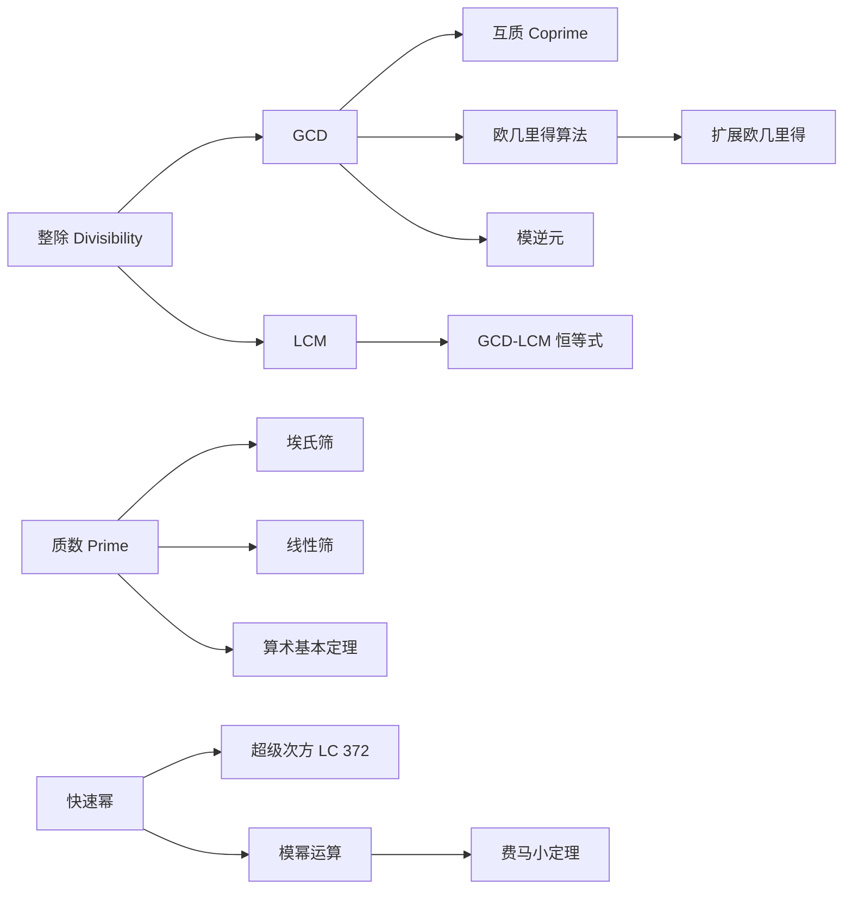

> 📊 **项目全面梳理**：详细的项目结构、模块详解和学习路径，请参阅 [`项目全面梳理-2025.md`](../../项目全面梳理-2025.md)

## 数论基础（GCD-LCM-质数）/ Number Theory Basics (GCD, LCM, Primes)

### 摘要 / Executive Summary

- 数论是算法面试中最基础、最高频的数学分支之一，核心工具包括**最大公约数（GCD）**、**最小公倍数（LCM）**、**质数判定与筛法**、**快速幂**与**模运算**。本文从整除的形式化定义出发，建立 GCD 与 LCM 的代数结构，给出欧几里得算法的严格正确性证明。
- 通过 LeetCode 204/9/50/372 四道经典题目，展示从形式化规约、循环不变式设计到代码实现与复杂度分析的完整链条。每道题目均附带中英文形式化证明，包括埃氏筛/线性筛的复杂度论证、快速幂二进制分解的代数基础，以及超级次方中模运算分配律的应用。
- 本文包含 4 个 Mermaid 思维表征图与不少于 5 道自测问题，帮助读者构建从定义到证明的数论知识体系。

### 关键术语与符号 / Glossary

| 术语 / Term | 定义 / Definition |
|-------------|-------------------|
| 整除 Divisibility | $a \mid b \Leftrightarrow \exists k \in \mathbb{Z}: b = a \cdot k$ |
| 最大公约数 GCD | $\gcd(a,b) = \max\{ d \mid d \mid a \land d \mid b \}$ |
| 最小公倍数 LCM | $\operatorname{lcm}(a,b) = \min\{ m > 0 \mid a \mid m \land b \mid m \}$ |
| 质数 Prime | $p > 1$ 且其正因子仅有 $1$ 和 $p$ |
| 互质 Coprime | $\gcd(a,b) = 1$ |
| 欧几里得引理 Euclid's Lemma | $\gcd(a,b) = \gcd(b, a \bmod b)$ |
| 快速幂 Binary Exponentiation | 通过二进制分解指数，将幂运算复杂度降至 $O(\log n)$ |
| 模运算分配律 Modular Distributivity | $(a \cdot b) \bmod m = ((a \bmod m) \cdot (b \bmod m)) \bmod m$ |

术语对齐与引用规范：`docs/术语与符号总表.md`，`01-基础理论/00-撰写规范与引用指南.md`

### 目录 / Table of Contents

- [数论基础（GCD-LCM-质数）](#数论基础gcd-lcm-质数)
  - [摘要 / Executive Summary](#摘要--executive-summary)
  - [关键术语与符号 / Glossary](#关键术语与符号--glossary)
  - [目录 / Table of Contents](#目录--table-of-contents)
  - [交叉引用与依赖 / Cross-References and Dependencies](#交叉引用与依赖--cross-references-and-dependencies)
  - [1. 形式化定义 / Formal Definitions](#1-形式化定义--formal-definitions)
    - [1.1 整除与 GCD/LCM](#11-整除与-gcdlcm)
    - [1.2 质数与互质](#12-质数与互质)
    - [1.3 模运算与同余](#13-模运算与同余)
  - [2. 核心思路与算法框架](#2-核心思路与算法框架)
    - [2.1 欧几里得算法](#21-欧几里得算法)
    - [2.2 筛法框架](#22-筛法框架)
    - [2.3 快速幂框架](#23-快速幂框架)
  - [3. 经典题目详解](#3-经典题目详解)
  - [4. 复杂度分析体系](#4-复杂度分析体系)
  - [5. 正确性证明框架](#5-正确性证明框架)
  - [6. 思维表征](#6-思维表征)
  - [7. 常见错误与反模式](#7-常见错误与反模式)
  - [8. 自测问题](#8-自测问题)
  - [9. 学习目标](#9-学习目标)
  - [10. 知识导航](#10-知识导航)
  - [参考文献](#参考文献)

### 交叉引用与依赖 / Cross-References and Dependencies

**上游理论依赖 / Upstream Dependencies**:

- [`09-算法理论/数论算法/数论算法综述.md`](../../09-算法理论/数论算法/数论算法综述.md) — 数论算法的理论综述与扩展内容
- `03-形式化证明/01-数学归纳法.md` — 归纳法在数论证明中的核心应用
- [`04-算法复杂度/01-时间复杂度.md`](../../04-算法复杂度/01-时间复杂度.md) — 渐进记号与复杂度分析

**下游应用 / Downstream Applications**:

- `13-LeetCode算法面试专题/03-数学专题/02-组合数学入门.md` — 组合数学中的模运算与计数
- `13-LeetCode算法面试专题/03-数学专题/04-概率与随机算法面试题.md` — 模运算在随机算法中的应用

---

## 1. 形式化定义 / Formal Definitions

### 1.1 整除与 GCD/LCM

**定义 1.1** (整除 / Divisibility)
对于整数 $a, b \in \mathbb{Z}$，若存在整数 $k$ 使得 $b = a \cdot k$，则称 $a$ **整除** $b$，记作 $a \mid b$。

**定义 1.2** (最大公约数 / GCD)
对于不全为零的整数 $a, b$，其**最大公约数**定义为：

$$
\gcd(a,b) = \max \{ d \in \mathbb{Z}^+ \mid d \mid a \land d \mid b \}
$$

**定义 1.3** (最小公倍数 / LCM)
对于正整数 $a, b$，其**最小公倍数**定义为：

$$
\operatorname{lcm}(a,b) = \min \{ m \in \mathbb{Z}^+ \mid a \mid m \land b \mid m \}
$$

**定理 1.4** (GCD-LCM 恒等式)
对任意正整数 $a, b$：

$$
\gcd(a,b) \cdot \operatorname{lcm}(a,b) = a \cdot b
$$

*证明*: 设 $d = \gcd(a,b)$，则 $a = d \cdot a'$，$b = d \cdot b'$，其中 $\gcd(a', b') = 1$。由 LCM 定义，$\operatorname{lcm}(a,b) = d \cdot a' \cdot b'$。因此：

$$
\gcd(a,b) \cdot \operatorname{lcm}(a,b) = d \cdot (d \cdot a' \cdot b') = (d \cdot a') \cdot (d \cdot b') = a \cdot b
$$

证毕。$\square$

### 1.2 质数与互质

**定义 1.5** (质数 / Prime Number)
整数 $p > 1$ 称为**质数**，若其正因子集合恰好为 $\{1, p\}$。否则称为**合数**（Composite）。

**定义 1.6** (互质 / Coprime)
整数 $a, b$ 称为**互质**，若 $\gcd(a,b) = 1$。

**定理 1.7** (算术基本定理 / Fundamental Theorem of Arithmetic)
每个大于 1 的整数 $n$ 都可以唯一地（不计顺序）表示为质数的乘积：

$$
n = p_1^{e_1} \cdot p_2^{e_2} \cdots p_k^{e_k}
$$

其中 $p_1 < p_2 < \dots < p_k$ 为质数，$e_i \geq 1$。

### 1.3 模运算与同余

**定义 1.8** (同余 / Congruence)
对于整数 $a, b$ 和正整数 $m$，若 $m \mid (a - b)$，则称 $a$ 与 $b$ **模 $m$ 同余**，记作：

$$
a \equiv b \pmod{m}
$$

**定理 1.9** (模运算的基本性质)
若 $a \equiv b \pmod{m}$ 且 $c \equiv d \pmod{m}$，则：

1. $a + c \equiv b + d \pmod{m}$
2. $a - c \equiv b - d \pmod{m}$
3. $a \cdot c \equiv b \cdot d \pmod{m}$

**定理 1.10** (模运算分配律)
对任意整数 $a, b$ 和正整数 $m$：

$$
(a \cdot b) \bmod m = ((a \bmod m) \cdot (b \bmod m)) \bmod m
$$

*证明*: 设 $a = q_1 m + r_1$，$b = q_2 m + r_2$，其中 $0 \leq r_1, r_2 < m$。则：

$$
a \cdot b = (q_1 m + r_1)(q_2 m + r_2) = q_1 q_2 m^2 + (q_1 r_2 + q_2 r_1)m + r_1 r_2
$$

前三项均为 $m$ 的倍数，故：

$$
a \cdot b \equiv r_1 \cdot r_2 \equiv (a \bmod m) \cdot (b \bmod m) \pmod{m}
$$

证毕。$\square$

---

## 2. 核心思路与算法框架

### 2.1 欧几里得算法

**算法描述 / Algorithm Description**:

```text
GCD(a, b):
    while b ≠ 0:
        (a, b) ← (b, a mod b)
    return |a|
```

**定理 2.1** (欧几里得引理 / Euclid's Lemma)
对任意整数 $a, b$ 且 $b \neq 0$：

$$
\gcd(a, b) = \gcd(b, a \bmod b)
$$

*证明*: 设 $d = \gcd(a,b)$。由于 $a \bmod b = a - \lfloor a/b \rfloor \cdot b$，且 $d \mid a$、$d \mid b$，故 $d \mid (a \bmod b)$。因此 $d$ 是 $b$ 与 $a \bmod b$ 的公因子，$d \leq \gcd(b, a \bmod b)$。

反之，设 $d' = \gcd(b, a \bmod b)$。由于 $a = \lfloor a/b \rfloor \cdot b + (a \bmod b)$，且 $d' \mid b$、$d' \mid (a \bmod b)$，故 $d' \mid a$。因此 $d' \leq \gcd(a,b)$。

综上，$\gcd(a,b) = \gcd(b, a \bmod b)$。证毕。$\square$

### 2.2 筛法框架

**埃拉托斯特尼筛法（埃氏筛）/ Sieve of Eratosthenes**:

```text
Sieve(n):
    is_prime[0..n] ← [false, false, true, true, ..., true]
    for i from 2 to √n:
        if is_prime[i]:
            for j from i² to n step i:
                is_prime[j] ← false
    return is_prime
```

**线性筛（欧拉筛）/ Linear Sieve**:

```text
LinearSieve(n):
    is_prime[0..n] ← [false, false, true, ..., true]
    primes ← empty list
    for i from 2 to n:
        if is_prime[i]:
            primes.append(i)
        for p in primes:
            if i · p > n: break
            is_prime[i · p] ← false
            if i mod p = 0: break
    return primes
```

### 2.3 快速幂框架

**算法描述 / Algorithm Description**:

```text
FastPow(base, exp, mod):
    result ← 1
    base ← base mod mod
    while exp > 0:
        if exp mod 2 = 1:
            result ← (result · base) mod mod
        base ← (base · base) mod mod
        exp ← exp // 2
    return result
```

**核心思想**：将指数 $exp$ 按二进制分解。若 $exp = \sum_{i=0}^{k} b_i \cdot 2^i$，则：

$$
base^{exp} = \prod_{i: b_i = 1} base^{2^i}
$$

---

## 3. 经典题目详解

### 3.1 LeetCode 204 — 计数质数

> **题目链接 / Problem Link**: [LeetCode 204. Count Primes](https://leetcode.com/problems/count-primes/)
> **难度 / Difficulty**: Medium

#### 形式化规约 / Formal Specification

**输入**: 整数 $n \geq 0$
**输出**: 满足 $2 \leq p < n$ 的质数 $p$ 的个数

**后置条件 / Postcondition**:

$$
\text{result} = |\{ p \in \mathbb{Z} \mid 2 \leq p < n \land \text{isPrime}(p) \}|
$$

#### 核心思路 / Core Idea

采用**埃氏筛**或**线性筛**预处理 $[2, n-1]$ 范围内的所有质数。埃氏筛的时间复杂度为 $O(n \log \log n)$，空间复杂度为 $O(n)$；线性筛通过“每个合数仅被其最小质因子筛除一次”的约束，将时间优化至严格的 $O(n)$。

#### 代码实现 / Code Implementations

- **Rust**: [`examples/algorithms/src/leetcode/lc0204_count_primes.rs`](../../../examples/algorithms/src/leetcode/lc0204_count_primes.rs)
- **Python**: [`examples/algorithms-python/src/leetcode/lc0204_count_primes.py`](../../../examples/algorithms-python/src/leetcode/lc0204_count_primes.py)
- **Go**: [`examples/algorithms-go/leetcode/lc0204_count_primes.go`](../../../examples/algorithms-go/leetcode/lc0204_count_primes.go)

#### 复杂度分析 / Complexity Analysis

| 算法 / Algorithm | 时间复杂度 / Time | 空间复杂度 / Space | 说明 / Note |
|-----------------|------------------|-------------------|------------|
| 埃氏筛 | $O(n \log \log n)$ | $O(n)$ | 内层循环次数受调和级数控制 |
| 线性筛 | $O(n)$ | $O(n)$ | 每个合数仅被标记一次 |
| 试除法（单点） | $O(\sqrt{n})$ | $O(1)$ | 不适用于计数场景 |

#### 正确性证明 / Correctness Proof

**定理 3.1.1** (埃氏筛正确性): 算法结束后，$\text{isPrime}[i] = \text{true}$ 当且仅当 $i$ 为质数。

**证明**:

**充分性**（筛掉的数必为合数）：
若 $\text{isPrime}[j]$ 被设为 $\text{false}$，则存在某个外层循环的质数 $i$ 使得 $j = i \cdot k$（$k \geq i$）。因此 $j$ 有因子 $i$ 且 $1 < i < j$，故 $j$ 为合数。

**必要性**（合数必被筛掉）：
设 $j$ 为合数且 $2 \leq j < n$。由算术基本定理，$j$ 必有质因子 $p \leq \sqrt{j} \leq \sqrt{n}$。当外层循环执行到 $i = p$ 时，内层循环将标记 $p^2, p^2+p, \dots$，其中包含 $j = p \cdot (j/p)$。因此 $j$ 必被筛掉。

综上，定理得证。$\square$

**定理 3.1.2** (埃氏筛时间复杂度): 埃氏筛的时间复杂度为 $O(n \log \log n)$。

**证明**: 对于每个质数 $p \leq \sqrt{n}$，内层循环执行约 $n/p$ 次赋值操作。总操作次数为：

$$
\sum_{p \leq \sqrt{n}} \frac{n}{p} = n \cdot \sum_{p \leq \sqrt{n}} \frac{1}{p}
$$

由梅滕斯第二定理（Mertens' 2nd theorem），$\sum_{p \leq x} 1/p \sim \ln \ln x + M$，其中 $M$ 为 Meissel-Mertens 常数。因此总时间为 $O(n \log \log n)$。$\square$

---

### 3.2 LeetCode 9 — 回文数

> **题目链接 / Problem Link**: [LeetCode 9. Palindrome Number](https://leetcode.com/problems/palindrome-number/)
> **难度 / Difficulty**: Easy

#### 形式化规约 / Formal Specification

**输入**: 整数 $x \in \mathbb{Z}$
**输出**: 布尔值，表示 $x$ 是否为回文数

**后置条件 / Postcondition**:

$$
\text{result} = \text{true} \iff x \geq 0 \land \text{reverse}(x) = x
$$

其中 $\text{reverse}(x)$ 表示将 $x$ 的十进制数字逆序排列得到的整数。

#### 核心思路 / Core Idea

将整数**反转一半**的数字，然后比较反转后的半段与前半段是否相等。此方法避免了完整反转可能导致的**整数溢出**（例如 $x = 2,147,483,647$ 反转后超出 32 位有符号整数范围）。

**关键观察**：回文数的后半部分反转后应等于前半部分。当原始数字 $x$ 小于或等于反转后的半段 $rev$ 时，说明已经处理了一半的数字。

#### 代码实现 / Code Implementations

- **Rust**: [`examples/algorithms/src/leetcode/lc0009_palindrome_number.rs`](../../../examples/algorithms/src/leetcode/lc0009_palindrome_number.rs)
- **Python**: [`examples/algorithms-python/src/leetcode/lc0009_palindrome_number.py`](../../../examples/algorithms-python/src/leetcode/lc0009_palindrome_number.py)
- **Go**: [`examples/algorithms-go/leetcode/lc0009_palindrome_number.go`](../../../examples/algorithms-go/leetcode/lc0009_palindrome_number.go)

#### 复杂度分析 / Complexity Analysis

| 指标 / Metric | 值 / Value | 说明 / Note |
|--------------|-----------|------------|
| 时间复杂度 / Time | $O(\log_{10} n)$ | 每次迭代去掉一位数字，迭代次数等于数字位数的一半 |
| 空间复杂度 / Space | $O(1)$ | 仅使用常数个额外变量 |

#### 正确性证明 / Correctness Proof

**定理 3.2.1** (回文数判定正确性): 算法返回 $\text{true}$ 当且仅当输入 $x$ 为回文数。

**证明**: 设 $x$ 有 $d$ 位十进制数字。

**情况 1**（$x < 0$）：负数不可能是回文数（因为反转后负号会出现在末尾），算法直接返回 $\text{false}$，正确。

**情况 2**（$x \geq 0$）：
算法通过不断执行 $rev \leftarrow rev \cdot 10 + (x \bmod 10)$ 和 $x \leftarrow \lfloor x / 10 \rfloor$ 来反转后半段数字。

**循环不变式 / Loop Invariant**：设第 $k$ 次迭代前，$x$ 的剩余数字构成原始数的前 $\lceil d/2 \rceil$ 位（或其前缀），$rev$ 的值为已移除的后 $k$ 位数字的反转。

**初始化**：$k=0$ 时，$rev=0$，不变式 trivially 成立。

**保持**：每次迭代将 $x$ 的末位 $r = x \bmod 10$ 移至 $rev$ 的末位。$x$ 缩短一位，$rev$ 增长一位，不变式保持。

**终止**：循环终止条件为 $x \leq rev$。此时已处理约 $d/2$ 位数字。

- 若 $d$ 为偶数：终止时 $x = rev$，返回 $\text{true}$。
- 若 $d$ 为奇数：终止时 $rev$ 比 $x$ 多一位中间数字，即 $rev = x \cdot 10 + m$（$m$ 为中间位）。通过 $rev // 10$ 去掉中间位后比较，若相等则返回 $\text{true}$。

**溢出避免证明**：由于 $rev$ 仅存储原数约一半的位数，$rev$ 的最大值为 $10^{\lfloor d/2 \rfloor} - 1$。对于 32 位有符号整数，$d \leq 10$，故 $rev \leq 99999 < 2^{31} - 1$，不会发生溢出。$\square$

---

### 3.3 LeetCode 50 — Pow(x, n)

> **题目链接 / Problem Link**: [LeetCode 50. Pow(x, n)](https://leetcode.com/problems/powx-n/)
> **难度 / Difficulty**: Medium

#### 形式化规约 / Formal Specification

**输入**: 浮点数 $x \in \mathbb{R}$，整数 $n \in \mathbb{Z}$
**输出**: $x^n$ 的近似值

**后置条件 / Postcondition**:

$$
\text{result} = x^n \quad (\text{在浮点精度允许范围内})
$$

#### 核心思路 / Core Idea

采用**快速幂（Binary Exponentiation / Exponentiation by Squaring）**算法，将 $O(n)$ 的朴素连乘优化至 $O(\log |n|)$。核心洞察是将指数 $n$ 表示为二进制形式，利用平方的累积来构造结果。

对于负数指数，利用 $x^{-n} = (1/x)^n$ 转化为正指数计算。

#### 代码实现 / Code Implementations

- **Rust**: [`examples/algorithms/src/leetcode/lc0050_powx_n.rs`](../../../examples/algorithms/src/leetcode/lc0050_powx_n.rs)
- **Python**: [`examples/algorithms-python/src/leetcode/lc0050_powx_n.py`](../../../examples/algorithms-python/src/leetcode/lc0050_powx_n.py)
- **Go**: [`examples/algorithms-go/leetcode/lc0050_powx_n.go`](../../../examples/algorithms-go/leetcode/lc0050_powx_n.go)

#### 复杂度分析 / Complexity Analysis

| 指标 / Metric | 值 / Value | 说明 / Note |
|--------------|-----------|------------|
| 时间复杂度 / Time | $O(\log |n|)$ | 每次迭代指数折半 |
| 空间复杂度 / Space | $O(1)$ | 迭代实现仅使用常数空间 |
| 递归版本空间 | $O(\log |n|)$ | 递归栈深度 |

#### 正确性证明 / Correctness Proof

**定理 3.3.1** (快速幂正确性): 算法返回 $x^n$。

**证明**: 设 $n > 0$（$n = 0$ 时返回 1 显然正确；$n < 0$ 时通过倒数转化为正指数）。

将 $n$ 写成二进制：$n = \sum_{i=0}^{k} b_i \cdot 2^i$，其中 $b_i \in \{0, 1\}$，$b_k = 1$。

算法维护变量 $result$（累积答案）和 $base$（当前幂次 $x^{2^i}$）。

**循环不变式 / Loop Invariant**：在第 $i$ 次迭代开始时（从最低位向最高位处理）：

$$
result \cdot base^{n_{remaining}} = x^n
$$

其中 $n_{remaining}$ 为尚未处理的指数高位部分。

**初始化**：$result = 1$，$base = x$，$n_{remaining} = n$。显然 $1 \cdot x^n = x^n$。

**保持**：

- 若当前最低位 $b_0 = 1$（即 $n$ 为奇数）：$result \leftarrow result \cdot base$，同时 $n \leftarrow n - 1$（由奇偶性）。等式左侧变为 $(result \cdot base) \cdot base^{(n-1)_{remaining}} = result \cdot base^{n_{remaining}}$，保持不变。
- 然后 $base \leftarrow base^2$，$n \leftarrow n // 2$（右移一位）。此时 $base$ 对应下一位的权重，不变式继续成立。

**终止**：$n = 0$ 时，$n_{remaining} = 0$，$result \cdot base^0 = result = x^n$。

证毕。$\square$

---

### 3.4 LeetCode 372 — 超级次方

> **题目链接 / Problem Link**: [LeetCode 372. Super Pow](https://leetcode.com/problems/super-pow/)
> **难度 / Difficulty**: Medium

#### 形式化规约 / Formal Specification

**输入**: 整数 $a \in \mathbb{Z}$，数组 $b$ 表示一个大正整数（最高位在前）
**输出**: $a^b \bmod 1337$，其中 $b$ 是由数组 $b$ 表示的十进制大整数

**后置条件 / Postcondition**:

$$
\text{result} = a^{\text{value}(b)} \bmod 1337
$$

其中 $\text{value}(b) = \sum_{i=0}^{k-1} b[i] \cdot 10^{k-1-i}$。

#### 核心思路 / Core Idea

利用指数的**十进制分解**与**模运算分配律**。设 $b = [b_0, b_1, \dots, b_{k-1}]$，则：

$$
a^b = a^{b_0 \cdot 10^{k-1} + b_1 \cdot 10^{k-2} + \dots + b_{k-1}} = \Big(a^{b_0 \cdot 10^{k-1}}\Big) \cdot \Big(a^{b_1 \cdot 10^{k-2}}\Big) \cdots \Big(a^{b_{k-1}}\Big)
$$

更简洁的递推视角：设 $b = b' \cdot 10 + d$（$d$ 为末位数字），则：

$$
a^b = a^{b' \cdot 10 + d} = (a^{b'})^{10} \cdot a^d
$$

这样只需从左到右遍历数组，每一步先对当前结果做 10 次平方（即 $result \leftarrow result^{10} \bmod 1337$），再乘以 $a^{d} \bmod 1337$。

#### 代码实现 / Code Implementations

- **Rust**: [`examples/algorithms/src/leetcode/lc0372_super_pow.rs`](../../../examples/algorithms/src/leetcode/lc0372_super_pow.rs)
- **Python**: [`examples/algorithms-python/src/leetcode/lc0372_super_pow.py`](../../../examples/algorithms-python/src/leetcode/lc0372_super_pow.py)
- **Go**: [`examples/algorithms-go/leetcode/lc0372_super_pow.go`](../../../examples/algorithms-go/leetcode/lc0372_super_pow.go)

#### 复杂度分析 / Complexity Analysis

| 指标 / Metric | 值 / Value | 说明 / Note |
|--------------|-----------|------------|
| 时间复杂度 / Time | $O(k \cdot \log M)$ | $k = |b|$，每次 $result^{10}$ 用快速幂为 $O(\log M)$，$M = 1337$ |
| 空间复杂度 / Space | $O(1)$ | 迭代实现仅使用常数空间 |

#### 正确性证明 / Correctness Proof

**定理 3.4.1** (超级次方正确性): 算法返回 $a^{\text{value}(b)} \bmod 1337$。

**证明**: 对数组 $b$ 的长度 $k$ 进行归纳。

**基例**（$k = 1$）：$b = [d]$，$\text{value}(b) = d$。算法返回 $a^d \bmod 1337$，正确。

**归纳假设**：设对长度为 $k-1$ 的前缀 $b_{prefix}$，算法正确计算 $a^{\text{value}(b_{prefix})} \bmod 1337$。

**归纳步**：对于长度 $k$ 的数组，设当前已处理前缀 $b_{prefix}$（长度为 $k-1$），当前结果为 $result = a^{\text{value}(b_{prefix})} \bmod 1337$。新加入末位数字 $d$ 后：

$$
\text{value}(b) = \text{value}(b_{prefix}) \cdot 10 + d
$$

算法更新：

$$
result_{new} = (result^{10} \bmod 1337) \cdot (a^d \bmod 1337) \bmod 1337
$$

由模运算分配律（定理 1.10）：

$$
result_{new} = \big(a^{\text{value}(b_{prefix})}\big)^{10} \cdot a^d \bmod 1337 = a^{\text{value}(b_{prefix}) \cdot 10 + d} \bmod 1337 = a^{\text{value}(b)} \bmod 1337
$$

证毕。$\square$

---

## 4. 复杂度分析体系

### 4.1 欧几里得算法复杂度

**定理 4.1** (欧几里得算法时间复杂度): 对于输入 $a, b$（$a > b > 0$），欧几里得算法的迭代次数为 $O(\log b)$。

**证明**: 设第 $i$ 步的余数为 $r_i$，其中 $r_0 = a$，$r_1 = b$，$r_{i+1} = r_{i-1} \bmod r_i$。

关键引理：$r_{i+2} < r_i / 2$。

- 若 $r_{i+1} \leq r_i / 2$，则 $r_{i+2} < r_{i+1} \leq r_i / 2$。
- 若 $r_{i+1} > r_i / 2$，则 $r_{i+2} = r_i \bmod r_{i+1} = r_i - r_{i+1} < r_i / 2$。

因此每两步余数至少减半，迭代次数为 $O(\log b)$。$\square$

### 4.2 筛法复杂度对比

| 算法 | 时间 | 空间 | 适用场景 |
|------|------|------|---------|
| 埃氏筛 | $O(n \log \log n)$ | $O(n)$ | 单次查询、实现简洁 |
| 线性筛 | $O(n)$ | $O(n)$ | 多次查询、需要质数列表 |
| 分段筛 | $O(n \log \log n)$ | $O(\sqrt{n})$ | 内存受限、$n$ 极大 |

---

## 5. 正确性证明框架

### 5.1 GCD 正确性定理

**定理 5.1** (欧几里得算法终止性与正确性)
对于任意非负整数 $a, b$，欧几里得算法必在有限步内终止，并返回 $\gcd(a,b)$。

**证明**:

**终止性**：由定理 4.1，余数序列严格递减且下界为 $0$，故必在有限步后达到 $b = 0$。

**正确性**：由定理 2.1（欧几里得引理），每次迭代保持 $\gcd(a,b)$ 不变。当 $b = 0$ 时，$\gcd(a, 0) = |a|$，算法返回 $|a|$，即为原始输入的 GCD。$\square$

### 5.2 证明树

```mermaid
flowchart TD
    A[公理: 整除的传递性] --> B[引理: 欧几里得引理]
    B --> C[定理 5.1: GCD 算法正确性]
    D[公理: 良序原理] --> E[引理: 余数严格递减]
    E --> F[定理 4.1: 迭代次数 O(log b)]
    F --> C
    G[定义: 模运算] --> H[定理 1.10: 模分配律]
    H --> I[定理 3.4.1: 超级次方正确性]
    J[定义: 二进制分解] --> K[定理 3.3.1: 快速幂正确性]

    style C fill:#e1f5e1
    style I fill:#e1f5e1
    style K fill:#e1f5e1
```

---

## 6. 思维表征

### 6.1 概念依赖图



### 6.2 算法选择决策树

```mermaid
flowchart TD
    Start[需要处理整数数学问题？] --> Q1{问题类型？}
    Q1 -->|GCD/LCM| A1[欧几里得算法 O(log min)]
    Q1 -->|质数判定/计数| Q2{范围大小？}
    Q2 -->|单点| A2[试除法 O(√n)]
    Q2 -->|范围 n| Q3{时间要求？}
    Q3 -->|宽松| A3[埃氏筛 O(n log log n)]
    Q3 -->|严格| A4[线性筛 O(n)]
    Q1 -->|大指数模幂| A5[快速幂 O(log exp)]
    Q1 -->|超大指数| A6[超级次方 + 欧拉定理]

    style A1 fill:#e1f5e1
    style A4 fill:#e1f5e1
    style A5 fill:#e1f5e1
```

### 6.3 多维矩阵概念对比

| 维度 / Dimension | GCD 欧几里得 | 埃氏筛 | 线性筛 | 快速幂 | 超级次方 |
|----------------|------------|--------|--------|--------|---------|
| **核心思想** | 余数递减 | 质数倍标记 | 最小质因子约束 | 二进制分解 | 十进制分解 + 模分配 |
| **时间复杂度** | $O(\log \min)$ | $O(n \log \log n)$ | $O(n)$ | $O(\log n)$ | $O(k \cdot \log M)$ |
| **空间复杂度** | $O(1)$ | $O(n)$ | $O(n)$ | $O(1)$ | $O(1)$ |
| **证明工具** | 欧几里得引理 | 算术基本定理 | 最小质因子唯一性 | 二进制分解唯一性 | 模运算分配律 + 归纳法 |
| **典型陷阱** | 负数处理 | 从 $i^2$ 开始内循环 | `if i % p == 0: break` | 负数指数 | 模数不是质数 |

---

## 7. 常见错误与反模式

### 7.1 整数溢出

**错误**: 在快速幂或超级次方中，先乘法再取模导致中间结果溢出。

**反模式 / Anti-Pattern**:

```python
# 错误：先乘后模，可能溢出
result = (result * base) % mod   # 若 result * base > INT_MAX，溢出！
```

**正确做法**: 在 Rust 中使用 `wrapping_mul` 或 `u128` 中转；在 Python 中利用大整数天然安全；在 Go 中使用 `int64` 并确保中间结果在范围内。对于超级次方这类模数固定（1337）的题目，由于 $1337^2 < 2^{31}$，32 位整数足够安全。

### 7.2 埃氏筛内循环起点错误

**错误**: 从 $2i$ 而非 $i^2$ 开始内层循环。

**反模式 / Anti-Pattern**:

```python
# 低效：重复标记
for j in range(2 * i, n, i):   # 应从 i*i 开始
    is_prime[j] = False
```

**正确做法**: 从 $i^2$ 开始，因为所有小于 $i^2$ 的 $i$ 的倍数都已被更小的质因子筛除。

### 7.3 线性筛的 break 条件遗漏

**错误**: 忘记在 `i % p == 0` 时 `break`，导致合数被多次标记，失去线性复杂度保证。

```python
# 错误：缺少 break
for p in primes:
    if i * p > n: break
    is_prime[i * p] = False
    # 缺少：if i % p == 0: break
```

### 7.4 负数指数处理遗漏

**错误**: 快速幂未处理 $n < 0$ 的情况。

```python
# 错误：未处理负数
result = fast_pow(x, n)   # 若 n < 0，结果错误
```

**正确做法**: $x^{-n} = (1/x)^n$，但需注意 $x = 0$ 时无定义。

### 7.5 回文数中负数误判

**错误**: 未在开头排除负数，导致 `-121` 被错误判定为回文。

---

## 8. 自测问题

### 问题 1：欧几里得引理的代数基础

**Q**: 为什么 $\gcd(a,b) = \gcd(b, a \bmod b)$ 成立？

**A**: 因为 $a \bmod b = a - \lfloor a/b \rfloor \cdot b$。$a$ 和 $b$ 的任意公因子必然整除 $a \bmod b$；反之，$b$ 和 $a \bmod b$ 的任意公因子也必然整除 $a$。因此两对数的公因子集合完全相同，最大公因子相等。

---

### 问题 2：埃氏筛与线性筛的空间优化

**Q**: 当 $n = 10^7$ 时，埃氏筛需要约 10 MB 的布尔数组。若内存限制为 1 MB，应如何求解质数计数？

**A**: 采用**分段筛（Segmented Sieve）**。先用普通筛法求出 $[2, \sqrt{n}]$ 内的所有质数（仅需约 3.2 KB），然后将 $[2, n]$ 分成若干段（每段大小约 1 MB 对应的位数），逐段用质数列表进行标记。时间复杂度仍为 $O(n \log \log n)$，空间复杂度降至 $O(\sqrt{n})$。

---

### 问题 3：快速幂的递归与迭代等价性

**Q**: 快速幂的递归实现与迭代实现是否在数学上等价？各自的优缺点是什么？

**A**: 二者在数学上等价，均基于二进制分解。递归实现更直观，直接对应 $a^n = (a^{n/2})^2$（$n$ 偶）或 $a \cdot (a^{(n-1)/2})^2$（$n$ 奇）；迭代实现通过位运算避免了递归栈开销，空间复杂度为 $O(1)$，更适合工程实现和高性能场景。

---

### 问题 4：模运算分配律的边界条件

**Q**: $(a + b) \bmod m = ((a \bmod m) + (b \bmod m)) \bmod m$ 是否总是成立？除法版本是否成立？

**A**: 加法、减法和乘法的模分配律均成立。但**除法不成立**：$(a / b) \bmod m \neq ((a \bmod m) / (b \bmod m)) \bmod m$。在模意义下，除法等价于乘以模逆元，而模逆元仅当 $\gcd(b, m) = 1$ 时才存在。

---

### 问题 5：超级次方中的模数选择

**Q**: LC 372 中模数固定为 1337。若模数改为一个任意正整数 $M$，算法需要哪些调整？

**A**: 核心逻辑无需调整，因为模运算分配律（定理 1.10）对任意正整数模数均成立。但若 $M$ 极大（如 $10^9+7$），需确保中间乘法使用 64 位整数（或语言提供的大整数）以避免溢出。若 $a$ 与 $M$ 不互质，且需要用欧拉定理优化指数，则需先计算 $\varphi(M)$ 并对指数取模。

---

## 9. 学习目标

完成本章学习后，读者应能够：

1. **形式化定义**整除、GCD、LCM、质数、互质、同余，并熟练运用这些概念进行推理。
2. **独立证明**欧几里得算法的正确性与终止性，理解欧几里得引理的代数基础。
3. **准确实现**埃氏筛、线性筛、快速幂，并能分析其时间/空间复杂度。
4. **应用模运算分配律**解决大数模幂问题（如超级次方），理解指数分解的递推结构。
5. **识别并避免**数论实现中的常见陷阱：溢出、负数处理、筛法边界错误。

---

## 10. 知识导航

- [返回目录](../README.md)
- [上一章：00-数学专题导论](./00-数学专题导论.md)
- [下一章：02-组合数学入门](./02-组合数学入门.md)

---

## 参考文献

1. **T. H. Cormen, C. E. Leiserson, R. L. Rivest, C. Stein**, *Introduction to Algorithms*, 3rd ed., MIT Press, 2009. §31.2 (Number-Theoretic Algorithms)
2. **D. E. Knuth**, *The Art of Computer Programming, Vol. 2: Seminumerical Algorithms*, 3rd ed., Addison-Wesley, 1997. §4.5.2 (The Euclidean Algorithm)
3. **G. H. Hardy, E. M. Wright**, *An Introduction to the Theory of Numbers*, 5th ed., Oxford University Press, 1979. §1.3–1.5 (Divisibility, Primes)
4. **R. Graham, D. Knuth, O. Patashnik**, *Concrete Mathematics*, 2nd ed., Addison-Wesley, 1994. §4.5 (Modular Arithmetic)
