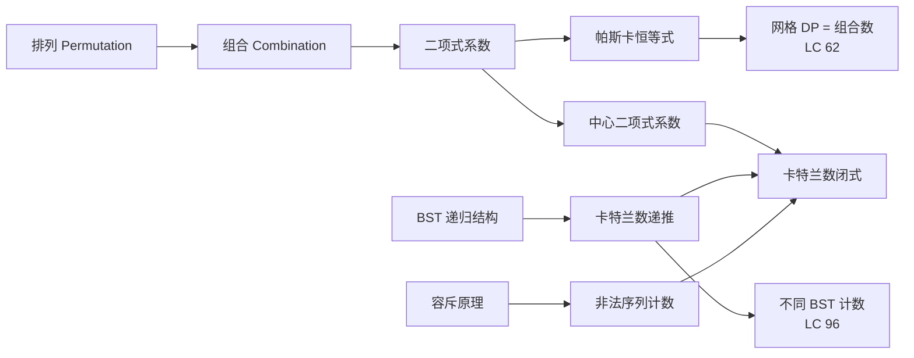
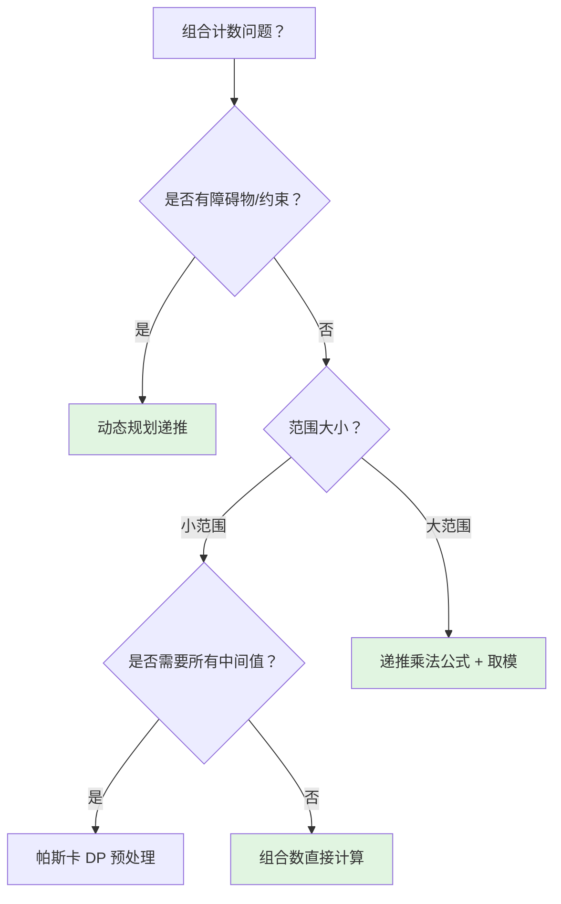

> 📊 **项目全面梳理**：详细的项目结构、模块详解和学习路径，请参阅 [`项目全面梳理-2025.md`](../../项目全面梳理-2025.md)

## 组合数学入门 / Introduction to Combinatorics

### 摘要 / Executive Summary

- 组合数学是研究**离散结构计数**的数学分支，在算法面试中以“路径计数”“结构计数”“概率计数”三类形态高频出现。本文从排列与组合的形式化定义出发，建立二项式系数、卡特兰数与容斥原理的代数框架。
- 通过 LeetCode 62/96 两道经典题目，展示**组合数直接计算**与**动态规划递推**两种范式的等价性证明。特别是 LC 96 中“不同 BST 计数 = 卡特兰数”的**结构双射证明**，是面试中展示数学深度的经典切入点。
- 本文涵盖组合恒等式的推导、卡特兰数递推与闭式的证明，以及 3 个 Mermaid 思维表征图与 5 道自测问题。

### 关键术语与符号 / Glossary

| 术语 / Term | 定义 / Definition |
|-------------|-------------------|
| 排列 Permutation | 从 $n$ 个不同元素中取出 $k$ 个进行有序排列的方式数，记为 $P(n,k) = \frac{n!}{(n-k)!}$ |
| 组合 Combination | 从 $n$ 个不同元素中取出 $k$ 个作为子集的方式数，记为 $C(n,k) = \binom{n}{k} = \frac{n!}{k!(n-k)!}$ |
| 二项式系数 Binomial Coefficient | 展开式 $(x+y)^n = \sum_{k=0}^n \binom{n}{k} x^k y^{n-k}$ 中的系数 |
| 卡特兰数 Catalan Number | $C_n = \frac{1}{n+1}\binom{2n}{n}$，计数多种递归结构（BST、括号序列、Dyck 路径等） |
| 容斥原理 Inclusion-Exclusion Principle | 对有限集合 $A_1, \dots, A_n$，$|\bigcup A_i| = \sum |A_i| - \sum |A_i \cap A_j| + \dots$ |
| 双射 Bijection | 两个集合间的一一对应映射；若存在双射，则两集合基数相等 |
| 递推关系 Recurrence Relation | 用序列前项定义后项的方程，如 $C_n = \sum_{i=0}^{n-1} C_i C_{n-1-i}$ |

术语对齐与引用规范：`docs/术语与符号总表.md`，`01-基础理论/00-撰写规范与引用指南.md`

### 目录 / Table of Contents

- [组合数学入门 / Introduction to Combinatorics](#组合数学入门--introduction-to-combinatorics)
  - [摘要 / Executive Summary](#摘要--executive-summary)
  - [关键术语与符号 / Glossary](#关键术语与符号--glossary)
  - [目录 / Table of Contents](#目录--table-of-contents)
  - [交叉引用与依赖 / Cross-References and Dependencies](#交叉引用与依赖--cross-references-and-dependencies)
  - [1. 形式化定义 / Formal Definitions](#1-形式化定义--formal-definitions)
    - [1.1 排列与组合](#11-排列与组合)
    - [1.2 二项式定理与恒等式](#12-二项式定理与恒等式)
    - [1.3 卡特兰数](#13-卡特兰数)
    - [1.4 容斥原理](#14-容斥原理)
  - [2. 核心思路与算法框架](#2-核心思路与算法框架)
    - [2.1 组合数计算的三种范式](#21-组合数计算的三种范式)
    - [2.2 卡特兰数的结构解释](#22-卡特兰数的结构解释)
  - [3. 经典题目详解](#3-经典题目详解)
  - [4. 复杂度分析体系](#4-复杂度分析体系)
  - [5. 正确性证明框架](#5-正确性证明框架)
  - [6. 思维表征](#6-思维表征)
  - [7. 常见错误与反模式](#7-常见错误与反模式)
  - [8. 自测问题](#8-自测问题)
  - [9. 学习目标](#9-学习目标)
  - [10. 知识导航](#10-知识导航)
  - [参考文献](#参考文献)

### 交叉引用与依赖 / Cross-References and Dependencies

**上游理论依赖 / Upstream Dependencies**:
- [`09-算法理论/03-经典算法/组合生成.md`](../../09-算法理论/03-经典算法/组合生成.md) — 组合生成的理论框架与算法
- [`03-形式化证明/01-数学归纳法.md`](../../03-形式化证明/01-数学归纳法.md) — 归纳法在组合证明中的核心作用
- [`04-算法复杂度/01-时间复杂度.md`](../../04-算法复杂度/01-时间复杂度.md) — 渐进记号与复杂度分析

**下游应用 / Downstream Applications**:
- `13-LeetCode算法面试专题/02-算法范式专题/08-动态规划.md` — DP 在组合计数中的应用
- `13-LeetCode算法面试专题/03-数学专题/03-计算几何基础.md` — 几何中的组合计数问题

---

## 1. 形式化定义 / Formal Definitions

### 1.1 排列与组合

**定义 1.1** (排列 / Permutation)
设 $S$ 为包含 $n$ 个不同元素的集合。从 $S$ 中**有序地**选取 $k$ 个元素（$0 \leq k \leq n$）的方式数称为**排列数**，记为：

$$
P(n,k) = \frac{n!}{(n-k)!}
$$

**定义 1.2** (组合 / Combination)
设 $S$ 为包含 $n$ 个不同元素的集合。从 $S$ 中**无序地**选取 $k$ 个元素（$0 \leq k \leq n$）的方式数称为**组合数**或**二项式系数**，记为：

$$
\binom{n}{k} = C(n,k) = \frac{n!}{k!(n-k)!}
$$

**约定**：$\binom{n}{0} = \binom{n}{n} = 1$；当 $k > n$ 或 $k < 0$ 时，$\binom{n}{k} = 0$。

**定理 1.3** (帕斯卡恒等式 / Pascal's Identity)
对 $1 \leq k \leq n-1$：

$$
\binom{n}{k} = \binom{n-1}{k-1} + \binom{n-1}{k}
$$

*证明*: 考虑从 $n$ 个元素中选 $k$ 个。固定某个特定元素 $x$：
- 若选中 $x$，还需从剩余 $n-1$ 个中选 $k-1$ 个，共 $\binom{n-1}{k-1}$ 种方式；
- 若不选 $x$，需从剩余 $n-1$ 个中选 $k$ 个，共 $\binom{n-1}{k}$ 种方式。

由加法原理，总方式数为二者之和。证毕。$\square$

### 1.2 二项式定理与恒等式

**定理 1.4** (二项式定理 / Binomial Theorem)
对任意非负整数 $n$：

$$
(x+y)^n = \sum_{k=0}^{n} \binom{n}{k} x^k y^{n-k}
$$

**推论 1.5** (组合恒等式)
令 $x = y = 1$：

$$
\sum_{k=0}^{n} \binom{n}{k} = 2^n
$$

令 $x = 1, y = -1$：

$$
\sum_{k=0}^{n} (-1)^k \binom{n}{k} = 0 \quad (n \geq 1)
$$

### 1.3 卡特兰数

**定义 1.6** (卡特兰数 / Catalan Number)
第 $n$ 个卡特兰数 $C_n$（$n \geq 0$）定义为：

$$
C_n = \frac{1}{n+1} \binom{2n}{n}
$$

**定理 1.7** (卡特兰数递推式)
卡特兰数满足如下递推关系：

$$
C_0 = 1, \quad C_{n+1} = \sum_{i=0}^{n} C_i \cdot C_{n-i}
$$

*证明*: 考虑由 $n+1$ 个节点构成的不同二叉搜索树（BST）的计数。设根节点的左子树包含 $i$ 个节点（值为 $1, \dots, i$），右子树包含 $n-i$ 个节点（值为 $i+2, \dots, n+1$）。左子树的形态数为 $C_i$，右子树的形态数为 $C_{n-i}$。由乘法原理，固定根节点时共有 $C_i \cdot C_{n-i}$ 种 BST。对所有可能的 $i$ 求和即得递推式。证毕。$\square$

**定理 1.8** (递推与闭式的等价性)
递推式定义的序列与闭式 $C_n = \frac{1}{n+1}\binom{2n}{n}$ 完全一致。

*证明概要*: 设 $C(x) = \sum_{n=0}^{\infty} C_n x^n$ 为卡特兰数的生成函数。由递推式：

$$
C(x) = 1 + x \cdot C(x)^2
$$

解此二次方程（取在 $x=0$ 处值为 1 的根）：

$$
C(x) = \frac{1 - \sqrt{1-4x}}{2x}
$$

利用广义二项式定理展开 $\sqrt{1-4x}$，比较 $x^n$ 的系数即可得到闭式。$\square$

### 1.4 容斥原理

**定理 1.9** (容斥原理 / Inclusion-Exclusion Principle)
设 $A_1, A_2, \dots, A_n$ 为有限集合，则：

$$
\Big| \bigcup_{i=1}^{n} A_i \Big| = \sum_{k=1}^{n} (-1)^{k+1} \sum_{1 \leq i_1 < \dots < i_k \leq n} |A_{i_1} \cap \dots \cap A_{i_k}|
$$

*直观解释*: 先累加所有单个集合的大小，但这样两两交集被重复计算了，需减去；减去后三三交集又被多减了，需加回……依此类推。

---

## 2. 核心思路与算法框架

### 2.1 组合数计算的三种范式

**范式 A：阶乘直接计算**

$$
\binom{n}{k} = \frac{n!}{k!(n-k)!}
$$

- 适用：$n$ 较小（$n \leq 20$ 时 64 位整数可存）
- 陷阱：阶乘增长极快，极易溢出

**范式 B：递推乘法公式**

$$
\binom{n}{k} = \frac{n}{k} \cdot \binom{n-1}{k-1} = \prod_{i=1}^{k} \frac{n-k+i}{i}
$$

- 适用：大 $n$、小 $k$；配合模运算使用
- 优势：避免计算完整阶乘，中间结果可控

**范式 C：帕斯卡三角 DP**

```text
C[n][0] = C[n][n] = 1
C[n][k] = C[n-1][k-1] + C[n-1][k]
```

- 适用：需要大量组合数查询；$n$ 不超过数千
- 优势：预处理 $O(n^2)$ 后每次查询 $O(1)$

### 2.2 卡特兰数的结构解释

卡特兰数计数以下等价结构的数量（均存在双射）：

| 结构 / Structure | 描述 / Description |
|-----------------|-------------------|
| 不同 BST | $n$ 个节点值 $1..n$ 构成的不同二叉搜索树 |
| 合法括号序列 | $n$ 对括号构成的合法匹配序列 |
| Dyck 路径 | 从 $(0,0)$ 到 $(2n,0)$、每步 $(1,\pm1)$、始终不低于 $x$ 轴的路径 |
| 栈排列 | $1..n$ 通过栈操作可得到的排列数 |
| 凸多边形三角剖分 | $(n+2)$ 边形的不同三角剖分数 |

---

## 3. 经典题目详解

### 3.1 LeetCode 62 — 不同路径

> **题目链接 / Problem Link**: [LeetCode 62. Unique Paths](https://leetcode.com/problems/unique-paths/)
> **难度 / Difficulty**: Medium

#### 形式化规约 / Formal Specification

**输入**: 正整数 $m, n$
**输出**: 从网格左上角 $(1,1)$ 到右下角 $(m,n)$、每次只能**向下**或**向右**移动的不同路径总数

**后置条件 / Postcondition**:

$$
\text{result} = |\{ \text{由 } m-1 \text{ 个 D 和 } n-1 \text{ 个 R 构成的序列} \}|
$$

#### 核心思路 / Core Idea

本题存在**两种等价解法**：

**解法 A — 二维 DP**：设 $dp[i][j]$ 为到达 $(i,j)$ 的路径数。由最优子结构：

$$
dp[i][j] = dp[i-1][j] + dp[i][j-1]
$$

初始条件 $dp[0][j] = dp[i][0] = 1$。

**解法 B — 组合数直接计算**：每条路径对应 $m+n-2$ 步中选取 $m-1$ 步向下（或 $n-1$ 步向右）的组合：

$$
\text{result} = \binom{m+n-2}{m-1} = \binom{m+n-2}{n-1}
$$

#### 代码实现 / Code Implementations

- **Rust**: [`examples/algorithms/src/leetcode/lc0062_unique_paths.rs`](../../../../examples/algorithms/src/leetcode/lc0062_unique_paths.rs)
- **Python**: [`examples/algorithms-python/src/leetcode/lc0062_unique_paths.py`](../../../../examples/algorithms-python/src/leetcode/lc0062_unique_paths.py)
- **Go**: [`examples/algorithms-go/leetcode/lc0062_unique_paths.go`](../../../../examples/algorithms-go/leetcode/lc0062_unique_paths.go)

#### 复杂度分析 / Complexity Analysis

| 解法 / Solution | 时间复杂度 / Time | 空间复杂度 / Space | 说明 / Note |
|----------------|------------------|-------------------|------------|
| 二维 DP | $O(m \cdot n)$ | $O(m \cdot n)$ | 直观，可处理障碍物变体 |
| 滚动数组 DP | $O(m \cdot n)$ | $O(\min(m,n))$ | 空间优化 |
| 组合数直接 | $O(\min(m,n))$ | $O(1)$ | 最高效，但不能处理障碍物 |

#### 正确性证明 / Correctness Proof

**定理 3.1.1** (DP 解法正确性): 二维 DP 计算出的 $dp[m-1][n-1]$ 等于路径总数。

**证明**: 对 $i + j$ 进行归纳。

**基例**：$i = 0$ 或 $j = 0$ 时，只有一条直线路径，$dp[i][j] = 1$，正确。

**归纳假设**：对所有满足 $i + j < k$ 的位置，$dp[i][j]$ 正确。

**归纳步**：考虑位置 $(i,j)$ 且 $i + j = k$。到达 $(i,j)$ 的最后一步只能来自 $(i-1,j)$（向下）或 $(i,j-1)$（向右）。由归纳假设，到达前两者的路径数分别为 $dp[i-1][j]$ 和 $dp[i][j-1]$。由加法原理，到达 $(i,j)$ 的路径总数为二者之和。因此递推式正确。证毕。$\square$

**定理 3.1.2** (组合数与 DP 的等价性): $\binom{m+n-2}{m-1}$ 等于 DP 的解。

**证明**: 每条路径由 $m-1$ 个 D 和 $n-1$ 个 R 组成，总长度为 $(m-1)+(n-1) = m+n-2$。问题转化为：在 $m+n-2$ 个位置中选取 $m-1$ 个放置 D（其余放 R），方式数为 $\binom{m+n-2}{m-1}$。

另一方面，DP 的递推式 $dp[i][j] = dp[i-1][j] + dp[i][j-1]$ 与帕斯卡恒等式完全一致。初始条件 $dp[0][j] = dp[i][0] = 1$ 对应边界 $\binom{k}{0} = \binom{k}{k} = 1$。由数学归纳法，$dp[i][j] = \binom{i+j}{i}$。令 $i = m-1, j = n-1$ 即得结论。证毕。$\square$

---

### 3.2 LeetCode 96 — 不同的二叉搜索树

> **题目链接 / Problem Link**: [LeetCode 96. Unique Binary Search Trees](https://leetcode.com/problems/unique-binary-search-trees/)
> **难度 / Difficulty**: Medium

#### 形式化规约 / Formal Specification

**输入**: 整数 $n \geq 0$
**输出**: 由 $n$ 个节点（值分别为 $1, 2, \dots, n$）构成的**不同二叉搜索树**的数量

**后置条件 / Postcondition**:

$$
\text{result} = C_n = \frac{1}{n+1}\binom{2n}{n}
$$

#### 核心思路 / Core Idea

利用 BST 的递归结构：对于值 $1, \dots, n$，选择某个值 $i$ 作为根节点。则：
- 左子树由值 $1, \dots, i-1$ 构成，共有 $C_{i-1}$ 种形态；
- 右子树由值 $i+1, \dots, n$ 构成，共有 $C_{n-i}$ 种形态。

由乘法原理，以 $i$ 为根的 BST 数量为 $C_{i-1} \cdot C_{n-i}$。对所有 $i$ 求和即得卡特兰数递推式。

#### 代码实现 / Code Implementations

- **Rust**: [`examples/algorithms/src/leetcode/lc0096_unique_binary_search_trees.rs`](../../../../examples/algorithms/src/leetcode/lc0096_unique_binary_search_trees.rs)
- **Python**: [`examples/algorithms-python/src/leetcode/lc0096_unique_binary_search_trees.py`](../../../../examples/algorithms-python/src/leetcode/lc0096_unique_binary_search_trees.py)
- **Go**: [`examples/algorithms-go/leetcode/lc0096_unique_binary_search_trees.go`](../../../../examples/algorithms-go/leetcode/lc0096_unique_binary_search_trees.go)

#### 复杂度分析 / Complexity Analysis

| 解法 / Solution | 时间复杂度 / Time | 空间复杂度 / Space | 说明 / Note |
|----------------|------------------|-------------------|------------|
| DP 递推 | $O(n^2)$ | $O(n)$ | 直接实现卡特兰递推 |
| 闭式计算 | $O(n)$ | $O(1)$ | 利用乘法公式计算二项式系数 |

#### 正确性证明 / Correctness Proof

**定理 3.2.1** (BST 计数 = 卡特兰数): 由 $n$ 个节点构成的不同 BST 的数量为第 $n$ 个卡特兰数 $C_n$。

**证明**: 对 $n$ 进行归纳。

**基例**（$n = 0$）：空树只有 1 种，$C_0 = 1$，成立。

**归纳假设**：对所有 $k < n$，$k$ 个节点的不同 BST 数量为 $C_k$。

**归纳步**：考虑 $n$ 个节点。枚举根节点的值 $i \in \{1, \dots, n\}$：
- 左子树包含 $i-1$ 个节点（值为 $1, \dots, i-1$），由归纳假设有 $C_{i-1}$ 种；
- 右子树包含 $n-i$ 个节点（值为 $i+1, \dots, n$），由归纳假设有 $C_{n-i}$ 种。

由乘法原理，以 $i$ 为根的 BST 数量为 $C_{i-1} \cdot C_{n-i}$。由加法原理，总数为：

$$
\sum_{i=1}^{n} C_{i-1} \cdot C_{n-i} = \sum_{j=0}^{n-1} C_j \cdot C_{n-1-j} = C_n
$$

这正是卡特兰数的递推定义。证毕。$\square$

**定理 3.2.2** (结构双射证明): $n$ 个节点的不同 BST 与 $n$ 对括号的合法序列之间存在双射。

**证明概要**: 对 BST 进行前序遍历，将“访问节点”映射为“左括号 (”，将“遍历右子树”映射为“右括号 )”。BST 的结构约束（左子树所有值 < 根 < 右子树所有值）保证了遍历序列中括号的嵌套是合法的。反之，给定合法括号序列，可通过栈构造唯一的 BST 形态。因此二者一一对应，计数相同。证毕。$\square$

---

## 4. 复杂度分析体系

### 4.1 组合数计算复杂度

| 方法 | 时间 | 空间 | 适用场景 |
|------|------|------|---------|
| 阶乘公式 | $O(n)$ | $O(1)$ | $n$ 很小，无取模 |
| 递推乘法 | $O(k)$ | $O(1)$ | 大 $n$、小 $k$，需取模 |
| 帕斯卡 DP | $O(n^2)$ | $O(n^2)$ | 多次查询、离线预处理 |
| 卢卡斯定理 | $O(p \log_p n)$ | $O(p)$ | 大组合数模小质数 |

### 4.2 卡特兰数计算复杂度

| 方法 | 时间 | 空间 | 说明 |
|------|------|------|------|
| DP 递推 | $O(n^2)$ | $O(n)$ | 直观，可顺便输出所有 $C_0, \dots, C_n$ |
| 闭式乘法 | $O(n)$ | $O(1)$ | 用中心二项式系数的乘法公式 |
| 生成函数 | $O(n)$ | $O(n)$ | 用于需要级数展开的场景 |

---

## 5. 正确性证明框架

### 5.1 组合恒等式证明体系

**定理 5.1** (网格 DP = 组合数)
对 $m, n \geq 1$：

$$
\text{UniquePaths}(m,n) = \binom{m+n-2}{m-1}
$$

**证明**: 已在定理 3.1.2 中给出。核心在于 DP 递推式与帕斯卡恒等式的代数同构。$\square$

### 5.2 卡特兰数递推证明

**定理 5.2** (卡特兰数闭式的组合证明)
$C_n = \frac{1}{n+1}\binom{2n}{n}$ 计数 $n$ 对括号的合法序列。

**证明**: $n$ 对括号共 $2n$ 个符号，其中 $n$ 个左括号、$n$ 个右括号。无约束时的总排列数为 $\binom{2n}{n}$。

定义**非法序列**：存在某个前缀中右括号数 > 左括号数。对任意非法序列，找到第一个使右括号数 = 左括号数 + 1 的位置，将该位置前的所有括号取反（左变右、右变左）。此操作建立了非法序列与 $(n+1)$ 个右括号、$(n-1)$ 个左括号的序列之间的一一对应。后者的数量为 $\binom{2n}{n+1}$。

因此合法序列数为：

$$
\binom{2n}{n} - \binom{2n}{n+1} = \binom{2n}{n} - \frac{n}{n+1}\binom{2n}{n} = \frac{1}{n+1}\binom{2n}{n}
$$

证毕。$\square$

### 5.3 证明树

```mermaid
flowchart TD
    A[定义: 组合数 C(n,k)] --> B[帕斯卡恒等式]
    B --> C[定理 3.1.2: 网格 DP = 组合数]
    D[定义: BST 递归结构] --> E[乘法原理 + 加法原理]
    E --> F[定理 3.2.1: BST 计数 = 卡特兰递推]
    G[反射原理] --> H[非法括号序列 = C(2n, n+1)]
    H --> I[定理 5.2: 卡特兰闭式]
    F --> I
    
    style C fill:#e1f5e1
    style F fill:#e1f5e1
    style I fill:#e1f5e1
```

---

## 6. 思维表征

### 6.1 概念依赖图



### 6.2 算法选择决策树



### 6.3 多维矩阵概念对比

| 维度 / Dimension | 排列 $P(n,k)$ | 组合 $C(n,k)$ | 卡特兰数 $C_n$ | 容斥原理 |
|----------------|-------------|-------------|--------------|---------|
| **有序性** | 有序 | 无序 | 结构有序 | 集合运算 |
| **计算公式** | $\frac{n!}{(n-k)!}$ | $\frac{n!}{k!(n-k)!}$ | $\frac{1}{n+1}\binom{2n}{n}$ | 交替和 |
| **递推关系** | $P(n,k) = n \cdot P(n-1,k-1)$ | 帕斯卡恒等式 | $C_n = \sum C_i C_{n-1-i}$ | 递归容斥 |
| **面试题型** | 全排列、密码组合 | 路径计数、子集 | BST、括号、栈 | 至少/恰好计数 |

---

## 7. 常见错误与反模式

### 7.1 阶乘溢出

**错误**: 直接计算 $n!$ 再除以 $k!$ 和 $(n-k)!$，导致中间结果溢出。

**反模式**:
```python
# 错误：先算阶乘，n=100 时 100! 远超 64 位范围
result = factorial(n) // (factorial(k) * factorial(n - k))
```

**正确做法**: 使用递推乘法公式，边乘边除，或每一步取模。

### 7.2 整数除法的精度丢失

**错误**: 在组合数递推中先进行整数除法，导致结果不精确。

```python
# 错误：result *= (n - k + i) / i   # 浮点除法！
```

**正确做法**: `result = result * (n - k + i) // i`，利用组合数的整数性质保证整除。

### 7.3 DP 边界条件错误

**错误**: 卡特兰数递推中未设置 $C_0 = 1$，导致空树情况计数为 0。

### 7.4 混淆 BST 与二叉树

**错误**: 将“不同 BST”误认为“不同二叉树”。BST 的形态受值的大小约束，而普通二叉树的形态与节点值无关。

---

## 8. 自测问题

### 问题 1：组合数与排列数的关系

**Q**: 为什么 $C(n,k) = P(n,k) / k!$？

**A**: $P(n,k)$ 计数的是**有序**选取 $k$ 个元素的方式。对于同一个 $k$ 元素子集，其内部有 $k!$ 种排列顺序。由于组合不考虑顺序，需将排列数除以 $k!$ 来消除子集内部的排列冗余。

---

### 问题 2：帕斯卡恒等式的组合意义

**Q**: 从组合意义解释 $C(n,k) = C(n-1,k-1) + C(n-1,k)$。

**A**: 从 $n$ 个元素中选 $k$ 个，考虑某个特定元素 $x$ 是否被选中：
- 若选中 $x$，还需从剩余 $n-1$ 个中选 $k-1$ 个，共 $C(n-1,k-1)$ 种；
- 若不选 $x$，需从剩余 $n-1$ 个中选 $k$ 个，共 $C(n-1,k)$ 种。
由加法原理，总方式数为二者之和。

---

### 问题 3：卡特兰数的非 BST 解释

**Q**: 除了 BST，卡特兰数还计数哪些常见结构？

**A**: 常见等价结构包括：$n$ 对括号的合法序列、$n$ 个节点的满二叉树、$(n+2)$ 边形的三角剖分、$n$ 个元素的栈可排序排列、Dyck 路径等。这些结构之间均存在显式双射。

---

### 问题 4：容斥原理的符号规律

**Q**: 容斥原理中各项的符号如何确定？

**A**: 容斥原理是交并转换的交替修正：
- 单集合大小之和（$k=1$）：$+$
- 两两交集之和（$k=2$）：$-$（因为之前多算了交集部分）
- 三三交集之和（$k=3$）：$+$（因为之前多减了）
- 一般地，$k$ 重交集的符号为 $(-1)^{k+1}$。

---

### 问题 5：组合数取模的陷阱

**Q**: 计算 $C(n,k) \bmod p$（$p$ 为质数）时，若 $k > p$，能否直接使用阶乘逆元？

**A**: 不能直接使用。当 $k \geq p$ 时，$k!$ 中包含因子 $p$，在模 $p$ 下不可逆（因为 $p \mid k!$）。此时需要使用**卢卡斯定理（Lucas' Theorem）**：将 $n$ 和 $k$ 表示为 $p$ 进制，$C(n,k) \equiv \prod_i C(n_i, k_i) \pmod{p}$，其中 $n_i, k_i$ 为 $p$ 进制下的各位数字。

---

## 9. 学习目标

完成本章学习后，读者应能够：

1. **形式化定义**排列、组合、卡特兰数与容斥原理，并熟练运用这些工具进行计数。
2. **独立证明**帕斯卡恒等式、网格 DP 与组合数的等价性、以及卡特兰数的递推关系。
3. **识别双射**在不同组合结构之间建立一一对应，从而将未知计数问题转化为已知的卡特兰数问题。
4. **正确实现**组合数的三种计算范式（阶乘、递推乘法、帕斯卡 DP），并能根据约束条件选择合适的方法。
5. **避免常见陷阱**：阶乘溢出、整数除法精度、DP 边界错误、BST 与普通二叉树的混淆。

---

## 10. 知识导航

- [返回目录](../README.md)
- [上一章：01-数论基础（GCD-LCM-质数）](./01-数论基础（GCD-LCM-质数）.md)
- [下一章：03-计算几何基础](./03-计算几何基础.md)

---

## 参考文献

1. **R. Graham, D. Knuth, O. Patashnik**, *Concrete Mathematics: A Foundation for Computer Science*, 2nd ed., Addison-Wesley, 1994. §5.1–5.3 (Binomial Coefficients, Catalan Numbers)
2. **M. Aigner, G. M. Ziegler**, *Proofs from THE BOOK*, 6th ed., Springer, 2018. §29 (Catalan Numbers)
3. **T. H. Cormen et al.**, *Introduction to Algorithms*, 3rd ed., MIT Press, 2009. §15.2 (Matrix-Chain Multiplication, related to Catalan counting)
4. **R. P. Stanley**, *Enumerative Combinatorics, Vol. 2*, Cambridge University Press, 1999. §6.2 (Catalan Numbers and their 66 interpretations)
