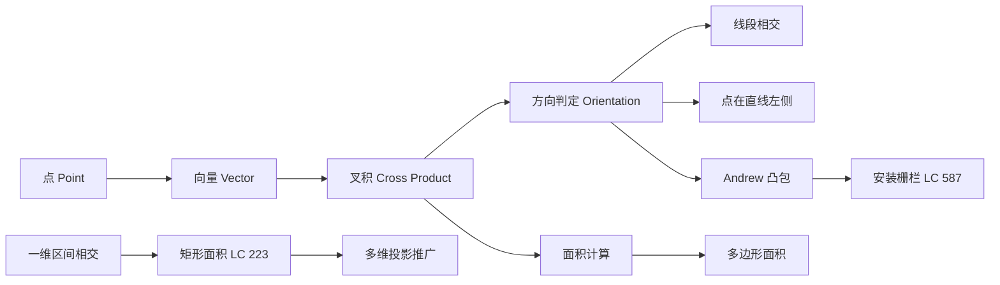

> 📊 **项目全面梳理**：详细的项目结构、模块详解和学习路径，请参阅 [`项目全面梳理-2025.md`](../../项目全面梳理-2025.md)

## 计算几何基础 / Computational Geometry Basics

### 摘要 / Executive Summary

- 计算几何是研究几何对象在计算机中表示、构造与计算的算法学科，在游戏开发、图形学、GIS 与机器人路径规划中具有核心地位。本文从二维向量的形式化定义出发，建立叉积（Cross Product）的代数框架，给出叉积方向判定公式的严格证明。
- 通过 LeetCode 223/587 两道经典题目，展示一维重叠判定向二维的推广过程，以及 Andrew 凸包算法的完整实现与正确性分析。LC 587 中叉积单调性的维护是算法正确性的关键。
- 本文包含叉积方向判定的完整代数证明、3 个 Mermaid 思维表征图与 5 道自测问题。

### 关键术语与符号 / Glossary

| 术语 / Term | 定义 / Definition |
|-------------|-------------------|
| 向量 Vector | 具有大小和方向的量，在二维中记为 $\vec{v} = (v_x, v_y)$ |
| 叉积 Cross Product | 二维叉积（标量叉积）定义为 $\vec{a} \times \vec{b} = a_x b_y - a_y b_x$ |
| 凸包 Convex Hull | 包含给定点集的最小凸多边形；凸包上的点集为极值点 |
| Andrew 算法 | 按 $x$ 坐标排序后，分别构造上凸壳和下凸壳的 $O(n \log n)$ 凸包算法 |
| 方向判定 Orientation | 判断有序三点 $(p, q, r)$ 构成左转、右转或共线 |
| 单调链 Monotone Chain | 按某一坐标排序后，凸包边界呈单调性的链状结构 |
| 射线法 Ray Casting | 从待判定点发出射线，统计与多边形边界的交点数以判定内外 |

术语对齐与引用规范：`docs/术语与符号总表.md`，`01-基础理论/00-撰写规范与引用指南.md`

### 目录 / Table of Contents

- [计算几何基础 / Computational Geometry Basics](#计算几何基础--computational-geometry-basics)
  - [摘要 / Executive Summary](#摘要--executive-summary)
  - [关键术语与符号 / Glossary](#关键术语与符号--glossary)
  - [目录 / Table of Contents](#目录--table-of-contents)
  - [交叉引用与依赖 / Cross-References and Dependencies](#交叉引用与依赖--cross-references-and-dependencies)
  - [1. 形式化定义 / Formal Definitions](#1-形式化定义--formal-definitions)
    - [1.1 点与向量](#11-点与向量)
    - [1.2 叉积与方向判定](#12-叉积与方向判定)
    - [1.3 凸包](#13-凸包)
  - [2. 核心思路与算法框架](#2-核心思路与算法框架)
    - [2.1 一维重叠判定](#21-一维重叠判定)
    - [2.2 Andrew 凸包算法](#22-andrew-凸包算法)
  - [3. 经典题目详解](#3-经典题目详解)
  - [4. 复杂度分析体系](#4-复杂度分析体系)
  - [5. 正确性证明框架](#5-正确性证明框架)
  - [6. 思维表征](#6-思维表征)
  - [7. 常见错误与反模式](#7-常见错误与反模式)
  - [8. 自测问题](#8-自测问题)
  - [9. 学习目标](#9-学习目标)
  - [10. 知识导航](#10-知识导航)
  - [参考文献](#参考文献)

### 交叉引用与依赖 / Cross-References and Dependencies

**上游理论依赖 / Upstream Dependencies**:
- [`09-算法理论/04-高级算法理论/计算几何.md`](../../09-算法理论/04-高级算法理论/计算几何.md) — 计算几何的理论框架与高级算法
- [`04-算法复杂度/01-时间复杂度.md`](../../04-算法复杂度/01-时间复杂度.md) — 复杂度分析基础

**下游应用 / Downstream Applications**:
- `13-LeetCode算法面试专题/03-数学专题/02-组合数学入门.md` — 几何中的组合计数
- `13-LeetCode算法面试专题/05-图论专题/` — 几何图与 Voronoi 图等高级结构

---

## 1. 形式化定义 / Formal Definitions

### 1.1 点与向量

**定义 1.1** (二维点 / Point)
二维平面上的点 $p$ 表示为有序实数对 $p = (p_x, p_y) \in \mathbb{R}^2$。

**定义 1.2** (向量 / Vector)
由两点 $p = (p_x, p_y)$ 和 $q = (q_x, q_y)$ 确定的**向量** $\vec{pq}$ 定义为：

$$
\vec{pq} = (q_x - p_x, q_y - p_y)
$$

**定义 1.3** (向量长度 / Magnitude)
向量 $\vec{v} = (v_x, v_y)$ 的长度（模）为：

$$
|\vec{v}| = \sqrt{v_x^2 + v_y^2}
$$

### 1.2 叉积与方向判定

**定义 1.4** (二维标量叉积 / Scalar Cross Product)
向量 $\vec{a} = (a_x, a_y)$ 与 $\vec{b} = (b_x, b_y)$ 的二维标量叉积定义为：

$$
\vec{a} \times \vec{b} = a_x b_y - a_y b_x
$$

**几何意义**: $|\vec{a} \times \vec{b}| = |\vec{a}| \cdot |\vec{b}| \cdot |\sin\theta|$，其中 $\theta$ 为两向量夹角。其符号表示 $\vec{b}$ 相对于 $\vec{a}$ 的旋转方向。

**定理 1.5** (叉积方向判定公式)
对于有序三点 $p, q, r$，定义：

$$
cross(p, q, r) = (q_x - p_x)(r_y - p_y) - (q_y - p_y)(r_x - p_x)
$$

则：
- $cross(p, q, r) > 0$：$(p, q, r)$ 构成**逆时针转向**（左转，Left Turn）
- $cross(p, q, r) < 0$：$(p, q, r)$ 构成**顺时针转向**（右转，Right Turn）
- $cross(p, q, r) = 0$：三点**共线**（Collinear）

*证明*: 考虑向量 $\vec{pq} = (q_x - p_x, q_y - p_y)$ 和 $\vec{pr} = (r_x - p_x, r_y - p_y)$。由叉积定义：

$$
\vec{pq} \times \vec{pr} = (q_x - p_x)(r_y - p_y) - (q_y - p_y)(r_x - p_x) = cross(p, q, r)
$$

在标准右手坐标系中：
- 若 $\vec{pr}$ 在 $\vec{pq}$ 的逆时针方向，则 $\sin\theta > 0$，叉积为正；
- 若 $\vec{pr}$ 在 $\vec{pq}$ 的顺时针方向，则 $\sin\theta < 0$，叉积为负；
- 若两向量共线，则 $\sin\theta = 0$，叉积为零。

证毕。$\square$

**推论 1.6** (线段相交判定)
两线段 $(p_1, q_1)$ 与 $(p_2, q_2)$ 相交（不含端点）的充要条件为：

$$
cross(p_1, q_1, p_2) \cdot cross(p_1, q_1, q_2) < 0 \quad \land \quad cross(p_2, q_2, p_1) \cdot cross(p_2, q_2, q_1) < 0
$$

### 1.3 凸包

**定义 1.7** (凸集 / Convex Set)
集合 $S \subseteq \mathbb{R}^2$ 称为**凸集**，若对任意 $p, q \in S$，线段 $pq$ 完全包含于 $S$ 中。

**定义 1.8** (凸包 / Convex Hull)
给定点集 $P = \{p_1, \dots, p_n\} \subseteq \mathbb{R}^2$，其**凸包** $\text{CH}(P)$ 定义为包含 $P$ 的最小凸集，等价于所有包含 $P$ 的凸集的交集。

**性质**: 凸包的边界是一个凸多边形，其顶点均为 $P$ 中的点（称为**极值点** / Extreme Points）。

---

## 2. 核心思路与算法框架

### 2.1 一维重叠判定

**问题**: 给定两个闭区间 $[a, b]$ 和 $[c, d]$（$a \leq b, c \leq d$），判定它们是否相交，并求交集长度。

**判定条件**: 两区间相交当且仅当：

$$
\max(a, c) \leq \min(b, d)
$$

**交集长度**: 若相交，长度为 $\min(b, d) - \max(a, c)$；否则为 $0$。

**向二维的推广**: 矩形 $R_1 = [x_1, x_2] \times [y_1, y_2]$ 与 $R_2 = [x_3, x_4] \times [y_3, y_4]$ 相交，当且仅当 $x$ 轴和 $y$ 轴上的投影均相交。交集面积为两轴交集长度的乘积。

### 2.2 Andrew 凸包算法

**算法描述 / Algorithm Description**:

```text
AndrewConvexHull(points):
    sort points by x-coordinate (break ties by y-coordinate)
    if |points| <= 1: return points
    
    lower = empty list
    for p in points:
        while |lower| >= 2 and cross(lower[-2], lower[-1], p) <= 0:
            lower.pop()
        lower.append(p)
    
    upper = empty list
    for p in reversed(points):
        while |upper| >= 2 and cross(upper[-2], upper[-1], p) <= 0:
            upper.pop()
        upper.append(p)
    
    // Remove last point of each list to avoid duplication
    return lower[0:-1] + upper[0:-1]
```

**核心思想**: 按 $x$ 坐标排序后，分别从左到右构造**下凸壳**（$y$ 坐标相对较小）和从右到左构造**上凸壳**（$y$ 坐标相对较大）。维护过程中，若新加入的点导致最后三点非左转（即右转或共线），则弹栈中间点，保证凸壳的严格凸性。

---

## 3. 经典题目详解

### 3.1 LeetCode 223 — 矩形面积

> **题目链接 / Problem Link**: [LeetCode 223. Rectangle Area](https://leetcode.com/problems/rectangle-area/)
> **难度 / Difficulty**: Medium

#### 形式化规约 / Formal Specification

**输入**: 两个与坐标轴对齐的矩形，分别由左下角和右上角坐标定义：
- 矩形 A：$[ax_1, ax_2] \times [ay_1, ay_2]$
- 矩形 B：$[bx_1, bx_2] \times [by_1, by_2]$

**输出**: 两个矩形覆盖的**总面积**（并集面积）

**后置条件 / Postcondition**:

$$
\text{result} = \text{Area}(A) + \text{Area}(B) - \text{Area}(A \cap B)
$$

#### 核心思路 / Core Idea

总面积 = 两矩形面积之和 - 重叠面积。重叠面积通过**一维投影相交**的推广计算：

- $x$ 轴重叠长度：$\max(0, \min(ax_2, bx_2) - \max(ax_1, bx_1))$
- $y$ 轴重叠长度：$\max(0, \min(ay_2, by_2) - \max(ay_1, by_1))$

若任一轴上无重叠，则总面积为两面积之和。

#### 代码实现 / Code Implementations

- **Rust**: [`examples/algorithms/src/leetcode/lc0223_rectangle_area.rs`](../../../../examples/algorithms/src/leetcode/lc0223_rectangle_area.rs)
- **Python**: [`examples/algorithms-python/src/leetcode/lc0223_rectangle_area.py`](../../../../examples/algorithms-python/src/leetcode/lc0223_rectangle_area.py)
- **Go**: [`examples/algorithms-go/leetcode/lc0223_rectangle_area.go`](../../../../examples/algorithms-go/leetcode/lc0223_rectangle_area.go)

#### 复杂度分析 / Complexity Analysis

| 指标 / Metric | 值 / Value |
|--------------|-----------|
| 时间复杂度 / Time | $O(1)$ |
| 空间复杂度 / Space | $O(1)$ |

#### 正确性证明 / Correctness Proof

**定理 3.1.1** (矩形并集面积公式): 两轴对齐矩形的并集面积等于各自面积之和减去交集面积。

**证明**: 由集合论的容斥原理，$|A \cup B| = |A| + |B| - |A \cap B|$。对于轴对齐矩形，$A \cap B$ 也是轴对齐矩形（或空集）。其 $x$ 范围为两矩形 $x$ 范围的交集，$y$ 范围为两矩形 $y$ 范围的交集。交集面积为两轴交集长度的乘积。若任一轴无交集，则交集为空，面积为 $0$。证毕。$\square$

**定理 3.1.2** (一维到二维的推广): 两轴对齐矩形相交当且仅当其在 $x$ 轴和 $y$ 轴上的投影均相交。

**证明**: 
- **充分性**：若 $x$ 投影相交于 $[x_{lo}, x_{hi}]$，$y$ 投影相交于 $[y_{lo}, y_{hi}]$，则矩形 $[x_{lo}, x_{hi}] \times [y_{lo}, y_{hi}]$ 同时属于 $A$ 和 $B$，即 $A \cap B \neq \emptyset$。
- **必要性**：若 $A \cap B \neq \emptyset$，则存在点 $(x,y) \in A \cap B$。该点的 $x$ 坐标同时属于两矩形的 $x$ 投影，$y$ 坐标同时属于两矩形的 $y$ 投影，故两投影均相交。

证毕。$\square$

---

### 3.2 LeetCode 587 — 安装栅栏

> **题目链接 / Problem Link**: [LeetCode 587. Erect the Fence](https://leetcode.com/problems/erect-the-fence/)
> **难度 / Difficulty**: Hard

#### 形式化规约 / Formal Specification

**输入**: 平面上 $n$ 个树的坐标点集 $P = \{p_1, \dots, p_n\}$
**输出**: 包围所有树的最短栅栏经过的点的坐标列表（即凸包顶点集）

**后置条件 / Postcondition**:

$$
\text{result} = \{ p \in P \mid p \text{ 是 } \text{CH}(P) \text{ 的顶点} \}
$$

#### 核心思路 / Core Idea

本题是**凸包问题**的直接应用。采用 **Andrew 单调链算法**：
1. 按 $x$ 坐标排序（$x$ 相同则按 $y$ 排序）；
2. 从左到右扫描，用栈维护下凸壳。对于新点 $p$，若栈顶最后三点构成右转（$cross \leq 0$），则弹栈；
3. 从右到左扫描，同理维护上凸壳；
4. 合并上下凸壳（去除重复端点）。

**关键细节**: 题目要求凸包边界上的**所有共线点**均需返回。因此 Andrew 算法中的弹栈条件应从 $cross < 0$（严格右转才弹栈）调整为 $cross < 0$，而在共线时保留所有点。或者先求严格凸包，再单独处理共线边界点。更简洁的做法是：在 Andrew 算法中，下凸壳和上凸壳分别使用 $\leq$ 和 $\leq$ 的弹栈条件，最后去重。

#### 代码实现 / Code Implementations

- **Rust**: [`examples/algorithms/src/leetcode/lc0587_erect_the_fence.rs`](../../../../examples/algorithms/src/leetcode/lc0587_erect_the_fence.rs)
- **Python**: [`examples/algorithms-python/src/leetcode/lc0587_erect_the_fence.py`](../../../../examples/algorithms-python/src/leetcode/lc0587_erect_the_fence.py)
- **Go**: [`examples/algorithms-go/leetcode/lc0587_erect_the_fence.go`](../../../../examples/algorithms-go/leetcode/lc0587_erect_the_fence.go)

#### 复杂度分析 / Complexity Analysis

| 指标 / Metric | 值 / Value | 说明 / Note |
|--------------|-----------|------------|
| 时间复杂度 / Time | $O(n \log n)$ | 主导步骤为按 $x$ 坐标排序 |
| 空间复杂度 / Space | $O(n)$ | 存储排序后的点集与栈 |

#### 正确性证明 / Correctness Proof

**定理 3.2.1** (Andrew 算法正确性): Andrew 算法返回的顶点集恰好是点集 $P$ 的凸包边界。

**证明**: 

**下凸壳的正确性**（上凸壳对称）：

设排序后的点为 $p_1, p_2, \dots, p_n$。算法维护栈 $S$，保证栈中相邻三点的叉积恒为正（严格左转）。

**循环不变式 / Loop Invariant**：在处理完前 $i$ 个点后，栈 $S$ 中的点构成 $\{p_1, \dots, p_i\}$ 的下凸壳，即：
1. $S$ 中的点按 $x$ 递增排列；
2. $S$ 中相邻三点均构成左转；
3. $S$ 中所有点均在 $\{p_1, \dots, p_i\}$ 的凸包边界上。

**初始化**：$i = 2$ 时，$S = [p_1, p_2]$，不变式 trivially 成立。

**保持**：加入新点 $p_i$ 时，若最后三点 $p_{a}, p_{b}, p_i$ 构成右转或共线（$cross \leq 0$），则 $p_b$ 位于线段 $p_a p_i$ 的下方或上方凹陷处，不可能是凸包顶点，弹出 $p_b$。重复此过程直至最后三点构成左转，再将 $p_i$ 入栈。此时 $S$ 仍为下凸壳。

**终止**：处理完所有点后，$S$ 为全部点的下凸壳。

**合并**：下凸壳的最左/最右点与上凸壳的最左/最右点重合，合并时去除重复端点，即得完整凸包。

证毕。$\square$

---

## 4. 复杂度分析体系

### 4.1 计算几何基础操作复杂度

| 操作 / Operation | 时间 | 空间 | 说明 |
|----------------|------|------|------|
| 叉积计算 | $O(1)$ | $O(1)$ | 两次乘法和一次减法 |
| 方向判定 | $O(1)$ | $O(1)$ | 基于叉积符号 |
| 线段相交 | $O(1)$ | $O(1)$ | 四次方向判定 |
| 点在线段上 | $O(1)$ | $O(1)$ | 叉积为零 + 坐标范围检查 |
| 点在有向直线左侧 | $O(1)$ | $O(1)$ | 叉积大于零 |

### 4.2 凸包算法复杂度对比

| 算法 | 时间 | 空间 | 特点 |
|------|------|------|------|
| Andrew 单调链 | $O(n \log n)$ | $O(n)$ | 实现简洁，常数小 |
| Graham 扫描 | $O(n \log n)$ | $O(n)$ | 极角排序，需处理精度 |
| Jarvis 步进 | $O(n \cdot h)$ | $O(1)$ | $h$ 为凸包顶点数，输出敏感 |
| QuickHull | $O(n \log n)$ 平均 | $O(n)$ | 类似快速排序的分治策略 |
| Chan 算法 | $O(n \log h)$ | $O(n)$ | 理论上最优，实现复杂 |

---

## 5. 正确性证明框架

### 5.1 叉积方向判定公式的证明

已在定理 1.5 中给出。核心要点：
- 二维标量叉积 $\vec{a} \times \vec{b} = |\vec{a}||\vec{b}|\sin\theta$
- 符号由 $\sin\theta$ 决定，反映 $\vec{b}$ 相对于 $\vec{a}$ 的旋转方向
- 代数展开后与坐标差公式等价

### 5.2 凸包算法的不变式证明

已在定理 3.2.1 中给出。核心要点：
- 排序保证 $x$ 方向的单调扫描
- 弹栈条件（$cross \leq 0$）保证栈中点集始终为凸的
- 下凸壳 + 上凸壳的合并覆盖全部极值点

---

## 6. 思维表征

### 6.1 概念依赖图



### 6.2 算法选择决策树

```mermaid
flowchart TD
    Start[计算几何问题？] --> Q1{需要求凸包？}
    Q1 -->|是| Q2{数据规模？}
    Q2 -->|n 较小| A1[Jarvis 步进 O(n·h)]
    Q2 -->|一般规模| A2[Andrew 单调链 O(n log n)]
    Q2 -->|需最优理论复杂度| A3[Chan 算法 O(n log h)]
    Q1 -->|否| Q3{问题类型？}
    Q3 -->|矩形/区间相交| A4[投影法 O(1)]
    Q3 -->|点是否在多边形内| A5[射线法 O(n) 或绕数法]
    Q3 -->|最近点对| A6[分治法 O(n log n)]
    
    style A2 fill:#e1f5e1
    style A4 fill:#e1f5e1
```

### 6.3 多维矩阵概念对比

| 维度 / Dimension | 向量加法 | 点积 Dot Product | 叉积 Cross Product | 凸包 Andrew |
|----------------|---------|----------------|-------------------|------------|
| **结果类型** | 向量 | 标量 | 标量（二维） | 点集 |
| **几何意义** | 平行四边形对角线 | 投影长度积 | 有向面积 | 最小包围凸多边形 |
| **符号意义** | 无 | 夹角锐钝 | 左转/右转/共线 | 极值点筛选 |
| **复杂度** | $O(1)$ | $O(1)$ | $O(1)$ | $O(n \log n)$ |
| **面试应用** | 平移 | 光照/相似度 | 方向判定、凸包 | 包围盒、碰撞检测 |

---

## 7. 常见错误与反模式

### 7.1 叉积坐标顺序错误

**错误**: 将叉积公式记为 $a_x b_x - a_y b_y$（混淆了点积与叉积）。

**反模式**:
```python
# 错误：这是某种混合，不是叉积
cross = a.x * b.x - a.y * b.y
```

**正确做法**: $\vec{a} \times \vec{b} = a_x b_y - a_y b_x$。

### 7.2 Andrew 算法弹栈条件错误

**错误**: 使用 $cross < 0$ 而非 $cross \leq 0$，导致共线点被错误地保留在凸包内部而非边界上（或反之，取决于题目要求）。

**正确做法**: LC 587 要求返回凸包边界上的**所有点**，因此应在弹栈时使用 $cross < 0$（仅弹出严格右转），保留共线点。

### 7.3 凸包端点重复

**错误**: 合并上下凸壳时未去除重复的端点，导致结果中出现重复坐标。

### 7.4 矩形面积中的整数溢出

**错误**: 在计算矩形面积时，坐标差与另一坐标差相乘可能导致 32 位整数溢出。

**正确做法**: 使用 64 位整数（`long long` / `i64` / `int64`）存储中间结果。

---

## 8. 自测问题

### 问题 1：叉积与点积的区别

**Q**: 二维叉积 $\vec{a} \times \vec{b}$ 与点积 $\vec{a} \cdot \vec{b}$ 在几何意义上有什么区别？

**A**: 
- **点积** $\vec{a} \cdot \vec{b} = a_x b_x + a_y b_y = |\vec{a}||\vec{b}|\cos\theta$，反映两向量的“对齐程度”。正值表示夹角为锐角，负值表示钝角，零表示垂直。
- **叉积** $\vec{a} \times \vec{b} = a_x b_y - a_y b_x = |\vec{a}||\vec{b}|\sin\theta$（在三维中为向量），反映两向量的“旋转关系”。正值表示 $\vec{b}$ 在 $\vec{a}$ 的逆时针方向，负值表示顺时针，零表示共线。

---

### 问题 2：一维重叠判定的充分必要性

**Q**: 为什么两区间 $[a,b]$ 与 $[c,d]$ 相交的充要条件是 $\max(a,c) \leq \min(b,d)$？

**A**: 
- **必要性**：若两区间相交，则存在 $x$ 同时满足 $a \leq x \leq b$ 和 $c \leq x \leq d$。因此 $x \geq \max(a,c)$ 且 $x \leq \min(b,d)$，故 $\max(a,c) \leq \min(b,d)$。
- **充分性**：若 $\max(a,c) \leq \min(b,d)$，取 $x = \max(a,c)$，则 $x \in [a,b]$ 且 $x \in [c,d]$，两区间相交。

---

### 问题 3：Andrew 算法为何需要排序

**Q**: Andrew 算法的第一步为什么要按 $x$ 坐标排序？能否按 $y$ 坐标排序？

**A**: 按 $x$ 排序保证了扫描过程中点按水平方向的单调性，从而下凸壳和上凸壳的构造可以分别从左到右和从右到左进行。按 $y$ 排序也可以，但此时需要调整“下凸壳”和“上凸壳”的定义（变为“左凸壳”和“右凸壳”），算法思想不变但实现细节略有不同。

---

### 问题 4：凸包上的共线点处理

**Q**: 若题目要求凸包边界上的所有点（包括共线点），Andrew 算法应如何调整？

**A**: 将弹栈条件从 $cross \leq 0$ 改为 $cross < 0$。这样，当新点与栈顶最后两点共线时，中间点不会被弹出，所有共线点都会被保留在凸壳上。最后需要去重，因为上下凸壳的首尾端点会重复。

---

### 问题 5：叉积在面积计算中的应用

**Q**: 如何利用叉积计算多边形的面积？

**A**: 对于顶点按顺序（顺时针或逆时针）排列的多边形 $p_1, p_2, \dots, p_n$，其面积可由**鞋带公式（Shoelace Formula）**计算：

$$
\text{Area} = \frac{1}{2} \Big| \sum_{i=1}^{n} (p_i \times p_{i+1}) \Big|
$$

其中 $p_{n+1} = p_1$，$p_i \times p_{i+1} = x_i y_{i+1} - x_{i+1} y_i$。每个叉积项 $p_i \times p_{i+1}$ 可视为原点与相邻两顶点构成三角形的有向面积的两倍。求和后取绝对值并除以 2 即得多边形面积。

---

## 9. 学习目标

完成本章学习后，读者应能够：

1. **形式化定义**二维向量、叉积、凸包，并理解叉积方向判定公式的代数与几何意义。
2. **独立证明**叉积方向判定公式，以及 Andrew 凸包算法的循环不变式。
3. **正确实现**一维区间重叠判定及其向二维矩形面积的推广。
4. **熟练运用** Andrew 单调链算法求解凸包问题，并能根据题目要求处理共线点。
5. **避免常见陷阱**：叉积公式记错、弹栈条件不当、坐标溢出、端点重复。

---

## 10. 知识导航

- [返回目录](../README.md)
- [上一章：02-组合数学入门](./02-组合数学入门.md)
- [下一章：04-概率与随机算法面试题](./04-概率与随机算法面试题.md)

---

## 参考文献

1. **M. de Berg, O. Cheong, M. van Kreveld, M. Overmars**, *Computational Geometry: Algorithms and Applications*, 3rd ed., Springer, 2008. §1.1–1.3 (Convex Hulls)
2. **T. H. Cormen et al.**, *Introduction to Algorithms*, 3rd ed., MIT Press, 2009. §33.3 (Finding the Convex Hull)
3. **R. L. Graham**, "An Efficient Algorithm for Determining the Convex Hull of a Finite Planar Set", *Information Processing Letters*, 1(4), 1972.
4. **A. M. Andrew**, "Another Efficient Algorithm for Convex Hulls in Two Dimensions", *Information Processing Letters*, 9(5), 1979.
