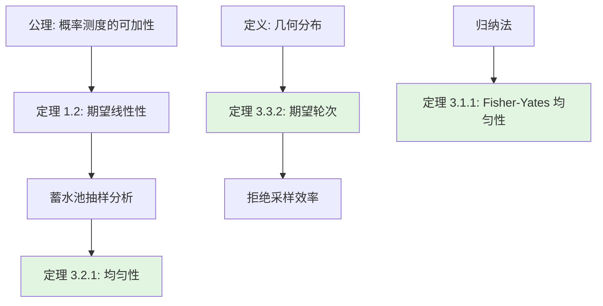
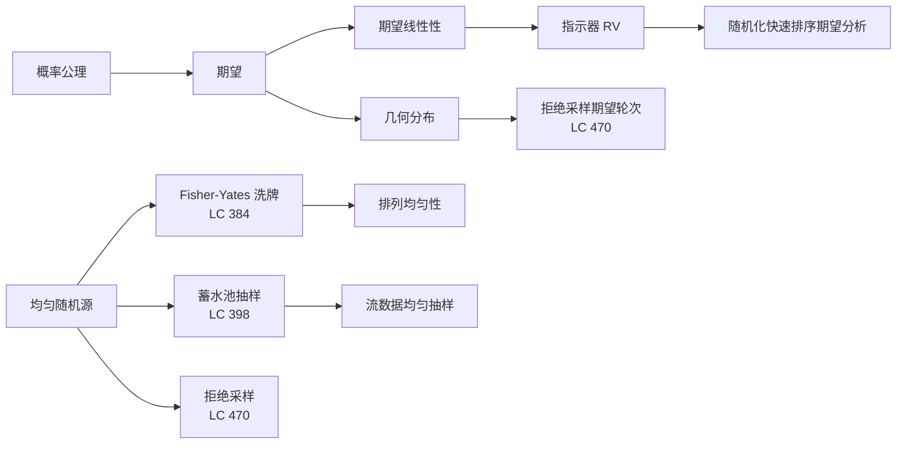

> 📊 **项目全面梳理**：详细的项目结构、模块详解和学习路径，请参阅 [`项目全面梳理-2025.md`](../../项目全面梳理-2025.md)

## 概率与随机算法面试题 / Probability and Randomized Algorithms

### 摘要 / Executive Summary

- 概率与随机算法是算法面试中**区分度最高**的专题之一，尤其在系统设计、分布式一致性、机器学习工程与推荐系统方向的面试中权重显著。本文从期望线性性与指示器随机变量的形式化定义出发，建立蒙特卡洛方法的分析框架。
- 通过 LeetCode 384/398/470 三道经典题目，展示 Fisher-Yates 洗牌的均匀性归纳证明、蓄水池抽样 $k=1$ 时期的望正确性推导，以及拒绝采样的期望轮次分析。每道题目均包含严格的概率推导与复杂度论证。
- 本文包含 3 个 Mermaid 思维表征图与 5 道自测问题，帮助读者从“写出随机函数”跨越到“证明随机算法的正确性与效率”。

### 关键术语与符号 / Glossary

| 术语 / Term | 定义 / Definition |
|-------------|-------------------|
| 期望 Expectation | 随机变量 $X$ 的期望 $\mathbb{E}[X] = \sum_x x \cdot P(X=x)$（离散型） |
| 期望线性性 Linearity of Expectation | $\mathbb{E}[aX + bY] = a\mathbb{E}[X] + b\mathbb{E}[Y]$，不要求 $X, Y$ 独立 |
| 指示器随机变量 Indicator RV | 对事件 $A$，$I_A = 1$ 若 $A$ 发生，否则 $0$；满足 $\mathbb{E}[I_A] = P(A)$ |
| 蒙特卡洛方法 Monte Carlo | 通过重复随机采样估计数值结果的算法范式 |
| Fisher-Yates 洗牌 | 每次从剩余未洗牌元素中随机选取一个放到已洗牌区域的末尾 |
| 蓄水池抽样 Reservoir Sampling | 从未知长度或极长的数据流中均匀抽取 $k$ 个样本的算法族 |
| 拒绝采样 Rejection Sampling | 在易采样的分布上采样，拒绝不符合目标分布的样本 |
| 几何分布 Geometric Distribution | 首次成功所需独立伯努利试验次数，$P(X=k) = (1-p)^{k-1}p$，$\mathbb{E}[X] = 1/p$ |

术语对齐与引用规范：`docs/术语与符号总表.md`，`01-基础理论/00-撰写规范与引用指南.md`

### 目录 / Table of Contents

- [概率与随机算法面试题 / Probability and Randomized Algorithms](#概率与随机算法面试题--probability-and-randomized-algorithms)
  - [摘要 / Executive Summary](#摘要--executive-summary)
  - [关键术语与符号 / Glossary](#关键术语与符号--glossary)
  - [目录 / Table of Contents](#目录--table-of-contents)
  - [交叉引用与依赖 / Cross-References and Dependencies](#交叉引用与依赖--cross-references-and-dependencies)
- [1. 形式化定义 / Formal Definitions](#1-形式化定义--formal-definitions)
  - [1.1 期望与期望线性性](#11-期望与期望线性性)
  - [1.2 指示器随机变量](#12-指示器随机变量)
  - [1.3 蒙特卡洛方法](#13-蒙特卡洛方法)
- [2. 核心思路与算法框架](#2-核心思路与算法框架)
  - [2.1 Fisher-Yates 洗牌框架](#21-fisher-yates-洗牌框架)
  - [2.2 蓄水池抽样框架](#22-蓄水池抽样框架)
  - [2.3 拒绝采样框架](#23-拒绝采样框架)
- [3. 经典题目详解](#3-经典题目详解)
  - [3.1 LeetCode 384 — 打乱数组](#31-leetcode-384--打乱数组)
    - [形式化规约 / Formal Specification](#形式化规约--formal-specification)
    - [核心思路 / Core Idea](#核心思路--core-idea)
    - [代码实现 / Code Implementations](#代码实现--code-implementations)
    - [复杂度分析 / Complexity Analysis](#复杂度分析--complexity-analysis)
    - [正确性证明 / Correctness Proof](#正确性证明--correctness-proof)
  - [3.2 LeetCode 398 — 随机数索引](#32-leetcode-398--随机数索引)
    - [形式化规约 / Formal Specification](#形式化规约--formal-specification-1)
    - [核心思路 / Core Idea](#核心思路--core-idea-1)
    - [代码实现 / Code Implementations](#代码实现--code-implementations-1)
    - [复杂度分析 / Complexity Analysis](#复杂度分析--complexity-analysis-1)
    - [正确性证明 / Correctness Proof](#正确性证明--correctness-proof-1)
  - [3.3 LeetCode 470 — 用 Rand7() 实现 Rand10()](#33-leetcode-470--用-rand7-实现-rand10)
    - [形式化规约 / Formal Specification](#形式化规约--formal-specification-2)
    - [核心思路 / Core Idea](#核心思路--core-idea-2)
    - [代码实现 / Code Implementations](#代码实现--code-implementations-2)
    - [复杂度分析 / Complexity Analysis](#复杂度分析--complexity-analysis-2)
    - [正确性证明 / Correctness Proof](#正确性证明--correctness-proof-2)
- [4. 复杂度分析体系](#4-复杂度分析体系)
  - [4.1 随机算法复杂度分类](#41-随机算法复杂度分类)
  - [4.2 本题复杂度汇总](#42-本题复杂度汇总)
- [5. 正确性证明框架](#5-正确性证明框架)
  - [5.1 期望复杂度分析](#51-期望复杂度分析)
  - [5.2 证明树](#52-证明树)
- [6. 思维表征](#6-思维表征)
  - [6.1 概念依赖图](#61-概念依赖图)
  - [6.2 算法选择决策树](#62-算法选择决策树)
  - [6.3 多维矩阵概念对比](#63-多维矩阵概念对比)
- [7. 常见错误与反模式](#7-常见错误与反模式)
  - [7.1 Fisher-Yates 的范围错误](#71-fisher-yates-的范围错误)
  - [7.2 蓄水池抽样的概率写反](#72-蓄水池抽样的概率写反)
  - [7.3 拒绝采样的映射错误](#73-拒绝采样的映射错误)
  - [7.4 使用 `rand() % n` 构造随机数](#74-使用-rand--n-构造随机数)
- [8. 自测问题](#8-自测问题)
  - [问题 1：期望线性性的独立性要求](#问题-1期望线性性的独立性要求)
  - [问题 2：Fisher-Yates 与朴素洗牌的对比](#问题-2fisher-yates-与朴素洗牌的对比)
  - [问题 3：蓄水池抽样中“ Telescope 积”的直觉](#问题-3蓄水池抽样中-telescope-积的直觉)
  - [问题 4：拒绝采样的效率上界](#问题-4拒绝采样的效率上界)
  - [问题 5：指示器随机变量在算法分析中的应用](#问题-5指示器随机变量在算法分析中的应用)
- [9. 学习目标](#9-学习目标)
- [10. 知识导航](#10-知识导航)
- [参考文献](#参考文献)

### 交叉引用与依赖 / Cross-References and Dependencies

**上游理论依赖 / Upstream Dependencies**:

- [`09-算法理论/07-随机算法/随机算法理论.md`](../../09-算法理论/07-随机算法/随机算法理论.md) — 随机算法的理论基础与分类
- [`09-算法理论/数论算法/数论算法综述.md`](../../09-算法理论/数论算法/数论算法综述.md) — 模运算与随机数生成
- [`04-算法复杂度/01-时间复杂度.md`](../../04-算法复杂度/01-时间复杂度.md) — 复杂度分析基础

**下游应用 / Downstream Applications**:

- `13-LeetCode算法面试专题/03-数据结构专题/` — 随机化数据结构（如跳表、Treap）
- `13-LeetCode算法面试专题/05-图论专题/` — 随机图算法与采样

---

## 1. 形式化定义 / Formal Definitions

### 1.1 期望与期望线性性

**定义 1.1** (期望 / Expectation)
设 $X$ 为离散型随机变量，其**期望**定义为：

$$
\mathbb{E}[X] = \sum_{x} x \cdot P(X = x)
$$

**定理 1.2** (期望线性性 / Linearity of Expectation)
对任意随机变量 $X, Y$（不必独立）和常数 $a, b \in \mathbb{R}$：

$$
\mathbb{E}[aX + bY] = a\mathbb{E}[X] + b\mathbb{E}[Y]
$$

*证明*: 由期望定义直接展开：

$$
\mathbb{E}[aX + bY] = \sum_{x,y} (ax + by) P(X=x, Y=y) = a\sum_x x \sum_y P(X=x,Y=y) + b\sum_y y \sum_x P(X=x,Y=y)
$$

由于 $\sum_y P(X=x,Y=y) = P(X=x)$ 且 $\sum_x P(X=x,Y=y) = P(Y=y)$，上式化为 $a\mathbb{E}[X] + b\mathbb{E}[Y]$。证毕。$\square$

> **关键洞察**: 期望线性性的强大之处在于它**不要求随机变量独立**。这使得我们可以将复杂随机过程分解为简单指示器变量之和。

### 1.2 指示器随机变量

**定义 1.3** (指示器随机变量 / Indicator Random Variable)
对于事件 $A$，其指示器随机变量 $I_A$ 定义为：

$$
I_A = \begin{cases} 1, & \text{if } A \text{ occurs} \\ 0, & \text{otherwise} \end{cases}
$$

**引理 1.4**: $\mathbb{E}[I_A] = P(A)$。

*证明*: $\mathbb{E}[I_A] = 1 \cdot P(A) + 0 \cdot P(\neg A) = P(A)$。证毕。$\square$

### 1.3 蒙特卡洛方法

**定义 1.5** (蒙特卡洛方法 / Monte Carlo Method)
蒙特卡洛方法是通过在概率空间中进行**大量独立随机采样**，以样本统计量估计目标量的算法范式。

**典型应用**:

- 数值积分：在积分区域内随机投点，用命中比例估计积分值
- 概率估计：通过重复实验估计某事件的发生概率
- 随机优化：模拟退火、遗传算法等

---

## 2. 核心思路与算法框架

### 2.1 Fisher-Yates 洗牌框架

**算法描述 / Algorithm Description**:

```text
FisherYatesShuffle(A):
    n ← length(A)
    for i from n-1 down to 1:
        j ← random integer in [0, i]
        swap(A[i], A[j])
    return A
```

**核心思想**: 从数组末尾开始，每次从尚未确定位置的元素（$[0, i]$）中均匀随机选取一个，与位置 $i$ 交换。这样可以保证每个排列被等概率生成。

### 2.2 蓄水池抽样框架

**算法描述 / Algorithm Description**（$k=1$ 情形）:

```text
ReservoirSampling(stream):
    result ← null
    i ← 0
    for x in stream:
        i ← i + 1
        if random() < 1/i:
            result ← x
    return result
```

**核心思想**: 当处理第 $i$ 个元素时，以概率 $1/i$ 替换当前结果。可以证明，遍历结束后每个元素被选中的概率均为 $1/n$（$n$ 为流长度）。

**通用版本（$k > 1$）**: 前 $k$ 个元素直接放入蓄水池；对于第 $i > k$ 个元素，以概率 $k/i$ 替换蓄水池中的某个随机元素。

### 2.3 拒绝采样框架

**算法描述 / Algorithm Description**:

```text
RejectionSampling():
    while true:
        x ← sample from source distribution
        if accept(x):
            return x
```

**核心思想**: 在一个容易采样的“超集”分布上采样，然后按照某种准则拒绝不符合要求的样本，直到获得符合目标分布的样本。

---

## 3. 经典题目详解

### 3.1 LeetCode 384 — 打乱数组

> **题目链接 / Problem Link**: [LeetCode 384. Shuffle an Array](https://leetcode.com/problems/shuffle-an-array/)
> **难度 / Difficulty**: Medium

#### 形式化规约 / Formal Specification

**输入**: 整数数组 $nums$
**输出**: $nums$ 的一个均匀随机排列（即所有 $n!$ 个排列每个被返回的概率均为 $1/n!$）

**后置条件 / Postcondition**:

$$
\forall \pi \in S_n: P(\text{result} = \pi) = \frac{1}{n!}
$$

其中 $S_n$ 为 $n$ 个元素的对称群（所有排列的集合）。

#### 核心思路 / Core Idea

采用 **Fisher-Yates 洗牌算法**（又称 Knuth Shuffle）。从数组最后一个元素开始，每次在 $[0, i]$ 范围内均匀随机选取一个索引 $j$，将 $A[i]$ 与 $A[j]$ 交换。处理完所有位置后，数组即为一个均匀随机排列。

**关键洞察**: 在第 $i$ 步时，位置 $i, i+1, \dots, n-1$ 已经放置了“正确”的元素（即从剩余元素池中均匀选取的），不再参与后续交换。通过归纳可证每个位置最终被赋予每个元素的概率均为 $1/n$。

#### 代码实现 / Code Implementations

- **Rust**: [`examples/algorithms/src/leetcode/lc0384_shuffle_an_array.rs`](../../../../examples/algorithms/src/leetcode/lc0384_shuffle_an_array.rs)
- **Python**: [`examples/algorithms-python/src/leetcode/lc0384_shuffle_an_array.py`](../../../../examples/algorithms-python/src/leetcode/lc0384_shuffle_an_array.py)
- **Go**: [`examples/algorithms-go/leetcode/lc0384_shuffle_an_array.go`](../../../../examples/algorithms-go/leetcode/lc0384_shuffle_an_array.go)

#### 复杂度分析 / Complexity Analysis

| 指标 / Metric | 值 / Value | 说明 / Note |
|--------------|-----------|------------|
| 时间复杂度 / Time | $O(n)$ | 每个位置一次交换 |
| 空间复杂度 / Space | $O(1)$ | 原地交换，仅使用常数额外空间 |
| 随机性来源 | $n-1$ 次均匀随机索引 | 每次从 $[0, i]$ 中均匀选取 |

#### 正确性证明 / Correctness Proof

**定理 3.1.1** (Fisher-Yates 均匀性): Fisher-Yates 算法生成每个排列的概率均为 $1/n!$。

**证明**: 对数组长度 $n$ 进行归纳。

**基例**（$n = 1$）：只有一个排列，概率为 $1 = 1/1!$，成立。

**归纳假设**：设算法对长度为 $n-1$ 的数组生成均匀随机排列。

**归纳步**：考虑长度为 $n$ 的数组。

**步骤 1**（位置 $n-1$ 的均匀性）：
在第一次迭代（$i = n-1$）中，$j$ 从 $[0, n-1]$ 中均匀随机选取。因此任意特定元素 $x$ 被放到位置 $n-1$ 的概率为：

$$
P(A[n-1] = x) = \frac{1}{n}
$$

**步骤 2**（剩余位置的均匀性）：
交换后，位置 $n-1$ 已固定。剩余 $n-1$ 个位置构成一个长度为 $n-1$ 的子问题。由归纳假设，递归处理（即后续 $i = n-2, \dots, 1$ 的迭代）会在这 $n-1$ 个位置上生成均匀随机排列。

**步骤 3**（全排列概率）：
对于任意特定排列 $\pi = (\pi_0, \pi_1, \dots, \pi_{n-1})$：

$$
P(\text{result} = \pi) = P(A[n-1] = \pi_{n-1}) \cdot P(\text{前 } n-1 \text{ 位为 } (\pi_0, \dots, \pi_{n-2}) \mid A[n-1] = \pi_{n-1})
$$

由步骤 1，$P(A[n-1] = \pi_{n-1}) = 1/n$。由步骤 2，条件概率为 $1/(n-1)!$。因此：

$$
P(\text{result} = \pi) = \frac{1}{n} \cdot \frac{1}{(n-1)!} = \frac{1}{n!}
$$

证毕。$\square$

---

### 3.2 LeetCode 398 — 随机数索引

> **题目链接 / Problem Link**: [LeetCode 398. Random Pick Index](https://leetcode.com/problems/random-pick-index/)
> **难度 / Difficulty**: Medium

#### 形式化规约 / Formal Specification

**输入**: 整数数组 $nums$，目标值 $target$
**输出**: $nums$ 中等于 $target$ 的一个随机索引，要求每个满足 $nums[i] = target$ 的索引被选中的概率相等

**后置条件 / Postcondition**:
设 $I = \{ i \mid nums[i] = target \}$，$m = |I|$。则：

$$
\forall i \in I: P(\text{result} = i) = \frac{1}{m}
$$

#### 核心思路 / Core Idea

本题是**蓄水池抽样（Reservoir Sampling）**在 $k=1$ 时的经典应用。遍历数组，维护一个候选结果。当遇到第 $j$ 个等于 $target$ 的元素时，以概率 $1/j$ 替换当前候选。

#### 代码实现 / Code Implementations

- **Rust**: [`examples/algorithms/src/leetcode/lc0398_random_pick_index.rs`](../../../../examples/algorithms/src/leetcode/lc0398_random_pick_index.rs)
- **Python**: [`examples/algorithms-python/src/leetcode/lc0398_random_pick_index.py`](../../../../examples/algorithms-python/src/leetcode/lc0398_random_pick_index.py)
- **Go**: [`examples/algorithms-go/leetcode/lc0398_random_pick_index.go`](../../../../examples/algorithms-go/leetcode/lc0398_random_pick_index.go)

#### 复杂度分析 / Complexity Analysis

| 指标 / Metric | 值 / Value |
|--------------|-----------|
| 时间复杂度 / Time | $O(n)$ | 需遍历整个数组一次 |
| 空间复杂度 / Space | $O(1)$ | 仅保存当前候选索引和计数 |

#### 正确性证明 / Correctness Proof

**定理 3.2.1** (蓄水池抽样 $k=1$ 的均匀性): 设数组中共有 $m$ 个等于 $target$ 的元素，算法返回每个对应索引的概率均为 $1/m$。

**证明**: 设 $m$ 个目标元素在遍历中依次出现，分别记为第 $1, 2, \dots, m$ 个目标。

考虑第 $i$ 个目标（$1 \leq i \leq m$）。它被最终选中的充要条件是：

1. 在第 $i$ 次遇到目标时，它被选中（概率 $1/i$）；
2. 在后续第 $i+1, \dots, m$ 次遇到目标时，它均未被替换。

第 $j$ 次（$j > i$）遇到目标时，当前候选被替换的概率为 $1/j$，不被替换的概率为 $1 - 1/j = (j-1)/j$。

因此第 $i$ 个目标最终保留的概率为：

$$
P(\text{选中第 } i \text{ 个}) = \frac{1}{i} \cdot \prod_{j=i+1}^{m} \frac{j-1}{j} = \frac{1}{i} \cdot \frac{i}{i+1} \cdot \frac{i+1}{i+2} \cdots \frac{m-1}{m} = \frac{1}{m}
$$

中间项 telescoping 后仅剩 $1/m$。证毕。$\square$

---

### 3.3 LeetCode 470 — 用 Rand7() 实现 Rand10()

> **题目链接 / Problem Link**: [LeetCode 470. Implement Rand10() Using Rand7()](https://leetcode.com/problems/implement-rand10-using-rand7/)
> **难度 / Difficulty]: Medium

#### 形式化规约 / Formal Specification

**输入**: 已知的均匀随机函数 `rand7()`，返回 $[1, 7]$ 中的整数，每个值概率 $1/7$
**输出**: 随机函数 `rand10()`，返回 $[1, 10]$ 中的整数，每个值概率 $1/10$

**后置条件 / Postcondition**:

$$
\forall i \in [1, 10]: P(\text{rand10}() = i) = \frac{1}{10}
$$

#### 核心思路 / Core Idea

采用**拒绝采样（Rejection Sampling）**。利用两次 `rand7()` 调用构造 $[1, 49]$ 的均匀分布（$7 \times 7 = 49$），然后只接受 $[1, 40]$ 范围内的结果，通过取模映射到 $[1, 10]$。对于 $[41, 49]$ 的 9 个值，拒绝并重新采样。

**映射方式**: 设两次调用结果为 $a, b \in [1, 7]$。构造：

$$
idx = (a - 1) \times 7 + (b - 1) + 1 = (a-1) \times 7 + b
$$

则 $idx \in [1, 49]$ 且均匀分布。若 $idx \leq 40$，返回 $(idx - 1) \bmod 10 + 1$；否则拒绝，重新采样。

#### 代码实现 / Code Implementations

- **Rust**: [`examples/algorithms/src/leetcode/lc0470_rand10_using_rand7.rs`](../../../../examples/algorithms/src/leetcode/lc0470_rand10_using_rand7.rs)
- **Python**: [`examples/algorithms-python/src/leetcode/lc0470_rand10_using_rand7.py`](../../../../examples/algorithms-python/src/leetcode/lc0470_rand10_using_rand7.py)
- **Go**: [`examples/algorithms-go/leetcode/lc0470_rand10_using_rand7.go`](../../../../examples/algorithms-go/leetcode/lc0470_rand10_using_rand7.go)

#### 复杂度分析 / Complexity Analysis

| 指标 / Metric | 值 / Value | 说明 / Note |
|--------------|-----------|------------|
| 期望时间 / Expected Time | $O(1)$ | 每轮接受概率 $p = 40/49$；期望轮次 $= 49/40 = 1.225$ |
| 空间复杂度 / Space | $O(1)$ | 仅保存中间随机值 |
| 最坏情况轮次 | $\infty$（概率 0） | 理论上可能无限拒绝，但概率指数衰减 |

#### 正确性证明 / Correctness Proof

**定理 3.3.1** (拒绝采样的均匀性): 若 $idx \in [1, 49]$ 均匀分布，则算法返回的 $result \in [1, 10]$ 也均匀分布。

**证明**: 对于任意 $r \in [1, 10]$，满足 $idx \leq 40$ 且 $(idx - 1) \bmod 10 + 1 = r$ 的 $idx$ 值恰好有 4 个：$r, r+10, r+20, r+30$。由于 $idx$ 在 $[1, 49]$ 上均匀分布，条件于 $idx \leq 40$ 时，$idx$ 在 $[1, 40]$ 上均匀分布。因此：

$$
P(result = r \mid \text{accept}) = \frac{4}{40} = \frac{1}{10}
$$

证毕。$\square$

**定理 3.3.2** (期望轮次): 算法的期望采样轮次为 $49/40$。

**证明**: 每轮采样接受的概率为 $p = 40/49$。各轮采样相互独立，成功所需的轮次数服从参数为 $p$ 的几何分布。几何分布的期望为：

$$
\mathbb{E}[\text{轮次}] = \frac{1}{p} = \frac{49}{40} = 1.225
$$

证毕。$\square$

---

## 4. 复杂度分析体系

### 4.1 随机算法复杂度分类

| 类型 / Type | 时间复杂度 | 正确性保证 | 代表算法 |
|-----------|-----------|-----------|---------|
| Las Vegas | 期望有限，最坏可能无限 | 100% 正确 | 随机化快速排序、蓄水池抽样 |
| Monte Carlo | 确定时间 | 概率正确 | 素性测试（Miller-Rabin）、拒绝采样 |
| 数值估计 | 误差与样本数相关 | 依概率收敛 | Monte Carlo 积分、PI 估计 |

### 4.2 本题复杂度汇总

| 题目 | 期望时间 | 空间 | 关键分布 |
|------|---------|------|---------|
| LC 384 Fisher-Yates | $O(n)$ | $O(1)$ | 均匀排列 |
| LC 398 蓄水池抽样 | $O(n)$ | $O(1)$ | 均匀索引 |
| LC 470 拒绝采样 | $O(1)$ | $O(1)$ | 几何分布（期望 $49/40$） |

---

## 5. 正确性证明框架

### 5.1 期望复杂度分析

**定理 5.1** (蓄水池抽样通用版本的期望时间)
对于流长度 $n$ 和蓄水池大小 $k$，通用蓄水池抽样的期望时间为 $O(n)$。

**证明**: 前 $k$ 个元素直接放入蓄水池，时间 $O(k)$。对于第 $i > k$ 个元素，以概率 $k/i$ 执行替换操作（时间 $O(1)$）。总期望时间为：

$$
O(k) + \sum_{i=k+1}^{n} \frac{k}{i} \cdot O(1) = O(k) + O(k \cdot (H_n - H_k)) = O(k \log \frac{n}{k})
$$

当 $k$ 为常数时，期望时间为 $O(n)$（因为需要遍历全部 $n$ 个元素）。证毕。$\square$

### 5.2 证明树



---

## 6. 思维表征

### 6.1 概念依赖图



### 6.2 算法选择决策树

```mermaid
flowchart TD
    Start[需要随机采样？] --> Q1{数据规模已知？}
    Q1 -->|是，可全部加载| Q2{需要排列还是选取？}
    Q2 -->|排列| A1[Fisher-Yates O(n)]
    Q2 -->|选取 k 个| A2[洗牌后取前 k 个]
    Q1 -->|否，流式数据| Q3{蓄水池大小？}
    Q3 -->|k = 1| A3[蓄水池抽样 1]
    Q3 -->|k > 1| A4[蓄水池抽样 k]
    Q1 -->|需要转换分布| A5[拒绝采样]

    style A1 fill:#e1f5e1
    style A3 fill:#e1f5e1
    style A4 fill:#e1f5e1
    style A5 fill:#e1f5e1
```

### 6.3 多维矩阵概念对比

| 维度 / Dimension | Fisher-Yates | 蓄水池抽样 $k=1$ | 拒绝采样 |
|----------------|-------------|------------------|---------|
| **随机源** | 数组索引 | 数据流元素 | 易采样分布 |
| **核心操作** | 原地交换 | 概率替换 | 接受/拒绝 |
| **时间复杂度** | $O(n)$ | $O(n)$ | $O(1)$（期望） |
| **空间复杂度** | $O(1)$ | $O(1)$ | $O(1)$ |
| **正确性证明工具** | 数学归纳法 | 望远镜积 | 条件概率 + 几何分布 |
| **常见错误** | 范围选错 $[0,n)$ | 概率写反 $1/(i+1)$ | 映射不覆盖目标域 |

---

## 7. 常见错误与反模式

### 7.1 Fisher-Yates 的范围错误

**错误**: 在每次迭代中从 $[0, n-1]$ 而非 $[0, i]$ 中选取 $j$。

**反模式**:

```python
# 错误：始终从整个数组选，导致非均匀分布
for i in range(n-1, 0, -1):
    j = random.randint(0, n-1)   # ❌ 应该是 [0, i]
    swap(a[i], a[j])
```

**后果**: 某些排列的出现概率高于 $1/n!$，分布不均匀。

### 7.2 蓄水池抽样的概率写反

**错误**: 将替换概率写成 $1/(i+1)$ 或 $i/(i+1)$。

**正确做法**: 第 $i$ 个元素（从 1 开始计数）的替换概率严格为 $1/i$。

### 7.3 拒绝采样的映射错误

**错误**: 在 LC 470 中，将 $idx$ 映射到 $[0, 9]$ 而非 $[1, 10]$，导致分布偏移或取模不均匀。

**正确做法**: $(idx - 1) \bmod 10 + 1$ 确保结果在 $[1, 10]$ 且均匀。

### 7.4 使用 `rand() % n` 构造随机数

**错误**: 在工程实现中，使用 `rand() % n` 来生成 $[0, n-1]$ 的随机数，当 $RAND_MAX + 1$ 不是 $n$ 的倍数时，会产生**模偏置（Modulo Bias）**。

**正确做法**: 使用拒绝采样消除模偏置，或直接使用语言提供的高质量随机数生成器（如 C++ `<random>`、Rust `rand` crate）。

---

## 8. 自测问题

### 问题 1：期望线性性的独立性要求

**Q**: 期望线性性 $E[X+Y] = E[X] + E[Y]$ 是否要求 $X$ 和 $Y$ 独立？

**A**: **不要求**。这是期望线性性最强大的地方。无论 $X$ 和 $Y$ 之间有何种依赖关系（正相关、负相关、甚至确定性函数关系），期望的加法分配律始终成立。证明仅依赖于概率测度的可数可加性，不涉及联合分布的具体形式。

---

### 问题 2：Fisher-Yates 与朴素洗牌的对比

**Q**: 为什么“每次随机选一个位置与当前位置交换”的朴素做法（非 Fisher-Yates）会产生非均匀分布？

**A**: 朴素做法中，每次从 $n$ 个位置选 $j$，导致总共有 $n^n$ 种等概率的交换序列，而 $n^n$ 通常不是 $n!$ 的整数倍。因此 $n^n$ 种序列无法均匀映射到 $n!$ 种排列上，某些排列的概率会高于 $1/n!$。而 Fisher-Yates 的总序列数为 $n \cdot (n-1) \cdots 2 \cdot 1 = n!$，与排列数精确对应，故可产生均匀分布。

---

### 问题 3：蓄水池抽样中“ Telescope 积”的直觉

**Q**: 在蓄水池抽样 $k=1$ 的证明中，$\prod_{j=i+1}^{m} \frac{j-1}{j} = \frac{i}{m}$ 的直觉是什么？

**A**: 第 $i$ 个元素要最终存活，必须在后续每一次“挑战”中都不被替换。第 $j$ 次挑战时不被替换的概率是 $(j-1)/j$。将这些概率连乘，中间项全部抵消（Telescope），仅剩第一个分母 $i$ 和最后一个分子 $m$ 的倒数关系。直观上，第 $i$ 个元素存活到最后，等价于在 $m$ 个候选中“恰好”以均匀方式保留了一个，而这个保留机制的设计使得每个候选的地位最终对称。

---

### 问题 4：拒绝采样的效率上界

**Q**: 在 LC 470 中，若 `rand7()` 被替换为 `rand2()`，用拒绝采样实现 `rand3()`，期望轮次是多少？

**A**: 两次 `rand2()` 可构造 $[1, 4]$ 的均匀分布。接受 $[1, 3]$（概率 $p = 3/4$），拒绝 4。期望轮次为 $1/p = 4/3 \approx 1.333$。一般地，若源分布空间大小为 $S$，目标分布空间大小为 $T$（$T \leq S$），则接受概率为 $T/S$，期望轮次为 $S/T$。

---

### 问题 5：指示器随机变量在算法分析中的应用

**Q**: 如何用指示器随机变量分析随机化快速排序的比较次数期望？

**A**: 设 $X$ 为总比较次数。定义 $X_{ij}$ 为指示器变量，当元素 $z_i$ 与 $z_j$ 发生过比较时为 1，否则为 0。则 $X = \sum_{i<j} X_{ij}$。在随机化快速排序中，$z_i$ 与 $z_j$ 比较当且仅当它们是某个子数组中第一个被选为 pivot 的元素。对于已排序的 $n$ 个元素，$P(X_{ij} = 1) = 2/(j-i+1)$。由期望线性性：

$$
\mathbb{E}[X] = \sum_{i<j} \frac{2}{j-i+1} = O(n \log n)
$$

此分析巧妙地绕过了复杂的递归依赖结构，是期望线性性的经典应用。

---

## 9. 学习目标

完成本章学习后，读者应能够：

1. **形式化定义**期望、期望线性性、指示器随机变量、蒙特卡洛方法，并理解它们之间的逻辑关系。
2. **独立证明**Fisher-Yates 洗牌的均匀性、蓄水池抽样的均匀性、以及拒绝采样的期望轮次。
3. **正确实现**三种核心随机算法模板，并能根据题目约束选择正确的采样策略。
4. **进行期望复杂度分析**：利用期望线性性将复杂随机过程分解为简单指示器变量之和。
5. **避免常见陷阱**：范围错误、概率写反、模偏置、映射不均匀。

---

## 10. 知识导航

- [返回目录](../README.md)
- [上一章：03-计算几何基础](./03-计算几何基础.md)
- [下一章：04-字符串专题/00-字符串专题导论](../04-字符串专题/00-字符串专题导论.md)

---

## 参考文献

1. **R. Motwani, P. Raghavan**, *Randomized Algorithms*, Cambridge University Press, 1995. §1.2–1.3 (Linearity of Expectation, Indicator Variables)
2. **D. E. Knuth**, *The Art of Computer Programming, Vol. 2*, 3rd ed., Addison-Wesley, 1997. §3.4.2 (Random Sampling and Shuffling)
3. **J. S. Vitter**, "Random Sampling with a Reservoir", *ACM Transactions on Mathematical Software*, 11(1), 1985.
4. **T. H. Cormen et al.**, *Introduction to Algorithms*, 3rd ed., MIT Press, 2009. §5.3 (Randomized Algorithms, Hiring Problem)
5. **M. Mitzenmacher, E. Upfal**, *Probability and Computing: Randomized Algorithms and Probabilistic Analysis*, Cambridge University Press, 2005. §2.3 (Linearity of Expectation)
