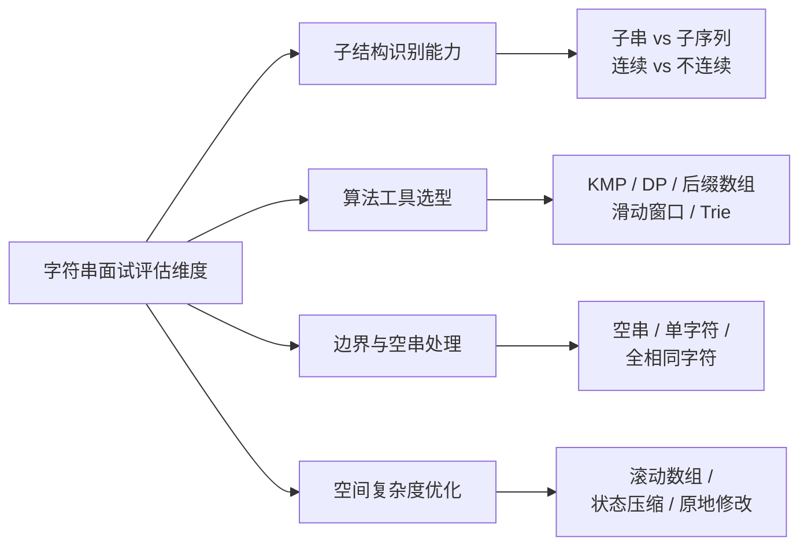
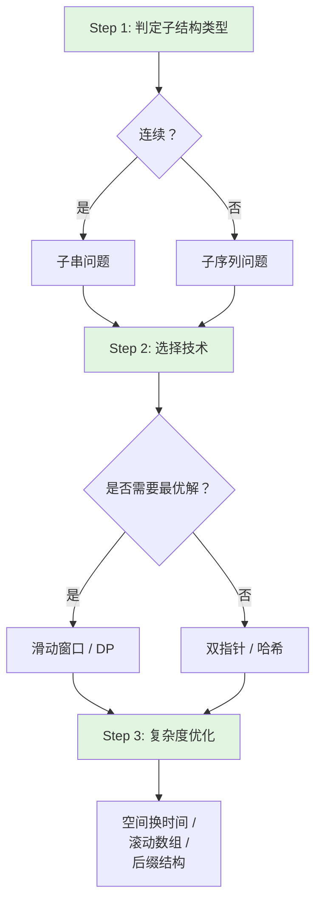
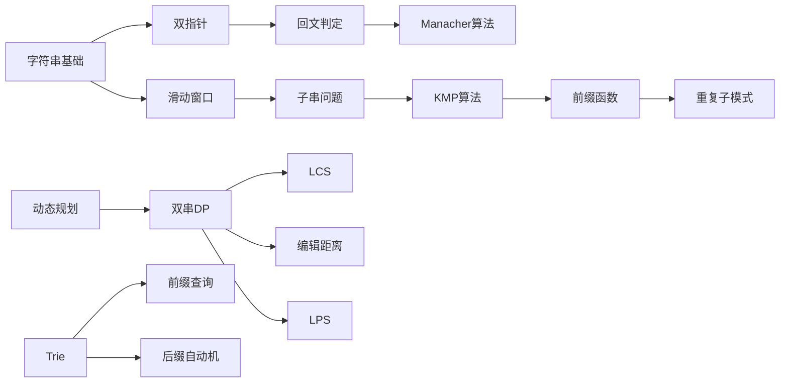

> 📊 **项目全面梳理**：详细的项目结构、模块详解和学习路径，请参阅 [`项目全面梳理-2025.md`](../../项目全面梳理-2025.md)

## 字符串专题导论 / String Topics Introduction

### 摘要 / Executive Summary

- 字符串是算法面试中**最高频的考点之一**（约占 LeetCode 题库的 15%–20%），其考察范围横跨基础操作、模式匹配、动态规划与高级后缀结构。本文系统梳理字符串问题的三大技术支柱——**匹配（Matching）**、**动态规划（DP）**、**后缀结构（Suffix Structures）**——并建立与 `09-算法理论/04-字符串算法/` 的完整衔接。
- 本导论提供字符串面试题的**分类框架**、**复杂度速查表**与**学习路径图**，帮助读者在有限时间内建立从“会写代码”到“能选算法”的系统性认知。
- 后续章节将分别深入字符串匹配（KMP 应用）、回文问题（Manacher / DP）与字符串动态规划（双串 DP 框架）。

### 关键术语与符号 / Glossary

| 术语 / Term | 定义 / Definition |
|-------------|-------------------|
| 子串 Substring | 字符串中连续的字符序列，$S[i..j]$ |
| 子序列 Subsequence | 通过删除零个或多个字符（不必连续）得到的序列 |
| 模式匹配 Pattern Matching | 在文本串 $T$ 中查找模式串 $P$ 的出现位置 |
| 前缀函数 Prefix Function | KMP 算法中 $\pi[i]$ 表示子串 $P[0..i]$ 的最长相等真前缀与真后缀长度 |
| 编辑距离 Edit Distance | 将一个字符串转换为另一个字符串所需的最少单字符编辑操作数（Levenshtein 距离） |
| 最长公共子序列 LCS | 两个字符串的最长公共子序列的长度 |
| 后缀数组 Suffix Array | 字符串所有后缀按字典序排序后的起始索引数组 |
| Trie（前缀树） | 一种多叉树结构，用于高效存储和检索字符串集合 |
| 滚动哈希 Rolling Hash | 通过递推公式在 $O(1)$ 时间内计算子串哈希值的技术 |

术语对齐与引用规范：`docs/术语与符号总表.md`，`01-基础理论/00-撰写规范与引用指南.md`

### 目录 / Table of Contents

- [字符串专题导论 / String Topics Introduction](#字符串专题导论--string-topics-introduction)
  - [摘要 / Executive Summary](#摘要--executive-summary)
  - [关键术语与符号 / Glossary](#关键术语与符号--glossary)
  - [目录 / Table of Contents](#目录--table-of-contents)
  - [交叉引用与依赖 / Cross-References and Dependencies](#交叉引用与依赖--cross-references-and-dependencies)
- [1. 字符串在面试中的地位](#1-字符串在面试中的地位)
  - [1.1 面试分布与难度曲线](#11-面试分布与难度曲线)
  - [1.2 面试官评估维度](#12-面试官评估维度)
  - [1.3 字符串问题的工程背景](#13-字符串问题的工程背景)
  - [1.4 字符串问题的解题方法论](#14-字符串问题的解题方法论)
- [2. 与 `09-算法理论/04-字符串算法/` 的衔接](#2-与-09-算法理论04-字符串算法-的衔接)
- [3. 三大技术支柱](#3-三大技术支柱)
  - [3.1 匹配（Matching）](#31-匹配matching)
  - [3.2 动态规划（DP）](#32-动态规划dp)
  - [3.3 后缀结构（Suffix Structures）](#33-后缀结构suffix-structures)
  - [3.4 技术选型决策指南](#34-技术选型决策指南)
- [4. 复杂度速查表](#4-复杂度速查表)
  - [4.1 字符串匹配算法复杂度](#41-字符串匹配算法复杂度)
  - [4.2 字符串 DP 复杂度](#42-字符串-dp-复杂度)
  - [4.3 后缀结构复杂度](#43-后缀结构复杂度)
- [5. 学习路径图](#5-学习路径图)
  - [5.1 推荐学习顺序](#51-推荐学习顺序)
  - [5.2 难度递进路线](#52-难度递进路线)
  - [5.3 面试前快速复习清单](#53-面试前快速复习清单)
- [6. 思维表征](#6-思维表征)
  - [6.1 概念依赖图](#61-概念依赖图)
  - [6.2 算法选择决策树](#62-算法选择决策树)
  - [6.3 三大技术支柱对比矩阵](#63-三大技术支柱对比矩阵)
  - [6.4 字符串问题到算法的映射图](#64-字符串问题到算法的映射图)
- [7. 自测问题](#7-自测问题)
  - [问题 1：子串与子序列的区别](#问题-1子串与子序列的区别)
  - [问题 2：KMP 相比暴力匹配的核心优势](#问题-2kmp-相比暴力匹配的核心优势)
  - [问题 3：双串 DP 的通用框架](#问题-3双串-dp-的通用框架)
  - [问题 4：后缀数组与后缀自动机的选型](#问题-4后缀数组与后缀自动机的选型)
  - [问题 5：滑动窗口与双指针的关系](#问题-5滑动窗口与双指针的关系)
- [8. 学习目标](#8-学习目标)
- [9. 知识导航](#9-知识导航)
- [参考文献](#参考文献)

### 交叉引用与依赖 / Cross-References and Dependencies

**上游理论依赖 / Upstream Dependencies**:

- [`09-算法理论/04-字符串算法/KMP算法.md`](../../09-算法理论/04-字符串算法/KMP算法.md) — KMP 算法的理论定义与前缀函数
- [`09-算法理论/04-字符串算法/后缀数组与LCP.md`](../../09-算法理论/04-字符串算法/后缀数组与LCP.md) — 后缀数组与最长公共前缀
- [`09-算法理论/04-字符串算法/后缀自动机.md`](../../09-算法理论/04-字符串算法/后缀自动机.md) — 后缀自动机的状态转移与性质
- [`09-算法理论/01-算法基础/06-动态规划理论.md`](../../09-算法理论/01-算法基础/06-动态规划理论.md) — DP 的理论框架与状态设计
- [`02-算法范式专题/08-动态规划.md`](../02-算法范式专题/08-动态规划.md) — DP 在面试题中的系统应用

**下游应用 / Downstream Applications**:

- `13-LeetCode算法面试专题/04-字符串专题/01-字符串匹配与KMP应用.md` — KMP 与字符串匹配面试题
- `13-LeetCode算法面试专题/04-字符串专题/02-回文问题.md` — 回文子串与 Manacher 算法
- `13-LeetCode算法面试专题/04-字符串专题/03-字符串动态规划.md` — 双串 DP 与编辑距离

---

## 1. 字符串在面试中的地位

### 1.1 面试分布与难度曲线

| 难度 / Difficulty | 题量 | 高频题型 | 核心能力 |
|------------------|------|---------|---------|
| Easy | ~120 道 | 字符串反转、基础匹配、字符统计 | 边界处理、双指针 |
| Medium | ~280 道 | KMP 应用、滑动窗口、双串 DP | 算法选型、状态设计 |
| Hard | ~100 道 | 后缀数组、自动机、高级 DP | 理论深度、代码复杂度控制 |
| **合计** | **~500 道** | — | — |

**关键洞察 / Key Insight**：字符串题目的核心难点不在于“写出代码”，而在于：

1. **识别子结构**：能否将问题转化为子串/子序列的最优子结构；
2. **选择正确工具**：滑动窗口、KMP、DP、后缀结构之间的快速选型；
3. **控制复杂度**：从 $O(n^2)$ 的朴素 DP 优化到 $O(n)$ 或 $O(n \log n)$。

### 1.2 面试官评估维度



### 1.3 字符串问题的工程背景

字符串算法不仅是面试考点，更是大量工程系统的核心组件：

| 工程场景 | 核心技术 | 对应面试题 |
|---------|---------|-----------|
| 搜索引擎倒排索引 | 后缀数组、Trie | 前缀匹配、自动补全 |
| 代码编辑器查找替换 | KMP、Boyer-Moore | 模式匹配、正则表达式 |
| DNA 序列比对 | 编辑距离、LCS | 双串 DP、局部比对 |
| 编译器词法分析 | 自动机、Trie | 有限状态机实现 |
| 数据库 LIKE 查询 | 通配符匹配 DP | 正则表达式匹配 |
| 版本控制系统 diff | LCS、编辑距离 | 最短编辑脚本 |
| 拼写检查器 | 编辑距离、BK-Tree | 最相近单词 |

### 1.4 字符串问题的解题方法论

面对字符串面试题，推荐采用以下**三步分析法**：



**Step 1 — 判定子结构类型**：首先明确题目要求的是**子串**（连续）还是**子序列**（不连续）。这是选择算法工具的首要依据。子串问题通常可用滑动窗口或中心扩展；子序列问题通常需要 DP。

**Step 2 — 选择技术**：若需要最优化（最长、最短、最少操作），优先考虑 DP 或滑动窗口；若只需要判定存在性，优先考虑哈希或 KMP。

**Step 3 — 复杂度优化**：识别是否可以空间换时间（如后缀数组预处理）、是否可以用滚动数组压缩 DP 空间、是否可以利用单调性优化时间。

---

## 2. 与 `09-算法理论/04-字符串算法/` 的衔接

本专题是 `09-算法理论/04-字符串算法/` 的**面试导向提炼**。二者的衔接关系如下：

| 本专题文档 | 对应理论文档 | 衔接点 |
|-----------|-------------|--------|
| `01-字符串匹配与KMP应用` | `09-算法理论/04-字符串算法/KMP算法.md` | 将前缀函数的理论定义转化为面试中的“查找重复子模式”“最小循环节”等题型 |
| `02-回文问题` | `09-算法理论/04-字符串算法/Manacher算法.md` | 将 Manacher 算法的回文半径数组应用于最长回文子串等面试题 |
| `03-字符串动态规划` | `09-算法理论/01-算法基础/06-动态规划理论.md` | 将 DP 最优子结构理论应用于 LCS、编辑距离等双串问题 |
| 高级选读 | `09-算法理论/04-字符串算法/后缀自动机.md` | 后缀自动机在“不同子串数目”等 Hard 题中的应用 |

---

## 3. 三大技术支柱

### 3.1 匹配（Matching）

**核心算法**: 暴力匹配、KMP、Rabin-Karp、Boyer-Moore、Aho-Corasick。

**面试价值**: KMP 是字符串匹配面试的“标准答案”。面试官通常不会要求从头推导 KMP，但会考察：

- 前缀函数的计算与性质；
- 利用前缀函数解决“重复子字符串”“最小循环节”等变形题。

**代表题目**: LC 28（实现 strStr）、LC 459（重复的子字符串）、LC 686（重复叠加字符串匹配）。

### 3.2 动态规划（DP）

**核心问题**: 最长公共子序列（LCS）、编辑距离（Levenshtein）、最长回文子序列（LPS）、正则表达式匹配、通配符匹配。

**面试价值**: 字符串 DP 是考察候选人**状态设计能力**的经典载体。双串 DP 的通用框架（$dp[i][j]$ 表示 $s_1[0..i-1]$ 与 $s_2[0..j-1]$ 的某种最优值）是面试中必须掌握的模板。

**代表题目**: LC 1143（LCS）、LC 72（编辑距离）、LC 516（LPS）、LC 583（删除操作）、LC 10（正则表达式匹配）。

### 3.3 后缀结构（Suffix Structures）

**核心结构**: 后缀数组（Suffix Array）、后缀自动机（SAM）、后缀树（Suffix Tree）、Trie。

**面试价值**: 后缀结构在普通算法面试中出现频率较低，但在**竞赛编程、 bioinformatics、搜索引擎**等方向的面试中是加分项。Trie 在“自动补全”“前缀统计”等工程问题中非常实用。

**代表题目**: LC 208（实现 Trie）、LC 212（单词搜索 II）、LC 1044（最长重复子串，可用后缀数组或 Rabin-Karp 二分）。

### 3.4 技术选型决策指南

在实际面试中，如何从三大技术中快速选型？以下决策矩阵提供参考：

| 问题特征 | 首选技术 | 备选技术 | 避免使用 |
|---------|---------|---------|---------|
| 查找固定模式在文本中的位置 | KMP / Rabin-Karp | 后缀自动机 | 暴力 $O(nm)$（除非 $n,m$ 极小） |
| 求最长/最短满足条件的子串 | 滑动窗口 | 双指针 | 子序列 DP（会超时） |
| 求两个字符串的最长公共部分 | LCS DP | 后缀数组 + LCP | 暴力枚举子串 |
| 字符串变换的最少操作数 | 编辑距离 DP | — | BFS（状态空间爆炸） |
| 大量前缀查询 | Trie | 哈希表 | 线性扫描 |
| 求不同子串数目 | 后缀自动机 | 后缀数组 | 暴力枚举 $O(n^2)$ |

---

## 4. 复杂度速查表

### 4.1 字符串匹配算法复杂度

| 算法 / Algorithm | 预处理时间 | 匹配时间 | 空间 | 说明 |
|----------------|-----------|---------|------|------|
| 暴力匹配 | $O(1)$ | $O(n \cdot m)$ | $O(1)$ | $n$=文本长, $m$=模式长 |
| KMP | $O(m)$ | $O(n)$ | $O(m)$ | 文本指针永不回退 |
| Rabin-Karp | $O(m)$ | $O(n)$ 平均 | $O(1)$ | 哈希碰撞时退化 $O(n \cdot m)$ |
| Boyer-Moore | $O(m + |\Sigma|)$ | $O(n)$ 最好 | $O(|\Sigma|)$ | 实际运行常数小 |
| Aho-Corasick | $O(m \cdot k)$ | $O(n + z)$ | $O(m \cdot k)$ | 多模式匹配, $z$=输出大小 |

### 4.2 字符串 DP 复杂度

| 问题 / Problem | 时间 | 空间 | 优化后空间 | 说明 |
|---------------|------|------|-----------|------|
| LCS | $O(m \cdot n)$ | $O(m \cdot n)$ | $O(\min(m,n))$ | 双串经典 DP |
| 编辑距离 | $O(m \cdot n)$ | $O(m \cdot n)$ | $O(\min(m,n))$ | 滚动数组优化 |
| LPS | $O(n^2)$ | $O(n^2)$ | $O(n^2)$ | 区间 DP 或转化为 LCS |
| 正则表达式匹配 | $O(m \cdot n)$ | $O(m \cdot n)$ | $O(n)$ | 带通配符的双串 DP |

### 4.3 后缀结构复杂度

| 结构 / Structure | 构建时间 | 查询时间 | 空间 | 说明 |
|----------------|---------|---------|------|------|
| Trie | $O(\sum |s_i|)$ | $O(|p|)$ | $O(\sum |s_i|)$ | 前缀查询 |
| 后缀数组 + LCP | $O(n \log n)$ 或 $O(n)$ | $O(|p| \log n)$ | $O(n)$ | 子串查询 |
| 后缀自动机 | $O(n)$ | $O(|p|)$ | $O(n)$ | 子串存在性查询 |

---

## 5. 学习路径图

### 5.1 推荐学习顺序

```mermaid
flowchart TD
    Start[开始字符串专题] --> A[基础操作与双指针]
    A --> B[滑动窗口]
    B --> C[字符串匹配 / KMP]
    C --> D[字符串动态规划]
    D --> E[回文问题 / Manacher]
    E --> F[Trie 与后缀结构]

    A --> A1[反转 / 比较 / 分割]
    B --> B1[无重复最长子串<br/>LC 3]
    C --> C1[前缀函数]
    C --> C2[重复子字符串<br/>LC 459]
    D --> D1[LCS / 编辑距离]
    D --> D2[双串 DP 框架]
    E --> E1[中心扩展]
    E --> E2[Manacher O(n)]
    F --> F1[实现 Trie<br/>LC 208]
    F --> F2[后缀数组选读]

    style A fill:#e1f5e1
    style B fill:#e1f5e1
    style C fill:#e1f5e1
    style D fill:#e1f5e1
    style E fill:#e1f5e1
```

### 5.2 难度递进路线

| 阶段 | 目标 | 推荐题目 | 预计用时 |
|------|------|---------|---------|
| 入门 | 掌握字符串基础操作与双指针 | LC 344, LC 125, LC 28 | 2–3 天 |
| 进阶 | 理解滑动窗口与 KMP | LC 3, LC 76, LC 459 | 3–4 天 |
| 提高 | 掌握双串 DP 框架 | LC 1143, LC 72, LC 516 | 4–5 天 |
| 综合 | 回文、Trie、后缀结构 | LC 5, LC 208, LC 1044 | 3–4 天 |

### 5.3 面试前快速复习清单

**P0（必须熟练）**：

- 滑动窗口模板（变长窗口的扩展与收缩条件）
- KMP 前缀函数的计算与性质
- 双串 DP 框架（LCS、编辑距离的状态转移）
- 中心扩展法求最长回文子串

**P1（高概率考察）**：

- 字符串哈希与 Rabin-Karp
- 正则表达式匹配的 DP 实现
- Trie 的插入与搜索
- 滚动数组优化双串 DP

**P2（加分项）**：

- Manacher 算法的回文半径数组
- 后缀数组的构建与应用
- 后缀自动机的状态转移
- Z-Algorithm 的线性时间匹配

---

## 6. 思维表征

### 6.1 概念依赖图



### 6.2 算法选择决策树

```mermaid
flowchart TD
    Start[字符串问题？] --> Q1{需要查找模式？}
    Q1 -->|是| Q2{模式数量？}
    Q2 -->|单个| Q3{是否预处理？}
    Q3 -->|是| A1[KMP O(n+m)]
    Q3 -->|否| A2[暴力匹配 / Rabin-Karp]
    Q2 -->|多个| A3[Aho-Corasick]
    Q1 -->|否| Q4{需要最优化？}
    Q4 -->|是| Q5{优化目标？}
    Q5 -->|子序列/子串长度| A4[动态规划]
    Q5 -->|编辑操作数| A5[编辑距离 DP]
    Q4 -->|否| Q6{需要前缀查询？}
    Q6 -->|是| A6[Trie]
    Q6 -->|否| A7[哈希 / 后缀结构]

    style A1 fill:#e1f5e1
    style A4 fill:#e1f5e1
    style A5 fill:#e1f5e1
    style A6 fill:#e1f5e1
```

### 6.3 三大技术支柱对比矩阵

| 维度 / Dimension | 匹配技术 | 动态规划 | 后缀结构 |
|----------------|---------|---------|---------|
| **核心思想** | 利用模式自身结构避免回退 | 最优子结构 + 重叠子问题 | 将所有后缀组织成高效索引结构 |
| **典型复杂度** | $O(n+m)$ | $O(m \cdot n)$ | $O(n)$ ~ $O(n \log n)$ |
| **空间开销** | $O(m)$ | $O(m \cdot n)$（可优化） | $O(n)$ |
| **面试频率** | 中高 | 极高 | 中低 |
| **典型题目** | LC 28, LC 459 | LC 72, LC 1143, LC 516 | LC 208, LC 1044 |
| **理论深度** | 中等（前缀函数） | 中等（状态设计） | 高（后缀自动机） |

### 6.4 字符串问题到算法的映射图

```mermaid
flowchart TD
    A[字符串问题] --> B{需要连续？}
    B -->|是| C[子串问题]
    B -->|否| D[子序列问题]
    C --> E{需要最优？}
    E -->|是| F[滑动窗口 / 中心扩展]
    E -->|否| G[双指针 / 哈希]
    D --> H{双串？}
    H -->|是| I[双串 DP]
    H -->|否| J[单串 DP / 区间 DP]
    F --> K[O(n) 或 O(n²)]
    I --> L[O(m·n)]
    J --> M[O(n²)]
```

---

## 7. 自测问题

### 问题 1：子串与子序列的区别

**Q**: 子串（Substring）与子序列（Subsequence）的根本区别是什么？

**A**: **子串**要求字符在原字符串中**连续**出现，形式化为 $S[i..j]$；**子序列**只要求字符的**相对顺序**不变，中间可以跳过任意数量的字符。例如，对于 "abcde"，"acd" 是子序列但不是子串，"bcd" 既是子串也是子序列。

---

### 问题 2：KMP 相比暴力匹配的核心优势

**Q**: KMP 算法将匹配时间从 $O(n \cdot m)$ 降到 $O(n + m)$，核心洞察是什么？

**A**: KMP 的核心洞察是**模式串自身的结构信息**。当在文本 $T$ 的位置 $i$ 处发生失配时，暴力匹配会将文本指针回退到 $i - m + 2$、模式指针回退到 $0$。而 KMP 利用前缀函数知道：模式串中已经匹配的部分 $P[0..q-1]$ 的最长相等真前缀-真后缀长度为 $\pi[q-1]$，因此可以直接将模式指针跳到 $\pi[q-1]$，而**文本指针 $i$ 永不回退**。

---

### 问题 3：双串 DP 的通用框架

**Q**: 字符串双串 DP（如 LCS、编辑距离）的通用状态设计是什么？

**A**: 通用框架为 $dp[i][j]$，表示处理 $s_1[0..i-1]$ 和 $s_2[0..j-1]$ 这两个前缀时的最优值。状态转移通常考虑 $s_1[i-1]$ 与 $s_2[j-1]$ 的关系：

- 若相等：$dp[i][j] = f(dp[i-1][j-1], \text{match})$；
- 若不相等：$dp[i][j] = g(dp[i-1][j], dp[i][j-1], dp[i-1][j-1], \text{mismatch})$。

其中 $f, g$ 的具体形式取决于问题定义。

---

### 问题 4：后缀数组与后缀自动机的选型

**Q**: 面试中遇到“查询某模式是否为文本的子串”，应优先选择后缀数组还是后缀自动机？

**A**: 在**面试场景**中，若时间有限，优先实现 **Trie** 或 **Rabin-Karp**（尤其是只需要判断存在性时）。后缀自动机（SAM）虽然查询时间为 $O(|p|)$ 且构建时间为 $O(n)$，但实现复杂度较高，容易在面试时间紧张时出错。后缀数组构建为 $O(n \log n)$ 或 $O(n)$，查询需要 $O(|p| \log n)$，实现同样较复杂。对于面试，**先用哈希 + 二分**（如 LC 1044）往往是性价比最高的方案。

---

### 问题 5：滑动窗口与双指针的关系

**Q**: 滑动窗口（Sliding Window）是双指针（Two Pointers）的一种吗？

**A**: **是的**。滑动窗口是双指针在字符串/数组问题中的一种特化形式：左指针 $l$ 和右指针 $r$ 维护一个“窗口” $[l, r)$，右指针 $r$ 通常单调向右扩展，左指针 $l$ 在窗口不满足条件时向右收缩。滑动窗口的核心适用条件是：**当右指针向右移动时，左指针不会向左回退**，从而保证总时间复杂度为 $O(n)$。

---

## 8. 学习目标

完成本章学习后，读者应能够：

1. **定位问题**：给定一道字符串面试题，判断其属于匹配/DP/后缀结构中的哪一类，并选择正确的算法工具。
2. **建立衔接**：理解本专题与 `09-算法理论/04-字符串算法/` 中上游理论文档的对应关系。
3. **掌握模板**：熟练写出 KMP 前缀函数、双串 DP 框架、滑动窗口的代码模板。
4. **复杂度权衡**：面对多解法的字符串题目，能够从时间、空间、实现复杂度三个维度进行解法对比。
5. **边界处理**：正确处理空串、单字符串、全相同字符串等边界情况。

---

## 9. 知识导航

- [返回目录](../README.md)
- [上一章：03-数学专题/04-概率与随机算法面试题](../03-数学专题/04-概率与随机算法面试题.md)
- [下一章：01-字符串匹配与KMP应用](./01-字符串匹配与KMP应用.md)
- [03-字符串动态规划](./03-字符串动态规划.md)

---

## 参考文献

1. **D. E. Knuth, J. H. Morris, V. R. Pratt**, "Fast Pattern Matching in Strings", *SIAM Journal on Computing*, 6(2), 1977.
2. **T. H. Cormen et al.**, *Introduction to Algorithms*, 3rd ed., MIT Press, 2009. §32 (String Matching)
3. **M. A. Manacher**, "A New Linear-Time On-Line Algorithm for Finding the Smallest Initial Palindrome of a String", *Journal of the ACM*, 22(3), 1975.
4. **U. Manber, G. Myers**, "Suffix Arrays: A New Method for On-Line String Searches", *SIAM Journal on Computing*, 22(5), 1993.
5. **A. Blumer, J. Blumer, D. Haussler, A. Ehrenfeucht, M. T. Chen, J. Seiferas**, "The Smallest Automaton Recognizing the Subwords of a Text", *Theoretical Computer Science*, 40, 1985.
