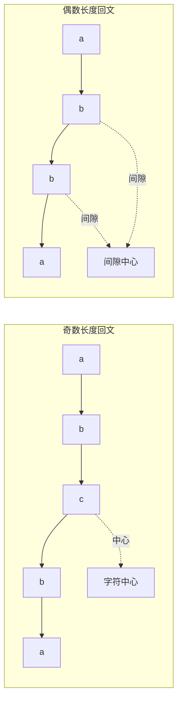

> 📊 **项目全面梳理**：详细的项目结构、模块详解和学习路径，请参阅 [`项目全面梳理-2025.md`](../../项目全面梳理-2025.md)

## 回文问题 / Palindrome Problems

### 摘要 / Executive Summary

- 回文串（Palindrome）是正反读均相同的字符串，是字符串问题中的经典子领域。回文问题的考察频率虽不如字符串匹配高，但其解法涵盖了中心扩展、动态规划、Manacher 算法等多种核心技术，是面试中展示算法全面性的好题材。
- 本文通过 LeetCode 5（最长回文子串）和 647（回文子串计数）两道经典题目，深入剖析中心扩展法与 Manacher 算法的原理，并给出基于对称性不变式的完整正确性证明。
- 核心学习目标：理解回文问题的**对称性本质**，以及如何利用对称性将暴力 $O(n^3)$ 优化到 $O(n^2)$ 甚至 $O(n)$。

### 关键术语与符号 / Glossary

| 术语 / Term | 定义 / Definition |
|-------------|-------------------|
| 回文串 Palindrome | 正读反读均相同的字符串，即 $\forall i: s[i] = s[n-1-i]$ |
| 中心扩展 Center Expansion | 以某位置为中心，向两侧扩展寻找最长回文 |
| 臂长 Arm Length | 以某中心出发，能扩展的最大半径（包含中心） |
| 对称中心 Symmetry Center | 回文串中使左右两侧互为镜像的位置或间隙 |
| Manacher 算法 | 利用已计算回文信息的 $O(n)$ 回文检测算法 |
| 回文半径 Palindromic Radius | 以某中心为对称点，回文串半长（含中心） |

术语对齐与引用规范：`docs/术语与符号总表.md`，`01-基础理论/00-撰写规范与引用指南.md`

### 目录 / Table of Contents

- [回文问题 / Palindrome Problems](#回文问题--palindrome-problems)
  - [摘要 / Executive Summary](#摘要--executive-summary)
  - [关键术语与符号 / Glossary](#关键术语与符号--glossary)
  - [目录 / Table of Contents](#目录--table-of-contents)
  - [交叉引用与依赖 / Cross-References and Dependencies](#交叉引用与依赖--cross-references-and-dependencies)
- [1. 形式化定义 / Formal Definitions](#1-形式化定义--formal-definitions)
  - [1.1 回文串的形式化定义](#11-回文串的形式化定义)
  - [1.2 中心与臂长的形式化定义](#12-中心与臂长的形式化定义)
- [2. 核心思路与算法框架](#2-核心思路与算法框架)
  - [2.1 中心扩展法](#21-中心扩展法)
  - [2.2 Manacher 算法](#22-manacher-算法)
- [3. 经典题目详解](#3-经典题目详解)
  - [3.1 LeetCode 5 — Longest Palindromic Substring](#31-leetcode-5--longest-palindromic-substring)
    - [形式化规约 / Formal Specification](#形式化规约--formal-specification)
    - [核心思路 / Core Idea](#核心思路--core-idea)
    - [代码实现 / Code Implementations](#代码实现--code-implementations)
    - [复杂度分析 / Complexity Analysis](#复杂度分析--complexity-analysis)
  - [3.2 LeetCode 647 — Palindromic Substrings](#32-leetcode-647--palindromic-substrings)
    - [形式化规约 / Formal Specification](#形式化规约--formal-specification-1)
    - [核心思路 / Core Idea](#核心思路--core-idea-1)
    - [代码实现 / Code Implementations](#代码实现--code-implementations-1)
    - [复杂度分析 / Complexity Analysis](#复杂度分析--complexity-analysis-1)
- [4. 复杂度分析体系](#4-复杂度分析体系)
  - [4.1 回文问题算法对比](#41-回文问题算法对比)
  - [4.2 Manacher 算法复杂度分析](#42-manacher-算法复杂度分析)
- [5. 正确性证明框架](#5-正确性证明框架)
  - [5.1 中心扩展法的正确性](#51-中心扩展法的正确性)
  - [5.2 Manacher 算法的对称性利用](#52-manacher-算法的对称性利用)
- [6. 思维表征](#6-思维表征)
  - [6.1 回文中心类型图](#61-回文中心类型图)
  - [6.2 中心扩展过程图](#62-中心扩展过程图)
  - [6.3 Manacher 对称性原理图](#63-manacher-对称性原理图)
  - [6.4 公理定理证明树](#64-公理定理证明树)
- [7. 常见错误与反模式](#7-常见错误与反模式)
  - [7.1 忽略偶数长度回文](#71-忽略偶数长度回文)
  - [7.2 边界计算错误](#72-边界计算错误)
  - [7.3 Manacher 中未处理超出边界的情况](#73-manacher-中未处理超出边界的情况)
- [8. 自测问题](#8-自测问题)
  - [问题 1：回文子串计数的 DP 解法](#问题-1回文子串计数的-dp-解法)
  - [问题 2：最长回文子序列 vs 最长回文子串](#问题-2最长回文子序列-vs-最长回文子串)
  - [问题 3：Manacher 算法的预处理必要性](#问题-3manacher-算法的预处理必要性)
- [9. 学习目标](#9-学习目标)
- [参考文献 / References](#参考文献--references)

### 交叉引用与依赖 / Cross-References and Dependencies

**上游理论依赖 / Upstream Dependencies**:

- [`04-字符串专题/01-字符串匹配与KMP应用.md`](./01-字符串匹配与KMP应用.md) — KMP 在回文构造中的应用（最短回文串）
- [`09-算法理论/01-算法基础/02-数据结构理论.md`](../../09-算法理论/01-算法基础/02-数据结构理论.md) — 字符串的数组表示

**下游应用 / Downstream Applications**:

- `13-LeetCode算法面试专题/02-算法范式专题/03-动态规划.md` — 回文问题的 DP 解法

---

## 1. 形式化定义 / Formal Definitions

### 1.1 回文串的形式化定义

**定义 1.1** (回文串 / Palindrome)
字符串 $s$ 是回文串，当且仅当：

$$
\forall i \in [0, |s|-1]: s[i] = s[|s|-1-i]
$$

等价地，$s = s^R$，其中 $s^R$ 表示 $s$ 的逆序。

**定义 1.2** (回文子串 / Palindromic Substring)
字符串 $s$ 的子串 $s[i..j]$ 是回文子串，当且仅当：

$$
\forall k \in [0, j-i]: s[i+k] = s[j-k]
$$

### 1.2 中心与臂长的形式化定义

**定义 1.3** (中心 / Center)
长度为 $n$ 的字符串有 $2n-1$ 个可能的回文中心：

- $n$ 个**字符中心**：位于字符 $s[i]$ 处（奇数长度回文）
- $n-1$ 个**间隙中心**：位于字符 $s[i]$ 和 $s[i+1]$ 之间（偶数长度回文）

**定义 1.4** (臂长 / Arm Length)
以中心 $c$ 为对称点，回文串的臂长 $R[c]$ 定义为：

$$
R[c] = \max \{ r \mid s[c-r+1..c+r-1] \text{ 是回文} \}
$$

对于字符中心（奇数长度），$r$ 为从中心到边界的字符数。对于间隙中心（偶数长度），$r$ 为从间隙到两侧边界的字符数。

---

## 2. 核心思路与算法框架

### 2.1 中心扩展法

**算法框架**:
对于每个可能的中心（共 $2n-1$ 个），向两侧扩展直到不再回文。

```text
CenterExpansion(s):
    n ← |s|
    result ← empty
    for each center c in [0, 2n-2]:
        left, right ← expand_from_center(s, c)
        while left >= 0 and right < n and s[left] = s[right]:
            record palindrome s[left..right]
            left -= 1
            right += 1
    return result
```

**核心直觉**: 回文的对称性意味着"以中心为镜，左右镜像相等"。

### 2.2 Manacher 算法

Manacher 算法通过维护**最右回文边界**来避免重复计算。

**关键变量**:

- `center`: 当前最右回文的中心
- `right`: 当前最右回文的右边界（不含）
- `P[i]`: 以位置 $i$ 为中心的臂长（转换后字符串）

**核心思想**: 若当前位置 $i$ 位于 `center` 的回文范围内，则 $i$ 关于 `center` 的对称点 $mirror = 2 \times center - i$ 已经计算过。利用对称性，$P[i]$ 至少为 $\min(P[mirror], right - i)$。

**字符串预处理**: 在字符间插入分隔符（如 `#`），统一奇偶长度回文的处理：

$$
s' = \text{\"#a#b#a#c#\"} \quad \text{(原串 \"abac\")}
$$

---

## 3. 经典题目详解

### 3.1 LeetCode 5 — Longest Palindromic Substring

> **题目链接 / Problem Link**: [LeetCode 5. Longest Palindromic Substring](https://leetcode.com/problems/longest-palindromic-substring/)
> **难度 / Difficulty**: Medium

#### 形式化规约 / Formal Specification

**输入 / Input**: 字符串 $s$（长度 $n$）。
**输出 / Output**: $s$ 的最长回文子串。
**前置条件 / Precondition**: $n \geq 1$。
**后置条件 / Postcondition**: 返回子串 $s[i..j]$，满足：

1. $s[i..j]$ 是回文串
2. $\forall i', j': s[i'..j']$ 是回文串 $\rightarrow j - i \geq j' - i'$

#### 核心思路 / Core Idea

**方法：中心扩展法**

枚举 $2n-1$ 个中心，向两侧扩展，记录最长回文。

#### 代码实现 / Code Implementations

- **Python**: [`examples/algorithms-python/src/leetcode/lc0005_longest_palindromic_substring.py`](../../../../examples/algorithms-python/src/leetcode/lc0005_longest_palindromic_substring.py)
- **Rust**: [`examples/algorithms/src/leetcode/lc0005_longest_palindromic_substring.rs`](../../../../examples/algorithms/src/leetcode/lc0005_longest_palindromic_substring.rs)

```python
# Python 中心扩展实现
def longest_palindrome(s: str) -> str:
    if not s:
        return ""

    start, end = 0, 0

    def expand_around_center(left: int, right: int) -> int:
        while left >= 0 and right < len(s) and s[left] == s[right]:
            left -= 1
            right += 1
        return right - left - 1  # 回文长度

    for i in range(len(s)):
        len1 = expand_around_center(i, i)      # 奇数长度
        len2 = expand_around_center(i, i + 1)  # 偶数长度
        max_len = max(len1, len2)
        if max_len > end - start:
            start = i - (max_len - 1) // 2
            end = i + max_len // 2

    return s[start:end+1]
```

```rust
// Rust 中心扩展实现
pub fn longest_palindrome(s: String) -> String {
    let bytes = s.as_bytes();
    let n = bytes.len();
    if n == 0 {
        return String::new();
    }

    let mut start = 0;
    let mut max_len = 1;

    let expand = |left: i32, right: i32| -> i32 {
        let mut l = left;
        let mut r = right;
        while l >= 0 && r < n as i32 && bytes[l as usize] == bytes[r as usize] {
            l -= 1;
            r += 1;
        }
        r - l - 1
    };

    for i in 0..n {
        let len1 = expand(i as i32, i as i32);
        let len2 = expand(i as i32, i as i32 + 1);
        let len = len1.max(len2);
        if len > max_len as i32 {
            max_len = len as usize;
            start = i - (len as usize - 1) / 2;
        }
    }

    s[start..start + max_len].to_string()
}
```

#### 复杂度分析 / Complexity Analysis

| 指标 / Metric | 值 / Value | 说明 / Note |
|--------------|-----------|------------|
| 时间复杂度 / Time | $O(n^2)$ | $2n-1$ 个中心，每个最多扩展 $O(n)$ |
| 空间复杂度 / Space | $O(1)$ | 仅使用索引变量 |

---

### 3.2 LeetCode 647 — Palindromic Substrings

> **题目链接 / Problem Link**: [LeetCode 647. Palindromic Substrings](https://leetcode.com/problems/palindromic-substrings/)
> **难度 / Difficulty**: Medium

#### 形式化规约 / Formal Specification

**输入 / Input**: 字符串 $s$（长度 $n$）。
**输出 / Output**: $s$ 中回文子串的个数。
**前置条件 / Precondition**: $n \geq 1$。
**后置条件 / Postcondition**: 返回 $|\{ (i, j) \mid 0 \leq i \leq j < n, s[i..j] \text{ 是回文} \}|$。

#### 核心思路 / Core Idea

**方法：中心扩展法**

与 LC 5 类似，但不需要记录最长回文，而是对每个中心，统计以该中心为对称点的回文子串数量。

#### 代码实现 / Code Implementations

- **Python**: [`examples/algorithms-python/src/leetcode/lc0647_palindromic_substrings.py`](../../../../examples/algorithms-python/src/leetcode/lc0647_palindromic_substrings.py)
- **Go**: [`examples/algorithms-go/leetcode/lc0647_palindromic_substrings.go`](../../../../examples/algorithms-go/leetcode/lc0647_palindromic_substrings.go)

```python
# Python 中心扩展实现
def count_substrings(s: str) -> int:
    count = 0

    def expand_count(left: int, right: int) -> int:
        cnt = 0
        while left >= 0 and right < len(s) and s[left] == s[right]:
            cnt += 1
            left -= 1
            right += 1
        return cnt

    for i in range(len(s)):
        count += expand_count(i, i)      # 奇数长度
        count += expand_count(i, i + 1)  # 偶数长度

    return count
```

```go
// Go 中心扩展实现
func countSubstrings(s string) int {
    count := 0
    n := len(s)
    expandCount := func(left, right int) int {
        cnt := 0
        for left >= 0 && right < n && s[left] == s[right] {
            cnt++
            left--
            right++
        }
        return cnt
    }
    for i := 0; i < n; i++ {
        count += expandCount(i, i)
        count += expandCount(i, i+1)
    }
    return count
}
```

#### 复杂度分析 / Complexity Analysis

| 指标 / Metric | 值 / Value | 说明 / Note |
|--------------|-----------|------------|
| 时间复杂度 / Time | $O(n^2)$ | 每个中心最多扩展 $O(n)$ |
| 空间复杂度 / Space | $O(1)$ | 仅使用计数变量 |

---

## 4. 复杂度分析体系

### 4.1 回文问题算法对比

| 算法 | 时间复杂度 | 空间复杂度 | 适用场景 |
|-----|-----------|-----------|---------|
| 暴力枚举 | $O(n^3)$ | $O(1)$ | 理解题意，不推荐 |
| 中心扩展 | $O(n^2)$ | $O(1)$ | 大多数面试场景 |
| 动态规划 | $O(n^2)$ | $O(n^2)$ | 需要判断任意子串是否为回文 |
| Manacher | $O(n)$ | $O(n)$ | 需要最优复杂度，或处理超长字符串 |

### 4.2 Manacher 算法复杂度分析

**定理 4.1** (Manacher 线性复杂度): Manacher 算法的时间复杂度为 $O(n)$。

**证明概要**:

- 外层循环遍历每个位置 $i$ 一次
- 当 $i < right$ 时，$P[i]$ 直接由对称点推导，$O(1)$
- 当 $i \geq right$ 或对称点的回文超出边界时，需要扩展。每次成功扩展都会使 `right` 右移
- `right` 最多从 0 移动到 $2n$，因此扩展操作总次数为 $O(n)$

总时间 $O(n)$。$\square$

---

## 5. 正确性证明框架

### 5.1 中心扩展法的正确性

**定理 5.1** (中心扩展正确性): 中心扩展法能够找到以指定中心为对称点的最长回文子串。

**证明 / Proof**:

**循环不变式**: 设当前扩展边界为 $[L, R]$。不变式为：

$$
Inv(L, R) \equiv s[L+1..R-1] \text{ 是回文串}
$$

**初始化**: 对于奇数中心 $i$，初始 $L = i, R = i$，$s[i..i]$ 是单字符回文，成立。
对于偶数中心 $(i, i+1)$，初始 $L = i, R = i+1$，需要 $s[i] = s[i+1]$ 才继续。

**保持**: 假设 $Inv(L, R)$ 成立。若 $s[L] = s[R]$，则 $s[L..R]$ 也是回文（在回文两侧添加相同字符），$L \leftarrow L-1, R \leftarrow R+1$ 后不变式保持。

**终止**: 终止时 $s[L] \neq s[R]$ 或边界越界。由不变式，$s[L+1..R-1]$ 是以该中心为对称点的最长回文。$\square$

### 5.2 Manacher 算法的对称性利用

**定理 5.2** (Manacher 对称性): 设当前最右回文为 $[center - P[center] + 1, center + P[center] - 1]$，右边界为 $right = center + P[center]$。对于位置 $i \in [center, right)$，其关于 $center$ 的对称点 $mirror = 2 \times center - i$ 满足：

$$
P[i] \geq \min(P[mirror], right - i)
$$

**证明 / Proof**:

设 $d = i - center$，则 $mirror = center - d$。

由 $center$ 的回文性质，位置 $center - d$ 和 $center + d$ 关于 $center$ 对称，因此：

$$
s[mirror - k] = s[i + k] \quad \text{for all } k \in [0, P[mirror))
$$

**情况 A**: 若 $P[mirror] < right - i$，则 $mirror$ 的回文完全包含在 $center$ 的回文内。由对称性，$i$ 处至少有同样长度的回文，即 $P[i] \geq P[mirror]$。

**情况 B**: 若 $P[mirror] \geq right - i$，则 $mirror$ 的回文可能超出 $center$ 的回文左边界。但我们至少知道 $[i, right)$ 范围内的对称性成立，因此 $P[i] \geq right - i$。

综上，$P[i] \geq \min(P[mirror], right - i)$。$\square$

---

## 6. 思维表征

### 6.1 回文中心类型图



### 6.2 中心扩展过程图

```mermaid
flowchart TD
    Start[选择中心 c] --> Init[初始化 left=right=c 或 left=c,right=c+1]
    Init --> Check{left>=0 && right<n && s[left]==s[right]?}
    Check -->|是| Expand[left--, right++]
    Expand --> Check
    Check -->|否| Record[记录回文 s[left+1..right-1]]
    Record --> More{还有未处理的中心?}
    More -->|是| Start
    More -->|否| Done[返回结果]
```

### 6.3 Manacher 对称性原理图

```mermaid
flowchart LR
    subgraph 当前最右回文
        L[左边界] --> A[...]
        A --> M[ center ]
        M --> B[...]
        B --> R[ right ]
    end

    subgraph 对称点关系
        M -.->|对称| Mir[mirror = 2*center - i]
        I[i] --> Min[min(P[mirror], right-i)]
        Mir --> Min
    end
```

### 6.4 公理定理证明树

```mermaid
flowchart BT
    A1[公理: 回文对称性] --> B1[引理: 回文两侧加相同字符仍为回文]
    B1 --> C1[定理: 中心扩展正确性]
    A2[公理: 已计算信息可复用] --> B2[引理: 对称点臂长下界]
    B2 --> C2[定理: Manacher O(n)]
    C1 --> D1[应用: LC 5 最长回文子串]
    C1 --> D2[应用: LC 647 回文子串计数]
    C2 --> E1[推论: 线性时间找所有回文中心]

    style C1 fill:#e1f5e1
    style C2 fill:#e1f5e1
    style D1 fill:#d4edda
    style D2 fill:#d4edda
    style E1 fill:#d4edda
```

---

## 7. 常见错误与反模式

### 7.1 忽略偶数长度回文

**错误 / Mistake**: 只以字符为中心扩展，遗漏了偶数长度的回文子串。

```python
# 错误
for i in range(len(s)):
    # 只考虑了奇数长度
    expand(i, i)

# 正确
for i in range(len(s)):
    expand(i, i)       # 奇数长度
    expand(i, i + 1)   # 偶数长度 ✅
```

### 7.2 边界计算错误

**错误 / Mistake**: 在计算回文子串的起始位置时，整数除法使用不当。

```python
# 错误
start = i - max_len // 2  # ❌ 奇数长度时不对

# 正确
start = i - (max_len - 1) // 2  # ✅ 奇偶统一
end = i + max_len // 2
```

### 7.3 Manacher 中未处理超出边界的情况

**错误 / Mistake**: 直接令 $P[i] = P[mirror]$，未考虑 $mirror$ 的回文可能超出当前最右回文的左边界。

```python
# 错误
P[i] = P[mirror]  # ❌ 可能超出边界

# 正确
P[i] = min(right - i, P[mirror])  # ✅ 先取下界，再尝试扩展
```

---

## 8. 自测问题

### 问题 1：回文子串计数的 DP 解法

**Q**: 如何用动态规划解决回文子串计数问题？其空间复杂度能否优化？

**A**:

定义 $dp[i][j] = \text{true}$ 当且仅当 $s[i..j]$ 是回文。

递推：

- $dp[i][i] = \text{true}$（单字符）
- $dp[i][i+1] = (s[i] == s[i+1])$（双字符）
- $dp[i][j] = dp[i+1][j-1] \land (s[i] == s[j])$（$j > i+1$）

空间可优化到 $O(n)$：因为计算 $dp[i][*]$ 只依赖 $dp[i+1][*]$，可以只保留两行。

### 问题 2：最长回文子序列 vs 最长回文子串

**Q**: "最长回文子序列"（LC 516）与"最长回文子串"（LC 5）有何区别？

**A**:

- **子串（Substring）**: 必须是连续的，中心扩展法 $O(n^2)$ 或 Manacher $O(n)$
- **子序列（Subsequence）**: 不需要连续，必须用动态规划 $O(n^2)$

子序列问题的 DP 定义：$dp[i][j]$ = $s[i..j]$ 中最长回文子序列长度。
递推：

- $s[i] == s[j]$: $dp[i][j] = dp[i+1][j-1] + 2$
- $s[i] \neq s[j]$: $dp[i][j] = \max(dp[i+1][j], dp[i][j-1])$

### 问题 3：Manacher 算法的预处理必要性

**Q**: Manacher 算法为何要在字符间插入分隔符？不插入可以吗？

**A**: 插入分隔符是为了**统一奇偶长度回文的处理**。不插入时，需要分别处理字符中心（奇数）和间隙中心（偶数），代码分支多。插入分隔符后，原字符串的每个字符都位于奇数位置，所有回文中心都是字符位置，大大简化了逻辑。

---

## 9. 学习目标

完成本章学习后，读者应能够：

1. **形式化定义**回文串、回文子串、臂长等核心概念。
2. **熟练运用中心扩展法**解决最长回文子串和回文子串计数问题。
3. **理解 Manacher 算法**的对称性原理，解释其 $O(n)$ 复杂度的来源。
4. **独立完成**中心扩展法的正确性证明（基于循环不变式）。
5. **区分**回文子串与回文子序列问题，选择正确的算法策略。

---

## 参考文献 / References

- Manacher, G. (1975). "A New Linear-Time 'On-Line' Algorithm for Finding the Smallest Initial Palindrome of a String." *Journal of the ACM*, 22(3), 346-351.
- [Cormen 2022]: Cormen, T. H., et al. (2022). *Introduction to Algorithms* (4th ed.). MIT Press.
- LeetCode 5 官方题解：<https://leetcode.com/problems/longest-palindromic-substring/solution/>
- LeetCode 647 官方题解：<https://leetcode.com/problems/palindromic-substrings/solution/>
