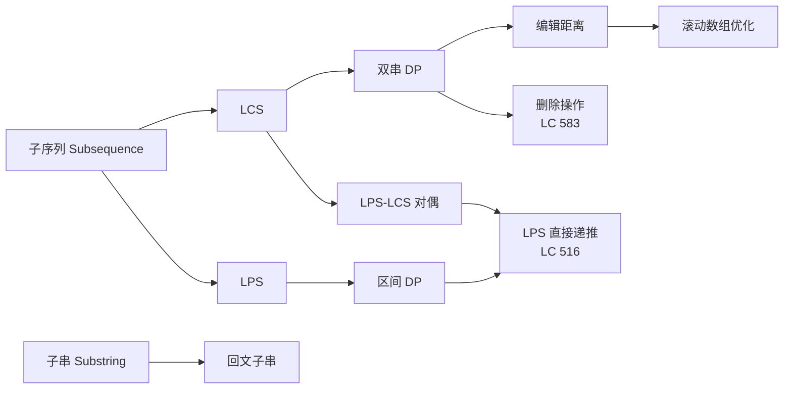

> 📊 **项目全面梳理**：详细的项目结构、模块详解和学习路径，请参阅 [`项目全面梳理-2025.md`](../../项目全面梳理-2025.md)

## 字符串动态规划 / String Dynamic Programming

### 摘要 / Executive Summary

- 字符串动态规划是算法面试中**难度最高、区分度最强**的专题之一，核心问题包括最长公共子序列（LCS）、编辑距离（Levenshtein）、最长回文子序列（LPS）及其变体。本文从子序列与子串的形式化定义出发，建立双串 DP 的通用框架，并通过归纳法给出完整正确性证明。
- 通过 LeetCode 1143/72/516/583 四道经典题目，展示二维 DP 的状态设计、转移方程推导、空间优化技巧，以及与 `02-算法范式专题/08-动态规划.md` 的交叉引用。特别地，本文揭示了 LPS 与 LCS 之间的**对偶关系**，将区间 DP 转化为双串 DP 的等价视角。
- 本文包含双串 DP 通用框架的形式化描述、4 个 Mermaid 思维表征图与 5 道自测问题。

### 关键术语与符号 / Glossary

| 术语 / Term | 定义 / Definition |
|-------------|-------------------|
| 子序列 Subsequence | 通过删除零个或多个字符得到的序列，不要求连续 |
| 子串 Substring | 字符串中连续的字符序列 |
| 最长公共子序列 LCS | 两个字符串的最长公共子序列的长度 |
| 编辑距离 Edit Distance | 将一个字符串转换为另一个所需的最少单字符插入/删除/替换操作数 |
| 最长回文子序列 LPS | 字符串的最长回文子序列的长度 |
| 双串 DP Two-String DP | 状态由两个字符串的前缀共同定义的动态规划框架 |
| 滚动数组 Rolling Array | 利用状态覆盖关系将 DP 数组降维以优化空间 |
| 最优子结构 Optimal Substructure | 问题的最优解包含其子问题的最优解 |
| 对偶关系 Duality | LPS(s) = LCS(s, reverse(s)) 的等价转换 |

术语对齐与引用规范：`docs/术语与符号总表.md`，`01-基础理论/00-撰写规范与引用指南.md`

### 目录 / Table of Contents

- [字符串动态规划 / String Dynamic Programming](#字符串动态规划--string-dynamic-programming)
  - [摘要 / Executive Summary](#摘要--executive-summary)
  - [关键术语与符号 / Glossary](#关键术语与符号--glossary)
  - [目录 / Table of Contents](#目录--table-of-contents)
  - [交叉引用与依赖 / Cross-References and Dependencies](#交叉引用与依赖--cross-references-and-dependencies)
- [1. 形式化定义 / Formal Definitions](#1-形式化定义--formal-definitions)
  - [1.1 子序列与子串](#11-子序列与子串)
  - [1.2 编辑距离](#12-编辑距离)
  - [1.3 回文](#13-回文)
- [2. 核心思路与算法框架](#2-核心思路与算法框架)
  - [2.1 双串 DP 通用框架](#21-双串-dp-通用框架)
  - [2.2 滚动数组优化](#22-滚动数组优化)
  - [2.3 LPS 与 LCS 的对偶关系](#23-lps-与-lcs-的对偶关系)
- [3. 经典题目详解](#3-经典题目详解)
  - [3.1 LeetCode 1143 — 最长公共子序列](#31-leetcode-1143--最长公共子序列)
    - [形式化规约 / Formal Specification](#形式化规约--formal-specification)
    - [核心思路 / Core Idea](#核心思路--core-idea)
    - [代码实现 / Code Implementations](#代码实现--code-implementations)
    - [复杂度分析 / Complexity Analysis](#复杂度分析--complexity-analysis)
    - [正确性证明 / Correctness Proof](#正确性证明--correctness-proof)
  - [3.2 LeetCode 72 — 编辑距离](#32-leetcode-72--编辑距离)
    - [形式化规约 / Formal Specification](#形式化规约--formal-specification-1)
    - [核心思路 / Core Idea](#核心思路--core-idea-1)
    - [代码实现 / Code Implementations](#代码实现--code-implementations-1)
    - [复杂度分析 / Complexity Analysis](#复杂度分析--complexity-analysis-1)
    - [正确性证明 / Correctness Proof](#正确性证明--correctness-proof-1)
  - [3.3 LeetCode 516 — 最长回文子序列](#33-leetcode-516--最长回文子序列)
    - [形式化规约 / Formal Specification](#形式化规约--formal-specification-2)
    - [核心思路 / Core Idea](#核心思路--core-idea-2)
    - [代码实现 / Code Implementations](#代码实现--code-implementations-2)
    - [复杂度分析 / Complexity Analysis](#复杂度分析--complexity-analysis-2)
    - [正确性证明 / Correctness Proof](#正确性证明--correctness-proof-2)
  - [3.4 LeetCode 583 — 两个字符串的删除操作](#34-leetcode-583--两个字符串的删除操作)
    - [形式化规约 / Formal Specification](#形式化规约--formal-specification-3)
    - [核心思路 / Core Idea](#核心思路--core-idea-3)
    - [代码实现 / Code Implementations](#代码实现--code-implementations-3)
    - [复杂度分析 / Complexity Analysis](#复杂度分析--complexity-analysis-3)
    - [正确性证明 / Correctness Proof](#正确性证明--correctness-proof-3)
- [4. 复杂度分析体系](#4-复杂度分析体系)
  - [4.1 双串 DP 复杂度汇总](#41-双串-dp-复杂度汇总)
  - [4.2 路径重建的代价](#42-路径重建的代价)
- [5. 正确性证明框架](#5-正确性证明框架)
  - [5.1 双串 DP 的通用正确性](#51-双串-dp-的通用正确性)
  - [5.2 证明树](#52-证明树)
- [6. 思维表征](#6-思维表征)
  - [6.1 概念依赖图](#61-概念依赖图)
  - [6.2 算法选择决策树](#62-算法选择决策树)
  - [6.3 双串 DP 状态转移对比矩阵](#63-双串-dp-状态转移对比矩阵)
- [7. 常见错误与反模式](#7-常见错误与反模式)
  - [7.1 DP 下标偏移错误](#71-dp-下标偏移错误)
  - [7.2 滚动数组覆盖错误](#72-滚动数组覆盖错误)
  - [7.3 LPS 区间 DP 的边界条件](#73-lps-区间-dp-的边界条件)
  - [7.4 忽略对偶关系导致重复实现](#74-忽略对偶关系导致重复实现)
- [8. 自测问题](#8-自测问题)
  - [问题 1：LCS 与最长公共子串的区别](#问题-1lcs-与最长公共子串的区别)
  - [问题 2：编辑距离三种操作的冗余性](#问题-2编辑距离三种操作的冗余性)
  - [问题 3：滚动数组优化的适用范围](#问题-3滚动数组优化的适用范围)
  - [问题 4：LPS 的区间 DP 为何按长度递增遍历](#问题-4lps-的区间-dp-为何按长度递增遍历)
  - [问题 5：双串 DP 与区间 DP 的转化](#问题-5双串-dp-与区间-dp-的转化)
- [9. 学习目标](#9-学习目标)
- [10. 知识导航](#10-知识导航)
- [参考文献](#参考文献)

### 交叉引用与依赖 / Cross-References and Dependencies

**上游理论依赖 / Upstream Dependencies**:

- [`02-算法范式专题/08-动态规划.md`](../02-算法范式专题/08-动态规划.md) — DP 问题实例的四元组定义、最优子结构、重叠子问题与无后效性
- [`09-算法理论/01-算法基础/06-动态规划理论.md`](../../09-算法理论/01-算法基础/06-动态规划理论.md) — DP 状态建模与优化技巧
- [`04-算法复杂度/02-空间复杂度.md`](../../04-算法复杂度/02-空间复杂度.md) — 空间复杂度分析与滚动数组优化

**下游应用 / Downstream Applications**:

- `13-LeetCode算法面试专题/04-字符串专题/02-回文问题.md` — 回文子串与 LPS 的关系
- `13-LeetCode算法面试专题/06-面试专题/03-高频Top100-DP与贪心.md` — DP 高频题汇总

---

## 1. 形式化定义 / Formal Definitions

### 1.1 子序列与子串

**定义 1.1** (子序列 / Subsequence)
设字符串 $s = s_0 s_1 \dots s_{n-1}$。字符串 $t$ 是 $s$ 的**子序列**，若存在严格递增的索引序列 $i_0 < i_1 < \dots < i_{m-1}$ 使得 $t_j = s_{i_j}$ 对所有 $j \in [0, m-1]$ 成立。

**定义 1.2** (子串 / Substring)
字符串 $t$ 是 $s$ 的**子串**，若存在索引 $i, j$（$0 \leq i \leq j < n$）使得 $t = s_i s_{i+1} \dots s_j$。子串是连续的子序列。

**定义 1.3** (最长公共子序列 / LCS)
给定字符串 $s_1$ 和 $s_2$，其**最长公共子序列**的长度定义为：

$$
\text{LCS}(s_1, s_2) = \max \{ |t| \mid t \text{ 是 } s_1 \text{ 的子序列且是 } s_2 \text{ 的子序列} \}
$$

### 1.2 编辑距离

**定义 1.4** (编辑操作 / Edit Operation)
对字符串的单字符编辑操作包括：

- **插入（Insert）**: 在任意位置插入一个字符
- **删除（Delete）**: 删除任意位置的一个字符
- **替换（Replace）**: 将任意位置的一个字符替换为另一个字符

**定义 1.5** (Levenshtein 距离 / Edit Distance)
字符串 $s_1$ 与 $s_2$ 的**编辑距离** $d(s_1, s_2)$ 定义为将 $s_1$ 转换为 $s_2$ 所需的最少编辑操作数。

**性质**: 编辑距离满足度量空间的三条公理：

1. $d(s_1, s_2) = 0 \iff s_1 = s_2$（正定性）
2. $d(s_1, s_2) = d(s_2, s_1)$（对称性）
3. $d(s_1, s_3) \leq d(s_1, s_2) + d(s_2, s_3)$（三角不等式）

### 1.3 回文

**定义 1.6** (回文 / Palindrome)
字符串 $s$ 称为**回文**，若 $s = s^R$，其中 $s^R$ 表示 $s$ 的反转。

**定义 1.7** (最长回文子序列 / LPS)
字符串 $s$ 的**最长回文子序列**长度定义为：

$$
\text{LPS}(s) = \max \{ |t| \mid t \text{ 是 } s \text{ 的子序列且 } t = t^R \}
$$

**定理 1.8** (LPS-LCS 对偶性)
对任意字符串 $s$：

$$
\text{LPS}(s) = \text{LCS}(s, s^R)
$$

*证明*:

- **充分性**：设 $t$ 是 $s$ 的最长回文子序列。则 $t$ 是 $s$ 的子序列，且 $t = t^R$ 是 $s^R$ 的子序列。因此 $t$ 是 $s$ 与 $s^R$ 的公共子序列，$|t| \leq \text{LCS}(s, s^R)$。
- **必要性**：设 $t$ 是 $s$ 与 $s^R$ 的最长公共子序列。设 $t$ 在 $s$ 中的索引为 $i_1 < i_2 < \dots < i_k$，在 $s^R$ 中的索引为 $j_1 < j_2 < \dots < j_k$。由于 $s^R$ 是 $s$ 的反转，$j_1 < j_2 < \dots < j_k$ 在 $s$ 中对应 $n-1-j_1 > n-1-j_2 > \dots > n-1-j_k$。由子序列定义，$t$ 在 $s$ 中从左到右读出为 $t$，从右到左读出也为 $t$，故 $t$ 为回文。因此 $|t| \leq \text{LPS}(s)$。

综上，$\text{LPS}(s) = \text{LCS}(s, s^R)$。证毕。$\square$

---

## 2. 核心思路与算法框架

### 2.1 双串 DP 通用框架

**状态定义**: 设 $dp[i][j]$ 为处理 $s_1[0..i-1]$ 和 $s_2[0..j-1]$ 这两个前缀时的最优值。

**初始化**: 通常 $dp[0][j]$ 和 $dp[i][0]$ 对应某个空串的边界情况。

**状态转移**: 考虑 $s_1[i-1]$ 与 $s_2[j-1]$ 的关系：

```text
if s1[i-1] == s2[j-1]:
    dp[i][j] = f_match(dp[i-1][j-1])
else:
    dp[i][j] = g_mismatch(dp[i-1][j], dp[i][j-1], dp[i-1][j-1])
```

其中 $f_{match}$ 和 $g_{mismatch}$ 的具体形式取决于问题：

| 问题 | $f_{match}$ | $g_{mismatch}$ |
|------|------------|---------------|
| LCS | $dp[i-1][j-1] + 1$ | $\max(dp[i-1][j], dp[i][j-1])$ |
| 编辑距离 | $dp[i-1][j-1]$ | $1 + \min(dp[i-1][j], dp[i][j-1], dp[i-1][j-1])$ |

### 2.2 滚动数组优化

**观察**: 在双串 DP 中，$dp[i][j]$ 仅依赖于第 $i-1$ 行和第 $i$ 行的值。因此可以用两行数组交替使用，将空间从 $O(m \cdot n)$ 优化至 $O(\min(m, n))$。

**进一步优化**: 若只需要最终值而非完整路径，甚至可以用单行数组配合一个变量保存左上角值。

### 2.3 LPS 与 LCS 的对偶关系

利用定理 1.8，LPS 问题可转化为 LCS 问题：

$$
\text{LPS}(s) = \text{LCS}(s, \text{reverse}(s))
$$

此方法将区间 DP（通常 $O(n^2)$ 空间）转化为双串 DP，空间优化更直接。

---

## 3. 经典题目详解

### 3.1 LeetCode 1143 — 最长公共子序列

> **题目链接 / Problem Link**: [LeetCode 1143. Longest Common Subsequence](https://leetcode.com/problems/longest-common-subsequence/)
> **难度 / Difficulty**: Medium

#### 形式化规约 / Formal Specification

**输入**: 字符串 $text1$（长度 $m$），字符串 $text2$（长度 $n$）
**输出**: $text1$ 与 $text2$ 的最长公共子序列的长度

**后置条件 / Postcondition**:

$$
\text{result} = \max \{ |t| \mid t \text{ 是 } text1 \text{ 和 } text2 \text{ 的公共子序列} \}
$$

#### 核心思路 / Core Idea

**状态设计**: $dp[i][j]$ 表示 $text1[0..i-1]$ 与 $text2[0..j-1]$ 的 LCS 长度。

**状态转移**:

- 若 $text1[i-1] = text2[j-1]$：该字符可作为公共子序列的最后一个字符，$dp[i][j] = dp[i-1][j-1] + 1$；
- 否则：$dp[i][j] = \max(dp[i-1][j], dp[i][j-1])$。

**边界条件**: $dp[0][j] = dp[i][0] = 0$（空串与任何串的 LCS 为 0）。

#### 代码实现 / Code Implementations

- **Rust**: [`examples/algorithms/src/leetcode/lc1143_longest_common_subsequence.rs`](../../../../examples/algorithms/src/leetcode/lc1143_longest_common_subsequence.rs)
- **Python**: [`examples/algorithms-python/src/leetcode/lc1143_longest_common_subsequence.py`](../../../../examples/algorithms-python/src/leetcode/lc1143_longest_common_subsequence.py)
- **Go**: [`examples/algorithms-go/leetcode/lc1143_longest_common_subsequence.go`](../../../../examples/algorithms-go/leetcode/lc1143_longest_common_subsequence.go)

#### 复杂度分析 / Complexity Analysis

| 指标 / Metric | 值 / Value | 说明 / Note |
|--------------|-----------|------------|
| 时间复杂度 / Time | $O(m \cdot n)$ | 填充 $m \times n$ 的 DP 表 |
| 空间复杂度 / Space | $O(m \cdot n)$ | 完整二维 DP 表 |
| 滚动数组优化 | $O(m \cdot n)$ | 时间不变 |
| 滚动数组空间 | $O(\min(m,n))$ | 仅保留两行 |

#### 正确性证明 / Correctness Proof

**定理 3.1.1** (LCS DP 正确性): 算法计算出的 $dp[m][n]$ 等于 $text1$ 与 $text2$ 的 LCS 长度。

**证明**: 对 $i + j$ 进行归纳。

**基例**: $i = 0$ 或 $j = 0$ 时，$dp[i][j] = 0$，空串与任何串的 LCS 长度为 0，正确。

**归纳假设**: 对所有 $i' + j' < i + j$，$dp[i'][j']$ 正确。

**归纳步**: 考虑 $dp[i][j]$。

**情况 1**: $text1[i-1] = text2[j-1] = c$。设 $text1[0..i-1]$ 与 $text2[0..j-1]$ 的某个 LCS 为 $t$。

- 若 $t$ 以 $c$ 结尾，则 $t = t' \cdot c$，其中 $t'$ 是 $text1[0..i-2]$ 与 $text2[0..j-2]$ 的 LCS。由归纳假设，$|t'| = dp[i-1][j-1]$，故 $|t| = dp[i-1][j-1] + 1$。
- 若 $t$ 不以 $c$ 结尾，则 $t$ 也是 $text1[0..i-2]$ 与 $text2[0..j-1]$ 的公共子序列，或 $text1[0..i-1]$ 与 $text2[0..j-2]$ 的公共子序列。其长度 $\leq \max(dp[i-1][j], dp[i][j-1]) = dp[i-1][j-1]$（因为 $dp[i-1][j-1] + 1$ 已更大）。

因此 $dp[i][j] = dp[i-1][j-1] + 1$ 正确。

**情况 2**: $text1[i-1] \neq text2[j-1]$。此时任何公共子序列不能同时以这两个字符结尾。因此 LCS 要么是 $text1[0..i-2]$ 与 $text2[0..j-1]$ 的 LCS，要么是 $text1[0..i-1]$ 与 $text2[0..j-2]$ 的 LCS，取二者最大值。由归纳假设，$dp[i][j] = \max(dp[i-1][j], dp[i][j-1])$ 正确。

证毕。$\square$

---

### 3.2 LeetCode 72 — 编辑距离

> **题目链接 / Problem Link**: [LeetCode 72. Edit Distance](https://leetcode.com/problems/edit-distance/)
> **难度 / Difficulty**: Hard

#### 形式化规约 / Formal Specification

**输入**: 字符串 $word1$（长度 $m$），字符串 $word2$（长度 $n$）
**输出**: 将 $word1$ 转换为 $word2$ 的最少编辑操作数

**后置条件 / Postcondition**:

$$
\text{result} = d(word1, word2)
$$

其中 $d$ 为 Levenshtein 距离。

#### 核心思路 / Core Idea

**状态设计**: $dp[i][j]$ 表示将 $word1[0..i-1]$ 转换为 $word2[0..j-1]$ 的最少操作数。

**状态转移**: 考虑最后一个字符的处理方式：

- 若 $word1[i-1] = word2[j-1]$：无需操作，$dp[i][j] = dp[i-1][j-1]$；
- 否则：取以下三种操作的最小值 + 1：
  - 删除 $word1[i-1]$：$dp[i-1][j] + 1$
  - 插入 $word2[j-1]$（等价于删除 $word2[j-1]$ 的逆操作）：$dp[i][j-1] + 1$
  - 替换 $word1[i-1]$ 为 $word2[j-1]$：$dp[i-1][j-1] + 1$

**边界条件**: $dp[i][0] = i$（删除 $i$ 个字符），$dp[0][j] = j$（插入 $j$ 个字符）。

#### 代码实现 / Code Implementations

- **Rust**: [`examples/algorithms/src/leetcode/lc0072_edit_distance.rs`](../../../../examples/algorithms/src/leetcode/lc0072_edit_distance.rs)
- **Python**: [`examples/algorithms-python/src/leetcode/lc0072_edit_distance.py`](../../../../examples/algorithms-python/src/leetcode/lc0072_edit_distance.py)
- **Go**: [`examples/algorithms-go/leetcode/lc0072_edit_distance.go`](../../../../examples/algorithms-go/leetcode/lc0072_edit_distance.go)

#### 复杂度分析 / Complexity Analysis

| 指标 / Metric | 值 / Value | 说明 / Note |
|--------------|-----------|------------|
| 时间复杂度 / Time | $O(m \cdot n)$ | 填充 $m \times n$ 的 DP 表 |
| 空间复杂度 / Space | $O(m \cdot n)$ | 完整二维 DP 表 |
| 滚动数组空间 | $O(\min(m,n))$ | 仅保留两行 |

#### 正确性证明 / Correctness Proof

**定理 3.2.1** (编辑距离 DP 正确性): 算法计算出的 $dp[m][n]$ 等于将 $word1$ 转换为 $word2$ 的最少编辑操作数。

**证明**: 对 $i + j$ 进行归纳。

**基例**: $dp[i][0] = i$（删除 $i$ 次），$dp[0][j] = j$（插入 $j$ 次），显然最优。

**归纳假设**: 对所有 $i' + j' < i + j$，$dp[i'][j']$ 正确。

**归纳步**: 考虑将 $word1[0..i-1]$ 转换为 $word2[0..j-1]$ 的最优操作序列的最后一步。

**情况 1**: $word1[i-1] = word2[j-1]$。若最优序列的最后一步不涉及这两个字符，则可以直接继承 $dp[i-1][j-1]$。若最后一步涉及它们（例如先删除再插入相同的字符），则该序列可以被缩短（删除多余的冗余操作），因此最优序列的代价就是 $dp[i-1][j-1]$。

**情况 2**: $word1[i-1] \neq word2[j-1]$。最优序列的最后一步必为以下三种之一：

- **删除** $word1[i-1]$：前面需要将 $word1[0..i-2]$ 转为 $word2[0..j-1]$，代价 $dp[i-1][j] + 1$；
- **插入** $word2[j-1]$：前面需要将 $word1[0..i-1]$ 转为 $word2[0..j-2]$，代价 $dp[i][j-1] + 1$；
- **替换** $word1[i-1]$ 为 $word2[j-1]$：前面需要将 $word1[0..i-2]$ 转为 $word2[0..j-2]$，代价 $dp[i-1][j-1] + 1$。

最优解取三者最小值。由归纳假设，各子问题最优，故 $dp[i][j]$ 最优。证毕。$\square$

---

### 3.3 LeetCode 516 — 最长回文子序列

> **题目链接 / Problem Link**: [LeetCode 516. Longest Palindromic Subsequence](https://leetcode.com/problems/longest-palindromic-subsequence/)
> **难度 / Difficulty**: Medium

#### 形式化规约 / Formal Specification

**输入**: 字符串 $s$（长度 $n$）
**输出**: $s$ 的最长回文子序列的长度

**后置条件 / Postcondition**:

$$
\text{result} = \max \{ |t| \mid t \text{ 是 } s \text{ 的子序列且 } t = t^R \}
$$

#### 核心思路 / Core Idea

**解法 A — 区间 DP**：设 $dp[i][j]$ 为 $s[i..j]$ 的 LPS 长度。

- 若 $s[i] = s[j]$：$dp[i][j] = dp[i+1][j-1] + 2$（两端字符可同时加入回文）；
- 否则：$dp[i][j] = \max(dp[i+1][j], dp[i][j-1])$。

**解法 B — LCS 对偶**：由定理 1.8，$\text{LPS}(s) = \text{LCS}(s, s^R)$。直接套用 LCS 的双串 DP 框架。

#### 代码实现 / Code Implementations

- **Rust**: [`examples/algorithms/src/leetcode/lc0516_longest_palindromic_subsequence.rs`](../../../../examples/algorithms/src/leetcode/lc0516_longest_palindromic_subsequence.rs)
- **Python**: [`examples/algorithms-python/src/leetcode/lc0516_longest_palindromic_subsequence.py`](../../../../examples/algorithms-python/src/leetcode/lc0516_longest_palindromic_subsequence.py)
- **Go**: [`examples/algorithms-go/leetcode/lc0516_longest_palindromic_subsequence.go`](../../../../examples/algorithms-go/leetcode/lc0516_longest_palindromic_subsequence.go)

#### 复杂度分析 / Complexity Analysis

| 解法 / Solution | 时间复杂度 / Time | 空间复杂度 / Space | 说明 / Note |
|----------------|------------------|-------------------|------------|
| 区间 DP | $O(n^2)$ | $O(n^2)$ | 按区间长度递增填充 |
| LCS 对偶 | $O(n^2)$ | $O(n^2)$ | 转化为双串 DP |
| LCS 滚动数组 | $O(n^2)$ | $O(n)$ | 空间优化 |

#### 正确性证明 / Correctness Proof

**定理 3.3.1** (区间 DP 正确性): 区间 DP 计算出的 $dp[0][n-1]$ 等于 $s$ 的 LPS 长度。

**证明**: 对区间长度 $l = j - i + 1$ 进行归纳。

**基例**: $l = 1$ 时，$dp[i][i] = 1$，单个字符本身就是回文，正确。

**归纳假设**: 对所有长度 $< l$ 的区间，$dp[i][j]$ 正确。

**归纳步**: 考虑区间 $s[i..j]$（长度 $l$）。

**情况 1**: $s[i] = s[j]$。任何 $s[i..j]$ 的回文子序列要么同时包含 $s[i]$ 和 $s[j]$（此时中间部分为 $s[i+1..j-1]$ 的回文子序列），要么不同时包含二者（此时其长度 $\leq dp[i+1][j-1] + 2$ 的替代方案）。因此最优长度为 $dp[i+1][j-1] + 2$。

**情况 2**: $s[i] \neq s[j]$。回文子序列不能同时以 $s[i]$ 和 $s[j]$ 作为两端（因为回文要求两端字符相等）。因此最优回文子序列要么在 $s[i+1..j]$ 中，要么在 $s[i..j-1]$ 中，取二者最大值。

证毕。$\square$

---

### 3.4 LeetCode 583 — 两个字符串的删除操作

> **题目链接 / Problem Link**: [LeetCode 583. Delete Operation for Two Strings](https://leetcode.com/problems/delete-operation-for-two-strings/)
> **难度 / Difficulty**: Medium

#### 形式化规约 / Formal Specification

**输入**: 字符串 $word1$（长度 $m$），字符串 $word2$（长度 $n$）
**输出**: 使 $word1$ 和 $word2$ 相等所需的最少总删除次数

**后置条件 / Postcondition**:

$$
\text{result} = \min \{ d_1 + d_2 \mid \text{delete}(word1, d_1) = \text{delete}(word2, d_2) \}
$$

#### 核心思路 / Core Idea

**关键洞察**: 使两字符串相等，等价于保留它们的一个**最长公共子序列**，删除其余所有字符。

设 $l = \text{LCS}(word1, word2)$，则需要从 $word1$ 删除 $m - l$ 个字符，从 $word2$ 删除 $n - l$ 个字符。总删除次数为：

$$
(m - l) + (n - l) = m + n - 2 \cdot \text{LCS}(word1, word2)
$$

因此本题是 LCS 的直接变体。

#### 代码实现 / Code Implementations

- **Rust**: [`examples/algorithms/src/leetcode/lc0583_delete_operation_for_two_strings.rs`](../../../../examples/algorithms/src/leetcode/lc0583_delete_operation_for_two_strings.rs)
- **Python**: [`examples/algorithms-python/src/leetcode/lc0583_delete_operation_for_two_strings.py`](../../../../examples/algorithms-python/src/leetcode/lc0583_delete_operation_for_two_strings.py)
- **Go**: [`examples/algorithms-go/leetcode/lc0583_delete_operation_for_two_strings.go`](../../../../examples/algorithms-go/leetcode/lc0583_delete_operation_for_two_strings.go)

#### 复杂度分析 / Complexity Analysis

| 指标 / Metric | 值 / Value |
|--------------|-----------|
| 时间复杂度 / Time | $O(m \cdot n)$ | 计算 LCS |
| 空间复杂度 / Space | $O(m \cdot n)$ 或 $O(\min(m,n))$ | 视优化而定 |

#### 正确性证明 / Correctness Proof

**定理 3.4.1** (删除操作与 LCS 的关系): 最少总删除次数等于 $m + n - 2 \cdot \text{LCS}(word1, word2)$。

**证明**:

- **下界**: 任何使两串相等的方案都保留了某个公共子序列 $t$。设 $|t| = l$，则至少删除了 $m - l + n - l = m + n - 2l$ 个字符。由于 $l \leq \text{LCS}$，删除次数 $\geq m + n - 2 \cdot \text{LCS}$。
- **上界**: 取 $t$ 为一个最长公共子序列（$|t| = \text{LCS}$）。删除 $word1$ 中不在 $t$ 中的字符（$m - \text{LCS}$ 个），删除 $word2$ 中不在 $t$ 中的字符（$n - \text{LCS}$ 个），两串均变为 $t$，总删除次数为 $m + n - 2 \cdot \text{LCS}$。

上下界相等，证毕。$\square$

---

## 4. 复杂度分析体系

### 4.1 双串 DP 复杂度汇总

| 问题 | 时间 | 空间 | 滚动数组空间 | 路径重建空间 |
|------|------|------|-----------|-----------|
| LCS | $O(mn)$ | $O(mn)$ | $O(\min(m,n))$ | $O(mn)$ |
| 编辑距离 | $O(mn)$ | $O(mn)$ | $O(\min(m,n))$ | $O(mn)$ |
| LPS（区间 DP） | $O(n^2)$ | $O(n^2)$ | $O(n)$ | $O(n^2)$ |
| LPS（LCS 对偶） | $O(n^2)$ | $O(n^2)$ | $O(n)$ | $O(n^2)$ |
| 删除操作 | $O(mn)$ | $O(mn)$ | $O(\min(m,n))$ | — |

### 4.2 路径重建的代价

若需要**输出具体的子序列/编辑序列**而不仅仅是长度，则必须保留完整的 DP 表（或至少保留方向信息），空间复杂度无法优化至 $O(\min(m,n))$。

---

## 5. 正确性证明框架

### 5.1 双串 DP 的通用正确性

**定理 5.1** (双串 DP 最优子结构)
设 $dp[i][j]$ 按通用框架定义，则 $dp[i][j]$ 等于对应子问题的最优值。

**证明框架**: 对 $i + j$（或区间长度）进行归纳。分两种情况讨论最后一个字符是否匹配，证明最优解必由子问题最优解构造而来。$\square$

### 5.2 证明树

```mermaid
flowchart TD
    A[定义: 子序列 / 子串] --> B[LCS 问题]
    B --> C[双串 DP 框架]
    C --> D[定理 3.1.1: LCS 正确性]
    C --> E[定理 3.2.1: 编辑距离正确性]
    F[定义: 编辑操作] --> E
    G[定理 1.8: LPS-LCS 对偶性] --> H[定理 3.3.1: LPS 正确性]
    B --> G
    D --> I[定理 3.4.1: 删除操作 = LCS 变体]
    J[滚动数组优化] --> K[空间复杂度 O(min)]

    style D fill:#e1f5e1
    style E fill:#e1f5e1
    style H fill:#e1f5e1
    style I fill:#e1f5e1
```

---

## 6. 思维表征

### 6.1 概念依赖图



### 6.2 算法选择决策树

```mermaid
flowchart TD
    Start[字符串最优化问题？] --> Q1{优化目标？}
    Q1 -->|最长公共部分| A1[LCS DP]
    Q1 -->|最少编辑次数| A2[编辑距离 DP]
    Q1 -->|最长回文| Q2{需要子序列还是子串？}
    Q2 -->|子序列| A3[LPS = LCS(s, reverse(s))]
    Q2 -->|子串| A4[中心扩展 / Manacher]
    Q1 -->|使两串相等的最小删除| A5[LCS 变体]

    style A1 fill:#e1f5e1
    style A2 fill:#e1f5e1
    style A3 fill:#e1f5e1
    style A5 fill:#e1f5e1
```

### 6.3 双串 DP 状态转移对比矩阵

| 维度 / Dimension | LCS | 编辑距离 | LPS（区间 DP） |
|----------------|-----|---------|--------------|
| **状态定义** | $dp[i][j]$ = 前缀 LCS 长度 | $dp[i][j]$ = 最少操作数 | $dp[i][j]$ = 区间 LPS 长度 |
| **匹配转移** | $dp[i-1][j-1] + 1$ | $dp[i-1][j-1]$ | $dp[i+1][j-1] + 2$ |
| **不匹配转移** | $\max(dp[i-1][j], dp[i][j-1])$ | $1 + \min(删, 插, 替)$ | $\max(dp[i+1][j], dp[i][j-1])$ |
| **遍历顺序** | $i$ 从左到右, $j$ 从左到右 | $i$ 从左到右, $j$ 从左到右 | 区间长度从小到大 |
| **空间优化** | 滚动数组 $O(\min)$ | 滚动数组 $O(\min)$ | 需保留全表或按长度滚动 |

---

## 7. 常见错误与反模式

### 7.1 DP 下标偏移错误

**错误**: 混淆 $dp[i][j]$ 对应 $s_1[i]$ 还是 $s_1[i-1]$。

**正确做法**: 明确约定 $dp[i][j]$ 对应 $s_1[0..i-1]$ 和 $s_2[0..j-1]$。这样 $dp[0][j]$ 和 $dp[i][0]$ 对应空串，边界处理更自然。

### 7.2 滚动数组覆盖错误

**错误**: 在滚动数组优化中，内层循环方向错误导致覆盖了还需要使用的值。

**反模式**:

```python
# 错误：编辑距离的滚动数组需要从左到右
for j in range(n, -1, -1):   # ❌ 某些问题需要逆序
    dp[j] = ...
```

**正确做法**: LCS 和编辑距离的滚动数组内层循环均为从左到右。但某些问题（如 0/1 背包）需要逆序，需仔细分析依赖方向。

### 7.3 LPS 区间 DP 的边界条件

**错误**: 在区间 DP 中，$dp[i][i]$ 初始化为 0 而非 1。

**正确做法**: 单个字符的 LPS 长度为 1，$dp[i][i] = 1$。

### 7.4 忽略对偶关系导致重复实现

**错误**: 已经会写 LCS，但遇到 LPS 时从头写区间 DP，浪费时间和代码量。

**正确做法**: 利用 LPS-LCS 对偶性，直接调用 LCS 代码处理 $s$ 和 $s^R$。

---

## 8. 自测问题

### 问题 1：LCS 与最长公共子串的区别

**Q**: 最长公共子序列（LCS）与最长公共子串（Longest Common Substring）有何区别？

**A**: **LCS**要求字符的相对顺序一致，但不要求连续；**最长公共子串**要求字符不仅顺序一致，而且在原字符串中**连续**出现。最长公共子串的 DP 状态转移为：若 $s1[i-1] = s2[j-1]$，则 $dp[i][j] = dp[i-1][j-1] + 1$；否则 $dp[i][j] = 0$。最终答案是整个 DP 表中的最大值。

---

### 问题 2：编辑距离三种操作的冗余性

**Q**: 编辑距离定义中有插入、删除、替换三种操作。若只允许插入和删除，最多需要多少次操作？

**A**: 若只允许插入和删除，总操作次数为 $m + n - 2 \cdot \text{LCS}$（即 LC 583 的答案）。替换操作可以将“删除 + 插入”合并为一次操作，因此在允许替换时，编辑距离 $\leq m + n - 2 \cdot \text{LCS}$。具体地，$d(s_1, s_2) = m + n - 2 \cdot \text{LCS}$ 当没有替换操作可用时成立；允许替换时，编辑距离可能更小（例如 "abc" → "adc"，替换 1 次 vs 删除+插入 2 次）。

---

### 问题 3：滚动数组优化的适用范围

**Q**: 滚动数组优化能否用于需要重建路径的 DP 问题？

**A**: **不能**。滚动数组仅保留当前行（或两行）的 DP 值，丢弃了过去的状态信息。若需要重建具体的 LCS 序列或编辑操作序列，则必须保留完整的 DP 表（或至少保留每个状态的决策方向）。空间复杂度因此无法低于 $O(m \cdot n)$。

---

### 问题 4：LPS 的区间 DP 为何按长度递增遍历

**Q**: 在 LPS 的区间 DP 中，为什么要按照区间长度从小到大填充 DP 表？

**A**: 因为状态转移方程 $dp[i][j]$ 依赖于 $dp[i+1][j-1]$、$dp[i+1][j]$、$dp[i][j-1]$，这些状态的区间长度都严格小于当前区间长度 $j - i + 1$。按长度递增遍历保证了在计算 $dp[i][j]$ 时，所有依赖的子问题已经计算完毕。

---

### 问题 5：双串 DP 与区间 DP 的转化

**Q**: 什么情况下字符串 DP 应该用双串框架，什么情况下应该用区间框架？

**A**:

- **双串 DP**：问题涉及**两个独立字符串**之间的关系（如 LCS、编辑距离）。状态为两维，分别对应两个字符串的前缀长度。
- **区间 DP**：问题涉及**单个字符串**内部的子区间性质（如 LPS、最长回文子串、矩阵链乘法）。状态为区间的左右端点。
- **转化关系**：某些单串问题可以转化为双串问题（如 LPS = LCS(s, reverse(s))），从而复用双串 DP 的实现。

---

## 9. 学习目标

完成本章学习后，读者应能够：

1. **形式化定义**子序列、子串、编辑距离、LCS、LPS，并理解它们之间的逻辑关系。
2. **独立推导**双串 DP 的状态转移方程，包括 LCS、编辑距离及其变体。
3. **证明正确性**利用数学归纳法证明双串 DP 与区间 DP 的最优子结构性质。
4. **应用对偶关系**将 LPS 转化为 LCS 问题，减少代码实现复杂度。
5. **优化空间复杂度**熟练运用滚动数组将双串 DP 的空间从 $O(mn)$ 降至 $O(\min(m,n))$。
6. **避免常见陷阱**正确处理下标偏移、滚动数组方向、区间 DP 边界条件。

---

## 10. 知识导航

- [返回目录](../README.md)
- [上一章：02-回文问题](./02-回文问题.md)
- [上一章：00-字符串专题导论](./00-字符串专题导论.md)
- [02-算法范式专题/08-动态规划.md](../02-算法范式专题/08-动态规划.md)

---

## 参考文献

1. **T. H. Cormen et al.**, *Introduction to Algorithms*, 3rd ed., MIT Press, 2009. §15.4 (Longest Common Subsequence)
2. **V. I. Levenshtein**, "Binary Codes Capable of Correcting Deletions, Insertions, and Reversals", *Soviet Physics Doklady*, 10(8), 1966.
3. **D. Sankoff, J. B. Kruskal**, *Time Warps, String Edits, and Macromolecules: The Theory and Practice of Sequence Comparison*, Addison-Wesley, 1983.
4. **G. Navarro**, "A Guided Tour to Approximate String Matching", *ACM Computing Surveys*, 33(1), 2001.
