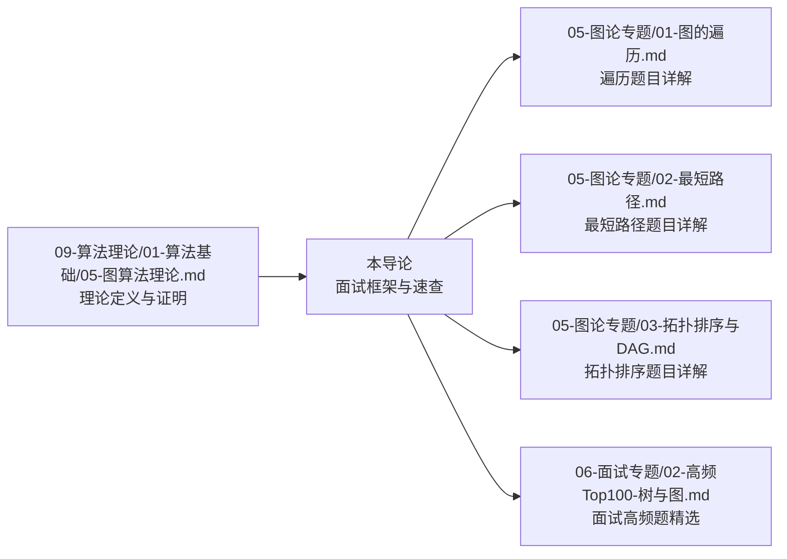
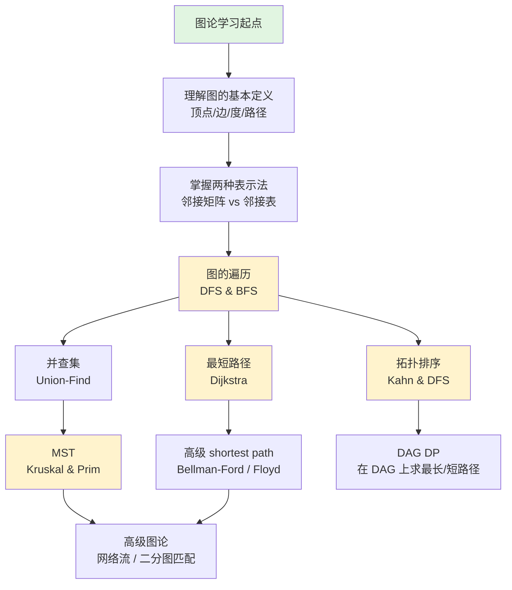

> 📊 **项目全面梳理**：详细的项目结构、模块详解和学习路径，请参阅 [`项目全面梳理-2025.md`](../../项目全面梳理-2025.md)

## 图论专题导论 / Graph Theory Introduction

### 摘要 / Executive Summary

- 图论是算法面试中区分度的核心模块，覆盖约 $15\%$–$20\%$ 的高频考点，尤其在后端、基础设施与 AI 工程岗位中权重显著。
- 本文从**图论在面试中的地位**出发，建立与理论文档的衔接，给出图论题目的五大分类框架（遍历/最短路径/拓扑排序/MST/网络流）与图的两种表示法的形式化定义。
- 提供复杂度速查表、学习路径图与面试备考策略，帮助读者建立系统化的图论知识体系。

### 关键术语与符号 / Glossary

| 术语 / Term | 定义 / Definition |
|-------------|-------------------|
| 图 Graph | 二元组 $G = (V, E)$，其中 $V$ 为顶点集，$E \subseteq V \times V$ 为边集 |
| 邻接矩阵 Adjacency Matrix | $n \times n$ 矩阵 $A$，其中 $A[i][j] = 1$（或权重）当且仅当 $(i,j) \in E$ |
| 邻接表 Adjacency List | 对每个顶点 $v \in V$ 维护其邻接顶点集合 $Adj[v] = \{u \mid (v,u) \in E\}$ |
| 连通分量 Connected Component | 极大连通子图，分量内任意两顶点间存在路径 |
| 拓扑排序 Topological Sort | 有向无环图（DAG）顶点的线性排序，使得对每条边 $(u,v)$ 都有 $u$ 在 $v$ 之前 |
| 生成树 Spanning Tree | 包含图中所有顶点的无环连通子图 |
| MST (Minimum Spanning Tree) | 边权之和最小的生成树 |
| 网络流 Network Flow | 带容量限制的有向图中从源点到汇点的最大传输量 |

术语对齐与引用规范：`docs/术语与符号总表.md`，`01-基础理论/00-撰写规范与引用指南.md`

### 目录 / Table of Contents

- [图论专题导论 / Graph Theory Introduction](#图论专题导论--graph-theory-introduction)
  - [摘要 / Executive Summary](#摘要--executive-summary)
  - [关键术语与符号 / Glossary](#关键术语与符号--glossary)
  - [目录 / Table of Contents](#目录--table-of-contents)
  - [交叉引用与依赖 / Cross-References and Dependencies](#交叉引用与依赖--cross-references-and-dependencies)
- [1. 图论在面试中的地位](#1-图论在面试中的地位)
- [2. 与理论文档的衔接](#2-与理论文档的衔接)
- [3. 图论题目分类框架](#3-图论题目分类框架)
  - [3.1 图的遍历 (Graph Traversal)](#31-图的遍历-graph-traversal)
  - [3.2 最短路径 (Shortest Path)](#32-最短路径-shortest-path)
  - [3.3 拓扑排序 (Topological Sort)](#33-拓扑排序-topological-sort)
  - [3.4 最小生成树 (MST)](#34-最小生成树-mst)
  - [3.5 网络流与高级主题 (Network Flow \& Advanced)](#35-网络流与高级主题-network-flow--advanced)
- [4. 图的表示法形式化](#4-图的表示法形式化)
  - [4.1 邻接矩阵 (Adjacency Matrix)](#41-邻接矩阵-adjacency-matrix)
  - [4.2 邻接表 (Adjacency List)](#42-邻接表-adjacency-list)
  - [4.3 对比与选择](#43-对比与选择)
- [5. 复杂度速查表](#5-复杂度速查表)
  - [5.1 图遍历算法](#51-图遍历算法)
  - [5.2 最短路径算法](#52-最短路径算法)
  - [5.3 生成树与拓扑排序](#53-生成树与拓扑排序)
- [6. 学习路径图](#6-学习路径图)
- [7. 面试备考策略](#7-面试备考策略)
  - [7.1 图论问题的解题流程](#71-图论问题的解题流程)
  - [7.2 常见面试追问](#72-常见面试追问)
- [8. 自测问题 / Self-Assessment Questions](#8-自测问题--self-assessment-questions)
  - [问题 1：表示法选择](#问题-1表示法选择)
  - [问题 2：Dijkstra 的局限性](#问题-2dijkstra-的局限性)
  - [问题 3：拓扑排序的存在性](#问题-3拓扑排序的存在性)
  - [问题 4：并查集的路径压缩](#问题-4并查集的路径压缩)
- [参考文献 / References](#参考文献--references)
- [9. 学习目标](#9-学习目标)

### 交叉引用与依赖 / Cross-References and Dependencies

**上游理论依赖 / Upstream Dependencies**:

- [`09-算法理论/01-算法基础/05-图算法理论.md`](../../09-算法理论/01-算法基础/05-图算法理论.md) — 图的基本定义、性质与遍历算法的理论分析
- `09-算法理论/03-搜索算法/01-深度优先搜索.md` — DFS 的理论定义与复杂度
- `09-算法理论/03-搜索算法/03-广度优先搜索.md` — BFS 的理论定义与最短路径性质
- [`04-算法复杂度/01-时间复杂度.md`](../../04-算法复杂度/01-时间复杂度.md) — 时间复杂度形式化定义

**下游应用 / Downstream Applications**:

- `13-LeetCode算法面试专题/05-图论专题/01-图的遍历.md` — DFS/BFS 在 LeetCode 中的应用
- `13-LeetCode算法面试专题/05-图论专题/02-最短路径.md` — Dijkstra、Bellman-Ford、Floyd 算法详解
- `13-LeetCode算法面试专题/05-图论专题/03-拓扑排序与DAG.md` — 拓扑排序题目专题
- `13-LeetCode算法面试专题/06-面试专题/02-高频Top100-树与图.md` — 面试高频图论题目精选

---

## 1. 图论在面试中的地位

图论算法在面试中的分布呈现**"基础必考、进阶区分"**的特点：

| 岗位类型 | 图论考察频率 | 重点方向 |
|---------|------------|---------|
| 后端开发 | ★★★★☆ | 拓扑排序、并查集、最短路径 |
| 基础设施/SRE | ★★★★★ | 网络流、MST、强连通分量 |
| 算法/AI 工程 | ★★★★☆ | 图遍历、DAG、动态规划在图上的应用 |
| 前端开发 | ★★☆☆☆ | 基础遍历（依赖分析场景） |

**核心洞察**: 图论题目往往不直接给出"图"的显式描述，而是以**隐式图**的形式出现：

- 课程先修关系 → 有向图 + 拓扑排序
- 社交网络好友关系 → 无向图 + 连通分量
- 地图导航 → 带权图 + 最短路径
- 任务调度约束 → DAG + 关键路径

识别问题中的图结构是解题的第一步。

---

## 2. 与理论文档的衔接

本文档定位为**面试应用导论**，与理论文档的分工如下：



**理论文档提供**：

- 图的基本公理系统（顶点、边、度、路径、环的严格定义）
- 遍历算法的正确性证明（DFS 的括号定理、BFS 的最短路径性质）
- 复杂度下界分析（基于决策树或线性代数）

**本文档提供**：

- 面试题目分类框架与识别方法
- 复杂度速查表（面向快速决策）
- 学习路径与备考策略
- 与 LeetCode 题目的直接映射

---

## 3. 图论题目分类框架

面试中的图论题目可分为五大类：

### 3.1 图的遍历 (Graph Traversal)

**代表题目**: LC 200 岛屿数量, LC 133 克隆图, LC 547 省份数量

**核心算法**: DFS, BFS, 并查集 (Union-Find)

**识别特征**: "连通"、"区域"、"朋友圈"、"网络"

**复杂度特征**: $O(V + E)$ 时间，$O(V)$ 空间（访问标记 + 递归栈/队列）

### 3.2 最短路径 (Shortest Path)

**代表题目**: LC 743 网络延迟时间, LC 787 K站中转内最便宜的航班

**核心算法**:

- Dijkstra（非负权单源，$O((V+E) \log V)$）
- Bellman-Ford（含负权，$O(VE)$）
- Floyd-Warshall（全源，$O(V^3)$）
- SPFA（Bellman-Ford 的队列优化）

**识别特征**: "最短"、"最小成本"、"延迟"、"距离"

### 3.3 拓扑排序 (Topological Sort)

**代表题目**: LC 207 课程表, LC 210 课程表 II, LC 269 外星字典

**核心算法**: Kahn 算法（BFS 入度法）, DFS 后序逆序

**识别特征**: "先修"、"依赖"、"顺序"、"前置条件"、"编译顺序"

**复杂度特征**: $O(V + E)$ 时间，$O(V)$ 空间

### 3.4 最小生成树 (MST)

**代表题目**: LC 1584 连接所有点的最小费用, LC 1135 最低成本连通所有城市

**核心算法**: Kruskal（边排序 + 并查集，$O(E \log E)$）, Prim（优先队列，$O((V+E) \log V)$）

**识别特征**: "连接所有"、"最小费用"、"连通"、"布线"

### 3.5 网络流与高级主题 (Network Flow & Advanced)

**代表题目**: LC 心底（面试较少直接考察，多见于竞赛）

**核心算法**: Edmonds-Karp, Dinic, 匈牙利算法, KM 算法

**识别特征**: "最大匹配"、"最大流"、"最小割"、"分配问题"

**面试策略**: 高级图论在面试中直接考察概率较低，但理解最大流最小割定理有助于解决某些"二分图匹配"类问题。

---

## 4. 图的表示法形式化

### 4.1 邻接矩阵 (Adjacency Matrix)

**定义**: 对于图 $G = (V, E)$，$|V| = n$，邻接矩阵为 $n \times n$ 矩阵 $A$：

$$
A[i][j] = \begin{cases}
w(i, j), & \text{if } (i, j) \in E \\
0 \text{ 或 } \infty, & \text{otherwise}
\end{cases}
$$

**空间复杂度**: $O(V^2)$

**查询边 $(u,v)$ 是否存在**: $O(1)$

**遍历顶点 $u$ 的所有邻居**: $O(V)$

**适用场景**: 稠密图（$E \approx V^2$）、需要快速判断边存在性、Floyd-Warshall 算法

### 4.2 邻接表 (Adjacency List)

**定义**: 对每个顶点 $v \in V$ 维护列表 $Adj[v]$：

$$
Adj[v] = \{ (u, w(v,u)) \mid (v,u) \in E \}
$$

**空间复杂度**: $O(V + E)$

**查询边 $(u,v)$ 是否存在**: $O(\deg(u))$

**遍历顶点 $u$ 的所有邻居**: $O(\deg(u))$

**适用场景**: 稀疏图（$E \ll V^2$）、大多数 LeetCode 图论题目、DFS/BFS 遍历

### 4.3 对比与选择

```mermaid
flowchart TD
    A[选择图表示法] --> B{图的密度？}
    B -->|稠密 E≈V²| C[邻接矩阵<br/>O(V²) 空间]
    B -->|稀疏 E<<V²| D[邻接表<br/>O(V+E) 空间]
    C --> E{是否需要<br/>快速查边？}
    D --> F{遍历邻居<br/>频率高？}
    E -->|是| G[保留矩阵]
    E -->|否| H[考虑压缩]
    F -->|是| I[邻接表最优]
    F -->|否| J[两者皆可]
```

| 操作 / Operation | 邻接矩阵 | 邻接表 |
|----------------|---------|--------|
| 空间 | $O(V^2)$ | $O(V + E)$ |
| 查边 | $O(1)$ | $O(\deg(u))$ |
| 遍历邻居 | $O(V)$ | $O(\deg(u))$ |
| 加边 | $O(1)$ | $O(1)$ |
| 删边 | $O(1)$ | $O(\deg(u))$ |
| 适合算法 | Floyd-Warshall | DFS, BFS, Dijkstra, Prim |

---

## 5. 复杂度速查表

### 5.1 图遍历算法

| 算法 | 时间复杂度 | 空间复杂度 | 适用图类型 | 关键性质 |
|------|-----------|-----------|-----------|---------|
| DFS | $O(V + E)$ | $O(V)$ | 所有图 | 括号定理、拓扑序（后序逆序） |
| BFS | $O(V + E)$ | $O(V)$ | 所有图 | 无权图最短路径 |
| Union-Find | $O(\alpha(V))$ 每次操作 | $O(V)$ | 无向图 | 路径压缩 + 按秩合并 |

### 5.2 最短路径算法

| 算法 | 时间复杂度 | 空间复杂度 | 适用条件 | 关键限制 |
|------|-----------|-----------|---------|---------|
| Dijkstra | $O((V+E) \log V)$ | $O(V)$ | 非负权 | 负权导致错误 |
| Bellman-Ford | $O(VE)$ | $O(V)$ | 含负权（无负环） | 可检测负环 |
| Floyd-Warshall | $O(V^3)$ | $O(V^2)$ | 全源最短路径 | 稠密图更优 |
| SPFA | 平均 $O(E)$，最坏 $O(VE)$ | $O(V)$ | 含负权 | 可被特殊数据卡死 |

### 5.3 生成树与拓扑排序

| 算法 | 时间复杂度 | 空间复杂度 | 适用条件 |
|------|-----------|-----------|---------|
| Kruskal | $O(E \log E)$ | $O(V)$ | 无向图 MST |
| Prim | $O((V+E) \log V)$ | $O(V)$ | 无向图 MST |
| Kahn 拓扑排序 | $O(V + E)$ | $O(V)$ | DAG |
| DFS 拓扑排序 | $O(V + E)$ | $O(V)$ | DAG |

---

## 6. 学习路径图



**面试备考阶段建议**：

| 阶段 | 时间 | 目标 |
|------|------|------|
| 基础期 | 第 1–2 周 | 熟练 DFS/BFS 模板，解决 10+ 遍历类题目 |
| 强化期 | 第 3–4 周 | 掌握拓扑排序、Dijkstra、并查集，各 5+ 题 |
| 冲刺期 | 第 5–6 周 | MST、Floyd、Bellman-Ford，解决综合类题目 |

---

## 7. 面试备考策略

### 7.1 图论问题的解题流程

```
Step 1: 识别图结构
    ↓ 提取实体为顶点，关系为边
Step 2: 判断图类型
    ↓ 有向/无向？带权/无权？稀疏/稠密？
Step 3: 选择算法
    ↓ 根据问题目标（遍历/最短路径/排序/MST）
Step 4: 选择表示法
    ↓ 稀疏用邻接表，稠密用矩阵
Step 5: 处理边界
    ↓ 自环、重边、负权、不连通、空图
Step 6: 复杂度陈述
    ↓ 时间 + 空间，说明最坏情况
```

### 7.2 常见面试追问

| 追问 | 应对策略 |
|------|---------|
| "如果图有 $10^5$ 个顶点，还能用 Floyd 吗？" | $O(V^3)$ 不可行，应改用 Dijkstra（单源）或启发式算法 |
| "Dijkstra 能处理负权边吗？" | 不能，负权会导致贪心选择失效，改用 Bellman-Ford |
| "如何判断图中是否有环？" | 有向图用拓扑排序（Kahn：若输出顶点数 < V 则有环）；无向图用并查集或 DFS |
| "BFS 和 DFS 各自适合什么场景？" | BFS 适合最短路径（无权）、层次遍历；DFS 适合连通性、拓扑序、回溯 |

---

## 8. 自测问题 / Self-Assessment Questions

### 问题 1：表示法选择

**Q**: 一个社交网络有 $10^6$ 个用户，平均每个用户有 $100$ 个好友，应该用邻接矩阵还是邻接表？

**A**: 应该用邻接表。邻接矩阵需要 $10^{12}$ 个单元（约 8TB 内存），不可行；邻接表仅需存储约 $10^8$ 条边，内存可控。

### 问题 2：Dijkstra 的局限性

**Q**: Dijkstra 算法为什么不能处理负权边？

**A**: Dijkstra 基于贪心策略：一旦从优先队列中取出顶点 $u$，就确定 $dist[u]$ 为最终最短距离。若存在负权边，后续可能发现经过负权边的路径比当前 $dist[u]$ 更短，但 $u$ 已不会被重新处理，导致错误。

### 问题 3：拓扑排序的存在性

**Q**: 一个图存在拓扑排序的充要条件是什么？

**A**: 图必须是有向无环图（DAG）。必要性：若存在环，环上顶点互相依赖，无法线性排序。充分性：对 DAG 进行 DFS，按完成时间逆序输出即可得到拓扑序。

### 问题 4：并查集的路径压缩

**Q**: 并查集路径压缩后，为什么时间复杂度是 $\alpha(V)$（反阿克曼函数）？

**A**: 路径压缩使得树高被极大压缩，结合按秩合并，摊还分析可证单次操作均摊复杂度为 $O(\alpha(n))$。由于 $\alpha(n)$ 增长极慢（$n < 10^{600}$ 时 $\alpha(n) \leq 4$），实际可视为常数。

---

## 参考文献 / References

- [CLRS2022] Cormen, T. H., et al. *Introduction to Algorithms* (4th ed.). MIT Press, 2022. §22 图的基本算法
- [Sedgewick2011] Sedgewick, R. & Wayne, K. *Algorithms* (4th ed.). Addison-Wesley, 2011. §4 图论算法
- [Kleinberg2006] Kleinberg, J. & Tardos, É. *Algorithm Design*. Pearson, 2006. §3 图论
- LeetCode 图论题目官方题解

## 9. 学习目标

完成本章学习后，读者应能够：

1. **形式化描述**图的两种表示法（邻接矩阵与邻接表）及其复杂度权衡。
2. **系统掌握**图论五大算法范式：遍历、最短路径、拓扑排序、MST、网络流。
3. **快速判断**给定图论问题适用的算法，并口述时间/空间复杂度。
4. **理解**Dijkstra、Bellman-Ford、Prim、Kruskal 等经典算法的适用边界。
5. **在面试中**用形式化规约描述图论问题，并给出正确性证明梗概。

---

> 📚 **返回目录**: [LeetCode算法面试专题](../README.md)
