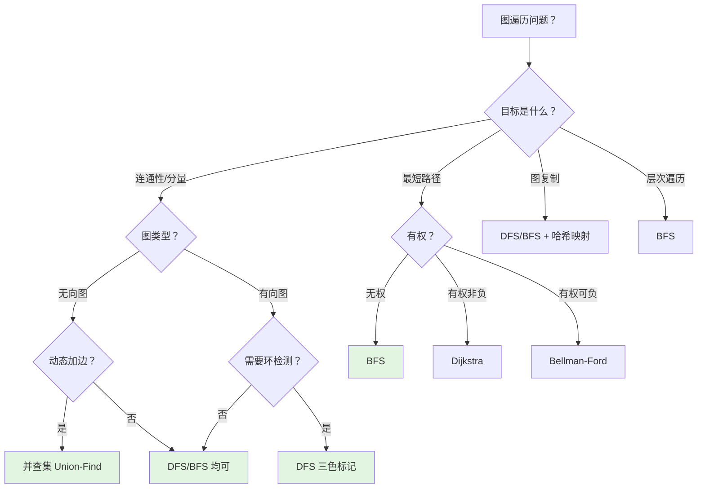
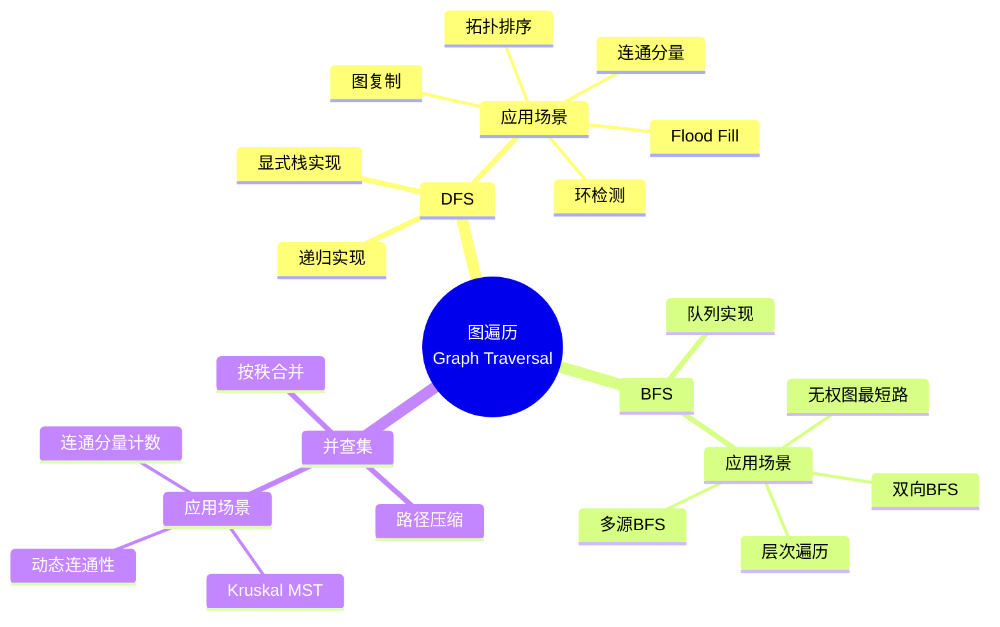

> 📊 **项目全面梳理**：详细的项目结构、模块详解和学习路径，请参阅 [`项目全面梳理-2025.md`](../../项目全面梳理-2025.md)

## 图的遍历（DFS / BFS / 并查集）/ Graph Traversal

### 摘要 / Executive Summary

- 图的遍历是图论算法的基础模块，核心算法包括 **DFS（深度优先搜索）**、**BFS（广度优先搜索）** 与 **并查集（Union-Find）**。三者均可用于连通性分析，但在适用场景、时间复杂度与实现难度上各有侧重。
- 本文从图的形式化定义出发，建立邻接表/矩阵表示、访问标记数组的形式化规约，通过 LeetCode 200（岛屿数量）、133（克隆图）、994（腐烂的橘子）三道经典题目展示三种方法在连通分量、图复制与多源BFS场景下的应用。
- 提供 DFS/BFS/并查集的多维矩阵对比、正确性证明框架与常见错误分析，帮助读者建立系统化的图遍历知识体系。

### 关键术语与符号 / Glossary

| 术语 / Term | 定义 / Definition |
|-------------|-------------------|
| 图 Graph | 二元组 $G = (V, E)$，其中 $V$ 为顶点集，$E \subseteq V \times V$ 为边集 |
| 邻接表 Adjacency List | 对每个顶点 $v \in V$ 维护其邻接顶点集合 $Adj[v] = \{u \mid (v,u) \in E\}$ |
| 邻接矩阵 Adjacency Matrix | $n \times n$ 矩阵 $A$，其中 $A[i][j] = 1$（或权重）当且仅当 $(i,j) \in E$ |
| DFS 深度优先搜索 | 优先探索深层节点，使用栈（显式或递归隐式）维护 frontier |
| BFS 广度优先搜索 | 优先探索近邻节点，使用队列维护 frontier，保证无权图最短路径 |
| 并查集 Union-Find | 维护元素划分的数据结构，支持 $O(\alpha(n))$ 的合并与查询操作 |
| 连通分量 Connected Component | 极大连通子图，分量内任意两顶点间存在路径 |
| 访问标记数组 Visited Array | 布尔数组 $\textit{visited}[v]$，记录顶点 $v$ 是否已被遍历 |
| Flood Fill | 从种子点出发，将连通区域中满足条件的所有格子标记为同一值的算法 |

术语对齐与引用规范：`docs/术语与符号总表.md`，`01-基础理论/00-撰写规范与引用指南.md`

### 目录 / Table of Contents

- [图的遍历（DFS / BFS / 并查集）/ Graph Traversal](#图的遍历dfs--bfs--并查集-graph-traversal)
  - [摘要 / Executive Summary](#摘要--executive-summary)
  - [关键术语与符号 / Glossary](#关键术语与符号--glossary)
  - [目录 / Table of Contents](#目录--table-of-contents)
  - [交叉引用与依赖 / Cross-References and Dependencies](#交叉引用与依赖--cross-references-and-dependencies)
- [1. 形式化定义 / Formal Definitions](#1-形式化定义--formal-definitions)
  - [1.1 图的形式化定义](#11-图的形式化定义)
  - [1.2 图的表示法](#12-图的表示法)
  - [1.3 访问标记与遍历状态](#13-访问标记与遍历状态)
- [2. 核心思路与算法框架 / Core Ideas and Algorithm Framework](#2-核心思路与算法框架--core-ideas-and-algorithm-framework)
  - [2.1 DFS 算法框架](#21-dfs-算法框架)
  - [2.2 BFS 算法框架](#22-bfs-算法框架)
  - [2.3 并查集算法框架](#23-并查集算法框架)
- [3. 经典题目详解 / Classic Problem Analysis](#3-经典题目详解--classic-problem-analysis)
  - [3.1 LeetCode 200 — Number of Islands](#31-leetcode-200--number-of-islands)
    - [形式化规约 / Formal Specification](#形式化规约--formal-specification)
    - [核心思路 / Core Idea](#核心思路--core-idea)
    - [代码实现 / Code Implementations](#代码实现--code-implementations)
    - [复杂度分析 / Complexity Analysis](#复杂度分析--complexity-analysis)
    - [正确性证明 / Correctness Proof](#正确性证明--correctness-proof)
  - [3.2 LeetCode 133 — Clone Graph](#32-leetcode-133--clone-graph)
    - [形式化规约 / Formal Specification](#形式化规约--formal-specification-1)
    - [核心思路 / Core Idea](#核心思路--core-idea-1)
    - [代码实现 / Code Implementations](#代码实现--code-implementations-1)
    - [复杂度分析 / Complexity Analysis](#复杂度分析--complexity-analysis-1)
    - [正确性证明 / Correctness Proof](#正确性证明--correctness-proof-1)
  - [3.3 LeetCode 994 — Rotting Oranges](#33-leetcode-994--rotting-oranges)
    - [形式化规约 / Formal Specification](#形式化规约--formal-specification-2)
    - [核心思路 / Core Idea](#核心思路--core-idea-2)
    - [代码实现 / Code Implementations](#代码实现--code-implementations-2)
    - [复杂度分析 / Complexity Analysis](#复杂度分析--complexity-analysis-2)
    - [正确性证明 / Correctness Proof](#正确性证明--correctness-proof-2)
- [4. 复杂度分析体系 / Complexity Analysis](#4-复杂度分析体系--complexity-analysis)
  - [4.1 图遍历算法复杂度总览](#41-图遍历算法复杂度总览)
  - [4.2 三种方法对比：LC 200 场景](#42-三种方法对比lc-200-场景)
  - [4.3 空间复杂度严格推导](#43-空间复杂度严格推导)
- [5. 正确性证明框架 / Correctness Proof Framework](#5-正确性证明框架--correctness-proof-framework)
  - [5.1 DFS 遍历正确性](#51-dfs-遍历正确性)
  - [5.2 BFS 遍历正确性](#52-bfs-遍历正确性)
  - [5.3 并查集正确性](#53-并查集正确性)
- [6. 思维表征 / Thinking Representations](#6-思维表征--thinking-representations)
  - [6.1 概念依赖图](#61-概念依赖图)
  - [6.2 算法选择决策树](#62-算法选择决策树)
  - [6.3 多维矩阵对比：DFS vs BFS vs Union-Find](#63-多维矩阵对比dfs-vs-bfs-vs-union-find)
  - [6.4 思维导图：图遍历方法体系](#64-思维导图图遍历方法体系)
- [7. 常见错误与反模式 / Common Mistakes and Anti-Patterns](#7-常见错误与反模式--common-mistakes-and-anti-patterns)
  - [7.1 DFS 递归栈溢出](#71-dfs-递归栈溢出)
  - [7.2 BFS 访问标记时机错误](#72-bfs-访问标记时机错误)
  - [7.3 克隆图时未处理环](#73-克隆图时未处理环)
  - [7.4 并查集未按秩合并](#74-并查集未按秩合并)
- [8. 自测问题 / Self-Assessment Questions](#8-自测问题--self-assessment-questions)
  - [问题 1：DFS 与 BFS 的选择](#问题-1dfs-与-bfs-的选择)
  - [问题 2：多源 BFS 的原理](#问题-2多源-bfs-的原理)
  - [问题 3：并查集的路径压缩](#问题-3并查集的路径压缩)
  - [问题 4：克隆图的引用不变式](#问题-4克隆图的引用不变式)
- [9. 学习目标 / Learning Objectives](#9-学习目标--learning-objectives)
- [参考文献 / References](#参考文献--references)

### 交叉引用与依赖 / Cross-References and Dependencies

**上游理论依赖 / Upstream Dependencies**:

- [`09-算法理论/01-算法基础/05-图算法理论.md`](../../09-算法理论/01-算法基础/05-图算法理论.md) — 图的基本定义、性质与遍历算法的理论分析
- `09-算法理论/03-搜索算法/01-深度优先搜索.md` — DFS 的理论定义、括号定理与复杂度
- `09-算法理论/03-搜索算法/03-广度优先搜索.md` — BFS 的理论定义、最短路径性质与循环不变式
- [`02-算法范式专题/05-二分查找.md`](../02-算法范式专题/05-二分查找.md) — 循环不变式证明方法（三条件法）

**下游应用 / Downstream Applications**:

- `05-图论专题/02-最短路径（Dijkstra-Bellman-Ford-SPFA）.md` — 最短路径算法建立在 BFS/DFS 遍历框架之上
- `05-图论专题/03-拓扑排序与DAG DP.md` — DFS 后序逆序用于拓扑排序
- `05-图论专题/04-最小生成树（Prim-Kruskal）.md` — Kruskal 算法依赖并查集

---

## 1. 形式化定义 / Formal Definitions

### 1.1 图的形式化定义

**定义 1.1** (图 / Graph) [CLRS2022]
图 $G$ 是一个二元组 $G = (V, E)$，其中 $V$ 为有限顶点集，$E \subseteq V \times V$ 为边集。
**Definition 1.1** (Graph)
A graph $G$ is an ordered pair $G = (V, E)$ where $V$ is a finite set of vertices and $E \subseteq V \times V$ is a set of edges.

- **无向图 / Undirected Graph**：边 $(u, v) \in E$ 满足 $(u, v) = (v, u)$，即边无方向。
- **有向图 / Directed Graph**：边 $(u, v) \in E$ 表示从 $u$ 指向 $v$ 的有向边，$(u, v) \neq (v, u)$。
- **带权图 / Weighted Graph**：每条边 $e \in E$ 关联一个权重函数 $w: E \rightarrow \mathbb{R}$。

### 1.2 图的表示法

**定义 1.2** (邻接矩阵 / Adjacency Matrix)
对于图 $G = (V, E)$，$|V| = n$，邻接矩阵为 $n \times n$ 矩阵 $A$：

$$
A[i][j] = \begin{cases}
w(i, j), & \text{if } (i, j) \in E \\
0 \text{ 或 } \infty, & \text{otherwise}
\end{cases}
$$

- **空间复杂度**: $O(V^2)$
- **查询边 $(u,v)$ 是否存在**: $O(1)$
- **遍历顶点 $u$ 的所有邻居**: $O(V)$

**定义 1.3** (邻接表 / Adjacency List)
对每个顶点 $v \in V$ 维护列表 $Adj[v]$：

$$
Adj[v] = \{ (u, w(v,u)) \mid (v,u) \in E \}
$$

- **空间复杂度**: $O(V + E)$
- **查询边 $(u,v)$ 是否存在**: $O(\deg(u))$
- **遍历顶点 $u$ 的所有邻居**: $O(\deg(u))$

> **面试建议**: LeetCode 中绝大多数图论题目使用**邻接表**，因为图通常是稀疏的（$E \ll V^2$）。对于网格类题目（如岛屿数量），网格本身就是隐式的邻接表表示。

### 1.3 访问标记与遍历状态

**定义 1.4** (访问标记数组 / Visited Array)
遍历算法维护布尔数组 $\textit{visited}[v]$，其中：

$$
\textit{visited}[v] = \begin{cases}
\text{true}, & \text{if 顶点 } v \text{ 已被访问} \\
\text{false}, & \text{otherwise}
\end{cases}
$$

**定义 1.5** (遍历状态三色标记 / Three-Color Marking) [CLRS2022]
在 DFS 中，顶点有三种状态：

- **白色 WHITE**：未访问（undiscovered）
- **灰色 GRAY**：已发现但邻居未完全处理（discovered, processing）
- **黑色 BLACK**：已完全处理（finished）

三色标记用于检测有向图中的环：若 DFS 过程中遇到灰色顶点，则存在环。

---

## 2. 核心思路与算法框架 / Core Ideas and Algorithm Framework

### 2.1 DFS 算法框架

**适用场景 / Applicability**: 连通分量、拓扑排序、环检测、回溯搜索、 Flood Fill。

```text
DFS(G, v):
    visited[v] ← true
    for each neighbor u of v:
        if not visited[u]:
            DFS(G, u)
```

**循环不变式 / Loop Invariant**: $Inv(v)$：所有从 $v$ 可达且已被标记为 visited 的顶点，均已被 DFS 完整遍历。

**关键性质 / Key Properties**:

- 时间复杂度: $O(V + E)$（每个顶点和边各访问一次）
- 空间复杂度: $O(V)$（递归栈深度最坏 $O(V)$）
- **括号定理**: 在 DFS 森林中，顶点 $v$ 的发现时间与完成时间形成一个合法的括号序列。

### 2.2 BFS 算法框架

**适用场景 / Applicability**: 无权图最短路径、层次遍历、多源搜索。

```text
BFS(G, s):
    queue ← [s]
    visited[s] ← true
    dist[s] ← 0
    while queue is not empty:
        v ← queue.dequeue()
        for each neighbor u of v:
            if not visited[u]:
                visited[u] ← true
                dist[u] ← dist[v] + 1
                queue.enqueue(u)
```

**循环不变式 / Loop Invariant**: 在每次迭代开始时，队列中的顶点按距源点 $s$ 的距离非递减排列，且所有距离 $< k$ 的顶点已被处理。

**关键性质 / Key Properties**:

- 时间复杂度: $O(V + E)$
- 空间复杂度: $O(V)$
- **最短路径定理**: 对于无权图，BFS 发现的 $dist[v]$ 等于从 $s$ 到 $v$ 的最短路径长度。

> 关于 BFS 最短路径性质的详细证明，参见 `09-算法理论/03-搜索算法/03-广度优先搜索.md`。

### 2.3 并查集算法框架

**适用场景 / Applicability**: 动态连通性、连通分量计数、最小生成树（Kruskal）。

```text
UnionFind(n):
    parent[i] ← i  for all i ∈ [0, n-1]
    rank[i] ← 0    for all i ∈ [0, n-1]

Find(x):
    if parent[x] ≠ x:
        parent[x] ← Find(parent[x])   // 路径压缩
    return parent[x]

Union(x, y):
    rx ← Find(x), ry ← Find(y)
    if rx = ry: return false
    if rank[rx] < rank[ry]: swap(rx, ry)
    parent[ry] ← rx
    if rank[rx] = rank[ry]: rank[rx] ← rank[rx] + 1
    return true
```

**关键性质 / Key Properties**:

- 单次操作均摊复杂度: $O(\alpha(n))$，其中 $\alpha$ 为反阿克曼函数，实际可视为常数。
- 空间复杂度: $O(n)$

---

## 3. 经典题目详解 / Classic Problem Analysis

### 3.1 LeetCode 200 — Number of Islands

> **题目链接 / Problem Link**: [LeetCode 200. Number of Islands](https://leetcode.com/problems/number-of-islands/)
> **难度 / Difficulty**: Medium

#### 形式化规约 / Formal Specification

**前置条件 / Precondition**:

$$
\textit{grid} \in \{ '0', '1' \}^{m \times n}, \quad m, n \in [1, 300]
$$

**后置条件 / Postcondition**:

$$
\text{result} = \text{连通分量数}(G)
$$

其中图 $G$ 由网格隐式定义：每个 '1' 是一个顶点，四邻域（上下左右）的 '1' 之间有边。

#### 核心思路 / Core Idea

本题是**连通分量计数**的经典模型。三种方法均可解决：

| 方法 | 核心思想 | 时间复杂度 | 空间复杂度 |
|------|---------|-----------|-----------|
| **DFS** | 遇到 '1' 启动 DFS，将连通块全部清零 | $O(mn)$ | $O(mn)$（递归栈） |
| **BFS** | 遇到 '1' 启动 BFS，将连通块全部清零 | $O(mn)$ | $O(\min(m, n))$（队列） |
| **并查集** | 将所有相邻 '1' 合并，最终统计集合数 | $O(mn \cdot \alpha(mn))$ | $O(mn)$ |

**DFS 解法**最为简洁，直接在原数组上做访问标记（将 '1' 改为 '0'）。

#### 代码实现 / Code Implementations

- **Rust**: [`examples/algorithms/src/leetcode/lc0200_number_of_islands.rs`](../../../examples/algorithms/src/leetcode/lc0200_number_of_islands.rs)
- **Python**: [`examples/algorithms-python/src/leetcode/lc0200_number_of_islands.py`](../../../examples/algorithms-python/src/leetcode/lc0200_number_of_islands.py)
- **Go**: [`examples/algorithms-go/leetcode/lc0200_number_of_islands.go`](../../../examples/algorithms-go/leetcode/lc0200_number_of_islands.go)

#### 复杂度分析 / Complexity Analysis

| 指标 / Metric | DFS | BFS | Union-Find |
|--------------|-----|-----|-----------|
| 时间复杂度 / Time | $O(mn)$ | $O(mn)$ | $O(mn \cdot \alpha(mn))$ |
| 空间复杂度 / Space | $O(mn)$ | $O(\min(m,n))$ | $O(mn)$ |
| 原地修改 / In-place | ✅ | ✅ | ❌（需额外数组） |
| 递归风险 / Recursion Risk | 栈溢出（极大网格） | ❌ | ❌ |
| 代码简洁度 / Code Conciseness | ⭐⭐⭐⭐⭐ | ⭐⭐⭐⭐ | ⭐⭐⭐ |

#### 正确性证明 / Correctness Proof

**定理 3.1.1** (LeetCode 200 正确性): DFS/BFS/并查集解法均正确返回网格中岛屿的数量。

**证明 / Proof**（以 DFS 为例）:

**循环不变式设计 / Invariant Design**:

$$
Inv \equiv \text{已被清零的 '1' 均属于某个已计数的岛屿}
$$

**初始化**: 遍历开始前，没有任何 '1' 被清零，计数为 0。不变式空真成立。

**保持**: 假设遍历到位置 $(i, j)$ 时 $grid[i][j] = '1'$。由不变式，该 '1' 不属于任何已计数的岛屿（否则已被清零）。因此它必属于一个新的岛屿，计数加 1。随后 DFS 将该 '1' 的整个连通块全部清零，保证了：

1. 该连通块内的所有 '1' 不会再次触发计数。
2. 该连通块外的 '1' 不受影响。

因此不变式保持。

**终止**: 遍历完所有格子后，所有 '1' 均已被清零（属于某个已计数的岛屿）。计数器的值等于连通块数量，即岛屿数量。

---

### 3.2 LeetCode 133 — Clone Graph

> **题目链接 / Problem Link**: [LeetCode 133. Clone Graph](https://leetcode.com/problems/clone-graph/)
> **难度 / Difficulty**: Medium

#### 形式化规约 / Formal Specification

**前置条件 / Precondition**:

$$
G = (V, E) \text{ 是无向连通图}, \quad |V| \in [1, 100], \quad |E| = O(|V|)
$$

输入为给定图的一个节点的引用，图以邻接表形式存储。

**后置条件 / Postcondition**:

返回图 $G' = (V', E')$，满足：

$$
|V'| = |V| \land |E'| = |E| \land G' \cong G \land V' \cap V = \emptyset
$$

即 $G'$ 与 $G$ 同构，且 $G'$ 的所有节点都是新创建的（深拷贝）。

#### 核心思路 / Core Idea

图复制的关键是**引用不变式**：原图中的每个节点必须且只能对应新图中的一个节点。若不加控制，同一原节点可能被复制多次，导致新图结构错误。

**解法策略**：使用哈希表（或数组）维护 `原节点 → 新节点` 的映射，在 DFS/BFS 遍历过程中：

1. 若原节点已存在映射，直接返回对应的新节点。
2. 若不存在，创建新节点，建立映射，再递归/迭代复制邻居。

#### 代码实现 / Code Implementations

- **Rust**: [`examples/algorithms/src/leetcode/lc0133_clone_graph.rs`](../../../examples/algorithms/src/leetcode/lc0133_clone_graph.rs)
- **Python**: [`examples/algorithms-python/src/leetcode/lc0133_clone_graph.py`](../../../examples/algorithms-python/src/leetcode/lc0133_clone_graph.py)

#### 复杂度分析 / Complexity Analysis

| 指标 / Metric | 值 / Value | 说明 / Note |
|--------------|-----------|------------|
| 时间复杂度 / Time | $O(V + E)$ | 每个节点和边各访问一次 |
| 空间复杂度 / Space | $O(V)$ | 哈希表存储 $V$ 个映射 + 递归栈/队列 |

#### 正确性证明 / Correctness Proof

**定理 3.2.1** (LeetCode 133 正确性): 算法返回原图的深拷贝，且新图与原图同构。

**证明 / Proof**:

**引用不变式 / Reference Invariant**:

$$
Inv \equiv \forall v \in V: \text{map}[v] \text{ 存在} \rightarrow \text{map}[v] \text{ 是 } v \text{ 的深拷贝}
$$

**初始化**: 开始时 map 为空，不变式空真成立。

**保持（DFS 递归情形）**:
设当前处理原节点 $v$。分两种情况：

- **情况 A**: $v \in \text{map}$。由不变式，$\text{map}[v]$ 已是 $v$ 的深拷贝，直接返回，不变式保持。
- **情况 B**: $v \notin \text{map}$。创建新节点 $v'$，令 $\text{map}[v] = v'$。此时 $v'$ 的邻居列表为空。递归处理 $v$ 的每个邻居 $u$：
  - 由归纳假设，递归调用返回 $u$ 的深拷贝 $u'$。
  - 将 $u'$ 加入 $v'$ 的邻居列表。
  - 由于图是无向的，$v'$ 与 $u'$ 之间的边关系与原图一致。

因此处理完 $v$ 后，$v'$ 及其邻居均为深拷贝，不变式保持。

**终止**: 从输入节点开始的递归/遍历结束后，所有可达节点（即全图，因为图连通）均已在 map 中。由不变式，map 中每个值都是对应原节点的深拷贝。返回输入节点对应的拷贝，即为全图的深拷贝。

---

### 3.3 LeetCode 994 — Rotting Oranges

> **题目链接 / Problem Link**: [LeetCode 994. Rotting Oranges](https://leetcode.com/problems/rotting-oranges/)
> **难度 / Difficulty**: Medium

#### 形式化规约 / Formal Specification

**前置条件 / Precondition**:

$$
\textit{grid} \in \{0, 1, 2\}^{m \times n}, \quad m, n \in [2, 10]
$$

其中 0 为空单元格，1 为新鲜橘子，2 为腐烂橘子。

**后置条件 / Postcondition**:

$$
\text{result} = \begin{cases}
\min \{ t \mid \text{时刻 } t \text{ 后所有新鲜橘子均腐烂} \}, & \text{if 所有橘子可腐烂} \\
-1, & \text{otherwise}
\end{cases}
$$

#### 核心思路 / Core Idea

本题是**多源 BFS**（Multi-source BFS）的经典模型。初始时所有腐烂橘子同时开始"传播"腐烂，每分钟向四邻域扩散一层。目标是求腐烂覆盖全图的最短时间。

**关键洞察**: 将初始所有腐烂橘子同时入队（第 0 层），BFS 的层数即为经过的分钟数。每次从队列取出一个腐烂橘子，将其四邻域的新鲜橘子变为腐烂并入队（层数 +1）。

> 关于多源 BFS 的更多细节，参见 `09-算法理论/03-搜索算法/03-广度优先搜索.md` §3.2。

#### 代码实现 / Code Implementations

- **Rust**: [`examples/algorithms/src/leetcode/lc0994_rotting_oranges.rs`](../../../examples/algorithms/src/leetcode/lc0994_rotting_oranges.rs)
- **Go**: [`examples/algorithms-go/leetcode/lc0994_rotting_oranges.go`](../../../examples/algorithms-go/leetcode/lc0994_rotting_oranges.go)

#### 复杂度分析 / Complexity Analysis

| 指标 / Metric | 值 / Value | 说明 / Note |
|--------------|-----------|------------|
| 时间复杂度 / Time | $O(mn)$ | 每个格子最多入队一次 |
| 空间复杂度 / Space | $O(mn)$ | 队列最坏存储所有格子 |

#### 正确性证明 / Correctness Proof

**定理 3.3.1** (LeetCode 994 正确性): 多源 BFS 返回腐烂所有新鲜橘子所需的最短分钟数，若不可能则返回 -1。

**证明 / Proof**:

**引理 3.3.1** (BFS 层数等于时间): 设橘子 $x$ 在 BFS 中的层数为 $t$，则 $x$ 恰好在第 $t$ 分钟腐烂。

**证明**: 对 BFS 层数进行归纳。

- **基础**: 第 0 层为初始腐烂橘子，第 0 分钟已腐烂，成立。
- **归纳假设**: 假设所有层数 $\leq k$ 的橘子恰好在第 $k$ 分钟腐烂。
- **归纳步骤**: 层数为 $k+1$ 的橘子 $x$ 必被某个层数为 $k$ 的邻居 $y$ 在第 $k$ 分钟腐烂时传播而来。由于传播耗时 1 分钟，$x$ 在第 $k+1$ 分钟腐烂。由 BFS 性质，不存在更短路径使 $x$ 更早腐烂。

**主定理证明**:
算法结束时，若仍存在新鲜橘子（$\textit{fresh\_count} > 0$），则这些橘子无法从任何初始腐烂橘子到达，返回 -1 正确。

若所有橘子均腐烂，设最后腐烂的橘子层数为 $T$。由引理 3.3.1，该橘子恰好在第 $T$ 分钟腐烂，且不存在更晚腐烂的橘子。因此 $T$ 为最短所需时间。

---

## 4. 复杂度分析体系 / Complexity Analysis

### 4.1 图遍历算法复杂度总览

| 算法 | 时间复杂度 | 空间复杂度 | 适用图类型 | 关键性质 |
|------|-----------|-----------|-----------|---------|
| DFS | $O(V + E)$ | $O(V)$ | 所有图 | 括号定理、拓扑序（后序逆序） |
| BFS | $O(V + E)$ | $O(V)$ | 所有图 | 无权图最短路径 |
| Union-Find | $O(\alpha(V))$ 每次操作 | $O(V)$ | 无向图 | 路径压缩 + 按秩合并 |

### 4.2 三种方法对比：LC 200 场景

| 维度 / Dimension | DFS | BFS | Union-Find |
|----------------|-----|-----|-----------|
| **时间复杂度** | $O(mn)$ | $O(mn)$ | $O(mn \cdot \alpha(mn))$ |
| **空间复杂度** | $O(mn)$ 最坏 | $O(\min(m,n))$ | $O(mn)$ |
| **原地修改** | ✅ | ✅ | ❌ |
| **递归深度风险** | 有（极大网格） | 无 | 无 |
| **代码量** | 最少 | 中等 | 最多 |
| **面试推荐度** | ⭐⭐⭐⭐⭐ | ⭐⭐⭐⭐ | ⭐⭐⭐ |

### 4.3 空间复杂度严格推导

**定理 4.1** (DFS 空间复杂度): DFS 的空间复杂度最坏为 $O(V)$。

**证明 / Proof**:
DFS 的空间消耗主要来自递归栈。考虑一条包含 $V$ 个顶点的链状图，DFS 从一端开始递归，栈深度达到 $V$。因此最坏情况下空间复杂度为 $O(V)$。

对于 $m \times n$ 的网格图，$V = mn$，DFS 递归栈最坏为 $O(mn)$。

---

## 5. 正确性证明框架 / Correctness Proof Framework

### 5.1 DFS 遍历正确性

**定理 5.1** (DFS 遍历正确性): 对于任意图 $G = (V, E)$ 和起点 $s \in V$，DFS 访问所有从 $s$ 可达的顶点，且每个顶点恰好访问一次。

**证明 / Proof**:

**循环不变式 / Loop Invariant**:

$$
Inv \equiv \text{所有标记为 visited 的顶点均已被 DFS 访问，且不会再次访问}
$$

**初始化**: 初始时仅 $s$ 被标记，尚未进入递归体，不变式成立。

**保持**: 假设递归调用 $\text{DFS}(G, v)$ 开始时不变式成立。对于 $v$ 的每个未访问邻居 $u$，递归调用 $\text{DFS}(G, u)$。由归纳假设，$u$ 及其所有可达顶点均会被访问且仅访问一次。因此处理完所有邻居后，$v$ 的可达范围均已访问。

**终止**: 递归返回时，$v$ 的所有可达顶点均已被访问。从初始调用 $\text{DFS}(G, s)$ 返回后，所有从 $s$ 可达的顶点均已被访问。

### 5.2 BFS 遍历正确性

**定理 5.2** (BFS 最短路径正确性): 对于无权图 $G = (V, E)$ 和起点 $s$，BFS 计算出的 $dist[v]$ 等于从 $s$ 到 $v$ 的最短路径长度。

**证明 / Proof**:

参见 `09-算法理论/03-搜索算法/03-广度优先搜索.md` §2.2。核心思路是对距离层次进行归纳：BFS 按距 $s$ 的距离层次依次处理顶点，当顶点 $v$ 首次被发现时，其距离即为最短距离。

### 5.3 并查集正确性

**定理 5.3** (并查集连通性正确性): 并查集的 $\text{Find}(x)$ 返回 $x$ 所在连通分量的代表元，$\text{Union}(x, y)$ 正确合并两个连通分量。

**证明 / Proof**:

**不变式**: 对于所有顶点 $v$，$\text{Find}(v)$ 返回的值与 $v$ 属于同一连通分量。

**Find**: 路径压缩仅改变 parent 指针的指向，不改变连通分量的划分。因此不变式保持。

**Union**: 仅当 $\text{Find}(x) \neq \text{Find}(y)$ 时才合并，将其中一个根节点的 parent 指向另一个。这恰好对应连通分量的合并操作，不变式保持。

---

## 6. 思维表征 / Thinking Representations

### 6.1 概念依赖图

```mermaid
flowchart LR
    A[图 G=(V,E)<br/>Graph Definition] --> B[邻接表/矩阵<br/>Representation]
    B --> C[DFS<br/>Depth-First Search]
    B --> D[BFS<br/>Breadth-First Search]
    C --> E[连通分量<br/>Connected Components]
    D --> E
    F[并查集<br/>Union-Find] --> E
    C --> G[拓扑排序<br/>Topological Sort]
    D --> H[无权图最短路<br/>Shortest Path]
    F --> I[MST / Kruskal<br/>Minimum Spanning Tree]
    C --> J[克隆图<br/>Clone Graph]
    D --> K[多源BFS<br/>Multi-source BFS]
```

### 6.2 算法选择决策树



### 6.3 多维矩阵对比：DFS vs BFS vs Union-Find

| 维度 / Dimension | DFS | BFS | Union-Find |
|----------------|-----|-----|-----------|
| **数据结构** | 栈（递归隐式） | 队列 | 父指针数组 + 秩数组 |
| **时间复杂度** | $O(V + E)$ | $O(V + E)$ | $O(\alpha(V))$ 每次操作 |
| **空间复杂度** | $O(V)$ | $O(V)$ | $O(V)$ |
| **最短路径** | ❌ | ✅（无权图） | ❌ |
| **环检测** | ✅（三色标记） | ❌ | ❌（无向图可用） |
| **动态连通性** | ❌ | ❌ | ✅ |
| **拓扑排序** | ✅（后序逆序） | ✅（Kahn） | ❌ |
| **代码简洁度** | ⭐⭐⭐⭐⭐ | ⭐⭐⭐⭐ | ⭐⭐⭐ |

### 6.4 思维导图：图遍历方法体系



---

## 7. 常见错误与反模式 / Common Mistakes and Anti-Patterns

### 7.1 DFS 递归栈溢出

**错误 / Mistake**: 在极大网格（如 $300 \times 300$）上使用 DFS，递归深度达到 $9 \times 10^4$，导致栈溢出。

**修复 / Fix**:

- 改用 BFS（队列无递归深度限制）
- 或改用显式栈的 DFS 迭代实现

### 7.2 BFS 访问标记时机错误

**错误 / Mistake**: 将邻居节点入队后才标记 visited，导致同一节点多次入队。

```python
# ❌ 错误：入队后才标记
queue.append((nx, ny))
visited[nx][ny] = True   # 可能已入队多次

# ✅ 正确：入队前立即标记
visited[nx][ny] = True
queue.append((nx, ny))
```

### 7.3 克隆图时未处理环

**错误 / Mistake**: 不使用哈希表记录已复制节点，导致无向图中的环引起无限递归。

```python
# ❌ 错误：无映射保护，无限递归
for neighbor in node.neighbors:
    new_node.neighbors.append(clone(neighbor))  # 环导致死循环

# ✅ 正确：哈希表映射保护
if node in visited:
    return visited[node]
visited[node] = new_node
```

### 7.4 并查集未按秩合并

**错误 / Mistake**: 合并时随意指定父节点，导致树高退化为 $O(n)$，时间复杂度恶化。

**修复 / Fix**: 始终将秩较小的树根指向秩较大的树根，保证树高为 $O(\log n)$；结合路径压缩后均摊为 $O(\alpha(n))$。

---

## 8. 自测问题 / Self-Assessment Questions

### 问题 1：DFS 与 BFS 的选择

**Q**: 为什么 LeetCode 200（岛屿数量）用 DFS 和 BFS 均可，而 LeetCode 994（腐烂的橘子）更适合 BFS？

**A**:

- LC 200 仅需计数连通分量，DFS 和 BFS 都能完整遍历连通块，DFS 代码更简洁。
- LC 994 求的是**最短时间**，本质是无权图上的最短路径问题。BFS 天然按距离层次扩展，层数即时间，因此是最自然的解法。DFS 无法直接得到最短时间。

### 问题 2：多源 BFS 的原理

**Q**: 多源 BFS 为什么能保证结果是"所有源同时扩散"的效果？

**A**: BFS 的队列按发现时间排序。将所有初始源点同时入队（第 0 层），它们的邻居按入队顺序依次处理。由于 BFS 的层次性质，距离为 $k$ 的节点总是在距离为 $k+1$ 的节点之前出队。因此从多个源点扩散的"波前"会正确地在前沿相遇，不会产生重复计算。

### 问题 3：并查集的路径压缩

**Q**: 路径压缩为什么不影响并查集的正确性？

**A**: 路径压缩仅改变 parent 指针的指向，使节点直接指向根节点。这不会改变节点所属连通分量的划分——同一连通分量中的节点仍然指向同一个根。因此 Find 和 Union 操作的语义保持不变，仅优化了未来的查询效率。

### 问题 4：克隆图的引用不变式

**Q**: 克隆图中 "原节点 → 新节点" 的映射为什么必须在递归前建立？

**A**: 无向图中存在环（如 $A \leftrightarrow B$）。若在递归复制邻居后才建立映射，递归调用 $\text{clone}(B)$ 会再次调用 $\text{clone}(A)$，而 $\text{clone}(A)$ 尚未完成映射建立，导致无限递归。预先建立映射可将环上的递归转换为查表返回，打破循环依赖。

---

## 9. 学习目标 / Learning Objectives

完成本章学习后，读者应能够：

1. **形式化描述**图的问题实例，包括邻接表/矩阵表示、访问标记数组的设计。
2. **熟练运用** DFS、BFS、并查集三种遍历方法解决连通性、图复制、最短时间等具体问题。
3. **独立推导**基于循环不变式的正确性证明（初始化、保持、终止）。
4. **准确判断**不同场景下三种方法的适用性，选择最优解法。
5. **识别并避免**常见的遍历错误（访问标记时机、递归溢出、环处理等）。

---

## 参考文献 / References

- [CLRS2022] Cormen, T. H., et al. *Introduction to Algorithms* (4th ed.). MIT Press, 2022. §22 图的基本算法
- [Sedgewick2011] Sedgewick, R. & Wayne, K. *Algorithms* (4th ed.). Addison-Wesley, 2011. §4 图论算法
- LeetCode 200, 133, 994 官方题解

---

> 📚 **返回目录**: [LeetCode算法面试专题](../README.md)

<!-- 自动添加的代码引用 -->
- [`lc0200_number_of_islands.lean`](../../../examples/lean_proofs/FormalAlgorithm/leetcode/lc0200_number_of_islands.lean)
