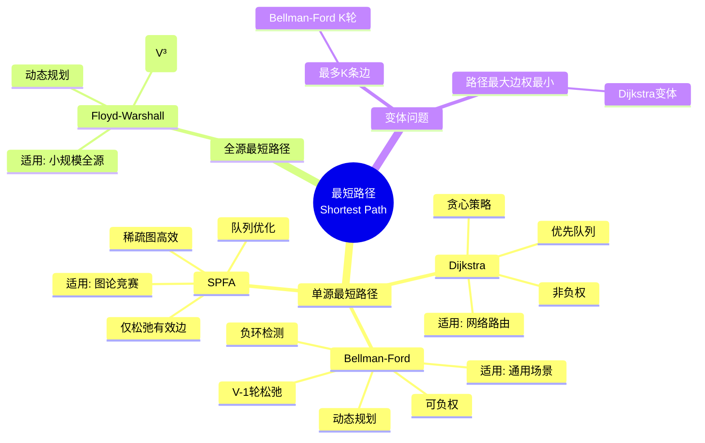

> 📊 **项目全面梳理**：详细的项目结构、模块详解和学习路径，请参阅 [`项目全面梳理-2025.md`](../../项目全面梳理-2025.md)

## 最短路径（Dijkstra / Bellman-Ford / SPFA）/ Shortest Path

### 摘要 / Executive Summary

- 最短路径问题是图论的核心课题，本文聚焦三种经典算法：**Dijkstra**（非负权单源）、**Bellman-Ford**（含负权单源）、**SPFA**（队列优化的 Bellman-Ford）。三者基于共同的松弛（Relaxation）操作与三角不等式原理，但在贪心策略适用性、负权处理能力与时间复杂度上有本质差异。
- 通过 LeetCode 743（网络延迟时间）、787（K站中转内最便宜的航班）、1631（最小体力消耗路径）三道经典题目，展示三种算法在实际问题中的选型策略与变体应用。
- 提供 Dijkstra 正确性的完整贪心选择+归纳法证明，以及 Bellman-Ford 检测负环的充分必要条件。

### 关键术语与符号 / Glossary

| 术语 / Term | 定义 / Definition |
|-------------|-------------------|
| 最短路径 Shortest Path | 从源点 $s$ 到目标点 $t$ 的边权之和最小的路径，记为 $\delta(s, t)$ |
| 松弛操作 Relaxation | 对边 $(u, v)$，若 $dist[u] + w(u,v) < dist[v]$，则更新 $dist[v] \leftarrow dist[u] + w(u,v)$ |
| 三角不等式 Triangle Inequality | 对于任意边 $(u, v) \in E$，有 $\delta(s, v) \leq \delta(s, u) + w(u, v)$ |
| 上界性质 Upper Bound Property | 始终有 $dist[v] \geq \delta(s, v)$，即估计值不会小于真实最短距离 |
| 收敛性质 Convergence Property | 若 $s \leadsto u \rightarrow v$ 是最短路径且 $dist[u] = \delta(s, u)$，则松弛 $(u,v)$ 后 $dist[v] = \delta(s, v)$ |
| 负环 Negative Cycle | 环上所有边权之和 $< 0$ 的环。若存在从 $s$ 可达的负环，则最短路径无定义（可无限减小） |
| 贪心选择 Greedy Choice | Dijkstra 每次选择当前距离估计最小的未确定顶点，将其标记为"已确定" |

术语对齐与引用规范：`docs/术语与符号总表.md`，`01-基础理论/00-撰写规范与引用指南.md`

### 目录 / Table of Contents

- [最短路径（Dijkstra / Bellman-Ford / SPFA）/ Shortest Path](#最短路径dijkstra--bellman-ford--spfa--shortest-path)
  - [摘要 / Executive Summary](#摘要--executive-summary)
  - [关键术语与符号 / Glossary](#关键术语与符号--glossary)
  - [目录 / Table of Contents](#目录--table-of-contents)
  - [交叉引用与依赖 / Cross-References and Dependencies](#交叉引用与依赖--cross-references-and-dependencies)
  - [1. 形式化定义 / Formal Definitions](#1-形式化定义--formal-definitions)
    - [1.1 最短路径问题实例](#11-最短路径问题实例)
    - [1.2 松弛操作与三角不等式](#12-松弛操作与三角不等式)
  - [2. 核心思路与算法框架](#2-核心思路与算法框架--core-ideas-and-algorithm-framework)
    - [2.1 Dijkstra 算法框架](#21-dijkstra-算法框架)
    - [2.2 Bellman-Ford 算法框架](#22-bellman-ford-算法框架)
    - [2.3 SPFA 算法框架](#23-spfa-算法框架)
  - [3. 经典题目详解](#3-经典题目详解--classic-problem-analysis)
    - [3.1 LeetCode 743 — 网络延迟时间](#31-leetcode-743--网络延迟时间)
    - [3.2 LeetCode 787 — K站中转内最便宜的航班](#32-leetcode-787--k站中转内最便宜的航班)
    - [3.3 LeetCode 1631 — 最小体力消耗路径](#33-leetcode-1631--最小体力消耗路径)
  - [4. 复杂度分析体系](#4-复杂度分析体系--complexity-analysis)
  - [5. 正确性证明框架](#5-正确性证明框架--correctness-proof-framework)
  - [6. 思维表征](#6-思维表征--thinking-representations)
  - [7. 常见错误与反模式](#7-常见错误与反模式--common-mistakes-and-anti-patterns)
  - [8. 自测问题](#8-自测问题--self-assessment-questions)
  - [9. 学习目标](#9-学习目标--learning-objectives)
  - [参考文献](#参考文献--references)

### 交叉引用与依赖 / Cross-References and Dependencies

**上游理论依赖 / Upstream Dependencies**:
- [`09-算法理论/01-算法基础/05-图算法理论.md`](../../09-算法理论/01-算法基础/05-图算法理论.md) §3 — 最短路径算法的理论定义、最优子结构与复杂度分析
- `09-算法理论/03-搜索算法/03-广度优先搜索.md` — BFS 是无权图最短路径的特例（所有边权为 1）
- [`02-算法范式专题/05-二分查找.md`](../02-算法范式专题/05-二分查找.md) — 贪心策略与循环不变式证明方法

**下游应用 / Downstream Applications**:
- `05-图论专题/04-最小生成树（Prim-Kruskal）.md` — Prim 算法与 Dijkstra 结构相似，目标不同
- `05-图论专题/03-拓扑排序与DAG DP.md` — DAG 上的最短路径可用拓扑排序优化

---

## 1. 形式化定义 / Formal Definitions

### 1.1 最短路径问题实例

**定义 1.1** (单源最短路径问题 / Single-Source Shortest Path Problem) [CLRS2022]
给定带权有向图 $G = (V, E)$，权重函数 $w: E \rightarrow \mathbb{R}$，以及源点 $s \in V$，求对于每个 $v \in V$，从 $s$ 到 $v$ 的最短路径权重 $\delta(s, v)$。

**Definition 1.1** (Single-Source Shortest Path Problem)
Given a weighted directed graph $G = (V, E)$ with weight function $w: E \rightarrow \mathbb{R}$ and source vertex $s \in V$, find the shortest path weight $\delta(s, v)$ from $s$ to every $v \in V$.

$$
\delta(s, v) = \begin{cases}
\min\{ w(P) \mid P \text{ 是从 } s \text{ 到 } v \text{ 的路径} \}, & \text{if 存在路径} \\
\infty, & \text{otherwise}
\end{cases}
$$

其中路径权重 $w(P) = \sum_{(u,v) \in P} w(u,v)$。

**定义 1.2** (最短路径树 / Shortest Path Tree)
以 $s$ 为根的树 $T$，满足对于所有 $v \in V$，$T$ 中从 $s$ 到 $v$ 的唯一路径是 $G$ 中的最短路径。

### 1.2 松弛操作与三角不等式

**定义 1.3** (松弛操作 / Relaxation) [CLRS2022]
对边 $(u, v) \in E$ 进行松弛操作：

```text
Relax(u, v, w):
    if dist[u] + w(u,v) < dist[v]:
        dist[v] ← dist[u] + w(u,v)
        predecessor[v] ← u
```

**定义 1.4** (三角不等式 / Triangle Inequality)
对于任意边 $(u, v) \in E$：

$$
\delta(s, v) \leq \delta(s, u) + w(u, v)
$$

**直观解释**: 从 $s$ 到 $v$ 的最短路径不可能比"从 $s$ 到 $u$ 的最短路径 + 边 $(u,v)$"更长。

**定理 1.1** (上界性质 / Upper Bound Property) [CLRS2022]
始终有 $dist[v] \geq \delta(s, v)$。一旦 $dist[v] = \delta(s, v)$，它将不再改变。

**证明 / Proof**:
初始时 $dist[s] = 0 = \delta(s, s)$，$dist[v] = \infty \geq \delta(s, v)$，成立。

假设某次松弛前成立。松弛边 $(u,v)$ 时，由归纳假设 $dist[u] \geq \delta(s, u)$，因此：

$$
dist[v]_{\text{new}} = dist[u] + w(u,v) \geq \delta(s, u) + w(u,v) \geq \delta(s, v)
$$

（最后一步由三角不等式）。因此松弛后仍成立。$\square$

---

## 2. 核心思路与算法框架 / Core Ideas and Algorithm Framework

### 2.1 Dijkstra 算法框架

**适用条件 / Applicability**: 所有边权非负（$w(u,v) \geq 0$）。

```text
Dijkstra(G, w, s):
    Initialize-Single-Source(G, s)
    S ← ∅                          // 已确定最短距离的顶点集合
    Q ← V                          // 优先队列，按 dist 排序
    while Q ≠ ∅:
        u ← Extract-Min(Q)
        S ← S ∪ {u}
        for each vertex v ∈ Adj[u]:
            Relax(u, v, w)         // 可能触发 Decrease-Key
```

**核心思想**: 贪心策略。每次从优先队列中取出当前 $dist$ 最小的顶点 $u$，将其加入已确定集合 $S$。$u$ 的 $dist$ 值从此不再改变。

> 关于 Dijkstra 的详细复杂度推导，参见 [`09-算法理论/01-算法基础/05-图算法理论.md`](../../09-算法理论/01-算法基础/05-图算法理论.md) §3.1。

### 2.2 Bellman-Ford 算法框架

**适用条件 / Applicability**: 边权可为负，但不存在从 $s$ 可达的负环。

```text
Bellman-Ford(G, w, s):
    Initialize-Single-Source(G, s)
    for i = 1 to |V| - 1:
        for each edge (u, v) ∈ E:
            Relax(u, v, w)
    // 负环检测
    for each edge (u, v) ∈ E:
        if dist[u] + w(u,v) < dist[v]:
            return "存在从 s 可达的负环"
    return dist
```

**核心思想**: 动态规划。经过 $k$ 轮松弛后，$dist[v]$ 等于最多使用 $k$ 条边的最短路径。由于最短路径（无负环时）最多包含 $|V|-1$ 条边，$|V|-1$ 轮松弛即可收敛。

**定理 2.1** (Bellman-Ford 最优子结构)
设 $dist_k(v)$ 为最多使用 $k$ 条边的最短路径长度，则：

$$
dist_{k+1}(v) = \min\left( dist_k(v), \min_{(u,v) \in E} \left[ dist_k(u) + w(u,v) \right] \right)
$$

且 $dist_{|V|-1}(v) = \delta(s, v)$（若无负环）。

### 2.3 SPFA 算法框架

**适用条件 / Applicability**: 边权可为负，图稀疏时效率显著优于 Bellman-Ford。

```text
SPFA(G, w, s):
    Initialize-Single-Source(G, s)
    queue ← [s]
    in_queue[v] ← false for all v
    in_queue[s] ← true
    count[v] ← 0 for all v          // 记录每个顶点入队次数
    while queue ≠ ∅:
        u ← Dequeue(queue)
        in_queue[u] ← false
        for each vertex v ∈ Adj[u]:
            if dist[u] + w(u,v) < dist[v]:
                dist[v] ← dist[u] + w(u,v)
                if not in_queue[v]:
                    Enqueue(queue, v)
                    in_queue[v] ← true
                    count[v] += 1
                    if count[v] > |V|:
                        return "存在负环"
    return dist
```

**核心思想**: 只有 $dist[u]$ 发生变化时，从 $u$ 出发的边才可能引发新的松弛。SPFA 使用队列维护"距离刚被更新的顶点"，避免了对所有边进行无意义的松弛。

---

## 3. 经典题目详解 / Classic Problem Analysis

### 3.1 LeetCode 743 — Network Delay Time

> **题目链接 / Problem Link**: [LeetCode 743. Network Delay Time](https://leetcode.com/problems/network-delay-time/)
> **难度 / Difficulty**: Medium

#### 形式化规约 / Formal Specification

**前置条件 / Precondition**:

$$
G = (V, E), \quad |V| = n \in [1, 100], \quad |E| = \textit{times}.length \in [1, 6000]
$$

边权 $w(u,v) > 0$（传播时间恒为正），源点 $s = k$。

**后置条件 / Postcondition**:

$$
\text{result} = \begin{cases}
\max_{v \in V} \delta(s, v), & \text{if } \forall v \in V: \delta(s, v) < \infty \\
-1, & \text{otherwise}
\end{cases}
$$

即所有节点都被信号覆盖的最短时间；若存在不可达节点，返回 -1。

#### 核心思路 / Core Idea

本题是**单源最短路径**的直接应用。由于边权均为正，使用 **Dijkstra 算法**即可。

**算法步骤**:
1. 建图（邻接表）。
2. 从源点 $k$ 运行 Dijkstra，得到到所有节点的最短距离。
3. 取所有距离中的最大值。若存在距离为 $\infty$ 的节点，返回 -1。

#### 代码实现 / Code Implementations

- **Rust**: [`examples/algorithms/src/leetcode/lc0743_network_delay_time.rs`](../../../examples/algorithms/src/leetcode/lc0743_network_delay_time.rs)
- **Python**: [`examples/algorithms-python/src/leetcode/lc0743_network_delay_time.py`](../../../examples/algorithms-python/src/leetcode/lc0743_network_delay_time.py)
- **Go**: [`examples/algorithms-go/leetcode/lc0743_network_delay_time.go`](../../../examples/algorithms-go/leetcode/lc0743_network_delay_time.go)

#### 复杂度分析 / Complexity Analysis

| 指标 / Metric | 值 / Value | 说明 / Note |
|--------------|-----------|------------|
| 时间复杂度 / Time | $O((V + E) \log V)$ | 优先队列实现 Dijkstra |
| 空间复杂度 / Space | $O(V + E)$ | 邻接表 + 距离数组 + 优先队列 |

#### 正确性证明 / Correctness Proof

**定理 3.1.1** (LeetCode 743 正确性): 算法返回信号覆盖全网的最短时间，若存在不可达节点则返回 -1。

**证明 / Proof**:

**步骤 1**: Dijkstra 正确计算从 $s$ 到所有可达顶点的最短距离。由 §5.1 的 Dijkstra 正确性定理，对于非负权图，算法终止时 $dist[v] = \delta(s, v)$ 对所有 $v \in V$ 成立。

**步骤 2**: 设 $D = \max_{v \in V} dist[v]$。对于所有可达节点 $v$，信号到达时间为 $\delta(s, v) \leq D$。存在某个节点 $u$ 使得 $\delta(s, u) = D$，信号恰好需要 $D$ 时间到达 $u$。

**步骤 3**: 若存在不可达节点，其 $dist$ 值保持为 $\infty$。题目要求所有节点都收到信号，因此返回 -1。

综上，算法正确。$\square$

---

### 3.2 LeetCode 787 — Cheapest Flights Within K Stops

> **题目链接 / Problem Link**: [LeetCode 787. Cheapest Flights Within K Stops](https://leetcode.com/problems/cheapest-flights-within-k-stops/)
> **难度 / Difficulty**: Medium

#### 形式化规约 / Formal Specification

**前置条件 / Precondition**:

$$
n \in [1, 100], \quad \textit{flights}.length \in [0, n(n-1)], \quad K \in [0, n]
$$

边权 $w(u,v) \geq 0$（票价非负）。

**后置条件 / Postcondition**:

$$
\text{result} = \min \{ w(P) \mid P \text{ 是从 } src \text{ 到 } dst \text{ 的路径}, \text{ 边数} \leq K + 1 \}
$$

若不存在这样的路径，返回 -1。

#### 核心思路 / Core Idea

本题限制了路径的**边数上限**（中转次数 $K$ 意味着最多 $K+1$ 条边），这正是 **Bellman-Ford 算法**的天然应用场景。

**关键洞察**: Bellman-Ford 的第 $k$ 轮松弛结束后，$dist[v]$ 等于最多使用 $k$ 条边的最短路径。因此只需执行 $K+1$ 轮松弛（而非 $|V|-1$ 轮），即可得到最多 $K$ 次中转的最便宜价格。

**算法步骤**:
1. 初始化 $dist[src] = 0$，其余为 $\infty$。
2. 进行 $K+1$ 轮松弛（每轮遍历所有边）。
3. 使用辅助数组防止同轮内的"串联更新"（确保每轮只增加一条边）。
4. 返回 $dist[dst]$，若为 $\infty$ 则返回 -1。

#### 代码实现 / Code Implementations

- **Rust**: [`examples/algorithms/src/leetcode/lc0787_cheapest_flights_within_k_stops.rs`](../../../examples/algorithms/src/leetcode/lc0787_cheapest_flights_within_k_stops.rs)
- **Python**: [`examples/algorithms-python/src/leetcode/lc0787_cheapest_flights_within_k_stops.py`](../../../examples/algorithms-python/src/leetcode/lc0787_cheapest_flights_within_k_stops.py)

#### 复杂度分析 / Complexity Analysis

| 指标 / Metric | 值 / Value | 说明 / Note |
|--------------|-----------|------------|
| 时间复杂度 / Time | $O(K \cdot E)$ | $K+1$ 轮松弛，每轮 $O(E)$ |
| 空间复杂度 / Space | $O(V)$ | 距离数组 + 辅助数组 |

#### 正确性证明 / Correctness Proof

**定理 3.2.1** (LeetCode 787 正确性): 经过 $K+1$ 轮松弛后，$dist[dst]$ 等于最多 $K$ 次中转的最便宜票价。

**证明 / Proof**:

**引理 3.2.1** (第 $k$ 轮松弛的不变性): 第 $k$ 轮松弛结束后（$k \geq 0$），$dist[v]$ 等于从 $src$ 到 $v$ 最多使用 $k$ 条边的最短路径长度。

**归纳证明**:
- **基础** ($k = 0$): 仅 $dist[src] = 0$（0 条边），其余为 $\infty$，成立。
- **归纳假设**: 假设第 $k$ 轮结束后引理成立。
- **归纳步骤**: 第 $k+1$ 轮松弛边 $(u,v)$ 时，若 $dist[u]$ 是最多 $k$ 条边的最优值，则更新后的 $dist[v] \leq dist[u] + w(u,v)$ 对应一条最多 $k+1$ 条边的路径。取所有入边的最小值，即得最多 $k+1$ 条边的最优值。

**主定理**: 中转次数 $K$ 对应最多 $K+1$ 条边。由引理，$K+1$ 轮松弛后 $dist[dst]$ 即为所求。$\square$

---

### 3.3 LeetCode 1631 — Path With Minimum Effort

> **题目链接 / Problem Link**: [LeetCode 1631. Path With Minimum Effort](https://leetcode.com/problems/path-with-minimum-effort/)
> **难度 / Difficulty**: Medium

#### 形式化规约 / Formal Specification

**前置条件 / Precondition**:

$$
\textit{heights} \in [1, 10^6]^{m \times n}, \quad m, n \in [1, 100]
$$

**后置条件 / Postcondition**:

$$
\text{result} = \min_{P: (0,0) \leadsto (m-1,n-1)} \max_{(u,v) \in P} |heights[u] - heights[v]|
$$

即所有路径中，路径上相邻格子高度差绝对值的最大值的最小值。

#### 核心思路 / Core Idea

本题的关键是**边权的重新定义**：将原网格图转化为带权图，每条边 $(u, v)$ 的权重为 $|heights[u] - heights[v]|$。问题转化为求从左上角到右下角的路径，使得路径上最大边权最小。

**Dijkstra 变体**: 标准 Dijkstra 求的是路径权重之和最小。本题求的是路径上最大边权最小。只需将松弛操作中的"求和"改为"取最大值"：

```text
Relax-Max(u, v, w):
    if max(dist[u], w(u,v)) < dist[v]:
        dist[v] ← max(dist[u], w(u,v))
```

**正确性基础**: Dijkstra 的贪心选择性质依赖于非负权和三角不等式。将"和"替换为"最大值"后，仍有：
- 非负性: $w(u,v) \geq 0$ ✅
- 三角不等式: $\max(\delta(s,u), w(u,v)) \geq \delta(s,v)$ ✅

因此贪心策略仍然适用。

#### 复杂度分析 / Complexity Analysis

| 指标 / Metric | 值 / Value | 说明 / Note |
|--------------|-----------|------------|
| 时间复杂度 / Time | $O(mn \cdot \log(mn))$ | 网格有 $mn$ 个顶点，约 $2mn$ 条边 |
| 空间复杂度 / Space | $O(mn)$ | 距离数组 + 优先队列 |

#### 正确性证明 / Correctness Proof

**定理 3.3.1** (LeetCode 1631 正确性): 修改后的 Dijkstra 算法返回从 $(0,0)$ 到 $(m-1,n-1)$ 的最小体力消耗路径。

**证明 / Proof**:

**定义**: 设路径 $P$ 的"消耗"为 $c(P) = \max_{(u,v) \in P} w(u,v)$。定义 $\delta^*(s, v) = \min_{P: s \leadsto v} c(P)$。

**引理 3.3.1** (最大值版本的三角不等式): $\delta^*(s, v) \leq \max(\delta^*(s, u), w(u,v))$。

**证明**: 设 $P$ 是达到 $\delta^*(s, u)$ 的最优路径，则 $P \cup \{(u,v)\}$ 是到 $v$ 的一条路径，其消耗为 $\max(\delta^*(s, u), w(u,v))$。最优值不超过此值。$\square$

**引理 3.3.2** (贪心选择): 当顶点 $u$ 从优先队列中取出时，$dist[u] = \delta^*(s, u)$。

**证明**: 反证法。假设 $dist[u] > \delta^*(s, u)$。设 $P$ 是达到 $\delta^*(s, u)$ 的最优路径，$y$ 是 $P$ 上第一个未确定顶点，$x$ 是 $y$ 的前驱（已确定）。则：

$$
dist[y] \leq \max(dist[x], w(x,y)) = \max(\delta^*(s,x), w(x,y)) = \delta^*(s, y) \leq \delta^*(s, u) < dist[u]
$$

这与 $u$ 是优先队列中距离最小的顶点矛盾。$\square$

**主定理**: 由引理 3.3.2，目标顶点被取出时其距离即为最优值。$\square$

---

## 4. 复杂度分析体系 / Complexity Analysis

### 4.1 算法复杂度总览

| 算法 | 时间复杂度 | 空间复杂度 | 适用条件 | 负环检测 |
|------|-----------|-----------|---------|---------|
| Dijkstra (二叉堆) | $O((V + E) \log V)$ | $O(V)$ | 非负权 | ❌ |
| Dijkstra (斐波那契堆) | $O(V \log V + E)$ | $O(V)$ | 非负权 | ❌ |
| Bellman-Ford | $O(V \cdot E)$ | $O(V)$ | 可负权（无负环） | ✅ |
| SPFA | 平均 $O(E)$，最坏 $O(V \cdot E)$ | $O(V)$ | 可负权 | ✅ |

### 4.2 算法选择决策

```mermaid
flowchart TD
    Start[最短路径问题] --> Q1{边权有负？}
    Q1 -->|否| Q2{需要全源？}
    Q1 -->|是| Q3{需要负环检测？}
    
    Q2 -->|是| A1[Floyd-Warshall<br/>O(V³)]
    Q2 -->|否| A2[Dijkstra<br/>O((V+E) log V)]
    
    Q3 -->|是| Q4{图稀疏？}
    Q3 -->|否| A3[Bellman-Ford<br/>O(VE)]
    
    Q4 -->|是| A4[SPFA<br/>平均 O(E)]
    Q4 -->|否| A3
    
    style A2 fill:#e1f5e1
    style A4 fill:#e1f5e1
```

---

## 5. 正确性证明框架 / Correctness Proof Framework

### 5.1 Dijkstra 正确性证明（贪心选择 + 归纳法）

**定理 5.1** (Dijkstra 正确性) [CLRS2022, Dijkstra 1959]
对于非负权图 $G = (V, E)$ 和源点 $s$，Dijkstra 算法终止时，对于所有 $v \in V$，$dist[v] = \delta(s, v)$。

**证明 / Proof**:

**引理 5.1.1** (下界性质): 始终有 $dist[v] \geq \delta(s, v)$。

**证明**: 由 §1.2 的定理 1.1（上界性质）。$\square$

**引理 5.1.2** (贪心选择性质): 当顶点 $u$ 从优先队列中被提取时，$dist[u] = \delta(s, u)$。

**证明**: 反证法。假设 $u$ 是被提取时第一个不满足 $dist[u] = \delta(s, u)$ 的顶点。则 $dist[u] > \delta(s, u)$。

设 $P$ 为从 $s$ 到 $u$ 的一条最短路径。设 $y$ 为 $P$ 上第一个不在已确定集合 $S$ 中的顶点，$x$ 为 $P$ 上 $y$ 的前驱（$x \in S$）。

当 $x$ 被加入 $S$ 时，松弛了边 $(x, y)$，因此：

$$
dist[y] \leq dist[x] + w(x, y) = \delta(s, x) + w(x, y) = \delta(s, y)
$$

由引理 5.1.1，$dist[y] \geq \delta(s, y)$，因此 $dist[y] = \delta(s, y)$。

由于 $y$ 在 $P$ 上且 $P$ 是最短路径：

$$
\delta(s, y) \leq \delta(s, u) < dist[u]
$$

因此 $dist[y] < dist[u]$，这意味着 $y$ 应该比 $u$ 更早从优先队列中取出，与 $u$ 被取出矛盾。

故假设不成立，$dist[u] = \delta(s, u)$。$\square$

**主定理证明**:

由引理 5.1.2，每个顶点被提取时其距离已确定为最短距离。算法最终提取所有顶点（或所有可达顶点），因此终止时所有 $dist[v] = \delta(s, v)$。$\square$

### 5.2 Bellman-Ford 负环检测条件

**定理 5.2** (Bellman-Ford 负环检测) [CLRS2022]
在 $|V|-1$ 轮松弛后，若仍存在边 $(u, v)$ 满足 $dist[u] + w(u,v) < dist[v]$，则图中存在从 $s$ 可达的负环。

**证明 / Proof**:

**充分性** ($\Leftarrow$):
假设存在从 $s$ 可达的负环 $c = (v_0, v_1, \ldots, v_k, v_0)$，其中 $\sum_{i=0}^{k} w(v_i, v_{i+1}) < 0$（$v_{k+1} = v_0$）。

若不存在这样的边，则对于所有边 $(u,v)$，$dist[u] + w(u,v) \geq dist[v]$。将负环上的不等式相加：

$$
\sum_{i=0}^{k} dist[v_i] + \sum_{i=0}^{k} w(v_i, v_{i+1}) \geq \sum_{i=0}^{k} dist[v_{i+1}]
$$

左侧第一项与右侧相等（ telescoping sum），因此：

$$
\sum_{i=0}^{k} w(v_i, v_{i+1}) \geq 0
$$

与负环定义矛盾。因此必然存在满足条件的边。

**必要性** ($\Rightarrow$):
假设存在边 $(u,v)$ 满足 $dist[u] + w(u,v) < dist[v]$，但不存在从 $s$ 可达的负环。

由定理 2.1，$|V|-1$ 轮松弛后所有最短路径已收敛（无负环时最短路径最多 $|V|-1$ 条边）。因此对所有边应有 $dist[u] + w(u,v) \geq dist[v]$，矛盾。

故存在从 $s$ 可达的负环。$\square$

---

## 6. 思维表征 / Thinking Representations

### 6.1 概念依赖图

```mermaid
flowchart LR
    A[图 G=(V,E)<br/>Graph] --> B[松弛操作<br/>Relaxation]
    B --> C[Dijkstra<br/>Greedy]
    B --> D[Bellman-Ford<br/>DP]
    D --> E[SPFA<br/>Queue Opt]
    C --> F[非负权<br/>Non-negative]
    D --> G[可负权<br/>Negative Allowed]
    G --> H[负环检测<br/>Negative Cycle]
    C --> I[最短路径树<br/>SPT]
    D --> I
```

### 6.2 多维矩阵对比

| 维度 / Dimension | Dijkstra | Bellman-Ford | SPFA |
|----------------|---------|-------------|------|
| **时间复杂度** | $O((V+E) \log V)$ | $O(VE)$ | 平均 $O(E)$，最坏 $O(VE)$ |
| **空间复杂度** | $O(V)$ | $O(V)$ | $O(V)$ |
| **边权约束** | 非负 | 可负（无负环） | 可负（无负环） |
| **负环检测** | ❌ | ✅ | ✅ |
| **实现难度** | 中等 | 简单 | 中等 |
| **稀疏图效率** | 高 | 低 | 高 |
| **稠密图效率** | 高 | 低 | 中等 |

### 6.3 思维导图：最短路径算法体系



---

## 7. 常见错误与反模式 / Common Mistakes and Anti-Patterns

### 7.1 Dijkstra 处理负权边

**错误 / Mistake**: 在含负权边的图上使用 Dijkstra，导致结果错误。

**原因 / Reason**: Dijkstra 的贪心选择性质依赖于非负权。一旦 $u$ 被确定为"已最短"，后续若发现经过负权边的路径更短，$u$ 已无法被更新。

**反例 / Counterexample**:

```
s --(5)--> a --(2)--> b
|                    ↑
└-------(-10)--------┘
```

Dijkstra 先确定 $dist[a] = 5$，但最短路径 $s \rightarrow b \rightarrow a$ 的代价为 $-8$。

### 7.2 Bellman-Ford 轮数不足

**错误 / Mistake**: 进行少于 $|V|-1$ 轮松弛，导致某些最短路径未被发现。

**修复 / Fix**: 无负环时，最短路径最多包含 $|V|-1$ 条边。必须进行恰好 $|V|-1$ 轮松弛（或提前终止检查是否已收敛）。

### 7.3 SPFA 负环检测条件

**错误 / Mistake**: 仅检查某顶点入队次数 $> |V|$，而未正确处理。

**修复 / Fix**: 顶点 $v$ 入队次数 $> |V|$ 意味着存在从 $s$ 到 $v$ 的路径可以被不断优化，即存在从 $s$ 可达的负环。

---

## 8. 自测问题 / Self-Assessment Questions

### 问题 1：Dijkstra 与 BFS 的关系

**Q**: 为什么说 BFS 是 Dijkstra 在无权图上的特例？

**A**: 当所有边权 $w(u,v) = 1$ 时，Dijkstra 的优先队列按 $dist$ 排序，而所有同一层的顶点 $dist$ 相同。此时可用普通队列替代优先队列，每次出队的顶点 $dist$ 恰好是当前最小值，行为与 BFS 完全一致。

### 问题 2：Bellman-Ford 的 DP 视角

**Q**: 如何用动态规划解释 Bellman-Ford 算法？

**A**: 设 $dp[k][v]$ 为最多使用 $k$ 条边从 $s$ 到 $v$ 的最短距离。状态转移：

$$
dp[k+1][v] = \min(dp[k][v], \min_{(u,v) \in E} (dp[k][u] + w(u,v)))
$$

滚动数组优化后空间为 $O(V)$。$|V|-1$ 轮后 $dp[v] = \delta(s, v)$（无负环时）。

### 问题 3：Dijkstra 的贪心最优性

**Q**: 为什么 Dijkstra 的贪心策略在非负权下是正确的，在含负权时失效？

**A**: 非负权保证了"已确定集合 $S$ 中的顶点距离不会再被改进"。引理 5.1.2 证明：若存在更短路径经过未确定顶点 $y$ 到达 $u$，则 $dist[y] < dist[u]$，$y$ 会比 $u$ 先出队。含负权时，可能 $dist[u]$ 已确定后，发现一条经过负权边的更短路径，但 $u$ 不会再被处理。

---

## 9. 学习目标 / Learning Objectives

完成本章学习后，读者应能够：

1. **形式化描述**最短路径问题实例，写出松弛操作与三角不等式的数学表达。
2. **熟练运用** Dijkstra、Bellman-Ford、SPFA 三种算法解决具体题目，并正确选择算法。
3. **独立推导** Dijkstra 的贪心选择正确性证明（反证法 + 三角不等式）。
4. **准确判断**图中是否存在负环，并理解 Bellman-Ford 检测负环的充要条件。
5. **灵活应用** Dijkstra 变体解决"路径最大边权最小"等非标准最短路径问题。

---

## 参考文献 / References

- [CLRS2022] Cormen, T. H., et al. *Introduction to Algorithms* (4th ed.). MIT Press, 2022. §24 单源最短路径
- [Dijkstra1959] Dijkstra, E. W. (1959). "A note on two problems in connexion with graphs." *Numerische Mathematik*, 1(1), 269-271.
- [Bellman1958] Bellman, R. (1958). "On a routing problem." *Quarterly of Applied Mathematics*, 16(1), 87-90.
- [SPFA] Duan, F. (1994). 关于最短路径的 SPFA 快速算法. 西南交通大学学报.
- LeetCode 743, 787, 1631 官方题解

---

> 📚 **返回目录**: [LeetCode算法面试专题](../README.md)
