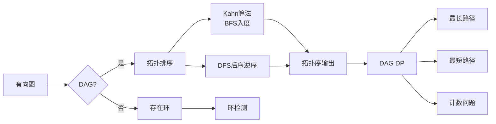

> 📊 **项目全面梳理**：详细的项目结构、模块详解和学习路径，请参阅 [`项目全面梳理-2025.md`](../../项目全面梳理-2025.md)

## 拓扑排序与 DAG DP / Topological Sort and DAG DP

### 摘要 / Executive Summary

- 拓扑排序是有向无环图（DAG）的核心算法，两种主流实现为 **Kahn 算法（BFS 入度法）** 与 **DFS 后序逆序**。拓扑序的存在性定理揭示了 DAG 与线性排序之间的深刻联系：$G$ 有拓扑序当且仅当 $G$ 是 DAG。
- 本文从 DAG 的形式化定义出发，建立入度、拓扑序与 Kahn 算法的完整正确性证明框架。通过 LeetCode 207（课程表）、210（课程表 II）、329（矩阵中的最长递增路径）三道经典题目，展示拓扑排序在环检测、排序输出与 DAG 上动态规划中的应用。
- 提供拓扑排序存在性定理的形式化证明、Kahn 算法正确性的归纳法证明，以及记忆化 DFS 与 DAG DP 的等价性分析。

### 关键术语与符号 / Glossary

| 术语 / Term | 定义 / Definition |
|-------------|-------------------|
| DAG 有向无环图 | 不存在有向环的有向图 |
| 入度 In-degree | 指向顶点 $v$ 的边数，记为 $deg^-(v)$ |
| 出度 Out-degree | 从顶点 $v$ 出发的边数，记为 $deg^+(v)$ |
| 拓扑排序 Topological Sort | DAG 顶点的线性排序 $(v_1, v_2, \ldots, v_n)$，使得对每条边 $(v_i, v_j) \in E$ 都有 $i < j$ |
| Kahn 算法 | 反复删除入度为 0 的顶点并输出，同时减少其邻居入度的拓扑排序算法 |
| 记忆化搜索 Memoization | 在 DFS 中缓存子问题结果，避免重复计算 |
| DAG DP | 在 DAG 上按拓扑序进行动态规划，利用无环性保证无后效性 |

术语对齐与引用规范：`docs/术语与符号总表.md`，`01-基础理论/00-撰写规范与引用指南.md`

### 目录 / Table of Contents

- [拓扑排序与 DAG DP / Topological Sort and DAG DP](#拓扑排序与-dag-dp--topological-sort-and-dag-dp)
  - [摘要 / Executive Summary](#摘要--executive-summary)
  - [关键术语与符号 / Glossary](#关键术语与符号--glossary)
  - [目录 / Table of Contents](#目录--table-of-contents)
  - [交叉引用与依赖 / Cross-References and Dependencies](#交叉引用与依赖--cross-references-and-dependencies)
- [1. 形式化定义 / Formal Definitions](#1-形式化定义--formal-definitions)
  - [1.1 DAG 的形式化定义](#11-dag-的形式化定义)
  - [1.2 拓扑序的形式化定义](#12-拓扑序的形式化定义)
- [2. 核心思路与算法框架 / Core Ideas and Algorithm Framework](#2-核心思路与算法框架--core-ideas-and-algorithm-framework)
  - [2.1 Kahn 算法（BFS 入度法）](#21-kahn-算法bfs-入度法)
  - [2.2 DFS 后序逆序法](#22-dfs-后序逆序法)
  - [2.3 记忆化 DFS = DAG DP](#23-记忆化-dfs--dag-dp)
- [3. 经典题目详解 / Classic Problem Analysis](#3-经典题目详解--classic-problem-analysis)
  - [3.1 LeetCode 207 — Course Schedule](#31-leetcode-207--course-schedule)
    - [形式化规约 / Formal Specification](#形式化规约--formal-specification)
    - [核心思路 / Core Idea](#核心思路--core-idea)
    - [代码实现 / Code Implementations](#代码实现--code-implementations)
    - [复杂度分析 / Complexity Analysis](#复杂度分析--complexity-analysis)
    - [正确性证明 / Correctness Proof](#正确性证明--correctness-proof)
  - [3.2 LeetCode 210 — Course Schedule II](#32-leetcode-210--course-schedule-ii)
    - [形式化规约 / Formal Specification](#形式化规约--formal-specification-1)
    - [核心思路 / Core Idea](#核心思路--core-idea-1)
    - [代码实现 / Code Implementations](#代码实现--code-implementations-1)
    - [复杂度分析 / Complexity Analysis](#复杂度分析--complexity-analysis-1)
  - [3.3 LeetCode 329 — Longest Increasing Path in a Matrix](#33-leetcode-329--longest-increasing-path-in-a-matrix)
    - [形式化规约 / Formal Specification](#形式化规约--formal-specification-2)
    - [核心思路 / Core Idea](#核心思路--core-idea-2)
    - [复杂度分析 / Complexity Analysis](#复杂度分析--complexity-analysis-2)
    - [正确性证明 / Correctness Proof](#正确性证明--correctness-proof-1)
- [4. 复杂度分析体系 / Complexity Analysis](#4-复杂度分析体系--complexity-analysis)
  - [4.1 拓扑排序算法复杂度](#41-拓扑排序算法复杂度)
  - [4.2 DAG DP 复杂度](#42-dag-dp-复杂度)
- [5. 正确性证明框架 / Correctness Proof Framework](#5-正确性证明框架--correctness-proof-framework)
  - [5.1 拓扑排序存在性定理](#51-拓扑排序存在性定理)
  - [5.2 Kahn 算法正确性证明](#52-kahn-算法正确性证明)
  - [5.3 记忆化 DFS 与 DAG DP 等价性](#53-记忆化-dfs-与-dag-dp-等价性)
- [6. 思维表征 / Thinking Representations](#6-思维表征--thinking-representations)
  - [6.1 概念依赖图](#61-概念依赖图)
  - [6.2 算法选择决策树](#62-算法选择决策树)
  - [6.3 多维矩阵对比：Kahn vs DFS 后序](#63-多维矩阵对比kahn-vs-dfs-后序)
  - [6.4 思维导图：拓扑排序与 DAG DP 体系](#64-思维导图拓扑排序与-dag-dp-体系)
- [7. 常见错误与反模式 / Common Mistakes and Anti-Patterns](#7-常见错误与反模式--common-mistakes-and-anti-patterns)
  - [7.1 Kahn 算法未更新入度](#71-kahn-算法未更新入度)
  - [7.2 DFS 环检测与拓扑排序混淆](#72-dfs-环检测与拓扑排序混淆)
  - [7.3 DAG DP 未按拓扑序处理](#73-dag-dp-未按拓扑序处理)
- [8. 自测问题 / Self-Assessment Questions](#8-自测问题--self-assessment-questions)
  - [问题 1：DAG 的入度为 0 顶点](#问题-1dag-的入度为-0-顶点)
  - [问题 2：拓扑排序不唯一性](#问题-2拓扑排序不唯一性)
  - [问题 3：记忆化 DFS 与一般 DFS 的区别](#问题-3记忆化-dfs-与一般-dfs-的区别)
- [9. 学习目标 / Learning Objectives](#9-学习目标--learning-objectives)
- [参考文献 / References](#参考文献--references)

### 交叉引用与依赖 / Cross-References and Dependencies

**上游理论依赖 / Upstream Dependencies**:

- [`09-算法理论/01-算法基础/05-图算法理论.md`](../../09-算法理论/01-算法基础/05-图算法理论.md) §2.3 — 拓扑排序的理论定义与 DFS 性质
- `09-算法理论/03-搜索算法/01-深度优先搜索.md` — DFS 的括号定理与完成时间
- `09-算法理论/03-搜索算法/03-广度优先搜索.md` — BFS 的层次遍历性质
- `05-图论专题/01-图的遍历（DFS-BFS-并查集）.md` — 图遍历基础与三色标记环检测

**下游应用 / Downstream Applications**:

- `05-图论专题/04-最小生成树（Prim-Kruskal）.md` — 某些 MST 变体可用拓扑排序预处理
- `05-图论专题/02-最短路径（Dijkstra-Bellman-Ford-SPFA）.md` — DAG 上的最短路径可用拓扑排序优化到 $O(V+E)$

---

## 1. 形式化定义 / Formal Definitions

### 1.1 DAG 的形式化定义

**定义 1.1** (有向环 / Directed Cycle)
有向图 $G = (V, E)$ 中的有向环是一个顶点序列 $(v_1, v_2, \ldots, v_k, v_1)$，其中 $k \geq 2$，且 $(v_i, v_{i+1}) \in E$ 对所有 $i \in [1, k-1]$ 成立，$(v_k, v_1) \in E$。

**定义 1.2** (DAG / Directed Acyclic Graph) [CLRS2022]
有向图 $G = (V, E)$ 称为有向无环图（DAG），当且仅当 $G$ 中不存在任何有向环。

**Definition 1.2** (DAG)
A directed graph $G = (V, E)$ is a directed acyclic graph (DAG) if and only if it contains no directed cycles.

### 1.2 拓扑序的形式化定义

**定义 1.3** (拓扑排序 / Topological Sort) [CLRS2022]
对于 DAG $G = (V, E)$，拓扑排序是顶点的一个线性排列 $(v_1, v_2, \ldots, v_n)$，满足：

$$
\forall (v_i, v_j) \in E: i < j
$$

即所有有向边均从前指向后。

**Definition 1.3** (Topological Sort)
A topological sort of a DAG $G = (V, E)$ is a linear ordering of its vertices such that for every directed edge $(u, v) \in E$, vertex $u$ comes before $v$ in the ordering.

---

## 2. 核心思路与算法框架 / Core Ideas and Algorithm Framework

### 2.1 Kahn 算法（BFS 入度法）

**适用场景 / Applicability**: 输出拓扑序、检测有向图中是否存在环。

```text
Kahn(G):
    in_degree[v] ← 计算所有顶点的入度
    queue ← 所有入度为 0 的顶点
    result ← []

    while queue ≠ ∅:
        v ← Dequeue(queue)
        result.append(v)
        for each neighbor u of v:
            in_degree[u] ← in_degree[u] - 1
            if in_degree[u] == 0:
                Enqueue(queue, u)

    if result.length < |V|:
        return "图中存在环"
    return result
```

**核心思想**: DAG 中必然存在至少一个入度为 0 的顶点（引理 5.1.1）。反复删除入度为 0 的顶点及其出边，剩余子图仍为 DAG。若最终所有顶点均被删除，则得到一个拓扑序；若剩余顶点均入度 $> 0$，则存在环。

> 关于 BFS 的详细性质，参见 `09-算法理论/03-搜索算法/03-广度优先搜索.md`。

### 2.2 DFS 后序逆序法

**适用场景 / Applicability**: 仅需拓扑序输出，或结合其他 DFS 应用。

```text
TopologicalSort-DFS(G):
    visited[v] ← false for all v
    stack ← []

    for each vertex v ∈ V:
        if not visited[v]:
            DFS-Visit(G, v, visited, stack)

    return reverse(stack)

DFS-Visit(G, v, visited, stack):
    visited[v] ← true
    for each neighbor u of v:
        if not visited[u]:
            DFS-Visit(G, u, visited, stack)
    stack.push(v)        // 后序：所有邻居处理完毕后才入栈
```

**核心思想**: DFS 的完成时间（finish time）具有"后代先完成"的性质。对于边 $(u, v)$，$v$ 是 $u$ 的后代，因此 $v$ 的完成时间早于 $u$。按完成时间逆序排列，即可保证所有边从前指向后。

### 2.3 记忆化 DFS = DAG DP

**适用场景 / Applicability**: DAG 上的最长/最短路径、计数、状态转移等问题。

**核心思想**: DAG 的无环性保证了 DFS 不会陷入无限递归。若在 DFS 中缓存每个顶点的计算结果（记忆化），则等价于按逆拓扑序进行动态规划。

```text
Memoized-DFS(G, v, memo):
    if memo[v] ≠ undefined:
        return memo[v]

    result ← base_case(v)
    for each neighbor u of v:
        result ← combine(result, Memoized-DFS(G, u, memo))

    memo[v] ← result
    return result
```

**等价性分析**: 在 DAG 中，DFS 的递归树天然遵循拓扑序的逆序（先处理后代再处理祖先）。记忆化缓存消除了重复子问题，使得每个顶点仅被计算一次。这与"先拓扑排序，再按序递推"的 DAG DP 完全等价。

---

## 3. 经典题目详解 / Classic Problem Analysis

### 3.1 LeetCode 207 — Course Schedule

> **题目链接 / Problem Link**: [LeetCode 207. Course Schedule](https://leetcode.com/problems/course-schedule/)
> **难度 / Difficulty**: Medium

#### 形式化规约 / Formal Specification

**前置条件 / Precondition**:

$$
n \in [1, 2000], \quad \textit{prerequisites}.length \in [0, 5000]
$$

先修关系构成有向图 $G = (V, E)$，$V = \{0, 1, \ldots, n-1\}$，边 $(b, a)$ 表示"必须先修 $b$ 才能修 $a$"。

**后置条件 / Postcondition**:

$$
\text{result} = \text{True} \iff G \text{ 是 DAG}
$$

即当且仅当课程依赖图中不存在环时，可以完成所有课程。

#### 核心思路 / Core Idea

本题是**DAG 环检测**的经典模型。两种方法均可解决：

| 方法 | 核心思想 | 时间复杂度 | 空间复杂度 |
|------|---------|-----------|-----------|
| **Kahn 算法** | 拓扑排序：若输出顶点数 $< n$，则存在环 | $O(V + E)$ | $O(V + E)$ |
| **DFS 三色标记** | DFS 中遇到灰色顶点（正在处理的祖先）即存在环 | $O(V + E)$ | $O(V)$ |

**Kahn 算法**在面试中更易解释，且天然可扩展为输出拓扑序（LC 210）。

#### 代码实现 / Code Implementations

- **Rust**: [`examples/algorithms/src/leetcode/lc0207_course_schedule.rs`](../../../examples/algorithms/src/leetcode/lc0207_course_schedule.rs)
- **Python**: [`examples/algorithms-python/src/leetcode/lc0207_course_schedule.py`](../../../examples/algorithms-python/src/leetcode/lc0207_course_schedule.py)
- **Go**: [`examples/algorithms-go/leetcode/lc0207_course_schedule.go`](../../../examples/algorithms-go/leetcode/lc0207_course_schedule.go)

#### 复杂度分析 / Complexity Analysis

| 指标 / Metric | Kahn | DFS 三色 |
|--------------|------|---------|
| 时间复杂度 / Time | $O(V + E)$ | $O(V + E)$ |
| 空间复杂度 / Space | $O(V + E)$ | $O(V)$ |
| 输出拓扑序 | 可直接输出 | 需后处理 |
| 代码简洁度 | ⭐⭐⭐⭐ | ⭐⭐⭐⭐⭐ |

#### 正确性证明 / Correctness Proof

**定理 3.1.1** (LeetCode 207 正确性): Kahn 算法返回 True 当且仅当课程图是 DAG。

**证明 / Proof**:

**充分性** ($\Leftarrow$): 若算法输出 $n$ 个顶点，则所有顶点均被删除。每次删除的是入度为 0 的顶点，删除操作不引入新环。最终空图无环，故原图无环。

**必要性** ($\Rightarrow$): 若图是 DAG，由引理 5.1.1，DAG 中必存在入度为 0 的顶点。Kahn 算法可删除该顶点，剩余子图仍为 DAG。重复此过程，最终所有顶点均可被删除，输出 $n$ 个顶点。

因此算法返回 True 当且仅当图是 DAG。$\square$

---

### 3.2 LeetCode 210 — Course Schedule II

> **题目链接 / Problem Link**: [LeetCode 210. Course Schedule II](https://leetcode.com/problems/course-schedule-ii/)
> **难度 / Difficulty**: Medium

#### 形式化规约 / Formal Specification

**前置条件 / Precondition**: 同 LeetCode 207。

**后置条件 / Postcondition**:

$$
\text{result} = \begin{cases}
\text{一个合法的拓扑排序}, & \text{if } G \text{ 是 DAG} \\
[], & \text{otherwise}
\end{cases}
$$

#### 核心思路 / Core Idea

本题是 LeetCode 207 的直接扩展：不仅需要检测环，还需要**输出一个合法的修课顺序**（拓扑序）。

Kahn 算法天然适合：若成功输出 $n$ 个顶点，则该顺序即为拓扑序；若输出不足 $n$ 个，返回空数组。

#### 代码实现 / Code Implementations

- **Rust**: [`examples/algorithms/src/leetcode/lc0210_course_schedule_ii.rs`](../../../examples/algorithms/src/leetcode/lc0210_course_schedule_ii.rs)
- **Python**: [`examples/algorithms-python/src/leetcode/lc0210_course_schedule_ii.py`](../../../examples/algorithms-python/src/leetcode/lc0210_course_schedule_ii.py)

#### 复杂度分析 / Complexity Analysis

| 指标 / Metric | 值 / Value |
|--------------|-----------|
| 时间复杂度 / Time | $O(V + E)$ |
| 空间复杂度 / Space | $O(V + E)$ |

---

### 3.3 LeetCode 329 — Longest Increasing Path in a Matrix

> **题目链接 / Problem Link**: [LeetCode 329. Longest Increasing Path in a Matrix](https://leetcode.com/problems/longest-increasing-path-in-a-matrix/)
> **难度 / Difficulty**: Hard

#### 形式化规约 / Formal Specification

**前置条件 / Precondition**:

$$
\textit{matrix} \in \mathbb{Z}^{m \times n}, \quad m, n \in [1, 200]
$$

**后置条件 / Postcondition**:

$$
\text{result} = \max_{P} |P|
$$

其中 $P$ 是矩阵中的递增路径（每步向四邻域移动，且值严格递增）。

#### 核心思路 / Core Idea

本题的关键是将矩阵转化为**有向图**：从较小值向较大值连边。由于路径要求严格递增，此图必然是无环的（值严格递增无法回到起点），即**DAG**。

问题转化为：在 DAG 中求**最长路径**。

**解法：记忆化 DFS**

```text
LIP(matrix, i, j, memo):
    if memo[i][j] ≠ 0: return memo[i][j]

    max_len ← 1
    for each neighbor (ni, nj) of (i, j):
        if matrix[ni][nj] > matrix[i][j]:
            max_len ← max(max_len, 1 + LIP(matrix, ni, nj, memo))

    memo[i][j] ← max_len
    return max_len
```

**DAG DP 等价视角**: 该记忆化 DFS 等价于在 DAG 上按拓扑序（值从小到大）进行动态规划：

$$
dp[v] = 1 + \max_{(v, u) \in E} dp[u]
$$

其中 $dp[v]$ 表示从 $v$ 出发的最长递增路径长度。

#### 复杂度分析 / Complexity Analysis

| 指标 / Metric | 值 / Value | 说明 / Note |
|--------------|-----------|------------|
| 时间复杂度 / Time | $O(mn)$ | 每个格子计算一次，每个方向最多递归一次 |
| 空间复杂度 / Space | $O(mn)$ | 记忆化缓存 + 递归栈 |

#### 正确性证明 / Correctness Proof

**定理 3.3.1** (LeetCode 329 正确性): 记忆化 DFS 返回矩阵中最长递增路径的长度。

**证明 / Proof**:

**引理 3.3.1** (DAG 性质): 从较小值指向较大值的有向图中不存在环。

**证明**: 假设存在环 $v_1 \rightarrow v_2 \rightarrow \cdots \rightarrow v_k \rightarrow v_1$。由边的定义，$val(v_1) < val(v_2) < \cdots < val(v_k) < val(v_1)$，矛盾。$\square$

**引理 3.3.2** (子问题最优性): 设 $L(v)$ 为从 $v$ 出发的最长递增路径长度，则：

$$
L(v) = 1 + \max_{(v, u) \in E} L(u)
$$

**证明**: 从 $v$ 出发的第一步必然走向某个邻居 $u$（满足 $val(u) > val(v)$）。最优路径的第一步必然选择使 $L(u)$ 最大的邻居。$\square$

**主定理**: 记忆化 DFS 按照递归深度优先的顺序计算 $L(v)$。由引理 3.3.1，递归必终止。由引理 3.3.2，每次计算均正确。记忆化确保每个 $L(v)$ 仅计算一次。最终对所有 $v$ 取最大值，即为全局最长递增路径。$\square$

---

## 4. 复杂度分析体系 / Complexity Analysis

### 4.1 拓扑排序算法复杂度

| 算法 | 时间复杂度 | 空间复杂度 | 适用场景 | 输出拓扑序 |
|------|-----------|-----------|---------|-----------|
| Kahn | $O(V + E)$ | $O(V + E)$ | BFS 风格，易并行 | 正向输出 |
| DFS 后序 | $O(V + E)$ | $O(V)$ | 递归风格，结合其他 DFS | 逆序输出 |

### 4.2 DAG DP 复杂度

对于 DAG $G = (V, E)$，按拓扑序进行动态规划：

- **时间复杂度**: $O(V + E)$（每个顶点和边处理一次）
- **空间复杂度**: $O(V)$（DP 状态数组）

这比在一般图上使用 Bellman-Ford ($O(VE)$) 或 Dijkstra ($O((V+E)\log V)$) 更高效。

---

## 5. 正确性证明框架 / Correctness Proof Framework

### 5.1 拓扑排序存在性定理

**定理 5.1** (拓扑排序存在性) [CLRS2022]
有向图 $G$ 存在拓扑排序当且仅当 $G$ 是 DAG。

**证明 / Proof**:

**必要性** ($\Rightarrow$): 假设 $G$ 存在拓扑排序 $(v_1, v_2, \ldots, v_n)$，但 $G$ 中存在环 $c = (u_1, u_2, \ldots, u_k, u_1)$。

设 $u_i$ 在拓扑序中的位置为 $p(u_i)$。由拓扑序定义，对环上的每条边 $(u_j, u_{j+1})$，有 $p(u_j) < p(u_{j+1})$。因此：

$$
p(u_1) < p(u_2) < \cdots < p(u_k) < p(u_1)
$$

矛盾。故 $G$ 无环，即 $G$ 是 DAG。

**充分性** ($\Leftarrow$): 设 $G$ 是 DAG，证明存在拓扑排序。

**引理 5.1.1**: DAG 中至少存在一个入度为 0 的顶点。

**证明**: 反证法。假设所有顶点入度均 $> 0$。从任意顶点出发，沿入边反向行走。由于入度均 $> 0$，此过程可无限进行。但顶点有限，由鸽巢原理必重复访问某顶点，形成有向环，与 DAG 定义矛盾。$\square$

**主定理证明**: 由引理 5.1.1，取入度为 0 的顶点 $v_1$ 作为拓扑序的第一个顶点。删除 $v_1$ 及其出边后，剩余子图仍为 DAG（删除操作不引入环）。重复此过程，可得到完整的拓扑排序 $(v_1, v_2, \ldots, v_n)$。$\square$

### 5.2 Kahn 算法正确性证明

**定理 5.2** (Kahn 算法正确性)
对于 DAG $G = (V, E)$，Kahn 算法输出一个合法的拓扑排序。

**证明 / Proof**:

**循环不变式 / Loop Invariant**:

在每次循环迭代开始时：

1. 队列中的顶点入度均为 0。
2. `result` 中已有的顶点构成一个合法的拓扑序前缀。
3. 剩余未处理的顶点及它们之间的边构成一个 DAG。

**初始化**: 初始时队列包含所有入度为 0 的顶点。`result` 为空，空序列是合法前缀。剩余子图即原图，是 DAG。不变式成立。

**保持**: 设当前从队列取出顶点 $v$。由不变式，$v$ 的入度为 0，即不存在指向 $v$ 的未处理边。因此将 $v$ 追加到 `result` 后，仍满足拓扑序定义（所有指向 $v$ 的边均来自已处理顶点）。

删除 $v$ 及其出边后，更新邻居入度。若有邻居入度变为 0，则入队。剩余子图仍为 DAG（删除不引入环）。不变式保持。

**终止**: 循环终止时，若 `result` 包含 $n$ 个顶点，则得到一个完整的拓扑排序。若不足 $n$ 个，说明剩余顶点入度均 $> 0$，即存在环，算法正确报告图中无拓扑序。

### 5.3 记忆化 DFS 与 DAG DP 等价性

**定理 5.3** (记忆化 DFS = DAG DP)
在 DAG 上，记忆化 DFS 与按拓扑序递推的动态规划计算相同的最终结果。

**证明 / Proof**:

设 DAG 的拓扑序为 $(v_1, v_2, \ldots, v_n)$。对于任意顶点 $v_i$，其所有出边邻居 $u$ 满足 $v_i$ 在拓扑序中位于 $u$ 之前（不对，应该是入边邻居在拓扑序中位于 $v_i$ 之前）。

更正：对于边 $(v_i, v_j)$，有 $i < j$。因此 $v_i$ 的**后代**在拓扑序中均位于 $v_i$ 之后。

DFS 从 $v_i$ 出发，会递归处理所有可达后代。由于 DAG 无环，递归必终止。记忆化确保每个顶点仅被计算一次。

按拓扑序的**逆序** $(v_n, v_{n-1}, \ldots, v_1)$ 递推时，处理 $v_i$ 时其所有后代 $v_j$（$j > i$）已处理完毕，可直接使用它们的 DP 值。

DFS 的递归完成顺序恰好是拓扑序的逆序（后代先完成）。因此记忆化 DFS 的计算顺序与逆拓扑序 DP 完全一致，两者等价。$\square$

---

## 6. 思维表征 / Thinking Representations

### 6.1 概念依赖图



### 6.2 算法选择决策树

```mermaid
flowchart TD
    Start[有向图问题] --> Q1{需要排序？}
    Q1 -->|是| Q2{图是DAG？}
    Q1 -->|否| Q3{需要最长/短路径？}

    Q2 -->|是| A1[拓扑排序<br/>Kahn / DFS]
    Q2 -->|未知| A2[Kahn算法<br/>输出数&lt;V则有环]

    Q3 -->|是| Q4{图是DAG？}
    Q3 -->|否| A3[其他算法]

    Q4 -->|是| A4[DAG DP<br/>O(V+E)]
    Q4 -->|否| A5[Bellman-Ford<br/>O(VE)]

    style A1 fill:#e1f5e1
    style A2 fill:#e1f5e1
    style A4 fill:#e1f5e1
```

### 6.3 多维矩阵对比：Kahn vs DFS 后序

| 维度 / Dimension | Kahn 算法 | DFS 后序 |
|----------------|----------|---------|
| **核心数据结构** | 队列 + 入度数组 | 递归栈 + 访问标记 |
| **时间复杂度** | $O(V + E)$ | $O(V + E)$ |
| **空间复杂度** | $O(V + E)$ | $O(V)$ |
| **输出顺序** | 正向拓扑序 | 逆序后处理 |
| **环检测** | 输出顶点数 $< V$ | 遇到灰色顶点 |
| **代码复杂度** | 略高（需入度管理） | 简洁 |
| **并行化** | 易（多层入度为0可同时处理） | 难 |

### 6.4 思维导图：拓扑排序与 DAG DP 体系

```mermaid
mindmap
  root((拓扑排序与DAG DP))
    拓扑排序
      存在性定理
        DAG ⟺ 有拓扑序
      Kahn算法
        入度为0入队
        删除出边
        更新入度
      DFS后序
        完成时间
        逆序输出
      应用
        环检测
        任务调度
        编译顺序
    DAG DP
      记忆化DFS
        无环保证终止
        缓存避免重复
      拓扑序递推
        先序处理依赖
        O(V+E)高效
      应用
        最长递增路径
        DAG最短路径
        方案计数
```

---

## 7. 常见错误与反模式 / Common Mistakes and Anti-Patterns

### 7.1 Kahn 算法未更新入度

**错误 / Mistake**: 删除顶点后未将其邻居的入度减 1，导致错误地判断存在环。

**修复 / Fix**: 必须显式维护入度数组，每次删除顶点时遍历其所有出边邻居，将入度减 1。

### 7.2 DFS 环检测与拓扑排序混淆

**错误 / Mistake**: 在 DFS 拓扑排序中，仅使用二色标记（visited/unvisited），无法区分"正在处理"和"已处理完成"的顶点，导致无法正确检测环。

**修复 / Fix**: 使用三色标记：

- 白色 = 未访问
- 灰色 = 正在处理（当前递归栈中）
- 黑色 = 已处理完成

遇到灰色顶点即说明存在环。

### 7.3 DAG DP 未按拓扑序处理

**错误 / Mistake**: 在 DAG 上直接递推，但未确保处理顶点时其所有前驱已计算完毕。

**修复 / Fix**: 要么使用记忆化 DFS（递归天然保证），要么先显式进行拓扑排序，再按拓扑序递推。

---

## 8. 自测问题 / Self-Assessment Questions

### 问题 1：DAG 的入度为 0 顶点

**Q**: 为什么 DAG 中必然存在入度为 0 的顶点？

**A**: 反证法。假设 DAG 中所有顶点入度均 $> 0$。从任意顶点出发，沿入边反向行走。由于每个顶点都有入边，此过程可无限进行。但顶点有限，必重复访问某顶点，形成有向环，与 DAG 定义矛盾。因此 DAG 中至少存在一个入度为 0 的顶点。

### 问题 2：拓扑排序不唯一性

**Q**: 一个 DAG 的拓扑排序是否唯一？

**A**: 不一定。当图中存在多个入度为 0 的顶点时，它们的输出顺序可以任意交换。例如，两个互不连接的顶点 $a$ 和 $b$，$(a, b)$ 和 $(b, a)$ 都是合法的拓扑排序。

### 问题 3：记忆化 DFS 与一般 DFS 的区别

**Q**: 记忆化 DFS 为什么能将指数复杂度降为线性？

**A**: 在 DAG 中，从不同源点出发的 DFS 可能重复访问同一子图。记忆化缓存确保每个顶点仅被计算一次，将重复子问题的指数级爆炸消除，时间复杂度降为 $O(V + E)$。

---

## 9. 学习目标 / Learning Objectives

完成本章学习后，读者应能够：

1. **形式化描述** DAG 与拓扑排序的定义，理解存在性定理的充要条件。
2. **熟练运用** Kahn 算法和 DFS 后序法实现拓扑排序，并能检测有向图中的环。
3. **独立推导** Kahn 算法和拓扑排序存在性定理的正确性证明。
4. **将记忆化 DFS 与 DAG DP 等价转换**，解决 DAG 上的最长/最短路径问题。
5. **识别并避免**拓扑排序和 DAG DP 中的常见实现错误。

---

## 参考文献 / References

- [CLRS2022] Cormen, T. H., et al. *Introduction to Algorithms* (4th ed.). MIT Press, 2022. §22 图的基本算法
- [Sedgewick2011] Sedgewick, R. & Wayne, K. *Algorithms* (4th ed.). Addison-Wesley, 2011. §4.2 有向图
- [Kahn1962] Kahn, A. B. (1962). "Topological sorting of large networks." *Communications of the ACM*, 5(11), 558-562.
- LeetCode 207, 210, 329 官方题解

---

> 📚 **返回目录**: [LeetCode算法面试专题](../README.md)

<!-- 自动添加的代码引用 -->
- [`lc0207_course_schedule.py`](../../../examples/algorithms-python/leetcode/lc0207_course_schedule.py)

<!-- 自动添加的代码引用 -->
- [`lc0207_course_schedule.lean`](../../../examples/lean_proofs/FormalAlgorithm/leetcode/lc0207_course_schedule.lean)
