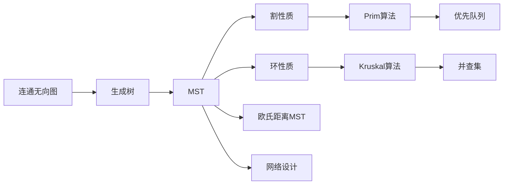
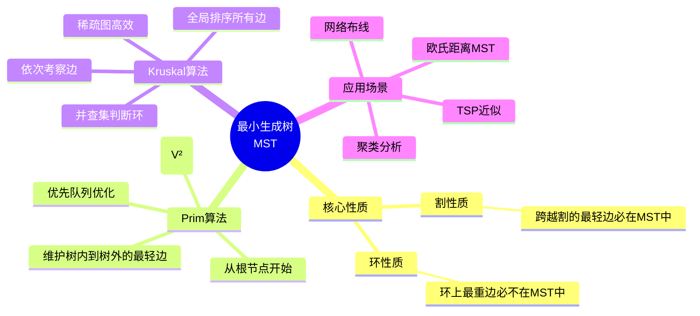

> 📊 **项目全面梳理**：详细的项目结构、模块详解和学习路径，请参阅 [`项目全面梳理-2025.md`](../../项目全面梳理-2025.md)

## 最小生成树（Prim / Kruskal）/ Minimum Spanning Tree

### 摘要 / Executive Summary

- 最小生成树（MST）是连接图中所有顶点的边权之和最小的无环连通子图，是网络设计、聚类分析与近似算法的核心工具。本文聚焦两种经典算法：**Prim**（从单点扩展，优先队列）与 **Kruskal**（全局选边，并查集），两者分别基于割性质与环性质，均为贪心算法的典范。
- 通过 LeetCode 1584（连接所有点的最小费用）与 1135（最低成本联通所有城市）两道经典题目，展示 Prim 与 Kruskal 在欧氏距离 MST 与通用 MST 场景下的应用与选型策略。
- 提供 Prim 正确性的割性质证明、Kruskal 正确性的环性质证明，以及两者在时间与空间复杂度上的详细对比。

### 关键术语与符号 / Glossary

| 术语 / Term | 定义 / Definition |
|-------------|-------------------|
| 生成树 Spanning Tree | 包含图中所有顶点的无环连通子图，恰好含 $\|V\|-1$ 条边 |
| MST 最小生成树 | 边权之和最小的生成树，记为 $T^*$ |
| 割 Cut | 将顶点集 $V$ 划分为两个非空子集 $(S, V \setminus S)$ |
| 割性质 Cut Property | 对于任意割，跨越割的最轻边必属于某棵 MST |
| 环性质 Cycle Property | 对于任意环，环上最重的边不属于任何 MST |
| 安全边 Safe Edge | 可以被加入当前生成森林而不破坏 MST 存在性的边 |
| 并查集 Union-Find | 维护动态连通性的数据结构，支持 $O(\alpha(n))$ 合并与查询 |
| 欧氏距离 Euclidean Distance | 平面上两点 $(x_1, y_1)$ 与 $(x_2, y_2)$ 的距离 $\sqrt{(x_1-x_2)^2 + (y_1-y_2)^2}$ |

术语对齐与引用规范：`docs/术语与符号总表.md`，`01-基础理论/00-撰写规范与引用指南.md`

### 目录 / Table of Contents

- [最小生成树（Prim / Kruskal）/ Minimum Spanning Tree](#最小生成树prim--kruskal-minimum-spanning-tree)
  - [摘要 / Executive Summary](#摘要--executive-summary)
  - [关键术语与符号 / Glossary](#关键术语与符号--glossary)
  - [目录 / Table of Contents](#目录--table-of-contents)
  - [交叉引用与依赖 / Cross-References and Dependencies](#交叉引用与依赖--cross-references-and-dependencies)
- [1. 形式化定义 / Formal Definitions](#1-形式化定义--formal-definitions)
  - [1.1 生成树的形式化定义](#11-生成树的形式化定义)
  - [1.2 割与环的性质](#12-割与环的性质)
- [2. 核心思路与算法框架 / Core Ideas and Algorithm Framework](#2-核心思路与算法框架--core-ideas-and-algorithm-framework)
  - [2.1 Prim 算法框架](#21-prim-算法框架)
  - [2.2 Kruskal 算法框架](#22-kruskal-算法框架)
- [3. 经典题目详解 / Classic Problem Analysis](#3-经典题目详解--classic-problem-analysis)
  - [3.1 LeetCode 1584 — Min Cost to Connect All Points](#31-leetcode-1584--min-cost-to-connect-all-points)
    - [形式化规约 / Formal Specification](#形式化规约--formal-specification)
    - [核心思路 / Core Idea](#核心思路--core-idea)
    - [代码实现 / Code Implementations](#代码实现--code-implementations)
    - [复杂度分析 / Complexity Analysis](#复杂度分析--complexity-analysis)
    - [正确性证明 / Correctness Proof](#正确性证明--correctness-proof)
  - [3.2 LeetCode 1135 — Connecting Cities With Minimum Cost](#32-leetcode-1135--connecting-cities-with-minimum-cost)
    - [形式化规约 / Formal Specification](#形式化规约--formal-specification-1)
    - [核心思路 / Core Idea](#核心思路--core-idea-1)
    - [代码实现 / Code Implementations](#代码实现--code-implementations-1)
    - [复杂度分析 / Complexity Analysis](#复杂度分析--complexity-analysis-1)
    - [正确性证明 / Correctness Proof](#正确性证明--correctness-proof-1)
- [4. 复杂度分析体系 / Complexity Analysis](#4-复杂度分析体系--complexity-analysis)
  - [4.1 Prim 与 Kruskal 复杂度对比](#41-prim-与-kruskal-复杂度对比)
  - [4.2 算法选型决策](#42-算法选型决策)
- [5. 正确性证明框架 / Correctness Proof Framework](#5-正确性证明框架--correctness-proof-framework)
  - [5.1 Prim 正确性证明（割性质）](#51-prim-正确性证明割性质)
  - [5.2 Kruskal 正确性证明（环性质）](#52-kruskal-正确性证明环性质)
- [6. 思维表征 / Thinking Representations](#6-思维表征--thinking-representations)
  - [6.1 概念依赖图](#61-概念依赖图)
  - [6.2 多维矩阵对比：Prim vs Kruskal](#62-多维矩阵对比prim-vs-kruskal)
  - [6.3 思维导图：MST 算法体系](#63-思维导图mst-算法体系)
- [7. 常见错误与反模式 / Common Mistakes and Anti-Patterns](#7-常见错误与反模式--common-mistakes-and-anti-patterns)
  - [7.1 Prim 算法初始化错误](#71-prim-算法初始化错误)
  - [7.2 Kruskal 并查集未路径压缩](#72-kruskal-并查集未路径压缩)
  - [7.3 图不连通的边界处理](#73-图不连通的边界处理)
- [8. 自测问题 / Self-Assessment Questions](#8-自测问题--self-assessment-questions)
  - [问题 1：割性质的应用](#问题-1割性质的应用)
  - [问题 2：环性质的反证](#问题-2环性质的反证)
  - [问题 3：Prim 与 Dijkstra 的区别](#问题-3prim-与-dijkstra-的区别)
- [9. 学习目标 / Learning Objectives](#9-学习目标--learning-objectives)
- [参考文献 / References](#参考文献--references)

### 交叉引用与依赖 / Cross-References and Dependencies

**上游理论依赖 / Upstream Dependencies**:

- [`09-算法理论/01-算法基础/05-图算法理论.md`](../../09-算法理论/01-算法基础/05-图算法理论.md) §4 — 最小生成树的理论定义、割性质与环性质
- `05-图论专题/01-图的遍历（DFS-BFS-并查集）.md` — 并查集数据结构与 Kruskal 算法的关系
- `05-图论专题/02-最短路径（Dijkstra-Bellman-Ford-SPFA）.md` — Prim 与 Dijkstra 的结构相似性

**下游应用 / Downstream Applications**:

- `05-图论专题/03-拓扑排序与DAG DP.md` — 某些近似算法结合 MST 与 DAG 技术
- 聚类分析（单链接聚类）、网络设计、旅行商问题近似算法

---

## 1. 形式化定义 / Formal Definitions

### 1.1 生成树的形式化定义

**定义 1.1** (生成树 / Spanning Tree) [CLRS2022]
对于连通无向图 $G = (V, E)$，生成树 $T$ 是 $E$ 的一个子集，满足：

1. $T$ 连通所有顶点（$(V, T)$ 是连通图）
2. $T$ 无环（$(V, T)$ 是无环图）
3. $|T| = |V| - 1$

**Definition 1.1** (Spanning Tree)
A spanning tree $T$ of a connected undirected graph $G = (V, E)$ is a subset of $E$ such that $(V, T)$ is connected, acyclic, and contains exactly $|V| - 1$ edges.

**定义 1.2** (最小生成树 / Minimum Spanning Tree)
对于带权连通无向图 $G = (V, E)$，$w: E \rightarrow \mathbb{R}$，MST 是边权之和最小的生成树：

$$
T^* = \arg\min_{T \text{ 是生成树}} \sum_{e \in T} w(e)
$$

### 1.2 割与环的性质

**定义 1.3** (割 / Cut)
图 $G = (V, E)$ 的一个割 $(S, V \setminus S)$ 是将顶点集划分为两个非空子集。边 $(u, v)$ **跨越割**如果 $u \in S$ 且 $v \in V \setminus S$（或反之）。

**定理 1.1** (割性质 / Cut Property) [CLRS2022]
设 $(S, V \setminus S)$ 是图 $G$ 的任意割，$e = (u, v)$ 是跨越该割的边中权重最小的一条。则 $e$ 属于某棵最小生成树。

**定理 1.2** (环性质 / Cycle Property) [CLRS2022]
设 $C$ 是图 $G$ 中的任意环，$e$ 是 $C$ 上权重最大的边。则 $e$ 不属于任何最小生成树。

---

## 2. 核心思路与算法框架 / Core Ideas and Algorithm Framework

### 2.1 Prim 算法框架

**适用条件 / Applicability**: 稠密图、需要逐步构建树的场景。

```text
Prim(G, w, r):
    // r 为根顶点
    for each u ∈ V:
        key[u] ← ∞
        parent[u] ← NIL
    key[r] ← 0
    Q ← V                          // 优先队列，按 key 排序

    while Q ≠ ∅:
        u ← Extract-Min(Q)
        for each v ∈ Adj[u]:
            if v ∈ Q and w(u,v) < key[v]:
                parent[v] ← u
                key[v] ← w(u,v)    // Decrease-Key
```

**核心思想**: 从单个顶点开始，维护一棵部分构建的树。每次从"树内顶点"到"树外顶点"的跨越边中选择权重最小的一条，将对应顶点加入树中。

> **与 Dijkstra 的对比**: Prim 和 Dijkstra 结构几乎相同，区别在于：
>
> - Dijkstra 的 `key[v]` 是从源点到 $v$ 的路径权重之和。
> - Prim 的 `key[v]` 是从树内顶点到 $v$ 的最轻边的权重。

### 2.2 Kruskal 算法框架

**适用条件 / Applicability**: 稀疏图、边已排序或易于排序的场景。

```text
Kruskal(G, w):
    A ← ∅                          // 结果边集
    for each v ∈ V:
        Make-Set(v)

    sort edges of E by weight in non-decreasing order
    for each (u, v) in sorted edges:
        if Find-Set(u) ≠ Find-Set(v):
            A ← A ∪ {(u, v)}
            Union(u, v)
    return A
```

**核心思想**: 按边权从小到大排序，依次考察每条边。若边的两个端点不在同一连通分量中（不形成环），则将该边加入 MST；否则跳过（由环性质，这条边是环上最重的边，不会在任何 MST 中）。

> 关于并查集的详细实现与复杂度分析，参见 `05-图论专题/01-图的遍历（DFS-BFS-并查集）.md` §2.3。

---

## 3. 经典题目详解 / Classic Problem Analysis

### 3.1 LeetCode 1584 — Min Cost to Connect All Points

> **题目链接 / Problem Link**: [LeetCode 1584. Min Cost to Connect All Points](https://leetcode.com/problems/min-cost-to-connect-all-points/)
> **难度 / Difficulty**: Medium

#### 形式化规约 / Formal Specification

**前置条件 / Precondition**:

$$
\textit{points} \in \mathbb{Z}^{n \times 2}, \quad n \in [1, 1000]
$$

**后置条件 / Postcondition**:

$$
\text{result} = \min_{T \text{ 是生成树}} \sum_{(i,j) \in T} |x_i - x_j| + |y_i - y_j|
$$

注意题目中使用的是**曼哈顿距离**而非欧氏距离。

#### 核心思路 / Core Idea

本题是 MST 的直接应用：将每个点视为顶点，点之间的曼哈顿距离视为边权，求 MST 的总权重。

**算法选型**:

- **Prim**: $O(V^2)$（稠密图，$E = O(V^2)$，无需显式建所有边）。
- **Kruskal**: $O(E \log E) = O(V^2 \log V)$（需先枚举所有边并排序）。

对于 $n \leq 1000$，$V^2 = 10^6$，Prim 的 $O(V^2)$ 更优。

**Prim 优化**: 稠密图 Prim 可用数组代替优先队列，每次线性扫描找最小 key，总复杂度 $O(V^2)$。

#### 代码实现 / Code Implementations

- **Rust**: [`examples/algorithms/src/leetcode/lc1584_min_cost_to_connect_all_points.rs`](../../../../examples/algorithms/src/leetcode/lc1584_min_cost_to_connect_all_points.rs)

#### 复杂度分析 / Complexity Analysis

| 指标 / Metric | Prim (数组) | Kruskal |
|--------------|------------|---------|
| 时间复杂度 / Time | $O(n^2)$ | $O(n^2 \log n)$ |
| 空间复杂度 / Space | $O(n)$ | $O(n^2)$ |
| 建图开销 | 无需显式建图 | 需枚举所有边 |

#### 正确性证明 / Correctness Proof

**定理 3.1.1** (LeetCode 1584 正确性): MST 的总权重等于连接所有点的最小总费用。

**证明 / Proof**:

将点集视为完全图 $K_n$，边权为曼哈顿距离。问题转化为在 $K_n$ 上求 MST。

由 MST 定义，$T^*$ 是边权之和最小的连通无环子图。连通性保证所有点相互可达（费用可传递），无环性保证不存在冗余边。因此 $T^*$ 的权重即为最小总费用。$\square$

---

### 3.2 LeetCode 1135 — Connecting Cities With Minimum Cost

> **题目链接 / Problem Link**: [LeetCode 1135. Connecting Cities With Minimum Cost](https://leetcode.com/problems/connecting-cities-with-minimum-cost/)
> **难度 / Difficulty**: Medium

#### 形式化规约 / Formal Specification

**前置条件 / Precondition**:

$$
n \in [1, 10000], \quad \textit{connections}.length \in [1, n(n-1)/2]
$$

每条连接 $(u, v, cost)$ 表示城市 $u$ 和 $v$ 之间可修建费用为 $cost$ 的道路。

**后置条件 / Postcondition**:

$$
\text{result} = \begin{cases}
\min_{T \text{ 是生成树}} \sum_{e \in T} w(e), & \text{if 图连通} \\
-1, & \text{otherwise}
\end{cases}
$$

即连接所有城市的最小总费用；若无法连通所有城市，返回 -1。

#### 核心思路 / Core Idea

本题是 MST 的标准模板题。由于输入直接给出边列表，**Kruskal 算法**最为自然：

1. 按费用对所有边排序。
2. 依次遍历边，用并查集判断是否形成环。
3. 若不形成环，加入 MST，累计费用。
4. 最终检查 MST 中边数是否为 $n-1$。

#### 代码实现 / Code Implementations

Kruskal 算法可直接在面试中手写，无需额外代码文件引用。

#### 复杂度分析 / Complexity Analysis

| 指标 / Metric | 值 / Value |
|--------------|-----------|
| 时间复杂度 / Time | $O(E \log E)$ | 边排序 + 并查集操作 |
| 空间复杂度 / Space | $O(E)$ | 边列表 + 并查集数组 |

#### 正确性证明 / Correctness Proof

**定理 3.2.1** (LeetCode 1135 正确性): Kruskal 算法返回连接所有城市的最小总费用，若无法连通则返回 -1。

**证明 / Proof**:

由 §5.2 的 Kruskal 正确性定理，Kruskal 算法正确返回 MST（若图连通）。MST 的边权之和即为连接所有顶点的最小费用。

若算法结束后加入 MST 的边数 $< n-1$，说明图不连通（并查集的连通分量数 $> 1$），不存在生成树，返回 -1 正确。$\square$

---

## 4. 复杂度分析体系 / Complexity Analysis

### 4.1 Prim 与 Kruskal 复杂度对比

| 维度 / Dimension | Prim (二叉堆) | Prim (数组) | Kruskal |
|----------------|-------------|------------|---------|
| **时间复杂度** | $O(E \log V)$ | $O(V^2)$ | $O(E \log E)$ |
| **空间复杂度** | $O(V)$ | $O(V)$ | $O(V + E)$ |
| **稠密图 ($E \approx V^2$)** | $O(V^2 \log V)$ | $O(V^2)$ ✅ | $O(V^2 \log V)$ |
| **稀疏图 ($E \ll V^2$)** | $O(E \log V)$ | $O(V^2)$ | $O(E \log E)$ ✅ |
| **输入形式** | 邻接表/矩阵 | 邻接矩阵 | 边列表 |
| **实现难度** | 中等 | 简单 | 中等（需并查集） |

### 4.2 算法选型决策

```mermaid
flowchart TD
    Start[MST 问题] --> Q1{图稠密还是稀疏？}
    Q1 -->|稠密 E≈V²| Q2{输入形式？}
    Q1 -->|稀疏 E<<V²| Q3{边已排序？}

    Q2 -->|邻接矩阵| A1[Prim 数组版<br/>O(V²)]
    Q2 -->|邻接表| A2[Prim 堆版<br/>O(E log V)]

    Q3 -->|是| A3[Kruskal<br/>O(E α(V))]
    Q3 -->|否| A4[Kruskal<br/>O(E log E)]

    style A1 fill:#e1f5e1
    style A3 fill:#e1f5e1
    style A4 fill:#e1f5e1
```

---

## 5. 正确性证明框架 / Correctness Proof Framework

### 5.1 Prim 正确性证明（割性质）

**定理 5.1** (Prim 正确性) [CLRS2022]
对于连通带权无向图 $G = (V, E)$，Prim 算法返回一棵最小生成树。

**证明 / Proof**:

**循环不变式 / Loop Invariant**:

在每次循环迭代开始时：

1. $A = \{(v, \text{parent}[v]) \mid v \in V \setminus Q, v \neq r\}$ 包含在某棵 MST 中。
2. 已确定集合 $S = V \setminus Q$ 中的顶点由 $A$ 中的边连通。

**初始化**: 初始时 $Q = V$，$A = \emptyset$。空集是任何 MST 的子集，不变式成立。

**保持**: 设当前从 $Q$ 中取出顶点 $u$，$A$ 中新增边 $e = (u, \text{parent}[u])$。

考虑割 $(S, Q)$，其中 $S = V \setminus Q$（加入 $u$ 之前的已确定集合）。边 $e$ 跨越此割，且由 Prim 的选取规则，$e$ 是所有跨越该割的边中权重最小的（$key[u]$ 最小）。

由**割性质**（定理 1.1），$e$ 属于某棵 MST。因此 $A \cup \{e\}$ 仍包含在某棵 MST 中，不变式保持。

**终止**: 循环终止时 $Q = \emptyset$，$A$ 包含 $|V| - 1$ 条边，连通所有顶点且无环（每次加入的边连接树内和树外顶点，不会形成环）。由不变式，$A$ 包含在某棵 MST 中，且 $|A| = |V| - 1$，因此 $A$ 本身就是一棵 MST。$\square$

### 5.2 Kruskal 正确性证明（环性质）

**定理 5.2** (Kruskal 正确性) [CLRS2022]
对于连通带权无向图 $G = (V, E)$，Kruskal 算法返回一棵最小生成树。

**证明 / Proof**:

**循环不变式 / Loop Invariant**:

在每次循环迭代开始时：

1. $A$ 包含在某棵 MST 中。
2. $A$ 中的边不构成环（$A$ 是森林）。

**初始化**: $A = \emptyset$，是任何 MST 的子集，无环。不变式成立。

**保持**: 设当前考察边 $e = (u, v)$。

- **情况 A**: $u$ 和 $v$ 已在同一连通分量中。加入 $e$ 会形成环。由**环性质**（定理 1.2），$e$ 是该环上最重的边（因为边按权重排序，$e$ 是当前环上最后被考虑的边），不属于任何 MST。跳过 $e$ 保持 $A \subseteq$ 某 MST。

- **情况 B**: $u$ 和 $v$ 在不同连通分量中。设 $C_u$ 和 $C_v$ 分别为它们的连通分量。考虑割 $(C_u, V \setminus C_u)$。$e$ 跨越此割，且由于边按权重排序，$e$ 是所有跨越该割的未处理边中权重最小的（任何更轻的跨越边已被处理，否则会先合并 $C_u$ 和 $C_v$）。

由**割性质**（定理 1.1），$e$ 属于某棵 MST。因此 $A \cup \{e\} \subseteq$ 某 MST，且不会形成环（连接两个不同连通分量）。不变式保持。

**终止**: 算法终止时，若图连通，$A$ 恰好有 $|V| - 1$ 条边且连通所有顶点（并查集只剩一个连通分量）。由不变式，$A \subseteq$ 某 MST，且 $|A| = |V| - 1$，故 $A$ 是一棵 MST。$\square$

---

## 6. 思维表征 / Thinking Representations

### 6.1 概念依赖图



### 6.2 多维矩阵对比：Prim vs Kruskal

| 维度 / Dimension | Prim | Kruskal |
|----------------|------|---------|
| **核心思想** | 从单点扩展，每次加最轻跨越边 | 全局选边，每次加不形成环的最轻边 |
| **理论基础** | 割性质 | 环性质 |
| **时间复杂度** | $O(E \log V)$ 或 $O(V^2)$ | $O(E \log E)$ |
| **空间复杂度** | $O(V)$ | $O(V + E)$ |
| **稠密图优势** | ✅（数组版 $O(V^2)$） | ❌ |
| **稀疏图优势** | 中等 | ✅ |
| **边列表输入** | 需建图 | 直接可用 |
| **实现复杂度** | 中等 | 中等（需并查集） |

### 6.3 思维导图：MST 算法体系



---

## 7. 常见错误与反模式 / Common Mistakes and Anti-Patterns

### 7.1 Prim 算法初始化错误

**错误 / Mistake**: 未正确初始化根节点的 `key` 为 0，导致优先队列无法开始。

**修复 / Fix**: 选定根节点 $r$，设置 $key[r] = 0$，其余为 $\infty$。

### 7.2 Kruskal 并查集未路径压缩

**错误 / Mistake**: 并查集仅实现朴素查找（递归到根），导致时间复杂度退化为 $O(E \cdot V)$。

**修复 / Fix**: 必须实现路径压缩 + 按秩合并，保证均摊 $O(\alpha(V))$。

### 7.3 图不连通的边界处理

**错误 / Mistake**: 未处理图不连通的情况，导致返回错误的 MST 权重（实际不存在生成树）。

**修复 / Fix**: Kruskal 结束后检查加入 MST 的边数是否为 $|V| - 1$；Prim 结束后检查是否所有顶点都被访问。

---

## 8. 自测问题 / Self-Assessment Questions

### 问题 1：割性质的应用

**Q**: 为什么 Prim 算法每次选取跨越割的最轻边，就能得到 MST？

**A**: 由割性质，对于任意割，跨越割的最轻边必属于某棵 MST。Prim 算法维护的已确定集合 $S$ 和未确定集合 $V \setminus S$ 构成一个割。每次选取跨越此割的最轻边，该边必在某棵 MST 中。由于算法始终保证已选边集 $A$ 包含在某棵 MST 中，最终 $|A| = |V| - 1$ 时，$A$ 本身就是一棵 MST。

### 问题 2：环性质的反证

**Q**: 为什么环上最重的边不可能在任何 MST 中？

**A**: 反证法。假设环 $C$ 上最重的边 $e = (u, v)$ 在某棵 MST $T$ 中。删除 $e$ 后 $T$ 分为两个连通分量。环 $C$ 上必存在另一条边 $e'$ 连接这两个分量（因为 $C$ 是环）。用 $e'$ 替换 $e$ 得到新树 $T' = T - \{e\} + \{e'\}$。由于 $e$ 是环上最重的边，$w(e') \leq w(e)$，因此 $w(T') \leq w(T)$。若 $w(e') < w(e)$，则 $T$ 不是 MST，矛盾；若 $w(e') = w(e)$，则 $e$ 不是唯一最重的边。因此最重的边不可能在 MST 中。

### 问题 3：Prim 与 Dijkstra 的区别

**Q**: Prim 和 Dijkstra 的代码结构几乎相同，核心区别是什么？

**A**:

- **Dijkstra**: $dist[v]$ 是从源点 $s$ 到 $v$ 的当前最短路径估计，更新时累加边权 $dist[u] + w(u,v)$。
- **Prim**: $key[v]$ 是从树内顶点到 $v$ 的最轻边的权重，更新时直接比较 $w(u,v)$ 与当前 $key[v]$。

两者的贪心策略形式相似，但优化目标完全不同：Dijkstra 优化的是路径长度之和，Prim 优化的是单条边的权重。

---

## 9. 学习目标 / Learning Objectives

完成本章学习后，读者应能够：

1. **形式化描述**生成树、MST、割性质与环性质的定义。
2. **熟练运用** Prim 和 Kruskal 算法解决 MST 问题，并能根据图的稠密/稀疏程度选择最优算法。
3. **独立推导** Prim 正确性（割性质）与 Kruskal 正确性（环性质）的完整证明。
4. **准确分析**两种算法在不同场景下的时间复杂度差异（$O(E \log V)$ vs $O(E \log E)$ vs $O(V^2)$）。
5. **识别并避免** MST 实现中的常见错误（初始化、路径压缩、连通性检查）。

---

## 参考文献 / References

- [CLRS2022] Cormen, T. H., et al. *Introduction to Algorithms* (4th ed.). MIT Press, 2022. §23 最小生成树
- [Prim1957] Prim, R. C. (1957). "Shortest connection networks and some generalizations." *Bell System Technical Journal*, 36(6), 1389-1401.
- [Kruskal1956] Kruskal, J. B. (1956). "On the shortest spanning subtree of a graph and the traveling salesman problem." *Proceedings of the American Mathematical Society*, 7(1), 48-50.
- LeetCode 1584, 1135 官方题解

---

> 📚 **返回目录**: [LeetCode算法面试专题](../README.md)
