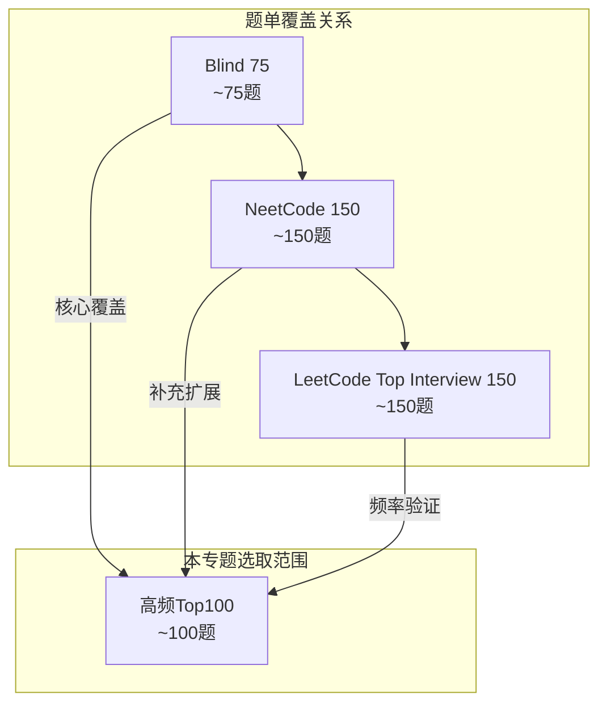
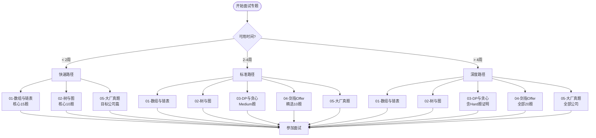
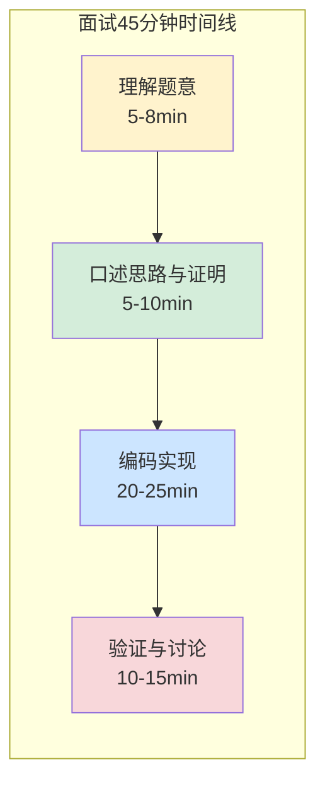
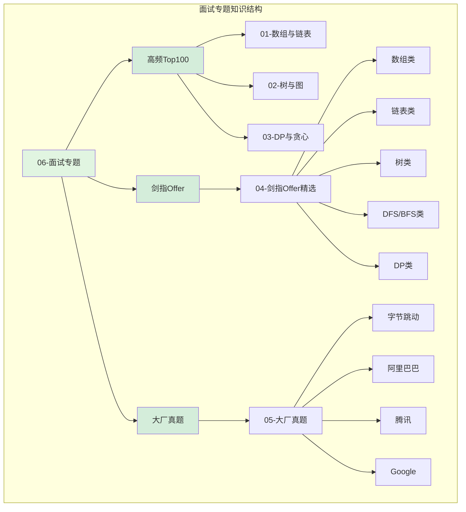
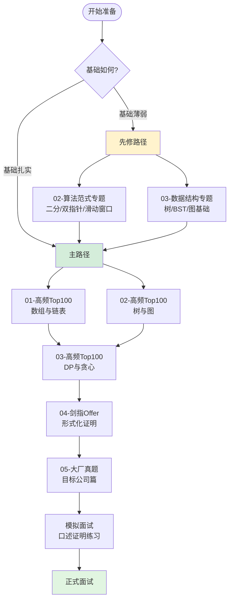

> 📊 **项目全面梳理**：详细的项目结构、模块详解和学习路径，请参阅 [`项目全面梳理-2025.md`](../../项目全面梳理-2025.md)

## 面试专题导论 / Interview Specialization Introduction

### 摘要 / Executive Summary

- 面试专题（`06-面试专题/`）是 `13-LeetCode算法面试专题` 中**最接近真实面试场景**的实战层，聚焦高频题精选、剑指 Offer 形式化重构、以及字节/阿里/腾讯/Google 大厂真题分类解析。
- 与 `01-数据结构专题/` 和 `02-算法范式专题/` 的**范式导向**不同，本专题采用**题单重组策略**：按公司考察偏好与经典题单（Blind 75、NeetCode 150、CodeTop）重新组织题目，帮助读者在真实面试语境中快速定位解题策略。
- 每篇子文档均提供形式化规约、最优解思路、复杂度分析、面试口述模板与正确性证明要点，将理论能力转化为 45 分钟面试窗口内的**结构化表达能力**。

### 关键术语与符号 / Glossary

| 术语 / Term | 定义 / Definition |
|-------------|-------------------|
| Blind 75 | Blind 论坛整理的 75 道 LeetCode 高频题单，西方科技面试的"最小必要集" |
| NeetCode 150 | 在 Blind 75 基础上扩展至 150 道的系统题单，提供视频讲解与路线图 |
| CodeTop | 中文面试题源聚合平台，按公司/部门/岗位/时间维度汇总面经算法题 |
| 高频题 | 在面经中出现频率显著高于平均的 LeetCode 题目，反映公司考察偏好 |
| 剑指 Offer | 《剑指 Offer》配套的 66 道（新版 76 道）编程题，中文面试经典题源 |
| 面经 | 面试者分享的面试经历与题目回忆，CodeTop 等平台的原始数据来源 |
| 口述证明 | 面试现场通过口头语言陈述算法正确性的结构化表达，基于循环不变式或归纳法 |

术语对齐与引用规范：`docs/术语与符号总表.md`，`01-基础理论/00-撰写规范与引用指南.md`

### 目录 / Table of Contents

- [面试专题导论 / Interview Specialization Introduction](#面试专题导论--interview-specialization-introduction)
  - [摘要 / Executive Summary](#摘要--executive-summary)
  - [关键术语与符号 / Glossary](#关键术语与符号--glossary)
  - [目录 / Table of Contents](#目录--table-of-contents)
  - [交叉引用与依赖 / Cross-References and Dependencies](#交叉引用与依赖--cross-references-and-dependencies)
- [1. 面试专题的设计理念](#1-面试专题的设计理念)
- [2. 三大题单介绍](#2-三大题单介绍)
  - [2.1 Blind 75](#21-blind-75)
  - [2.2 NeetCode 150](#22-neetcode-150)
  - [2.3 LeetCode Top Interview 150](#23-leetcode-top-interview-150)
- [3. 剑指 Offer 的价值](#3-剑指-offer-的价值)
  - [3.1 为什么剑指 Offer 不可替代](#31-为什么剑指-offer-不可替代)
  - [3.2 剑指 Offer 与形式化方法的契合](#32-剑指-offer-与形式化方法的契合)
  - [3.3 在本专题中的处理](#33-在本专题中的处理)
- [4. 大厂考察差异](#4-大厂考察差异)
  - [4.1 字节跳动：重算法深度与工程思维](#41-字节跳动重算法深度与工程思维)
  - [4.2 阿里：重工程 + 算法结合](#42-阿里重工程--算法结合)
  - [4.3 腾讯：重基础扎实](#43-腾讯重基础扎实)
  - [4.4 Google：重数学推导与最优性证明](#44-google重数学推导与最优性证明)
  - [4.5 大厂考察重点对比矩阵](#45-大厂考察重点对比矩阵)
- [5. 子文档介绍与阅读顺序](#5-子文档介绍与阅读顺序)
  - [5.1 子文档概览](#51-子文档概览)
  - [5.2 推荐阅读顺序](#52-推荐阅读顺序)
- [6. 面试中的"口述证明"技巧](#6-面试中的口述证明技巧)
  - [6.1 45 分钟时间分配模型](#61-45-分钟时间分配模型)
  - [6.2 口述证明的结构化模板](#62-口述证明的结构化模板)
  - [6.3 口述证明的层次模型](#63-口述证明的层次模型)
  - [6.4 常见口述证明反模式](#64-常见口述证明反模式)
- [7. 思维表征](#7-思维表征)
  - [7.1 面试专题知识结构图](#71-面试专题知识结构图)
  - [7.2 大厂考察重点对比矩阵](#72-大厂考察重点对比矩阵)
  - [7.3 阅读顺序路径图](#73-阅读顺序路径图)
- [8. 学习目标](#8-学习目标)
- [参考文献 / References](#参考文献--references)

### 交叉引用与依赖 / Cross-References and Dependencies

**上游理论依赖 / Upstream Dependencies**:

- [`02-算法范式专题/05-二分查找.md`](../02-算法范式专题/05-二分查找.md) — 二分查找的形式化规约与正确性证明模板
- `02-算法范式专题/06-双指针.md` — 双指针技术的面试应用场景
- `03-数据结构专题/01-数组与矩阵.md` — 数组理论基础与复杂度分析
- `03-数据结构专题/03-树与二叉搜索树.md` — 树结构面试考点
- [`00-总览与方法论/01-解题方法论（四步法与形式化思维）.md`](../00-总览与方法论/01-解题方法论（四步法与形式化思维）.md) — 四步法与形式化思维方法论

**下游应用 / Downstream Applications**:

- `06-面试专题/01-高频Top100-数组与链表.md` — 高频数组与链表题的形式化分析
- `06-面试专题/02-高频Top100-树与图.md` — 高频树与图题的形式化分析
- `06-面试专题/03-高频Top100-DP与贪心.md` — 高频动态规划与贪心题的形式化分析
- `06-面试专题/04-剑指Offer精选形式化证明.md` — 剑指 Offer 题目的形式化重构
- `06-面试专题/05-大厂真题分类（字节-阿里-腾讯-Google）.md` — 大厂真题按公司分类解析

---

## 1. 面试专题的设计理念

`01-数据结构专题/` 和 `02-算法范式专题/` 采用**范式导向**（Paradigm-Oriented）的组织方式：先讲清楚一种数据结构或算法范式的理论，再列举其典型应用题目。这种组织的优势在于理论体系的完整性，但存在一个关键缺陷——**与真实面试的认知路径不一致**。

在真实面试中，候选人面对的不是"请用双指针解决…"，而是"给定一个数组，找出…"。候选人需要：

1. **识别数据类型**（数组、链表、树、图）
2. **匹配算法范式**（双指针、DFS、DP、贪心）
3. **在 45 分钟内完成理解 → 编码 → 验证**

因此，`06-面试专题/` 采用**题单重组策略**（Problem-List Reorganization）：

- **按高频度重组**：从 Blind 75、NeetCode 150、CodeTop 等权威题单中精选约 100 道高频题
- **按公司偏好分类**：字节跳动重算法深度、阿里重工程+算法结合、腾讯重基础扎实、Google 重数学推导
- **按实战场景编排**：每道题提供"面试口述模板"，而非仅提供代码

**两种组织方式的对比**：

| 维度 | 范式导向（`01/02-专题`） | 题单重组（`06-面试专题`） |
|------|------------------------|--------------------------|
| 认知路径 | 理论 → 应用 | 问题 → 匹配 → 解决 |
| 知识形态 | 定理-证明-示例 | 题目-思路-口述-证明 |
| 适用场景 | 系统学习、建立知识体系 | 面试突击、模拟真实场景 |
| 正确性标准 | 严格数学证明 | 证明 + 现场表达能力 |
| 时间投入 | 中长期深度训练 | 中短期高频实战 |

**设计原则**：

> **原则 1.1**（面试认知一致性原则）
> 面试专题的文档组织方式应与真实面试的认知路径同构，即：从题目描述出发，经过范式匹配，到达形式化规约与实现。

> **原则 1.2**（口述优先原则）
> 每道题的解析应首先提供"面试口述模板"，其次才是代码实现与形式化证明，确保读者训练的是**表达能力**而非仅**编码能力**。

---

## 2. 三大题单介绍

面试准备领域存在三个最具影响力的公开题单，它们构成了本专题的选题基础。

### 2.1 Blind 75

**来源**：Blind 论坛（北美科技从业者匿名社区）用户 "yangshun" 于 2018 年整理的 75 道 LeetCode 高频题。

**特点**：

- **极简主义**：75 道题被公认为通过西方一线科技公司面试（Google、Meta、Amazon、Apple 等）的"最小必要集"
- **分类清晰**：按 Array、Linked List、Tree、Graph、DP、Backtracking 等 16 个类别划分
- **质量筛选**：每道题都经过大量面经验证，低质量/低频题被剔除

**在本专题中的定位**：Blind 75 作为"基础必刷层"，题目分布在 `01-03` 高频 Top 100 文档中，按**面试实际考察频率**重新聚类。

### 2.2 NeetCode 150

**来源**：YouTube 博主 NeetCode 在 Blind 75 基础上扩展的 150 题路线图。

**特点**：系统性强（覆盖 Easy 到 Hard 完整梯度）、视频讲解、8 周学习计划。

**在本专题中的定位**：NeetCode 150 作为"扩展提升层"，本专题选取其中**出现频率最高但 Blind 75 未覆盖**的 25 道题作为补充。

### 2.3 LeetCode Top Interview 150

**来源**：LeetCode 官方 2023 年推出的数据驱动题单。

**特点**：基于平台真实面试数据排序，动态更新，与 Study Plan 深度整合。

**三题单覆盖关系**：



**关键洞察**：三题单的核心交集约 60 题，这 60 题是面试准备的**最高优先级**。本专题的 `01-03` 篇文档优先覆盖这 60 道核心题，并附形式化规约与口述证明模板。

---

## 3. 剑指 Offer 的价值

《剑指 Offer》是中文技术面试领域的标志性题源，其配套 66 道（新版 76 道）编程题在国内互联网公司的面试中出现频率极高。

### 3.1 为什么剑指 Offer 不可替代

**考察频率**：CodeTop 面经数据库显示，剑指 Offer 原题或变形题在国内一线大厂面试中出现率约为 $35\%$–$45\%$。

**题目特点**：描述简洁（通常不超过 3 行，无冗余背景）、边界丰富（空输入、单节点、最大值等）、解法典型（每题对应经典算法思想）。

### 3.2 剑指 Offer 与形式化方法的契合

剑指 Offer 的简洁性使其成为**形式化入门的理想材料**：

| 特性 | 剑指 Offer | LeetCode 英文原题 |
|------|-----------|------------------|
| 描述长度 | 短（1-3 行） | 中-长（常含背景故事） |
| 形式化转换难度 | 低 | 中（需剥离背景） |
| 边界条件显式程度 | 高 | 中 |
| 前置条件清晰度 | 高 | 中 |

**示例**：剑指 Offer 03（数组中重复的数字）可直接转换为五元组：

$$
\Pi = (\{0,\ldots,n-1\}^n, \textit{nums}, i, \textit{len}(\textit{nums})=n, \exists j \neq k: \textit{nums}[j]=\textit{nums}[k]=i)
$$

### 3.3 在本专题中的处理

`04-剑指Offer精选形式化证明.md` 从 66 道原题中精选 **20 道代表性**题目，每道题提供：形式化规约、核心思路、代码实现、复杂度分析、正确性证明、面试口述模板。

---

## 4. 大厂考察差异

不同公司的算法面试在难度分布、考察重点、沟通风格上存在系统性差异。理解这些差异有助于候选人针对性地调整准备策略。

### 4.1 字节跳动：重算法深度与工程思维

**考察特点**：题量大（3-4 道），Hard 比例高（~40%），追问深（空间优化、数据流扩展），重视工程化封装。

**典型题目**：滑动窗口变形、字典树+DP综合、多源 BFS。

**准备建议**：重点训练 `03-DP与贪心` Hard 题，每题准备空间优化与数据流扩展。

### 4.2 阿里：重工程 + 算法结合

**考察特点**：场景化包装（电商/物流等业务背景），分布式意识（数据分布在千台机器上怎么办），重视设计权衡与 trade-off 分析。

**典型题目**：LRU/LFU Cache、合并 K 个有序序列、大数据 Top K。

**准备建议**：重点训练 `01-数组与链表` 工程向题目，准备单机版→分布式版扩展，熟悉 Bloom Filter 等分布式数据结构。

### 4.3 腾讯：重基础扎实

**考察特点**：基础题占比高（Easy/Medium 为主），细节把控严格（边界条件、异常处理），代码规范纳入评分。

**典型题目**：链表基本操作、二叉树遍历与重构、基础 DP。

**准备建议**：确保 `01-数组与链表` Easy 题 5 分钟 bug-free，链表和树操作做到"肌肉记忆"，代码含完整边界处理与注释。

### 4.4 Google：重数学推导与最优性证明

**考察特点**：证明要求高（复杂度下界、贪心正确性），数学工具频繁（概率、期望、组合数学），部分题目开放无标准答案。

**典型题目**：随机化算法（QuickSelect、Reservoir Sampling）、图论证明、数学归纳法题。

**准备建议**：重点训练 `03-DP与贪心` 正确性证明，熟记比较排序 $\Omega(n \log n)$ 等下界结论，练习英语口述。

### 4.5 大厂考察重点对比矩阵

| 维度 | 字节跳动 | 阿里巴巴 | 腾讯 | Google |
|------|---------|---------|------|--------|
| **题量** | 3-4 道 | 2-3 道 | 2-3 道 | 2 道（深度追问） |
| **Hard 比例** | 高（~40%） | 中（~25%） | 低（~10%） | 中（~30%） |
| **追问深度** | 极深（多轮扩展） | 深（分布式扩展） | 中（边界细节） | 深（数学证明） |
| **核心能力** | 算法深度 + 工程实现 | 系统设计 + 算法基础 | 代码质量 + 基础扎实 | 数学严谨 + 最优性证明 |
| **沟通风格** | 快节奏，直接 | 场景化，务实 | 细致，规范 | 严谨，开放 |
| **推荐重点文档** | `03-DP与贪心` | `01-数组与链表` | `01-数组与链表` + `02-树与图` | `03-DP与贪心` + `04-剑指Offer` |

---

## 5. 子文档介绍与阅读顺序

`06-面试专题/` 包含 5 篇子文档，覆盖高频题的三大数据域、剑指 Offer 形式化重构、以及大厂真题分类。

### 5.1 子文档概览

| 文档 | 定位 | 核心内容 | 特色 |
|------|------|---------|------|
| `01-高频Top100-数组与链表` | 最高频基础模块（~30-40%） | 约 20 道数组与链表题，按七大范式重组 | 每道题提供口述模板与对比矩阵 |
| `02-高频Top100-树与图` | 区分基础与优秀候选人的关键模块 | 二叉树、BST、DFS/BFS、最短路径、拓扑排序等 ~20 题 | 树形 DP 通用模板、范式匹配决策树 |
| `03-高频Top100-DP与贪心` | 难度最高、区分度最大 | 线性/区间/背包 DP、状态压缩、贪心证明等 ~20 题 | DP 四要素模板（状态、转移、初始化、顺序） |
| `04-剑指Offer精选形式化证明` | 中文面试必刷题源的形式化升级 | 精选 20 道代表性题目 | 题目简洁，形式化转换难度低，适合入门 |
| `05-大厂真题分类` | 按公司重组的真实面试题 | 字节/阿里/腾讯/Google 各 10-15 道真题 | 标注面经来源、难度分布与考察重点 |

### 5.2 推荐阅读顺序

提供三条阅读路径：



| 目标公司 | 推荐路径 | 关键补充 |
|---------|---------|---------|
| 字节跳动 | 深度路径，重点 `03` + `05-字节篇` | 准备 Hard 题的空间优化与数据流扩展 |
| 阿里巴巴 | 标准/深度路径，重点 `01` + `05-阿里篇` | 准备分布式扩展思路 |
| 腾讯 | 标准路径，重点 `01` + `02` | 确保 Easy 题 5 分钟 bug-free |
| Google | 深度路径，重点 `03` + `04` | 准备复杂度下界证明 |
| 国内中小厂 | 快速路径，`01` + `04-剑指Offer` | 剑指 Offer 为核心题源 |

---

## 6. 面试中的"口述证明"技巧

在真实面试中，候选人通常只有 **45 分钟**完成从读题到提交的全过程。其中，向面试官"口述"思路的时间约为 5-10 分钟，编码时间约为 20-25 分钟，验证与讨论时间约为 10-15 分钟。

### 6.1 45 分钟时间分配模型



### 6.2 口述证明的结构化模板

**阶段 1：理解题意（5-8 分钟）**

向面试官复述题目并确认约束：

```
"让我确认题意：给定[输入]，要求[输出]。关键约束是[约束1]、[约束2]。
我的理解是：需要在[限制]下找到[目标]。"
```

**阶段 2：口述思路与证明（5-10 分钟）**

使用"假设-推导-保证"三段式：

```
"我考虑用[范式]解决。关键观察是[洞察]。建立不变式：
[数学表达]。初始化时[说明]；每一步[保持方式]；
终止时[导出答案]。因此算法正确。"
```

**阶段 3：编码实现（20-25 分钟）**

边写边注释关键不变式：

```python
# 不变式: 答案若存在，必在 [left, right] 内
while left <= right:
    mid = left + (right - left) // 2
    # 保持: 排除一半区间，不变式仍成立
    if nums[mid] < target: left = mid + 1
    else: right = mid - 1
```

**阶段 4：验证与讨论（10-15 分钟）**

主动提出边界用例与复杂度分析：

```
"验证边界：空输入[行为]、单元素[行为]、极端值[行为]。
时间复杂度：每次迭代问题规模减半，故 $O(\log n)$。
空间复杂度：$O(1)$，仅常数额外变量。"
```

### 6.3 口述证明的层次模型

| 层次 | 表现 | 时间占比 | 面试官感知 |
|------|------|---------|-----------|
| L1: 直接编码 | 无口述，直接写代码 | 0% | 缺乏结构化思维 |
| L2: 简述思路 | "我用二分查找…" | 5% | 及格，但缺乏深度 |
| L3: 解释正确性 | "因为数组有序，排除一半不会丢失答案…" | 10% | 良好，逻辑清晰 |
| L4: 形式化证明 | "建立不变式 $I$: 若 $target$ 存在则 $\in [l,r]$…" | 15% | 优秀，理论扎实 |
| L5: 最优性论证 | "比较搜索下界为 $\Omega(\log n)$，此算法达到下界…" | 20% | 卓越，具备研究潜质 |

**建议**：在 45 分钟面试中，争取达到 **L3-L4** 层次。L5 层次适合申请 Google Research 或阿里星等顶级岗位。

### 6.4 常见口述证明反模式

| 反模式 | 错误示例 | 修正示例 |
|--------|---------|---------|
| 模棱两可 | "大概是用双指针吧…" | "我选择双指针，因为数组已排序，对撞指针可在 $O(n)$ 内找到答案。" |
| 循环论证 | "这样做对，因为结果对。" | "这样做对，因为不变式保证了…" |
| 过度跳跃 | "然后就这样，最后返回结果。" | "然后更新右边界为 $mid-1$，若答案存在必在新区间内。" |
| 忽视边界 | "应该能处理所有情况。" | "验证空数组：当 $n=0$ 时循环条件为假，返回 $-1$，正确。" |

---

## 7. 思维表征

### 7.1 面试专题知识结构图



### 7.2 大厂考察重点对比矩阵

```mermaid
flowchart LR
    subgraph 考察重点雷达图示意
        direction TB

        Byte[字节跳动]
        Byte --> Byte1[算法深度]
        Byte --> Byte2[代码速度]
        Byte --> Byte3[工程实现]
        Byte --> Byte4[边界处理]
        Byte --> Byte5[数学证明]

        Ali[阿里巴巴]
        Ali --> Ali1[算法深度]
        Ali --> Ali2[代码速度]
        Ali --> Ali3[工程实现]
        Ali --> Ali4[边界处理]
        Ali --> Ali5[数学证明]

        Tencent[腾讯]
        Tencent --> T1[算法深度]
        Tencent --> T2[代码速度]
        Tencent --> T3[工程实现]
        Tencent --> T4[边界处理]
        Tencent --> T5[数学证明]

        Google[Google]
        Google --> G1[算法深度]
        Google --> G2[代码速度]
        Google --> G3[工程实现]
        Google --> G4[边界处理]
        Google --> G5[数学证明]
    end

    style Byte1 fill:#ff6b6b
    style Byte2 fill:#ff6b6b
    style Byte3 fill:#ffd93d
    style Ali3 fill:#ff6b6b
    style Ali4 fill:#ffd93d
    style T2 fill:#ff6b6b
    style T4 fill:#ff6b6b
    style G1 fill:#ff6b6b
    style G5 fill:#ff6b6b
```



### 7.3 阅读顺序路径图



---

## 8. 学习目标

完成本专题学习后，读者应能够：

1. **题单导航**：理解 Blind 75、NeetCode 150、CodeTop 的覆盖关系与选题优先级，制定个性化刷题计划。
2. **公司适配**：识别四家大厂考察差异，针对性展示算法深度、工程能力、代码规范或数学证明能力。
3. **剑指 Offer 形式化**：将剑指 Offer 题面快速转换为五元组规约，建立中文题面到数学规约的直接映射。
4. **口述证明**：10 分钟内向面试官完整陈述 Medium 题的形式化规约、循环不变式、复杂度分析与边界验证。
5. **45 分钟节奏控制**：合理分配理解（5-8min）、口述（5-10min）、编码（20-25min）、验证（10-15min）四阶段时间。
6. **高频题条件反射**：对核心 60 题，30 秒内识别考点、选择范式、口述思路。

**自测标准**：

- 能否 2 分钟内向虚拟面试官完整口述 LeetCode 15（3Sum）的正确性证明？
- 能否 1 分钟内写出剑指 Offer 原题的形式化五元组？
- 能否根据目标公司从本专题快速筛选优先级最高的 15 道题？
- 能否 45 分钟内完成一道未见过的高频 Medium 题"理解→编码→验证"全流程？

---

## 参考文献 / References

**题单与在线资源**

- NeetCode 150: <https://neetcode.io/roadmap> — 本专题选题基础与分类参考
- Blind 75: <https://www.teamblind.com/post/New-Year-Gift---Curated-List-of-Top-75-LeetCode-Questions-to-Save-Your-Time-OaM1orEU> — 西方科技面试"最小必要集"
- CodeTop: <https://codetop.cc> — 中文面试题频率统计与大厂真题来源
- LeetCode Top Interview 150: <https://leetcode.com/studyplan/top-interview-150> — LeetCode 官方数据驱动题单

**经典题源**

- [剑指Offer] 何海涛. *剑指 Offer：名企面试官精讲典型编程题*（第 2 版）. 电子工业出版社, 2017. — 中文面试必刷题源
- [剑指Offer II] 何海涛. *剑指 Offer（专项突破版）*. 电子工业出版社, 2021. — 新版 76 道题

**教材与方法论**

- [CLRS2022] Cormen, T. H., et al. *Introduction to Algorithms* (4th ed.). MIT Press, 2022. — 循环不变式与正确性证明理论基础
- [Sedgewick2011] Sedgewick, R. & Wayne, K. *Algorithms* (4th ed.). Addison-Wesley, 2011. — 面试算法实现参考
- [Skiena2020] Skiena, S. S. *The Algorithm Design Manual* (3rd ed.). Springer, 2020. — 面试问题分类与选择策略

**形式化方法**

- [Hoare1969] Hoare, C. A. R. "An Axiomatic Basis for Computer Programming." *Communications of the ACM*, 12(10), 576-580, 1969.
- [Dijkstra1976] Dijkstra, E. W. *A Discipline of Programming*. Prentice-Hall, 1976.

---

> 📚 **返回目录**: [LeetCode算法面试专题](../README.md)
