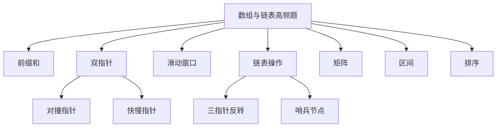
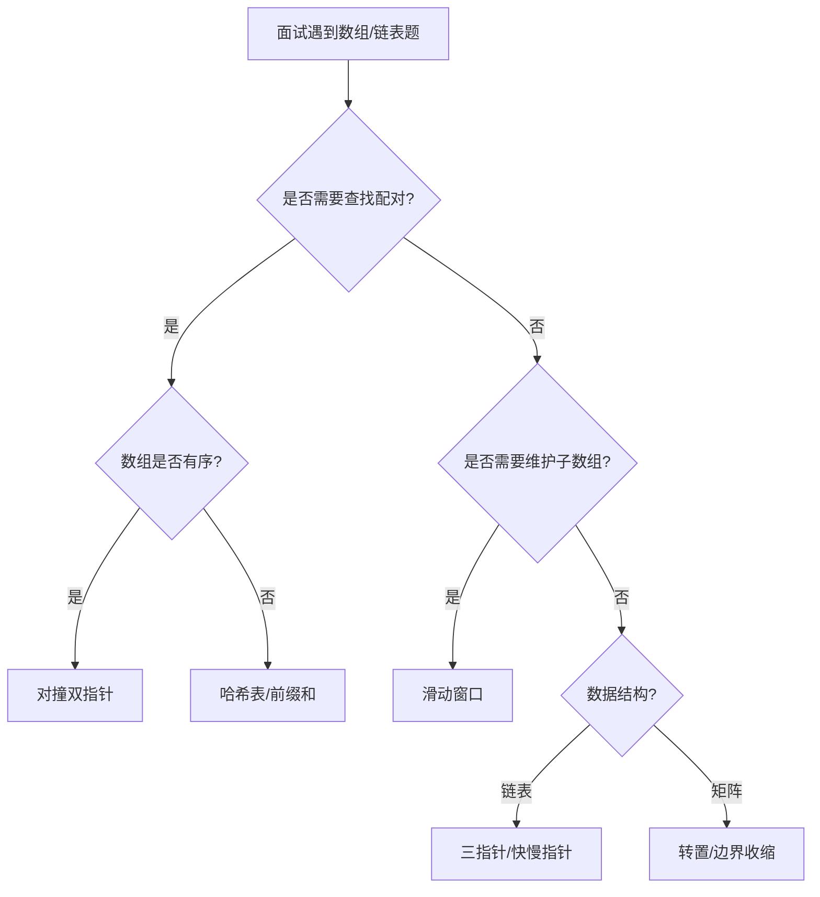
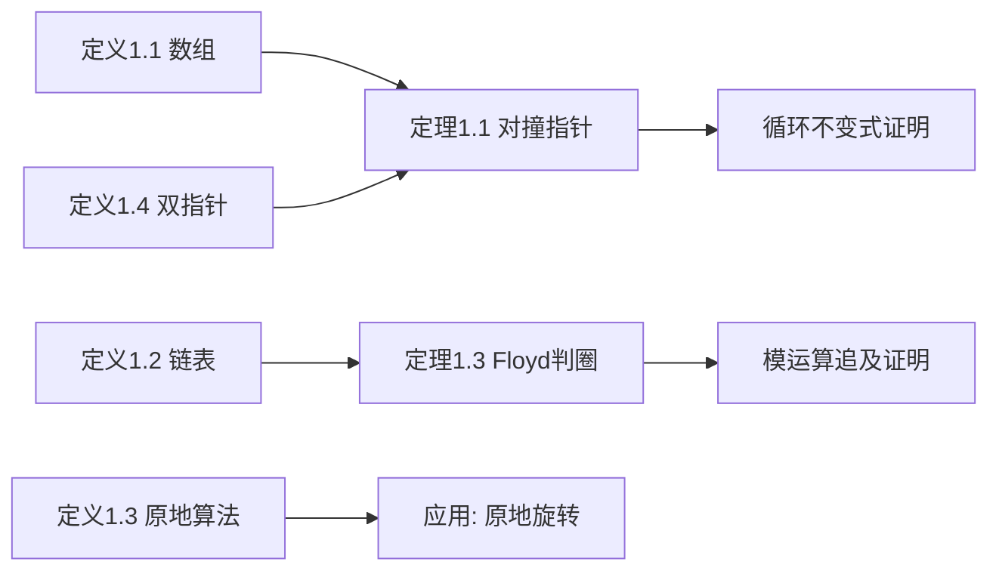

> 📊 **项目全面梳理**：详细的项目结构、模块详解和学习路径，请参阅 [`项目全面梳理-2025.md`](../../项目全面梳理-2025.md)

## 高频Top100-数组与链表 / Top 100 Frequent - Array & Linked List

### 摘要 / Executive Summary

- 数组与链表是算法面试中**最高频**的基础模块，约占所有面试题目的 $30\%$–$40\%$。掌握这一模块是通关面试的必要条件。
- 本文从 NeetCode 150 / Blind 75 中精选约 $20$ 道数组与链表高频题，按**范式重组**为七大类：前缀和、双指针、滑动窗口、链表操作、矩阵、区间、排序。
- 每道题提供形式化规约、最优解思路、复杂度分析与正确性要点，并附多维矩阵对比表与面试口述模板，帮助读者在面试中快速定位解题策略。

### 关键术语与符号 / Glossary

| 术语 / Term | 定义 / Definition |
|-------------|-------------------|
| 双指针 Two Pointers | 使用两个索引/指针协同遍历数据结构的技术，分为对撞指针和快慢指针 |
| 滑动窗口 Sliding Window | 维护一个可变或固定大小的子数组/子串，通过双指针动态调整边界 |
| 前缀和 Prefix Sum | 数组 $A$ 的前缀和数组 $P$ 满足 $P[i] = \sum_{k=0}^{i-1} A[k]$，支持 $O(1)$ 区间和查询 |
| 原地操作 In-Place | 空间复杂度为 $O(1)$ 的算法，直接修改输入数据结构 |
| 哨兵节点 Sentinel Node | 链表中附加在首部的虚拟节点，简化边界情况处理 |
| 归并 Merge | 将两个有序序列合并为一个有序序列的过程 |

### 目录 / Table of Contents

- [高频Top100-数组与链表](#高频top100-数组与链表)
  - [摘要 / Executive Summary](#摘要--executive-summary)
  - [关键术语与符号 / Glossary](#关键术语与符号--glossary)
  - [目录 / Table of Contents](#目录--table-of-contents)
  - [交叉引用与依赖](#交叉引用与依赖)
  - [1. 范式一：前缀和](#1-范式一前缀和)
  - [2. 范式二：双指针](#2-范式二双指针)
  - [3. 范式三：滑动窗口](#3-范式三滑动窗口)
  - [4. 范式四：链表操作](#4-范式四链表操作)
  - [5. 范式五：矩阵](#5-范式五矩阵)
  - [6. 范式六：区间](#6-范式六区间)
  - [7. 范式七：排序](#7-范式七排序)
  - [8. 多维矩阵对比表](#8-多维矩阵对比表)
  - [9. 面试口述模板](#9-面试口述模板)
  - [10. 自测问题](#10-自测问题)
  - [参考文献](#参考文献)

### 交叉引用与依赖

**上游理论依赖**:

- [`02-算法范式专题/01-枚举与模拟.md`](../02-算法范式专题/01-枚举与模拟.md) — 矩阵原地操作技巧
- [`02-算法范式专题/05-二分查找.md`](../02-算法范式专题/05-二分查找.md) — 有序数组查找技巧
- `03-数据结构专题/01-数组与矩阵.md` — 数组理论基础
- `03-数据结构专题/02-链表.md` — 链表理论基础

**下游应用**:

- `06-面试专题/02-高频Top100-树与图.md` — 树与图高频题
- `06-面试专题/03-高频Top100-DP与贪心.md` — 动态规划高频题

---

## 0. 形式化定义与核心定理

在深入具体题目之前，我们先建立数组与链表操作的形式化基础，并给出贯穿本章的核心定理及其证明。

### 0.1 形式化定义

> **定义 1.1**（数组 / Array）
> 数组是有限个同类型元素构成的有序序列，形式化表示为 $A = (a_0, a_1, \ldots, a_{n-1})$，其中 $n \in \mathbb{N}$ 为数组长度，$a_i \in \mathcal{T}$ 为第 $i$ 个元素，$\mathcal{T}$ 为元素类型。数组支持通过下标 $i$ 在 $O(1)$ 时间内随机访问 $a_i$。

> **定义 1.2**（链表 / Linked List）
> 链表是由节点通过指针链接而成的线性数据结构。每个节点 $v$ 包含数据域 $v. ext{data}$ 和指针域 $v. ext{next}$。形式化地，链表 $L$ 可递归定义为：
>
> - 空链表 $L =  ext{nil}$
> - 非空链表 $L = v  o L'$，其中 $v$ 为头节点，$L'$ 为剩余链表

> **定义 1.3**（原地算法 / In-Place Algorithm）
> 称算法为原地的，当且仅当其除输入输出外使用的额外空间为 $O(1)$，即空间复杂度 $S(n) = O(1)$。

> **定义 1.4**（双指针 / Two Pointers）
> 双指针技术使用两个索引 $i, j$（或指针 $p, q$）协同遍历数据结构。根据移动策略分为：
>
> - **对撞指针**：$i$ 从头部向右，$j$ 从尾部向左，相向移动
> - **快慢指针**：$i$ 和 $j$ 同向移动，但步长不同（如 $i$ 每次1步，$j$ 每次2步）

### 0.2 核心定理与证明

> **定理 1.1**（对撞双指针覆盖定理）
> 设有序数组 $A[0..n-1]$，对撞双指针从 $l=0, r=n-1$ 开始相向移动。若移动策略保证"每次至少排除一个不可能包含解的元素"，则算法不会遗漏任何有效解。

**证明**：

我们使用循环不变式证明。

**循环不变式** $I$：
$$
I(l, r) \equiv  ext{若解存在，则解的所有元素均位于 } [l, r]  ext{ 区间内}
$$

**初始化**：$l=0, r=n-1$。显然若解存在，其元素必在 $[0, n-1]$ 中，$I$ 成立。

**保持**：假设某次迭代前 $I$ 成立。根据具体问题的排除规则（如 $A[l] + A[r]$ 与目标值比较），我们排除 $A[l]$ 或 $A[r]$ 中至少一个不可能属于解的元素，将 $l$ 右移或 $r$ 左移。由于被排除的元素经论证确实不可能属于任何解，$I$ 对新区间仍成立。

**终止**：当 $l \geq r$ 时循环终止。此时区间内至多一个元素，若解存在则必为该元素。证毕。$\square$

> **定理 1.2**（滑动窗口不变式定理）
> 对于子数组/子串搜索问题，设滑动窗口为 $[left, right]$，若不变式 $Inv(right) \equiv$"窗口 $[left, right)$ 始终满足某性质 $P$" 在每次 $right$ 扩展后通过调整 $left$ 得以保持，则算法返回的极大（或极小）窗口即为全局最优解。

**证明**：

对 $right$ 的遍历进行归纳。

**基础**：$right = 0$，窗口为空，性质 $P$ 平凡成立。

**归纳假设**：设 $right = k$ 时，存在某个 $left$ 使得 $[left, k)$ 满足 $P$，且所有以 $k$ 结尾的满足 $P$ 的窗口中，$[left, k)$ 是最靠左的（即 $left$ 最小）。

**归纳步**：$right$ 扩展到 $k+1$。若 $[left, k+1)$ 仍满足 $P$，则不变式保持。否则，将 $left$ 右移至最小的 $left' > left$ 使得 $[left', k+1)$ 满足 $P$。由构造可知，$[left', k+1)$ 是以 $k+1$ 结尾的最小左边界窗口。若不存在这样的 $left'$，则窗口为空（$left = k+1$），性质 $P$ 仍平凡成立。

因此，每次 $right$ 扩展后，我们维护了以当前 $right$ 结尾的最优窗口。遍历结束后，所有右边界对应的最优窗口中的极值即为全局最优。证毕。$\square$

> **定理 1.3**（Floyd 判圈定理）
> 设链表存在环，环长为 $C$。慢指针每次移动1步，快指针每次移动2步，则两指针必在有限步内相遇。

**证明**：

设慢指针进入环时，快指针已在环内领先 $d$ 步（$0 \leq d < C$）。此后每步快指针追近 $1$ 步（相对速度为 $2-1=1$）。经过 $C - d$ 步后，快指针恰好追上慢指针。因 $C - d \leq C < \infty$，相遇在有限步内发生。证毕。$\square$

### 0.3 思维表征







---

## 1. 范式一：前缀和

### 1.1 LC 1 — Two Sum

> **链接**: [LeetCode 1](https://leetcode.com/problems/two-sum/) | **难度**: Easy

#### 形式化规约

**输入**: 数组 $nums \in \mathbb{Z}^n$，目标值 $target \in \mathbb{Z}$
**输出**: 索引对 $(i, j)$ 使得 $nums[i] + nums[j] = target$，$i \neq j$

#### 最优解思路

使用哈希表存储已遍历元素及其索引，将问题转化为"查找 $target - nums[i]$ 是否在哈希表中"。

#### 复杂度

| 指标 | 值 |
|------|---|
| 时间 | $O(n)$ |
| 空间 | $O(n)$ |

#### 正确性要点

- 哈希表的键为数值，值为索引
- 遍历时先查询后插入，避免同一元素被使用两次

### 1.2 LC 238 — Product of Array Except Self

> **链接**: [LeetCode 238](https://leetcode.com/problems/product-of-array-except-self/) | **难度**: Medium

#### 形式化规约

**输入**: 数组 $nums \in \mathbb{Z}^n$
**输出**: 数组 $ans$ 其中 $ans[i] = \prod_{j \neq i} nums[j]$

#### 最优解思路

两次遍历：第一次从左到右计算左侧累积积 $L[i] = \prod_{j < i} nums[j]$；第二次从右到左乘上右侧累积积 $R[i] = \prod_{j > i} nums[j]$。可用输出数组存储 $L$，用变量维护 $R$ 实现 $O(1)$ 空间。

#### 复杂度

| 指标 | 值 |
|------|---|
| 时间 | $O(n)$ |
| 空间 | $O(1)$（不计输出） |

#### 正确性要点

- $ans[i] = L[i] \times R[i]$，其中 $L[i]$ 存储于 $ans[i]$，$R[i]$ 用变量滚动维护
- 注意 $nums$ 中可能含 $0$，需要特别处理（但题目要求不用除法）

### 1.3 LC 560 — Subarray Sum Equals K

> **链接**: [LeetCode 560](https://leetcode.com/problems/subarray-sum-equals-k/) | **难度**: Medium

#### 形式化规约

**输入**: 数组 $nums \in \mathbb{Z}^n$，目标值 $k \in \mathbb{Z}$
**输出**: 满足 $\sum_{i=l}^{r} nums[i] = k$ 的子数组个数

#### 最优解思路

前缀和 + 哈希表。设 $P[i] = \sum_{t=0}^{i-1} nums[t]$，则子数组和 $sum(l,r) = P[r+1] - P[l]$。问题转化为统计满足 $P[r+1] - P[l] = k$ 的 $(l, r)$ 对数，即对每个 $P[r+1]$ 查询哈希表中 $P[r+1] - k$ 的出现次数。

#### 复杂度

| 指标 | 值 |
|------|---|
| 时间 | $O(n)$ |
| 空间 | $O(n)$ |

#### 正确性要点

- 哈希表初始放入 $\{0: 1\}$，处理前缀和恰好等于 $k$ 的情况
- 边计算前缀和边查询，避免 $O(n^2)$ 的枚举

---

## 2. 范式二：双指针

### 2.1 LC 11 — Container With Most Water

> **链接**: [LeetCode 11](https://leetcode.com/problems/container-with-most-water/) | **难度**: Medium

#### 形式化规约

**输入**: 数组 $height \in \mathbb{N}^n$，$height[i]$ 表示第 $i$ 条垂线的高度
**输出**: $\max_{0 \leq l < r < n} \min(height[l], height[r]) \times (r - l)$

#### 最优解思路

对撞双指针：初始化 $l=0, r=n-1$。每次移动高度较小的指针（因为移动高度较大的指针不可能增加面积）。

#### 复杂度

| 指标 | 值 |
|------|---|
| 时间 | $O(n)$ |
| 空间 | $O(1)$ |

#### 正确性要点

- **移动策略的正确性**: 设当前面积为 $S = \min(h[l], h[r]) \times (r-l)$。若 $h[l] < h[r]$，则对于任意 $l' > l$，面积 $S' = \min(h[l'], h[r]) \times (r-l')$。由于 $r-l' < r-l$ 且 $\min(h[l'], h[r]) \leq h[r]$，但更重要的是，以 $l$ 为左端点的所有组合中，$r$ 已经是能提供最大宽度的右端点，若 $h[l]$ 是短板，移动 $r$ 向左只会减少宽度且高度不增，因此舍弃 $l$ 是安全的。

### 2.2 LC 15 — 3Sum

> **链接**: [LeetCode 15](https://leetcode.com/problems/3sum/) | **难度**: Medium

#### 形式化规约

**输入**: 数组 $nums \in \mathbb{Z}^n$
**输出**: 所有不重复的三元组 $(a,b,c)$ 使得 $a+b+c=0$

#### 最优解思路

排序 + 双指针。固定第一个数 $nums[i]$，在右侧用对撞双指针找两数之和为 $-nums[i]$。跳过重复元素保证结果不重复。

#### 复杂度

| 指标 | 值 |
|------|---|
| 时间 | $O(n^2)$ |
| 空间 | $O(1)$（不计输出） |

#### 正确性要点

- 排序后 $nums[i] \leq nums[j] \leq nums[k]$，便于去重和剪枝
- $i$ 去重：`if i > 0 and nums[i] == nums[i-1]: continue`
- $j,k$ 去重：找到解后内部继续收缩跳过重复值

### 2.3 LC 42 — Trapping Rain Water

> **链接**: [LeetCode 42](https://leetcode.com/problems/trapping-rain-water/) | **难度**: Hard

#### 形式化规约

**输入**: 数组 $height \in \mathbb{N}^n$
**输出**: 能接的雨水总量 = $\sum_{i} \max(0, \min(\max_{j \leq i} height[j], \max_{j \geq i} height[j]) - height[i])$

#### 最优解思路

双指针优化：维护左侧最大高度 $left\_max$ 和右侧最大高度 $right\_max$。若 $left\_max < right\_max$，则左侧当前位置的积水量由 $left\_max$ 决定（右侧有更高的墙保证不泄漏），移动左指针；否则移动右指针。

#### 复杂度

| 指标 | 值 |
|------|---|
| 时间 | $O(n)$ |
| 空间 | $O(1)$ |

#### 正确性要点

- 每个位置 $i$ 的积水量取决于左右最高墙的较小值：$water[i] = \max(0, \min(left\_max, right\_max) - height[i])$
- 双指针的正确性在于：当 $left\_max < right\_max$ 时，左指针处的积水量已确定（右侧有更高保障），可以放心计算并移动

---

## 3. 范式三：滑动窗口

### 3.1 LC 3 — Longest Substring Without Repeating Characters

> **链接**: [LeetCode 3](https://leetcode.com/problems/longest-substring-without-repeating-characters/) | **难度**: Medium

#### 形式化规约

**输入**: 字符串 $s \in \Sigma^*$
**输出**: $s$ 的最长不含重复字符的子串长度

#### 最优解思路

可变滑动窗口：维护窗口 $[left, right]$ 和字符集合/最后出现位置映射。$right$ 向右扩展，若遇到重复字符则将 $left$ 跳到重复字符的下一个位置。

#### 复杂度

| 指标 | 值 |
|------|---|
| 时间 | $O(n)$ |
| 空间 | $O(\min(m, n))$，$m$ 为字符集大小 |

#### 正确性要点

- 用哈希表记录字符最后出现的位置，实现 $left$ 的跳跃式更新
- 每次 $right$ 扩展时，$left = \max(left, last\_pos[s[right]] + 1)$

### 3.2 LC 76 — Minimum Window Substring

> **链接**: [LeetCode 76](https://leetcode.com/problems/minimum-window-substring/) | **难度**: Hard

#### 形式化规约

**输入**: 字符串 $s, t \in \Sigma^*$
**输出**: $s$ 中包含 $t$ 所有字符的最短子串（考虑频数）

#### 最优解思路

滑动窗口 + 字符频数统计。维护窗口内字符频数 $window$，以及满足条件的字符种类数 $valid$。$right$ 扩展增加覆盖，当 $valid$ 等于 $need$ 的种类数时尝试收缩 $left$。

#### 复杂度

| 指标 | 值 |
|------|---|
| 时间 | $O(|s| + |t|)$ |
| 空间 | $O(|\Sigma|)$ |

#### 正确性要点

- 用两个哈希表（或数组）分别记录 $need$ 和 $window$ 的字符频数
- $valid$ 记录"频数恰好满足"的字符种类数，而非窗口内总字符数
- 收缩时更新最小窗口记录

---

## 4. 范式四：链表操作

### 4.1 LC 206 — Reverse Linked List

> **链接**: [LeetCode 206](https://leetcode.com/problems/reverse-linked-list/) | **难度**: Easy

#### 形式化规约

**输入**: 链表头节点 $head$
**输出**: 反转后的链表头节点

#### 最优解思路

三指针迭代：维护 $prev, curr, next$，逐节点反转指针方向。

#### 复杂度

| 指标 | 值 |
|------|---|
| 时间 | $O(n)$ |
| 空间 | $O(1)$ |

#### 正确性要点

- 先用临时变量保存 $curr.next$，再修改指针，最后推进三指针
- 递归版本空间 $O(n)$，面试中通常要求迭代实现

### 4.2 LC 19 — Remove Nth Node From End of List

> **链接**: [LeetCode 19](https://leetcode.com/problems/remove-nth-node-from-end-of-list/) | **难度**: Medium

#### 形式化规约

**输入**: 链表头 $head$，整数 $n$
**输出**: 删除倒数第 $n$ 个节点后的链表头

#### 最优解思路

快慢指针：快指针先走 $n$ 步，然后快慢指针同步前进，快指针到达末尾时慢指针指向待删除节点的前驱。

#### 复杂度

| 指标 | 值 |
|------|---|
| 时间 | $O(n)$ |
| 空间 | $O(1)$ |

#### 正确性要点

- 使用哑节点（哨兵）简化头节点被删除的情况
- 快指针先走 $n+1$ 步可使慢指针停在待删除节点的前驱

### 4.3 LC 21 — Merge Two Sorted Lists

> **链接**: [LeetCode 21](https://leetcode.com/problems/merge-two-sorted-lists/) | **难度**: Easy

#### 形式化规约

**输入**: 两个升序链表头 $l1, l2$
**输出**: 合并后的升序链表头

#### 最优解思路

双指针归并：比较两个链表当前节点，较小者接入结果链表，指针后移。使用哨兵节点简化头节点处理。

#### 复杂度

| 指标 | 值 |
|------|---|
| 时间 | $O(n + m)$ |
| 空间 | $O(1)$ |

#### 正确性要点

- 哨兵节点的使用避免了对空结果链表的特判
- 最后别忘了接上非空链表剩余部分

### 4.4 LC 23 — Merge k Sorted Lists

> **链接**: [LeetCode 23](https://leetcode.com/problems/merge-k-sorted-lists/) | **难度**: Hard

#### 形式化规约

**输入**: $k$ 个升序链表头的列表
**输出**: 合并后的升序链表头

#### 最优解思路

**方案A**：优先队列（最小堆），每次取出 $k$ 个链表头中的最小值，$O(N \log k)$。

**方案B**：分治归并，两两合并，$O(N \log k)$。

#### 复杂度

| 指标 | 方案A | 方案B |
|------|-------|-------|
| 时间 | $O(N \log k)$ | $O(N \log k)$ |
| 空间 | $O(k)$ | $O(\log k)$ 递归栈 |

#### 正确性要点

- 分治方案将问题分解为子问题，符合归并排序的范式
- 优先队列方案需处理空链表的情况

### 4.5 LC 141 — Linked List Cycle

> **链接**: [LeetCode 141](https://leetcode.com/problems/linked-list-cycle/) | **难度**: Easy

#### 形式化规约

**输入**: 链表头 $head$
**输出**: 链表中是否存在环

#### 最优解思路

快慢指针（Floyd 判圈）：慢指针每次走1步，快指针每次走2步。若存在环，快慢指针必相遇；若快指针到达末尾，则无环。

#### 复杂度

| 指标 | 值 |
|------|---|
| 时间 | $O(n)$ |
| 空间 | $O(1)$ |

#### 正确性要点

- **相遇证明**: 设环长为 $C$，慢指针入环时快指针领先 $d$ 步。每步快指针追近 $1$ 步，经过 $C-d$ 步后追上。
- 快指针初始位置可以与慢指针相同，也可以先走一步（注意处理 $n < 2$ 的情况）

---

## 5. 范式五：矩阵

### 5.1 LC 48 — Rotate Image

> **链接**: [LeetCode 48](https://leetcode.com/problems/rotate-image/) | **难度**: Medium

#### 形式化规约

**输入**: $n \times n$ 矩阵 $matrix$
**输出**: 顺时针旋转 $90°$（原地）

#### 最优解思路

转置 + 行反转。详见 [`01-枚举与模拟.md`](../02-算法范式专题/01-枚举与模拟.md) §3.1。

#### 复杂度

| 指标 | 值 |
|------|---|
| 时间 | $O(n^2)$ |
| 空间 | $O(1)$ |

### 5.2 LC 54 — Spiral Matrix

> **链接**: [LeetCode 54](https://leetcode.com/problems/spiral-matrix/) | **难度**: Medium

#### 形式化规约

**输入**: $m \times n$ 矩阵 $matrix$
**输出**: 按顺时针螺旋顺序排列的所有元素

#### 最优解思路

边界收缩模拟。详见 [`01-枚举与模拟.md`](../02-算法范式专题/01-枚举与模拟.md) §3.2。

#### 复杂度

| 指标 | 值 |
|------|---|
| 时间 | $O(mn)$ |
| 空间 | $O(1)$ |

### 5.3 LC 73 — Set Matrix Zeroes

> **链接**: [LeetCode 73](https://leetcode.com/problems/set-matrix-zeroes/) | **难度**: Medium

#### 形式化规约

**输入**: $m \times n$ 矩阵 $matrix$
**输出**: 若某元素为 $0$，则将其所在行和列置为 $0$（原地）

#### 最优解思路

**方案A**：$O(m+n)$ 空间，用两个数组标记需清零的行和列。

**方案B**：$O(1)$ 空间，用矩阵第一行和第一列作为标记位，额外两个变量记录第一行/列本身是否含 $0$。

#### 复杂度

| 指标 | 方案A | 方案B |
|------|-------|-------|
| 时间 | $O(mn)$ | $O(mn)$ |
| 空间 | $O(m+n)$ | $O(1)$ |

#### 正确性要点

- $O(1)$ 方案的关键是：先用第一行/列存储标记，再用标记清零（注意顺序：先处理非第一行/列，最后处理第一行/列）

---

## 6. 范式六：区间

### 6.1 LC 56 — Merge Intervals

> **链接**: [LeetCode 56](https://leetcode.com/problems/merge-intervals/) | **难度**: Medium

#### 形式化规约

**输入**: 区间数组 $intervals = \{[l_i, r_i]\}$
**输出**: 合并所有重叠区间后的结果

#### 最优解思路

按左端点排序，然后线性扫描合并。维护当前区间 $[cur\_l, cur\_r]$，若下一个区间的左端点 $\leq cur\_r$ 则扩展 $cur\_r = \max(cur\_r, next\_r)$，否则将当前区间加入结果并开始新区间。

#### 复杂度

| 指标 | 值 |
|------|---|
| 时间 | $O(n \log n)$ |
| 空间 | $O(1)$（不计输出） |

#### 正确性要点

- 排序后任意重叠区间必然相邻，线性扫描不会遗漏
- 合并时注意取 $cur\_r$ 和 $next\_r$ 的较大值

### 6.2 LC 57 — Insert Interval

> **链接**: [LeetCode 57](https://leetcode.com/problems/insert-interval/) | **难度**: Medium

#### 形式化规约

**输入**: 不重叠且已排序的区间数组 $intervals$，新区间 $newInterval$
**输出**: 插入并合并后的区间数组

#### 最优解思路

分三段处理：左侧不重叠区间直接加入；中间重叠区间合并；右侧不重叠区间直接加入。

#### 复杂度

| 指标 | 值 |
|------|---|
| 时间 | $O(n)$ |
| 空间 | $O(1)$（不计输出） |

#### 正确性要点

- 利用已排序性质，找到第一个与 $newInterval$ 重叠的区间后即可线性处理

---

## 7. 范式七：排序

### 7.1 LC 912 — Sort an Array

> **链接**: [LeetCode 912](https://leetcode.com/problems/sort-an-array/) | **难度**: Medium

#### 形式化规约

**输入**: 数组 $nums \in \mathbb{Z}^n$
**输出**: 升序排列的数组

#### 最优解思路

归并排序或快速排序。归并排序稳定且最坏 $O(n \log n)$，快排平均 $O(n \log n)$ 但最坏 $O(n^2)$。面试中推荐手写归并排序。

#### 复杂度

| 指标 | 归并 | 快排 |
|------|------|------|
| 时间 | $O(n \log n)$ | $O(n \log n)$ 平均 |
| 空间 | $O(n)$ | $O(\log n)$ 栈空间 |

### 7.2 LC 215 — Kth Largest Element in an Array

> **链接**: [LeetCode 215](https://leetcode.com/problems/kth-largest-element-in-an-array/) | **难度**: Medium

#### 形式化规约

**输入**: 数组 $nums \in \mathbb{Z}^n$，整数 $k$
**输出**: 第 $k$ 大的元素

#### 最优解思路

**方案A**：快速选择（Quickselect），平均 $O(n)$，最坏 $O(n^2)$。

**方案B**：最小堆维护前 $k$ 大，$O(n \log k)$。

#### 复杂度

| 指标 | 快选 | 堆 |
|------|------|---|
| 时间 | $O(n)$ 平均 | $O(n \log k)$ |
| 空间 | $O(1)$ | $O(k)$ |

#### 正确性要点

- 快选与快排的区别：只需递归处理包含目标元素的那一半分区
- 面试中若要求严格 $O(n)$，可提及中位数的中位数选 pivot（实践中很少要求实现）

---

## 8. 多维矩阵对比表

| 题号 | 题目 | 范式 | 时间 | 空间 | 核心技巧 | 难度 |
|------|------|------|------|------|---------|------|
| LC 1 | Two Sum | 前缀和/哈希 | $O(n)$ | $O(n)$ | 哈希查补数 | Easy |
| LC 238 | Product Except Self | 前缀积 | $O(n)$ | $O(1)$ | 左右累积 | Medium |
| LC 560 | Subarray Sum Equals K | 前缀和 | $O(n)$ | $O(n)$ | 哈希存前缀 | Medium |
| LC 11 | Container With Most Water | 双指针 | $O(n)$ | $O(1)$ | 移动短板 | Medium |
| LC 15 | 3Sum | 双指针 | $O(n^2)$ | $O(1)$ | 排序+去重 | Medium |
| LC 42 | Trapping Rain Water | 双指针 | $O(n)$ | $O(1)$ | 左右最大高度 | Hard |
| LC 3 | Longest Substring Without Repeating | 滑动窗口 | $O(n)$ | $O(m)$ | 哈希记位置 | Medium |
| LC 76 | Minimum Window Substring | 滑动窗口 | $O(n)$ | $O(m)$ | 频数+valid | Hard |
| LC 206 | Reverse Linked List | 链表 | $O(n)$ | $O(1)$ | 三指针反转 | Easy |
| LC 19 | Remove Nth Node From End | 链表 | $O(n)$ | $O(1)$ | 快慢指针 | Medium |
| LC 21 | Merge Two Sorted Lists | 链表 | $O(n)$ | $O(1)$ | 哨兵节点 | Easy |
| LC 23 | Merge k Sorted Lists | 链表 | $O(N\log k)$ | $O(k)$ | 优先队列/分治 | Hard |
| LC 141 | Linked List Cycle | 链表 | $O(n)$ | $O(1)$ | Floyd判圈 | Easy |
| LC 48 | Rotate Image | 矩阵 | $O(n^2)$ | $O(1)$ | 转置+反转 | Medium |
| LC 54 | Spiral Matrix | 矩阵 | $O(mn)$ | $O(1)$ | 边界收缩 | Medium |
| LC 73 | Set Matrix Zeroes | 矩阵 | $O(mn)$ | $O(1)$ | 首行首列标记 | Medium |
| LC 56 | Merge Intervals | 区间 | $O(n\log n)$ | $O(1)$ | 排序+线性合并 | Medium |
| LC 57 | Insert Interval | 区间 | $O(n)$ | $O(1)$ | 三段处理 | Medium |
| LC 912 | Sort an Array | 排序 | $O(n\log n)$ | $O(n)$ | 归并/快排 | Medium |
| LC 215 | Kth Largest Element | 排序 | $O(n)$ | $O(1)$ | 快速选择 | Medium |

---

## 9. 面试口述模板

### 9.1 双指针类题目口述模板

```
"这道题可以用双指针来解决。首先，我注意到[数组已排序/从两端向中间收敛等性质]，
所以考虑使用对撞双指针。初始化 left = 0, right = n-1。

在每一步中，我计算[当前状态]，然后根据[比较结果]决定移动哪个指针。
关键观察是：[移动策略的正确性论证，如'移动短板不会遗漏更优解']。

时间复杂度是 O(n)，因为每个指针最多遍历一次数组。
空间复杂度是 O(1)，只使用了常数个变量。"
```

### 9.2 滑动窗口类题目口述模板

```
"这道题适合用滑动窗口。维护一个窗口 [left, right]，表示当前考察的子数组/子串。

right 指针向右扩展窗口，直到[窗口满足条件]。
然后尝试移动 left 指针收缩窗口，寻找[更优解/最小满足条件的窗口]。

我用[哈希表/数组]记录窗口内的[字符频数/元素集合]，
并用变量 valid 记录[满足条件的字符种类数/窗口性质]。

时间复杂度 O(n)，每个字符最多被访问两次（right 进、left 出）。
空间复杂度 O(m)，m 为字符集大小。"
```

### 9.3 链表类题目口述模板

```
"这道链表题我考虑用[快慢指针/三指针迭代/递归]来解决。

首先处理边界情况：[空链表、单节点等]。
然后[描述核心操作流程]。

我使用哑节点（哨兵）来简化头节点的边界处理。

时间复杂度 O(n)，遍历一次链表。
空间复杂度 O(1)/O(n)，取决于迭代/递归实现。"
```

---

## 10. 自测问题

### 问题 1：双指针移动策略

**Q**: 接雨水问题中，为什么移动左右最大高度较小的一侧指针？

**A**: 因为积水高度由短板决定。若 $left\_max < right\_max$，则左侧当前位置的积水量已确定为 $left\_max - height[left]$（右侧有更高的墙保障不泄漏），移动左指针不会遗漏任何解。

### 问题 2：滑动窗口的 valid 变量

**Q**: 最小覆盖子串中，为什么需要 $valid$ 变量而不是直接比较 $window$ 和 $need$？

**A**: $valid$ 记录的是"频数恰好满足"的字符种类数。若直接比较两个哈希表，每次需要 $O(|\Sigma|)$ 时间。$valid$ 在 $window[c]$ 达到 $need[c]$ 时递增，低于时递减，将判断时间降至 $O(1)$。

### 问题 3：Floyd 判圈的数学原理

**Q**: 为什么快指针速度为慢指针的2倍时，若存在环则必相遇？

**A**: 设环长为 $C$，慢指针入环时快指针在环内领先 $d$ 步。此后每步快指针追近 $1$ 步（快走2慢走1，相对速度为1），经过 $C-d$ 步后追上。若快指针速度为3，相对速度为2，当 $d$ 为奇数且 $C$ 为偶数时可能永远追不上。

### 问题 4：矩阵首行首列标记的陷阱

**Q**: Set Matrix Zeroes 用第一行第一列做标记时，为什么要先记录第一行/列本身是否含0？

**A**: 因为第一行/列本身也可能需要被清零。若先按标记清零，会错误地覆盖第一行/列的原始数据，导致后续判断出错。正确顺序是：先记录第一行/列状态，再用标记清零内部元素，最后处理第一行/列。

### 问题 5：快速选择的复杂度

**Q**: 快速选择平均 $O(n)$，最坏 $O(n^2)$，如何保证最坏 $O(n)$？

**A**: 使用"中位数的中位数"（Median of Medians）算法选择 pivot，可将最坏情况也优化到 $O(n)$。但算法复杂常数大，实践中很少使用，面试中提及即可。

---

## 11. 学习目标

完成本章学习后，读者应能够：

1. **形式化描述**数组和链表的基本操作及其复杂度下界。
2. **熟练运用**双指针、滑动窗口、前缀和三大范式解决高频面试题。
3. **独立推导**基于循环不变式的正确性证明（初始化、保持、终止三条件）。
4. **快速识别**题目适用的算法范式，并口述解题思路与复杂度分析。
5. **系统处理**链表边界情况（空链表、单节点、头节点删除）。

---

## 参考文献

- [CLRS2022] Cormen, T. H., et al. *Introduction to Algorithms* (4th ed.). MIT Press, 2022.
- [Sedgewick2011] Sedgewick, R. & Wayne, K. *Algorithms* (4th ed.). Addison-Wesley, 2011.
- NeetCode 150 题单: <https://neetcode.io/roadmap>
- Blind 75 题单: <https://www.teamblind.com/post/New-Year-Gift---Curated-List-of-Top-75-LeetCode-Questions-to-Save-Your-Time-OaM1orEU>

---

> 📚 **返回目录**: [LeetCode算法面试专题](../README.md)
