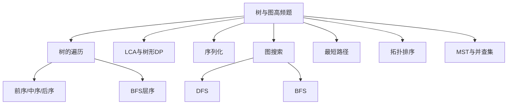
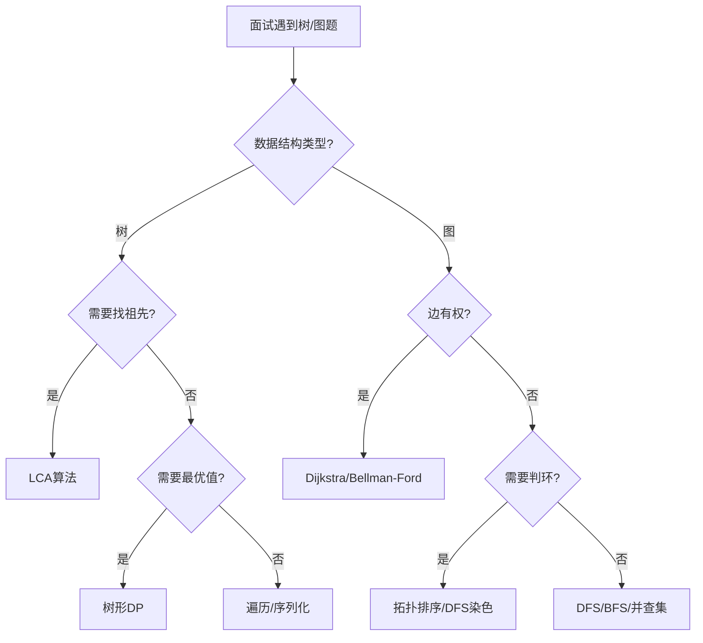
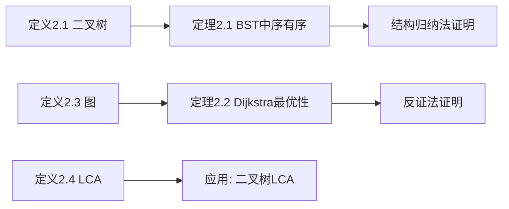

> 📊 **项目全面梳理**：详细的项目结构、模块详解和学习路径，请参阅 [`项目全面梳理-2025.md`](../../项目全面梳理-2025.md)

## 高频Top100-树与图 / Top 100 Frequent - Tree & Graph

### 摘要 / Executive Summary

- 树与图是算法面试中**区分度最高**的模块之一，尤其在一线互联网公司的后端与算法岗位中，图论题目常作为 medium-hard 关卡出现。
- 本文精选约 $15$ 道树与图高频题，按**范式重组**为七大类：遍历、LCA、序列化、图搜索、最短路径、拓扑排序、MST。
- 每道题提供形式化规约、最优解思路、复杂度分析与正确性要点，并附多维矩阵对比表，帮助读者在面试中快速识别图结构并选择正确算法。

### 关键术语与符号 / Glossary

| 术语 / Term | 定义 / Definition |
|-------------|-------------------|
| LCA (Lowest Common Ancestor) | 二叉树中两个节点的最近公共祖先，即深度最大的公共祖先节点 |
| 序列化 Serialization | 将树/图结构转换为一维字符串表示，支持反序列化恢复原始结构 |
| 拓扑排序 Topological Sort | 有向无环图顶点的线性排序，使得对每条边 $(u,v)$ 都有 $u$ 在 $v$ 之前 |
| 并查集 Union-Find | 维护元素分区数据结构，支持 $O(\alpha(n))$ 的合并与查询操作 |
| 生成树 Spanning Tree | 包含图中所有顶点的无环连通子图 |
| 强连通分量 SCC | 有向图中极大强连通子图，分量内任意两点互相可达 |

### 目录 / Table of Contents

- [高频Top100-树与图](#高频top100-树与图)
  - [摘要 / Executive Summary](#摘要--executive-summary)
  - [关键术语与符号 / Glossary](#关键术语与符号--glossary)
  - [目录 / Table of Contents](#目录--table-of-contents)
  - [交叉引用与依赖](#交叉引用与依赖)
  - [1. 范式一：树的遍历](#1-范式一树的遍历)
  - [2. 范式二：LCA与树形DP](#2-范式二lca与树形dp)
  - [3. 范式三：树的序列化](#3-范式三树的序列化)
  - [4. 范式四：图搜索](#4-范式四图搜索)
  - [5. 范式五：最短路径](#5-范式五最短路径)
  - [6. 范式六：拓扑排序](#6-范式六拓扑排序)
  - [7. 范式七：MST与并查集](#7-范式七mst与并查集)
  - [8. 多维矩阵对比表](#8-多维矩阵对比表)
  - [9. 面试口述模板](#9-面试口述模板)
  - [10. 自测问题](#10-自测问题)
  - [参考文献](#参考文献)

### 交叉引用与依赖

**上游理论依赖**:

- [`09-算法理论/01-算法基础/05-图算法理论.md`](../../09-算法理论/01-算法基础/05-图算法理论.md) — 图论理论基础
- [`05-图论专题/00-图论专题导论.md`](../05-图论专题/00-图论专题导论.md) — 图论面试框架与复杂度速查
- `03-数据结构专题/03-二叉树.md` — 二叉树理论基础

**下游应用**:

- `06-面试专题/03-高频Top100-DP与贪心.md` — 树形 DP 与贪心策略

---

## 0. 形式化定义与核心定理

### 0.1 形式化定义

> **定义 2.1**（二叉树 / Binary Tree）
> 二叉树 $T$ 要么为空（$T =  ext{nil}$），要么由一个根节点 $r$ 和两棵不相交的二叉树 $T_L, T_R$ 组成，记作 $T = (r, T_L, T_R)$。节点数记为 $|T|$，高度记为 $h(T) = 1 + \max(h(T_L), h(T_R))$（空树高度为0）。

> **定义 2.2**（二叉搜索树 / BST）
> 二叉搜索树是满足以下条件的二叉树：对任意节点 $v$，其左子树中所有节点值小于 $v. ext{val}$，右子树中所有节点值大于 $v. ext{val}$。形式化地：
> $$
> orall x \in T_L: x. ext{val} < v. ext{val} \quad \land \quad orall y \in T_R: y. ext{val} > v. ext{val}
> $$

> **定义 2.3**（图 / Graph）
> 图 $G = (V, E)$ 由顶点集 $V$ 和边集 $E \subseteq V  imes V$ 组成。若边无方向，称 $G$ 为无向图；若有方向，称有向图。边权函数 $w: E  o \mathbb{R}$ 给每条边赋权。

> **定义 2.4**（最近公共祖先 / LCA）
> 设二叉树 $T$ 中节点 $p, q$ 均存在。节点 $r$ 称为 $p$ 和 $q$ 的最近公共祖先，当且仅当：
>
> 1. $r$ 是 $p$ 和 $q$ 的公共祖先（$p, q$ 均在以 $r$ 为根的子树中）
> 2. $r$ 的深度最大（即不存在 $r$ 的子孙也是 $p, q$ 的公共祖先）

### 0.2 核心定理与证明

> **定理 2.1**（BST 中序遍历有序性定理）
> 对任意二叉搜索树 $T$，其中序遍历（左-根-右）输出的序列严格递增。

**证明**：

对树的结构进行归纳（结构归纳法）。

**基础**：$|T| = 0$（空树），中序遍历输出空序列，平凡有序。

**归纳假设**：设 $|T| < n$ 时定理成立。

**归纳步**：考虑 $|T| = n$ 的 BST，根为 $r$，左子树 $T_L$，右子树 $T_R$。由 BST 定义，$orall x \in T_L: x < r$ 且 $orall y \in T_R: y > r$。中序遍历输出为 $InOrder(T_L) \oplus [r] \oplus InOrder(T_R)$。由归纳假设，$InOrder(T_L)$ 和 $InOrder(T_R)$ 分别有序；又由 BST 性质，$InOrder(T_L)$ 中所有元素 $< r <$ $InOrder(T_R)$ 中所有元素。因此整体序列有序。证毕。$\square$

> **定理 2.2**（Dijkstra 最优性子定理）
> 在边权均为非负的带权图 $G = (V, E, w)$ 中，设 $S$ 为已确定最短距离的顶点集合。每次从 $V \setminus S$ 中选择距离估计值最小的顶点 $u$ 加入 $S$ 时，$d[u]$ 即为源点 $s$ 到 $u$ 的最短距离。

**证明**：

采用反证法。设 $u$ 是被选中的顶点，假设存在一条更短的路径 $P$ 从 $s$ 到 $u$，其长度 $< d[u]$。由于 $s \in S$ 而 $u
otin S$，路径 $P$ 必经过某条从 $S$ 到 $V \setminus S$ 的边。设 $P$ 上第一个属于 $V \setminus S$ 的顶点为 $x$，则 $P$ 可分解为 $s \leadsto y  o x \leadsto u$，其中 $y \in S$。由于所有边权非负，$len(s \leadsto x) \leq len(P) < d[u]$。但 $d[x]$ 作为 $x$ 的距离估计值，满足 $d[x] \leq len(s \leadsto x) < d[u]$，这与 $u$ 是 $V \setminus S$ 中距离估计值最小的顶点矛盾。因此 $d[u]$ 已是最短距离。证毕。$\square$

> **定理 2.3**（树形 DP 最优子结构定理）
> 设树形 DP 的状态 $dp[v]$ 表示以 $v$ 为根的子树上的最优值。若状态转移方程满足：
> $$
> dp[v] = f(v. ext{val}, dp[v_L], dp[v_R])
> $$
> 其中 $f$ 为某种合并函数，则 $dp[v]$ 可由子树最优值正确计算。

**证明**：

对树高进行归纳。

**基础**：$h = 0$（叶子节点），$dp[v] = f(v. ext{val},  ext{nil},  ext{nil})$，正确。

**归纳假设**：设对所有高度 $< h$ 的子树，DP 值正确。

**归纳步**：对高度为 $h$ 的节点 $v$，其左右子树高度均 $< h$。由归纳假设，$dp[v_L]$ 和 $dp[v_R]$ 分别为左右子树的最优值。若问题的最优解包含子问题的最优解（最优子结构），则 $dp[v] = f(v. ext{val}, dp[v_L], dp[v_R])$ 必为以 $v$ 为根的子树的最优值。证毕。$\square$

### 0.3 思维表征







---

## 1. 范式一：树的遍历

### 1.1 LC 94 — Binary Tree Inorder Traversal

> **链接**: [LeetCode 94](https://leetcode.com/problems/binary-tree-inorder-traversal/) | **难度**: Easy

#### 形式化规约

**输入**: 二叉树根节点 $root$
**输出**: 中序遍历序列（左-根-右）

#### 最优解思路

**递归**：直接按照左-根-右顺序递归。

**迭代**：用栈模拟递归过程。当前节点入栈后深入左子树，无左子树时弹出访问并转向右子树。

#### 复杂度

| 指标 | 值 |
|------|---|
| 时间 | $O(n)$ |
| 空间 | $O(h)$，$h$ 为树高，最坏 $O(n)$ |

#### 正确性要点

- 迭代实现中，栈保存的是"待处理"的节点路径
- Morris 遍历可实现 $O(1)$ 空间，但面试中通常不要求

### 1.2 LC 102 — Binary Tree Level Order Traversal

> **链接**: [LeetCode 102](https://leetcode.com/problems/binary-tree-level-order-traversal/) | **难度**: Medium

#### 形式化规约

**输入**: 二叉树根节点 $root$
**输出**: 按层遍历的节点值列表（每层一个子列表）

#### 最优解思路

BFS：用队列维护当前层的所有节点。每次处理一层时，先记录当前队列大小 $size$，然后恰好弹出 $size$ 个节点（即为当前层所有节点），将它们的子节点入队。

#### 复杂度

| 指标 | 值 |
|------|---|
| 时间 | $O(n)$ |
| 空间 | $O(w)$，$w$ 为最大层宽，最坏 $O(n)$ |

#### 正确性要点

- 通过记录队列大小来区分不同层，避免额外标记
- 这是 BFS 在树结构上的经典应用

### 1.3 LC 104 — Maximum Depth of Binary Tree

> **链接**: [LeetCode 104](https://leetcode.com/problems/maximum-depth-of-binary-tree/) | **难度**: Easy

#### 形式化规约

**输入**: 二叉树根节点 $root$
**输出**: 树的最大深度（根到最远叶子节点的路径长度）

#### 最优解思路

递归：$depth(root) = 1 + \max(depth(root.left), depth(root.right))$。

#### 复杂度

| 指标 | 值 |
|------|---|
| 时间 | $O(n)$ |
| 空间 | $O(h)$ |

### 1.4 LC 124 — Binary Tree Maximum Path Sum

> **链接**: [LeetCode 124](https://leetcode.com/problems/binary-tree-maximum-path-sum/) | **难度**: Hard

#### 形式化规约

**输入**: 二叉树根节点 $root$
**输出**: 任意路径（至少一个节点）的最大节点值和

#### 最优解思路

树形 DP：后序遍历，对每个节点计算"以该节点为端点的最大路径和"（只能向下延伸一条分支），同时用全局变量维护"经过该节点的最大路径和"（可包含左右两条分支）。

#### 复杂度

| 指标 | 值 |
|------|---|
| 时间 | $O(n)$ |
| 空间 | $O(h)$ |

#### 正确性要点

- 返回给父节点的值只能是单分支最大值（$\max(0, left) + node.val + \max(0, right)$ 中只取一条分支）
- 更新全局答案时可以取双分支（形成倒V形路径）
- 负值节点需要与 $0$ 取 max 决定是否包含该分支

### 1.5 LC 98 — Validate Binary Search Tree

> **链接**: [LeetCode 98](https://leetcode.com/problems/validate-binary-search-tree/) | **难度**: Medium

#### 形式化规约

**输入**: 二叉树根节点 $root$
**输出**: 该树是否为合法 BST

#### 最优解思路

中序遍历验证：BST 的中序遍历应为严格递增序列。维护前一个访问节点的值，检查当前节点是否大于前驱。

#### 复杂度

| 指标 | 值 |
|------|---|
| 时间 | $O(n)$ |
| 空间 | $O(h)$ |

#### 正确性要点

- 不能仅比较左右子节点（需要传递上下界约束）
- 中序遍历法更简洁，只需维护一个前驱变量
- 注意处理 INT_MIN 等边界值，使用 long long 或指针判空

---

## 2. 范式二：LCA与树形DP

### 2.1 LC 236 — Lowest Common Ancestor of a Binary Tree

> **链接**: [LeetCode 236](https://leetcode.com/problems/lowest-common-ancestor-of-a-binary-tree/) | **难度**: Medium

#### 形式化规约

**输入**: 二叉树根节点 $root$，两个目标节点 $p, q$
**输出**: $p$ 和 $q$ 的最近公共祖先

#### 最优解思路

递归后序遍历：在左右子树中分别查找 $p$ 和 $q$。

- 若当前节点为 $p$ 或 $q$，返回当前节点
- 若左子树找到且右子树也找到，当前节点为 LCA
- 若只有一侧找到，将该结果向上传递

#### 复杂度

| 指标 | 值 |
|------|---|
| 时间 | $O(n)$ |
| 空间 | $O(h)$ |

#### 正确性要点

- 该解法假设 $p$ 和 $q$ 一定存在于树中
- 核心逻辑：`if left and right: return root; else: return left or right`
- 若节点值唯一，也可用哈希表存储父指针后求交点

### 2.2 LC 235 — Lowest Common Ancestor of a BST

> **链接**: [LeetCode 235](https://leetcode.com/problems/lowest-common-ancestor-of-a-binary-search-tree/) | **难度**: Medium

#### 形式化规约

**输入**: BST 根节点 $root$，两个目标节点 $p, q$
**输出**: $p$ 和 $q$ 的最近公共祖先

#### 最优解思路

利用 BST 性质：若 $p.val < root.val < q.val$（或反之），则 $root$ 为 LCA；若都小于，则 LCA 在左子树；若都大于，则 LCA 在右子树。

#### 复杂度

| 指标 | 值 |
|------|---|
| 时间 | $O(h)$ |
| 空间 | $O(1)$ |

#### 正确性要点

- BST 的 LCA 问题可优化到 $O(h)$，因为利用有序性可以剪枝
- 迭代实现只需常数空间

---

## 3. 范式三：树的序列化

### 3.1 LC 297 — Serialize and Deserialize Binary Tree

> **链接**: [LeetCode 297](https://leetcode.com/problems/serialize-and-deserialize-binary-tree/) | **难度**: Hard

#### 形式化规约

**输入/输出**: 二叉树 $\leftrightarrow$ 字符串表示

#### 最优解思路

**前序序列化**：按根-左-右顺序输出，空节点用特殊标记（如 `#`）。

**反序列化**：按前序顺序重建，遇到 `#` 返回空节点。

#### 复杂度

| 指标 | 值 |
|------|---|
| 时间 | $O(n)$ |
| 空间 | $O(n)$ |

#### 正确性要点

- 必须记录空节点，否则无法唯一确定树的结构
- 层序（BFS）序列化也可行，用队列辅助重建
- 序列化字符串可用逗号分隔，提高可读性

---

## 4. 范式四：图搜索

### 4.1 LC 200 — Number of Islands

> **链接**: [LeetCode 200](https://leetcode.com/problems/number-of-islands/) | **难度**: Medium

#### 形式化规约

**输入**: $m \times n$ 网格 $grid$，$grid[i][j] \in \{'0', '1'\}$
**输出**: 岛屿数量（由 `'1'` 组成的四连通区域数）

#### 最优解思路

DFS/BFS：遍历网格，遇到 `'1'` 时启动 DFS 将该岛屿所有 `'1'` 标记为 `'0'`（或访问标记），岛屿计数 +1。

#### 复杂度

| 指标 | 值 |
|------|---|
| 时间 | $O(mn)$ |
| 空间 | $O(mn)$ 最坏（递归栈/队列） |

#### 正确性要点

- 每个陆地格子恰好被访问一次（访问后立即标记）
- DFS 的递归深度最坏为 $O(mn)$，极大网格需考虑栈溢出，可改用 BFS

### 4.2 LC 133 — Clone Graph

> **链接**: [LeetCode 133](https://leetcode.com/problems/clone-graph/) | **难度**: Medium

#### 形式化规约

**输入**: 连通无向图的某个节点 $node$
**输出**: 该图的深拷贝

#### 最优解思路

DFS/BFS + 哈希表：用哈希表记录原节点到新节点的映射，避免重复创建。遍历原图的所有边和邻居，在新图中建立对应连接。

#### 复杂度

| 指标 | 值 |
|------|---|
| 时间 | $O(V + E)$ |
| 空间 | $O(V)$ |

#### 正确性要点

- 哈希表的核心作用是"查重"：若节点已拷贝则直接返回引用
- 需处理自环和重边（本题图模型已限定无自环、无重边）

### 4.3 LC 207 — Course Schedule

> **链接**: [LeetCode 207](https://leetcode.com/problems/course-schedule/) | **难度**: Medium

#### 形式化规约

**输入**: 课程数 $numCourses$，先修关系 $prerequisites = [(a, b)]$ 表示 $b$ 是 $a$ 的先修课
**输出**: 能否完成所有课程（即图是否为 DAG）

#### 最优解思路

拓扑排序：

- **Kahn 算法**：计算每个节点的入度，将入度为 $0$ 的节点入队，依次移除并更新邻居入度。若最终处理节点数等于 $numCourses$，则无环。
- **DFS 染色法**：用 $0/1/2$ 标记未访问/访问中/已访问，若遇到访问中的节点说明有环。

#### 复杂度

| 指标 | 值 |
|------|---|
| 时间 | $O(V + E)$ |
| 空间 | $O(V + E)$ |

#### 正确性要点

- Kahn 算法的核心：入度为 $0$ 的节点没有未完成的先修依赖
- DFS 染色的核心：$1$（访问中）表示当前 DFS 路径上存在回边，即环

### 4.4 LC 261 — Graph Valid Tree

> **链接**: [LeetCode 261](https://leetcode.com/problems/graph-valid-tree/) | **难度**: Medium

#### 形式化规约

**输入**: 节点数 $n$，边列表 $edges$
**输出**: 该图是否为有效树（连通且无环）

#### 最优解思路

并查集：树的充要条件是 $|E| = |V| - 1$ 且连通。

- 若边数 $\neq n-1$，直接返回 false
- 用并查集检查连通性，若合并时发现两点已在同一集合，说明有环

#### 复杂度

| 指标 | 值 |
|------|---|
| 时间 | $O(n \cdot \alpha(n))$ |
| 空间 | $O(n)$ |

#### 正确性要点

- 树的基本定理：$n$ 个节点的树恰好有 $n-1$ 条边且连通
- 并查集的 $union$ 操作若返回 false（已在同一集合），说明存在环

---

## 5. 范式五：最短路径

### 5.1 LC 743 — Network Delay Time

> **链接**: [LeetCode 743](https://leetcode.com/problems/network-delay-time/) | **难度**: Medium

#### 形式化规约

**输入**: 节点数 $n$，有向边列表 $times = [(u, v, w)]$，源点 $k$
**输出**: 从 $k$ 到所有节点的最短路径中的最大值（即信号传播完所需时间），若存在不可达节点则返回 $-1$

#### 最优解思路

Dijkstra：单源最短路径，所有边权为正。使用优先队列（最小堆）维护当前已知最短距离。

#### 复杂度

| 指标 | 值 |
|------|---|
| 时间 | $O((V + E) \log V)$ |
| 空间 | $O(V + E)$ |

#### 正确性要点

- Dijkstra 的贪心性质：每次从堆中取出距离最小的节点时，其最短距离已确定
- 需要处理不可达节点（距离仍为无穷大）
- 可用二维数组或邻接表建图

---

## 6. 范式六：拓扑排序

### 6.1 LC 210 — Course Schedule II

> **链接**: [LeetCode 210](https://leetcode.com/problems/course-schedule-ii/) | **难度**: Medium

#### 形式化规约

**输入**: 同 LC 207
**输出**: 一个合法的修课顺序，若不存在则返回空数组

#### 最优解思路

Kahn 算法：拓扑排序的同时输出顺序。将每次入度变为 $0$ 的节点加入结果列表。

#### 复杂度

| 指标 | 值 |
|------|---|
| 时间 | $O(V + E)$ |
| 空间 | $O(V + E)$ |

#### 正确性要点

- 输出顺序即为拓扑序：若 $(u, v) \in E$，则 $u$ 在 $v$ 之前输出
- 若结果长度 $< V$，说明图中存在环，无法完成所有课程

---

## 7. 范式七：MST与并查集

### 7.1 LC 1584 — Min Cost to Connect All Points

> **链接**: [LeetCode 1584](https://leetcode.com/problems/min-cost-to-connect-all-points/) | **难度**: Medium

#### 形式化规约

**输入**: 二维平面点集 $points$
**输出**: 连接所有点的最小费用（边权为曼哈顿距离）

#### 最优解思路

MST：将点集视为完全图，边权为曼哈顿距离，求 MST。

- **Kruskal**：枚举所有 $O(n^2)$ 条边，排序后用并查集选边，$O(n^2 \log n)$。
- **Prim**：从某点出发，用优先队列维护当前连通集到外部点的最小距离，$O(n^2)$ 或 $O(n^2 \log n)$。

#### 复杂度

| 指标 | Kruskal | Prim (稠密优化) |
|------|---------|----------------|
| 时间 | $O(n^2 \log n)$ | $O(n^2)$ |
| 空间 | $O(n^2)$ | $O(n)$ |

#### 正确性要点

- 完全图边数为 $n(n-1)/2$，Kruskal 需要枚举并排序所有边
- Prim 的稠密优化（不用堆，直接数组找最小）可将时间优化到 $O(n^2)$

---

## 8. 多维矩阵对比表

| 题号 | 题目 | 范式 | 时间 | 空间 | 核心技巧 | 难度 |
|------|------|------|------|------|---------|------|
| LC 94 | Binary Tree Inorder | 遍历 | $O(n)$ | $O(h)$ | 栈模拟递归 | Easy |
| LC 102 | Binary Tree Level Order | 遍历 | $O(n)$ | $O(w)$ | BFS+层大小 | Medium |
| LC 104 | Max Depth | 遍历 | $O(n)$ | $O(h)$ | 递归深度 | Easy |
| LC 124 | Max Path Sum | 树形DP | $O(n)$ | $O(h)$ | 后序+全局变量 | Hard |
| LC 98 | Validate BST | 遍历 | $O(n)$ | $O(h)$ | 中序递增 | Medium |
| LC 236 | LCA of Binary Tree | LCA | $O(n)$ | $O(h)$ | 后序传递 | Medium |
| LC 235 | LCA of BST | LCA | $O(h)$ | $O(1)$ | BST性质剪枝 | Medium |
| LC 297 | Serialize/Deserialize | 序列化 | $O(n)$ | $O(n)$ | 前序+#标记 | Hard |
| LC 200 | Number of Islands | 图搜索 | $O(mn)$ | $O(mn)$ | DFS/BFS标记 | Medium |
| LC 133 | Clone Graph | 图搜索 | $O(V+E)$ | $O(V)$ | 哈希表映射 | Medium |
| LC 207 | Course Schedule | 拓扑排序 | $O(V+E)$ | $O(V+E)$ | Kahn/DFS染色 | Medium |
| LC 261 | Graph Valid Tree | 并查集 | $O(n\alpha(n))$ | $O(n)$ | 边数+连通性 | Medium |
| LC 743 | Network Delay Time | 最短路径 | $O((V+E)\log V)$ | $O(V+E)$ | Dijkstra | Medium |
| LC 210 | Course Schedule II | 拓扑排序 | $O(V+E)$ | $O(V+E)$ | Kahn输出序 | Medium |
| LC 1584 | Connect All Points | MST | $O(n^2)$ / $O(n^2\log n)$ | $O(n)$ / $O(n^2)$ | Prim/Kruskal | Medium |

---

## 9. 面试口述模板

### 9.1 树遍历类口述模板

```
"这道题是二叉树[遍历/路径/性质判断]问题。我考虑用[递归/迭代]方式解决。

对于递归，核心思路是：[描述递归子问题和合并逻辑]。
基准情况是：[空节点的处理]。

对于迭代，我用[栈/队列]模拟递归过程/层序遍历。

时间复杂度 O(n)，每个节点访问一次。
空间复杂度 O(h)，h 为树高，平衡树时为 O(log n)，最坏链状 O(n)。"
```

### 9.2 LCA 类口述模板

```
"这道题求最近公共祖先。我的思路是后序遍历，在左右子树中分别查找 p 和 q。

若当前节点等于 p 或 q，直接返回。
若左子树找到且右子树也找到，说明当前节点就是 LCA。
若只有一侧找到，将该结果向上传递。

对于 BST，可以利用有序性优化：比较 p、q 与当前节点值的大小关系，
若分居两侧则当前为 LCA，否则向对应子树递归。复杂度可优化到 O(h)。"
```

### 9.3 图搜索类口述模板

```
"这道题可以建模为图问题。[实体]作为顶点，[关系]作为边。

我用[DFS/BFS/并查集]来[遍历/判环/求连通分量]。
建图时使用[邻接表/邻接矩阵]，空间[分析]。

需要注意的边界：[自环、重边、不连通分量、空图]。

时间复杂度 O(V+E)，空间复杂度 O(V)。"
```

---

## 10. 自测问题

### 问题 1：LCA 递归的边界情况

**Q**: LCA 问题中，若 $p$ 是 $q$ 的祖先，算法是否正确？

**A**: 正确。当递归到 $p$ 时，若 $p == q$ 则直接返回 $p$；否则在 $p$ 的子树中搜索 $q$。由于 $p$ 是 $q$ 祖先，$q$ 必在 $p$ 的子树中，最终会找到 $q$ 并返回。在 $p$ 的父节点处，左（或右）子树返回 $p$，另一子树返回 null，根据 `return left or right` 逻辑，$p$ 被向上传递，最终成为 LCA。

### 问题 2：拓扑排序的环检测

**Q**: Kahn 算法和 DFS 染色法检测环，各自的优势场景是什么？

**A**: Kahn 算法天然输出拓扑序，适合需要顺序的场景（如课程表 II）。DFS 染色法代码更简洁，适合仅需判断是否有环的场景。Kahn 需要维护入度数组和队列，DFS 只需状态数组。

### 问题 3：Dijkstra 与 BFS 的关系

**Q**: 为什么 Dijkstra 被称为"带权 BFS"？

**A**: BFS 使用普通队列，保证先发现的节点距离更短（无权图中步数 = 距离）。Dijkstra 使用优先队列，按当前已知最短距离出队，保证了当节点出队时其最短距离已确定。两者都遵循"一旦确定不再更新"的贪心策略，区别仅在于 Dijkstra 需要处理边权。

### 问题 4：并查集的按秩合并

**Q**: 并查集为什么需要按秩合并？只路径压缩不够吗？

**A**: 路径压缩优化查询，按秩合并且优化合并。两者结合可将摊还复杂度降至 $O(\alpha(n))$。若只有路径压缩而无按秩合并，最坏情况下树高仍可能达到 $O(\log n)$（虽然实际表现通常很好）。

### 问题 5：树序列化的唯一性

**Q**: 为什么前序遍历记录空节点可以唯一确定二叉树？中序遍历记录空节点可以吗？

**A**: 前序遍历的"根-左-右"顺序使得第一个元素必为根，结合空节点标记可以递归确定左右子树的边界。中序遍历记录空节点也可以唯一确定树，但无法直接从序列头部确定根的位置（需要先数出左子树大小），实现更复杂。前序+中序、后序+中序（不含空标记）也可以唯一确定，但需要节点值互不相同。

---

## 11. 学习目标

完成本章学习后，读者应能够：

1. **形式化描述**二叉树、BST、图、LCA 等核心概念。
2. **熟练运用**树遍历（前序/中序/后序/层序）和图搜索（DFS/BFS）解决高频题。
3. **独立推导**Dijkstra 最优性证明和树形 DP 最优子结构证明。
4. **快速识别**LCA、树形 DP、拓扑排序、MST 等问题的适用场景。
5. **在面试中**用结构归纳法证明树相关算法的正确性。

---

## 参考文献

- [CLRS2022] Cormen, T. H., et al. *Introduction to Algorithms* (4th ed.). MIT Press, 2022. §22 图的基本算法
- [Tarjan1972] Tarjan, R. E. "Depth-first search and linear graph algorithms." *SIAM Journal on Computing*, 1972.
- NeetCode 150 题单: <https://neetcode.io/roadmap>

---

> 📚 **返回目录**: [LeetCode算法面试专题](../README.md)
