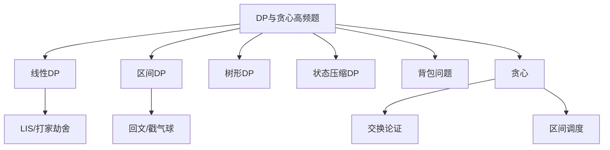
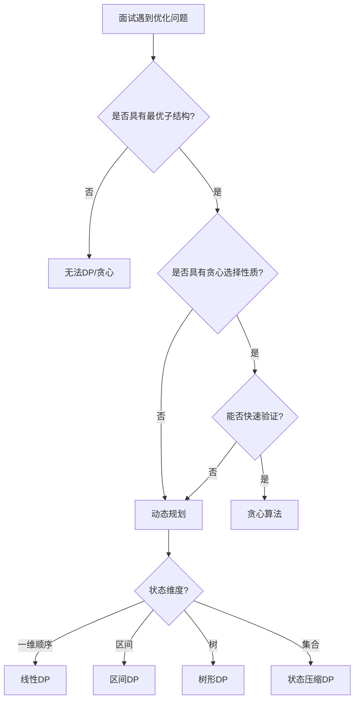
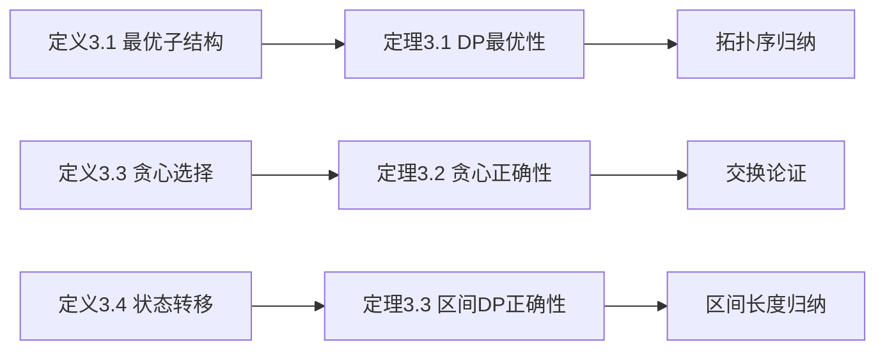

> 📊 **项目全面梳理**：详细的项目结构、模块详解和学习路径，请参阅 [`项目全面梳理-2025.md`](../../项目全面梳理-2025.md)

## 高频Top100-DP与贪心 / Top 100 Frequent - DP & Greedy

### 摘要 / Executive Summary

- 动态规划（DP）与贪心是算法面试中**难度最高、区分度最强**的模块。DP 题考察状态设计能力，贪心题考察最优子结构洞察与正确性证明能力。
- 本文精选约 $15$ 道 DP 与贪心高频题，按 DP 类型重组为五类：线性 DP、区间 DP、树形 DP、状态压缩 DP、背包问题。贪心题强调**交换论证**（Exchange Argument）的正确性证明方法。
- 每道题提供形式化规约、最优解思路、复杂度分析与正确性要点，帮助读者建立系统化的 DP 解题框架。

### 关键术语与符号 / Glossary

| 术语 / Term | 定义 / Definition |
|-------------|-------------------|
| 最优子结构 Optimal Substructure | 问题的最优解包含子问题的最优解 |
| 重叠子问题 Overlapping Subproblems | 递归求解过程中多次遇到相同的子问题 |
| 状态 State | DP 中描述子问题特征的变量集合 |
| 状态转移方程 Transition | 从已知状态推导新状态的递推关系 |
| 交换论证 Exchange Argument | 证明贪心策略最优性的经典方法：假设存在更优解，通过交换元素构造矛盾 |
| 背包问题 Knapsack Problem | 在容量限制下选择物品使价值最大化的一类经典优化问题 |
| 状态压缩 State Compression | 用二进制位表示集合状态，将指数级状态空间压缩到 $O(2^n)$ |

### 目录 / Table of Contents

- [高频Top100-DP与贪心](#高频top100-dp与贪心)
  - [摘要 / Executive Summary](#摘要--executive-summary)
  - [关键术语与符号 / Glossary](#关键术语与符号--glossary)
  - [目录 / Table of Contents](#目录--table-of-contents)
  - [交叉引用与依赖](#交叉引用与依赖)
  - [1. 范式一：线性DP](#1-范式一线性dp)
  - [2. 范式二：区间DP](#2-范式二区间dp)
  - [3. 范式三：树形DP](#3-范式三树形dp)
  - [4. 范式四：状态压缩DP](#4-范式四状态压缩dp)
  - [5. 范式五：背包问题](#5-范式五背包问题)
  - [6. 范式六：贪心](#6-范式六贪心)
  - [7. 多维矩阵对比表](#7-多维矩阵对比表)
  - [8. 面试口述模板](#8-面试口述模板)
  - [9. 自测问题](#9-自测问题)
  - [参考文献](#参考文献)

### 交叉引用与依赖

**上游理论依赖**:

- `09-算法理论/02-递归理论/03-动态规划.md` — DP 的理论基础：最优子结构与重叠子问题
- [`04-算法复杂度/01-时间复杂度.md`](../../04-算法复杂度/01-时间复杂度.md) — 复杂度分析
- [`06-面试专题/02-高频Top100-树与图.md`](./02-高频Top100-树与图.md) — 树形 DP 依赖树遍历基础

**下游应用**:

- `06-面试专题/04-高频Top100-回溯与分治.md` — 部分 DP 问题可用回溯或分治优化

---

## 0. 形式化定义与核心定理

### 0.1 形式化定义

> **定义 3.1**（最优子结构 / Optimal Substructure）
> 问题 $\mathcal{P}$ 具有最优子结构，当且仅当其任意最优解 $OPT$ 所包含的子问题的解 $OPT'$ 也是对应子问题的最优解。形式化地：
> $$
>  ext{OPT}(\mathcal{P}) =  ext{combine}ig(v,  ext{OPT}(\mathcal{P}_1),  ext{OPT}(\mathcal{P}_2), \ldots,  ext{OPT}(\mathcal{P}_k)ig)
> $$
> 其中 $\mathcal{P}_i$ 为 $\mathcal{P}$ 的子问题，$v$ 为当前决策的代价/收益。

> **定义 3.2**（重叠子问题 / Overlapping Subproblems）
> 问题 $\mathcal{P}$ 具有重叠子问题性质，当且仅当在递归求解过程中，同一子问题被多次求解。即递归调用树中不同路径上存在相同的子问题实例。

> **定义 3.3**（贪心选择性质 / Greedy Choice Property）
> 问题 $\mathcal{P}$ 具有贪心选择性质，当且仅当存在一个局部最优选择（贪心选择），将其包含在全局最优解中后，剩余的子问题仍然可以被最优求解。形式化地，存在贪心选择 $g$ 使得：
> $$
> \exists g:  ext{OPT} = \{g\} \cup  ext{OPT}(\mathcal{P}')
> $$
> 其中 $\mathcal{P}'$ 为做出选择 $g$ 后的子问题。

> **定义 3.4**（状态与状态转移方程）
> DP 状态 $dp[s]$ 是描述子问题特征的变量集合的函数。状态转移方程定义了从已知状态推导新状态的递推关系：
> $$
> dp[s] =  ext{transition}ig(dp[s_1], dp[s_2], \ldots, dp[s_m],  ext{input}ig)
> $$

### 0.2 核心定理与证明

> **定理 3.1**（DP 最优子结构传递定理）
> 若问题 $\mathcal{P}$ 具有最优子结构，且状态转移方程 $dp[s] = f(dp[s_1], \ldots)$ 中的 $f$ 对最优解具有保优性（即子问题最优 $\Rightarrow$ 父问题最优），则通过自底向上计算 $dp$ 表得到的 $dp[s_0]$（$s_0$ 为初始状态）是原问题的最优值。

**证明**：

对状态依赖图进行拓扑序归纳。

**基础**：所有无依赖的状态（边界状态）直接初始化，其最优性由问题定义保证。

**归纳假设**：设所有在拓扑序中位于状态 $s$ 之前的状态均已计算出最优值。

**归纳步**：状态 $s$ 依赖 $s_1, \ldots, s_m$。由归纳假设，$dp[s_i]$ 均为子问题最优值。由最优子结构，$s$ 的最优解必由某个（或某些）$s_i$ 的最优解组合而成。状态转移方程 $f$ 遍历了所有可能的组合方式并取最优，因此 $dp[s]$ 必为 $s$ 对应子问题的最优值。

由归纳法，所有状态（包括 $s_0$）均得到最优值。证毕。$\square$

> **定理 3.2**（贪心选择正确性定理 — 交换论证框架）
> 设问题 $\mathcal{P}$ 具有贪心选择性质，$g$ 为贪心算法的第一步选择。若对任意最优解 $OPT$ 都可以将其第一步替换为 $g$ 而得到另一个不更差的最优解 $OPT'$，则贪心算法最优。

**证明**：

设贪心算法的选择序列为 $G = (g_1, g_2, \ldots, g_k)$，$OPT$ 为任意最优解。

**第一步替换**：由条件，可将 $OPT$ 的第一步替换为 $g_1$ 得到 $OPT_1$，满足 $|OPT_1| = |OPT|$ 且 $OPT_1$ 可行。

**迭代替换**：对 $OPT_1$ 的剩余子问题重复上述替换，将 $g_2$ 代入得到 $OPT_2$，依此类推。

**终止**：经过 $k$ 步替换后，得到 $OPT_k = G$。由于每次替换都不降低解的质量，$G$ 与 $OPT$ 同样最优。

因此贪心算法 $G$ 是最优的。证毕。$\square$

> **定理 3.3**（区间 DP 正确性定理）
> 对于区间 $[i, j]$ 上的最优值 $dp[i][j]$，若状态转移枚举了所有合法的分割点 $k \in (i, j)$ 并取最优，且计算顺序按区间长度从小到大，则 $dp[i][j]$ 正确。

**证明**：

对区间长度 $len = j - i$ 进行归纳。

**基础**：$len = 0$ 或 $1$（相邻或空区间），边界条件正确。

**归纳假设**：设所有长度 $< len$ 的区间已正确计算。

**归纳步**：对长度 $len$ 的区间 $[i, j]$，转移枚举 $k \in (i, j)$。每个子区间 $[i, k]$ 和 $[k, j]$ 的长度均 $< len$，由归纳假设其 $dp$ 值正确。转移取遍所有 $k$ 的最优组合，因此 $dp[i][j]$ 正确。证毕。$\square$

### 0.3 思维表征







---

## 1. 范式一：线性DP

线性 DP 的状态通常为一维，按顺序遍历数组，每个状态仅依赖前面的有限个状态。

### 1.1 LC 70 — Climbing Stairs

> **链接**: [LeetCode 70](https://leetcode.com/problems/climbing-stairs/) | **难度**: Easy

#### 形式化规约

**输入**: 整数 $n$（台阶数）
**输出**: 爬到第 $n$ 阶的方法数（每次可跨 $1$ 或 $2$ 阶）

#### 最优解思路

$dp[i]$ 表示到达第 $i$ 阶的方法数。状态转移：$dp[i] = dp[i-1] + dp[i-2]$（最后一步跨1阶或2阶）。

#### 复杂度

| 指标 | 值 |
|------|---|
| 时间 | $O(n)$ |
| 空间 | $O(1)$（滚动数组） |

#### 正确性要点

- 斐波那契数列模型
- 边界：$dp[0] = 1, dp[1] = 1$

### 1.2 LC 198 — House Robber

> **链接**: [LeetCode 198](https://leetcode.com/problems/house-robber/) | **难度**: Medium

#### 形式化规约

**输入**: 数组 $nums \in \mathbb{N}^n$，$nums[i]$ 为第 $i$ 户金额
**输出**: 不触发报警（不偷相邻两家）的最大金额

#### 最优解思路

$dp[i]$ 表示前 $i$ 户能偷的最大金额。状态转移：$dp[i] = \max(dp[i-1], dp[i-2] + nums[i])$。

#### 复杂度

| 指标 | 值 |
|------|---|
| 时间 | $O(n)$ |
| 空间 | $O(1)$ |

#### 正确性要点

- 对于第 $i$ 户，只有"不偷"（继承 $dp[i-1]$）和"偷"（$dp[i-2] + nums[i]$）两种选择
- 不能偷相邻两家的约束通过 $dp[i-2]$ 保证

### 1.3 LC 300 — Longest Increasing Subsequence

> **链接**: [LeetCode 300](https://leetcode.com/problems/longest-increasing-subsequence/) | **难度**: Medium

#### 形式化规约

**输入**: 数组 $nums \in \mathbb{Z}^n$
**输出**: 最长严格递增子序列（LIS）的长度

#### 最优解思路

**方案A（DP）**: $dp[i]$ 表示以 $nums[i]$ 结尾的 LIS 长度。$dp[i] = \max_{j < i, nums[j] < nums[i]} (dp[j] + 1)$。时间 $O(n^2)$。

**方案B（二分优化）**: 维护数组 $tails[k]$ 表示长度为 $k+1$ 的递增子序列的最小末尾值。对 $nums[i]$ 在 $tails$ 中二分查找替换位置。时间 $O(n \log n)$。

#### 复杂度

| 指标 | DP | 二分优化 |
|------|----|---------|
| 时间 | $O(n^2)$ | $O(n \log n)$ |
| 空间 | $O(n)$ | $O(n)$ |

#### 正确性要点

- $tails$ 数组是严格递增的，因此可以二分查找
- 二分优化只能求长度，不能直接输出具体序列

### 1.4 LC 322 — Coin Change

> **链接**: [LeetCode 322](https://leetcode.com/problems/coin-change/) | **难度**: Medium

#### 形式化规约

**输入**: 硬币面额数组 $coins \in \mathbb{N}^k$，目标金额 $amount \in \mathbb{N}$
**输出**: 凑成 $amount$ 的最少硬币数，若无法凑成则返回 $-1$

#### 最优解思路

$dp[i]$ 表示凑成金额 $i$ 的最少硬币数。$dp[i] = \min_{c \in coins, c \leq i} (dp[i-c] + 1)$。

#### 复杂度

| 指标 | 值 |
|------|---|
| 时间 | $O(amount \times k)$ |
| 空间 | $O(amount)$ |

#### 正确性要点

- 初始化 $dp[0] = 0$，其余为 $\infty$
- 遍历顺序：完全背包问题，外层遍历金额，内层遍历硬币
- 若 $dp[amount] = \infty$，返回 $-1$

### 1.5 LC 1143 — Longest Common Subsequence

> **链接**: [LeetCode 1143](https://leetcode.com/problems/longest-common-subsequence/) | **难度**: Medium

#### 形式化规约

**输入**: 字符串 $text1, text2$
**输出**: 最长公共子序列（LCS）长度

#### 最优解思路

$dp[i][j]$ 表示 $text1[0:i]$ 和 $text2[0:j]$ 的 LCS 长度。

$$
dp[i][j] = \begin{cases}
dp[i-1][j-1] + 1, & \text{if } text1[i-1] = text2[j-1] \\
\max(dp[i-1][j], dp[i][j-1]), & \text{otherwise}
\end{cases}
$$

#### 复杂度

| 指标 | 值 |
|------|---|
| 时间 | $O(mn)$ |
| 空间 | $O(mn)$，可优化至 $O(\min(m,n))$ |

#### 正确性要点

- 字符相等时必取（LCS 可以包含该字符）
- 字符不等时取左或上的最大值（舍弃某一字符）
- 空间优化只需保留两行或一维数组

---

## 2. 范式二：区间DP

区间 DP 的状态定义为某个区间 $[i, j]$ 上的最优值，通常按区间长度从小到大枚举。

### 2.1 LC 516 — Longest Palindromic Subsequence

> **链接**: [LeetCode 516](https://leetcode.com/problems/longest-palindromic-subsequence/) | **难度**: Medium

#### 形式化规约

**输入**: 字符串 $s$
**输出**: 最长回文子序列长度

#### 最优解思路

$dp[i][j]$ 表示 $s[i:j+1]$ 的最长回文子序列长度。

$$
dp[i][j] = \begin{cases}
dp[i+1][j-1] + 2, & \text{if } s[i] = s[j] \\
\max(dp[i+1][j], dp[i][j-1]), & \text{otherwise}
\end{cases}
$$

#### 复杂度

| 指标 | 值 |
|------|---|
| 时间 | $O(n^2)$ |
| 空间 | $O(n^2)$ |

#### 正确性要点

- 按区间长度从小到大枚举（$len = 1$ 到 $n$）
- $s[i] = s[j]$ 时，两端字符可同时加入回文子序列
- 状态转移只依赖更短区间，保证无后效性

### 2.2 LC 312 — Burst Balloons

> **链接**: [LeetCode 312](https://leetcode.com/problems/burst-balloons/) | **难度**: Hard

#### 形式化规约

**输入**: 数组 $nums \in \mathbb{N}^n$，$nums[i]$ 为第 $i$ 个气球上的数字
**输出**: 戳破所有气球能获得的最大硬币数，戳破气球 $i$ 获得 $nums[left] \times nums[i] \times nums[right]$ 硬币

#### 最优解思路

逆向思考：$dp[i][j]$ 表示开区间 $(i, j)$ 内能获得的最大硬币数。最后戳破的气球 $k$ 将区间分为两部分：$dp[i][k] + dp[k][j] + nums[i] \times nums[k] \times nums[j]$。

#### 复杂度

| 指标 | 值 |
|------|---|
| 时间 | $O(n^3)$ |
| 空间 | $O(n^2)$ |

#### 正确性要点

- 添加虚拟气球 $nums[-1] = nums[n] = 1$ 简化边界
- 逆向思考（考虑最后戳破的气球）比正向思考（考虑第一个戳破）更易处理依赖关系
- 枚举顺序：按区间长度从小到大

---

## 3. 范式三：树形DP

树形 DP 在树的结构上定义状态，通常用后序遍历自底向上计算。

### 3.1 LC 337 — House Robber III

> **链接**: [LeetCode 337](https://leetcode.com/problems/house-robber-iii/) | **难度**: Medium

#### 形式化规约

**输入**: 二叉树 $root$，每个节点有金额值
**输出**: 不偷相邻节点（父-子不能同时偷）的最大金额

#### 最优解思路

对每个节点返回二元组 $(rob, not\_rob)$：

- $rob$：偷当前节点的最大金额 = $node.val + left.not\_rob + right.not\_rob$
- $not\_rob$：不偷当前节点的最大金额 = $\max(left) + \max(right)$

#### 复杂度

| 指标 | 值 |
|------|---|
| 时间 | $O(n)$ |
| 空间 | $O(h)$ |

#### 正确性要点

- 后序遍历：先计算子节点的状态，再计算父节点
- 每个节点只有"偷"和"不偷"两种状态
- 偷当前节点则子节点必不能偷；不偷当前节点则子节点可选偷或不偷

---

## 4. 范式四：状态压缩DP

状态压缩 DP 用二进制位表示集合，适用于 $n \leq 20$ 的集合选择问题。

### 4.1 LC 1986 — Minimum Number of Work Sessions to Finish the Tasks

> **链接**: [LeetCode 1986](https://leetcode.com/problems/minimum-number-of-work-sessions-to-finish-the-tasks/) | **难度**: Medium

#### 形式化规约

**输入**: 任务耗时数组 $tasks$，每段时间上限 $sessionTime$
**输出**: 完成所有任务所需的最少时间段数

#### 最优解思路

$dp[mask]$ 表示完成 $mask$ 表示的任务集合所需的最少时间段数。对每个状态，枚举子集作为最后一个时间段完成的任务。

#### 复杂度

| 指标 | 值 |
|------|---|
| 时间 | $O(3^n)$ 或 $O(2^n \cdot n)$（优化后） |
| 空间 | $O(2^n)$ |

#### 正确性要点

- 状态压缩适用条件：$n$ 较小（一般 $n \leq 20$）
- 预处理每个子集的和，避免重复计算
- 可用子集枚举技巧优化：$sub = mask; sub = (sub-1) \& mask$

---

## 5. 范式五：背包问题

### 5.1 LC 416 — Partition Equal Subset Sum

> **链接**: [LeetCode 416](https://leetcode.com/problems/partition-equal-subset-sum/) | **难度**: Medium

#### 形式化规约

**输入**: 正整数数组 $nums$
**输出**: 能否将数组分成两个子集，使两子集和相等

#### 最优解思路

0/1 背包变形：目标和 $target = sum(nums) / 2$。$dp[i]$ 表示是否能凑成和 $i$。

#### 复杂度

| 指标 | 值 |
|------|---|
| 时间 | $O(n \cdot target)$ |
| 空间 | $O(target)$ |

#### 正确性要点

- 若 $sum(nums)$ 为奇数，直接返回 false
- 0/1 背包逆序遍历 $target$ 到 $num$，防止同一物品重复使用

### 5.2 LC 494 — Target Sum

> **链接**: [LeetCode 494](https://leetcode.com/problems/target-sum/) | **难度**: Medium

#### 形式化规约

**输入**: 正整数数组 $nums$，目标值 $target$
**输出**: 在 $nums$ 前添加 `+` 或 `-` 使表达式结果等于 $target$ 的方法数

#### 最优解思路

转化为子集和问题：设正数子集和为 $P$，负数子集和为 $N$，则 $P - N = target$ 且 $P + N = sum$。解得 $P = (target + sum) / 2$。问题转化为从 $nums$ 中选若干数使和为 $P$ 的方案数。

#### 复杂度

| 指标 | 值 |
|------|---|
| 时间 | $O(n \cdot P)$ |
| 空间 | $O(P)$ |

#### 正确性要点

- 数学转化是关键：$P = (target + sum) / 2$ 必须为整数且非负
- $dp[i]$ 表示和为 $i$ 的方案数，$dp[i] += dp[i-num]$
- 注意处理 $target + sum < 0$ 或为奇数的情况

---

## 6. 范式六：贪心

### 6.1 LC 55 — Jump Game

> **链接**: [LeetCode 55](https://leetcode.com/problems/jump-game/) | **难度**: Medium

#### 形式化规约

**输入**: 数组 $nums \in \mathbb{N}^n$，$nums[i]$ 表示从位置 $i$ 最多可跳跃的步数
**输出**: 能否到达最后一个下标

#### 最优解思路

贪心维护最远可达距离 $max\_reach$。遍历每个位置，若当前位置 $\leq max\_reach$，则更新 $max\_reach = \max(max\_reach, i + nums[i])$。

#### 复杂度

| 指标 | 值 |
|------|---|
| 时间 | $O(n)$ |
| 空间 | $O(1)$ |

#### 正确性要点 — 交换论证

**贪心策略**: 维护最远可达位置，若当前位置不可达则提前返回 false。

**证明**: 假设存在某个最优解（某条可达路径），其每一步的位置序列为 $p_0, p_1, \ldots, p_k$。贪心策略维护的 $max\_reach$ 在每一步都不小于 $p_i$ 所能到达的最远位置（因为 $max\_reach$ 取了所有前面位置的最大值）。因此若贪心策略无法到达位置 $i$，则没有任何路径能到达 $i$。反之，若贪心策略能到达终点，则必然存在可行路径。

### 6.2 LC 45 — Jump Game II

> **链接**: [LeetCode 45](https://leetcode.com/problems/jump-game-ii/) | **难度**: Medium

#### 形式化规约

**输入**: 数组 $nums \in \mathbb{N}^n$
**输出**: 到达最后一个下标的最少跳跃次数

#### 最优解思路

贪心：在当前跳跃范围内，选择能到达最远位置的下一步。维护当前跳跃的边界 $end$ 和下一步的最远边界 $farthest$。当遍历到 $end$ 时，跳跃次数 +1，并将 $end$ 更新为 $farthest$。

#### 复杂度

| 指标 | 值 |
|------|---|
| 时间 | $O(n)$ |
| 空间 | $O(1)$ |

#### 正确性要点 — 交换论证

**贪心策略**: 在当前可达范围内，选择能到达最远位置的点作为下一次跳跃的起点。

**证明**: 设最优解的第一次跳跃到达位置 $p$，贪心策略到达位置 $g$。由于贪心选择最远可达，$g \geq p$。将最优解的第一次跳跃替换为贪心选择的跳跃，后续路径仍然可达（因为 $g$ 比 $p$ 更靠右，提供了不更差的选择空间）。通过反复替换，可将任意最优解转化为贪心解，因此贪心最优。

### 6.3 LC 435 — Non-overlapping Intervals

> **链接**: [LeetCode 435](https://leetcode.com/problems/non-overlapping-intervals/) | **难度**: Medium

#### 形式化规约

**输入**: 区间数组 $intervals = \{[start_i, end_i]\}$
**输出**: 需要移除的最少区间数，使剩余区间互不重叠

#### 最优解思路

贪心：按结束时间排序，每次选择结束时间最早且不与已选区间重叠的区间。

#### 复杂度

| 指标 | 值 |
|------|---|
| 时间 | $O(n \log n)$ |
| 空间 | $O(1)$ |

#### 正确性要点 — 交换论证

**贪心策略**: 优先选择结束时间早的区间，为后续留出更多空间。

**证明**: 设最优解的第一个区间是 $I_1$，贪心解的第一个区间是 $G_1$。由于按结束时间排序，$end(G_1) \leq end(I_1)$。将 $I_1$ 替换为 $G_1$，剩余可选区间集合不缩小（因为 $G_1$ 结束得更早）。重复此替换，可将最优解完全转化为贪心解，故贪心最优。

---

## 7. 多维矩阵对比表

| 题号 | 题目 | 范式 | 时间 | 空间 | 核心技巧 | 难度 |
|------|------|------|------|------|---------|------|
| LC 70 | Climbing Stairs | 线性DP | $O(n)$ | $O(1)$ | 斐波那契 | Easy |
| LC 198 | House Robber | 线性DP | $O(n)$ | $O(1)$ | 选/不选 | Medium |
| LC 300 | LIS | 线性DP | $O(n^2)$ / $O(n\log n)$ | $O(n)$ | 二分优化 | Medium |
| LC 322 | Coin Change | 线性DP | $O(n \cdot k)$ | $O(n)$ | 完全背包 | Medium |
| LC 1143 | LCS | 线性DP | $O(mn)$ | $O(mn)$ | 二维DP | Medium |
| LC 516 | LPS | 区间DP | $O(n^2)$ | $O(n^2)$ | 区间枚举 | Medium |
| LC 312 | Burst Balloons | 区间DP | $O(n^3)$ | $O(n^2)$ | 逆向思考 | Hard |
| LC 337 | House Robber III | 树形DP | $O(n)$ | $O(h)$ | 后序二元组 | Medium |
| LC 1986 | Work Sessions | 状态压缩 | $O(2^n \cdot n)$ | $O(2^n)$ | 子集枚举 | Medium |
| LC 416 | Partition Equal Subset | 0/1背包 | $O(n \cdot target)$ | $O(target)$ | 子集和转化 | Medium |
| LC 494 | Target Sum | 0/1背包 | $O(n \cdot P)$ | $O(P)$ | 正负划分转化 | Medium |
| LC 55 | Jump Game | 贪心 | $O(n)$ | $O(1)$ | 最远可达 | Medium |
| LC 45 | Jump Game II | 贪心 | $O(n)$ | $O(1)$ | 范围跳跃 | Medium |
| LC 435 | Non-overlapping Intervals | 贪心 | $O(n\log n)$ | $O(1)$ | 最早结束优先 | Medium |

---

## 8. 面试口述模板

### 8.1 线性DP口述模板

```
"这道题可以用动态规划解决。首先我定义状态 dp[i] 表示[子问题定义]。

状态转移方程为：dp[i] = [递推关系]，其中[解释各项含义]。

初始状态：[dp[0], dp[1] 等]。
最终答案：[dp[n] 或 max(dp) 等]。

时间复杂度 O(n) 或 O(n^2)，取决于转移的维度。
空间复杂度可以优化到 O(1) 或 O(n)，[说明滚动数组/两行的优化思路]。"
```

### 8.2 区间DP口述模板

```
"这道题涉及区间上的最优性，我考虑区间 DP。

定义 dp[i][j] 为区间 [i, j] 上的[最优值定义]。
状态转移时，我枚举分割点 k ∈ [i, j]，将区间分为左右两部分：
dp[i][j] = max/min(dp[i][k] + dp[k][j] + cost)。

枚举顺序按区间长度从小到大，保证计算 dp[i][j] 时子区间已计算完毕。

时间复杂度 O(n^3) 或 O(n^2)，空间复杂度 O(n^2)。"
```

### 8.3 贪心口述模板

```
"这道题具有贪心选择性质。我的策略是：[描述贪心策略]。

正确性可以用交换论证证明：假设最优解的第一个选择与我不同，
由于我的选择[具有某种不劣性，如结束更早/价值更大]，
可以将最优解的该选择替换为我的选择，而不影响后续的可行性。

通过反复交换，可将任意最优解转化为贪心解，因此贪心策略最优。

时间复杂度[分析]，空间复杂度[分析]。"
```

---

## 9. 自测问题

### 问题 1：DP 与贪心的区别

**Q**: 什么问题适合用 DP，什么问题适合用贪心？

**A**:

- **DP** 适用于具有**最优子结构**和**重叠子问题**的问题，但子问题的选择相互影响，无法局部决定全局最优。
- **贪心** 适用于具有**贪心选择性质**的问题：局部最优选择能导致全局最优。贪心通常更快（线性或对数线性），但需严格证明正确性。

判断方法：尝试构造反例，若找不到则考虑贪心；若存在依赖关系则需要 DP。

### 问题 2：LIS 的二分优化原理

**Q**: 为什么 LIS 的二分优化中 $tails$ 数组是递增的？

**A**: $tails[k]$ 定义为长度为 $k+1$ 的递增子序列的最小末尾值。若存在更小的末尾值，则对后续扩展更有利。当新元素 $x$ 到来时，用 lower_bound 找到第一个 $\geq x$ 的位置并替换，这保证了：

1. $tails$ 始终保持递增（替换不会破坏递增性）
2. 长度增加时，$tails$ 末尾扩展
3. 最终 $tails$ 长度即为 LIS 长度

### 问题 3：0/1 背包与完全背包的遍历顺序

**Q**: 为什么 0/1 背包要逆序遍历容量，完全背包要正序？

**A**:

- **0/1 背包逆序**：$dp[j] = \max(dp[j], dp[j-w[i]] + v[i])$。逆序保证 $dp[j-w[i]]$ 是上一轮（未选当前物品）的状态，防止同一物品被重复使用。
- **完全背包正序**：正序使得 $dp[j-w[i]]$ 可能是本轮已更新过的状态（已选当前物品），从而允许无限次使用同一物品。

### 问题 4：交换论证的核心思想

**Q**: 交换论证证明贪心正确性的一般步骤是什么？

**A**:

1. 假设存在一个最优解 $OPT$
2. 找出 $OPT$ 与贪心解 $G$ 第一个不同的选择
3. 证明将 $OPT$ 的该选择替换为 $G$ 的选择后，解仍然可行且不更差
4. 通过反复替换，将 $OPT$ 完全转化为 $G$，证明 $G$ 也是最优的

### 问题 5：树形 DP 与线性 DP 的关系

**Q**: 树形 DP 可以看作线性 DP 的推广吗？

**A**: 可以。树的后序遍历序列将树转化为线性结构，树形 DP 按此序列自底向上计算。但树形 DP 的特殊之处在于：一个节点的状态可能依赖多个子节点（分支结构），而线性 DP 通常只依赖前驱的有限个状态。因此树形 DP 更准确地说是 DP 在树这一特殊图结构上的应用。

---

## 10. 学习目标

完成本章学习后，读者应能够：

1. **严格区分**动态规划与贪心算法的适用条件（最优子结构 vs 贪心选择性质）。
2. **熟练运用**交换论证证明贪心算法的正确性。
3. **独立设计**线性 DP、区间 DP、树形 DP、状态压缩 DP 的状态与转移方程。
4. **掌握**背包问题的多种变形及其转化技巧（0/1背包、完全背包、多重背包）。
5. **在面试中**用归纳法证明 DP 状态的最优性。

---

## 参考文献

- [CLRS2022] Cormen, T. H., et al. *Introduction to Algorithms* (4th ed.). MIT Press, 2022. §15 动态规划
- [Kleinberg2006] Kleinberg, J. & Tardos, É. *Algorithm Design*. Pearson, 2006. §6 动态规划
- [Cormen2013] Cormen, T. H. "Algorithms Unlocked." MIT Press, 2013. §7 贪心算法
- NeetCode 150 题单: <https://neetcode.io/roadmap>

---

> 📚 **返回目录**: [LeetCode算法面试专题](../README.md)
