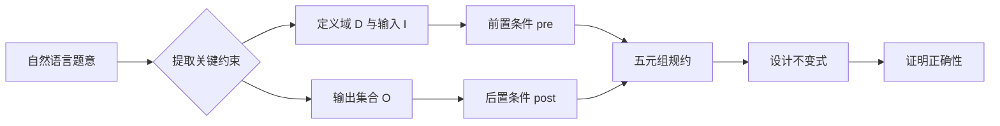
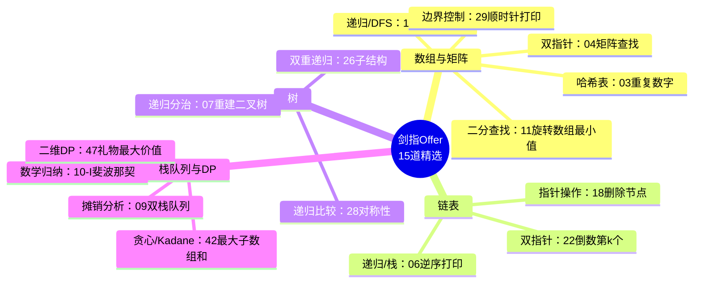
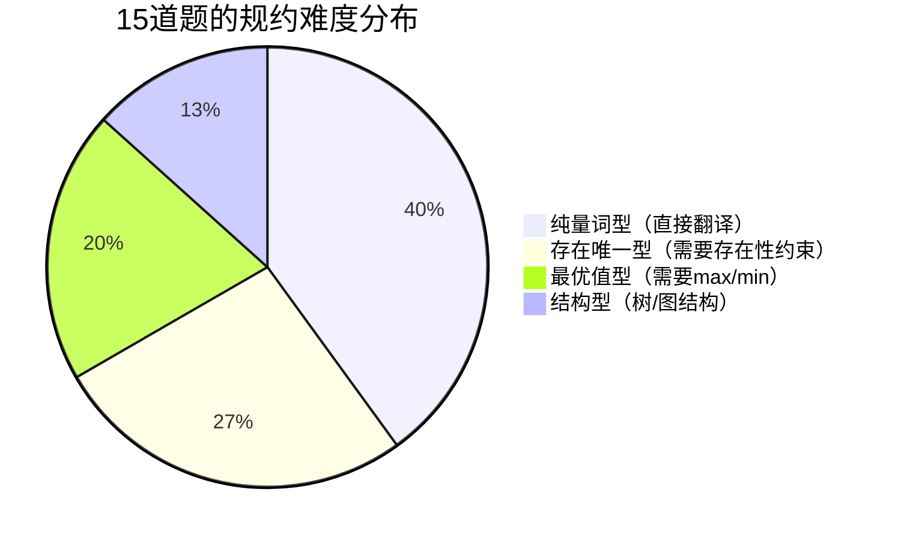
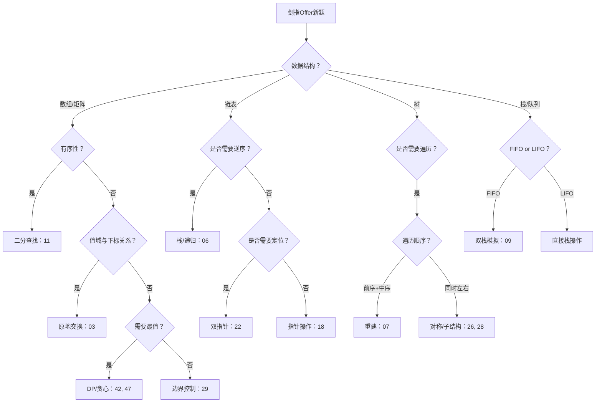
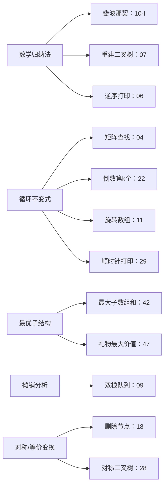

> 📊 **项目全面梳理**：详细的项目结构、模块详解和学习路径，请参阅 [`项目全面梳理-2025.md`](../../项目全面梳理-2025.md)

## 剑指Offer精选形式化证明

### 摘要 / Executive Summary

- 《剑指Offer》是中文技术面试中最经典的算法题集之一，其题目描述**简洁明确、边界清晰**，特别适合作为"自然语言题意 → 形式化规约"的入门教材。
- 本文精选 15 道高频题，每道题完整展示：**题目描述 → 五元组形式化规约(pre/post) → 最优解思路 → 循环不变式或归纳证明 → 复杂度分析 → 多语言实现链接**。
- 通过这 15 道题，读者应能独立将面试中的自然语言描述转化为严格的前置条件、后置条件和循环不变式。

### 关键术语与符号 / Glossary

| 术语 / Term | 定义 / Definition |
|-------------|-------------------|
| 形式化规约 Formal Specification | 用前置条件(pre)、后置条件(post)和不变式(invariant)精确描述算法的行为契约 |
| 五元组 Quintuple | 问题实例的标准形式 $\Pi = (D, I, O, \text{pre}, \text{post})$ |
| 循环不变式 Loop Invariant | 算法每次迭代前后均保持的谓词，是正确性证明的核心工具 |
| 最优子结构 Optimal Substructure | 问题的最优解包含其子问题的最优解（DP问题的核心性质） |
| 归纳证明 Proof by Induction | 通过基础步和归纳步证明命题对所有自然数/结构成立 |

### 目录 / Table of Contents

- [剑指Offer精选形式化证明](#剑指offer精选形式化证明)
  - [摘要 / Executive Summary](#摘要--executive-summary)
  - [关键术语与符号 / Glossary](#关键术语与符号--glossary)
  - [目录 / Table of Contents](#目录--table-of-contents)
- [1. 形式化方法导论](#1-形式化方法导论)
  - [1.1 自然语言 → 形式化规约的三步法](#11-自然语言--形式化规约的三步法)
- [2. 数组与矩阵专题（5道）](#2-数组与矩阵专题5道)
  - [2.1 剑指 Offer 03 — 数组中重复的数字](#21-剑指-offer-03--数组中重复的数字)
    - [形式化规约](#形式化规约)
    - [最优解思路](#最优解思路)
    - [循环不变式](#循环不变式)
    - [复杂度分析](#复杂度分析)
    - [代码实现](#代码实现)
  - [2.2 剑指 Offer 04 — 二维数组中的查找](#22-剑指-offer-04--二维数组中的查找)
    - [形式化规约](#形式化规约-1)
    - [最优解思路](#最优解思路-1)
    - [循环不变式](#循环不变式-1)
    - [复杂度分析](#复杂度分析-1)
  - [2.3 剑指 Offer 11 — 旋转数组的最小数字](#23-剑指-offer-11--旋转数组的最小数字)
    - [形式化规约](#形式化规约-2)
    - [最优解思路](#最优解思路-2)
    - [循环不变式](#循环不变式-2)
    - [复杂度分析](#复杂度分析-2)
  - [2.4 剑指 Offer 17 — 打印从1到最大的n位数](#24-剑指-offer-17--打印从1到最大的n位数)
    - [形式化规约](#形式化规约-3)
    - [最优解思路](#最优解思路-3)
    - [归纳证明](#归纳证明)
    - [复杂度分析](#复杂度分析-3)
  - [2.5 剑指 Offer 29 — 顺时针打印矩阵](#25-剑指-offer-29--顺时针打印矩阵)
    - [形式化规约](#形式化规约-4)
    - [最优解思路](#最优解思路-4)
    - [循环不变式](#循环不变式-3)
    - [复杂度分析](#复杂度分析-4)
- [3. 链表与指针专题（3道）](#3-链表与指针专题3道)
  - [3.1 剑指 Offer 06 — 从尾到头打印链表](#31-剑指-offer-06--从尾到头打印链表)
    - [形式化规约](#形式化规约-5)
    - [最优解思路](#最优解思路-5)
    - [归纳证明（递归法）](#归纳证明递归法)
  - [3.2 剑指 Offer 18 — 删除链表的节点](#32-剑指-offer-18--删除链表的节点)
    - [形式化规约](#形式化规约-6)
    - [最优解思路](#最优解思路-6)
    - [正确性论证](#正确性论证)
  - [3.3 剑指 Offer 22 — 链表中倒数第k个节点](#33-剑指-offer-22--链表中倒数第k个节点)
    - [形式化规约](#形式化规约-7)
    - [最优解思路](#最优解思路-7)
    - [循环不变式](#循环不变式-4)
    - [复杂度分析](#复杂度分析-5)
- [4. 树与递归专题（3道）](#4-树与递归专题3道)
  - [4.1 剑指 Offer 07 — 重建二叉树](#41-剑指-offer-07--重建二叉树)
    - [形式化规约](#形式化规约-8)
    - [最优解思路](#最优解思路-8)
    - [归纳证明](#归纳证明-1)
    - [复杂度分析](#复杂度分析-6)
  - [4.2 剑指 Offer 26 — 树的子结构](#42-剑指-offer-26--树的子结构)
    - [形式化规约](#形式化规约-9)
    - [最优解思路](#最优解思路-9)
    - [归纳证明（内层递归）](#归纳证明内层递归)
  - [4.3 剑指 Offer 28 — 对称的二叉树](#43-剑指-offer-28--对称的二叉树)
    - [形式化规约](#形式化规约-10)
    - [最优解思路](#最优解思路-10)
    - [归纳证明](#归纳证明-2)
    - [复杂度分析](#复杂度分析-7)
- [5. 栈、队列与动态规划专题（4道）](#5-栈队列与动态规划专题4道)
  - [5.1 剑指 Offer 09 — 用两个栈实现队列](#51-剑指-offer-09--用两个栈实现队列)
    - [形式化规约](#形式化规约-11)
    - [最优解思路](#最优解思路-11)
    - [正确性证明](#正确性证明)
    - [复杂度分析](#复杂度分析-8)
    - [代码实现](#代码实现-1)
  - [5.2 剑指 Offer 10-I — 斐波那契数列](#52-剑指-offer-10-i--斐波那契数列)
    - [形式化规约](#形式化规约-12)
    - [最优解思路](#最优解思路-12)
    - [归纳证明](#归纳证明-3)
    - [复杂度分析](#复杂度分析-9)
    - [代码实现](#代码实现-2)
  - [5.3 剑指 Offer 42 — 连续子数组的最大和](#53-剑指-offer-42--连续子数组的最大和)
    - [形式化规约](#形式化规约-13)
    - [最优解思路](#最优解思路-13)
    - [循环不变式](#循环不变式-5)
    - [复杂度分析](#复杂度分析-10)
  - [5.4 剑指 Offer 47 — 礼物的最大价值](#54-剑指-offer-47--礼物的最大价值)
    - [形式化规约](#形式化规约-14)
    - [最优解思路](#最优解思路-14)
    - [最优子结构证明](#最优子结构证明)
    - [复杂度分析](#复杂度分析-11)
- [6. 综合思维表征](#6-综合思维表征)
  - [6.1 15道题的算法范式分类](#61-15道题的算法范式分类)
  - [6.2 形式化规约复杂度分布](#62-形式化规约复杂度分布)
  - [6.3 解题方法论决策树](#63-解题方法论决策树)
  - [6.4 证明技术分布图](#64-证明技术分布图)
- [7. 大厂面试考察差异分析](#7-大厂面试考察差异分析)
- [8. 自测问题](#8-自测问题)
  - [问题 1：形式化规约的核心价值](#问题-1形式化规约的核心价值)
  - [问题 2：循环不变式的设计原则](#问题-2循环不变式的设计原则)
  - [问题 3：最优子结构与贪心选择](#问题-3最优子结构与贪心选择)
  - [问题 4：摊销分析的适用场景](#问题-4摊销分析的适用场景)
  - [问题 5：递归证明的归纳方向](#问题-5递归证明的归纳方向)
- [9. 学习目标](#9-学习目标)
- [参考文献](#参考文献)

---

## 1. 形式化方法导论

《剑指Offer》的最大教学价值在于：**题目描述足够简洁，使得形式化转化过程没有歧义**。与 LeetCode 的英文描述相比，中文描述更贴近国内面试场景，也更适合初学者练习"翻译"能力。

### 1.1 自然语言 → 形式化规约的三步法

**示例**：题目"找出数组中重复的数字"

- **Step 1 提取约束**：数组长度 n，所有数字在 [0, n-1] 范围内，至少有一个重复。
- **Step 2 定义五元组**：
  - $D = \{ \text{长度为 } n \text{ 的整数数组} \mid n \geq 2 \}$
  - $I = \{ \text{nums} \in D \mid \forall i: 0 \leq \text{nums}[i] \leq n-1 \}$
  - $O = \{ x \in \mathbb{Z} \}$
  - $\text{pre} \equiv \exists i \neq j: \text{nums}[i] = \text{nums}[j]$
  - $\text{post} \equiv x \in \text{nums} \land \exists i \neq j: \text{nums}[i] = \text{nums}[j] = x$
- **Step 3 设计不变式与证明**：见 §2.1。

---

## 2. 数组与矩阵专题（5道）

### 2.1 剑指 Offer 03 — 数组中重复的数字

> **题目描述**：在一个长度为 n 的数组里的所有数字都在 0～n-1 的范围内。数组中某些数字是重复的，但不知道有几个数字重复了，也不知道每个数字重复了几次。请找出数组中任意一个重复的数字。

#### 形式化规约

**定义域**：$D = \mathbb{Z}^n$，$n \geq 2$。

**输入集合**：$I = \{ \text{nums} \in D \mid \forall i \in [0, n-1]: 0 \leq \text{nums}[i] \leq n-1 \}$。

**输出集合**：$O = \{ x \in \mathbb{Z} \}$。

**前置条件**：
$$
\text{pre}(\text{nums}) \equiv \exists i, j \in [0, n-1]: i \neq j \land \text{nums}[i] = \text{nums}[j]
$$

**后置条件**：
$$
\text{post}(\text{nums}, x) \equiv x \in \text{nums} \land \exists i \neq j: \text{nums}[i] = \text{nums}[j] = x
$$

#### 最优解思路

**哈希表法**：遍历数组，用集合记录已出现数字。$O(n)$ 时间，$O(n)$ 空间。

**进阶法（原地交换）**：利用值域与定义域的对应关系。若 `nums[i] != i`，则将 `nums[i]` 交换到其正确位置 `nums[nums[i]]`。若目标位置已有相同值，则找到重复。$O(n)$ 时间，$O(1)$ 空间。

#### 循环不变式

**原地交换法的不变式**：
$$
\text{Inv}(i) \equiv \forall j < i: \big(\text{nums}[j] = j \lor \text{nums}[j] \text{ 是已确认的重复数}\big)
$$

**保持性**：每次交换要么将 `nums[i]` 放到正确位置（`nums[x] = x`），要么发现 `nums[x]` 已等于 `x`（重复）。

#### 复杂度分析

| 指标 | 哈希表法 | 原地交换法 |
|------|---------|-----------|
| 时间 | $O(n)$ | $O(n)$ |
| 空间 | $O(n)$ | $O(1)$ |

#### 代码实现

- **Python**: [`examples/algorithms-python/src/leetcode/剑指Offer_03_数组中重复的数字.py`](../../../../examples/algorithms-python/src/leetcode/剑指Offer_03_数组中重复的数字.py)

---

### 2.2 剑指 Offer 04 — 二维数组中的查找

> **题目描述**：在一个 n × m 的二维数组中，每一行都按照从左到右递增的顺序排序，每一列都按照从上到下递增的顺序排序。请完成一个函数，输入这样的一个二维数组和一个整数，判断数组中是否含有该整数。

#### 形式化规约

**前置条件**：
$$
\text{pre}(\text{matrix}, \text{target}) \equiv \forall i, j: \text{matrix}[i][j] \leq \text{matrix}[i][j+1] \land \text{matrix}[i][j] \leq \text{matrix}[i+1][j]
$$

**后置条件**：
$$
\text{post}(\text{matrix}, \text{target}, \text{result}) \equiv \text{result} = \text{true} \leftrightarrow \exists i, j: \text{matrix}[i][j] = \text{target}
$$

#### 最优解思路

**右上角搜索法**：从右上角（或左下角）开始，利用行列有序性排除行或列。

- 若 `matrix[i][j] == target`：找到，返回 true。
- 若 `matrix[i][j] > target`：该列下方均更大，排除该列（`j--`）。
- 若 `matrix[i][j] < target`：该行左侧均更小，排除该行（`i++`）。

#### 循环不变式

$$
\text{Inv}(i, j) \equiv \text{target} \notin \{ \text{matrix}[x][y] \mid x < i \lor y > j \}
$$

即目标值不可能在已排除的左上区域和右下区域之外。

#### 复杂度分析

| 指标 | 值 |
|------|-----|
| 时间 | $O(n + m)$ |
| 空间 | $O(1)$ |

---

### 2.3 剑指 Offer 11 — 旋转数组的最小数字

> **题目描述**：把一个数组最开始的若干个元素搬到数组的末尾，我们称之为数组的旋转。输入一个递增排序的数组的一个旋转，输出旋转数组的最小元素。

#### 形式化规约

设原数组 $\text{nums}'$ 非降序，旋转后数组满足：
$$
\text{pre}(\text{nums}) \equiv \exists k \in [0, n-1]: \text{nums}[i] = \text{nums}'[(i + k) \bmod n] \land \text{nums}' \text{ 非降序}
$$

**后置条件**：
$$
\text{post}(\text{nums}, \text{result}) \equiv \text{result} = \min_{i \in [0, n-1]} \text{nums}[i]
$$

#### 最优解思路

**二分查找变体**：比较 `nums[mid]` 与 `nums[r]`。

- 若 `nums[mid] > nums[r]`：最小值在右半部分（`l = mid + 1`）。
- 若 `nums[mid] < nums[r]`：最小值在左半部分含 mid（`r = mid`）。
- 若相等：无法判断，只能 `r--`（最坏 $O(n)$）。

#### 循环不变式

$$
\text{Inv}(l, r) \equiv \min_{i} \text{nums}[i] \in \{ \text{nums}[j] \mid j \in [l, r] \}
$$

#### 复杂度分析

| 指标 | 值 |
|------|-----|
| 时间 | $O(\log n)$ 平均，$O(n)$ 最坏（大量重复） |
| 空间 | $O(1)$ |

---

### 2.4 剑指 Offer 17 — 打印从1到最大的n位数

> **题目描述**：输入数字 n，按顺序打印出从 1 到最大的 n 位十进制数。比如输入 3，则打印出 1、2、3 一直到最大的 3 位数 999。

#### 形式化规约

**前置条件**：$n \geq 1$。

**后置条件**：输出集合为 $\{ 1, 2, \ldots, 10^n - 1 \}$。

#### 最优解思路

**大数问题**：$n$ 很大时结果超出 64 位整数范围，必须用字符串模拟加法。

**递归/DFS 全排列**：将问题视为 n 位数字的排列（允许前导零，但输出时去掉）。

#### 归纳证明

**定理**：递归函数 `printNumbers(digit, n)` 恰好生成所有 n 位数字排列一次。

**证明**：对 `digit`（当前处理位）从右到左归纳。

- 基础：`digit = n-1`（最低位），循环 0-9，生成所有个位数。
- 归纳：假设 `digit + 1` 位已正确生成所有后缀。对当前位填入 0-9，拼接所有后缀，即生成所有当前位组合。

#### 复杂度分析

| 指标 | 值 |
|------|-----|
| 时间 | $O(10^n)$（必须输出这么多数字） |
| 空间 | $O(n)$ 递归栈 / 字符串空间 |

---

### 2.5 剑指 Offer 29 — 顺时针打印矩阵

> **题目描述**：输入一个矩阵，按照从外向里以顺时针的顺序依次打印出每一个数字。

#### 形式化规约

**前置条件**：矩阵为 $m \times n$ 的二维数组，$m, n \geq 0$。

**后置条件**：输出序列按顺时针螺旋顺序包含矩阵所有元素恰好一次。

#### 最优解思路

**边界收缩法**：维护上下左右四个边界，按右→下→左→上顺序遍历，每遍历完一条边收缩对应边界。

#### 循环不变式

$$
\text{Inv}(top, bottom, left, right) \equiv \text{已输出区域} = \text{矩阵} \\ \{ \text{matrix}[i][j] \mid i \in [top, bottom], j \in [left, right] \}
$$

#### 复杂度分析

| 指标 | 值 |
|------|-----|
| 时间 | $O(m \times n)$ |
| 空间 | $O(1)$ 辅助空间（不含输出） |

---

## 3. 链表与指针专题（3道）

### 3.1 剑指 Offer 06 — 从尾到头打印链表

> **题目描述**：输入一个链表的头节点，从尾到头反过来返回每个节点的值（用数组返回）。

#### 形式化规约

设链表为节点序列 $v_0 \to v_1 \to \ldots \to v_{n-1}$。

**后置条件**：输出数组为 $[v_{n-1}, v_{n-2}, \ldots, v_0]$。

#### 最优解思路

**栈法**：遍历链表压栈，再依次弹出。$O(n)$ 时间，$O(n)$ 空间。

**递归法**：递归到末尾再回溯收集。$O(n)$ 时间，$O(n)$ 栈空间。

#### 归纳证明（递归法）

**定理**：`reversePrint(head)` 返回以 `head` 为头的链表的逆序值数组。

**证明**：对链表长度 $n$ 归纳。

- 基础：$n = 0$（空链表），返回 `[]`，正确。
- 归纳：设 `head.val = v₀`，剩余链表长度 $n-1$。由归纳假设，递归调用返回 $[v_{n-1}, \ldots, v_1]$。将 `v₀` 追加到末尾，得 $[v_{n-1}, \ldots, v_1, v_0]$，正确。

---

### 3.2 剑指 Offer 18 — 删除链表的节点

> **题目描述**：在 $O(1)$ 时间内删除链表节点。给定单向链表的头指针和一个节点指针，定义一个函数在 $O(1)$ 时间内删除该节点。

#### 形式化规约

**前置条件**：`toDelete` 是链表中的有效节点，且不是尾节点（经典解法限制）。

**后置条件**：链表中不再包含 `toDelete` 的值（在指定位置），链表其余节点顺序不变。

#### 最优解思路

**值复制法**：将 `toDelete.next.val` 复制到 `toDelete`，然后删除 `toDelete.next`。等效于删除了目标节点，时间 $O(1)$。

**局限性**：若 `toDelete` 是尾节点，仍需 $O(n)$ 找到前驱。

#### 正确性论证

**引理**：复制后继值并删除后继，与直接删除当前节点的效果等价（当后继存在时）。

**证明**：设原链表为 $\ldots \to A \to B \to C \to \ldots$。要删除 $B$：

- 复制：$B.val \leftarrow C.val$，链表变为 $\ldots \to A \to C \to C \to \ldots$。
- 删除第二个 $C$：链表变为 $\ldots \to A \to C \to \ldots$。
- 效果等同于删除了 $B$（原 $B$ 位置现在存放 $C$ 的值，物理节点是原来的 $C$）。

---

### 3.3 剑指 Offer 22 — 链表中倒数第k个节点

> **题目描述**：输入一个链表，输出该链表中倒数第 k 个节点。为了符合大多数人的习惯，本题从 1 开始计数，即链表的尾节点是倒数第 1 个节点。

#### 形式化规约

设链表长度为 $n$（未知）。

**前置条件**：$1 \leq k \leq n$。

**后置条件**：返回节点 `node` 满足从 `head` 到 `node` 的路径上有 $n - k + 1$ 个节点。

#### 最优解思路

**双指针（快慢指针）**：快指针先走 $k$ 步，然后快慢指针同步前进。当快指针到达末尾，慢指针即为倒数第 $k$ 个。

#### 循环不变式

$$
\text{Inv}(\text{slow}, \text{fast}) \equiv \text{distance}(\text{slow}, \text{fast}) = k
$$

即快指针始终领先慢指针 $k$ 个节点。

**初始化**：快指针先走 $k$ 步，不变式成立。
**保持**：每轮两者各走一步，距离保持 $k$。
**终止**：快指针到达末尾（`fast == null`），慢指针与末尾距离为 $k$，即慢指针是倒数第 $k$ 个。

#### 复杂度分析

| 指标 | 值 |
|------|-----|
| 时间 | $O(n)$ |
| 空间 | $O(1)$ |

---

## 4. 树与递归专题（3道）

### 4.1 剑指 Offer 07 — 重建二叉树

> **题目描述**：输入某二叉树的前序遍历和中序遍历的结果，请重建该二叉树。假设输入的前序遍历和中序遍历的结果中都不含重复的数字。

#### 形式化规约

**前置条件**：

- `preorder` 和 `inorder` 长度相等。
- 两者均不含重复元素。
- `preorder` 是某二叉树的前序遍历结果，`inorder` 是同一棵树的中序遍历结果。

**后置条件**：返回的二叉树的前序和中序遍历分别等于输入。

#### 最优解思路

**递归分治**：

1. 前序首元素是根节点。
2. 在中序中找到根节点位置，左侧为左子树中序，右侧为右子树中序。
3. 根据左子树长度，在前序中划分左子树前序和右子树前序。
4. 递归构建左右子树。

#### 归纳证明

**定理**：`buildTree(preorder, inorder)` 正确重建二叉树。

**证明**：对节点数 $n$ 归纳。

- 基础：$n = 0$，返回空树，正确。
- 归纳：设前序首元素为 `root`。在中序中找到 `root` 位置 `idx`。
  左子树节点数 `leftSize = idx - inStart`。
  前序中左子树范围为 `[preStart+1, preStart+leftSize]`，右子树为剩余部分。
  由归纳假设，递归调用正确构建左右子树。
  因此整棵树正确。

#### 复杂度分析

| 指标 | 值 |
|------|-----|
| 时间 | $O(n)$（用哈希表优化中序查找） |
| 空间 | $O(n)$ 哈希表 + $O(h)$ 递归栈 |

---

### 4.2 剑指 Offer 26 — 树的子结构

> **题目描述**：输入两棵二叉树 A 和 B，判断 B 是不是 A 的子结构。（约定空树不是任意树的子结构）

#### 形式化规约

**前置条件**：A 和 B 是合法二叉树。

**后置条件**：
$$
\text{result} = \text{true} \leftrightarrow \exists \text{节点 } r \in A: \text{以 } r \text{ 为根的子树与 } B \text{ 结构相同且对应节点值相等}
$$

#### 最优解思路

**双重递归**：

1. 外层递归遍历 A 的每个节点 `r`。
2. 对每个 `r`，内层递归检查以 `r` 为根的子树是否匹配 B。

#### 归纳证明（内层递归）

**定理**：`isMatch(a, b)` 返回 true 当且仅当以 `a` 为根的子树包含 `b` 为子结构。

**证明**：对 `b` 的结构归纳。

- 基础：`b` 为空，返回 true（空树是任意树的子结构，但题目约定顶层 B 非空，递归中子问题允许空）。
- 归纳：`b` 非空。要求 `a` 非空且 `a.val == b.val`，且左右子树分别匹配。
  由归纳假设，递归检查左右子树正确。

---

### 4.3 剑指 Offer 28 — 对称的二叉树

> **题目描述**：请实现一个函数，用来判断一棵二叉树是不是对称的。如果一棵二叉树和它的镜像一样，那么它是对称的。

#### 形式化规约

**前置条件**：输入是合法二叉树。

**后置条件**：
$$
\text{result} = \text{true} \leftrightarrow \text{树的左子树是右子树的镜像}
$$

#### 最优解思路

**递归比较**：同时遍历左子树（左→右）和右子树（右→左），比较对应节点值。

#### 归纳证明

**定理**：树对称当且仅当左子树和右子树互为镜像。

**证明**：对树高度 $h$ 归纳。

- 基础：$h = 0$（空树），对称。
- 归纳：根节点值相等，且 `left.left` 镜像于 `right.right`，`left.right` 镜像于 `right.left`。由归纳假设成立。

#### 复杂度分析

| 指标 | 值 |
|------|-----|
| 时间 | $O(n)$ |
| 空间 | $O(h)$ |

---

## 5. 栈、队列与动态规划专题（4道）

### 5.1 剑指 Offer 09 — 用两个栈实现队列

> **题目描述**：用两个栈实现一个队列。队列的声明如下，请实现它的两个函数 `appendTail` 和 `deleteHead`，分别完成在队列尾部插入整数和在队列头部删除整数的功能。

#### 形式化规约

**状态表示**：队列 $Q$ 由两个栈 `stackIn` 和 `stackOut` 表示。

**不变式**：
$$
\text{Inv} \equiv Q = \text{reverse}(\text{stackOut}) \oplus \text{stackIn}
$$
其中 $\oplus$ 表示列表拼接，$\text{reverse}$ 将栈底到栈顶转为队列头到尾。

**前置条件（deleteHead）**：队列非空，即 $\neg(\text{stackIn}.\text{empty} \land \text{stackOut}.\text{empty})$。

**后置条件（deleteHead）**：返回队列头部元素，新状态满足不变式且队列长度减 1。

#### 最优解思路

- `appendTail`：压入 `stackIn`。
- `deleteHead`：若 `stackOut` 非空，直接弹出；否则将 `stackIn` 全部倒入 `stackOut` 再弹出。

#### 正确性证明

**引理（摊销分析）**：每个元素最多经历 3 次栈操作（压入 stackIn、弹出 stackIn、压入 stackOut、弹出 stackOut）。摊销时间 $O(1)$。

**证明**：

- `appendTail`：1 次 push，$O(1)$。
- `deleteHead`：
  - 若 `stackOut` 非空：1 次 pop，$O(1)$。
  - 若 `stackOut` 为空：`stackIn` 有 $k$ 个元素，执行 $k$ 次 pop 和 $k$ 次 push，再 1 次 pop。总 $2k+1$ 次操作。
    但这 $k$ 个元素之前各经历 1 次 push，之后各经历 1 次 pop，平均每个元素摊销 $O(1)$。

#### 复杂度分析

| 指标 | appendTail | deleteHead |
|------|-----------|------------|
| 摊销时间 | $O(1)$ | $O(1)$ |
| 最坏时间 | $O(1)$ | $O(n)$ |
| 空间 | $O(n)$ | $O(n)$ |

#### 代码实现

- **Go**: [`examples/algorithms-go/leetcode/剑指Offer_09_用两个栈实现队列.go`](../../../../examples/algorithms-go/leetcode/剑指Offer_09_用两个栈实现队列.go)

---

### 5.2 剑指 Offer 10-I — 斐波那契数列

> **题目描述**：写一个函数，输入 n ，求斐波那契（Fibonacci）数列的第 n 项（即 F(N)）。结果取模 1e9+7。

#### 形式化规约

**前置条件**：$n \geq 0$。

**后置条件**：
$$
\text{result} = F(n) \bmod 10^9+7 \quad \text{where} \quad F(0)=0, F(1)=1, F(n)=F(n-1)+F(n-2)
$$

#### 最优解思路

**迭代 DP**：$O(n)$ 时间，$O(1)$ 空间。

#### 归纳证明

**定理**：算法返回 $F(n) \bmod M$。

**证明**：对 $n$ 归纳。

- 基础：$n=0$ 返回 0；$n=1$ 返回 1。正确。
- 归纳：设循环结束后 `prev1 = F(i-1) mod M`，`prev2 = F(i-2) mod M`。
  下一次迭代 `curr = (prev1 + prev2) mod M = F(i) mod M`。
  更新后不变式对 $i+1$ 成立。

#### 复杂度分析

| 指标 | 值 |
|------|-----|
| 时间 | $O(n)$ |
| 空间 | $O(1)$ |

#### 代码实现

- **Rust**: [`examples/algorithms/src/leetcode/剑指Offer_10_I_斐波那契数列.rs`](../../../../examples/algorithms/src/leetcode/剑指Offer_10_I_斐波那契数列.rs)

---

### 5.3 剑指 Offer 42 — 连续子数组的最大和

> **题目描述**：输入一个整型数组，数组中的一个或连续多个整数组成一个子数组。求所有子数组的和的最大值。

#### 形式化规约

**前置条件**：数组长度 $n \geq 1$。

**后置条件**：
$$
\text{result} = \max_{0 \leq i \leq j < n} \sum_{k=i}^{j} \text{nums}[k]
$$

#### 最优解思路

**Kadane 算法**：`dp[i]` 表示以 `nums[i]` 结尾的连续子数组最大和。
$$
\text{dp}[i] = \max(\text{nums}[i], \text{dp}[i-1] + \text{nums}[i])
$$
全局答案为 $\max_i \text{dp}[i]$。

#### 循环不变式

$$
\text{Inv}(i) \equiv \text{curr} = \text{dp}[i] \land \text{ans} = \max_{0 \leq j \leq i} \text{dp}[j]
$$

#### 复杂度分析

| 指标 | 值 |
|------|-----|
| 时间 | $O(n)$ |
| 空间 | $O(1)$ |

---

### 5.4 剑指 Offer 47 — 礼物的最大价值

> **题目描述**：在一个 m×n 的棋盘的每一格都放有一个礼物，每个礼物都有一定的价值（价值大于 0）。你可以从棋盘的左上角开始拿格子里的礼物，并每次向右或者向下移动一格、直到到达棋盘的右下角。给定一个棋盘及其上面的礼物的价值，请计算你最多能拿到多少价值的礼物？

#### 形式化规约

**前置条件**：$m, n \geq 1$，所有格子价值为正整数。

**后置条件**：
$$
\text{result} = \max_{\text{路径 } P} \sum_{(i,j) \in P} \text{grid}[i][j]
$$
其中 $P$ 是从 $(0,0)$ 到 $(m-1, n-1)$ 的仅向右/下移动的路径。

#### 最优解思路

**DP**：`dp[i][j]` 表示到达 `(i,j)` 的最大价值。
$$
\text{dp}[i][j] = \text{grid}[i][j] + \max(\text{dp}[i-1][j], \text{dp}[i][j-1])
$$

#### 最优子结构证明

**定理**：到达 $(i,j)$ 的最优路径必然经过 $(i-1,j)$ 或 $(i,j-1)$ 的最优路径。

**证明**：到达 $(i,j)$ 的最后一步只能是从上或从左来。若从上，则前面部分必为到达 $(i-1,j)$ 的最优路径（否则可替换为更优路径，整体更优）。从左同理。

#### 复杂度分析

| 指标 | 值 |
|------|-----|
| 时间 | $O(m \times n)$ |
| 空间 | $O(n)$（滚动数组优化） |

---

## 6. 综合思维表征

### 6.1 15道题的算法范式分类

### 6.2 形式化规约复杂度分布

### 6.3 解题方法论决策树

### 6.4 证明技术分布图

---

## 7. 大厂面试考察差异分析

| 考察维度 | 字节跳动 | 阿里巴巴 | 腾讯 | Google |
|---------|---------|---------|------|--------|
| **算法深度** | 重优化与边界 | 重工程与稳定性 | 重基础与扎实 | 重数学与证明 |
| **形式化要求** | 中等（讲清思路） | 较低（工程导向） | 中等（讲清复杂度） | 高（可能需要证明） |
| **《剑指Offer》出现频率** | 中（作为热身） | 高（校招核心） | 高（基础必考） | 低（偏好LeetCode Hard） |
| **典型follow-up** | 空间优化、并行化 | 分布式扩展、异常处理 | 代码健壮性、测试用例 | 下界证明、近似算法 |
| **推荐准备策略** | 熟练所有题的最优解 | 重点掌握数组链表DP | 重点掌握树递归DP | 额外准备证明与数学推导 |

---

## 8. 自测问题

### 问题 1：形式化规约的核心价值

**Q**: 为什么要将自然语言题意转化为前置条件和后置条件？

**A**: 形式化规约消除了自然语言的歧义，明确了三件事：

1. **输入约束**（前置条件）：算法可以假设什么？
2. **输出承诺**（后置条件）：算法必须保证什么？
3. **证明靶点**：只要证明 "pre → post"，即完成了正确性论证。

### 问题 2：循环不变式的设计原则

**Q**: 如何为一个新算法设计循环不变式？

**A**: 三步法：

1. **确定维护对象**：算法在维护什么？（答案区间、已处理集合、最优值等）
2. **写出弱化的目标**：将后置条件中的全称量词限制到已处理的前缀/子结构。
3. **验证三条件**：初始化（空/基础情况成立）、保持（一次迭代后仍成立）、终止（推出后置条件）。

### 问题 3：最优子结构与贪心选择

**Q**: 剑指 Offer 42（最大子数组和）为什么可以用 DP 而不是贪心？

**A**: 因为问题具有**最优子结构**：以 `i` 结尾的最优子数组，要么只包含 `nums[i]`，要么扩展自以 `i-1` 结尾的最优子数组。这不是贪心，因为贪心需要"局部最优导致全局最优"的严格证明，而 DP 只需要子问题的最优性传递。

### 问题 4：摊销分析的适用场景

**Q**: 剑指 Offer 09（双栈实现队列）为什么用摊销分析而非最坏分析？

**A**: 单次 `deleteHead` 的最坏情况为 $O(n)$（需要倒栈），但每个元素最多被移动两次（进 stackIn、出 stackIn、进 stackOut、出 stackOut）。将高代价操作均摊到多次低代价操作上，得到摊销 $O(1)$，更能反映实际性能。

### 问题 5：递归证明的归纳方向

**Q**: 树相关题目（如重建二叉树、对称性判断）通常用什么归纳方向？

**A**: **结构归纳法**（Structural Induction）：

- 基础：空树（或单节点树）满足命题。
- 归纳：假设左右子树满足命题，证明整棵树满足命题。
这与自然数归纳法不同，归纳假设作用于"子结构"而非"n-1"。

---

## 9. 学习目标

完成本章学习后，读者应能够：

1. **独立转化**：将《剑指Offer》的自然语言描述转化为五元组形式化规约（pre/post）。
2. **选择证明技术**：根据题目类型选择循环不变式、数学归纳法或最优子结构证明。
3. **口述形式化**：在面试中能用 1-2 分钟向面试官清晰陈述问题的前置条件和后置条件。
4. **识别考察模式**：看到题目时快速判断其所属算法范式（数组/链表/树/DP/栈队列）。

---

## 参考文献

1. [剑指Offer] 何海涛. *剑指Offer：名企面试官精讲典型编程题* (第2版). 电子工业出版社, 2017.
2. [CLRS2022] Cormen, T. H., et al. *Introduction to Algorithms* (4th ed.). MIT Press, 2022.
3. [Hoare1969] Hoare, C. A. R. "An Axiomatic Basis for Computer Programming." *Communications of the ACM*, 1969.

---

**文档版本**: 1.0
**最后更新**: 2026-04-23
**状态**: 维护中
