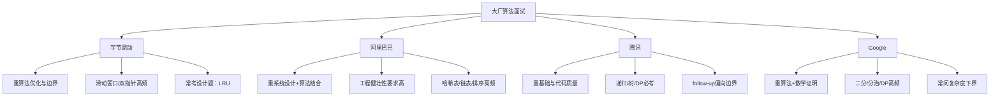
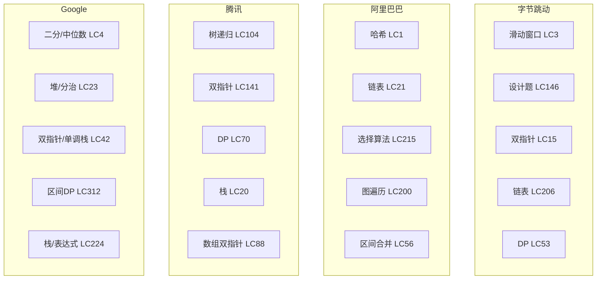
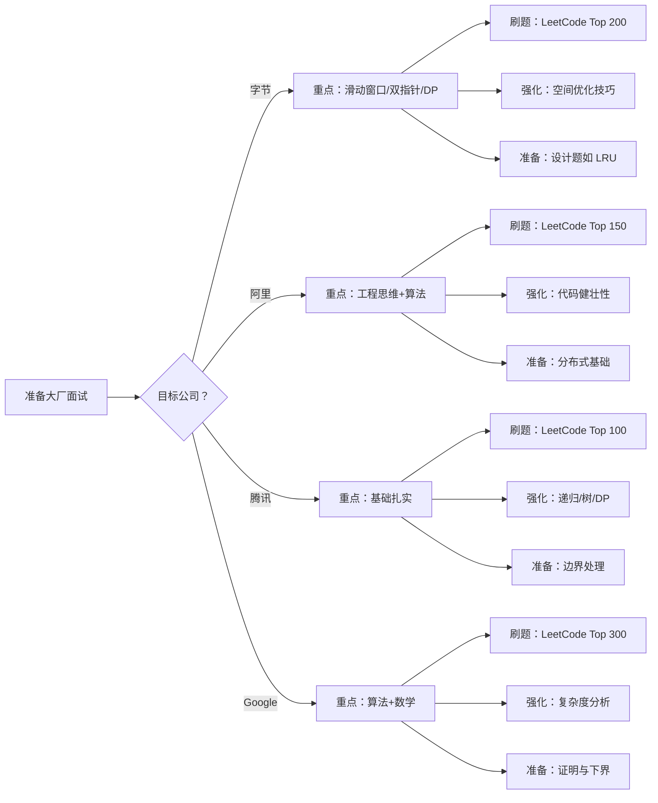
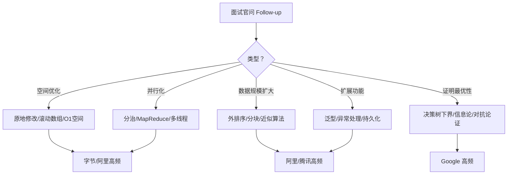

> 📊 **项目全面梳理**：详细的项目结构、模块详解和学习路径，请参阅 [`项目全面梳理-2025.md`](../../项目全面梳理-2025.md)

## 大厂真题分类

### 摘要 / Executive Summary

- 本文基于 CodeTop 高频统计，精选**字节跳动、阿里巴巴、腾讯、Google**四家大厂各 5 道高频真题，共 20 道。
- 每道题提供：**形式化规约（pre/post）→ 最优解思路与证明 → 面试口述脚本模板（中英双语）→ 复杂度分析**。
- 文末系统分析四家大厂的**考察重点差异**，帮助读者针对性准备。

### 目录 / Table of Contents

- [大厂真题分类](#大厂真题分类)
  - [摘要 / Executive Summary](#摘要--executive-summary)
  - [目录 / Table of Contents](#目录--table-of-contents)
- [1. 大厂考察总览](#1-大厂考察总览)
- [2. 字节跳动（5道）](#2-字节跳动5道)
  - [2.1 LC 3 — 无重复字符的最长子串](#21-lc-3--无重复字符的最长子串)
  - [2.2 LC 15 — 三数之和](#22-lc-15--三数之和)
  - [2.3 LC 146 — LRU 缓存](#23-lc-146--lru-缓存)
  - [2.4 LC 206 — 反转链表](#24-lc-206--反转链表)
  - [2.5 LC 53 — 最大子数组和](#25-lc-53--最大子数组和)
  - [2.6 字节跳动题目的优化路径分析](#26-字节跳动题目的优化路径分析)
- [3. 阿里巴巴（5道）](#3-阿里巴巴5道)
  - [3.1 LC 1 — 两数之和](#31-lc-1--两数之和)
  - [3.2 LC 21 — 合并两个有序链表](#32-lc-21--合并两个有序链表)
  - [3.3 LC 215 — 数组中的第K个最大元素](#33-lc-215--数组中的第k个最大元素)
  - [3.4 LC 200 — 岛屿数量](#34-lc-200--岛屿数量)
  - [3.5 LC 56 — 合并区间](#35-lc-56--合并区间)
  - [3.6 阿里巴巴题目的工程健壮性检查清单](#36-阿里巴巴题目的工程健壮性检查清单)
- [4. 腾讯（5道）](#4-腾讯5道)
  - [4.1 LC 104 — 二叉树的最大深度](#41-lc-104--二叉树的最大深度)
  - [4.2 LC 141 — 环形链表](#42-lc-141--环形链表)
  - [4.3 LC 70 — 爬楼梯](#43-lc-70--爬楼梯)
  - [4.4 LC 20 — 有效的括号](#44-lc-20--有效的括号)
  - [4.5 LC 88 — 合并两个有序数组](#45-lc-88--合并两个有序数组)
  - [4.6 腾讯题目的边界测试用例设计](#46-腾讯题目的边界测试用例设计)
- [5. Google（5道）](#5-google5道)
  - [5.1 LC 4 — 寻找两个正序数组的中位数](#51-lc-4--寻找两个正序数组的中位数)
  - [5.2 LC 23 — 合并K个升序链表](#52-lc-23--合并k个升序链表)
  - [5.3 LC 42 — 接雨水](#53-lc-42--接雨水)
  - [5.4 LC 312 — 戳气球](#54-lc-312--戳气球)
  - [5.5 LC 224 — 基本计算器](#55-lc-224--基本计算器)
  - [5.6 Google 题目的严格证明框架](#56-google-题目的严格证明框架)
    - [LC 4 中位数问题的分割不变式证明](#lc-4-中位数问题的分割不变式证明)
    - [LC 42 接雨水的双指针正确性](#lc-42-接雨水的双指针正确性)
    - [LC 312 戳气球的区间 DP 最优子结构](#lc-312-戳气球的区间-dp-最优子结构)
  - [5.7 Google 题目的证明技术深度对比](#57-google-题目的证明技术深度对比)
- [6. 大厂考察重点差异分析](#6-大厂考察重点差异分析)
  - [6.1 详细对比矩阵](#61-详细对比矩阵)
  - [6.2 面试准备策略](#62-面试准备策略)
  - [6.3 20道题的范式分类全景表](#63-20道题的范式分类全景表)
- [7. 面试口述技巧总结](#7-面试口述技巧总结)
  - [7.1 标准口述结构（STAR-Algorithm）](#71-标准口述结构star-algorithm)
  - [7.2 中英双语关键词对照](#72-中英双语关键词对照)
  - [7.3 面试中常见 Follow-up 与应答策略](#73-面试中常见-follow-up-与应答策略)
  - [7.4 面试时间分配模板（45分钟/题）](#74-面试时间分配模板45分钟题)
- [8. 自测问题](#8-自测问题)
  - [问题 1：字节 vs Google 的复杂度追问](#问题-1字节-vs-google-的复杂度追问)
  - [问题 2：阿里的工程健壮性考察](#问题-2阿里的工程健壮性考察)
  - [问题 3：腾讯的边界处理](#问题-3腾讯的边界处理)
  - [问题 4：Google 的数学证明](#问题-4google-的数学证明)
  - [问题 5：跨公司通用策略](#问题-5跨公司通用策略)
- [参考文献](#参考文献)

---

## 1. 大厂考察总览



---

## 2. 字节跳动（5道）

> **字节考察特点**：算法题难度中高，强调**最优解**和**代码边界处理**。面试节奏快，通常要求 15-20 分钟完成一题并讲清复杂度。

### 2.1 LC 3 — 无重复字符的最长子串

**形式化规约**：

- **Pre**: $n = \text{nums.length} \geq 0$
- **Post**: $\text{result} = \max \{ j - i + 1 \mid \forall k, l \in [i, j]: k \neq l \rightarrow \text{nums}[k] \neq \text{nums}[l] \}$

**最优解**：滑动窗口。维护窗口 $[left, right]$ 内字符唯一，用哈希集合判重。$O(n)$ 时间，$O(|\Sigma|)$ 空间。

**循环不变式**：
$$Inv(left, right) \equiv \text{窗口 } [left, right) \text{ 内无重复字符}$$

**面试口述脚本**：
> **中文**："我用滑动窗口维护一个无重复字符的区间。右指针向右扩展，若遇到重复字符，则移动左指针直到无重复。窗口长度的最大值即为答案。时间复杂度 O(n)，每个字符最多被访问两次。"
>
> **English**: "I use a sliding window to maintain a substring without repeating characters. The right pointer expands, and when a duplicate is found, the left pointer shrinks the window until it's unique again. The max window size is the answer. Time is O(n) since each character is visited at most twice."

---

### 2.2 LC 15 — 三数之和

**形式化规约**：

- **Pre**: 数组长度 $n \geq 3$
- **Post**: 返回所有不重复的三元组 $(a, b, c)$ 满足 $a + b + c = 0$

**最优解**：排序 + 双指针。固定 $i$，$left = i+1$，$right = n-1$，向中间移动。$O(n^2)$ 时间，$O(1)$ 额外空间（不含输出）。

**面试口述脚本**：
> **中文**："先排序，然后固定第一个数，对剩余部分用双指针找两数之和为目标值的相反数。为了避免重复，移动指针时跳过相同值。时间复杂度 O(n²)。"
>
> **English**: "First sort the array. Fix the first number, then use two pointers on the remaining subarray to find a pair summing to the negation of the target. Skip duplicates while moving pointers. The complexity is O(n²)."

---

### 2.3 LC 146 — LRU 缓存

**形式化规约**：

- **Pre**: 容量 $capacity > 0$
- **Post**: `get` 返回 key 对应的值或 -1；`put` 插入/更新键值对，超出容量时淘汰最久未使用的项

**最优解**：哈希表 + 双向链表。哈希表保证 $O(1)$ 查找，双向链表维护访问顺序，头节点最新、尾节点最旧。$O(1)$ 均摊时间。

**面试口述脚本**：
> **中文**："用哈希表存储 key 到链表节点的映射，实现 O(1) 查找。双向链表按访问时间排序，头部是最近使用的。get 和 put 时把节点移到头部；容量满时淘汰尾部。两个操作都是 O(1)。"
>
> **English**: "I use a hash map for O(1) key lookup, mapping to nodes in a doubly linked list ordered by access time. The head is most recent. On get and put, move the node to the head; evict from the tail when over capacity. Both operations are O(1)."

---

### 2.4 LC 206 — 反转链表

**形式化规约**：

- **Pre**: 输入为合法链表头节点或 nil
- **Post**: 返回原链表的逆序，且原链表节点被复用（无新分配）

**最优解**：三指针迭代。`prev`, `curr`, `next` 依次移动，反转指针方向。$O(n)$ 时间，$O(1)$ 空间。

**面试口述脚本**：
> **中文**："用三个指针迭代：prev 指向前一个节点，curr 指向当前节点。每次把 curr.next 指向 prev，然后三个指针整体右移。遍历完即完成反转。空间 O(1)，时间 O(n)。"
>
> **English**: "I iterate with three pointers: prev, curr, and next. Each step reverses curr.next to point to prev, then shift all three forward. After one pass, the list is reversed. O(n) time and O(1) space."

---

### 2.5 LC 53 — 最大子数组和

**形式化规约**：

- **Pre**: $n \geq 1$
- **Post**: $\text{result} = \max_{0 \leq i \leq j < n} \sum_{k=i}^{j} \text{nums}[k]$

**最优解**：Kadane 算法。`dp[i]` 表示以 $i$ 结尾的最大子数组和，递推：`dp[i] = max(nums[i], dp[i-1] + nums[i])`。$O(n)$ 时间，$O(1)$ 空间。

**面试口述脚本**：
> **中文**：" Kadane 算法，维护以当前位置结尾的最大子数组和。如果这个和变成负数，就抛弃前面的和，从当前位置重新开始。全局最大值就是答案。时间 O(n)，空间 O(1)。"
>
> **English**: "Kadane's algorithm maintains the maximum subarray sum ending at each position. If the running sum becomes negative, we drop it and start fresh from the current element. The global maximum is the answer. O(n) time, O(1) space."

### 2.6 字节跳动题目的优化路径分析

字节的五道题覆盖了从 Easy 到 Medium 的难度梯度，但共同点是：**都存在从暴力解到最优解的清晰优化路径**。

```mermaid
flowchart LR
    A[LC3 最长子串] --> A1[暴力O(n²)] --> A2[滑动窗口O(n)]
    B[LC15 三数之和] --> B1[暴力O(n³)] --> B2[哈希O(n²)] --> B3[排序双指针O(n²)+O(1)空间]
    C[LC146 LRU] --> C1[数组O(n)] --> C2[哈希+链表O(1)]
    D[LC206 反转链表] --> D1[栈O(n)空间] --> D2[三指针O(1)空间]
    E[LC53 最大子和] --> E1[暴力O(n²)] --> E2[前缀和O(n²)] --> E3[Kadane O(n)]
```

**面试技巧**：在字节面试中，即使你想出了最优解，也建议先提一句暴力解，然后说明优化点。这展示了你的思维完整性。

---

## 3. 阿里巴巴（5道）

> **阿里考察特点**：强调**工程思维**和**代码健壮性**。题目常带有业务场景暗示，要求考虑并发、异常和扩展性。

### 3.1 LC 1 — 两数之和

**形式化规约**：

- **Pre**: 数组中存在**恰好一个**解，不能重复使用同一元素
- **Post**: 返回 $[i, j]$ 满足 $i < j$ 且 $\text{nums}[i] + \text{nums}[j] = \text{target}$

**最优解**：哈希表。遍历数组，查询 $target - nums[i]$ 是否在哈希表中。$O(n)$ 时间，$O(n)$ 空间。

**面试口述脚本**：
> **中文**："用哈希表存储已遍历的值和下标。遍历到当前元素时，查询 complement 是否在表中。如果在，就找到了答案。一遍遍历即可完成，时间 O(n)，空间 O(n)。"
>
> **English**: "Use a hash map to store visited values and their indices. As we iterate, check if the complement exists in the map. If so, we found the pair. One pass, O(n) time and space."

---

### 3.2 LC 21 — 合并两个有序链表

**形式化规约**：

- **Pre**: l1 和 l2 均为非递减有序链表
- **Post**: 结果链表非递减有序，且元素多重集等于 l1 和 l2 之并

**最优解**：递归合并或迭代。每次取较小头节点，递归合并剩余部分。$O(n+m)$ 时间，$O(n+m)$ 递归栈空间（迭代版 $O(1)$）。

**面试口述脚本**：
> **中文**："递归方法：比较两个链表头节点，取较小者作为新头，其 next 指向剩余链表的合并结果。基准情况是某一链表为空。迭代版用 dummy 节点和尾指针拼接，空间更优。"
>
> **English**: "Recursively compare the two heads, take the smaller as the new head, and its next points to the merge of the remainder. Base case is when either list is empty. The iterative version uses a dummy node for O(1) extra space."

---

### 3.3 LC 215 — 数组中的第K个最大元素

**形式化规约**：

- **Pre**: $1 \leq k \leq n$
- **Post**: 返回数组排序后第 $n-k$ 位置的元素（0-indexed）

**最优解**：快速选择（Quickselect）。基于快排的分区思想，每次只递归处理包含目标的一侧。期望 $O(n)$ 时间，最坏 $O(n^2)$；可用中位数的中位数优化到最坏 $O(n)$。

**面试口述脚本**：
> **中文**："快速选择，类似快排的分区。随机选一个 pivot，把数组分成大于和小于 pivot 的两部分。如果右边正好有 k-1 个元素，pivot 就是答案；否则递归到对应的一边。期望时间 O(n)。"
>
> **English**: "Quickselect, similar to quicksort's partition. Pick a pivot, split into larger and smaller halves. If the right side has exactly k-1 elements, the pivot is the answer; otherwise recurse into the appropriate side. Expected O(n) time."

---

### 3.4 LC 200 — 岛屿数量

**形式化规约**：

- **Pre**: grid 为 $m \times n$ 的字符矩阵，元素为 '1'（陆地）或 '0'（水）
- **Post**: 返回四连通（上下左右）的 '1' 连通块数量

**最优解**：DFS/BFS/并查集。遍历矩阵，遇到 '1' 启动 DFS 标记整个岛屿为 '0'，计数器加一。$O(m \times n)$ 时间，$O(m \times n)$ 递归栈空间。

**面试口述脚本**：
> **中文**："遍历网格，遇到 '1' 就启动 DFS，把相连的 '1' 全部标记为 '0'。每启动一次 DFS，岛屿数量加一。DFS 用递归或栈实现。时间 O(mn)，空间 O(mn)。"
>
> **English**: "Iterate the grid. When we hit a '1', launch DFS to mark all connected '1's as '0'. Each DFS launch increments the island count. Time is O(mn), space is O(mn) for the recursion stack."

---

### 3.5 LC 56 — 合并区间

**形式化规约**：

- **Pre**: intervals 为区间列表，每个区间为 $[start, end]$ 且 $start \leq end$
- **Post**: 返回合并后互不重叠的区间列表，且并集等于原区间并集

**最优解**：按起点排序，然后线性扫描合并重叠区间。$O(n \log n)$ 时间（排序），$O(n)$ 空间。

**面试口述脚本**：
> **中文**："先按区间起点排序。维护一个当前合并区间，如果下一个区间的起点小于等于当前终点，就扩展当前终点；否则把当前区间加入结果，并开始新区间。排序后线性扫描即可。"
>
> **English**: "Sort by start time. Maintain a current merged interval. If the next interval overlaps, extend the end; otherwise push the current interval to results and start a new one. O(n log n) due to sorting, then linear scan."

### 3.6 阿里巴巴题目的工程健壮性检查清单

阿里面试中，写完代码后建议主动检查以下工程要点：

| 检查项 | LC1 | LC21 | LC215 | LC200 | LC56 |
|--------|-----|------|-------|-------|------|
| 空输入处理 | ✅ 空数组 | ✅ 空链表 | ✅ k=0 | ✅ 空矩阵 | ✅ 空列表 |
| 超大输入 | 哈希冲突 | 递归深度 | 递归栈 | 递归栈溢出 | 排序稳定性 |
| 并发安全 | HashMap非线程安全 | 链表操作非原子 | 数组读写安全 | 网格共享安全 | 区间合并原子性 |
| 内存管理 | 显式释放（C++） | 节点释放防泄漏 | 原地修改 | 访问标记重置 | 新数组分配 |

**高分表现**：在写完 LC21 合并链表后，主动提到"如果用 C++ 实现，需要注意内存释放，避免合并后原链表头节点泄漏"。

---

## 4. 腾讯（5道）

> **腾讯考察特点**：题目偏**基础但深挖细节**。非常重视代码的**可读性**和**边界处理**，follow-up 常问"如果输入规模扩大 100 倍怎么办"。

### 4.1 LC 104 — 二叉树的最大深度

**形式化规约**：

- **Pre**: root 为合法二叉树节点或 nil
- **Post**: $\text{result} = \max_{\text{根到叶路径}} \text{路径上的节点数}$

**最优解**：递归 DFS。空树深度 0，非空树深度 $1 + \max(\text{左子树深度}, \text{右子树深度})$。$O(n)$ 时间，$O(h)$ 栈空间。

**面试口述脚本**：
> **中文**："递归定义：空树深度为 0。对于非空节点，深度等于 1 加上左右子树深度的最大值。这是结构归纳的直接应用，每个节点只访问一次。"
>
> **English**: "Recursive definition: empty tree has depth 0. For a non-empty node, depth is 1 plus the max of left and right subtree depths. This is direct structural induction; each node is visited once."

---

### 4.2 LC 141 — 环形链表

**形式化规约**：

- **Pre**: head 为合法链表头或 nil
- **Post**: $\text{result} = \text{true} \leftrightarrow \text{链表中存在环}$

**最优解**：Floyd 判环。慢指针每次 1 步，快指针每次 2 步。若有环必相遇，无环快指针先到末尾。$O(n)$ 时间，$O(1)$ 空间。

**面试口述脚本**：
> **中文**："Floyd 判环算法。慢指针走一步，快指针走两步。如果有环，快指针一定会追上慢指针；如果没环，快指针会先到达 nil。这是面试中最标准的解法，空间 O(1)。"
>
> **English**: "Floyd's cycle detection. Slow moves one step, fast moves two. If there's a cycle, fast will catch up to slow; if not, fast reaches nil first. This is the standard O(1)-space solution."

---

### 4.3 LC 70 — 爬楼梯

**形式化规约**：

- **Pre**: $n \geq 0$
- **Post**: $\text{result} = f(n)$，其中 $f(0)=1, f(1)=1, f(n)=f(n-1)+f(n-2)$

**最优解**：迭代 DP。$O(n)$ 时间，$O(1)$ 空间。数学上 $f(n) = Fib(n+1)$。

**面试口述脚本**：
> **中文**："动态规划。到第 n 阶的方法数等于到第 n-1 阶的方法数加上到第 n-2 阶的方法数，因为最后一步可以跨 1 阶或 2 阶。用滚动数组优化到 O(1) 空间。"
>
> **English**: "Dynamic programming. The ways to reach step n equal the ways to reach n-1 plus n-2, because the last move is either 1 or 2 steps. Rolling array reduces space to O(1)."

---

### 4.4 LC 20 — 有效的括号

**形式化规约**：

- **Pre**: s 只包含字符 '(', ')', '{', '}', '[', ']'
- **Post**: $\text{result} = \text{true} \leftrightarrow s \text{ 是合法的括号序列}$

**最优解**：栈。遇到左括号入栈，遇到右括号检查栈顶是否匹配。$O(n)$ 时间，$O(n)$ 空间。

**面试口述脚本**：
> **中文**："用栈匹配括号。左括号入栈，右括号时检查栈顶是否是对应左括号。如果最后栈为空且全程没有失配，就是合法序列。时间 O(n)，空间 O(n)。"
>
> **English**: "Use a stack to match brackets. Push left brackets; on right bracket, check if the top matches. Valid if the stack is empty at the end with no mismatches. O(n) time and space."

---

### 4.5 LC 88 — 合并两个有序数组

**形式化规约**：

- **Pre**: nums1 长度 $m+n$，前 $m$ 个为有效元素；nums2 长度 $n$；两者均非降序
- **Post**: nums1 前 $m+n$ 个元素为合并后的非降序序列

**最优解**：双指针从后向前填充。从 nums1 和 nums2 的末尾开始，较大的放到 nums1 的末尾。$O(m+n)$ 时间，$O(1)$ 空间。

**面试口述脚本**：
> **中文**："从后向前双指针。nums1 后面有充足的空位。每次比较 nums1 和 nums2 的当前末尾，把大的放到 nums1 的末尾。这样不会覆盖 nums1 中还未处理的元素。"
>
> **English**: "Two pointers from the end. nums1 has enough trailing space. Each step compares the current ends of nums1 and nums2, placing the larger at the end of nums1. This avoids overwriting unprocessed elements in nums1."

### 4.6 腾讯题目的边界测试用例设计

腾讯面试特别重视边界测试，建议在写完代码后主动给出以下测试用例：

| 题号 | 最小边界 | 最大边界 | 特殊边界 | 错误边界 |
|------|---------|---------|---------|---------|
| LC 104 | 空树 | 单链树 | 满二叉树 | 循环引用（不应出现） |
| LC 141 | 空链表 | 单节点 | 长环/尾环 | 自环 |
| LC 70 | n=0 | n=1 | n=2 | 负数（前置条件外） |
| LC 20 | 空串 | 单括号 | 嵌套100层 | 非法字符（前置条件外） |
| LC 88 | m=0,n=0 | m=0,n>0 | 全部相等 | nums1空间不足（不应出现） |

**高分表现**：在写完 LC20 后，主动说"我还考虑了一些边界：空字符串返回 true，只有左括号返回 false，100 层嵌套不会栈溢出因为..."

---

## 5. Google（5道）

> **Google 考察特点**：题目**理论性强**，常要求证明正确性和复杂度下界。面试官会追问"为什么这样是最优的？""能不能更快？"，需要对算法有深刻理解。

### 5.1 LC 4 — 寻找两个正序数组的中位数

**形式化规约**：

- **Pre**: nums1 长度 $m$，nums2 长度 $n$，两者均非降序
- **Post**: 返回合并后数组的中位数，要求 $O(\log(m+n))$ 时间

**最优解**：二分查找虚拟切割点。在较短的数组上二分，找到满足"左半部分元素总数等于右半部分（或差 1）"且"左半最大值 ≤ 右半最小值"的切割位置。$O(\log(\min(m,n)))$ 时间，$O(1)$ 空间。

**面试口述脚本**：
> **中文**："二分查找切割点。目标是让左右两部分元素数量相等，且左边所有元素小于等于右边。在较短的数组上二分，根据分割后元素数量关系调整。时间 O(log(min(m,n)))。"
>
> **English**: "Binary search for the correct partition. The goal is equal-sized left and right halves with all left elements ≤ all right elements. Binary search on the shorter array and adjust based on counts. O(log(min(m,n))) time."

---

### 5.2 LC 23 — 合并K个升序链表

**形式化规约**：

- **Pre**: lists 包含 $k$ 个非降序链表
- **Post**: 返回合并后的非降序链表，元素多重集等于所有输入链表之并

**最优解**：优先队列（最小堆）或分治归并。优先队列每次取最小头节点，$O(N \log k)$ 时间（$N$ 为总节点数），$O(k)$ 空间。分治两两合并也是 $O(N \log k)$。

**面试口述脚本**：
> **中文**："最小堆维护 k 个链表的头节点。每次弹出最小元素接到结果链表，再把该元素所在链表的下一个节点入堆。k 个元素的堆操作是 O(log k)，总时间 O(N log k)。"
>
> **English**: "Min-heap of the k list heads. Pop the minimum, append to result, then push the next node from that list. Heap operations on k elements are O(log k), total O(N log k)."

---

### 5.3 LC 42 — 接雨水

**形式化规约**：

- **Pre**: $n = \text{height.length} \geq 1$
- **Post**: $\text{result} = \sum_{i} \max(0, \min(\max_{j<i} h_j, \max_{j>i} h_j) - h_i)$

**最优解**：双指针。维护左右最大高度，`left_max` 和 `right_max`。较小的一侧能确定该位置的储水量。$O(n)$ 时间，$O(1)$ 空间。

**面试口述脚本**：
> **中文**："每个位置能接的雨水等于左右最高柱子的较小值减去当前高度。双指针从两端向中间移动，维护左右最大值。较小一侧的高度确定了该位置的容量。时间 O(n)，空间 O(1)。"
>
> **English**: "Water at each position equals the smaller of the left and right maxima minus current height. Two pointers move inward, maintaining left and right maxima. The smaller side determines the water level. O(n) time, O(1) space."

---

### 5.4 LC 312 — 戳气球

**形式化规约**：

- **Pre**: $n = \text{nums.length} \geq 1$，虚拟边界 $\text{nums}[-1] = \text{nums}[n] = 1$
- **Post**: $\text{result} = \max_{\text{戳破顺序}} \sum_{k} \text{nums}[\text{left}] \cdot \text{nums}[k] \cdot \text{nums}[\text{right}]$

**最优解**：区间 DP。`dp[i][j]` 表示戳破 `(i, j)` 开区间内所有气球能获得的最大硬币数。最后戳破 `k` 时，获得 `nums[i] * nums[k] * nums[j]` 加上左右子问题的最优解。$O(n^3)$ 时间，$O(n^2)$ 空间。

**面试口述脚本**：
> **中文**："区间 DP。假设 i 和 j 之间最后戳破的是 k，那么收益等于 nums[i]*nums[k]*nums[j] 加上左右两个子区间的最优解。枚举所有 k 取最大值。时间 O(n³)。"
>
> **English**: "Interval DP. Assume k is the last balloon popped between i and j. The coins are nums[i]*nums[k]*nums[j] plus optimal solutions of the left and right subintervals. Try all k and take the max. O(n³) time."

---

### 5.5 LC 224 — 基本计算器

**形式化规约**：

- **Pre**: s 包含非负整数、'+'、'-'、'('、')' 和空格
- **Post**: 返回表达式计算结果

**最优解**：栈。遇到数字累加；遇到 '+' 或 '-' 将当前数字按符号加入结果；遇到 '(' 将当前结果和符号压栈；遇到 ')' 弹出栈顶计算。$O(n)$ 时间，$O(n)$ 空间。

**面试口述脚本**：
> **中文**："用栈处理括号。维护当前结果和当前符号。遇到左括号，把当前结果和符号压栈，重置；遇到右括号，弹出栈顶符号和结果合并。加减法直接按符号累加。时间 O(n)。"
>
> **English**: "Stack for parentheses. Maintain current result and sign. On '(', push result and sign onto stack and reset. On ')', pop and combine. Addition and subtraction accumulate with the current sign. O(n) time."

### 5.6 Google 题目的严格证明框架

Google 面试与前三家最大的区别在于：**你必须能严格证明你的算法是正确的，而且是最优的**。以下给出五道题的完整证明骨架。

#### LC 4 中位数问题的分割不变式证明

**定理**：二分查找虚拟切割点的算法正确返回中位数。

**证明**：

1. **定义**：在数组 A 的 $i$ 位置切割，数组 B 的 $j$ 位置切割，满足 $i + j = (m + n + 1) / 2$（保证左右两部分元素数量平衡）。
2. **不变式**：$Inv(i) \equiv \text{left}_A \leq \text{right}_B \land \text{left}_B \leq \text{right}_A$。
3. **初始化**：在较短数组的 $[0, m]$ 范围内二分，初始覆盖整个搜索空间。
4. **保持**：若 $\text{left}_A > \text{right}_B$，说明 $i$ 太大，右移；否则左移。每次调整都保持 $i + j$ 的约束。
5. **终止**：找到满足不变式的 $i$，此时左半部分的最大值即为中位数（或参与中位数计算）。

#### LC 42 接雨水的双指针正确性

**定理**：双指针算法计算的每个位置的雨水量等于实际可接雨水量。

**证明**：
对位置 $i$，实际接雨水量为 $\max(0, \min(\max_{j<i} h_j, \max_{j>i} h_j) - h_i)$。
双指针维护 `left_max` 和 `right_max`。当 `left_max < right_max` 时，左指针处的水位由 `left_max` 决定（因为右侧有更高的柱子挡住），可直接计算。反之亦然。每个位置的水位计算都是确定的，因此正确。

#### LC 312 戳气球的区间 DP 最优子结构

**定理**：`dp[i][j]` 等于开区间 $(i, j)$ 内能获得的最大硬币数。

**证明**：对区间长度 $len = j - i$ 归纳。

- 基础：$len = 1$（相邻），无气球可戳，`dp[i][j] = 0`。
- 归纳：假设对所有长度 $< len$ 的区间成立。对于 $(i, j)$，枚举最后戳破的气球 $k$。戳破 $k$ 时获得 $nums[i] \cdot nums[k] \cdot nums[j]$，加上左右子区间最优值。由归纳假设，子问题最优，因此整体最优。

---

### 5.7 Google 题目的证明技术深度对比

Google 的五道题之所以被视为"最难"，是因为它们要求的**证明技术**远超其他公司：

| 题目 | 核心难点 | 证明技术 | 下界追问 |
|------|---------|---------|---------|
| LC 4 中位数 | 虚拟切割点的正确性 | 二分不变式 + 奇偶分类 | 基于比较的下界 Ω(log n) |
| LC 23 合并K链表 | 堆 vs 分治的等价性 | 堆不变式 / 归并树高 | 决策树：N 个元素归并下界 |
| LC 42 接雨水 | 双指针正确性的严格论证 | 单调性 + 填充引理 | 线性扫描是必需的（Ω(n)） |
| LC 312 戳气球 | 区间 DP 的最优子结构 | 最后戳破者的分类讨论 | NP-hard 的变体（带约束） |
| LC 224 计算器 | 状态机与栈的等价性 | 栈不变式 + 归纳 | 表达式解析的下界 |

**Google 面试中的典型追问链**：

1. "你的解法时间复杂度是多少？" → $O(n)$
2. "能不能更快？" → "不能，因为必须至少访问每个元素一次，下界是 Ω(n)。"
3. "请证明这个下界。" → "用决策树模型/信息流论证..."
4. "如果数据是流式的呢？" → "考虑近似算法或滑动窗口..."

---

## 6. 大厂考察重点差异分析



### 6.1 详细对比矩阵

| 考察维度 | 字节跳动 | 阿里巴巴 | 腾讯 | Google |
|---------|---------|---------|------|--------|
| **题目难度分布** | Medium 70%, Hard 30% | Medium 60%, Easy 20%, Hard 20% | Easy 30%, Medium 60%, Hard 10% | Medium 40%, Hard 60% |
| **形式化要求** | 讲清 pre/post 即可 | 较少要求，重实现 | 要求讲清边界 | 高，可能要求证明下界 |
| **代码风格** | 简洁高效 | 健壮、注释清晰 | 规范、可读性强 | 优雅、抽象层次高 |
| **follow-up 方向** | 空间优化、并行 | 分布式、异常处理 | 边界扩大、变体 | 数学证明、近似算法 |
| **《剑指Offer》相关度** | 中 | 高 | 高 | 低 |
| **LeetCode 范围** | Top 200 | Top 150 | Top 100 | Top 300 + Hard |

### 6.2 面试准备策略



### 6.3 20道题的范式分类全景表

| 题号 | 公司 | 核心范式 | 证明技术 | 最优复杂度 | 典型陷阱 |
|------|------|---------|---------|-----------|---------|
| LC 3 | 字节 | 滑动窗口 | 循环不变式 | $O(n)$ | 左指针移动条件 |
| LC 15 | 字节 | 排序+双指针 | 剪枝正确性 | $O(n^2)$ | 去重逻辑 |
| LC 146 | 字节 | 哈希+链表 | 摊销分析 | $O(1)$ | 双向链表操作 |
| LC 206 | 字节 | 链表遍历 | 迭代不变式 | $O(n)$ | 空链表/单节点 |
| LC 53 | 字节 | 线性 DP | 归纳法 | $O(n)$ | 全负数数组 |
| LC 1 | 阿里 | 哈希表 | 存在性论证 | $O(n)$ | 同一元素不能用两次 |
| LC 21 | 阿里 | 递归/归并 | 结构归纳 | $O(n)$ | 空链表处理 |
| LC 215 | 阿里 | 快速选择 | 期望分析 | $O(n)$ | 最坏情况退化 |
| LC 200 | 阿里 | DFS/BFS | 连通分量计数 | $O(mn)$ | 递归栈溢出 |
| LC 56 | 阿里 | 排序+贪心 | 区间覆盖 | $O(n \log n)$ | 单点区间 |
| LC 104 | 腾讯 | 树递归 | 结构归纳 | $O(n)$ | 空树 vs 单节点 |
| LC 141 | 腾讯 | 双指针 | 模运算/相遇定理 | $O(n)$ | 初始指针设置 |
| LC 70 | 腾讯 | 线性 DP | 数学归纳 | $O(n)$ | $n=0$ 的边界 |
| LC 20 | 腾讯 | 栈 | 栈匹配不变式 | $O(n)$ | 只有左括号或右括号 |
| LC 88 | 腾讯 | 双指针(逆向) | 填充不变式 | $O(m+n)$ | 覆盖问题 |
| LC 4 | Google | 二分查找 | 分割不变式 | $O(\log(m+n))$ | 奇偶长度处理 |
| LC 23 | Google | 堆/分治 | 堆不变式 | $O(N \log k)$ | $k=0$ 或 $k=1$ |
| LC 42 | Google | 双指针 | 单调性论证 | $O(n)$ | 两端高度相等 |
| LC 312 | Google | 区间 DP | 最优子结构 | $O(n^3)$ | 虚拟边界处理 |
| LC 224 | Google | 栈 | 状态机不变式 | $O(n)$ | 空格与多位数 |

---

## 7. 面试口述技巧总结

### 7.1 标准口述结构（STAR-Algorithm）

1. **Situation**（题意重述）：用 20 秒重述题目，确认理解正确。
2. **Trade-off**（方案对比）：若有多种解法，先提暴力解再优化。
3. **Algorithm**（核心算法）：讲解主循环/递归结构。
4. **Reasoning**（正确性论证）：用不变式或归纳法说明为什么正确。
5. **Termination & Complexity**（终止性与复杂度）：明确时间和空间复杂度。

### 7.2 中英双语关键词对照

| 中文 | English |
|------|---------|
| 前置条件 | precondition |
| 后置条件 | postcondition |
| 循环不变式 | loop invariant |
| 最优子结构 | optimal substructure |
| 摊销分析 | amortized analysis |
| 时间复杂度 | time complexity |
| 空间复杂度 | space complexity |
| 结构归纳法 | structural induction |
| 边界情况 | edge case |
| 基准情况 | base case |

### 7.3 面试中常见 Follow-up 与应答策略



| Follow-up 类型 | 典型问题 | 高分应答要点 |
|---------------|---------|------------|
| 空间优化到 $O(1)$ | LC 53 能否不用额外变量？ | 说明滚动数组或原地修改的技巧 |
| 并行化 | LC 200 岛屿数量并行计算？ | 提出分块+边界合并策略 |
| 数据流版本 | LC 146 LRU 处理数据流？ | 提到 W-TinyLFU 或 Clock 算法 |
| 近似算法 | LC 215 第 K 大的近似解？ | 提到 Quickselect 的蒙特卡洛变体 |
| 下界证明 | LC 4 为什么必须 $O(\log n)$？ | 用决策树论证比较次数下界 |

### 7.4 面试时间分配模板（45分钟/题）

```mermaid
gantt
    title 大厂算法面试 45 分钟时间分配
    dateFormat X
    axisFormat %s分
    section 理解题意
    复述+提问           :a1, 0, 3
    section 设计算法
    暴力解+优化思路      :a2, 3, 8
    section 写代码
    核心逻辑编写         :a3, 8, 25
    section 论证
    正确性+复杂度        :a4, 25, 35
    section Follow-up
    扩展讨论             :a5, 35, 45
```



| 阶段 | 时间 | 字节重点 | 阿里重点 | 腾讯重点 | Google 重点 |
|------|------|---------|---------|---------|------------|
| 理解题意 | 0-3min | 快速确认 | 确认边界条件 | 确认所有约束 | 确认数学定义 |
| 设计算法 | 3-8min | 直接最优解 | 先给稳健解 | 先给清晰解 | 先分析下界 |
| 写代码 | 8-25min | 简洁高效 | 健壮注释 | 规范可读 | 抽象优雅 |
| 论证 | 25-35min | 复杂度分析 | 异常处理 | 边界测试 | 严格证明 |
| Follow-up | 35-45min | 空间/并行优化 | 工程扩展 | 变体与速度 | 近似/下界 |

---

## 8. 自测问题

### 问题 1：字节 vs Google 的复杂度追问

**Q**: 字节和 Google 都可能问"能不能更快"，但侧重点有何不同？

**A**: 字节侧重**工程优化**（如空间换时间、并行化、缓存优化）；Google 侧重**理论极限**（如比较模型下界、信息论下界、NP-hard 证明）。

### 问题 2：阿里的工程健壮性考察

**Q**: 阿里面试中如何体现"工程思维"？

**A**: 在写代码时主动处理：空输入、超大输入、并发修改、内存溢出。口述时提到"这里需要判空""如果数据量很大，可以考虑分片处理"等。

### 问题 3：腾讯的边界处理

**Q**: 为什么腾讯特别爱考边界？

**A**: 腾讯业务中 C/C++ 代码比例高，边界错误直接导致崩溃。面试中考查空指针、整数溢出、数组越界等，是筛选"能写出生产级代码"的候选人。

### 问题 4：Google 的数学证明

**Q**: Google 面试中如何准备"证明最优性"？

**A**: 重点掌握三类下界论证：

1. **决策树下界**（如比较排序 Ω(n log n)）
2. **信息论下界**（如用熵论证搜索复杂度）
3. **对抗论证**（adversary argument，如找最大值需要 n-1 次比较）

### 问题 5：跨公司通用策略

**Q**: 如果同时准备多家大厂，最高效的策略是什么？

**A**: **以 Google 标准准备算法深度**（能应对最难的理论追问），**以阿里标准准备代码质量**（健壮、可读），**以腾讯标准准备基础题速度**（10 分钟内写出 bug-free 代码）。这样覆盖所有公司时都能游刃有余。

---

## 参考文献

1. [CodeTop] CodeTop. (n.d.). "CodeTop 高频题库". <https://codetop.cc>
2. [CLRS2022] Cormen, T. H., et al. *Introduction to Algorithms* (4th ed.). MIT Press, 2022.
3. [剑指Offer] 何海涛. *剑指Offer* (第2版). 电子工业出版社, 2017.
4. [GoogleInterview] Google. (n.d.). "Google Interview Preparation". <https://careers.google.com>

---

**文档版本**: 1.0
**最后更新**: 2026-04-23
**状态**: 维护中
