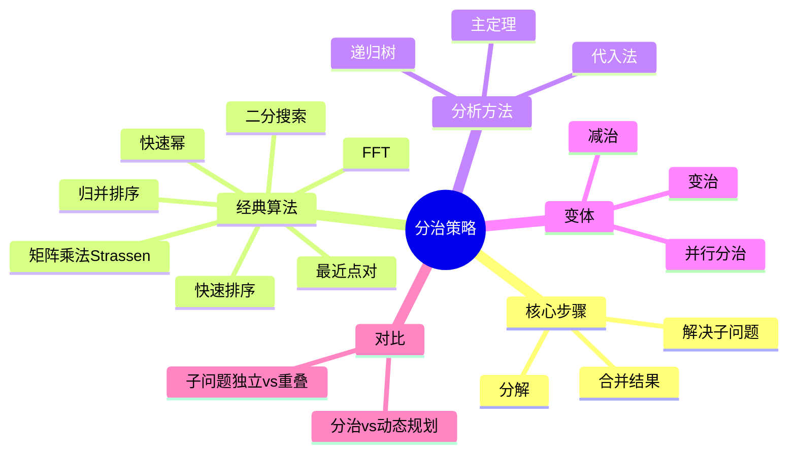

# 分治策略 (Divide and Conquer)

> **学科**: 算法设计与分析
> **难度**: ★★★★☆
> **先修**: 递归、递归式求解、基础算法
> **学时**: 6小时
> **来源**: CLRS第4章、MIT 6.006第3-4讲
> **版本**: v1.0
> **更新**: 2026-04-09

---

## 一、核心概念

### 1.1 定义

**正式定义**:
分治算法是一种通过**分解问题**、**解决子问题**、**合并结果**来解决问题的算法范式。

分治的三步策略：
1. **分解** (Divide): 将原问题分解为若干子问题
2. **解决** (Conquer): 递归解决子问题（若子问题足够小则直接求解）
3. **合并** (Combine): 将子问题的解合并为原问题的解

**递归式**:
分治算法的时间复杂度通常可用递归式表示：
$$T(n) = a \cdot T(n/b) + f(n)$$

其中：
- $a$: 子问题个数
- $n/b$: 子问题规模
- $f(n)$: 分解和合并的代价

**直观解释**:
分治就像组织大型活动：
- 分解：将大任务分配给各部门
- 解决：各部门处理自己的任务
- 合并：汇总各部门结果形成最终方案

**关键要点**:
- 分治的核心是**子问题相互独立**
- 与动态规划的区别：分治子问题不重叠，DP子问题重叠
- 主定理是分析分治算法的有力工具
- 平衡分解（子问题规模相近）通常最优

### 1.2 属性

| 属性 | 描述 | 备注 |
|------|------|------|
| 子问题独立性 | 子问题之间无重叠 | 与DP的关键区别 |
| 递归深度 | 通常为$O(\log n)$ | 平衡分解时 |
| 空间复杂度 | 通常为$O(\log n)$栈空间 | 递归调用栈 |
| 适用性 | 问题可分解为相似子问题 | 几何、排序、矩阵等 |

**性质总结**:
1. **平衡原则**: 子问题规模尽量相等时效率最高
2. **基例选择**: 子问题足够小时直接求解，避免递归开销
3. **合并成本**: 常是性能瓶颈，优化重点

### 1.3 变体

**减治** (Decrease and Conquer):
- 定义: 只处理一个子问题
- 与标准形式的区别: $a=1$，如二分搜索
- 适用场景: 每次可排除一部分解空间

**变治** (Transform and Conquer):
- 定义: 先转换问题形式再求解
- 与标准形式的区别: 不直接分解，而是预处理
- 适用场景: 堆排序、高斯消元

**并行分治**:
- 定义: 子问题并行求解
- 与标准形式的区别: 利用多核/分布式计算
- 适用场景: 大规模数据处理、并行计算

---

## 二、关系网络

### 2.1 前置知识

完成本主题学习前，应掌握：

| 前置知识 | 重要性 | 掌握程度检验 |
|----------|--------|--------------|
| 递归 | ⭐⭐⭐⭐⭐ | 能写递归函数，理解递归树 |
| 递归式求解 | ⭐⭐⭐⭐⭐ | 会使用主定理、代入法 |
| 数学归纳法 | ⭐⭐⭐⭐⭐ | 能证递归正确性 |
| 渐近分析 | ⭐⭐⭐⭐☆ | 能分析算法复杂度 |

### 2.2 相关概念

**紧密相关**:
- **主定理** - 求解分治递归式的标准工具
- **递归树** - 直观理解递归调用过程
- **动态规划** - 与分治的对比（重叠子问题）

**一般相关**:
- **并行算法** - 分治天然适合并行化
- **快速傅里叶变换** - 经典分治算法

### 2.3 后续扩展

学习本主题后，可继续深入：

1. **高级分治算法** → 最近点对、凸包、FFT
2. **并行计算** → MapReduce、并行分治
3. **计算几何** → 分治在几何问题中的应用

### 2.4 思维导图



---

## 三、形式化证明

### 3.1 核心定理

**定理 1** (主定理): 对于递归式$T(n) = aT(n/b) + f(n)$，其中$a \geq 1, b > 1$:

1. 若$f(n) = O(n^{\log_b a - \epsilon})$对某个$\epsilon > 0$，则$T(n) = \Theta(n^{\log_b a})$
2. 若$f(n) = \Theta(n^{\log_b a})$，则$T(n) = \Theta(n^{\log_b a} \cdot \log n)$
3. 若$f(n) = \Omega(n^{\log_b a + \epsilon})$对某个$\epsilon > 0$，且$af(n/b) \leq cf(n)$对某个$c < 1$，则$T(n) = \Theta(f(n))$

**证明概要** (Case 2):
```
递归树分析：

每层工作量：
- 第0层: f(n)
- 第1层: a·f(n/b)
- ...
- 第i层: a^i·f(n/b^i)

由Case 2条件，f(n) = Θ(n^{log_b a})：
a^i·f(n/b^i) = Θ(a^i · (n/b^i)^{log_b a})
             = Θ(a^i · n^{log_b a} / (b^{log_b a})^i)
             = Θ(a^i · n^{log_b a} / a^i)
             = Θ(n^{log_b a})

树高: log_b n
层数: log_b n + 1

总工作量: Θ(n^{log_b a}) · (log_b n + 1) = Θ(n^{log_b a} · log n) ∎
```

**证明要点分析**:
1. **递归树模型**: 可视化递归调用结构
2. **几何级数**: 每层工作量形成几何级数
3. **三种情况**: 分别对应叶节点主导、均匀分布、根节点主导

**直觉理解**:
- Case 1: 叶节点工作量主导，合并代价相对小
- Case 2: 各层工作量相当，乘以层数
- Case 3: 根节点工作量主导，递归代价相对小

### 3.2 辅助引理

**引理 1** (归并排序正确性): 归并排序能正确排序任意数组。

*证明*（数学归纳法）:
```
基例: n=1，数组已有序，正确。

归纳假设: 算法能正确排序长度小于n的数组。

归纳步骤:
  1. 将长度为n的数组分为两个长度<n的子数组
  2. 由归纳假设，递归调用返回有序子数组
  3. 合并操作保持有序性（双指针归并正确）
  
因此算法正确。∎
```

**引理 2** (二分搜索正确性): 若元素在有序数组中，二分搜索必能找到。

*证明*:
```
不变式: 若目标元素在数组中，则必在当前搜索范围内。

初始化: 范围是整个数组，显然成立。

保持: 每次比较将范围减半，
      若目标<中间元素，则在前半部分；
      若目标>中间元素，则在后半部分。
      范围仍包含目标。

终止: 范围为空（目标不存在）或找到目标。
∎
```

---

## 四、算法/方法详解

### 4.1 算法描述

**归并排序**:
```
算法: MERGE-SORT(A, p, r)
输入: 数组A，下标范围[p, r]
输出: A[p..r]已排序

1.  if p < r then
2.      q = ⌊(p + r) / 2⌋
3.      MERGE-SORT(A, p, q)
4.      MERGE-SORT(A, q+1, r)
5.      MERGE(A, p, q, r)
6.  end if

算法: MERGE(A, p, q, r)
输入: 已排序子数组A[p..q]和A[q+1..r]
输出: 合并后的有序数组A[p..r]

1.  n₁ = q - p + 1
2.  n₂ = r - q
3.  创建数组L[0..n₁]和R[0..n₂]
4.  for i = 0 to n₁-1 do
5.      L[i] = A[p + i]
6.  end for
7.  for j = 0 to n₂-1 do
8.      R[j] = A[q + j + 1]
9.  end for
10. L[n₁] = ∞  // 哨兵
11. R[n₂] = ∞  // 哨兵
12. i = 0, j = 0
13. for k = p to r do
14.     if L[i] ≤ R[j] then
15.         A[k] = L[i]
16.         i = i + 1
17.     else
18.         A[k] = R[j]
19.         j = j + 1
20.     end if
21. end for
```

**快速幂**:
```
算法: POWER(x, n)
输入: 底数x，指数n（非负整数）
输出: x^n

1.  if n == 0 then return 1
2.  if n == 1 then return x
3.  half = POWER(x, ⌊n/2⌋)
4.  if n is even then
5.      return half * half
6.  else
7.      return half * half * x
```

**流程图**:
```
分治算法框架
      │
      ▼
  问题规模
  足够小？
      │
      ├── 是 → 直接求解
      │
      └── 否 → 分解为a个子问题
                │
                ▼
            递归求解
            每个子问题
                │
                ▼
            合并子问题
            的解
                │
                ▼
            返回结果
```

### 4.2 正确性分析

**归并排序不变式**: 在MERGE-SORT(A, p, r)调用返回后，A[p..r]已排序。

**证明**:
- **初始化**: p=r时单元素有序
- **保持**: 递归调用后左右子数组有序，MERGE保持有序
- **终止**: 递归完成，整体有序

### 4.3 复杂度分析

| 算法 | 递归式 | 时间复杂度 | 空间复杂度 |
|------|--------|------------|------------|
| 归并排序 | T(n)=2T(n/2)+O(n) | O(n log n) | O(n) |
| 快速排序 | T(n)=2T(n/2)+O(n) | O(n log n)平均 | O(log n) |
| 二分搜索 | T(n)=T(n/2)+O(1) | O(log n) | O(log n) |
| Strassen | T(n)=7T(n/2)+O(n²) | O(n^2.81) | O(n^2.81) |
| 最近点对 | T(n)=2T(n/2)+O(n) | O(n log n) | O(n) |

---

## 五、示例与实例

### 5.1 标准示例

**示例 1**: 归并排序计数逆序对

**问题描述**:
给定数组，计算其中逆序对的数量（i<j但A[i]>A[j]）。

**解决过程**:
```
在归并过程中计数：
- 当从右子数组取元素放入结果时
- 左子数组剩余元素都与该元素构成逆序对

例如：
左=[3, 5, 7]，右=[2, 4, 6]
合并时先取2（来自右），左剩余[3,5,7]共3个，逆序对+3
```

**结果**: O(n log n)计数逆序对

**示例 2**: 快速幂

**问题描述**:
计算x^n，n为大整数。

**解决过程**:
```
3^13 = 3^1101₂
     = 3^8 · 3^4 · 3^1

递归计算：
3^1 = 3
3^2 = (3^1)² = 9
3^4 = (3^2)² = 81
3^8 = (3^4)² = 6561

结果: 6561 · 81 · 3 = 1,594,323
```

**结果**: O(log n)次乘法，远优于O(n)的朴素方法

**示例 3**: 最近点对

**问题描述**:
给定平面上n个点，找出距离最近的一对点。

**解决过程**:
```
1. 按x坐标排序，找垂直中线分割点集为左右两半
2. 递归求解左右两半的最近点对（距离dL, dR）
3. d = min(dL, dR)
4. 检查跨越中线的点对：只需检查中线两侧宽度为d的带状区域
5. 关键点：带状区域内每个点只需检查其后最多6个点
```

**结果**: O(n log n)，优于暴力O(n²)

### 5.2 代码实现

**语言**: Python + Rust

```python
import math
from typing import List, Tuple

def merge_sort_count_inversions(arr: List[int]) -> Tuple[int, List[int]]:
    """
    归并排序计数逆序对
    返回: (逆序对数, 排序后的数组)
    """
    if len(arr) <= 1:
        return 0, arr
    
    mid = len(arr) // 2
    left_count, left = merge_sort_count_inversions(arr[:mid])
    right_count, right = merge_sort_count_inversions(arr[mid:])
    merge_count, merged = _merge_count(left, right)
    
    return left_count + right_count + merge_count, merged

def _merge_count(left: List[int], right: List[int]) -> Tuple[int, List[int]]:
    """合并并计数逆序对"""
    result = []
    inversions = 0
    i = j = 0
    
    while i < len(left) and j < len(right):
        if left[i] <= right[j]:
            result.append(left[i])
            i += 1
        else:
            result.append(right[j])
            # 左数组剩余元素都与right[j]构成逆序对
            inversions += len(left) - i
            j += 1
    
    result.extend(left[i:])
    result.extend(right[j:])
    return inversions, result


def fast_pow(base: int, exp: int, mod: int = None) -> int:
    """
    快速幂
    计算 (base^exp) % mod（如果指定mod）
    """
    result = 1
    base = base % mod if mod else base
    
    while exp > 0:
        if exp & 1:  # 指数为奇数
            result = (result * base) % mod if mod else result * base
        base = (base * base) % mod if mod else base * base
        exp >>= 1
    
    return result


def closest_pair(points: List[Tuple[int, int]]) -> float:
    """
    最近点对算法
    返回最近点对的距离
    """
    points.sort()  # 按x坐标排序
    return _closest_pair_recursive(points)

def _closest_pair_recursive(points: List[Tuple[int, int]]) -> float:
    n = len(points)
    if n <= 3:
        return _brute_force(points)
    
    mid = n // 2
    mid_point = points[mid]
    
    dl = _closest_pair_recursive(points[:mid])
    dr = _closest_pair_recursive(points[mid:])
    d = min(dl, dr)
    
    # 检查跨越中线的带状区域
    strip = [p for p in points if abs(p[0] - mid_point[0]) < d]
    strip.sort(key=lambda p: p[1])  # 按y排序
    
    for i in range(len(strip)):
        # 每个点只需检查其后最多7个点
        for j in range(i + 1, min(i + 8, len(strip))):
            if strip[j][1] - strip[i][1] >= d:
                break
            d = min(d, _dist(strip[i], strip[j]))
    
    return d

def _dist(p1: Tuple[int, int], p2: Tuple[int, int]) -> float:
    return math.sqrt((p1[0]-p2[0])**2 + (p1[1]-p2[1])**2)

def _brute_force(points: List[Tuple[int, int]]) -> float:
    n = len(points)
    min_dist = float('inf')
    for i in range(n):
        for j in range(i + 1, n):
            min_dist = min(min_dist, _dist(points[i], points[j]))
    return min_dist


# Rust实现（快速幂）
RUST_CODE = '''
fn fast_pow(mut base: i64, mut exp: i64, mod_val: i64) -> i64 {
    let mut result = 1;
    base %= mod_val;
    
    while exp > 0 {
        if exp & 1 == 1 {
            result = (result * base) % mod_val;
        }
        base = (base * base) % mod_val;
        exp >>= 1;
    }
    
    result
}

fn merge_sort<T: Ord + Clone>(arr: &mut [T]) {
    let n = arr.len();
    if n <= 1 {
        return;
    }
    
    let mid = n / 2;
    merge_sort(&mut arr[..mid]);
    merge_sort(&mut arr[mid..]);
    
    // 合并（需要额外空间）
    let mut temp = arr.to_vec();
    let (mut i, mut j, mut k) = (0, mid, 0);
    
    while i < mid && j < n {
        if arr[i] <= arr[j] {
            temp[k] = arr[i].clone();
            i += 1;
        } else {
            temp[k] = arr[j].clone();
            j += 1;
        }
        k += 1;
    }
    
    while i < mid {
        temp[k] = arr[i].clone();
        i += 1;
        k += 1;
    }
    
    while j < n {
        temp[k] = arr[j].clone();
        j += 1;
        k += 1;
    }
    
    arr.copy_from_slice(&temp);
}
'''


# 测试
if __name__ == "__main__":
    # 逆序对测试
    arr = [1, 20, 6, 4, 5]
    count, sorted_arr = merge_sort_count_inversions(arr)
    print(f"数组: {arr}")
    print(f"逆序对数量: {count}")  # 5
    print(f"排序后: {sorted_arr}")
    
    # 快速幂测试
    print(f"\n2^100 mod 1000000007 = {fast_pow(2, 100, 1000000007)}")
    
    # 最近点对测试
    points = [(2, 3), (12, 30), (40, 50), (5, 1), (12, 10), (3, 4)]
    min_dist = closest_pair(points)
    print(f"\n最近点对距离: {min_dist:.4f}")  # 约1.4142 = sqrt(2)
```

**代码说明**:
- `merge_sort_count_inversions`: 归并排序同时计数逆序对
- `fast_pow`: 迭代实现快速幂，避免递归栈溢出
- `closest_pair`: O(n log n)的最近点对算法

## 5.3 反例
### 5.3 反例

**常见错误1**: 不平衡分解
```python
# 低效代码（QuickSort最坏情况）
def bad_quicksort(arr):
    if len(arr) <= 1:
        return arr
    pivot = arr[0]  # 总是选第一个，对有序数组退化为O(n²)
    left = [x for x in arr[1:] if x <= pivot]
    right = [x for x in arr[1:] if x > pivot]
    return bad_quicksort(left) + [pivot] + bad_quicksort(right)
```
**错误原因**: 不平衡分解导致O(n²)时间
**正确做法**: 随机选择pivot或三数取中

**常见错误2**: 忘记处理基例
```python
# 错误代码
def bad_binary_search(arr, target):
    mid = len(arr) // 2
    if arr[mid] == target:
        return mid
    elif arr[mid] < target:
        return bad_binary_search(arr[mid+1:], target)  # 未处理空数组！
    else:
        return bad_binary_search(arr[:mid], target)
```
**错误原因**: 未检查数组为空的情况
**正确做法**: 添加基例判断`if not arr: return -1`

---

## 六、习题

### 6.1 理解题 (L1)

1. **主定理应用** [难度⭐]
   
   用主定理求解以下递归式：
   - (a) T(n) = 2T(n/2) + n
   - (b) T(n) = 4T(n/2) + n²
   - (c) T(n) = T(n/2) + 1
   
   <details>
   <summary>解答</summary>
   
   (a) a=2, b=2, f(n)=n, log_b a = 1
       f(n) = Θ(n^1)，Case 2
       T(n) = Θ(n log n)
   
   (b) a=4, b=2, f(n)=n², log_b a = 2
       f(n) = Θ(n²)，Case 2
       T(n) = Θ(n² log n)
   
   (c) a=1, b=2, f(n)=1, log_b a = 0
       f(n) = Θ(n^0) = Θ(1)，Case 2
       T(n) = Θ(log n)
   
   </details>

2. **分治与DP区别** [难度⭐]
   
   分治算法与动态规划的主要区别是什么？
   
   <details>
   <summary>解答</summary>
   
   **主要区别**：子问题是否重叠
   
   - **分治**：子问题相互独立，不重叠
   - **动态规划**：子问题重叠，需要记忆化避免重复计算
   
   例：归并排序子问题不重叠，斐波那契数列子问题重叠。
   
   </details>

### 6.2 应用题 (L2-L3)

1. **大整数乘法** [难度⭐⭐]
   
   使用分治实现Karatsuba算法。
   
   <details>
   <summary>解答</summary>
   
   ```python
   def karatsuba(x, y):
       """Karatsuba大整数乘法，O(n^1.585)"""
       if x < 10 or y < 10:
           return x * y
       
       n = max(len(str(x)), len(str(y)))
       m = n // 2
       
       a, b = divmod(x, 10**m)
       c, d = divmod(y, 10**m)
       
       ac = karatsuba(a, c)
       bd = karatsuba(b, d)
       ad_bc = karatsuba(a + b, c + d) - ac - bd
       
       return ac * 10**(2*m) + ad_bc * 10**m + bd
   ```
   
   将4次乘法减少到3次：xy = ac·10^(2m) + (ad+bc)·10^m + bd
   其中 ad+bc = (a+b)(c+d) - ac - bd
   
   </details>

2. **寻找第k大元素** [难度⭐⭐⭐]
   
   使用快速选择算法在O(n)期望时间内找到数组中第k大的元素。
   
   <details>
   <summary>解答</summary>
   
   ```python
   import random
   
   def quickselect(arr, k):
       """寻找第k小元素（0-indexed）"""
       if len(arr) == 1:
           return arr[0]
       
       pivot = random.choice(arr)
       lows = [x for x in arr if x < pivot]
       highs = [x for x in arr if x > pivot]
       pivots = [x for x in arr if x == pivot]
       
       if k < len(lows):
           return quickselect(lows, k)
       elif k < len(lows) + len(pivots):
           return pivots[0]
       else:
           return quickselect(highs, k - len(lows) - len(pivots))
   ```
   
   平均复杂度O(n)，最坏O(n²)。
   
   </details>

### 6.3 证明题 (L4-L5)

1. **归并排序稳定性** [难度⭐⭐⭐]
   
   证明归并排序是稳定的排序算法。
   
   <details>
   <summary>解答</summary>
   
   **证明**:
   
   稳定性：相等元素的相对顺序在排序前后保持不变。
   
   在MERGE过程中：
   ```
   if L[i] <= R[j]:
       选择L[i]
   ```
   
   注意使用`<=`而不是`<`，这保证了：
   - 当L[i] == R[j]时，优先选择来自左子数组的元素
   - 左子数组的元素在原数组中位置靠前
   
   因此相等元素的相对顺序保持。∎
   
   </details>

---

## 七、应用场景

### 7.1 经典应用

| 应用场景 | 具体问题 | 使用本主题的原因 |
|----------|----------|------------------|
| 排序 | 归并排序、快速排序 | O(n log n)时间保证 |
| 搜索 | 二分搜索、选择算法 | O(log n)或O(n)时间 |
| 计算几何 | 最近点对、凸包 | O(n log n)优于暴力O(n²) |
| 大数运算 | Karatsuba乘法、快速幂 | 降低复杂度指数 |
| 信号处理 | FFT多项式乘法 | O(n log n)卷积 |
| 并行计算 | MapReduce | 天然适合并行化 |

### 7.2 实际案例

**案例**: 数据库归并连接(Merge Join)

**背景**:
数据库需要对两个大表进行连接操作。

**应用方式**:
- 若两表已按连接键排序，使用归并连接
- 线性扫描两表，匹配相同键的行
- O(n + m)时间，O(1)额外空间

**效果**:
- 比嵌套循环连接快得多
- 适合处理大规模数据

### 7.3 跨领域联系

**与并行计算的联系**:
分治算法天然适合并行化：子问题可独立求解，合并阶段需要同步。

**与函数式编程的联系**:
分治算法可以优雅地用递归表达，函数式语言如Haskell、Erlang擅长此类模式。

---

## 八、多维对比

### 8.1 方法对比

| 算法范式 | 特点 | 子问题关系 | 典型问题 | 时间复杂度 |
|----------|------|------------|----------|------------|
| 分治 | 分解-解决-合并 | 独立不重叠 | 排序、搜索、几何 | O(n log n)等 |
| 减治 | 只处理一个子问题 | - | 二分搜索、快速选择 | O(log n)等 |
| 变治 | 先转换问题 | - | 堆排序、高斯消元 | 依问题而定 |
| 动态规划 | 存储子问题解 | 重叠 | 背包、LCS、最短路径 | 多项式 |
| 贪心 | 只做当前最优 | - | MST、活动选择 | 通常更低 |

### 8.2 决策建议

**何时使用分治**:
- 问题可分解为相似子问题
- 子问题相互独立
- 合并子问题解比直接求解更高效

**何时不使用分治**:
- 子问题大量重叠（用DP）
- 分解/合并代价过高
- 问题规模小，直接求解更快

**决策流程图**:
```
问题可分解为相似子问题？
├── 否 → 考虑其他算法
└── 是 → 子问题是否重叠？
          ├── 是 → 动态规划
          └── 否 → 分治算法
                    分解合并代价如何？
                    ├── 过高 → 直接求解
                    └── 合理 → 应用分治
```

---

## 九、扩展阅读

### 9.1 教材章节

| 教材 | 章节 | 页码 | 推荐度 |
|------|------|------|--------|
| CLRS | 第4章 分治策略 | pp. 65-113 | ⭐⭐⭐⭐⭐ |
| CLRS | 第30章 多项式与FFT | pp. 898-919 | ⭐⭐⭐⭐⭐ |
| Algorithm Design | 第5章 分治 | pp. 209-260 | ⭐⭐⭐⭐⭐ |

### 9.2 论文

1. **"A Linear-Time Algorithm for the kth Smallest Element"** - Blum et al., 1973
   - **要点**: 提出中位数的中位数算法，O(n)最坏情况选择
   - **链接**: J. Comput. Syst. Sci.

### 9.3 在线资源

- **VisuAlgo**: 分治可视化 - https://visualgo.net/zh/divideandconquer
- **MIT OCW**: 6.006 Lecture 3-4

---

## 十、专家批注

> **Tony Hoare** (快速排序发明者):
> 
> "递归是算法设计中最强大的思想之一。分治让我们能够用递归解决看似复杂的问题。"

> **Jon Bentley**:
> 
> "当我面对一个新问题时，首先问：这个问题能用分治解决吗？"

---

## 十一、修订历史

| 版本 | 日期 | 修订者 | 修订内容 |
|------|------|--------|----------|
| v1.0 | 2026-04-09 | FormalAlgorithm Team | 完整重构，增加11个标准章节 |

---

**标签**: #分治算法 #主定理 #递归 #归并排序 #快速排序

**相关笔记**: 
- [渐近分析.md](./渐近分析.md)
- [排序算法.md](./排序算法.md)
- [动态规划.md](./动态规划.md)
- [基础数据结构.md](./基础数据结构.md)
