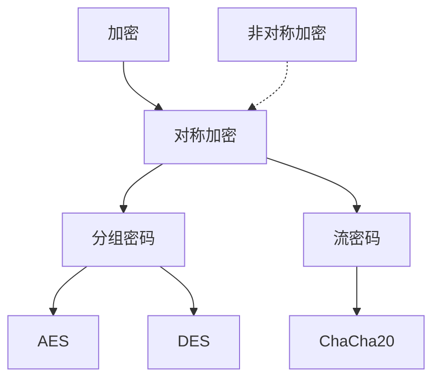
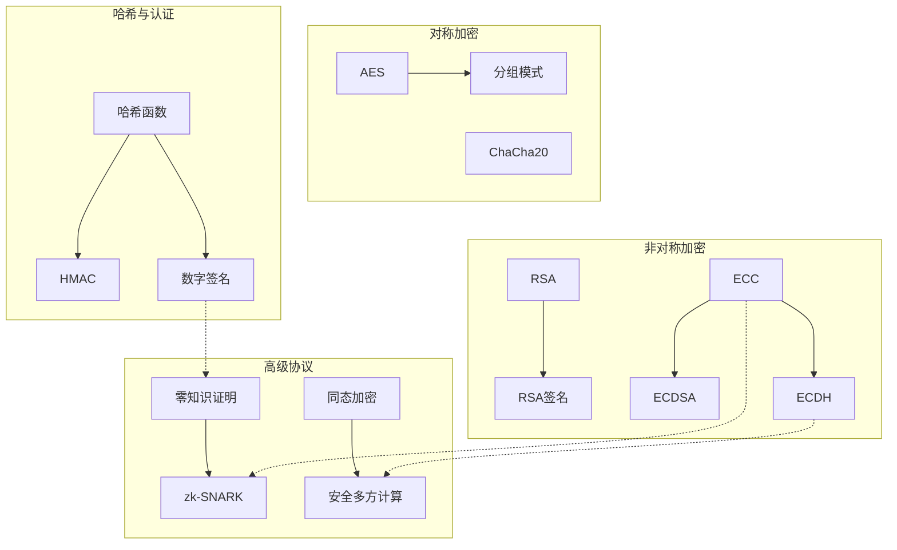
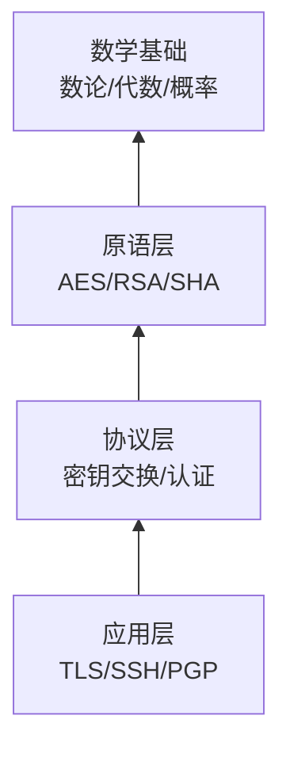

# 密码学概念图谱

> **版本**: 1.0
> **创建日期**: 2026-04-19
> **最后更新**: 2026-04-19

> 现代密码学理论与实践 - 详细概念定义
> 概念数量: 91个
> 最后更新: 2026-04-09

---

## 目录

- [密码学概念图谱](#密码学概念图谱)
  - [目录](#目录)
  - [一、对称加密](#一对称加密)
    - [对称加密](#对称加密)
      - [1. 形式化定义](#1-形式化定义)
      - [2. 属性特征](#2-属性特征)
      - [3. 关系网络](#3-关系网络)
    - [AES](#aes)
      - [1. 形式化定义](#1-形式化定义-1)
      - [2. 属性特征](#2-属性特征-1)
      - [3. 应用场景](#3-应用场景)
    - [分组密码模式](#分组密码模式)
      - [1. 形式化定义](#1-形式化定义-2)
      - [2. 属性特征](#2-属性特征-2)
  - [二、非对称加密](#二非对称加密)
    - [RSA](#rsa)
      - [1. 形式化定义](#1-形式化定义-3)
      - [2. 属性特征](#2-属性特征-3)
      - [3. 形式证明](#3-形式证明)
    - [椭圆曲线密码](#椭圆曲线密码)
      - [1. 形式化定义](#1-形式化定义-4)
      - [2. 属性特征](#2-属性特征-4)
      - [3. 应用场景](#3-应用场景-1)
    - [Diffie-Hellman密钥交换](#diffie-hellman密钥交换)
      - [1. 形式化定义](#1-形式化定义-5)
      - [2. 属性特征](#2-属性特征-5)
  - [三、哈希函数与MAC](#三哈希函数与mac)
    - [密码学哈希](#密码学哈希)
      - [1. 形式化定义](#1-形式化定义-6)
      - [2. 属性特征](#2-属性特征-6)
      - [3. 应用场景](#3-应用场景-2)
    - [HMAC](#hmac)
      - [1. 形式化定义](#1-形式化定义-7)
      - [2. 属性特征](#2-属性特征-7)
  - [四、数字签名](#四数字签名)
    - [数字签名](#数字签名)
      - [1. 形式化定义](#1-形式化定义-8)
      - [2. 属性特征](#2-属性特征-8)
    - [ECDSA](#ecdsa)
      - [1. 形式化定义](#1-形式化定义-9)
      - [2. 属性特征](#2-属性特征-9)
    - [BLS签名](#bls签名)
      - [1. 形式化定义](#1-形式化定义-10)
      - [2. 属性特征](#2-属性特征-10)
      - [3. 应用场景](#3-应用场景-3)
  - [五、零知识证明与高级协议](#五零知识证明与高级协议)
    - [零知识证明](#零知识证明)
      - [1. 形式化定义](#1-形式化定义-11)
      - [2. 属性特征](#2-属性特征-11)
      - [3. 应用场景](#3-应用场景-4)
    - [zk-SNARK](#zk-snark)
      - [1. 形式化定义](#1-形式化定义-12)
      - [2. 属性特征](#2-属性特征-12)
      - [3. 应用场景](#3-应用场景-5)
    - [同态加密](#同态加密)
      - [1. 形式化定义](#1-形式化定义-13)
      - [2. 属性特征](#2-属性特征-13)
      - [3. 应用场景](#3-应用场景-6)
    - [安全多方计算](#安全多方计算)
      - [1. 形式化定义](#1-形式化定义-14)
      - [2. 属性特征](#2-属性特征-14)
      - [3. 应用场景](#3-应用场景-7)
  - [六、概念关系图谱](#六概念关系图谱)
    - [全局关系图](#全局关系图)
    - [密码协议层次](#密码协议层次)
  - [七、学习路径](#七学习路径)
    - [P0 核心概念（4个）](#p0-核心概念4个)
    - [P1 重要概念（26个）](#p1-重要概念26个)
    - [P2 扩展概念（70个）](#p2-扩展概念70个)
  - [附录](#附录)
    - [参考资料](#参考资料)
  - [参考文献](#参考文献)
  - [知识导航](#知识导航)

---

## 一、对称加密

### 对称加密

**优先级**: P0
**编码**: CONCEPT-CRY-001

#### 1. 形式化定义

**定义**: 对称加密方案是一个三元组 $(\text{Gen}, \text{Enc}, \text{Dec})$：

- **密钥生成**: $\text{Gen}(1^n) \rightarrow k$，输入安全参数，输出密钥
- **加密**: $\text{Enc}_k(m) \rightarrow c$，明文 $m$ 加密为密文 $c$
- **解密**: $\text{Dec}_k(c) \rightarrow m$，正确性要求 $\text{Dec}_k(\text{Enc}_k(m)) = m$

**安全性定义** (IND-CPA): 对于任意概率多项式时间敌手 $A$：
$$|Pr[A^{\text{Enc}_k(\cdot)}(1^n) = 1] - Pr[A^{\text{Enc}_k(\$)}(1^n) = 1]| \leq \text{negl}(n)$$

#### 2. 属性特征

**优势**:

- 速度快: 硬件实现可达Gbps级别
- 密文紧凑: 无扩展或最小扩展

**局限**:

- 密钥分发困难
- 不支持数字签名

#### 3. 关系网络

---

### AES

**优先级**: P1
**编码**: CONCEPT-CRY-003

#### 1. 形式化定义

**AES参数**:

- 分组大小: 128位
- 密钥长度: 128/192/256位
- 轮数: 10/12/14轮

**轮函数** (每轮):

1. **SubBytes**: 字节替换（S盒）
2. **ShiftRows**: 行移位
3. **MixColumns**: 列混淆
4. **AddRoundKey**: 轮密钥加

#### 2. 属性特征

**安全性**:

- 无已知实用攻击（对完整AES）
- 最佳已知攻击:  biclique攻击（理论，复杂度 $2^{126.1}$）

**实现特性**:

- 适合硬件实现（AES-NI指令集）
- 适合软件实现（查表法）

#### 3. 应用场景

- 全盘加密
- TLS/SSL
- 无线安全 (WPA2/WPA3)

---

### 分组密码模式

**优先级**: P1
**编码**: CONCEPT-CRY-005

#### 1. 形式化定义

**ECB (Electronic Codebook)**:
$$c_i = E_k(m_i)$$
缺点: 相同明文产生相同密文，不安全

**CBC (Cipher Block Chaining)**:
$$c_i = E_k(m_i \oplus c_{i-1}), \quad c_0 = IV$$
需要随机IV，可并行解密

**CTR (Counter)**:
$$c_i = m_i \oplus E_k(\text{counter}_i)$$
流密码模式，可并行加解密

#### 2. 属性特征

| 模式 | 并行加密 | 并行解密 | 完整性 | 推荐 |
|------|----------|----------|--------|------|
| ECB | ✓ | ✓ | ✗ | 否 |
| CBC | ✗ | ✓ | ✗ | 有限 |
| CTR | ✓ | ✓ | ✗ | 是 |
| GCM | ✓ | ✓ | ✓ | 是 |

---

## 二、非对称加密

### RSA

**优先级**: P0
**编码**: CONCEPT-CRY-022

#### 1. 形式化定义

**密钥生成**:

1. 选择两个大素数 $p, q$
2. 计算 $n = pq$，$\varphi(n) = (p-1)(q-1)$
3. 选择 $e$ 使得 $\gcd(e, \varphi(n)) = 1$
4. 计算 $d = e^{-1} \mod \varphi(n)$

**公钥**: $(n, e)$，**私钥**: $(n, d)$

**加密**: $c = m^e \mod n$

**解密**: $m = c^d \mod n$

#### 2. 属性特征

**安全性**: 基于整数分解难题

**性能**: 比AES慢100-1000倍

**填充方案**: 必须使用OAEP等安全填充

#### 3. 形式证明

**正确性证明** (欧拉定理):
$$c^d = (m^e)^d = m^{ed} = m^{1 + k\varphi(n)} = m \cdot (m^{\varphi(n)})^k \equiv m \pmod{n}$$

---

### 椭圆曲线密码

**优先级**: P1
**编码**: CONCEPT-CRY-023

#### 1. 形式化定义

**椭圆曲线**: $E: y^2 = x^3 + ax + b$，满足 $4a^3 + 27b^2 \neq 0$

**点加**: 几何定义的群运算

**标量乘法**: $[k]P = P + P + ... + P$ ($k$次)

**椭圆曲线离散对数问题 (ECDLP)**: 给定 $P$ 和 $[k]P$，求 $k$

#### 2. 属性特征

**优势**: 相同安全强度下，密钥更短（256位ECC ≈ 3072位RSA）

**标准曲线**: P-256、secp256k1、Curve25519

#### 3. 应用场景

- 比特币、以太坊
- TLS 1.3
- 现代安全协议

---

### Diffie-Hellman密钥交换

**优先级**: P1
**编码**: CONCEPT-CRY-024

#### 1. 形式化定义

**协议**:

1. 公共参数: 大素数 $p$，生成元 $g$
2. Alice选择 $a$，发送 $A = g^a \mod p$
3. Bob选择 $b$，发送 $B = g^b \mod p$
4. 共享密钥: $K = B^a = A^b = g^{ab} \mod p$

**安全性**: 基于离散对数难题

#### 2. 属性特征

**前向保密**: 长期密钥泄露不影响过去会话

**变种**: ECDH（椭圆曲线版本）

---

## 三、哈希函数与MAC

### 密码学哈希

**优先级**: P1
**编码**: CONCEPT-CRY-038

#### 1. 形式化定义

**定义**: 哈希函数 $H: \{0,1\}^* \rightarrow \{0,1\}^n$

**安全性质**:

**抗原像性 (Preimage Resistance)**:
$$\text{给定 } y, \text{ 难以找到 } x \text{ 使得 } H(x) = y$$

**抗第二原像性**:
$$\text{给定 } x, \text{ 难以找到 } x' \neq x \text{ 使得 } H(x') = H(x)$$

**抗碰撞性**:
$$\text{难以找到 } x \neq x' \text{ 使得 } H(x) = H(x')$$

#### 2. 属性特征

**生日攻击**: 找到碰撞的复杂度为 $O(2^{n/2})$

#### 3. 应用场景

- 数字签名
- 密码存储
- 数据完整性

---

### HMAC

**优先级**: P1
**编码**: CONCEPT-CRY-040

#### 1. 形式化定义

$$\text{HMAC}_K(m) = H((K' \oplus opad) \| H((K' \oplus ipad) \| m))$$

其中:

- $K'$ 是填充后的密钥
- $ipad = 0x36$ 重复，$opad = 0x5C$ 重复

#### 2. 属性特征

**安全性**: 只要底层哈希函数安全，HMAC就安全

---

## 四、数字签名

### 数字签名

**优先级**: P1
**编码**: CONCEPT-CRY-055

#### 1. 形式化定义

**签名方案**: $(\text{Gen}, \text{Sign}, \text{Verify})$

- **签名**: $\sigma = \text{Sign}_{sk}(m)$
- **验证**: $\text{Verify}_{pk}(m, \sigma) \in \{0, 1\}$

**安全要求**:

- **正确性**: 合法签名必被接受
- **不可伪造性**: 无密钥者无法产生有效签名

#### 2. 属性特征

**性质**:

- 认证: 验证签名者身份
- 完整性: 检测消息篡改
- 不可否认性: 签名者不能否认签名

---

### ECDSA

**优先级**: P1
**编码**: CONCEPT-CRY-057

#### 1. 形式化定义

**签名生成**:

1. 选择随机数 $k$
2. 计算 $R = [k]G = (x, y)$
3. $r = x \mod n$，若 $r = 0$ 重选
4. $s = k^{-1}(H(m) + dr) \mod n$
5. 签名: $(r, s)$

**验证**: 检查 $r = x([H(m)s^{-1}]G + [rs^{-1}]Q)$

#### 2. 属性特征

**安全性要求**: 每次签名使用不同的 $k$，否则可恢复私钥

**应用场景**: 比特币、以太坊、TLS

---

### BLS签名

**优先级**: P2
**编码**: CONCEPT-CRY-062

#### 1. 形式化定义

**基于双线性配对**: $e: G_1 \times G_2 \rightarrow G_T$

**签名**: $\sigma = [H(m)]sk$

**验证**: $e(\sigma, G) = e(H(m), pk)$

#### 2. 属性特征

**独特性质**:

- 签名聚合: $\sigma_{agg} = \sum \sigma_i$
- 密钥聚合: 多签只需一个签名
- 短签名: 48字节

#### 3. 应用场景

- 以太坊2.0
- 区块链聚合签名

---

## 五、零知识证明与高级协议

### 零知识证明

**优先级**: P1
**编码**: CONCEPT-CRY-072

#### 1. 形式化定义

**定义**: 零知识证明是证明者向验证者证明某个陈述为真，但不泄露任何额外信息的协议。

**形式化** (交互式证明系统):

- **完备性**: 若陈述为真，诚实证明者能使验证者接受
- **可靠性**: 若陈述为假，任何证明者都不能使验证者接受（除可忽略概率）
- **零知识性**: 验证者除了陈述为真外，学不到任何信息

**模拟器定义**: 存在PPT模拟器 $S$，对真陈述产生的交互记录与实际不可区分

#### 2. 属性特征

**类型**:

- 完美零知识 (PZK)
- 统计零知识 (SZK)
- 计算零知识 (CZK)

#### 3. 应用场景

- 身份认证
- 隐私保护交易
- 区块链扩容

---

### zk-SNARK

**优先级**: P2
**编码**: CONCEPT-CRY-077

#### 1. 形式化定义

**SNARK**: Succinct Non-Interactive Argument of Knowledge

**性质**:

- **简洁性**: 证明大小和验证时间远小于计算大小
- **非交互性**: 单条消息证明
- **知识论证**: 证明者必须"知道"见证

#### 2. 属性特征

**构造**:

- 将计算转换为电路
- 使用配对友好椭圆曲线
- 可信设置 (部分方案)

#### 3. 应用场景

- Zcash隐私交易
- 区块链扩容（zk-Rollup）
- 可验证计算

---

### 同态加密

**优先级**: P1
**编码**: CONCEPT-CRY-076

#### 1. 形式化定义

**定义**: 同态加密允许在密文上进行计算：

$$\text{Dec}(f(\text{Enc}(m_1), \text{Enc}(m_2))) = f(m_1, m_2)$$

**部分同态** (PHE): 支持一种运算（加法或乘法）

**全同态** (FHE): 支持任意计算

**层次全同态** (LHE): 支持有限深度的计算

#### 2. 属性特征

**BFV/BGV方案**: 基于RLWE的层次FHE

**CKKS方案**: 支持浮点数近似计算

#### 3. 应用场景

- 隐私保护计算
- 安全多方计算
- 云计算安全

---

### 安全多方计算

**优先级**: P2
**编码**: CONCEPT-CRY-086

#### 1. 形式化定义

**定义**: $n$ 个参与方共同计算函数 $f(x_1, ..., x_n)$，每个参与方 $P_i$ 输入 $x_i$，学习到 $f$ 的输出，但不了解其他方的输入。

**安全性定义** (半诚实模型):

- 存在模拟器，根据输入输出模拟各方视图
- 真实执行与理想世界不可区分

#### 2. 属性特征

**Yao混淆电路**: 针对两方计算

**GMW协议**: 基于秘密分享的多方协议

**BGW协议**: 信息论安全的 $(t < n/3)$ 协议

#### 3. 应用场景

- 隐私保护机器学习
- 安全拍卖
- 密钥共享

---

## 六、概念关系图谱

### 全局关系图

### 密码协议层次

---

## 七、学习路径

### P0 核心概念（4个）

1. **对称加密** - 加密基础
2. **AES** - 实际标准
3. **RSA** - 非对称基础
4. **椭圆曲线密码** - 现代非对称

### P1 重要概念（26个）

**对称加密**: 分组模式、流密码、ChaCha20

**非对称加密**: Diffie-Hellman、ElGamal、密钥封装

**哈希与MAC**: SHA系列、HMAC、KDF

**数字签名**: RSA签名、ECDSA、盲签名、阈值签名

**高级协议**: 零知识证明、同态加密、承诺方案

### P2 扩展概念（70个）

深入学习：

- 后量子密码学
- zk-STARK、Bulletproofs
- 全同态加密
- 高级多方计算协议

---

## 附录

### 参考资料

1. Katz, J., and Lindell, Y. "Introduction to Modern Cryptography"
2. Boneh, D., and Shoup, V. "A Graduate Course in Applied Cryptography"
3. Menezes, A., et al. "Handbook of Applied Cryptography"

---

*本概念图谱由FormalAlgorithm项目维护*

---

## 参考文献

- [CLRS2009] T. H. Cormen et al. Introduction to Algorithms (3rd ed.). MIT Press, 2009.
- [Pierce2002] B. C. Pierce. Types and Programming Languages. MIT Press, 2002.

---

## 知识导航

- [返回目录](README.md)
