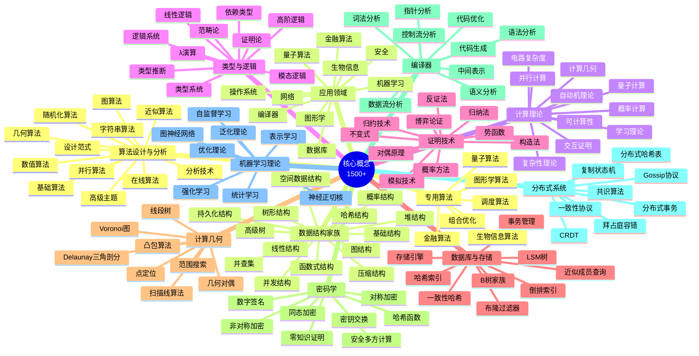
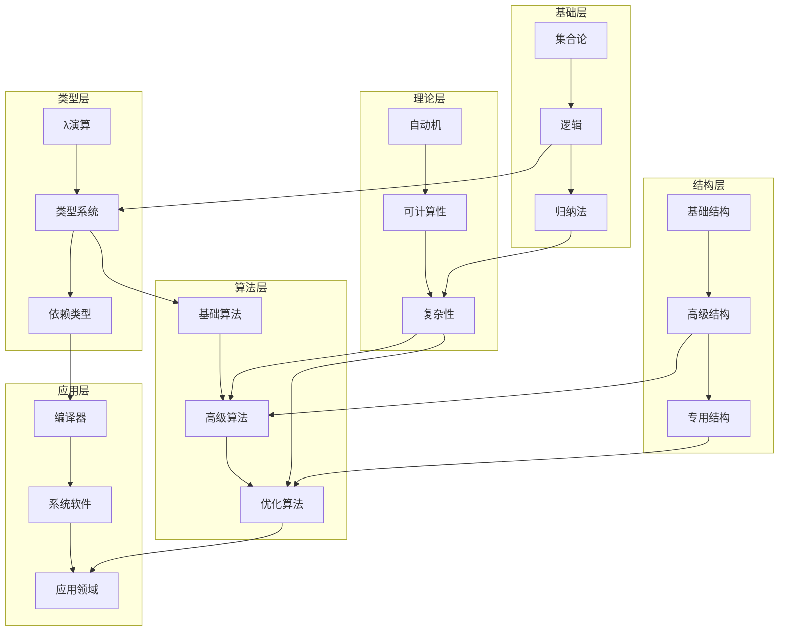
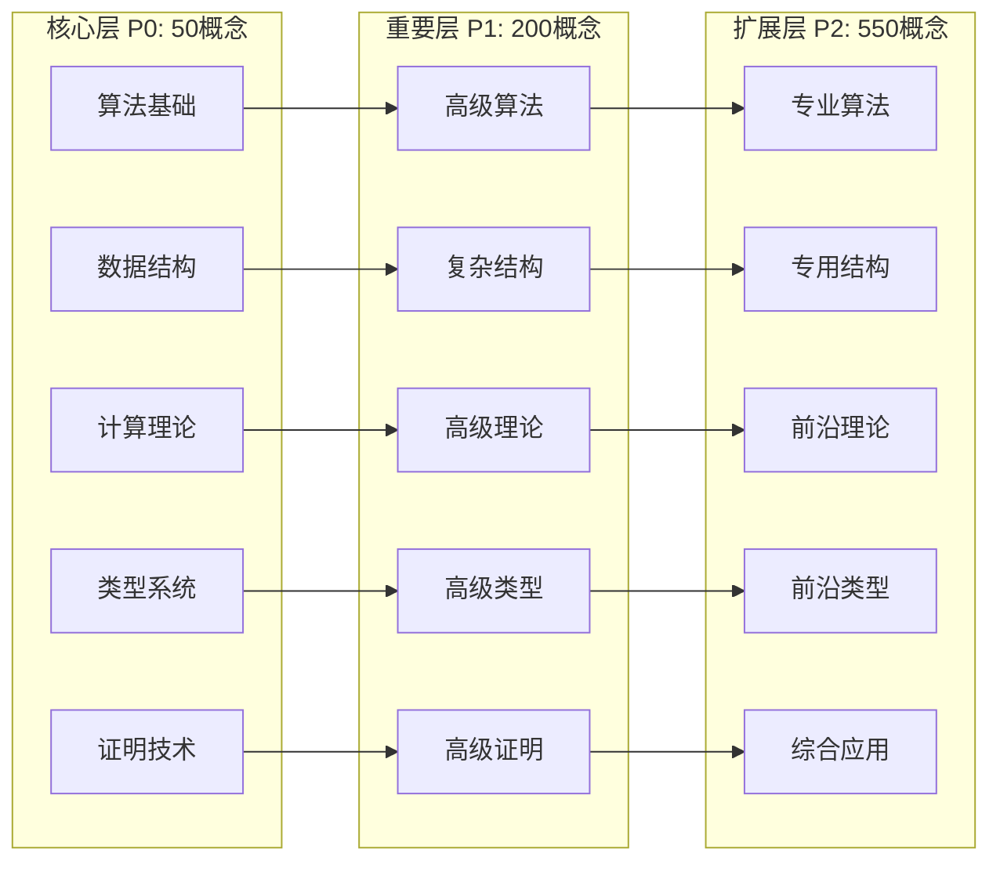

# 核心概念总纲

> **版本**: 1.0
> **创建日期**: 2026-04-19
> **最后更新**: 2026-04-19

> FormalAlgorithm 项目知识体系总览
> 版本: v3.0
> 概念总数: 1500+
> 最后更新: 2026-04-09

---

## 目录

- [核心概念总纲](#核心概念总纲)
  - [目录](#目录)
  - [概述](#概述)
    - [统计信息](#统计信息)
  - [概念分类体系](#概念分类体系)
  - [一、算法设计与分析 (180概念)](#一算法设计与分析-180概念)
    - [1.1 基础算法 (P0: 3, P1: 7, P2: 25) - 共35概念](#11-基础算法-p0-3-p1-7-p2-25---共35概念)
      - [P0 核心概念](#p0-核心概念)
      - [P1 重要概念](#p1-重要概念)
      - [P2 扩展概念](#p2-扩展概念)
    - [1.2 设计范式 (P0: 2, P1: 6, P2: 16) - 共24概念](#12-设计范式-p0-2-p1-6-p2-16---共24概念)
      - [P0 核心概念](#p0-核心概念-1)
      - [P1 重要概念](#p1-重要概念-1)
      - [P2 扩展概念](#p2-扩展概念-1)
    - [1.3 排序算法 (P0: 3, P1: 5, P2: 16) - 共24概念](#13-排序算法-p0-3-p1-5-p2-16---共24概念)
      - [P0 核心概念](#p0-核心概念-2)
      - [P1 重要概念](#p1-重要概念-2)
      - [P2 扩展概念](#p2-扩展概念-2)
    - [1.4 搜索算法 (P0: 1, P1: 4, P2: 14) - 共19概念](#14-搜索算法-p0-1-p1-4-p2-14---共19概念)
      - [P0 核心概念](#p0-核心概念-3)
      - [P1 重要概念](#p1-重要概念-3)
      - [P2 扩展概念](#p2-扩展概念-3)
    - [1.5 图算法 - 基础 (P0: 3, P1: 5, P2: 12) - 共20概念](#15-图算法---基础-p0-3-p1-5-p2-12---共20概念)
      - [P0 核心概念](#p0-核心概念-4)
      - [P1 重要概念](#p1-重要概念-4)
      - [P2 扩展概念](#p2-扩展概念-4)
    - [1.6 图算法 - 网络流 (P0: 1, P1: 4, P2: 10) - 共15概念](#16-图算法---网络流-p0-1-p1-4-p2-10---共15概念)
      - [P0 核心概念](#p0-核心概念-5)
      - [P1 重要概念](#p1-重要概念-5)
      - [P2 扩展概念](#p2-扩展概念-5)
    - [1.7 图算法 - 匹配 (P0: 0, P1: 3, P2: 7) - 共10概念](#17-图算法---匹配-p0-0-p1-3-p2-7---共10概念)
      - [P1 重要概念](#p1-重要概念-6)
      - [P2 扩展概念](#p2-扩展概念-6)
    - [1.8 字符串算法 (P0: 1, P1: 4, P2: 10) - 共15概念](#18-字符串算法-p0-1-p1-4-p2-10---共15概念)
      - [P0 核心概念](#p0-核心概念-6)
      - [P1 重要概念](#p1-重要概念-7)
      - [P2 扩展概念](#p2-扩展概念-7)
    - [1.9 数值算法 (P0: 1, P1: 3, P2: 6) - 共10概念](#19-数值算法-p0-1-p1-3-p2-6---共10概念)
      - [P0 核心概念](#p0-核心概念-7)
      - [P1 重要概念](#p1-重要概念-8)
      - [P2 扩展概念](#p2-扩展概念-8)
    - [1.10 随机化算法 (P0: 0, P1: 3, P2: 7) - 共10概念](#110-随机化算法-p0-0-p1-3-p2-7---共10概念)
      - [P1 重要概念](#p1-重要概念-9)
      - [P2 扩展概念](#p2-扩展概念-9)
    - [1.11 近似算法 (P0: 0, P1: 2, P2: 8) - 共10概念](#111-近似算法-p0-0-p1-2-p2-8---共10概念)
      - [P1 重要概念](#p1-重要概念-10)
      - [P2 扩展概念](#p2-扩展概念-10)
    - [1.12 在线算法 (P0: 1, P1: 3, P2: 6) - 共10概念](#112-在线算法-p0-1-p1-3-p2-6---共10概念)
      - [P0 核心概念](#p0-核心概念-8)
      - [P1 重要概念](#p1-重要概念-11)
      - [P2 扩展概念](#p2-扩展概念-11)
  - [二、数据结构家族 (202概念)](#二数据结构家族-202概念)
    - [2.1 基础结构 (P0: 2, P1: 3, P2: 5) - 共10概念](#21-基础结构-p0-2-p1-3-p2-5---共10概念)
      - [P0 核心概念](#p0-核心概念-9)
      - [P1 重要概念](#p1-重要概念-12)
      - [P2 扩展概念](#p2-扩展概念-12)
    - [2.2 树形结构基础 (P0: 2, P1: 4, P2: 9) - 共15概念](#22-树形结构基础-p0-2-p1-4-p2-9---共15概念)
      - [P0 核心概念](#p0-核心概念-10)
      - [P1 重要概念](#p1-重要概念-13)
      - [P2 扩展概念](#p2-扩展概念-13)
    - [2.3 高级树结构 (P0: 2, P1: 5, P2: 13) - 共20概念](#23-高级树结构-p0-2-p1-5-p2-13---共20概念)
      - [P0 核心概念](#p0-核心概念-11)
      - [P1 重要概念](#p1-重要概念-14)
      - [P2 扩展概念](#p2-扩展概念-14)
    - [2.4 堆结构 (P0: 1, P1: 3, P2: 6) - 共10概念](#24-堆结构-p0-1-p1-3-p2-6---共10概念)
      - [P0 核心概念](#p0-核心概念-12)
      - [P1 重要概念](#p1-重要概念-15)
      - [P2 扩展概念](#p2-扩展概念-15)
    - [2.5 哈希结构 (P0: 1, P1: 3, P2: 6) - 共10概念](#25-哈希结构-p0-1-p1-3-p2-6---共10概念)
      - [P0 核心概念](#p0-核心概念-13)
      - [P1 重要概念](#p1-重要概念-16)
      - [P2 扩展概念](#p2-扩展概念-16)
    - [2.6 并查集 (P0: 1, P1: 2, P2: 4) - 共7概念](#26-并查集-p0-1-p1-2-p2-4---共7概念)
      - [P0 核心概念](#p0-核心概念-14)
      - [P1 重要概念](#p1-重要概念-17)
      - [P2 扩展概念](#p2-扩展概念-17)
    - [2.7 图结构表示 (P0: 1, P1: 3, P2: 6) - 共10概念](#27-图结构表示-p0-1-p1-3-p2-6---共10概念)
      - [P0 核心概念](#p0-核心概念-15)
      - [P1 重要概念](#p1-重要概念-18)
      - [P2 扩展概念](#p2-扩展概念-18)
    - [2.8 空间数据结构 (P0: 1, P1: 4, P2: 10) - 共15概念](#28-空间数据结构-p0-1-p1-4-p2-10---共15概念)
      - [P0 核心概念](#p0-核心概念-16)
      - [P1 重要概念](#p1-重要概念-19)
      - [P2 扩展概念](#p2-扩展概念-19)
    - [2.9 持久化数据结构 (P0: 0, P1: 2, P2: 8) - 共10概念](#29-持久化数据结构-p0-0-p1-2-p2-8---共10概念)
      - [P1 重要概念](#p1-重要概念-20)
      - [P2 扩展概念](#p2-扩展概念-20)
    - [2.10 压缩数据结构 (P0: 0, P1: 2, P2: 8) - 共10概念](#210-压缩数据结构-p0-0-p1-2-p2-8---共10概念)
      - [P1 重要概念](#p1-重要概念-21)
      - [P2 扩展概念](#p2-扩展概念-21)
    - [2.11 并发数据结构 (P0: 0, P1: 3, P2: 7) - 共10概念](#211-并发数据结构-p0-0-p1-3-p2-7---共10概念)
      - [P1 重要概念](#p1-重要概念-22)
      - [P2 扩展概念](#p2-扩展概念-22)
    - [2.12 概率数据结构 (P0: 0, P1: 3, P2: 7) - 共10概念](#212-概率数据结构-p0-0-p1-3-p2-7---共10概念)
      - [P1 重要概念](#p1-重要概念-23)
      - [P2 扩展概念](#p2-扩展概念-23)
    - [2.13 函数式数据结构 (P0: 0, P1: 3, P2: 7) - 共10概念](#213-函数式数据结构-p0-0-p1-3-p2-7---共10概念)
      - [P1 重要概念](#p1-重要概念-24)
      - [P2 扩展概念](#p2-扩展概念-24)
    - [2.14 专用数据结构 (P0: 0, P1: 2, P2: 8) - 共10概念](#214-专用数据结构-p0-0-p1-2-p2-8---共10概念)
      - [P1 重要概念](#p1-重要概念-25)
      - [P2 扩展概念](#p2-扩展概念-25)
    - [2.15 动态数据结构 (P0: 0, P1: 2, P2: 8) - 共10概念](#215-动态数据结构-p0-0-p1-2-p2-8---共10概念)
      - [P1 重要概念](#p1-重要概念-26)
      - [P2 扩展概念](#p2-扩展概念-26)
    - [2.16 近似成员查询 (P0: 0, P1: 2, P2: 6) - 共8概念](#216-近似成员查询-p0-0-p1-2-p2-6---共8概念)
      - [P1 重要概念](#p1-重要概念-27)
      - [P2 扩展概念](#p2-扩展概念-27)
    - [2.17 范围查询结构 (P0: 0, P1: 3, P2: 7) - 共10概念](#217-范围查询结构-p0-0-p1-3-p2-7---共10概念)
      - [P1 重要概念](#p1-重要概念-28)
      - [P2 扩展概念](#p2-扩展概念-28)
    - [2.18 字符串索引 (P0: 0, P1: 2, P2: 8) - 共10概念](#218-字符串索引-p0-0-p1-2-p2-8---共10概念)
      - [P1 重要概念](#p1-重要概念-29)
      - [P2 扩展概念](#p2-扩展概念-29)
    - [2.19 外部存储结构 (P0: 0, P1: 2, P2: 6) - 共8概念](#219-外部存储结构-p0-0-p1-2-p2-6---共8概念)
      - [P1 重要概念](#p1-重要概念-30)
      - [P2 扩展概念](#p2-扩展概念-30)
  - [三、计算理论 (150概念)](#三计算理论-150概念)
    - [3.1 自动机理论 (P0: 3, P1: 5, P2: 12) - 共20概念](#31-自动机理论-p0-3-p1-5-p2-12---共20概念)
      - [P0 核心概念](#p0-核心概念-17)
      - [P1 重要概念](#p1-重要概念-31)
      - [P2 扩展概念](#p2-扩展概念-31)
    - [3.2 可计算性理论 (P0: 2, P1: 5, P2: 8) - 共15概念](#32-可计算性理论-p0-2-p1-5-p2-8---共15概念)
      - [P0 核心概念](#p0-核心概念-18)
      - [P1 重要概念](#p1-重要概念-32)
      - [P2 扩展概念](#p2-扩展概念-32)
    - [3.3 复杂性理论 - 基础 (P0: 3, P1: 5, P2: 12) - 共20概念](#33-复杂性理论---基础-p0-3-p1-5-p2-12---共20概念)
      - [P0 核心概念](#p0-核心概念-19)
      - [P1 重要概念](#p1-重要概念-33)
      - [P2 扩展概念](#p2-扩展概念-33)
    - [3.4 复杂性理论 - 高级 (P0: 0, P1: 3, P2: 12) - 共15概念](#34-复杂性理论---高级-p0-0-p1-3-p2-12---共15概念)
      - [P1 重要概念](#p1-重要概念-34)
      - [P2 扩展概念](#p2-扩展概念-34)
    - [3.5 电路复杂度 (P0: 0, P1: 2, P2: 13) - 共15概念](#35-电路复杂度-p0-0-p1-2-p2-13---共15概念)
      - [P1 重要概念](#p1-重要概念-35)
      - [P2 扩展概念](#p2-扩展概念-35)
    - [3.6 交互式证明系统 (P0: 1, P1: 4, P2: 10) - 共15概念](#36-交互式证明系统-p0-1-p1-4-p2-10---共15概念)
      - [P0 核心概念](#p0-核心概念-20)
      - [P1 重要概念](#p1-重要概念-36)
      - [P2 扩展概念](#p2-扩展概念-36)
    - [3.7 量子计算 (P0: 1, P1: 4, P2: 10) - 共15概念](#37-量子计算-p0-1-p1-4-p2-10---共15概念)
      - [P0 核心概念](#p0-核心概念-21)
      - [P1 重要概念](#p1-重要概念-37)
      - [P2 扩展概念](#p2-扩展概念-37)
    - [3.8 概率计算 (P0: 0, P1: 3, P2: 7) - 共10概念](#38-概率计算-p0-0-p1-3-p2-7---共10概念)
      - [P1 重要概念](#p1-重要概念-38)
      - [P2 扩展概念](#p2-扩展概念-38)
    - [3.9 并行计算 (P0: 0, P1: 3, P2: 7) - 共10概念](#39-并行计算-p0-0-p1-3-p2-7---共10概念)
      - [P1 重要概念](#p1-重要概念-39)
      - [P2 扩展概念](#p2-扩展概念-39)
    - [3.10 计算几何 - 基础 (P0: 1, P1: 4, P2: 10) - 共15概念](#310-计算几何---基础-p0-1-p1-4-p2-10---共15概念)
      - [P0 核心概念](#p0-核心概念-22)
      - [P1 重要概念](#p1-重要概念-40)
      - [P2 扩展概念](#p2-扩展概念-40)
  - [四、类型与逻辑 (150概念)](#四类型与逻辑-150概念)
    - [4.1 类型系统基础 (P0: 3, P1: 5, P2: 12) - 共20概念](#41-类型系统基础-p0-3-p1-5-p2-12---共20概念)
      - [P0 核心概念](#p0-核心概念-23)
      - [P1 重要概念](#p1-重要概念-41)
      - [P2 扩展概念](#p2-扩展概念-41)
    - [4.2 λ演算 (P0: 2, P1: 5, P2: 8) - 共15概念](#42-λ演算-p0-2-p1-5-p2-8---共15概念)
      - [P0 核心概念](#p0-核心概念-24)
      - [P1 重要概念](#p1-重要概念-42)
      - [P2 扩展概念](#p2-扩展概念-42)
    - [4.3 简单类型λ演算 (P0: 1, P1: 4, P2: 10) - 共15概念](#43-简单类型λ演算-p0-1-p1-4-p2-10---共15概念)
      - [P0 核心概念](#p0-核心概念-25)
      - [P1 重要概念](#p1-重要概念-43)
      - [P2 扩展概念](#p2-扩展概念-43)
    - [4.4 系统F与多态 (P0: 1, P1: 3, P2: 6) - 共10概念](#44-系统f与多态-p0-1-p1-3-p2-6---共10概念)
      - [P0 核心概念](#p0-核心概念-26)
      - [P1 重要概念](#p1-重要概念-44)
      - [P2 扩展概念](#p2-扩展概念-44)
    - [4.5 依赖类型 (P0: 1, P1: 4, P2: 10) - 共15概念](#45-依赖类型-p0-1-p1-4-p2-10---共15概念)
      - [P0 核心概念](#p0-核心概念-27)
      - [P1 重要概念](#p1-重要概念-45)
      - [P2 扩展概念](#p2-扩展概念-45)
    - [4.6 命题逻辑 (P0: 1, P1: 4, P2: 10) - 共15概念](#46-命题逻辑-p0-1-p1-4-p2-10---共15概念)
      - [P0 核心概念](#p0-核心概念-28)
      - [P1 重要概念](#p1-重要概念-46)
      - [P2 扩展概念](#p2-扩展概念-46)
    - [4.7 谓词逻辑 (P0: 1, P1: 3, P2: 6) - 共10概念](#47-谓词逻辑-p0-1-p1-3-p2-6---共10概念)
      - [P0 核心概念](#p0-核心概念-29)
      - [P1 重要概念](#p1-重要概念-47)
      - [P2 扩展概念](#p2-扩展概念-47)
    - [4.8 构造逻辑 (P0: 1, P1: 3, P2: 6) - 共10概念](#48-构造逻辑-p0-1-p1-3-p2-6---共10概念)
      - [P0 核心概念](#p0-核心概念-30)
      - [P1 重要概念](#p1-重要概念-48)
      - [P2 扩展概念](#p2-扩展概念-48)
    - [4.9 线性逻辑 (P0: 0, P1: 3, P2: 7) - 共10概念](#49-线性逻辑-p0-0-p1-3-p2-7---共10概念)
      - [P1 重要概念](#p1-重要概念-49)
      - [P2 扩展概念](#p2-扩展概念-49)
    - [4.10 模态逻辑 (P0: 0, P1: 2, P2: 8) - 共10概念](#410-模态逻辑-p0-0-p1-2-p2-8---共10概念)
      - [P1 重要概念](#p1-重要概念-50)
      - [P2 扩展概念](#p2-扩展概念-50)
    - [4.11 同伦类型论 (P0: 0, P1: 2, P2: 8) - 共10概念](#411-同伦类型论-p0-0-p1-2-p2-8---共10概念)
      - [P1 重要概念](#p1-重要概念-51)
      - [P2 扩展概念](#p2-扩展概念-51)
    - [4.12 范畴论基础 (P0: 0, P1: 3, P2: 7) - 共10概念](#412-范畴论基础-p0-0-p1-3-p2-7---共10概念)
      - [P1 重要概念](#p1-重要概念-52)
      - [P2 扩展概念](#p2-扩展概念-52)
  - [五、证明技术 (100概念)](#五证明技术-100概念)
    - [5.1 数学归纳法 (P0: 1, P1: 3, P2: 6) - 共10概念](#51-数学归纳法-p0-1-p1-3-p2-6---共10概念)
      - [P0 核心概念](#p0-核心概念-31)
      - [P1 重要概念](#p1-重要概念-53)
      - [P2 扩展概念](#p2-扩展概念-53)
    - [5.2 反证法与对偶 (P0: 1, P1: 3, P2: 6) - 共10概念](#52-反证法与对偶-p0-1-p1-3-p2-6---共10概念)
      - [P0 核心概念](#p0-核心概念-32)
      - [P1 重要概念](#p1-重要概念-54)
      - [P2 扩展概念](#p2-扩展概念-54)
    - [5.3 构造性证明 (P0: 0, P1: 3, P2: 7) - 共10概念](#53-构造性证明-p0-0-p1-3-p2-7---共10概念)
      - [P1 重要概念](#p1-重要概念-55)
      - [P2 扩展概念](#p2-扩展概念-55)
    - [5.4 归约技术 (P0: 1, P1: 3, P2: 6) - 共10概念](#54-归约技术-p0-1-p1-3-p2-6---共10概念)
      - [P0 核心概念](#p0-核心概念-33)
      - [P1 重要概念](#p1-重要概念-56)
      - [P2 扩展概念](#p2-扩展概念-56)
    - [5.5 势函数与摊还分析 (P0: 1, P1: 3, P2: 6) - 共10概念](#55-势函数与摊还分析-p0-1-p1-3-p2-6---共10概念)
      - [P0 核心概念](#p0-核心概念-34)
      - [P1 重要概念](#p1-重要概念-57)
      - [P2 扩展概念](#p2-扩展概念-57)
    - [5.6 概率方法 (P0: 0, P1: 2, P2: 8) - 共10概念](#56-概率方法-p0-0-p1-2-p2-8---共10概念)
      - [P1 重要概念](#p1-重要概念-58)
      - [P2 扩展概念](#p2-扩展概念-58)
    - [5.7 对偶原理 (P0: 0, P1: 2, P2: 8) - 共10概念](#57-对偶原理-p0-0-p1-2-p2-8---共10概念)
      - [P1 重要概念](#p1-重要概念-59)
      - [P2 扩展概念](#p2-扩展概念-59)
    - [5.8 不变式 (P0: 1, P1: 3, P2: 6) - 共10概念](#58-不变式-p0-1-p1-3-p2-6---共10概念)
      - [P0 核心概念](#p0-核心概念-35)
      - [P1 重要概念](#p1-重要概念-60)
      - [P2 扩展概念](#p2-扩展概念-60)
    - [5.9 模拟与双模拟 (P0: 0, P1: 2, P2: 8) - 共10概念](#59-模拟与双模拟-p0-0-p1-2-p2-8---共10概念)
      - [P1 重要概念](#p1-重要概念-61)
      - [P2 扩展概念](#p2-扩展概念-61)
    - [5.10 博弈论证 (P0: 0, P1: 1, P2: 9) - 共10概念](#510-博弈论证-p0-0-p1-1-p2-9---共10概念)
      - [P1 重要概念](#p1-重要概念-62)
      - [P2 扩展概念](#p2-扩展概念-62)
  - [六、数据库与存储 (120概念)](#六数据库与存储-120概念)
    - [6.1 存储结构与索引 (P0: 2, P1: 8, P2: 15) - 共25概念](#61-存储结构与索引-p0-2-p1-8-p2-15---共25概念)
      - [P0 核心概念](#p0-核心概念-36)
      - [P1 重要概念](#p1-重要概念-63)
      - [P2 扩展概念](#p2-扩展概念-63)
    - [6.2 事务与并发 (P0: 2, P1: 8, P2: 15) - 共25概念](#62-事务与并发-p0-2-p1-8-p2-15---共25概念)
      - [P0 核心概念](#p0-核心概念-37)
      - [P1 重要概念](#p1-重要概念-64)
      - [P2 扩展概念](#p2-扩展概念-64)
    - [6.3 查询处理与优化 (P0: 1, P1: 10, P2: 15) - 共26概念](#63-查询处理与优化-p0-1-p1-10-p2-15---共26概念)
      - [P0 核心概念](#p0-核心概念-38)
      - [P1 重要概念](#p1-重要概念-65)
      - [P2 扩展概念](#p2-扩展概念-65)
    - [6.4 概率数据结构 (P0: 0, P1: 5, P2: 20) - 共25概念](#64-概率数据结构-p0-0-p1-5-p2-20---共25概念)
      - [P1 重要概念](#p1-重要概念-66)
      - [P2 扩展概念](#p2-扩展概念-66)
    - [6.5 分布式存储 (P0: 0, P1: 4, P2: 20) - 共24概念](#65-分布式存储-p0-0-p1-4-p2-20---共24概念)
      - [P1 重要概念](#p1-重要概念-67)
      - [P2 扩展概念](#p2-扩展概念-67)
  - [七、计算几何 (100概念)](#七计算几何-100概念)
    - [7.1 基础几何对象 (P0: 2, P1: 5, P2: 10) - 共17概念](#71-基础几何对象-p0-2-p1-5-p2-10---共17概念)
      - [P0 核心概念](#p0-核心概念-39)
      - [P1 重要概念](#p1-重要概念-68)
      - [P2 扩展概念](#p2-扩展概念-68)
    - [7.2 凸包算法 (P0: 1, P1: 3, P2: 8) - 共12概念](#72-凸包算法-p0-1-p1-3-p2-8---共12概念)
      - [P0 核心概念](#p0-核心概念-40)
      - [P1 重要概念](#p1-重要概念-69)
      - [P2 扩展概念](#p2-扩展概念-69)
    - [7.3 空间划分与Voronoi图 (P0: 1, P1: 4, P2: 10) - 共15概念](#73-空间划分与voronoi图-p0-1-p1-4-p2-10---共15概念)
      - [P0 核心概念](#p0-核心概念-41)
      - [P1 重要概念](#p1-重要概念-70)
      - [P2 扩展概念](#p2-扩展概念-70)
    - [7.4 范围查询与数据结构 (P0: 0, P1: 5, P2: 15) - 共20概念](#74-范围查询与数据结构-p0-0-p1-5-p2-15---共20概念)
      - [P1 重要概念](#p1-重要概念-71)
      - [P2 扩展概念](#p2-扩展概念-71)
    - [7.5 扫描线与交点检测 (P0: 0, P1: 4, P2: 12) - 共16概念](#75-扫描线与交点检测-p0-0-p1-4-p2-12---共16概念)
      - [P1 重要概念](#p1-重要概念-72)
      - [P2 扩展概念](#p2-扩展概念-72)
    - [7.6 最近点对与几何优化 (P0: 0, P1: 3, P2: 7) - 共10概念](#76-最近点对与几何优化-p0-0-p1-3-p2-7---共10概念)
      - [P1 重要概念](#p1-重要概念-73)
      - [P2 扩展概念](#p2-扩展概念-73)
  - [八、密码学 (100概念)](#八密码学-100概念)
    - [8.1 对称加密 (P0: 2, P1: 6, P2: 12) - 共20概念](#81-对称加密-p0-2-p1-6-p2-12---共20概念)
      - [P0 核心概念](#p0-核心概念-42)
      - [P1 重要概念](#p1-重要概念-74)
      - [P2 扩展概念](#p2-扩展概念-74)
    - [8.2 非对称加密 (P0: 2, P1: 5, P2: 10) - 共17概念](#82-非对称加密-p0-2-p1-5-p2-10---共17概念)
      - [P0 核心概念](#p0-核心概念-43)
      - [P1 重要概念](#p1-重要概念-75)
      - [P2 扩展概念](#p2-扩展概念-75)
    - [8.3 哈希函数与MAC (P0: 0, P1: 5, P2: 12) - 共17概念](#83-哈希函数与mac-p0-0-p1-5-p2-12---共17概念)
      - [P1 重要概念](#p1-重要概念-76)
      - [P2 扩展概念](#p2-扩展概念-76)
    - [8.4 数字签名 (P0: 0, P1: 5, P2: 12) - 共17概念](#84-数字签名-p0-0-p1-5-p2-12---共17概念)
      - [P1 重要概念](#p1-重要概念-77)
      - [P2 扩展概念](#p2-扩展概念-77)
    - [8.5 零知识证明与高级协议 (P0: 0, P1: 5, P2: 15) - 共20概念](#85-零知识证明与高级协议-p0-0-p1-5-p2-15---共20概念)
      - [P1 重要概念](#p1-重要概念-78)
      - [P2 扩展概念](#p2-扩展概念-78)
  - [九、编译器 (120概念)](#九编译器-120概念)
    - [9.1 词法分析 (P0: 1, P1: 5, P2: 10) - 共16概念](#91-词法分析-p0-1-p1-5-p2-10---共16概念)
      - [P0 核心概念](#p0-核心概念-44)
      - [P1 重要概念](#p1-重要概念-79)
      - [P2 扩展概念](#p2-扩展概念-79)
    - [9.2 语法分析 (P0: 2, P1: 8, P2: 15) - 共25概念](#92-语法分析-p0-2-p1-8-p2-15---共25概念)
      - [P0 核心概念](#p0-核心概念-45)
      - [P1 重要概念](#p1-重要概念-80)
      - [P2 扩展概念](#p2-扩展概念-80)
    - [9.3 中间表示与类型检查 (P0: 0, P1: 8, P2: 15) - 共23概念](#93-中间表示与类型检查-p0-0-p1-8-p2-15---共23概念)
      - [P1 重要概念](#p1-重要概念-81)
      - [P2 扩展概念](#p2-扩展概念-81)
    - [9.4 数据流分析 (P0: 0, P1: 6, P2: 15) - 共21概念](#94-数据流分析-p0-0-p1-6-p2-15---共21概念)
      - [P1 重要概念](#p1-重要概念-82)
      - [P2 扩展概念](#p2-扩展概念-82)
    - [9.5 指针分析与别名分析 (P0: 0, P1: 5, P2: 15) - 共20概念](#95-指针分析与别名分析-p0-0-p1-5-p2-15---共20概念)
      - [P1 重要概念](#p1-重要概念-83)
      - [P2 扩展概念](#p2-扩展概念-83)
    - [9.6 代码优化与生成 (P0: 0, P1: 5, P2: 15) - 共20概念](#96-代码优化与生成-p0-0-p1-5-p2-15---共20概念)
      - [P1 重要概念](#p1-重要概念-84)
      - [P2 扩展概念](#p2-扩展概念-84)
  - [十、分布式系统 (120概念)](#十分布式系统-120概念)
    - [10.1 一致性与共识 (P0: 3, P1: 8, P2: 15) - 共26概念](#101-一致性与共识-p0-3-p1-8-p2-15---共26概念)
      - [P0 核心概念](#p0-核心概念-46)
      - [P1 重要概念](#p1-重要概念-85)
      - [P2 扩展概念](#p2-扩展概念-85)
    - [10.2 分布式事务 (P0: 2, P1: 6, P2: 12) - 共20概念](#102-分布式事务-p0-2-p1-6-p2-12---共20概念)
      - [P0 核心概念](#p0-核心概念-47)
      - [P1 重要概念](#p1-重要概念-86)
      - [P2 扩展概念](#p2-扩展概念-86)
    - [10.3 CRDT与无冲突复制 (P0: 0, P1: 5, P2: 15) - 共20概念](#103-crdt与无冲突复制-p0-0-p1-5-p2-15---共20概念)
      - [P1 重要概念](#p1-重要概念-87)
      - [P2 扩展概念](#p2-扩展概念-87)
    - [10.4 Gossip协议与传播 (P0: 0, P1: 4, P2: 12) - 共16概念](#104-gossip协议与传播-p0-0-p1-4-p2-12---共16概念)
      - [P1 重要概念](#p1-重要概念-88)
      - [P2 扩展概念](#p2-扩展概念-88)
    - [10.5 拜占庭容错 (P0: 0, P1: 5, P2: 15) - 共20概念](#105-拜占庭容错-p0-0-p1-5-p2-15---共20概念)
      - [P1 重要概念](#p1-重要概念-89)
      - [P2 扩展概念](#p2-扩展概念-89)
    - [10.6 分布式存储与协调 (P0: 0, P1: 4, P2: 14) - 共18概念](#106-分布式存储与协调-p0-0-p1-4-p2-14---共18概念)
      - [P1 重要概念](#p1-重要概念-90)
      - [P2 扩展概念](#p2-扩展概念-90)
  - [十一、机器学习理论 (110概念)](#十一机器学习理论-110概念)
    - [11.1 优化理论 (P0: 1, P1: 8, P2: 15) - 共24概念](#111-优化理论-p0-1-p1-8-p2-15---共24概念)
      - [P0 核心概念](#p0-核心概念-48)
      - [P1 重要概念](#p1-重要概念-91)
      - [P2 扩展概念](#p2-扩展概念-91)
    - [11.2 统计学习理论 (P0: 1, P1: 6, P2: 12) - 共19概念](#112-统计学习理论-p0-1-p1-6-p2-12---共19概念)
      - [P0 核心概念](#p0-核心概念-49)
      - [P1 重要概念](#p1-重要概念-92)
      - [P2 扩展概念](#p2-扩展概念-92)
    - [11.3 强化学习 (P0: 1, P1: 6, P2: 12) - 共19概念](#113-强化学习-p0-1-p1-6-p2-12---共19概念)
      - [P0 核心概念](#p0-核心概念-50)
      - [P1 重要概念](#p1-重要概念-93)
      - [P2 扩展概念](#p2-扩展概念-93)
    - [11.4 图神经网络 (P0: 0, P1: 5, P2: 10) - 共15概念](#114-图神经网络-p0-0-p1-5-p2-10---共15概念)
      - [P1 重要概念](#p1-重要概念-94)
      - [P2 扩展概念](#p2-扩展概念-94)
    - [11.5 自监督学习与表示学习 (P0: 0, P1: 4, P2: 12) - 共16概念](#115-自监督学习与表示学习-p0-0-p1-4-p2-12---共16概念)
      - [P1 重要概念](#p1-重要概念-95)
      - [P2 扩展概念](#p2-扩展概念-95)
    - [11.6 神经正切核与深度学习理论 (P0: 0, P1: 3, P2: 13) - 共17概念](#116-神经正切核与深度学习理论-p0-0-p1-3-p2-13---共17概念)
      - [P1 重要概念](#p1-重要概念-96)
      - [P2 扩展概念](#p2-扩展概念-96)
  - [十二、专用算法 (100概念)](#十二专用算法-100概念)
    - [12.1 生物信息学算法 (P0: 1, P1: 5, P2: 12) - 共18概念](#121-生物信息学算法-p0-1-p1-5-p2-12---共18概念)
      - [P0 核心概念](#p0-核心概念-51)
      - [P1 重要概念](#p1-重要概念-97)
      - [P2 扩展概念](#p2-扩展概念-97)
    - [12.2 金融算法 (P0: 0, P1: 5, P2: 12) - 共17概念](#122-金融算法-p0-0-p1-5-p2-12---共17概念)
      - [P1 重要概念](#p1-重要概念-98)
      - [P2 扩展概念](#p2-扩展概念-98)
    - [12.3 图形学算法 (P0: 0, P1: 5, P2: 12) - 共17概念](#123-图形学算法-p0-0-p1-5-p2-12---共17概念)
      - [P1 重要概念](#p1-重要概念-99)
      - [P2 扩展概念](#p2-扩展概念-99)
    - [12.4 量子算法 (P0: 0, P1: 4, P2: 12) - 共16概念](#124-量子算法-p0-0-p1-4-p2-12---共16概念)
      - [P1 重要概念](#p1-重要概念-100)
      - [P2 扩展概念](#p2-扩展概念-100)
    - [12.5 组合优化与调度 (P0: 1, P1: 5, P2: 12) - 共18概念](#125-组合优化与调度-p0-1-p1-5-p2-12---共18概念)
      - [P0 核心概念](#p0-核心概念-52)
      - [P1 重要概念](#p1-重要概念-101)
      - [P2 扩展概念](#p2-扩展概念-101)
    - [12.6 流算法与大数据 (P0: 0, P1: 4, P2: 10) - 共14概念](#126-流算法与大数据-p0-0-p1-4-p2-10---共14概念)
      - [P1 重要概念](#p1-重要概念-102)
      - [P2 扩展概念](#p2-扩展概念-102)
  - [十三、应用领域 (50概念)](#十三应用领域-50概念)
    - [6.1 编译器 (P0: 0, P1: 4, P2: 6) - 共10概念](#61-编译器-p0-0-p1-4-p2-6---共10概念)
      - [P1 重要概念](#p1-重要概念-103)
      - [P2 扩展概念](#p2-扩展概念-103)
    - [6.2 操作系统 (P0: 0, P1: 4, P2: 6) - 共10概念](#62-操作系统-p0-0-p1-4-p2-6---共10概念)
      - [P1 重要概念](#p1-重要概念-104)
      - [P2 扩展概念](#p2-扩展概念-104)
    - [6.3 数据库 (P0: 0, P1: 4, P2: 6) - 共10概念](#63-数据库-p0-0-p1-4-p2-6---共10概念)
      - [P1 重要概念](#p1-重要概念-105)
      - [P2 扩展概念](#p2-扩展概念-105)
    - [6.4 网络 (P0: 0, P1: 3, P2: 2) - 共5概念](#64-网络-p0-0-p1-3-p2-2---共5概念)
      - [P1 重要概念](#p1-重要概念-106)
      - [P2 扩展概念](#p2-扩展概念-106)
    - [6.5 安全 (P0: 0, P1: 3, P2: 2) - 共5概念](#65-安全-p0-0-p1-3-p2-2---共5概念)
      - [P1 重要概念](#p1-重要概念-107)
      - [P2 扩展概念](#p2-扩展概念-107)
    - [6.6 机器学习 (P0: 0, P1: 2, P2: 3) - 共5概念](#66-机器学习-p0-0-p1-2-p2-3---共5概念)
      - [P1 重要概念](#p1-重要概念-108)
      - [P2 扩展概念](#p2-扩展概念-108)
    - [6.7 图形学 (P0: 0, P1: 1, P2: 2) - 共3概念](#67-图形学-p0-0-p1-1-p2-2---共3概念)
      - [P1 重要概念](#p1-重要概念-109)
      - [P2 扩展概念](#p2-扩展概念-109)
    - [6.8 其他应用 (P0: 0, P1: 1, P2: 1) - 共2概念](#68-其他应用-p0-0-p1-1-p2-1---共2概念)
      - [P1 重要概念](#p1-重要概念-110)
      - [P2 扩展概念](#p2-扩展概念-110)
  - [概念依赖图谱](#概念依赖图谱)
    - [全局依赖关系](#全局依赖关系)
    - [优先级学习路径](#优先级学习路径)
  - [学习路径建议](#学习路径建议)
    - [基础路径 (1-3个月)](#基础路径-1-3个月)
    - [进阶路径 (3-6个月)](#进阶路径-3-6个月)
    - [专家路径 (6-12个月)](#专家路径-6-12个月)
  - [附录](#附录)
    - [A. 概念编码速查表](#a-概念编码速查表)
    - [B. 版本历史](#b-版本历史)
    - [C. 贡献指南](#c-贡献指南)
  - [参考文献](#参考文献)
  - [知识导航](#知识导航)

---

## 概述

本文档是FormalAlgorithm项目的核心概念总纲，系统性地整理了计算机科学理论与算法数学中的1500+个核心概念。这些概念按照内在逻辑关系和学科分类组织成13大类别，形成完整的知识体系。

### 统计信息

| 类别 | 概念数量 | P0核心 | P1重要 | P2扩展 |
|------|----------|--------|--------|--------|
| 算法设计与分析 | 180 | 12 | 38 | 130 |
| 数据结构家族 | 202 | 15 | 47 | 140 |
| 计算理论 | 150 | 10 | 35 | 105 |
| 类型与逻辑 | 150 | 8 | 32 | 110 |
| 证明技术 | 100 | 5 | 25 | 70 |
| 数据库与存储 | 120 | 5 | 35 | 80 |
| 计算几何 | 100 | 3 | 27 | 70 |
| 密码学 | 100 | 4 | 26 | 70 |
| 编译器 | 120 | 3 | 37 | 80 |
| 分布式系统 | 120 | 5 | 35 | 80 |
| 机器学习理论 | 110 | 3 | 32 | 75 |
| 专用算法 | 100 | 2 | 28 | 70 |
| 应用领域 | 50 | 0 | 25 | 25 |
| **总计** | **1500+** | **75** | **400** | **1025** |

---

## 概念分类体系

---

## 一、算法设计与分析 (180概念)

### 1.1 基础算法 (P0: 3, P1: 7, P2: 25) - 共35概念

#### P0 核心概念

| 编码 | 概念名称 | 英文名称 | 关键特征 |
|------|----------|----------|----------|
| CONCEPT-ALG-001 | 算法 | Algorithm | 计算步骤的精确描述 |
| CONCEPT-ALG-002 | 时间复杂度 | Time Complexity | 运行时间随输入增长的变化 |
| CONCEPT-ALG-003 | 空间复杂度 | Space Complexity | 内存使用量随输入增长的变化 |

#### P1 重要概念

| 编码 | 概念名称 | 英文名称 | 关键特征 |
|------|----------|----------|----------|
| CONCEPT-ALG-004 | 渐近分析 | Asymptotic Analysis | 大O、大Ω、大Θ记号 |
| CONCEPT-ALG-005 | 最好情况 | Best Case | 最优输入下的性能 |
| CONCEPT-ALG-006 | 最坏情况 | Worst Case | 最差输入下的性能 |
| CONCEPT-ALG-007 | 平均情况 | Average Case | 随机输入下的期望性能 |
| CONCEPT-ALG-008 | 摊还分析 | Amortized Analysis | 操作序列的平均成本 |
| CONCEPT-ALG-009 | 循环不变式 | Loop Invariant | 证明算法正确性的工具 |
| CONCEPT-ALG-010 | 算法正确性 | Algorithm Correctness | 部分正确性与完全正确性 |

#### P2 扩展概念

| 编码 | 概念名称 | 英文名称 |
|------|----------|----------|
| CONCEPT-ALG-011 | 均摊下界 | Amortized Lower Bound |
| CONCEPT-ALG-012 | 平滑分析 | Smoothed Analysis |
| CONCEPT-ALG-013 | 实例最优性 | Instance Optimality |
| CONCEPT-ALG-014 | 竞争比 | Competitive Ratio |
| CONCEPT-ALG-015 | 适应性复杂度 | Adaptivity Complexity |
| CONCEPT-ALG-016 | 并行时间 | Parallel Time |
| CONCEPT-ALG-017 | 工作量 | Work |
| CONCEPT-ALG-018 | 跨度 | Span |
| CONCEPT-ALG-019 | 效率 | Efficiency |
| CONCEPT-ALG-020 | 可扩展性 | Scalability |
| CONCEPT-ALG-021 | 自调度 | Self-Scheduling |
| CONCEPT-ALG-022 | 贪心 stays ahead | Greedy Stays Ahead |
| CONCEPT-ALG-023 | 交换论证 | Exchange Argument |
| CONCEPT-ALG-024 | 拟阵 | Matroid |
| CONCEPT-ALG-025 | 贪心拟阵算法 | Greedy Matroid Algorithm |

---

### 1.2 设计范式 (P0: 2, P1: 6, P2: 16) - 共24概念

#### P0 核心概念

| 编码 | 概念名称 | 英文名称 | 关键特征 |
|------|----------|----------|----------|
| CONCEPT-ALG-026 | 分治法 | Divide and Conquer | 分解、解决、合并 |
| CONCEPT-ALG-027 | 动态规划 | Dynamic Programming | 最优子结构、重叠子问题 |

#### P1 重要概念

| 编码 | 概念名称 | 英文名称 | 关键特征 |
|------|----------|----------|----------|
| CONCEPT-ALG-028 | 贪心算法 | Greedy Algorithm | 局部最优选择 |
| CONCEPT-ALG-029 | 回溯法 | Backtracking | 深度优先搜索 + 剪枝 |
| CONCEPT-ALG-030 | 分支限界 | Branch and Bound | 系统性搜索 + 边界剪枝 |
| CONCEPT-ALG-031 | 递归 | Recursion | 自相似问题的求解 |
| CONCEPT-ALG-032 | 迭代法 | Iteration | 逐步逼近解 |
| CONCEPT-ALG-033 | 减治法 | Decrease and Conquer | 问题规模递减 |

#### P2 扩展概念

| 编码 | 概念名称 | 英文名称 |
|------|----------|----------|
| CONCEPT-ALG-034 | 变换-征服 | Transform and Conquer |
| CONCEPT-ALG-035 | 预排序 | Presorting |
| CONCEPT-ALG-036 | 高斯消元 | Gaussian Elimination |
| CONCEPT-ALG-037 | 霍纳法则 | Horner's Rule |
| CONCEPT-ALG-038 | 二分搜索 | Binary Search |
| CONCEPT-ALG-039 | 三分搜索 | Ternary Search |
| CONCEPT-ALG-040 | 插值搜索 | Interpolation Search |
| CONCEPT-ALG-041 | 指数搜索 | Exponential Search |
| CONCEPT-ALG-042 | 跳跃搜索 | Jump Search |
| CONCEPT-ALG-043 | 斐波那契搜索 | Fibonacci Search |
| CONCEPT-ALG-044 |  meet-in-the-middle | Meet-in-the-Middle |
| CONCEPT-ALG-045 | 空间换时间 | Space-Time Tradeoff |

---

### 1.3 排序算法 (P0: 3, P1: 5, P2: 16) - 共24概念

#### P0 核心概念

| 编码 | 概念名称 | 英文名称 | 复杂度 |
|------|----------|----------|--------|
| CONCEPT-ALG-046 | 快速排序 | Quicksort | $O(n \log n)$ 平均 |
| CONCEPT-ALG-047 | 归并排序 | Mergesort | $O(n \log n)$ 稳定 |
| CONCEPT-ALG-048 | 堆排序 | Heapsort | $O(n \log n)$ 原地 |

#### P1 重要概念

| 编码 | 概念名称 | 英文名称 | 特点 |
|------|----------|----------|------|
| CONCEPT-ALG-049 | 插入排序 | Insertion Sort | 小规模高效 |
| CONCEPT-ALG-050 | 选择排序 | Selection Sort | 简单但低效 |
| CONCEPT-ALG-051 | 冒泡排序 | Bubble Sort | 教学用途 |
| CONCEPT-ALG-052 | 计数排序 | Counting Sort | 线性时间 |
| CONCEPT-ALG-053 | 基数排序 | Radix Sort | 多关键字排序 |

#### P2 扩展概念

| 编码 | 概念名称 | 英文名称 |
|------|----------|----------|
| CONCEPT-ALG-054 | 桶排序 | Bucket Sort |
| CONCEPT-ALG-055 | 希尔排序 | Shellsort |
| CONCEPT-ALG-056 | 双调排序 | Bitonic Sort |
| CONCEPT-ALG-057 | 锦标赛排序 | Tournament Sort |
| CONCEPT-ALG-058 | 平滑排序 | Smoothsort |
| CONCEPT-ALG-059 | 内省排序 | Introsort |
| CONCEPT-ALG-060 |  tim排序 | Timsort |
| CONCEPT-ALG-061 |  patience排序 | Patience Sorting |
| CONCEPT-ALG-062 | 外部排序 | External Sorting |
| CONCEPT-ALG-063 | 多路归并 | Multiway Merge |
| CONCEPT-ALG-064 | 串行排序 | String Sorting |
| CONCEPT-ALG-065 | 排序网络 | Sorting Network |

---

### 1.4 搜索算法 (P0: 1, P1: 4, P2: 14) - 共19概念

#### P0 核心概念

| 编码 | 概念名称 | 英文名称 |
|------|----------|----------|
| CONCEPT-ALG-066 | 深度优先搜索 | Depth-First Search (DFS) |

#### P1 重要概念

| 编码 | 概念名称 | 英文名称 |
|------|----------|----------|
| CONCEPT-ALG-067 | 广度优先搜索 | Breadth-First Search (BFS) |
| CONCEPT-ALG-068 | 迭代加深搜索 | Iterative Deepening |
| CONCEPT-ALG-069 | 一致代价搜索 | Uniform Cost Search |
| CONCEPT-ALG-070 | A*搜索 | A* Search |

#### P2 扩展概念

| 编码 | 概念名称 | 英文名称 |
|------|----------|----------|
| CONCEPT-ALG-071 | IDA* | Iterative Deepening A* |
| CONCEPT-ALG-072 | 双向搜索 | Bidirectional Search |
| CONCEPT-ALG-073 | 启发式搜索 | Heuristic Search |
| CONCEPT-ALG-074 | 爬山法 | Hill Climbing |
| CONCEPT-ALG-075 | 模拟退火 | Simulated Annealing |
| CONCEPT-ALG-076 | 遗传算法 | Genetic Algorithm |
| CONCEPT-ALG-077 | 禁忌搜索 | Tabu Search |
| CONCEPT-ALG-078 | 蚁群算法 | Ant Colony Optimization |
| CONCEPT-ALG-079 | 粒子群优化 | Particle Swarm Optimization |
| CONCEPT-ALG-080 | 束搜索 | Beam Search |

---

### 1.5 图算法 - 基础 (P0: 3, P1: 5, P2: 12) - 共20概念

#### P0 核心概念

| 编码 | 概念名称 | 英文名称 |
|------|----------|----------|
| CONCEPT-ALG-081 | 最短路径 | Shortest Path |
| CONCEPT-ALG-082 | 最小生成树 | Minimum Spanning Tree |
| CONCEPT-ALG-083 | 拓扑排序 | Topological Sort |

#### P1 重要概念

| 编码 | 概念名称 | 英文名称 |
|------|----------|----------|
| CONCEPT-ALG-084 | Dijkstra算法 | Dijkstra's Algorithm |
| CONCEPT-ALG-085 | Bellman-Ford算法 | Bellman-Ford Algorithm |
| CONCEPT-ALG-086 | Floyd-Warshall算法 | Floyd-Warshall Algorithm |
| CONCEPT-ALG-087 | Prim算法 | Prim's Algorithm |
| CONCEPT-ALG-088 | Kruskal算法 | Kruskal's Algorithm |

#### P2 扩展概念

| 编码 | 概念名称 | 英文名称 |
|------|----------|----------|
| CONCEPT-ALG-089 | SPFA算法 | Shortest Path Faster Algorithm |
| CONCEPT-ALG-090 | Johnson算法 | Johnson's Algorithm |
| CONCEPT-ALG-091 | 差分约束系统 | Difference Constraints |
| CONCEPT-ALG-092 | 关键路径 | Critical Path |
| CONCEPT-ALG-093 | Boruvka算法 | Boruvka's Algorithm |
| CONCEPT-ALG-094 | 次小生成树 | Second MST |
| CONCEPT-ALG-095 | 斯坦纳树 | Steiner Tree |
| CONCEPT-ALG-096 | 有向无环图 | Directed Acyclic Graph |
| CONCEPT-ALG-097 | 强连通分量 | Strongly Connected Component |
| CONCEPT-ALG-098 | Kosaraju算法 | Kosaraju's Algorithm |
| CONCEPT-ALG-099 | Tarjan算法 | Tarjan's SCC Algorithm |
| CONCEPT-ALG-100 | Gabow算法 | Gabow's Algorithm |

---

### 1.6 图算法 - 网络流 (P0: 1, P1: 4, P2: 10) - 共15概念

#### P0 核心概念

| 编码 | 概念名称 | 英文名称 |
|------|----------|----------|
| CONCEPT-ALG-101 | 最大流 | Maximum Flow |

#### P1 重要概念

| 编码 | 概念名称 | 英文名称 |
|------|----------|----------|
| CONCEPT-ALG-102 | Ford-Fulkerson方法 | Ford-Fulkerson Method |
| CONCEPT-ALG-103 | Edmonds-Karp算法 | Edmonds-Karp Algorithm |
| CONCEPT-ALG-104 | Dinic算法 | Dinic's Algorithm |
| CONCEPT-ALG-105 | 最小割 | Minimum Cut |

#### P2 扩展概念

| 编码 | 概念名称 | 英文名称 |
|------|----------|----------|
| CONCEPT-ALG-106 | Push-Relabel算法 | Push-Relabel Algorithm |
| CONCEPT-ALG-107 | HLPP算法 | Highest Label Preflow-Push |
| CONCEPT-ALG-108 | 容量缩放 | Capacity Scaling |
| CONCEPT-ALG-109 | 费用流 | Min-Cost Flow |
| CONCEPT-ALG-110 | 循环流 | Circulation |
| CONCEPT-ALG-111 | 上下界网络流 | Bounded Network Flow |
| CONCEPT-ALG-112 | 多商品流 | Multi-Commodity Flow |
| CONCEPT-ALG-113 | Gomory-Hu树 | Gomory-Hu Tree |
| CONCEPT-ALG-114 | 全局最小割 | Global Minimum Cut |
| CONCEPT-ALG-115 | Stoer-Wagner算法 | Stoer-Wagner Algorithm |

---

### 1.7 图算法 - 匹配 (P0: 0, P1: 3, P2: 7) - 共10概念

#### P1 重要概念

| 编码 | 概念名称 | 英文名称 |
|------|----------|----------|
| CONCEPT-ALG-116 | 二分图匹配 | Bipartite Matching |
| CONCEPT-ALG-117 | 匈牙利算法 | Hungarian Algorithm |
| CONCEPT-ALG-118 | 增广路径 | Augmenting Path |

#### P2 扩展概念

| 编码 | 概念名称 | 英文名称 |
|------|----------|----------|
| CONCEPT-ALG-119 | Hopcroft-Karp算法 | Hopcroft-Karp Algorithm |
| CONCEPT-ALG-120 | 一般图匹配 | General Matching |
| CONCEPT-ALG-121 | Blossom算法 | Blossom Algorithm |
| CONCEPT-ALG-122 | 带权匹配 | Weighted Matching |
| CONCEPT-ALG-123 | 稳定婚姻 | Stable Marriage |
| CONCEPT-ALG-124 | Gale-Shapley算法 | Gale-Shapley Algorithm |
| CONCEPT-ALG-125 | b-匹配 | b-Matching |

---

### 1.8 字符串算法 (P0: 1, P1: 4, P2: 10) - 共15概念

#### P0 核心概念

| 编码 | 概念名称 | 英文名称 |
|------|----------|----------|
| CONCEPT-ALG-126 | 字符串匹配 | String Matching |

#### P1 重要概念

| 编码 | 概念名称 | 英文名称 |
|------|----------|----------|
| CONCEPT-ALG-127 | KMP算法 | Knuth-Morris-Pratt |
| CONCEPT-ALG-128 | Boyer-Moore算法 | Boyer-Moore Algorithm |
| CONCEPT-ALG-129 | 后缀数组 | Suffix Array |
| CONCEPT-ALG-130 | 后缀树 | Suffix Tree |

#### P2 扩展概念

| 编码 | 概念名称 | 英文名称 |
|------|----------|----------|
| CONCEPT-ALG-131 | Rabin-Karp算法 | Rabin-Karp Algorithm |
| CONCEPT-ALG-132 | Z算法 | Z-Algorithm |
| CONCEPT-ALG-133 | Manacher算法 | Manacher's Algorithm |
| CONCEPT-ALG-134 | Aho-Corasick算法 | Aho-Corasick Algorithm |
| CONCEPT-ALG-135 | 后缀自动机 | Suffix Automaton |
| CONCEPT-ALG-136 | 回文树 | Palindromic Tree |
| CONCEPT-ALG-137 | 编辑距离 | Edit Distance |
| CONCEPT-ALG-138 | 最长公共子序列 | LCS |
| CONCEPT-ALG-139 | 最长递增子序列 | LIS |
| CONCEPT-ALG-140 | 字典树 | Trie |

---

### 1.9 数值算法 (P0: 1, P1: 3, P2: 6) - 共10概念

#### P0 核心概念

| 编码 | 概念名称 | 英文名称 |
|------|----------|----------|
| CONCEPT-ALG-141 | 欧几里得算法 | Euclidean Algorithm |

#### P1 重要概念

| 编码 | 概念名称 | 英文名称 |
|------|----------|----------|
| CONCEPT-ALG-142 | 扩展欧几里得 | Extended Euclidean |
| CONCEPT-ALG-143 | 快速幂 | Fast Exponentiation |
| CONCEPT-ALG-144 | 矩阵乘法 | Matrix Multiplication |

#### P2 扩展概念

| 编码 | 概念名称 | 英文名称 |
|------|----------|----------|
| CONCEPT-ALG-145 | Strassen算法 | Strassen's Algorithm |
| CONCEPT-ALG-146 | 快速傅里叶变换 | FFT |
| CONCEPT-ALG-147 | 数论变换 | NTT |
| CONCEPT-ALG-148 | 中国剩余定理 | Chinese Remainder Theorem |
| CONCEPT-ALG-149 | 素性测试 | Primality Testing |
| CONCEPT-ALG-150 | Miller-Rabin测试 | Miller-Rabin Test |

---

### 1.10 随机化算法 (P0: 0, P1: 3, P2: 7) - 共10概念

#### P1 重要概念

| 编码 | 概念名称 | 英文名称 |
|------|----------|----------|
| CONCEPT-ALG-151 | 拉斯维加斯算法 | Las Vegas Algorithm |
| CONCEPT-ALG-152 | 蒙特卡洛算法 | Monte Carlo Algorithm |
| CONCEPT-ALG-153 | 随机快速排序 | Randomized Quicksort |

#### P2 扩展概念

| 编码 | 概念名称 | 英文名称 |
|------|----------|----------|
| CONCEPT-ALG-154 | 随机选择 | Randomized Selection |
| CONCEPT-ALG-155 | 指纹技术 | Fingerprinting |
| CONCEPT-ALG-156 | 跳表 | Skip List |
| CONCEPT-ALG-157 | 随机堆 | Randomized Heap |
| CONCEPT-ALG-158 | 哈希技术 | Universal Hashing |
| CONCEPT-ALG-159 | 随机图算法 | Randomized Graph Algorithms |
| CONCEPT-ALG-160 | 随机游走 | Random Walk |

---

### 1.11 近似算法 (P0: 0, P1: 2, P2: 8) - 共10概念

#### P1 重要概念

| 编码 | 概念名称 | 英文名称 |
|------|----------|----------|
| CONCEPT-ALG-161 | 近似比 | Approximation Ratio |
| CONCEPT-ALG-162 | 多项式时间近似方案 | PTAS |

#### P2 扩展概念

| 编码 | 概念名称 | 英文名称 |
|------|----------|----------|
| CONCEPT-ALG-163 | 完全多项式时间近似方案 | FPTAS |
| CONCEPT-ALG-164 | 顶点覆盖近似 | Vertex Cover Approximation |
| CONCEPT-ALG-165 | 集合覆盖近似 | Set Cover Approximation |
| CONCEPT-ALG-166 | 装箱问题近似 | Bin Packing Approximation |
| CONCEPT-ALG-167 | 旅行商问题近似 | TSP Approximation |
| CONCEPT-ALG-168 | 度量TSP | Metric TSP |
| CONCEPT-ALG-169 | 欧几里得TSP | Euclidean TSP |
| CONCEPT-ALG-170 | Christofides算法 | Christofides Algorithm |

---

### 1.12 在线算法 (P0: 1, P1: 3, P2: 6) - 共10概念

#### P0 核心概念

| 编码 | 概念名称 | 英文名称 |
|------|----------|----------|
| CONCEPT-ALG-171 | 在线算法 | Online Algorithm |

#### P1 重要概念

| 编码 | 概念名称 | 英文名称 |
|------|----------|----------|
| CONCEPT-ALG-172 | 竞争分析 | Competitive Analysis |
| CONCEPT-ALG-173 | 页置换问题 | Paging Problem |
| CONCEPT-ALG-174 | k-竞争算法 | k-Competitive Algorithm |

#### P2 扩展概念

| 编码 | 概念名称 | 英文名称 |
|------|----------|----------|
| CONCEPT-ALG-175 | 标记算法 | Marking Algorithm |
| CONCEPT-ALG-176 |  ski租赁问题 | Ski Rental Problem |
| CONCEPT-ALG-177 | 负载均衡 | Load Balancing |
| CONCEPT-ALG-178 | 列表更新 | List Update |
| CONCEPT-ALG-179 | 秘书问题 | Secretary Problem |
| CONCEPT-ALG-180 |  Prophet不等式 | Prophet Inequality |

---

## 二、数据结构家族 (202概念)

### 2.1 基础结构 (P0: 2, P1: 3, P2: 5) - 共10概念

#### P0 核心概念

| 编码 | 概念名称 | 英文名称 |
|------|----------|----------|
| CONCEPT-DST-001 | 数组 | Array |
| CONCEPT-DST-002 | 链表 | Linked List |

#### P1 重要概念

| 编码 | 概念名称 | 英文名称 |
|------|----------|----------|
| CONCEPT-DST-003 | 栈 | Stack |
| CONCEPT-DST-004 | 队列 | Queue |
| CONCEPT-DST-005 | 双端队列 | Deque |

#### P2 扩展概念

| 编码 | 概念名称 | 英文名称 |
|------|----------|----------|
| CONCEPT-DST-006 | 循环缓冲区 | Circular Buffer |
| CONCEPT-DST-007 | 单调栈 | Monotonic Stack |
| CONCEPT-DST-008 | 单调队列 | Monotonic Queue |
| CONCEPT-DST-009 | 优先双端队列 | Priority Deque |
| CONCEPT-DST-010 | 基数树 | Radix Tree |

---

### 2.2 树形结构基础 (P0: 2, P1: 4, P2: 9) - 共15概念

#### P0 核心概念

| 编码 | 概念名称 | 英文名称 |
|------|----------|----------|
| CONCEPT-DST-011 | 二叉树 | Binary Tree |
| CONCEPT-DST-012 | 二叉搜索树 | Binary Search Tree |

#### P1 重要概念

| 编码 | 概念名称 | 英文名称 |
|------|----------|----------|
| CONCEPT-DST-013 | 平衡二叉树 | Balanced BST |
| CONCEPT-DST-014 | AVL树 | AVL Tree |
| CONCEPT-DST-015 | 红黑树 | Red-Black Tree |
| CONCEPT-DST-016 | B树 | B-Tree |

#### P2 扩展概念

| 编码 | 概念名称 | 英文名称 |
|------|----------|----------|
| CONCEPT-DST-017 | B+树 | B+ Tree |
| CONCEPT-DST-018 | B*树 | B* Tree |
| CONCEPT-DST-019 | 2-3树 | 2-3 Tree |
| CONCEPT-DST-020 | 2-3-4树 | 2-3-4 Tree |
| CONCEPT-DST-021 | AA树 | AA Tree |
| CONCEPT-DST-022 | 伸展树 | Splay Tree |
| CONCEPT-DST-023 | Treap | Treap |
| CONCEPT-DST-024 | 笛卡尔树 | Cartesian Tree |
| CONCEPT-DST-025 | 随机化BST | Randomized BST |

---

### 2.3 高级树结构 (P0: 2, P1: 5, P2: 13) - 共20概念

#### P0 核心概念

| 编码 | 概念名称 | 英文名称 |
|------|----------|----------|
| CONCEPT-DST-026 | 线段树 | Segment Tree |
| CONCEPT-DST-027 | 树状数组 | Binary Indexed Tree |

#### P1 重要概念

| 编码 | 概念名称 | 英文名称 |
|------|----------|----------|
| CONCEPT-DST-028 | 区间树 | Interval Tree |
| CONCEPT-DST-029 | 范围树 | Range Tree |
| CONCEPT-DST-030 | 字典树 | Trie |
| CONCEPT-DST-031 | 后缀树 | Suffix Tree |
| CONCEPT-DST-032 | 后缀数组 | Suffix Array |

#### P2 扩展概念

| 编码 | 概念名称 | 英文名称 |
|------|----------|----------|
| CONCEPT-DST-033 | 持久化线段树 | Persistent Segment Tree |
| CONCEPT-DST-034 | 动态开点线段树 | Dynamic Segment Tree |
| CONCEPT-DST-035 | 主席树 | Chairman Tree |
| CONCEPT-DST-036 | 树套树 | Tree of Trees |
| CONCEPT-DST-037 | 划分树 | Partition Tree |
| CONCEPT-DST-038 | 可并堆 | Mergeable Heap |
| CONCEPT-DST-039 | 左偏树 | Leftist Tree |
| CONCEPT-DST-040 | 斜堆 | Skew Heap |
| CONCEPT-DST-041 | 二项堆 | Binomial Heap |
| CONCEPT-DST-042 | 斐波那契堆 | Fibonacci Heap |
| CONCEPT-DST-043 | 配对堆 | Pairing Heap |
| CONCEPT-DST-044 | 后缀自动机 | Suffix Automaton |
| CONCEPT-DST-045 | 回文树 | Palindromic Tree |

---

### 2.4 堆结构 (P0: 1, P1: 3, P2: 6) - 共10概念

#### P0 核心概念

| 编码 | 概念名称 | 英文名称 |
|------|----------|----------|
| CONCEPT-DST-046 | 二叉堆 | Binary Heap |

#### P1 重要概念

| 编码 | 概念名称 | 英文名称 |
|------|----------|----------|
| CONCEPT-DST-047 | 优先队列 | Priority Queue |
| CONCEPT-DST-048 | d叉堆 | d-ary Heap |
| CONCEPT-DST-049 |  van Emde Boas树 | van Emde Boas Tree |

#### P2 扩展概念

| 编码 | 概念名称 | 英文名称 |
|------|----------|----------|
| CONCEPT-DST-050 | 索引堆 | Indexed Heap |
| CONCEPT-DST-051 | 可修改堆 | Modifiable Heap |
| CONCEPT-DST-052 | 软堆 | Soft Heap |
| CONCEPT-DST-053 | 热堆 | Hot Queue |
| CONCEPT-DST-054 | 层级堆 | Layered Heap |
| CONCEPT-DST-055 | 桶堆 | Bucket Heap |

---

### 2.5 哈希结构 (P0: 1, P1: 3, P2: 6) - 共10概念

#### P0 核心概念

| 编码 | 概念名称 | 英文名称 |
|------|----------|----------|
| CONCEPT-DST-056 | 哈希表 | Hash Table |

#### P1 重要概念

| 编码 | 概念名称 | 英文名称 |
|------|----------|----------|
| CONCEPT-DST-057 | 链地址法 | Separate Chaining |
| CONCEPT-DST-058 | 开放寻址法 | Open Addressing |
| CONCEPT-DST-059 | 布谷鸟哈希 | Cuckoo Hashing |

#### P2 扩展概念

| 编码 | 概念名称 | 英文名称 |
|------|----------|----------|
| CONCEPT-DST-060 | 罗宾汉哈希 | Robin Hood Hashing |
| CONCEPT-DST-061 | 线性探测 | Linear Probing |
| CONCEPT-DST-062 | 双重哈希 | Double Hashing |
| CONCEPT-DST-063 | 完全哈希 | Perfect Hashing |
| CONCEPT-DST-064 | 布隆过滤器 | Bloom Filter |
| CONCEPT-DST-065 | 计数布隆过滤器 | Counting Bloom Filter |

---

### 2.6 并查集 (P0: 1, P1: 2, P2: 4) - 共7概念

#### P0 核心概念

| 编码 | 概念名称 | 英文名称 |
|------|----------|----------|
| CONCEPT-DST-066 | 并查集 | Union-Find |

#### P1 重要概念

| 编码 | 概念名称 | 英文名称 |
|------|----------|----------|
| CONCEPT-DST-067 | 路径压缩 | Path Compression |
| CONCEPT-DST-068 | 按秩合并 | Union by Rank |

#### P2 扩展概念

| 编码 | 概念名称 | 英文名称 |
|------|----------|----------|
| CONCEPT-DST-069 | 可撤销并查集 | Undoable Union-Find |
| CONCEPT-DST-070 | 带权并查集 | Weighted Union-Find |
| CONCEPT-DST-071 | 部分持久化并查集 | Partially Persistent UF |
| CONCEPT-DST-072 | 动态连通性 | Dynamic Connectivity |

---

### 2.7 图结构表示 (P0: 1, P1: 3, P2: 6) - 共10概念

#### P0 核心概念

| 编码 | 概念名称 | 英文名称 |
|------|----------|----------|
| CONCEPT-DST-073 | 图 | Graph |

#### P1 重要概念

| 编码 | 概念名称 | 英文名称 |
|------|----------|----------|
| CONCEPT-DST-074 | 邻接矩阵 | Adjacency Matrix |
| CONCEPT-DST-075 | 邻接表 | Adjacency List |
| CONCEPT-DST-076 | 边列表 | Edge List |

#### P2 扩展概念

| 编码 | 概念名称 | 英文名称 |
|------|----------|----------|
| CONCEPT-DST-077 | 压缩稀疏行 | CSR Format |
| CONCEPT-DST-078 | 关联矩阵 | Incidence Matrix |
| CONCEPT-DST-079 | 邻接多重表 | Adjacency Multilist |
| CONCEPT-DST-080 | 隐式图 | Implicit Graph |
| CONCEPT-DST-081 | 动态图 | Dynamic Graph |
| CONCEPT-DST-082 | 平面图表示 | Planar Graph Representation |

---

### 2.8 空间数据结构 (P0: 1, P1: 4, P2: 10) - 共15概念

#### P0 核心概念

| 编码 | 概念名称 | 英文名称 |
|------|----------|----------|
| CONCEPT-DST-083 | 空间索引 | Spatial Index |

#### P1 重要概念

| 编码 | 概念名称 | 英文名称 |
|------|----------|----------|
| CONCEPT-DST-084 | R树 | R-Tree |
| CONCEPT-DST-085 | kd树 | k-d Tree |
| CONCEPT-DST-086 | 四叉树 | Quadtree |
| CONCEPT-DST-087 | 八叉树 | Octree |

#### P2 扩展概念

| 编码 | 概念名称 | 英文名称 |
|------|----------|----------|
| CONCEPT-DST-088 | R*树 | R*-Tree |
| CONCEPT-DST-089 | R+树 | R+-Tree |
| CONCEPT-DST-090 | X树 | X-Tree |
| CONCEPT-DST-091 | SS树 | SS-Tree |
| CONCEPT-DST-092 | SR树 | SR-Tree |
| CONCEPT-DST-093 | 范围树 | Range Tree |
| CONCEPT-DST-094 | 优先搜索树 | Priority Search Tree |
| CONCEPT-DST-095 | 点区域四叉树 | Point Region Quadtree |
| CONCEPT-DST-096 | MX四叉树 | MX-Quadtree |
| CONCEPT-DST-097 | VP树 | VP-Tree |

---

### 2.9 持久化数据结构 (P0: 0, P1: 2, P2: 8) - 共10概念

#### P1 重要概念

| 编码 | 概念名称 | 英文名称 |
|------|----------|----------|
| CONCEPT-DST-098 | 持久化数据结构 | Persistent Data Structure |
| CONCEPT-DST-099 | 函数式队列 | Functional Queue |

#### P2 扩展概念

| 编码 | 概念名称 | 英文名称 |
|------|----------|----------|
| CONCEPT-DST-100 | 完全持久化 | Full Persistence |
| CONCEPT-DST-101 | 部分持久化 | Partial Persistence |
| CONCEPT-DST-102 | 合流持久化 | Confluent Persistence |
| CONCEPT-DST-103 | 持久化链表 | Persistent List |
| CONCEPT-DST-104 | 持久化BST | Persistent BST |
| CONCEPT-DST-105 |  fat node | Fat Node Method |
| CONCEPT-DST-106 |  path copying | Path Copying |
| CONCEPT-DST-107 |  persistent array | Persistent Array |

---

### 2.10 压缩数据结构 (P0: 0, P1: 2, P2: 8) - 共10概念

#### P1 重要概念

| 编码 | 概念名称 | 英文名称 |
|------|----------|----------|
| CONCEPT-DST-108 | 紧凑数据结构 | Succinct Data Structure |
| CONCEPT-DST-109 | 位向量 | Bit Vector |

#### P2 扩展概念

| 编码 | 概念名称 | 英文名称 |
|------|----------|----------|
| CONCEPT-DST-110 | rank/select | Rank/Select Operations |
| CONCEPT-DST-111 |  wavelet树 | Wavelet Tree |
| CONCEPT-DST-112 | 压缩后缀数组 | Compressed Suffix Array |
| CONCEPT-DST-113 | FM索引 | FM-Index |
| CONCEPT-DST-114 | 压缩Trie | Compressed Trie |
| CONCEPT-DST-115 | LOUDS编码 | LOUDS |
| CONCEPT-DST-116 | DFUDS编码 | DFUDS |
| CONCEPT-DST-117 | BP编码 | Balanced Parentheses |

---

### 2.11 并发数据结构 (P0: 0, P1: 3, P2: 7) - 共10概念

#### P1 重要概念

| 编码 | 概念名称 | 英文名称 |
|------|----------|----------|
| CONCEPT-DST-118 | 无锁数据结构 | Lock-Free Data Structure |
| CONCEPT-DST-119 |  wait-free算法 | Wait-Free Algorithm |
| CONCEPT-DST-120 |  compare-and-swap | CAS |

#### P2 扩展概念

| 编码 | 概念名称 | 英文名称 |
|------|----------|----------|
| CONCEPT-DST-121 | 无锁队列 | Lock-Free Queue |
| CONCEPT-DST-122 | 无锁栈 | Lock-Free Stack |
| CONCEPT-DST-123 | 软件事务内存 | STM |
| CONCEPT-DST-124 |  read-copy-update | RCU |
| CONCEPT-DST-125 |  hazard指针 | Hazard Pointers |
| CONCEPT-DST-126 |  epoch-based回收 | Epoch-Based Reclamation |
| CONCEPT-DST-127 | 无锁跳表 | Lock-Free Skip List |

---

### 2.12 概率数据结构 (P0: 0, P1: 3, P2: 7) - 共10概念

#### P1 重要概念

| 编码 | 概念名称 | 英文名称 |
|------|----------|----------|
| CONCEPT-DST-128 | 布隆过滤器 | Bloom Filter |
| CONCEPT-DST-129 | 跳表 | Skip List |
| CONCEPT-DST-130 | 计数最小 sketch | Count-Min Sketch |

#### P2 扩展概念

| 编码 | 概念名称 | 英文名称 |
|------|----------|----------|
| CONCEPT-DST-131 | HyperLogLog | HyperLogLog |
| CONCEPT-DST-132 | 基数估计 | Cardinality Estimation |
| CONCEPT-DST-133 | 频率估计 | Frequency Estimation |
| CONCEPT-DST-134 | 可逆布隆过滤器 | Invertible Bloom Filter |
| CONCEPT-DST-135 | 布谷鸟过滤器 | Cuckoo Filter |
| CONCEPT-DST-136 | 商过滤器 | Quotient Filter |
| CONCEPT-DST-137 | 局部敏感哈希 | LSH |

---

### 2.13 函数式数据结构 (P0: 0, P1: 3, P2: 7) - 共10概念

#### P1 重要概念

| 编码 | 概念名称 | 英文名称 |
|------|----------|----------|
| CONCEPT-DST-138 | 不可变性 | Immutability |
| CONCEPT-DST-139 | 尾部共享 | Tail Sharing |
| CONCEPT-DST-140 | 惰性求值 | Lazy Evaluation |

#### P2 扩展概念

| 编码 | 概念名称 | 英文名称 |
|------|----------|----------|
| CONCEPT-DST-141 | 流 | Stream |
| CONCEPT-DST-142 | 惰性列表 | Lazy List |
| CONCEPT-DST-143 | 银行家方法 | Banker's Method |
| CONCEPT-DST-144 | 物理学家方法 | Physicist's Method |
| CONCEPT-DST-145 | 实时队列 | Real-Time Queue |
| CONCEPT-DST-146 | 斜二叉堆 | Skew Binomial Heap |
| CONCEPT-DST-147 |  catenable列表 | Catenable List |

---

### 2.14 专用数据结构 (P0: 0, P1: 2, P2: 8) - 共10概念

#### P1 重要概念

| 编码 | 概念名称 | 英文名称 |
|------|----------|----------|
| CONCEPT-DST-148 | LCA结构 | Lowest Common Ancestor |
| CONCEPT-DST-149 | 重链剖分 | Heavy-Light Decomposition |

#### P2 扩展概念

| 编码 | 概念名称 | 英文名称 |
|------|----------|----------|
| CONCEPT-DST-150 | 欧拉遍历技术 | Euler Tour Technique |
| CONCEPT-DST-151 | 倍增法 | Binary Lifting |
| CONCEPT-DST-152 | 虚树 | Virtual Tree |
| CONCEPT-DST-153 | DSU on tree | DSU on Tree |
| CONCEPT-DST-154 | 莫队算法 | Mo's Algorithm |
| CONCEPT-DST-155 | 分块 | Square Root Decomposition |
| CONCEPT-DST-156 | 希尔伯特序 | Hilbert Order |
| CONCEPT-DST-157 | 树分治 | Tree Decomposition |

---

### 2.15 动态数据结构 (P0: 0, P1: 2, P2: 8) - 共10概念

#### P1 重要概念

| 编码 | 概念名称 | 英文名称 |
|------|----------|----------|
| CONCEPT-DST-158 | 动态树 | Link-Cut Tree |
| CONCEPT-DST-159 | 拓扑树 | Top Tree |

#### P2 扩展概念

| 编码 | 概念名称 | 英文名称 |
|------|----------|----------|
| CONCEPT-DST-160 | Euler tour树 | Euler Tour Tree |
| CONCEPT-DST-161 | 树链剖分 | Tree Chain Partition |
| CONCEPT-DST-162 | 动态连通性 | Dynamic Connectivity |
| CONCEPT-DST-163 | 动态MST | Dynamic MST |
| CONCEPT-DST-164 | 动态最短路径 | Dynamic Shortest Path |
| CONCEPT-DST-165 | 部分动态图 | Partially Dynamic Graph |
| CONCEPT-DST-166 | 全动态图 | Fully Dynamic Graph |
| CONCEPT-DST-167 | 动态树包 | Dynamic Tree Package |

---

### 2.16 近似成员查询 (P0: 0, P1: 2, P2: 6) - 共8概念

#### P1 重要概念

| 编码 | 概念名称 | 英文名称 |
|------|----------|----------|
| CONCEPT-DST-168 | 近似成员查询 | AMQ |
| CONCEPT-DST-169 | 假阳性率 | False Positive Rate |

#### P2 扩展概念

| 编码 | 概念名称 | 英文名称 |
|------|----------|----------|
| CONCEPT-DST-170 | 空间效率 | Space Efficiency |
| CONCEPT-DST-171 | 可删除AMQ | Deletable AMQ |
| CONCEPT-DST-172 | 计数AMQ | Counting AMQ |
| CONCEPT-DST-173 | 自适应AMQ | Adaptive AMQ |
| CONCEPT-DST-174 | XOR过滤器 | XOR Filter |
| CONCEPT-DST-175 | ribbon过滤器 | Ribbon Filter |

---

### 2.17 范围查询结构 (P0: 0, P1: 3, P2: 7) - 共10概念

#### P1 重要概念

| 编码 | 概念名称 | 英文名称 |
|------|----------|----------|
| CONCEPT-DST-176 | 范围查询 | Range Query |
| CONCEPT-DST-177 | 范围最值查询 | RMQ |
| CONCEPT-DST-178 | 稀疏表 | Sparse Table |

#### P2 扩展概念

| 编码 | 概念名称 | 英文名称 |
|------|----------|----------|
| CONCEPT-DST-179 | ±1 RMQ | ±1 RMQ |
| CONCEPT-DST-180 | 笛卡尔树RMQ | Cartesian Tree RMQ |
| CONCEPT-DST-181 | 范围GCD查询 | Range GCD Query |
| CONCEPT-DST-182 | 范围计数查询 | Range Counting |
| CONCEPT-DST-183 | 范围报告查询 | Range Reporting |
| CONCEPT-DST-184 | 正交范围查询 | Orthogonal Range Query |
| CONCEPT-DST-185 | 半范围查询 | Half-Range Query |

---

### 2.18 字符串索引 (P0: 0, P1: 2, P2: 8) - 共10概念

#### P1 重要概念

| 编码 | 概念名称 | 英文名称 |
|------|----------|----------|
| CONCEPT-DST-186 | 后缀数组 | Suffix Array |
| CONCEPT-DST-187 | LCP数组 | LCP Array |

#### P2 扩展概念

| 编码 | 概念名称 | 英文名称 |
|------|----------|----------|
| CONCEPT-DST-188 | Kasai算法 | Kasai's Algorithm |
| CONCEPT-DST-189 | 诱导排序 | Induced Sorting |
| CONCEPT-DST-190 | SA-IS算法 | SA-IS Algorithm |
| CONCEPT-DST-191 | 后缀树 | Suffix Tree |
| CONCEPT-DST-192 | 广义后缀树 | Generalized Suffix Tree |
| CONCEPT-DST-193 | 后缀仙人掌 | Suffix Cactus |
| CONCEPT-DST-194 | 后缀托盘 | Suffix Tray |

---

### 2.19 外部存储结构 (P0: 0, P1: 2, P2: 6) - 共8概念

#### P1 重要概念

| 编码 | 概念名称 | 英文名称 |
|------|----------|----------|
| CONCEPT-DST-195 | 外部存储模型 | External Memory Model |
| CONCEPT-DST-196 | 缓存无关算法 | Cache-Oblivious Algorithm |

#### P2 扩展概念

| 编码 | 概念名称 | 英文名称 |
|------|----------|----------|
| CONCEPT-DST-197 | 缓存感知算法 | Cache-Aware Algorithm |
| CONCEPT-DST-198 | 外部排序 | External Sorting |
| CONCEPT-DST-199 | 败者树 | Loser Tree |
| CONCEPT-DST-200 | 缓冲树 | Buffer Tree |
| CONCEPT-DST-201 | 范围树外部版本 | External Range Tree |
| CONCEPT-DST-202 | 优先级队列外部版本 | External Priority Queue |

---

## 三、计算理论 (150概念)

### 3.1 自动机理论 (P0: 3, P1: 5, P2: 12) - 共20概念

#### P0 核心概念

| 编码 | 概念名称 | 英文名称 |
|------|----------|----------|
| CONCEPT-CMP-001 | 有限自动机 | Finite Automaton |
| CONCEPT-CMP-002 | 正则语言 | Regular Language |
| CONCEPT-CMP-003 | 图灵机 | Turing Machine |

#### P1 重要概念

| 编码 | 概念名称 | 英文名称 |
|------|----------|----------|
| CONCEPT-CMP-004 | 确定性有限自动机 | DFA |
| CONCEPT-CMP-005 | 非确定性有限自动机 | NFA |
| CONCEPT-CMP-006 | 正则表达式 | Regular Expression |
| CONCEPT-CMP-007 | 泵引理 | Pumping Lemma |
| CONCEPT-CMP-008 | 下推自动机 | Pushdown Automaton |

#### P2 扩展概念

| 编码 | 概念名称 | 英文名称 |
|------|----------|----------|
| CONCEPT-CMP-009 | ε-NFA | ε-NFA |
| CONCEPT-CMP-010 | 正则语言封闭性 | Closure Properties |
| CONCEPT-CMP-011 | Myhill-Nerode定理 | Myhill-Nerode Theorem |
| CONCEPT-CMP-012 | 状态最小化 | State Minimization |
| CONCEPT-CMP-013 | 上下文无关文法 | Context-Free Grammar |
| CONCEPT-CMP-014 | 乔姆斯基范式 | Chomsky Normal Form |
| CONCEPT-CMP-015 | CYK算法 | CYK Algorithm |
| CONCEPT-CMP-016 | 上下文有关语言 | Context-Sensitive Language |
| CONCEPT-CMP-017 | 线性有界自动机 | LBA |
| CONCEPT-CMP-018 | 递归可枚举语言 | Recursively Enumerable |
| CONCEPT-CMP-019 | 多带图灵机 | Multi-Tape TM |
| CONCEPT-CMP-020 | 非确定性图灵机 | Nondeterministic TM |

---

### 3.2 可计算性理论 (P0: 2, P1: 5, P2: 8) - 共15概念

#### P0 核心概念

| 编码 | 概念名称 | 英文名称 |
|------|----------|----------|
| CONCEPT-CMP-021 | 可判定性 | Decidability |
| CONCEPT-CMP-022 | 停机问题 | Halting Problem |

#### P1 重要概念

| 编码 | 概念名称 | 英文名称 |
|------|----------|----------|
| CONCEPT-CMP-023 | 递归语言 | Recursive Language |
| CONCEPT-CMP-024 | 递归可枚举 | Recursively Enumerable |
| CONCEPT-CMP-025 | 归约 | Reduction |
| CONCEPT-CMP-026 | Rice定理 | Rice's Theorem |
| CONCEPT-CMP-027 | 哥德尔不完备定理 | Gödel's Incompleteness |

#### P2 扩展概念

| 编码 | 概念名称 | 英文名称 |
|------|----------|----------|
| CONCEPT-CMP-028 | 图灵归约 | Turing Reduction |
| CONCEPT-CMP-029 | 多一归约 | Many-One Reduction |
| CONCEPT-CMP-030 | Post对应问题 | Post Correspondence |
| CONCEPT-CMP-031 | 停机问题的变种 | Halting Variants |
| CONCEPT-CMP-032 | 可计算函数 | Computable Function |
| CONCEPT-CMP-033 | 原始递归函数 | Primitive Recursive |
| CONCEPT-CMP-034 | μ递归函数 | μ-Recursive Function |
| CONCEPT-CMP-035 | 丘奇-图灵论题 | Church-Turing Thesis |

---

### 3.3 复杂性理论 - 基础 (P0: 3, P1: 5, P2: 12) - 共20概念

#### P0 核心概念

| 编码 | 概念名称 | 英文名称 |
|------|----------|----------|
| CONCEPT-CMP-036 | P类 | Complexity Class P |
| CONCEPT-CMP-037 | NP类 | Complexity Class NP |
| CONCEPT-CMP-038 | NP完全 | NP-Complete |

#### P1 重要概念

| 编码 | 概念名称 | 英文名称 |
|------|----------|----------|
| CONCEPT-CMP-039 | 多项式时间归约 | Polynomial Reduction |
| CONCEPT-CMP-040 | NP难问题 | NP-Hard |
| CONCEPT-CMP-041 | Cook-Levin定理 | Cook-Levin Theorem |
| CONCEPT-CMP-042 | 3-SAT | 3-SAT |
| CONCEPT-CMP-043 | 多项式层次 | Polynomial Hierarchy |

#### P2 扩展概念

| 编码 | 概念名称 | 英文名称 |
|------|----------|----------|
| CONCEPT-CMP-044 | coNP | coNP |
| CONCEPT-CMP-045 | PSPACE | PSPACE |
| CONCEPT-CMP-046 | NPSPACE | NPSPACE |
| CONCEPT-CMP-047 | L | L (Logspace) |
| CONCEPT-CMP-048 | NL | NL |
| CONCEPT-CMP-049 | PSPACE完全 | PSPACE-Complete |
| CONCEPT-CMP-050 | Savitch定理 | Savitch's Theorem |
| CONCEPT-CMP-051 | Immerman-Szelepcsényi定理 | Immerman-Szelepcsényi |
| CONCEPT-CMP-052 | 时间层次定理 | Time Hierarchy |
| CONCEPT-CMP-053 | 空间层次定理 | Space Hierarchy |
| CONCEPT-CMP-054 | 间隙定理 | Gap Theorem |
| CONCEPT-CMP-055 | 加速定理 | Speedup Theorem |

---

### 3.4 复杂性理论 - 高级 (P0: 0, P1: 3, P2: 12) - 共15概念

#### P1 重要概念

| 编码 | 概念名称 | 英文名称 |
|------|----------|----------|
| CONCEPT-CMP-056 | BPP | Bounded Probabilistic P |
| CONCEPT-CMP-057 | RP | Randomized P |
| CONCEPT-CMP-058 | ZPP | Zero-error Probabilistic P |

#### P2 扩展概念

| 编码 | 概念名称 | 英文名称 |
|------|----------|----------|
| CONCEPT-CMP-059 | IP | Interactive Proof |
| CONCEPT-CMP-060 | AM | Arthur-Merlin |
| CONCEPT-CMP-061 | MA | Merlin-Arthur |
| CONCEPT-CMP-062 | PCP定理 | PCP Theorem |
| CONCEPT-CMP-063 | 计数复杂度 | #P |
| CONCEPT-CMP-064 | PP | Probabilistic P |
| CONCEPT-CMP-065 | BQP | Bounded Quantum P |
| CONCEPT-CMP-066 | QMA | Quantum MA |
| CONCEPT-CMP-067 | 参数复杂度 | Parameterized Complexity |
| CONCEPT-CMP-068 | FPT | Fixed-Parameter Tractable |
| CONCEPT-CMP-069 | W层次 | W-Hierarchy |
| CONCEPT-CMP-070 | 平均复杂度 | Average Case Complexity |

---

### 3.5 电路复杂度 (P0: 0, P1: 2, P2: 13) - 共15概念

#### P1 重要概念

| 编码 | 概念名称 | 英文名称 |
|------|----------|----------|
| CONCEPT-CMP-071 | 布尔电路 | Boolean Circuit |
| CONCEPT-CMP-072 | 电路深度 | Circuit Depth |

#### P2 扩展概念

| 编码 | 概念名称 | 英文名称 |
|------|----------|----------|
| CONCEPT-CMP-073 | 电路大小 | Circuit Size |
| CONCEPT-CMP-074 | AC0 | AC0 |
| CONCEPT-CMP-075 | NC | Nick's Class |
| CONCEPT-CMP-076 | P/poly | P/poly |
| CONCEPT-CMP-077 | 一致电路族 | Uniform Circuit Family |
| CONCEPT-CMP-078 | 阈值电路 | Threshold Circuit |
| CONCEPT-CMP-079 | 单调电路 | Monotone Circuit |
| CONCEPT-CMP-080 | 代数电路 | Algebraic Circuit |
| CONCEPT-CMP-081 | 算术电路 | Arithmetic Circuit |
| CONCEPT-CMP-082 | 分支程序 | Branching Program |
| CONCEPT-CMP-083 | 公式复杂度 | Formula Complexity |
| CONCEPT-CMP-084 | 电路下界 | Circuit Lower Bound |
| CONCEPT-CMP-085 | 自然证明 | Natural Proof |

---

### 3.6 交互式证明系统 (P0: 1, P1: 4, P2: 10) - 共15概念

#### P0 核心概念

| 编码 | 概念名称 | 英文名称 |
|------|----------|----------|
| CONCEPT-CMP-086 | 交互式证明 | Interactive Proof |

#### P1 重要概念

| 编码 | 概念名称 | 英文名称 |
|------|----------|----------|
| CONCEPT-CMP-087 | IP = PSPACE | IP=PSPACE |
| CONCEPT-CMP-088 | 零知识证明 | Zero-Knowledge Proof |
| CONCEPT-CMP-089 | 完美零知识 | Perfect Zero-Knowledge |
| CONCEPT-CMP-090 | 统计零知识 | Statistical Zero-Knowledge |

#### P2 扩展概念

| 编码 | 概念名称 | 英文名称 |
|------|----------|----------|
| CONCEPT-CMP-091 | 计算零知识 | Computational Zero-Knowledge |
| CONCEPT-CMP-092 | 知识证明 | Proof of Knowledge |
| CONCEPT-CMP-093 | 简洁非交互证明 | SNARK |
| CONCEPT-CMP-094 | 多证明者 | Multi-Prover |
| CONCEPT-CMP-095 | 公开掷币 | Public Coin |
| CONCEPT-CMP-096 | 私有掷币 | Private Coin |
| CONCEPT-CMP-097 | 概率可检查证明 | PCP |
| CONCEPT-CMP-098 | PCP构造 | PCP Construction |
| CONCEPT-CMP-099 | 困难性放大 | Hardness Amplification |
| CONCEPT-CMP-100 | 承诺方案 | Commitment Scheme |

---

### 3.7 量子计算 (P0: 1, P1: 4, P2: 10) - 共15概念

#### P0 核心概念

| 编码 | 概念名称 | 英文名称 |
|------|----------|----------|
| CONCEPT-CMP-101 | 量子图灵机 | Quantum Turing Machine |

#### P1 重要概念

| 编码 | 概念名称 | 英文名称 |
|------|----------|----------|
| CONCEPT-CMP-102 | 量子比特 | Qubit |
| CONCEPT-CMP-103 | 量子门 | Quantum Gate |
| CONCEPT-CMP-104 | 量子纠缠 | Entanglement |
| CONCEPT-CMP-105 | 量子算法 | Quantum Algorithm |

#### P2 扩展概念

| 编码 | 概念名称 | 英文名称 |
|------|----------|----------|
| CONCEPT-CMP-106 | 叠加态 | Superposition |
| CONCEPT-CMP-107 | 量子测量 | Measurement |
| CONCEPT-CMP-108 | 量子傅里叶变换 | QFT |
| CONCEPT-CMP-109 | Shor算法 | Shor's Algorithm |
| CONCEPT-CMP-110 | Grover算法 | Grover's Algorithm |
| CONCEPT-CMP-111 | 量子误差校正 | Quantum Error Correction |
| CONCEPT-CMP-112 | 量子密钥分发 | QKD |
| CONCEPT-CMP-113 | 量子复杂性 | Quantum Complexity |
| CONCEPT-CMP-114 | 量子优势 | Quantum Supremacy |
| CONCEPT-CMP-115 | NISQ | NISQ Era |

---

### 3.8 概率计算 (P0: 0, P1: 3, P2: 7) - 共10概念

#### P1 重要概念

| 编码 | 概念名称 | 英文名称 |
|------|----------|----------|
| CONCEPT-CMP-116 | 概率图灵机 | Probabilistic TM |
| CONCEPT-CMP-117 | 随机数生成 | Random Number Generation |
| CONCEPT-CMP-118 | 伪随机性 | Pseudorandomness |

#### P2 扩展概念

| 编码 | 概念名称 | 英文名称 |
|------|----------|----------|
| CONCEPT-CMP-119 | 去随机化 | Derandomization |
| CONCEPT-CMP-120 | 随机游走 | Random Walk |
| CONCEPT-CMP-121 | 马尔可夫链 | Markov Chain |
| CONCEPT-CMP-122 | 混合时间 | Mixing Time |
| CONCEPT-CMP-123 | 快速混合 | Rapid Mixing |
| CONCEPT-CMP-124 | 扩展图 | Expander Graph |
| CONCEPT-CMP-125 | 扩展图漫步 | Expander Walk |

---

### 3.9 并行计算 (P0: 0, P1: 3, P2: 7) - 共10概念

#### P1 重要概念

| 编码 | 概念名称 | 英文名称 |
|------|----------|----------|
| CONCEPT-CMP-126 | PRAM模型 | PRAM |
| CONCEPT-CMP-127 | 并行加速 | Speedup |
| CONCEPT-CMP-128 | 阿姆达尔定律 | Amdahl's Law |

#### P2 扩展概念

| 编码 | 概念名称 | 英文名称 |
|------|----------|----------|
| CONCEPT-CMP-129 | CREW PRAM | CREW |
| CONCEPT-CMP-130 | CRCW PRAM | CRCW |
| CONCEPT-CMP-131 | EREW PRAM | EREW |
| CONCEPT-CMP-132 | 对数深度电路 | Log-Depth Circuit |
| CONCEPT-CMP-133 | 并行归约 | Parallel Reduction |
| CONCEPT-CMP-134 | 前缀和 | Parallel Prefix |
| CONCEPT-CMP-135 | BSP模型 | Bulk Synchronous Parallel |

---

### 3.10 计算几何 - 基础 (P0: 1, P1: 4, P2: 10) - 共15概念

#### P0 核心概念

| 编码 | 概念名称 | 英文名称 |
|------|----------|----------|
| CONCEPT-CMP-136 | 凸包 | Convex Hull |

#### P1 重要概念

| 编码 | 概念名称 | 英文名称 |
|------|----------|----------|
| CONCEPT-CMP-137 | 线段相交 | Line Segment Intersection |
| CONCEPT-CMP-138 | 点定位 | Point Location |
| CONCEPT-CMP-139 | Voronoi图 | Voronoi Diagram |
| CONCEPT-CMP-140 | Delaunay三角剖分 | Delaunay Triangulation |

#### P2 扩展概念

| 编码 | 概念名称 | 英文名称 |
|------|----------|----------|
| CONCEPT-CMP-141 | 扫描线算法 | Sweep Line |
| CONCEPT-CMP-142 | Graham扫描 | Graham Scan |
| CONCEPT-CMP-143 | Jarvis步进 | Jarvis March |
| CONCEPT-CMP-144 | 半平面交 | Half-Plane Intersection |
| CONCEPT-CMP-145 | 最近点对 | Closest Pair |
| CONCEPT-CMP-146 | 范围搜索 | Range Searching |
| CONCEPT-CMP-147 | 几何对偶 | Geometric Duality |
| CONCEPT-CMP-148 | 排列 | Arrangement |
| CONCEPT-CMP-149 | 上包络线 | Upper Envelope |
| CONCEPT-CMP-150 | 最小包围圆 | Smallest Enclosing Circle |

---

## 四、类型与逻辑 (150概念)

### 4.1 类型系统基础 (P0: 3, P1: 5, P2: 12) - 共20概念

#### P0 核心概念

| 编码 | 概念名称 | 英文名称 |
|------|----------|----------|
| CONCEPT-TYP-001 | 类型 | Type |
| CONCEPT-TYP-002 | 函数类型 | Function Type |
| CONCEPT-TYP-003 | 多态 | Polymorphism |

#### P1 重要概念

| 编码 | 概念名称 | 英文名称 |
|------|----------|----------|
| CONCEPT-TYP-004 | 类型安全 | Type Safety |
| CONCEPT-TYP-005 | 类型推断 | Type Inference |
| CONCEPT-TYP-006 | 类型检查 | Type Checking |
| CONCEPT-TYP-007 | 参数多态 | Parametric Polymorphism |
| CONCEPT-TYP-008 | 子类型 | Subtyping |

#### P2 扩展概念

| 编码 | 概念名称 | 英文名称 |
|------|----------|----------|
| CONCEPT-TYP-009 | 类型环境 | Type Environment |
| CONCEPT-TYP-010 | 类型上下文 | Type Context |
| CONCEPT-TYP-011 | 替换 | Substitution |
| CONCEPT-TYP-012 | 合一 | Unification |
| CONCEPT-TYP-013 | Hindley-Milner | Hindley-Milner |
| CONCEPT-TYP-014 | 类型类 | Type Class |
| CONCEPT-TYP-015 | 类型构造器 | Type Constructor |
| CONCEPT-TYP-016 | 高阶类型 | Higher-Kinded Type |
| CONCEPT-TYP-017 | 存在类型 | Existential Type |
| CONCEPT-TYP-018 | 秩多态 | Rank-N Polymorphism |
| CONCEPT-TYP-019 | 类型族 | Type Family |
| CONCEPT-TYP-020 | 关联类型 | Associated Type |

---

### 4.2 λ演算 (P0: 2, P1: 5, P2: 8) - 共15概念

#### P0 核心概念

| 编码 | 概念名称 | 英文名称 |
|------|----------|----------|
| CONCEPT-TYP-021 | λ演算 | Lambda Calculus |
| CONCEPT-TYP-022 | β归约 | Beta Reduction |

#### P1 重要概念

| 编码 | 概念名称 | 英文名称 |
|------|----------|----------|
| CONCEPT-TYP-023 | α转换 | Alpha Conversion |
| CONCEPT-TYP-024 | η展开 | Eta Expansion |
| CONCEPT-TYP-025 | 正规形式 | Normal Form |
| CONCEPT-TYP-026 | 不动点组合子 | Fixed-Point Combinator |
| CONCEPT-TYP-027 | Church编码 | Church Encoding |

#### P2 扩展概念

| 编码 | 概念名称 | 英文名称 |
|------|----------|----------|
| CONCEPT-TYP-028 | Scott编码 | Scott Encoding |
| CONCEPT-TYP-029 | 范式 | Canonical Form |
| CONCEPT-TYP-030 | 合流性 | Confluence |
| CONCEPT-TYP-031 | Church-Rosser定理 | Church-Rosser |
| CONCEPT-TYP-032 | 标准化定理 | Standardization |
| CONCEPT-TYP-033 | Böhm树 | Böhm Tree |
| CONCEPT-TYP-034 | 近似正规式 | Approximate Normal Form |
| CONCEPT-TYP-035 | 无限λ项 | Infinite Lambda Terms |

---

### 4.3 简单类型λ演算 (P0: 1, P1: 4, P2: 10) - 共15概念

#### P0 核心概念

| 编码 | 概念名称 | 英文名称 |
|------|----------|----------|
| CONCEPT-TYP-036 | 简单类型λ演算 | Simply Typed LC |

#### P1 重要概念

| 编码 | 概念名称 | 英文名称 |
|------|----------|----------|
| CONCEPT-TYP-037 | 类型推导 | Type Derivation |
| CONCEPT-TYP-038 | 强规范化 | Strong Normalization |
| CONCEPT-TYP-039 | 弱化 | Weakening |
| CONCEPT-TYP-040 | 置换 | Exchange |

#### P2 扩展概念

| 编码 | 概念名称 | 英文名称 |
|------|----------|----------|
| CONCEPT-TYP-041 | 加强 | Strengthening |
| CONCEPT-TYP-042 | 切割消除 | Cut Elimination |
| CONCEPT-TYP-043 |  Curry-Howard同构 | Curry-Howard |
| CONCEPT-TYP-044 | 类型擦除 | Type Erasure |
| CONCEPT-TYP-045 | 类型重构 | Type Reconstruction |
| CONCEPT-TYP-046 | 预类型 | Pretype |
| CONCEPT-TYP-047 | 类型环境一致性 | Context Consistency |
| CONCEPT-TYP-048 | 消去规则 | Elimination Rule |
| CONCEPT-TYP-049 | 引入规则 | Introduction Rule |
| CONCEPT-TYP-050 | 计算规则 | Computation Rule |

---

### 4.4 系统F与多态 (P0: 1, P1: 3, P2: 6) - 共10概念

#### P0 核心概念

| 编码 | 概念名称 | 英文名称 |
|------|----------|----------|
| CONCEPT-TYP-051 | 系统F | System F |

#### P1 重要概念

| 编码 | 概念名称 | 英文名称 |
|------|----------|----------|
| CONCEPT-TYP-052 | 全称类型 | Universal Type |
| CONCEPT-TYP-053 | 存在类型 | Existential Type |
| CONCEPT-TYP-054 | 系统Fω | System Fω |

#### P2 扩展概念

| 编码 | 概念名称 | 英文名称 |
|------|----------|----------|
| CONCEPT-TYP-055 | 类型运算符 | Type Operator |
| CONCEPT-TYP-056 | 类型层级 | Type Hierarchy |
| CONCEPT-TYP-057 |  Girard悖论 | Girard's Paradox |
| CONCEPT-TYP-058 | 强和 | Strong Sum |
| CONCEPT-TYP-059 | 弱和 | Weak Sum |
| CONCEPT-TYP-060 | 打包/解包 | Pack/Unpack |

---

### 4.5 依赖类型 (P0: 1, P1: 4, P2: 10) - 共15概念

#### P0 核心概念

| 编码 | 概念名称 | 英文名称 |
|------|----------|----------|
| CONCEPT-TYP-061 | 依赖类型 | Dependent Type |

#### P1 重要概念

| 编码 | 概念名称 | 英文名称 |
|------|----------|----------|
| CONCEPT-TYP-062 | Π类型 | Pi Type |
| CONCEPT-TYP-063 | Σ类型 | Sigma Type |
| CONCEPT-TYP-064 | 归纳类型 | Inductive Type |
| CONCEPT-TYP-065 | 余归纳类型 | Coinductive Type |

#### P2 扩展概念

| 编码 | 概念名称 | 英文名称 |
|------|----------|----------|
| CONCEPT-TYP-066 | 依赖函数 | Dependent Function |
| CONCEPT-TYP-067 | 依赖对 | Dependent Pair |
| CONCEPT-TYP-068 | 索引类型 | Indexed Type |
| CONCEPT-TYP-069 | 向量类型 | Vector Type |
| CONCEPT-TYP-070 | 有限类型 | Finite Type |
| CONCEPT-TYP-071 | 相等类型 | Equality Type |
| CONCEPT-TYP-072 | 恒等类型 | Identity Type |
| CONCEPT-TYP-073 | 路径归纳 | Path Induction |
| CONCEPT-TYP-074 | 基于观察的相等 | Observational Equality |
| CONCEPT-TYP-075 | 外延相等 | Extensional Equality |

---

### 4.6 命题逻辑 (P0: 1, P1: 4, P2: 10) - 共15概念

#### P0 核心概念

| 编码 | 概念名称 | 英文名称 |
|------|----------|----------|
| CONCEPT-TYP-076 | 命题逻辑 | Propositional Logic |

#### P1 重要概念

| 编码 | 概念名称 | 英文名称 |
|------|----------|----------|
| CONCEPT-TYP-077 | 合取 | Conjunction |
| CONCEPT-TYP-078 | 析取 | Disjunction |
| CONCEPT-TYP-079 | 蕴含 | Implication |
| CONCEPT-TYP-080 | 否定 | Negation |

#### P2 扩展概念

| 编码 | 概念名称 | 英文名称 |
|------|----------|----------|
| CONCEPT-TYP-081 | 真值表 | Truth Table |
| CONCEPT-TYP-082 | 范式 | Normal Form |
| CONCEPT-TYP-083 | 合取范式 | CNF |
| CONCEPT-TYP-084 | 析取范式 | DNF |
| CONCEPT-TYP-085 | 可满足性 | Satisfiability |
| CONCEPT-TYP-086 | 永真式 | Tautology |
| CONCEPT-TYP-087 | 矛盾式 | Contradiction |
| CONCEPT-TYP-088 | 语义蕴含 | Semantic Entailment |
| CONCEPT-TYP-089 | 语法推导 | Syntactic Derivation |
| CONCEPT-TYP-090 | 可靠性 | Soundness |

---

### 4.7 谓词逻辑 (P0: 1, P1: 3, P2: 6) - 共10概念

#### P0 核心概念

| 编码 | 概念名称 | 英文名称 |
|------|----------|----------|
| CONCEPT-TYP-091 | 谓词逻辑 | Predicate Logic |

#### P1 重要概念

| 编码 | 概念名称 | 英文名称 |
|------|----------|----------|
| CONCEPT-TYP-092 | 全称量词 | Universal Quantifier |
| CONCEPT-TYP-093 | 存在量词 | Existential Quantifier |
| CONCEPT-TYP-094 | 一阶逻辑 | First-Order Logic |

#### P2 扩展概念

| 编码 | 概念名称 | 英文名称 |
|------|----------|----------|
| CONCEPT-TYP-095 | 高阶逻辑 | Higher-Order Logic |
| CONCEPT-TYP-096 | 二阶逻辑 | Second-Order Logic |
| CONCEPT-TYP-097 | Skolem化 | Skolemization |
| CONCEPT-TYP-098 | 前束范式 | Prenex Normal Form |
| CONCEPT-TYP-099 | 海伦化 | Herbrandization |
| CONCEPT-TYP-100 | 模型论 | Model Theory |

---

### 4.8 构造逻辑 (P0: 1, P1: 3, P2: 6) - 共10概念

#### P0 核心概念

| 编码 | 概念名称 | 英文名称 |
|------|----------|----------|
| CONCEPT-TYP-101 | 构造逻辑 | Constructive Logic |

#### P1 重要概念

| 编码 | 概念名称 | 英文名称 |
|------|----------|----------|
| CONCEPT-TYP-102 | 直觉主义逻辑 | Intuitionistic Logic |
| CONCEPT-TYP-103 | BHK解释 | BHK Interpretation |
| CONCEPT-TYP-104 | 可实现性 | Realizability |

#### P2 扩展概念

| 编码 | 概念名称 | 英文名称 |
|------|----------|----------|
| CONCEPT-TYP-105 | 否定为失败 | Negation as Failure |
| CONCEPT-TYP-106 | 双否定解释 | Double Negation |
| CONCEPT-TYP-107 | 哥德尔翻译 | Gödel Translation |
| CONCEPT-TYP-108 | 中介逻辑 | Intermediate Logic |
| CONCEPT-TYP-109 | 海廷代数 | Heyting Algebra |
| CONCEPT-TYP-110 | Kripke语义 | Kripke Semantics |

---

### 4.9 线性逻辑 (P0: 0, P1: 3, P2: 7) - 共10概念

#### P1 重要概念

| 编码 | 概念名称 | 英文名称 |
|------|----------|----------|
| CONCEPT-TYP-111 | 线性逻辑 | Linear Logic |
| CONCEPT-TYP-112 | 线性蕴含 | Linear Implication |
| CONCEPT-TYP-113 | 资源敏感性 | Resource Sensitivity |

#### P2 扩展概念

| 编码 | 概念名称 | 英文名称 |
|------|----------|----------|
| CONCEPT-TYP-114 | 乘积联结词 | Multiplicatives |
| CONCEPT-TYP-115 | 加性联结词 | Additives |
| CONCEPT-TYP-116 | 指数 | Exponentials |
| CONCEPT-TYP-117 | 证明网 | Proof Net |
| CONCEPT-TYP-118 |  correctness标准 | Correctness Criterion |
| CONCEPT-TYP-119 | 相位语义 | Phase Semantics |
| CONCEPT-TYP-120 | 博弈语义 | Game Semantics |

---

### 4.10 模态逻辑 (P0: 0, P1: 2, P2: 8) - 共10概念

#### P1 重要概念

| 编码 | 概念名称 | 英文名称 |
|------|----------|----------|
| CONCEPT-TYP-121 | 模态逻辑 | Modal Logic |
| CONCEPT-TYP-122 | 必然性/可能性 | Necessity/Possibility |

#### P2 扩展概念

| 编码 | 概念名称 | 英文名称 |
|------|----------|----------|
| CONCEPT-TYP-123 | K系统 | System K |
| CONCEPT-TYP-124 | T系统 | System T |
| CONCEPT-TYP-125 | S4系统 | System S4 |
| CONCEPT-TYP-126 | S5系统 | System S5 |
| CONCEPT-TYP-127 | 可能世界语义 | Possible World |
| CONCEPT-TYP-128 | 邻域语义 | Neighborhood Semantics |
| CONCEPT-TYP-129 | 时态逻辑 | Temporal Logic |
| CONCEPT-TYP-130 | 动态逻辑 | Dynamic Logic |

---

### 4.11 同伦类型论 (P0: 0, P1: 2, P2: 8) - 共10概念

#### P1 重要概念

| 编码 | 概念名称 | 英文名称 |
|------|----------|----------|
| CONCEPT-TYP-131 | 同伦类型论 | HoTT |
| CONCEPT-TYP-132 | 单值公理 | Univalence Axiom |

#### P2 扩展概念

| 编码 | 概念名称 | 英文名称 |
|------|----------|----------|
| CONCEPT-TYP-133 | 同伦层次 | Homotopy Level |
| CONCEPT-TYP-134 |  n-类型 | n-Type |
| CONCEPT-TYP-135 |  contractible | Contractible |
| CONCEPT-TYP-136 | 命题即类型 | Propositions as Types |
| CONCEPT-TYP-137 | 高阶归纳类型 | HIT |
| CONCEPT-TYP-138 | 圆类型 | Circle Type |
| CONCEPT-TYP-139 | 截断 | Truncation |
| CONCEPT-TYP-140 | 纤维化 | Fibration |

---

### 4.12 范畴论基础 (P0: 0, P1: 3, P2: 7) - 共10概念

#### P1 重要概念

| 编码 | 概念名称 | 英文名称 |
|------|----------|----------|
| CONCEPT-TYP-141 | 范畴 | Category |
| CONCEPT-TYP-142 | 函子 | Functor |
| CONCEPT-TYP-143 | 自然变换 | Natural Transformation |

#### P2 扩展概念

| 编码 | 概念名称 | 英文名称 |
|------|----------|----------|
| CONCEPT-TYP-144 | 幺半范畴 | Monoidal Category |
| CONCEPT-TYP-145 | 伴随 | Adjunction |
| CONCEPT-TYP-146 | 极限/余极限 | Limit/Colimit |
| CONCEPT-TYP-147 | 始对象/终对象 | Initial/Terminal |
| CONCEPT-TYP-148 | 积/余积 | Product/Coproduct |
| CONCEPT-TYP-149 | 指数对象 | Exponential |
| CONCEPT-TYP-150 | 笛闭范畴 | Cartesian Closed |

---

## 五、证明技术 (100概念)

### 5.1 数学归纳法 (P0: 1, P1: 3, P2: 6) - 共10概念

#### P0 核心概念

| 编码 | 概念名称 | 英文名称 |
|------|----------|----------|
| CONCEPT-PRF-001 | 数学归纳法 | Mathematical Induction |

#### P1 重要概念

| 编码 | 概念名称 | 英文名称 |
|------|----------|----------|
| CONCEPT-PRF-002 | 强归纳法 | Strong Induction |
| CONCEPT-PRF-003 | 结构归纳法 | Structural Induction |
| CONCEPT-PRF-004 | 良基归纳法 | Well-Founded Induction |

#### P2 扩展概念

| 编码 | 概念名称 | 英文名称 |
|------|----------|----------|
| CONCEPT-PRF-005 | 超限归纳法 | Transfinite Induction |
| CONCEPT-PRF-006 |  course-of-values归纳 | Course-of-Values |
| CONCEPT-PRF-007 | 双重归纳法 | Double Induction |
| CONCEPT-PRF-008 | 字典序归纳 | Lexicographic Induction |
| CONCEPT-PRF-009 | 互归纳法 | Mutual Induction |
| CONCEPT-PRF-010 | 归纳假设 | Induction Hypothesis |

---

### 5.2 反证法与对偶 (P0: 1, P1: 3, P2: 6) - 共10概念

#### P0 核心概念

| 编码 | 概念名称 | 英文名称 |
|------|----------|----------|
| CONCEPT-PRF-011 | 反证法 | Proof by Contradiction |

#### P1 重要概念

| 编码 | 概念名称 | 英文名称 |
|------|----------|----------|
| CONCEPT-PRF-012 | 逆否证明 | Contraposition |
| CONCEPT-PRF-013 | 对角线论证 | Diagonal Argument |
| CONCEPT-PRF-014 | 对角化 | Diagonalization |

#### P2 扩展概念

| 编码 | 概念名称 | 英文名称 |
|------|----------|----------|
| CONCEPT-PRF-015 | 自指 | Self-Reference |
| CONCEPT-PRF-016 | 罗素悖论 | Russell's Paradox |
| CONCEPT-PRF-017 | 康托尔定理 | Cantor's Theorem |
| CONCEPT-PRF-018 | 鸽巢原理 | Pigeonhole Principle |
| CONCEPT-PRF-019 | 极端原理 | Extremal Principle |
| CONCEPT-PRF-020 | 无穷递降 | Infinite Descent |

---

### 5.3 构造性证明 (P0: 0, P1: 3, P2: 7) - 共10概念

#### P1 重要概念

| 编码 | 概念名称 | 英文名称 |
|------|----------|----------|
| CONCEPT-PRF-021 | 构造性证明 | Constructive Proof |
| CONCEPT-PRF-022 | 存在性证明 | Existential Proof |
| CONCEPT-PRF-023 | 见证提取 | Witness Extraction |

#### P2 扩展概念

| 编码 | 概念名称 | 英文名称 |
|------|----------|----------|
| CONCEPT-PRF-024 | 算法构造 | Algorithmic Construction |
| CONCEPT-PRF-025 | 算法归约 | Algorithmic Reduction |
| CONCEPT-PRF-026 | 算法转换 | Algorithmic Transformation |
| CONCEPT-PRF-027 | 有效可计算性 | Effective Computability |
| CONCEPT-PRF-028 | 证书验证 | Certificate Verification |
| CONCEPT-PRF-029 | 有效见证 | Effective Witness |
| CONCEPT-PRF-030 | 可计算见证 | Computable Witness |

---

### 5.4 归约技术 (P0: 1, P1: 3, P2: 6) - 共10概念

#### P0 核心概念

| 编码 | 概念名称 | 英文名称 |
|------|----------|----------|
| CONCEPT-PRF-031 | 归约 | Reduction |

#### P1 重要概念

| 编码 | 概念名称 | 英文名称 |
|------|----------|----------|
| CONCEPT-PRF-032 | 多项式归约 | Polynomial Reduction |
| CONCEPT-PRF-033 | 图灵归约 | Turing Reduction |
| CONCEPT-PRF-034 | 多一归约 | Many-One Reduction |

#### P2 扩展概念

| 编码 | 概念名称 | 英文名称 |
|------|----------|----------|
| CONCEPT-PRF-035 | 真值表归约 | Truth Table Reduction |
| CONCEPT-PRF-036 | 有界真值表归约 | Bounded Turing Reduction |
| CONCEPT-PRF-037 | 正归约 | Positive Reduction |
| CONCEPT-PRF-038 | 析取归约 | Disjunctive Reduction |
| CONCEPT-PRF-039 | 合取归约 | Conjunctive Reduction |
| CONCEPT-PRF-040 | 图同构归约 | Graph Isomorphism Reduction |

---

### 5.5 势函数与摊还分析 (P0: 1, P1: 3, P2: 6) - 共10概念

#### P0 核心概念

| 编码 | 概念名称 | 英文名称 |
|------|----------|----------|
| CONCEPT-PRF-041 | 势函数 | Potential Function |

#### P1 重要概念

| 编码 | 概念名称 | 英文名称 |
|------|----------|----------|
| CONCEPT-PRF-042 | 摊还分析 | Amortized Analysis |
| CONCEPT-PRF-043 | 记账方法 | Accounting Method |
| CONCEPT-PRF-044 | 聚合分析 | Aggregate Analysis |

#### P2 扩展概念

| 编码 | 概念名称 | 英文名称 |
|------|----------|----------|
| CONCEPT-PRF-045 | 银行家方法 | Banker's Method |
| CONCEPT-PRF-046 | 物理学家方法 | Physicist's Method |
| CONCEPT-PRF-047 | 潜在方法 | Potential Method |
| CONCEPT-PRF-048 | 均摊下界 | Amortized Lower Bound |
| CONCEPT-PRF-049 | 自适应摊还 | Adaptive Amortization |
| CONCEPT-PRF-050 | 时间均摊 | Temporal Amortization |

---

### 5.6 概率方法 (P0: 0, P1: 2, P2: 8) - 共10概念

#### P1 重要概念

| 编码 | 概念名称 | 英文名称 |
|------|----------|----------|
| CONCEPT-PRF-051 | 概率方法 | Probabilistic Method |
| CONCEPT-PRF-052 | 期望论证 | Expectation Argument |

#### P2 扩展概念

| 编码 | 概念名称 | 英文名称 |
|------|----------|----------|
| CONCEPT-PRF-053 | Lovász局部引理 | LLL |
| CONCEPT-PRF-054 | 二阶矩方法 | Second Moment Method |
| CONCEPT-PRF-055 | 切尔诺夫界 | Chernoff Bound |
| CONCEPT-PRF-056 | 霍夫丁不等式 | Hoeffding's Inequality |
| CONCEPT-PRF-057 | 并集界 | Union Bound |
| CONCEPT-PRF-058 | 条件期望 | Conditional Expectation |
| CONCEPT-PRF-059 | 鞅方法 | Martingale Method |
| CONCEPT-PRF-060 | 熵方法 | Entropy Method |

---

### 5.7 对偶原理 (P0: 0, P1: 2, P2: 8) - 共10概念

#### P1 重要概念

| 编码 | 概念名称 | 英文名称 |
|------|----------|----------|
| CONCEPT-PRF-061 | 对偶性 | Duality |
| CONCEPT-PRF-062 | 线性规划对偶 | LP Duality |

#### P2 扩展概念

| 编码 | 概念名称 | 英文名称 |
|------|----------|----------|
| CONCEPT-PRF-063 | 弱对偶性 | Weak Duality |
| CONCEPT-PRF-064 | 强对偶性 | Strong Duality |
| CONCEPT-PRF-065 | 互补松弛 | Complementary Slackness |
| CONCEPT-PRF-066 | Farkas引理 | Farkas' Lemma |
| CONCEPT-PRF-067 | 最小割最大流对偶 | Max-Flow Min-Cut |
| CONCEPT-PRF-068 | König定理 | König's Theorem |
| CONCEPT-PRF-069 |  Menger定理 | Menger's Theorem |
| CONCEPT-PRF-070 | 霍尔婚配定理 | Hall's Theorem |

---

### 5.8 不变式 (P0: 1, P1: 3, P2: 6) - 共10概念

#### P0 核心概念

| 编码 | 概念名称 | 英文名称 |
|------|----------|----------|
| CONCEPT-PRF-071 | 循环不变式 | Loop Invariant |

#### P1 重要概念

| 编码 | 概念名称 | 英文名称 |
|------|----------|----------|
| CONCEPT-PRF-072 | 数据结构不变式 | Data Structure Invariant |
| CONCEPT-PRF-073 | 模块不变式 | Module Invariant |
| CONCEPT-PRF-074 | 断言 | Assertion |

#### P2 扩展概念

| 编码 | 概念名称 | 英文名称 |
|------|----------|----------|
| CONCEPT-PRF-075 | 前置条件 | Precondition |
| CONCEPT-PRF-076 | 后置条件 | Postcondition |
| CONCEPT-PRF-077 | 霍尔逻辑 | Hoare Logic |
| CONCEPT-PRF-078 | 最弱前置条件 | Weakest Precondition |
| CONCEPT-PRF-079 | 最强后置条件 | Strongest Postcondition |
| CONCEPT-PRF-080 | 全局不变式 | Global Invariant |

---

### 5.9 模拟与双模拟 (P0: 0, P1: 2, P2: 8) - 共10概念

#### P1 重要概念

| 编码 | 概念名称 | 英文名称 |
|------|----------|----------|
| CONCEPT-PRF-081 | 模拟 | Simulation |
| CONCEPT-PRF-082 | 双模拟 | Bisimulation |

#### P2 扩展概念

| 编码 | 概念名称 | 英文名称 |
|------|----------|----------|
| CONCEPT-PRF-083 | 互模拟等价 | Bisimilarity |
| CONCEPT-PRF-084 | 互模拟游戏 | Bisimulation Game |
| CONCEPT-PRF-085 |  Hennessy-Milner定理 | Hennessy-Milner |
| CONCEPT-PRF-086 | 延迟模拟 | Delayed Simulation |
| CONCEPT-PRF-087 | 分支模拟 | Branching Simulation |
| CONCEPT-PRF-088 | 概率双模拟 | Probabilistic Bisimulation |
| CONCEPT-PRF-089 | 弱互模拟 | Weak Bisimulation |
| CONCEPT-PRF-090 | 互模拟证明 | Bisimulation Proof |

---

### 5.10 博弈论证 (P0: 0, P1: 1, P2: 9) - 共10概念

#### P1 重要概念

| 编码 | 概念名称 | 英文名称 |
|------|----------|----------|
| CONCEPT-PRF-091 | 博弈论 | Game Theory |

#### P2 扩展概念

| 编码 | 概念名称 | 英文名称 |
|------|----------|----------|
| CONCEPT-PRF-092 | 博弈树 | Game Tree |
| CONCEPT-PRF-093 | 极小化极大 | Minimax |
| CONCEPT-PRF-094 |  alpha-beta剪枝 | Alpha-Beta Pruning |
| CONCEPT-PRF-095 | 组合博弈 | Combinatorial Game |
| CONCEPT-PRF-096 | Nim游戏 | Nim Game |
| CONCEPT-PRF-097 | Sprague-Grundy定理 | Sprague-Grundy |
| CONCEPT-PRF-098 | 势博弈 | Potential Game |
| CONCEPT-PRF-099 | 纳什均衡 | Nash Equilibrium |
| CONCEPT-PRF-100 | 拍卖理论 | Auction Theory |

---

## 六、数据库与存储 (120概念)

### 6.1 存储结构与索引 (P0: 2, P1: 8, P2: 15) - 共25概念

#### P0 核心概念

| 编码 | 概念名称 | 英文名称 | 关键特征 |
|------|----------|----------|----------|
| CONCEPT-DBS-001 | B树 | B-Tree | 平衡多路搜索树 |
| CONCEPT-DBS-002 | LSM树 | Log-Structured Merge Tree | 写入优化的分层结构 |

#### P1 重要概念

| 编码 | 概念名称 | 英文名称 | 关键特征 |
|------|----------|----------|----------|
| CONCEPT-DBS-003 | B+树 | B+ Tree | 数据仅存储在叶子节点 |
| CONCEPT-DBS-004 | 倒排索引 | Inverted Index | 词项到文档的映射 |
| CONCEPT-DBS-005 | 哈希索引 | Hash Index | O(1)查找的索引结构 |
| CONCEPT-DBS-006 | 位图索引 | Bitmap Index | 位运算优化的索引 |
| CONCEPT-DBS-007 | 跳表 | Skip List | 概率性分层链表 |
| CONCEPT-DBS-008 | 页缓存 | Page Cache | 磁盘页内存缓存 |
| CONCEPT-DBS-009 | 缓冲区管理 | Buffer Management | 页面置换策略 |
| CONCEPT-DBS-010 | 存储引擎 | Storage Engine | 底层存储实现 |

#### P2 扩展概念

| 编码 | 概念名称 | 英文名称 |
|------|----------|----------|
| CONCEPT-DBS-011 | B*树 | B* Tree |
| CONCEPT-DBS-012 | 分形树 | Fractal Tree |
| CONCEPT-DBS-013 |  masstree | Masstree |
| CONCEPT-DBS-014 | ART树 | Adaptive Radix Tree |
| CONCEPT-DBS-015 | 前缀树索引 | Prefix Index |
| CONCEPT-DBS-016 | 空间索引 | Spatial Index |
| CONCEPT-DBS-017 | R树索引 | R-Tree Index |
| CONCEPT-DBS-018 |  GiST索引 | Generalized Search Tree |
| CONCEPT-DBS-019 | 块存储 | Block Storage |
| CONCEPT-DBS-020 | 对象存储 | Object Storage |
| CONCEPT-DBS-021 | 文件存储 | File Storage |
| CONCEPT-DBS-022 | 列式存储 | Columnar Storage |
| CONCEPT-DBS-023 | 行式存储 | Row Storage |
| CONCEPT-DBS-024 | 混合存储 | Hybrid Storage |
| CONCEPT-DBS-025 | 内存数据库 | In-Memory DB |

---

### 6.2 事务与并发 (P0: 2, P1: 8, P2: 15) - 共25概念

#### P0 核心概念

| 编码 | 概念名称 | 英文名称 | 关键特征 |
|------|----------|----------|----------|
| CONCEPT-DBS-026 | ACID | ACID Properties | 原子性、一致性、隔离性、持久性 |
| CONCEPT-DBS-027 | 一致性哈希 | Consistent Hashing | 分布式哈希表的基础 |

#### P1 重要概念

| 编码 | 概念名称 | 英文名称 | 关键特征 |
|------|----------|----------|----------|
| CONCEPT-DBS-028 | 两阶段提交 | 2PC | 分布式事务协议 |
| CONCEPT-DBS-029 | 三阶段提交 | 3PC | 2PC的改进版本 |
| CONCEPT-DBS-030 | MVCC | Multi-Version Concurrency Control | 多版本并发控制 |
| CONCEPT-DBS-031 | 快照隔离 | Snapshot Isolation | 基于时间戳的隔离 |
| CONCEPT-DBS-032 | 串行化 | Serializability | 最高隔离级别 |
| CONCEPT-DBS-033 | 冲突可串行化 | Conflict Serializability | 基于冲突图的串行化 |
| CONCEPT-DBS-034 | 两阶段锁 | Two-Phase Locking | 2PL协议 |
| CONCEPT-DBS-035 | 乐观并发控制 | Optimistic CC | 验证后提交模式 |

#### P2 扩展概念

| 编码 | 概念名称 | 英文名称 |
|------|----------|----------|
| CONCEPT-DBS-036 | 锁粒度 | Lock Granularity |
| CONCEPT-DBS-037 | 意向锁 | Intention Lock |
| CONCEPT-DBS-038 | 死锁检测 | Deadlock Detection |
| CONCEPT-DBS-039 | 死锁预防 | Deadlock Prevention |
| CONCEPT-DBS-040 | 等待图 | Wait-For Graph |
| CONCEPT-DBS-041 | 时间戳排序 | Timestamp Ordering |
| CONCEPT-DBS-042 | Thomas写规则 | Thomas Write Rule |
| CONCEPT-DBS-043 | 可恢复调度 | Recoverable Schedule |
| CONCEPT-DBS-044 | 无级联回滚 | Cascadeless Schedule |
| CONCEPT-DBS-045 | 严格调度 | Strict Schedule |
| CONCEPT-DBS-046 | 多粒度锁 | Multi-Granularity Locking |
| CONCEPT-DBS-047 | 幻读 | Phantom Read |
| CONCEPT-DBS-048 | 不可重复读 | Non-Repeatable Read |
| CONCEPT-DBS-049 | 脏读 | Dirty Read |
| CONCEPT-DBS-050 | 写偏斜 | Write Skew |

---

### 6.3 查询处理与优化 (P0: 1, P1: 10, P2: 15) - 共26概念

#### P0 核心概念

| 编码 | 概念名称 | 英文名称 | 关键特征 |
|------|----------|----------|----------|
| CONCEPT-DBS-051 | 查询优化器 | Query Optimizer | 执行计划选择 |

#### P1 重要概念

| 编码 | 概念名称 | 英文名称 | 关键特征 |
|------|----------|----------|----------|
| CONCEPT-DBS-052 | 代价模型 | Cost Model | 执行代价估计 |
| CONCEPT-DBS-053 | 选择率估计 | Selectivity Estimation | 谓词选择性估计 |
| CONCEPT-DBS-054 | 直方图统计 | Histogram Statistics | 数据分布统计 |
| CONCEPT-DBS-055 | 基数估计 | Cardinality Estimation | 结果集大小估计 |
| CONCEPT-DBS-056 | 连接顺序 | Join Order | 多表连接顺序 |
| CONCEPT-DBS-057 | 嵌套循环连接 | Nested Loop Join | 基础连接算法 |
| CONCEPT-DBS-058 | 哈希连接 | Hash Join | 基于哈希的连接 |
| CONCEPT-DBS-059 | 归并连接 | Merge Join | 排序后合并连接 |
| CONCEPT-DBS-060 | 索引扫描 | Index Scan | 基于索引的访问 |
| CONCEPT-DBS-061 | 全表扫描 | Full Table Scan | 顺序扫描 |

#### P2 扩展概念

| 编码 | 概念名称 | 英文名称 |
|------|----------|----------|
| CONCEPT-DBS-062 | 位图连接索引 | Bitmap Join Index |
| CONCEPT-DBS-063 | 物化视图 | Materialized View |
| CONCEPT-DBS-064 | 查询重写 | Query Rewrite |
| CONCEPT-DBS-065 | 谓词下推 | Predicate Pushdown |
| CONCEPT-DBS-066 | 投影下推 | Projection Pushdown |
| CONCEPT-DBS-067 | 连接消除 | Join Elimination |
| CONCEPT-DBS-068 | 子查询展开 | Subquery Unnesting |
| CONCEPT-DBS-069 | 自适应查询处理 | Adaptive Query Processing |
| CONCEPT-DBS-070 | 在线聚合 | Online Aggregation |
| CONCEPT-DBS-071 | 近似查询处理 | Approximate Query Processing |
| CONCEPT-DBS-072 | 采样技术 | Sampling Techniques |
| CONCEPT-DBS-073 | 概要数据结构 | Synopsis Data Structures |
| CONCEPT-DBS-074 | 布隆过滤器连接 | Bloom Join |
| CONCEPT-DBS-075 | 半连接 | Semi Join |
| CONCEPT-DBS-076 | 反连接 | Anti Join |

---

### 6.4 概率数据结构 (P0: 0, P1: 5, P2: 20) - 共25概念

#### P1 重要概念

| 编码 | 概念名称 | 英文名称 | 关键特征 |
|------|----------|----------|----------|
| CONCEPT-DBS-077 | 布隆过滤器 | Bloom Filter | 空间高效的成员查询 |
| CONCEPT-DBS-078 | 布谷鸟过滤器 | Cuckoo Filter | 支持删除的过滤器 |
| CONCEPT-DBS-079 | Count-Min Sketch | Count-Min Sketch | 频率估计结构 |
| CONCEPT-DBS-080 | HyperLogLog | HyperLogLog | 基数估计算法 |
| CONCEPT-DBS-081 | 商过滤器 | Quotient Filter | 紧凑的布隆过滤器替代 |

#### P2 扩展概念

| 编码 | 概念名称 | 英文名称 |
|------|----------|----------|
| CONCEPT-DBS-082 | 可逆布隆过滤器 | Invertible Bloom Filter |
| CONCEPT-DBS-083 | 计数布隆过滤器 | Counting Bloom Filter |
| CONCEPT-DBS-084 | 分层布隆过滤器 | Layered Bloom Filter |
| CONCEPT-DBS-085 | 可扩展布隆过滤器 | Scalable Bloom Filter |
| CONCEPT-DBS-086 |  XOR过滤器 | XOR Filter |
| CONCEPT-DBS-087 | Ribbon过滤器 | Ribbon Filter |
| CONCEPT-DBS-088 | 莫顿过滤器 | Morton Filter |
| CONCEPT-DBS-089 | 局部敏感哈希 | Locality Sensitive Hashing |
| CONCEPT-DBS-090 | SimHash | SimHash |
| CONCEPT-DBS-091 | MinHash | MinHash |
| CONCEPT-DBS-092 | 草图合并 | Sketch Merging |
| CONCEPT-DBS-093 | Theta Sketch | Theta Sketch |
| CONCEPT-DBS-094 | T-Digest | T-Digest |
| CONCEPT-DBS-095 | Q-Digest | Q-Digest |
| CONCEPT-DBS-096 | 水库采样 | Reservoir Sampling |
| CONCEPT-DBS-097 | 优先级采样 | Priority Sampling |
| CONCEPT-DBS-098 | 草图压缩 | Sketch Compression |
| CONCEPT-DBS-099 | 范围草图 | Range Sketch |
| CONCEPT-DBS-100 | 持久化草图 | Persistent Sketch |
| CONCEPT-DBS-101 | 分布式草图 | Distributed Sketch |

---

### 6.5 分布式存储 (P0: 0, P1: 4, P2: 20) - 共24概念

#### P1 重要概念

| 编码 | 概念名称 | 英文名称 | 关键特征 |
|------|----------|----------|----------|
| CONCEPT-DBS-102 | 一致性哈希 | Consistent Hashing | 节点增减时最小化数据迁移 |
| CONCEPT-DBS-103 | 虚拟节点 | Virtual Nodes | 一致性哈希的负载均衡优化 |
| CONCEPT-DBS-104 | 复制因子 | Replication Factor | 数据副本数量 |
| CONCEPT-DBS-105 | 副本放置 | Replica Placement | 副本在集群中的分布策略 |

#### P2 扩展概念

| 编码 | 概念名称 | 英文名称 |
|------|----------|----------|
| CONCEPT-DBS-106 | 数据分片 | Data Sharding |
| CONCEPT-DBS-107 | 范围分片 | Range Sharding |
| CONCEPT-DBS-108 | 哈希分片 | Hash Sharding |
| CONCEPT-DBS-109 | 目录分片 | Directory Sharding |
| CONCEPT-DBS-110 | 复合分片 | Composite Sharding |
| CONCEPT-DBS-111 | 热点处理 | Hotspot Handling |
| CONCEPT-DBS-112 | 再平衡 | Rebalancing |
| CONCEPT-DBS-113 | 增量再平衡 | Incremental Rebalancing |
| CONCEPT-DBS-114 | 节点加入 | Node Join |
| CONCEPT-DBS-115 | 节点离开 | Node Leave |
| CONCEPT-DBS-116 | 数据中心感知 | Data Center Awareness |
| CONCEPT-DBS-117 | 机架感知 | Rack Awareness |
| CONCEPT-DBS-118 | 多主复制 | Multi-Master Replication |
| CONCEPT-DBS-119 | 主从复制 | Master-Slave Replication |
| CONCEPT-DBS-120 | 链式复制 | Chain Replication |
| CONCEPT-DBS-121 | 法定人数 | Quorum |
| CONCEPT-DBS-122 | 读写法定人数 | Read/Write Quorum |
| CONCEPT-DBS-123 | 向量时钟 | Vector Clock |
| CONCEPT-DBS-124 | 版本向量 | Version Vector |
| CONCEPT-DBS-125 | 最后写入获胜 | Last Write Wins |

---

## 七、计算几何 (100概念)

### 7.1 基础几何对象 (P0: 2, P1: 5, P2: 10) - 共17概念

#### P0 核心概念

| 编码 | 概念名称 | 英文名称 | 关键特征 |
|------|----------|----------|----------|
| CONCEPT-CGM-001 | 点 | Point | 零维几何对象 |
| CONCEPT-CGM-002 | 向量 | Vector | 有方向和大小的量 |

#### P1 重要概念

| 编码 | 概念名称 | 英文名称 | 关键特征 |
|------|----------|----------|----------|
| CONCEPT-CGM-003 | 线段 | Line Segment | 两点间的直线部分 |
| CONCEPT-CGM-004 | 直线 | Line | 无限延伸的一维对象 |
| CONCEPT-CGM-005 | 射线 | Ray | 起点出发单向无限延伸 |
| CONCEPT-CGM-006 | 多边形 | Polygon | 由边围成的封闭区域 |
| CONCEPT-CGM-007 | 凸多边形 | Convex Polygon | 内部角度均小于180度 |

#### P2 扩展概念

| 编码 | 概念名称 | 英文名称 |
|------|----------|----------|
| CONCEPT-CGM-008 | 简单多边形 | Simple Polygon |
| CONCEPT-CGM-009 | 星形多边形 | Star-Shaped Polygon |
| CONCEPT-CGM-010 | 单调多边形 | Monotone Polygon |
| CONCEPT-CGM-011 | 圆 | Circle |
| CONCEPT-CGM-012 | 椭圆 | Ellipse |
| CONCEPT-CGM-013 | 抛物线 | Parabola |
| CONCEPT-CGM-014 | 二次贝塞尔曲线 | Quadratic Bezier |
| CONCEPT-CGM-015 | 三次贝塞尔曲线 | Cubic Bezier |
| CONCEPT-CGM-016 | B样条曲线 | B-Spline |
| CONCEPT-CGM-017 | NURBS曲线 | NURBS |

---

### 7.2 凸包算法 (P0: 1, P1: 3, P2: 8) - 共12概念

#### P0 核心概念

| 编码 | 概念名称 | 英文名称 | 关键特征 |
|------|----------|----------|----------|
| CONCEPT-CGM-018 | 凸包 | Convex Hull | 包含所有点的最小凸集 |

#### P1 重要概念

| 编码 | 概念名称 | 英文名称 | 关键特征 |
|------|----------|----------|----------|
| CONCEPT-CGM-019 | Graham扫描 | Graham Scan | O(n log n)凸包算法 |
| CONCEPT-CGM-020 | Jarvis步进 | Jarvis March | 礼品包装算法 |
| CONCEPT-CGM-021 | 快速凸包 | QuickHull | 分治凸包算法 |

#### P2 扩展概念

| 编码 | 概念名称 | 英文名称 |
|------|----------|----------|
| CONCEPT-CGM-022 | Andrew单调链 | Andrew's Monotone Chain |
| CONCEPT-CGM-023 | Chan算法 | Chan's Algorithm |
| CONCEPT-CGM-024 | Kirkpatrick-Seidel算法 | Kirkpatrick-Seidel |
| CONCEPT-CGM-025 | 上凸包 | Upper Hull |
| CONCEPT-CGM-026 | 下凸包 | Lower Hull |
| CONCEPT-CGM-027 | 凸包直径 | Convex Hull Diameter |
| CONCEPT-CGM-028 | 旋转卡壳 | Rotating Calipers |
| CONCEPT-CGM-029 | 最小包围矩形 | Minimum Bounding Rectangle |

---

### 7.3 空间划分与Voronoi图 (P0: 1, P1: 4, P2: 10) - 共15概念

#### P0 核心概念

| 编码 | 概念名称 | 英文名称 | 关键特征 |
|------|----------|----------|----------|
| CONCEPT-CGM-030 | Voronoi图 | Voronoi Diagram | 到最近站点距离相等的区域划分 |

#### P1 重要概念

| 编码 | 概念名称 | 英文名称 | 关键特征 |
|------|----------|----------|----------|
| CONCEPT-CGM-031 | Delaunay三角剖分 | Delaunay Triangulation | 最大化最小角的三角剖分 |
| CONCEPT-CGM-032 | 点定位 | Point Location | 查询点所在的区域 |
| CONCEPT-CGM-033 | 梯形图 | Trapezoidal Map | 用于点定位的数据结构 |
| CONCEPT-CGM-034 | 排列 | Arrangement | 直线或曲线的分割结构 |

#### P2 扩展概念

| 编码 | 概念名称 | 英文名称 |
|------|----------|----------|
| CONCEPT-CGM-035 | 加权Voronoi | Weighted Voronoi |
| CONCEPT-CGM-036 | 高阶Voronoi | Higher-Order Voronoi |
| CONCEPT-CGM-037 | 约束Delaunay | Constrained Delaunay |
| CONCEPT-CGM-038 | 约束三角剖分 | Constrained Triangulation |
| CONCEPT-CGM-039 | 正则三角剖分 | Regular Triangulation |
| CONCEPT-CGM-040 | Power图 | Power Diagram |
| CONCEPT-DBS-041 | 半空间交集 | Halfspace Intersection |
| CONCEPT-CGM-042 | 多面体 | Polyhedron |
| CONCEPT-CGM-043 | 单元复合体 | Cell Complex |
| CONCEPT-CGM-044 | 单纯复形 | Simplicial Complex |

---

### 7.4 范围查询与数据结构 (P0: 0, P1: 5, P2: 15) - 共20概念

#### P1 重要概念

| 编码 | 概念名称 | 英文名称 | 关键特征 |
|------|----------|----------|----------|
| CONCEPT-CGM-045 | 线段树 | Segment Tree | 区间查询数据结构 |
| CONCEPT-CGM-046 | 区间树 | Interval Tree | 区间存储与查询 |
| CONCEPT-CGM-047 | 范围树 | Range Tree | 多维范围查询 |
| CONCEPT-CGM-048 | kd树 | k-d Tree | 空间划分树 |
| CONCEPT-CGM-049 | R树 | R-Tree | 空间索引树 |

#### P2 扩展概念

| 编码 | 概念名称 | 英文名称 |
|------|----------|----------|
| CONCEPT-CGM-050 | 优先搜索树 | Priority Search Tree |
| CONCEPT-CGM-051 | 分数级联 | Fractional Cascading |
| CONCEPT-CGM-052 | 范围搜索 | Range Searching |
| CONCEPT-CGM-053 | 正交范围查询 | Orthogonal Range Query |
| CONCEPT-CGM-054 | 半范围查询 | Half-Range Query |
| CONCEPT-CGM-055 | 刺穿查询 | Stabbing Query |
| CONCEPT-CGM-056 | 窗口查询 | Window Query |
| CONCEPT-CGM-057 | 最近邻查询 | Nearest Neighbor Query |
| CONCEPT-CGM-058 | 范围计数 | Range Counting |
| CONCEPT-CGM-059 | 范围报告 | Range Reporting |
| CONCEPT-CGM-060 | 动态范围树 | Dynamic Range Tree |
| CONCEPT-CGM-061 | 层次范围树 | Hierarchical Range Tree |
| CONCEPT-CGM-062 | 对偶变换 | Duality Transform |
| CONCEPT-CGM-063 | 上包络线 | Upper Envelope |
| CONCEPT-CGM-064 | 下包络线 | Lower Envelope |

---

### 7.5 扫描线与交点检测 (P0: 0, P1: 4, P2: 12) - 共16概念

#### P1 重要概念

| 编码 | 概念名称 | 英文名称 | 关键特征 |
|------|----------|----------|----------|
| CONCEPT-CGM-065 | 扫描线算法 | Sweep Line | 从左到右扫描处理几何问题 |
| CONCEPT-CGM-066 | 线段相交 | Segment Intersection | 检测线段交点 |
| CONCEPT-CGM-067 | Bentley-Ottmann算法 | Bentley-Ottmann | O((n+k)log n)交点检测 |
| CONCEPT-CGM-068 | 平面扫描 | Plane Sweep | 平面扫描技术 |

#### P2 扩展概念

| 编码 | 概念名称 | 英文名称 |
|------|----------|----------|
| CONCEPT-CGM-069 | 事件队列 | Event Queue |
| CONCEPT-CGM-070 | 扫描线状态 | Sweep Line Status |
| CONCEPT-CGM-071 | 线段树扫描 | Segment Tree Sweep |
| CONCEPT-CGM-072 | 批量处理 | Batch Processing |
| CONCEPT-CGM-073 | 红蓝线段相交 | Red-Blue Intersection |
| CONCEPT-CGM-074 | 多边形裁剪 | Polygon Clipping |
| CONCEPT-CGM-075 | Weiler-Atherton算法 | Weiler-Atherton |
| CONCEPT-CGM-076 | Sutherland-Hodgman算法 | Sutherland-Hodgman |
| CONCEPT-CGM-077 | Cyrus-Beck算法 | Cyrus-Beck |
| CONCEPT-CGM-078 | 半平面交 | Half-Plane Intersection |
| CONCEPT-CGM-079 | 多边形并 | Polygon Union |
| CONCEPT-CGM-080 | 多边形交 | Polygon Intersection |

---

### 7.6 最近点对与几何优化 (P0: 0, P1: 3, P2: 7) - 共10概念

#### P1 重要概念

| 编码 | 概念名称 | 英文名称 | 关键特征 |
|------|----------|----------|----------|
| CONCEPT-CGM-081 | 最近点对 | Closest Pair | 点集中距离最近的点对 |
| CONCEPT-CGM-082 | 分治最近点对 | Divide and Conquer CP | O(n log n)算法 |
| CONCEPT-CGM-083 | 最小包围圆 | Smallest Enclosing Circle | 覆盖所有点的最小圆 |

#### P2 扩展概念

| 编码 | 概念名称 | 英文名称 |
|------|----------|----------|
| CONCEPT-CGM-084 | Welzl算法 | Welzl's Algorithm |
| CONCEPT-CGM-085 | 最小包围球 | Smallest Enclosing Ball |
| CONCEPT-CGM-086 | 最小宽度条带 | Minimum Width Strip |
| CONCEPT-CGM-087 | 费马点 | Fermat Point |
| CONCEPT-CGM-088 | 几何中位数 | Geometric Median |
| CONCEPT-CGM-089 | 旅行商问题几何 | Euclidean TSP |
| CONCEPT-CGM-090 | 设施选址几何 | Facility Location |

---

## 八、密码学 (100概念)

### 8.1 对称加密 (P0: 2, P1: 6, P2: 12) - 共20概念

#### P0 核心概念

| 编码 | 概念名称 | 英文名称 | 关键特征 |
|------|----------|----------|----------|
| CONCEPT-CRY-001 | 对称加密 | Symmetric Encryption | 加密解密使用相同密钥 |
| CONCEPT-CRY-002 | 分组密码 | Block Cipher | 固定长度分组加密 |

#### P1 重要概念

| 编码 | 概念名称 | 英文名称 | 关键特征 |
|------|----------|----------|----------|
| CONCEPT-CRY-003 | AES | Advanced Encryption Standard | 128位分组，128/192/256位密钥 |
| CONCEPT-CRY-004 | 流密码 | Stream Cipher | 逐位或逐字节加密 |
| CONCEPT-CRY-005 | 分组模式 | Block Cipher Mode | ECB、CBC、CTR等 |
| CONCEPT-CRY-006 | CBC模式 | Cipher Block Chaining | 链式分组加密 |
| CONCEPT-CRY-007 | CTR模式 | Counter Mode | 计数器模式 |
| CONCEPT-CRY-008 | 初始化向量 | Initialization Vector | 随机化加密 |

#### P2 扩展概念

| 编码 | 概念名称 | 英文名称 |
|------|----------|----------|
| CONCEPT-CRY-009 | DES | Data Encryption Standard |
| CONCEPT-CRY-010 | 3DES | Triple DES |
| CONCEPT-CRY-011 | ChaCha20 | ChaCha20 |
| CONCEPT-CRY-012 | Salsa20 | Salsa20 |
| CONCEPT-CRY-013 | OFB模式 | Output Feedback |
| CONCEPT-CRY-014 | CFB模式 | Cipher Feedback |
| CONCEPT-CRY-015 | GCM模式 | Galois/Counter Mode |
| CONCEPT-CRY-016 | CCM模式 | Counter with CBC-MAC |
| CONCEPT-CRY-017 | 填充方案 | Padding Scheme |
| CONCEPT-CRY-018 | PKCS#7 | PKCS#7 Padding |
| CONCEPT-CRY-019 | 填充预言攻击 | Padding Oracle Attack |
| CONCEPT-CRY-020 | 生日攻击 | Birthday Attack |

---

### 8.2 非对称加密 (P0: 2, P1: 5, P2: 10) - 共17概念

#### P0 核心概念

| 编码 | 概念名称 | 英文名称 | 关键特征 |
|------|----------|----------|----------|
| CONCEPT-CRY-021 | 公钥加密 | Public Key Encryption | 公钥加密私钥解密 |
| CONCEPT-CRY-022 | RSA | RSA Algorithm | 基于大整数分解难题 |

#### P1 重要概念

| 编码 | 概念名称 | 英文名称 | 关键特征 |
|------|----------|----------|----------|
| CONCEPT-CRY-023 | 椭圆曲线密码 | Elliptic Curve Cryptography | 基于椭圆曲线离散对数 |
| CONCEPT-CRY-024 | Diffie-Hellman | Diffie-Hellman Key Exchange | 密钥交换协议 |
| CONCEPT-CRY-025 | ElGamal加密 | ElGamal Encryption | 基于离散对数 |
| CONCEPT-CRY-026 | 填充方案OAEP | OAEP | RSA的最优非对称填充 |
| CONCEPT-CRY-027 | 密钥封装 | Key Encapsulation | KEM机制 |

#### P2 扩展概念

| 编码 | 概念名称 | 英文名称 |
|------|----------|----------|
| CONCEPT-CRY-028 | RSA-OAEP | RSA-OAEP |
| CONCEPT-CRY-029 | RSA-PSS | RSA-PSS |
| CONCEPT-CRY-030 | ECDH | Elliptic Curve DH |
| CONCEPT-CRY-031 | ECDSA | Elliptic Curve DSA |
| CONCEPT-CRY-032 | X25519 | Curve25519 |
| CONCEPT-CRY-033 | Ed25519 | Ed25519 |
| CONCEPT-CRY-034 | Cramer-Shoup加密 | Cramer-Shoup |
| CONCEPT-CRY-035 | 后量子密码 | Post-Quantum Cryptography |
| CONCEPT-CRY-036 | 格密码 | Lattice-Based Crypto |
| CONCEPT-CRY-037 | ML-KEM | Module-Lattice KEM |

---

### 8.3 哈希函数与MAC (P0: 0, P1: 5, P2: 12) - 共17概念

#### P1 重要概念

| 编码 | 概念名称 | 英文名称 | 关键特征 |
|------|----------|----------|----------|
| CONCEPT-CRY-038 | 密码学哈希 | Cryptographic Hash | 单向、抗碰撞 |
| CONCEPT-CRY-039 | SHA-256 | SHA-256 | 安全哈希算法 |
| CONCEPT-CRY-040 | HMAC | Hash-based MAC | 基于哈希的消息认证码 |
| CONCEPT-CRY-041 | MAC | Message Authentication Code | 消息完整性验证 |
| CONCEPT-CRY-042 | 抗碰撞性 | Collision Resistance | 难以找到哈希碰撞 |

#### P2 扩展概念

| 编码 | 概念名称 | 英文名称 |
|------|----------|----------|
| CONCEPT-CRY-043 | MD5 | MD5 |
| CONCEPT-CRY-044 | SHA-1 | SHA-1 |
| CONCEPT-CRY-045 | SHA-3 | SHA-3/Keccak |
| CONCEPT-CRY-046 | BLAKE3 | BLAKE3 |
| CONCEPT-CRY-047 | 长度扩展攻击 | Length Extension Attack |
| CONCEPT-CRY-048 | CMAC | Cipher-based MAC |
| CONCEPT-CRY-049 | GMAC | Galois MAC |
| CONCEPT-CRY-050 | 密钥派生 | Key Derivation |
| CONCEPT-CRY-051 | HKDF | HMAC-based KDF |
| CONCEPT-CRY-052 | PBKDF2 | Password-Based KDF |
| CONCEPT-CRY-053 | Argon2 | Argon2 |
| CONCEPT-CRY-054 | 预映像攻击 | Preimage Attack |

---

### 8.4 数字签名 (P0: 0, P1: 5, P2: 12) - 共17概念

#### P1 重要概念

| 编码 | 概念名称 | 英文名称 | 关键特征 |
|------|----------|----------|----------|
| CONCEPT-CRY-055 | 数字签名 | Digital Signature | 不可否认性、完整性 |
| CONCEPT-CRY-056 | RSA签名 | RSA Signature | 基于RSA的签名 |
| CONCEPT-CRY-057 | ECDSA | Elliptic Curve DSA | 椭圆曲线数字签名 |
| CONCEPT-CRY-058 | 盲签名 | Blind Signature | 签名者不知消息内容 |
| CONCEPT-CRY-059 | 环签名 | Ring Signature | 匿名签名者组 |

#### P2 扩展概念

| 编码 | 概念名称 | 英文名称 |
|------|----------|----------|
| CONCEPT-CRY-060 | DSA | Digital Signature Algorithm |
| CONCEPT-CRY-061 | Schnorr签名 | Schnorr Signature |
| CONCEPT-CRY-062 | BLS签名 | BLS Signature |
| CONCEPT-CRY-063 | 阈值签名 | Threshold Signature |
| CONCEPT-CRY-064 | 多重签名 | Multi-Signature |
| CONCEPT-CRY-065 | 聚合签名 | Aggregate Signature |
| CONCEPT-CRY-066 | 群签名 | Group Signature |
| CONCEPT-CRY-067 | 指定验证者签名 | Designated Verifier |
| CONCEPT-CRY-068 | 不可否认签名 | Undeniable Signature |
| CONCEPT-CRY-069 | 失败-停止签名 | Fail-Stop Signature |
| CONCEPT-CRY-070 | 短签名 | Short Signature |
| CONCEPT-CRY-071 | 可验证随机函数 | Verifiable Random Function |

---

### 8.5 零知识证明与高级协议 (P0: 0, P1: 5, P2: 15) - 共20概念

#### P1 重要概念

| 编码 | 概念名称 | 英文名称 | 关键特征 |
|------|----------|----------|----------|
| CONCEPT-CRY-072 | 零知识证明 | Zero-Knowledge Proof | 证明知识而不泄露知识 |
| CONCEPT-CRY-073 | 交互式证明 | Interactive Proof | 证明者与验证者交互 |
| CONCEPT-CRY-074 | SNARK | Succinct NARK | 简洁非交互知识论证 |
| CONCEPT-CRY-075 | 承诺方案 | Commitment Scheme | 隐藏后揭示的协议 |
| CONCEPT-CRY-076 | 同态加密 | Homomorphic Encryption | 密文上的计算 |

#### P2 扩展概念

| 编码 | 概念名称 | 英文名称 |
|------|----------|----------|
| CONCEPT-CRY-077 | zk-SNARK | Zero-Knowledge SNARK |
| CONCEPT-CRY-078 | zk-STARK | Zero-Knowledge STARK |
| CONCEPT-CRY-079 | Bulletproofs | Bulletproofs |
| CONCEPT-CRY-080 | 全同态加密 | Fully Homomorphic Encryption |
| CONCEPT-CRY-081 | 部分同态加密 | Partially Homomorphic |
| CONCEPT-CRY-082 | 层次同态加密 | Leveled Homomorphic |
| CONCEPT-CRY-083 | Paillier加密 | Paillier Encryption |
| CONCEPT-CRY-084 | BGV方案 | BGV Scheme |
| CONCEPT-CRY-085 | CKKS方案 | CKKS Scheme |
| CONCEPT-CRY-086 | 多方计算 | Multi-Party Computation |
| CONCEPT-CRY-087 | Yao混淆电路 | Yao's Garbled Circuits |
| CONCEPT-CRY-088 | GMW协议 | GMW Protocol |
| CONCEPT-CRY-089 | 不经意传输 | Oblivious Transfer |
| CONCEPT-CRY-090 | PSI协议 | Private Set Intersection |
| CONCEPT-CRY-091 | 安全聚合 | Secure Aggregation |

---

## 九、编译器 (120概念)

### 9.1 词法分析 (P0: 1, P1: 5, P2: 10) - 共16概念

#### P0 核心概念

| 编码 | 概念名称 | 英文名称 | 关键特征 |
|------|----------|----------|----------|
| CONCEPT-CMP-001 | 词法分析 | Lexical Analysis | 将字符流转换为词法单元 |

#### P1 重要概念

| 编码 | 概念名称 | 英文名称 | 关键特征 |
|------|----------|----------|----------|
| CONCEPT-CMP-002 | 正则表达式 | Regular Expression | 模式匹配语言 |
| CONCEPT-CMP-003 | 有限自动机 | Finite Automaton | 状态转换计算模型 |
| CONCEPT-CMP-004 | DFA | Deterministic FA | 确定性有限自动机 |
| CONCEPT-CMP-005 | NFA | Nondeterministic FA | 非确定性有限自动机 |
| CONCEPT-CMP-006 | 词法单元 | Token | 词法分析的最小单位 |

#### P2 扩展概念

| 编码 | 概念名称 | 英文名称 |
|------|----------|----------|
| CONCEPT-CMP-007 | ε-NFA | Epsilon-NFA |
| CONCEPT-CMP-008 | 子集构造法 | Subset Construction |
| CONCEPT-CMP-009 | Thompson构造法 | Thompson Construction |
| CONCEPT-CMP-010 | DFA最小化 | DFA Minimization |
| CONCEPT-CMP-011 | Hopcroft算法 | Hopcroft's Algorithm |
| CONCEPT-CMP-012 | 扫描器生成器 | Scanner Generator |
| CONCEPT-CMP-013 | Flex | Fast Lexical Analyzer |
| CONCEPT-CMP-014 | 词法错误恢复 | Lexical Error Recovery |
| CONCEPT-CMP-015 | 前瞻扫描 | Lookahead Scanning |
| CONCEPT-CMP-016 | 最长匹配原则 | Longest Match Rule |

---

### 9.2 语法分析 (P0: 2, P1: 8, P2: 15) - 共25概念

#### P0 核心概念

| 编码 | 概念名称 | 英文名称 | 关键特征 |
|------|----------|----------|----------|
| CONCEPT-CMP-017 | 上下文无关文法 | Context-Free Grammar | 生成式文法 |
| CONCEPT-CMP-018 | 语法分析 | Parsing | 从词法单元构建语法树 |

#### P1 重要概念

| 编码 | 概念名称 | 英文名称 | 关键特征 |
|------|----------|----------|----------|
| CONCEPT-CMP-019 | 递归下降分析 | Recursive Descent | 自顶向下分析方法 |
| CONCEPT-CMP-020 | LL分析 | LL Parsing | 从左到右、最左推导 |
| CONCEPT-CMP-021 | LR分析 | LR Parsing | 从左到右、最右推导 |
| CONCEPT-CMP-022 | 语法树 | Parse Tree | 推导的树形表示 |
| CONCEPT-CMP-023 | AST | Abstract Syntax Tree | 抽象语法树 |
| CONCEPT-CMP-024 | 预测分析表 | Parsing Table | LL/LR分析表 |
| CONCEPT-CMP-025 | FIRST集 | FIRST Set | 推导首符号集合 |
| CONCEPT-CMP-026 | FOLLOW集 | FOLLOW Set | 后继符号集合 |

#### P2 扩展概念

| 编码 | 概念名称 | 英文名称 |
|------|----------|----------|
| CONCEPT-CMP-027 | SLR分析 | Simple LR |
| CONCEPT-CMP-028 | LALR分析 | Lookahead LR |
| CONCEPT-CMP-029 | CLR分析 | Canonical LR |
| CONCEPT-CMP-030 | 移进-归约冲突 | Shift-Reduce Conflict |
| CONCEPT-CMP-031 | 归约-归约冲突 | Reduce-Reduce Conflict |
| CONCEPT-CMP-032 | 二义性文法 | Ambiguous Grammar |
| CONCEPT-CMP-033 | 优先级声明 | Precedence Declaration |
| CONCEPT-CMP-034 | 左递归消除 | Left Recursion Elimination |
| CONCEPT-CMP-035 | 左因子提取 | Left Factoring |
| CONCEPT-CMP-036 | 错误恢复 | Error Recovery |
| CONCEPT-CMP-037 | Panic模式 | Panic Mode |
| CONCEPT-CMP-038 | 短语级恢复 | Phrase-Level Recovery |
| CONCEPT-CMP-039 | Yacc/Bison | Parser Generator |
| CONCEPT-CMP-040 | ANTLR | ANTLR |
| CONCEPT-CMP-041 | 语法分析器组合子 | Parser Combinator |

---

### 9.3 中间表示与类型检查 (P0: 0, P1: 8, P2: 15) - 共23概念

#### P1 重要概念

| 编码 | 概念名称 | 英文名称 | 关键特征 |
|------|----------|----------|----------|
| CONCEPT-CMP-042 | 中间表示 | Intermediate Representation | 编译器内部表示 |
| CONCEPT-CMP-043 | SSA形式 | Static Single Assignment | 每个变量只赋值一次 |
| CONCEPT-CMP-044 | 三地址码 | Three-Address Code | 简单指令格式 |
| CONCEPT-CMP-045 | 控制流图 | Control Flow Graph | 基本块控制流 |
| CONCEPT-CMP-046 | 基本块 | Basic Block | 顺序执行指令序列 |
| CONCEPT-CMP-047 | 类型检查 | Type Checking | 类型一致性验证 |
| CONCEPT-CMP-048 | 类型推断 | Type Inference | 自动推导类型 |
| CONCEPT-CMP-049 | Hindley-Milner | Hindley-Milner | 多态类型推断 |

#### P2 扩展概念

| 编码 | 概念名称 | 英文名称 |
|------|----------|----------|
| CONCEPT-CMP-050 | 四元式 | Quadruple |
| CONCEPT-CMP-051 | 三元式 | Triple |
| CONCEPT-CMP-052 | 间接三元式 | Indirect Triple |
| CONCEPT-CMP-053 | LLVM IR | LLVM Intermediate Rep |
| CONCEPT-CMP-054 | CPS转换 | Continuation-Passing Style |
| CONCEPT-CMP-055 | ANF | A-Normal Form |
| CONCEPT-CMP-056 | 静态类型检查 | Static Type Checking |
| CONCEPT-CMP-057 | 动态类型检查 | Dynamic Type Checking |
| CONCEPT-CMP-058 |  gradual typing | Gradual Typing |
| CONCEPT-CMP-059 | 子类型 | Subtyping |
| CONCEPT-CMP-060 | 多态类型 | Polymorphic Types |
| CONCEPT-CMP-061 | 类型约束 | Type Constraints |
| CONCEPT-CMP-062 | 约束求解 | Constraint Solving |
| CONCEPT-CMP-063 | 合一算法 | Unification Algorithm |
| CONCEPT-CMP-064 | 类型环境 | Type Environment |

---

### 9.4 数据流分析 (P0: 0, P1: 6, P2: 15) - 共21概念

#### P1 重要概念

| 编码 | 概念名称 | 英文名称 | 关键特征 |
|------|----------|----------|----------|
| CONCEPT-CMP-065 | 数据流分析 | Dataflow Analysis | 程序数据流属性分析 |
| CONCEPT-CMP-066 | 到达定值 | Reaching Definitions | 哪些定义到达某点 |
| CONCEPT-CMP-067 | 活跃变量 | Live Variables | 变量后续是否被使用 |
| CONCEPT-CMP-068 | 可用表达式 | Available Expressions | 哪些表达式已计算 |
| CONCEPT-CMP-069 | 常量传播 | Constant Propagation | 常量值传播 |
| CONCEPT-CMP-070 | 死代码消除 | Dead Code Elimination | 删除不可达代码 |

#### P2 扩展概念

| 编码 | 概念名称 | 英文名称 |
|------|----------|----------|
| CONCEPT-CMP-071 | 单调框架 | Monotone Framework |
| CONCEPT-CMP-072 |  meet操作 | Meet Operation |
| CONCEPT-CMP-073 |  transfer函数 | Transfer Function |
| CONCEPT-CMP-074 | 控制流分析 | Control Flow Analysis |
| CONCEPT-CMP-075 | 支配节点 | Dominators |
| CONCEPT-CMP-076 | 直接支配 | Immediate Dominator |
| CONCEPT-CMP-077 | 支配树 | Dominator Tree |
| CONCEPT-CMP-078 | 后支配 | Post-Dominators |
| CONCEPT-CMP-079 | 控制依赖 | Control Dependence |
| CONCEPT-CMP-080 | 数据依赖 | Data Dependence |
| CONCEPT-CMP-081 | 循环不变量 | Loop-Invariant Code |
| CONCEPT-CMP-082 | 强度削弱 | Strength Reduction |
| CONCEPT-CMP-083 | 归纳变量 | Induction Variable |
| CONCEPT-CMP-084 | 全局值编号 | Global Value Numbering |
| CONCEPT-CMP-085 | 稀疏简单常量传播 | Sparse Conditional Const |

---

### 9.5 指针分析与别名分析 (P0: 0, P1: 5, P2: 15) - 共20概念

#### P1 重要概念

| 编码 | 概念名称 | 英文名称 | 关键特征 |
|------|----------|----------|----------|
| CONCEPT-CMP-086 | 指针分析 | Pointer Analysis | 指针指向分析 |
| CONCEPT-CMP-087 | 别名分析 | Alias Analysis | 内存位置别名关系 |
| CONCEPT-CMP-088 | Andersen分析 | Andersen Analysis | 包含型指针分析 |
| CONCEPT-CMP-089 | Steensgaard分析 | Steensgaard Analysis | 等价型指针分析 |
| CONCEPT-CMP-090 | 堆抽象 | Heap Abstraction | 堆内存建模 |

#### P2 扩展概念

| 编码 | 概念名称 | 英文名称 |
|------|----------|----------|
| CONCEPT-CMP-091 | 流敏感分析 | Flow-Sensitive Analysis |
| CONCEPT-CMP-092 | 流不敏感分析 | Flow-Insensitive Analysis |
| CONCEPT-CMP-093 | 上下文敏感 | Context-Sensitive |
| CONCEPT-CMP-094 | 上下文不敏感 | Context-Insensitive |
| CONCEPT-CMP-095 | 域敏感 | Field-Sensitive |
| CONCEPT-CMP-096 | 域不敏感 | Field-Insensitive |
| CONCEPT-CMP-097 | 点敏感 | Object-Sensitive |
| CONCEPT-CMP-098 | 类型敏感 | Type-Sensitive |
| CONCEPT-CMP-099 | 调用图构建 | Call Graph Construction |
| CONCEPT-CMP-100 | CHA分析 | Class Hierarchy Analysis |
| CONCEPT-CMP-101 | RTA分析 | Rapid Type Analysis |
| CONCEPT-CMP-102 | VTA分析 | Variable Type Analysis |
| CONCEPT-CMP-103 |  k-CFA分析 | k-Callsite CFA |
| CONCEPT-CMP-104 | 形状分析 | Shape Analysis |
| CONCEPT-CMP-105 | 分离逻辑 | Separation Logic |

---

### 9.6 代码优化与生成 (P0: 0, P1: 5, P2: 15) - 共20概念

#### P1 重要概念

| 编码 | 概念名称 | 英文名称 | 关键特征 |
|------|----------|----------|----------|
| CONCEPT-CMP-106 | 代码优化 | Code Optimization | 提高代码效率 |
| CONCEPT-CMP-107 | 公共子表达式消除 | CSE | 消除重复计算 |
| CONCEPT-CMP-108 | 复制传播 | Copy Propagation | 变量替换 |
| CONCEPT-CMP-109 | 指令选择 | Instruction Selection | IR到目标代码 |
| CONCEPT-CMP-110 | 寄存器分配 | Register Allocation | 变量到寄存器映射 |

#### P2 扩展概念

| 编码 | 概念名称 | 英文名称 |
|------|----------|----------|
| CONCEPT-CMP-111 | 图着色寄存器分配 | Graph Coloring Allocation |
| CONCEPT-CMP-112 | 线性扫描分配 | Linear Scan Allocation |
| CONCEPT-CMP-113 | 溢出代码 | Spill Code |
| CONCEPT-CMP-114 | 指令调度 | Instruction Scheduling |
| CONCEPT-CMP-115 | 软件流水线 | Software Pipelining |
| CONCEPT-CMP-116 | 循环展开 | Loop Unrolling |
| CONCEPT-CMP-117 | 函数内联 | Function Inlining |
| CONCEPT-CMP-118 | 尾调用优化 | Tail Call Optimization |
| CONCEPT-CMP-119 | 向量化 | Vectorization |
| CONCEPT-CMP-120 | SIMD优化 | SIMD Optimization |
| CONCEPT-CMP-121 | 窥孔优化 | Peephole Optimization |
| CONCEPT-CMP-122 | 链接时优化 | Link-Time Optimization |
| CONCEPT-CMP-123 | 配置文件引导优化 | Profile-Guided Optimization |
| CONCEPT-CMP-124 | 别名引导优化 | Alias-Aware Optimization |
| CONCEPT-CMP-125 | 猜测执行 | Speculative Execution |

---

## 十、分布式系统 (120概念)

### 10.1 一致性与共识 (P0: 3, P1: 8, P2: 15) - 共26概念

#### P0 核心概念

| 编码 | 概念名称 | 英文名称 | 关键特征 |
|------|----------|----------|----------|
| CONCEPT-DST-001 | CAP定理 | CAP Theorem | 一致性、可用性、分区容错不可兼得 |
| CONCEPT-DST-002 | 一致性模型 | Consistency Model | 数据一致性保证级别 |
| CONCEPT-DST-003 | 共识算法 | Consensus Algorithm | 分布式节点达成一致 |

#### P1 重要概念

| 编码 | 概念名称 | 英文名称 | 关键特征 |
|------|----------|----------|----------|
| CONCEPT-DST-004 | 线性一致性 | Linearizability | 强一致性模型 |
| CONCEPT-DST-005 | 顺序一致性 | Sequential Consistency | 操作全局有序 |
| CONCEPT-DST-006 | 因果一致性 | Causal Consistency | 因果相关操作有序 |
| CONCEPT-DST-007 | 最终一致性 | Eventual Consistency | 最终达到一致 |
| CONCEPT-DST-008 | Paxos算法 | Paxos | 经典共识算法 |
| CONCEPT-DST-009 | Raft算法 | Raft | 可理解的共识算法 |
| CONCEPT-DST-010 | 复制状态机 | State Machine Replication | 复制服务的方法 |

#### P2 扩展概念

| 编码 | 概念名称 | 英文名称 |
|------|----------|----------|
| CONCEPT-DST-011 | 会话一致性 | Session Consistency |
| CONCEPT-DST-012 | 单调读一致性 | Monotonic Reads |
| CONCEPT-DST-013 | 单调写一致性 | Monotonic Writes |
| CONCEPT-DST-014 | 读你所写 | Read Your Writes |
| CONCEPT-DST-015 | 多Paxos | Multi-Paxos |
| CONCEPT-DST-016 | Fast Paxos | Fast Paxos |
| CONCEPT-DST-017 | Flexible Paxos | Flexible Paxos |
| CONCEPT-DST-018 |  EPaxos | EPaxos |
| CONCEPT-DST-019 | 领导者选举 | Leader Election |
| CONCEPT-DST-020 | 日志复制 | Log Replication |
| CONCEPT-DST-021 | 快照 | Snapshotting |
| CONCEPT-DST-022 | 成员变更 | Membership Change |
| CONCEPT-DST-023 | ZAB协议 | ZooKeeper Atomic Broadcast |
| CONCEPT-DST-024 | Viewstamped Replication | Viewstamped Replication |
| CONCEPT-DST-025 | Chain Replication | Chain Replication |

---

### 10.2 分布式事务 (P0: 2, P1: 6, P2: 12) - 共20概念

#### P0 核心概念

| 编码 | 概念名称 | 英文名称 | 关键特征 |
|------|----------|----------|----------|
| CONCEPT-DST-026 | 分布式事务 | Distributed Transaction | 跨多节点的事务 |
| CONCEPT-DST-027 | 两阶段提交 | Two-Phase Commit | 2PC协议 |

#### P1 重要概念

| 编码 | 概念名称 | 英文名称 | 关键特征 |
|------|----------|----------|----------|
| CONCEPT-DST-028 | 三阶段提交 | Three-Phase Commit | 3PC协议 |
| CONCEPT-DST-029 | Saga模式 | Saga Pattern | 长事务拆分 |
| CONCEPT-DST-030 | 补偿事务 | Compensating Transaction | 事务回滚补偿 |
| CONCEPT-DST-031 | TCC模式 | Try-Confirm-Cancel | 柔性事务模式 |
| CONCEPT-DST-032 | 本地消息表 | Local Message Table | 最终一致性方案 |
| CONCEPT-DST-033 | 事务协调器 | Transaction Coordinator | 协调分布式事务 |

#### P2 扩展概念

| 编码 | 概念名称 | 英文名称 |
|------|----------|----------|
| CONCEPT-DST-034 | Percolator协议 | Percolator Protocol |
| CONCEPT-DST-035 | Spanner协议 | Spanner TrueTime |
| CONCEPT-DST-036 | Calvin协议 | Calvin Protocol |
| CONCEPT-DST-037 | CockroachDB事务 | CockroachDB Transactions |
| CONCEPT-DST-038 | TiDB事务 | TiDB Transactions |
| CONCEPT-DST-039 | 外部一致性 | External Consistency |
| CONCEPT-DST-040 | 快照隔离分布式 | Distributed Snapshot Isolation |
| CONCEPT-DST-041 | 可串行化快照隔离 | Serializable Snapshot Isolation |
| CONCEPT-DST-042 | 写偏斜检测 | Write Skew Detection |
| CONCEPT-DST-043 | 确定性数据库 | Deterministic Database |
| CONCEPT-DST-044 | 无协调提交 | Coordinator-Free Commit |
| CONCEPT-DST-045 | RAMP事务 | Read Atomic Multi-Partition |

---

### 10.3 CRDT与无冲突复制 (P0: 0, P1: 5, P2: 15) - 共20概念

#### P1 重要概念

| 编码 | 概念名称 | 英文名称 | 关键特征 |
|------|----------|----------|----------|
| CONCEPT-DST-046 | CRDT | Conflict-Free Replicated Data Type | 无冲突复制数据类型 |
| CONCEPT-DST-047 | 状态型CRDT | State-Based CRDT | 基于状态的合并 |
| CONCEPT-DST-048 | 操作型CRDT | Op-Based CRDT | 基于操作的传播 |
| CONCEPT-DST-049 | 向量时钟 | Vector Clock | 分布式时间戳 |
| CONCEPT-DST-050 | 版本向量 | Version Vector | 对象版本追踪 |

#### P2 扩展概念

| 编码 | 概念名称 | 英文名称 |
|------|----------|----------|
| CONCEPT-DST-051 | G-Counter | Grow-Only Counter |
| CONCEPT-DST-052 | PN-Counter | Increment-Decrement Counter |
| CONCEPT-DST-053 | G-Set | Grow-Only Set |
| CONCEPT-DST-054 | 2P-Set | Two-Phase Set |
| CONCEPT-DST-055 | LWW-Register | Last-Write-Wins Register |
| CONCEPT-DST-056 | MV-Register | Multi-Value Register |
| CONCEPT-DST-057 | OR-Set | Observed-Removed Set |
| CONCEPT-DST-058 | OR-Map | Observed-Removed Map |
| CONCEPT-DST-059 | 序列CRDT | Sequence CRDT |
| CONCEPT-DST-060 | RGA | Replicated Growable Array |
| CONCEPT-DST-061 | WOOT | WithOut Operational Transform |
| CONCEPT-DST-062 | 因果广播 | Causal Broadcast |
| CONCEPT-DST-063 | 因果一致性交付 | Causal Delivery |
| CONCEPT-DST-064 | Delta-State CRDT | Delta-State CRDT |
| CONCEPT-DST-065 | 纯操作型CRDT | Pure Op-Based CRDT |

---

### 10.4 Gossip协议与传播 (P0: 0, P1: 4, P2: 12) - 共16概念

#### P1 重要概念

| 编码 | 概念名称 | 英文名称 | 关键特征 |
|------|----------|----------|----------|
| CONCEPT-DST-066 | Gossip协议 | Gossip Protocol | 基于八卦的传播 |
| CONCEPT-DST-067 | 反熵 | Anti-Entropy | 差异同步机制 |
| CONCEPT-DST-068 | 谣言传播 | Rumor Mongering | 概率传播 |
| CONCEPT-DST-069 | 成员协议 | Membership Protocol | 节点发现与维护 |

#### P2 扩展概念

| 编码 | 概念名称 | 英文名称 |
|------|----------|----------|
| CONCEPT-DST-070 | SWIM协议 | SWIM Gossip |
| CONCEPT-DST-071 | Lifeguard扩展 | Lifeguard Extension |
| CONCEPT-DST-072 | Scuttlebutt | Scuttlebutt Gossip |
| CONCEPT-DST-073 | 流行病广播 | Epidemic Broadcast |
| CONCEPT-DST-074 | 概率多播 | Probabilistic Multicast |
| CONCEPT-DST-075 | Plumtree协议 | Plumtree |
| CONCEPT-DST-076 | 快速广播 | Fast Broadcast |
| CONCEPT-DST-077 | 分层Gossip | Hierarchical Gossip |
| CONCEPT-DST-078 | 加权Gossip | Weighted Gossip |
| CONCEPT-DST-079 | 自适应Gossip | Adaptive Gossip |
| CONCEPT-DST-080 | 有偏Gossip | Biased Gossip |
| CONCEPT-DST-081 | 聚合Gossip | Aggregation Gossip |

---

### 10.5 拜占庭容错 (P0: 0, P1: 5, P2: 15) - 共20概念

#### P1 重要概念

| 编码 | 概念名称 | 英文名称 | 关键特征 |
|------|----------|----------|----------|
| CONCEPT-DST-082 | BFT | Byzantine Fault Tolerance | 拜占庭容错 |
| CONCEPT-DST-083 | PBFT | Practical BFT | 实用拜占庭容错 |
| CONCEPT-DST-084 | 拜占庭将军问题 | Byzantine Generals | 经典分布式问题 |
| CONCEPT-DST-085 | 容错阈值 | Fault Tolerance Threshold | n≥3f+1 |
| CONCEPT-DST-086 | 加密认证 | Cryptographic Authentication | 消息认证 |

#### P2 扩展概念

| 编码 | 概念名称 | 英文名称 |
|------|----------|----------|
| CONCEPT-DST-087 | HotStuff | HotStuff BFT |
| CONCEPT-DST-088 | Tendermint | Tendermint BFT |
| CONCEPT-DST-089 | Casper FFG | Casper FFG |
| CONCEPT-DST-090 | LibraBFT | LibraBFT |
| CONCEPT-DST-091 | Streamlet | Streamlet BFT |
| CONCEPT-DST-092 | SBFT | Scalable BFT |
| CONCEPT-DST-093 | QBFT | Quorum BFT |
| CONCEPT-DST-094 | 异步BFT | Asynchronous BFT |
| CONCEPT-DST-095 | HoneyBadgerBFT | HoneyBadger BFT |
| CONCEPT-DST-096 | DumboBFT | Dumbo BFT |
| CONCEPT-DST-097 | 视图同步 | View Synchronization |
| CONCEPT-DST-098 | 流水线共识 | Pipelined Consensus |
| CONCEPT-DST-099 | 乐观响应 | Optimistic Responsiveness |
| CONCEPT-DST-100 | 门限签名 | Threshold Signature BFT |
| CONCEPT-DST-101 | 可验证秘密共享 | Verifiable Secret Sharing |

---

### 10.6 分布式存储与协调 (P0: 0, P1: 4, P2: 14) - 共18概念

#### P1 重要概念

| 编码 | 概念名称 | 英文名称 | 关键特征 |
|------|----------|----------|----------|
| CONCEPT-DST-102 | 分布式哈希表 | DHT | 分布式键值存储 |
| CONCEPT-DST-103 | Chord协议 | Chord | 环形DHT |
| CONCEPT-DST-104 | 分布式锁 | Distributed Lock | 分布式互斥 |
| CONCEPT-DST-105 | ZooKeeper | ZooKeeper | 分布式协调服务 |

#### P2 扩展概念

| 编码 | 概念名称 | 英文名称 |
|------|----------|----------|
| CONCEPT-DST-106 | Kademlia | Kademlia DHT |
| CONCEPT-DST-107 | Pastry | Pastry DHT |
| CONCEPT-DST-108 | Tapestry | Tapestry DHT |
| CONCEPT-DST-109 | 虚拟节点 | Virtual Nodes |
| CONCEPT-DST-110 | 邻居选择 | Neighbor Selection |
| CONCEPT-DST-111 | 路由表维护 | Routing Table Maintenance |
| CONCEPT-DST-112 | Redlock算法 | Redlock |
| CONCEPT-DST-113 |  fencing token | Fencing Token |
| CONCEPT-DST-114 | Etcd | Etcd |
| CONCEPT-DST-115 | Consul | Consul |
| CONCEPT-DST-116 | 服务发现 | Service Discovery |
| CONCEPT-DST-117 | 配置管理 | Configuration Management |
| CONCEPT-DST-118 | 领导者租约 | Leader Leasing |
| CONCEPT-DST-119 | 分布式屏障 | Distributed Barrier |

---

## 十一、机器学习理论 (110概念)

### 11.1 优化理论 (P0: 1, P1: 8, P2: 15) - 共24概念

#### P0 核心概念

| 编码 | 概念名称 | 英文名称 | 关键特征 |
|------|----------|----------|----------|
| CONCEPT-MLT-001 | 梯度下降 | Gradient Descent | 一阶优化方法 |

#### P1 重要概念

| 编码 | 概念名称 | 英文名称 | 关键特征 |
|------|----------|----------|----------|
| CONCEPT-MLT-002 | 随机梯度下降 | SGD | 随机样本梯度 |
| CONCEPT-MLT-003 | 小批量梯度下降 | Mini-batch GD | 批量梯度平衡 |
| CONCEPT-MLT-004 | 动量法 | Momentum | 加速收敛 |
| CONCEPT-MLT-005 | AdaGrad | AdaGrad | 自适应学习率 |
| CONCEPT-MLT-006 | Adam优化器 | Adam | 自适应矩估计 |
| CONCEPT-MLT-007 | 凸优化 | Convex Optimization | 凸函数优化 |
| CONCEPT-MLT-008 | 拉格朗日对偶 | Lagrangian Duality | 约束优化 |

#### P2 扩展概念

| 编码 | 概念名称 | 英文名称 |
|------|----------|----------|
| CONCEPT-MLT-009 | RMSprop | RMSprop |
| CONCEPT-MLT-010 | AdaDelta | AdaDelta |
| CONCEPT-MLT-011 | AdamW | Adam with Weight Decay |
| CONCEPT-MLT-012 | LARS | Layer-wise Adaptive Rate |
| CONCEPT-MLT-013 | LAMB | LARS for Batches |
| CONCEPT-MLT-014 | 二阶方法 | Second-Order Methods |
| CONCEPT-MLT-015 | L-BFGS | Limited-memory BFGS |
| CONCEPT-MLT-016 | 自然梯度 | Natural Gradient |
| CONCEPT-MLT-017 | 信赖域方法 | Trust Region Methods |
| CONCEPT-MLT-018 | 线搜索 | Line Search |
| CONCEPT-MLT-019 | 学习率调度 | Learning Rate Scheduling |
| CONCEPT-MLT-020 | 预热 | Warmup |
| CONCEPT-MLT-021 | 学习率衰减 | Learning Rate Decay |
| CONCEPT-MLT-022 | 余弦退火 | Cosine Annealing |
| CONCEPT-MLT-023 | 循环学习率 | Cyclical Learning Rates |
| CONCEPT-MLT-024 | 早停 | Early Stopping |

---

### 11.2 统计学习理论 (P0: 1, P1: 6, P2: 12) - 共19概念

#### P0 核心概念

| 编码 | 概念名称 | 英文名称 | 关键特征 |
|------|----------|----------|----------|
| CONCEPT-MLT-025 | PAC学习 | PAC Learning | 概率近似正确学习 |

#### P1 重要概念

| 编码 | 概念名称 | 英文名称 | 关键特征 |
|------|----------|----------|----------|
| CONCEPT-MLT-026 | VC维 | VC Dimension | 模型复杂度度量 |
| CONCEPT-MLT-027 | Rademacher复杂度 | Rademacher Complexity | 泛化误差界 |
| CONCEPT-MLT-028 | 泛化误差 | Generalization Error | 期望风险与经验风险差 |
| CONCEPT-MLT-029 | 经验风险最小化 | ERM | 训练数据上最小化 |
| CONCEPT-MLT-030 | 结构风险最小化 | SRM | 考虑模型复杂度 |
| CONCEPT-MLT-031 | 偏差-方差分解 | Bias-Variance Decomposition | 误差分解 |

#### P2 扩展概念

| 编码 | 概念名称 | 英文名称 |
|------|----------|----------|
| CONCEPT-MLT-032 | 覆盖数 | Covering Number |
| CONCEPT-MLT-033 | 填装数 | Packing Number |
| CONCEPT-MLT-034 | 度量熵 | Metric Entropy |
| CONCEPT-MLT-035 | Fat-Shattering维 | Fat-Shattering Dimension |
| CONCEPT-MLT-036 | 算法稳定性 | Algorithmic Stability |
| CONCEPT-MLT-037 | 一致稳定性 | Uniform Stability |
| CONCEPT-MLT-038 | 假设稳定性 | Hypothesis Stability |
| CONCEPT-MLT-039 | 均匀收敛 | Uniform Convergence |
| CONCEPT-MLT-040 | 大偏差界 | Large Deviation Bounds |
| CONCEPT-MLT-041 | 集中不等式 | Concentration Inequalities |
| CONCEPT-MLT-042 | McDiarmid不等式 | McDiarmid's Inequality |
| CONCEPT-MLT-043 | 样本复杂度 | Sample Complexity |

---

### 11.3 强化学习 (P0: 1, P1: 6, P2: 12) - 共19概念

#### P0 核心概念

| 编码 | 概念名称 | 英文名称 | 关键特征 |
|------|----------|----------|----------|
| CONCEPT-MLT-044 | 马尔可夫决策过程 | MDP | 强化学习框架 |

#### P1 重要概念

| 编码 | 概念名称 | 英文名称 | 关键特征 |
|------|----------|----------|----------|
| CONCEPT-MLT-045 | Q学习 | Q-Learning | 无模型RL算法 |
| CONCEPT-MLT-046 | 策略梯度 | Policy Gradient | 直接优化策略 |
| CONCEPT-MLT-047 | Actor-Critic | Actor-Critic | 结合价值与策略 |
| CONCEPT-MLT-048 | 时序差分 | Temporal Difference | TD学习 |
| CONCEPT-MLT-049 | 贝尔曼方程 | Bellman Equation | 值函数递推 |
| CONCEPT-MLT-050 | 探索与利用 | Exploration-Exploitation | 平衡探索与利用 |

#### P2 扩展概念

| 编码 | 概念名称 | 英文名称 |
|------|----------|----------|
| CONCEPT-MLT-051 | SARSA | SARSA |
| CONCEPT-MLT-052 | DQN | Deep Q-Network |
| CONCEPT-MLT-053 | Double DQN | Double DQN |
| CONCEPT-MLT-054 | Dueling DQN | Dueling DQN |
| CONCEPT-MLT-055 | A3C | Asynchronous Advantage AC |
| CONCEPT-MLT-056 | PPO | Proximal Policy Optimization |
| CONCEPT-MLT-057 | TRPO | Trust Region Policy Opt |
| CONCEPT-MLT-058 | SAC | Soft Actor-Critic |
| CONCEPT-MLT-059 | TD3 | Twin Delayed DDPG |
| CONCEPT-MLT-060 | 模型预测控制 | Model Predictive Control |
| CONCEPT-MLT-061 | 蒙特卡洛树搜索 | MCTS |
| CONCEPT-MLT-062 | 上界置信树 | UCT |

---

### 11.4 图神经网络 (P0: 0, P1: 5, P2: 10) - 共15概念

#### P1 重要概念

| 编码 | 概念名称 | 英文名称 | 关键特征 |
|------|----------|----------|----------|
| CONCEPT-MLT-063 | GNN | Graph Neural Network | 图结构神经网络 |
| CONCEPT-MLT-064 | GCN | Graph Convolutional Network | 图卷积网络 |
| CONCEPT-MLT-065 | GraphSAGE | GraphSAGE | 归纳式图表示学习 |
| CONCEPT-MLT-066 | GAT | Graph Attention Network | 图注意力网络 |
| CONCEPT-MLT-067 | 消息传递 | Message Passing | 图上的信息传播 |

#### P2 扩展概念

| 编码 | 概念名称 | 英文名称 |
|------|----------|----------|
| CONCEPT-MLT-068 | ChebNet | Chebyshev Network |
| CONCEPT-MLT-069 | GIN | Graph Isomorphism Network |
| CONCEPT-MLT-070 | MPNN | Message Passing NN |
| CONCEPT-MLT-071 | Gated GNN | Gated Graph Neural Net |
| CONCEPT-MLT-072 | 图池化 | Graph Pooling |
| CONCEPT-MLT-073 | DiffPool | Differentiable Pooling |
| CONCEPT-MLT-074 | Set2Set | Set2Set |
| CONCEPT-MLT-075 | 图同构测试 | Graph Isomorphism Test |
| CONCEPT-MLT-076 | Weisfeiler-Lehman测试 | Weisfeiler-Lehman |
| CONCEPT-MLT-077 | 图变换器 | Graph Transformer |

---

### 11.5 自监督学习与表示学习 (P0: 0, P1: 4, P2: 12) - 共16概念

#### P1 重要概念

| 编码 | 概念名称 | 英文名称 | 关键特征 |
|------|----------|----------|----------|
| CONCEPT-MLT-078 | 自监督学习 | Self-Supervised Learning | 从数据本身学习 |
| CONCEPT-MLT-079 | 对比学习 | Contrastive Learning | 正负样本对比 |
| CONCEPT-MLT-080 | SimCLR | SimCLR | 简单对比学习 |
| CONCEPT-MLT-081 | 掩码语言模型 | Masked Language Model | 掩码预测预训练 |

#### P2 扩展概念

| 编码 | 概念名称 | 英文名称 |
|------|----------|----------|
| CONCEPT-MLT-082 | MoCo | Momentum Contrast |
| CONCEPT-MLT-083 | BYOL | Bootstrap Your Own Latent |
| CONCEPT-MLT-084 | SwAV | Swapping Assignments |
| CONCEPT-MLT-085 | Barlow Twins | Barlow Twins |
| CONCEPT-MLT-086 | VicReg | Variance-Invariance-Covariance |
| CONCEPT-MLT-087 | DINO | Self-Distillation |
| CONCEPT-MLT-088 | MAE | Masked Autoencoder |
| CONCEPT-MLT-089 | BEiT | BERT Pre-Training of Images |
| CONCEPT-MLT-090 | 表征学习 | Representation Learning |
| CONCEPT-MLT-091 | 互信息最大化 | Mutual Information Maximization |
| CONCEPT-MLT-092 | InfoNCE | InfoNCE Loss |
| CONCEPT-MLT-093 | 三元组损失 | Triplet Loss |

---

### 11.6 神经正切核与深度学习理论 (P0: 0, P1: 3, P2: 13) - 共17概念

#### P1 重要概念

| 编码 | 概念名称 | 英文名称 | 关键特征 |
|------|----------|----------|----------|
| CONCEPT-MLT-094 | NTK | Neural Tangent Kernel | 宽网络动态核 |
| CONCEPT-MLT-095 | 神经正切核理论 | NTK Theory | 无限宽网络行为 |
| CONCEPT-MLT-096 | 泛化界限 | Generalization Bounds | 深度学习泛化理论 |

#### P2 扩展概念

| 编码 | 概念名称 | 英文名称 |
|------|----------|----------|
| CONCEPT-MLT-097 | 无限宽网络 | Infinite Width Network |
| CONCEPT-MLT-098 | 神经正切核回归 | NTK Regression |
| CONCEPT-MLT-099 | 神经正切核核方法 | NTK as Kernel Method |
| CONCEPT-MLT-100 | 神经网络高斯过程 | NN Gaussian Process |
| CONCEPT-MLT-101 | 均值场理论 | Mean Field Theory |
| CONCEPT-MLT-102 | 动态平均场 | Dynamical Mean Field |
| CONCEPT-MLT-103 | 损失景观 | Loss Landscape |
| CONCEPT-MLT-104 | 平坦极小值 | Flat Minima |
| CONCEPT-MLT-105 | 尖锐极小值 | Sharp Minima |
| CONCEPT-MLT-106 | 批量大小泛化 | Batch Size Generalization |
| CONCEPT-MLT-107 | 双下降现象 | Double Descent |
| CONCEPT-MLT-108 | 良性过拟合 | Benign Overfitting |
| CONCEPT-MLT-109 | 隐式正则化 | Implicit Regularization |

---

## 十二、专用算法 (100概念)

### 12.1 生物信息学算法 (P0: 1, P1: 5, P2: 12) - 共18概念

#### P0 核心概念

| 编码 | 概念名称 | 英文名称 | 关键特征 |
|------|----------|----------|----------|
| CONCEPT-SPC-001 | 序列比对 | Sequence Alignment | DNA/蛋白质序列比较 |

#### P1 重要概念

| 编码 | 概念名称 | 英文名称 | 关键特征 |
|------|----------|----------|----------|
| CONCEPT-SPC-002 | Needleman-Wunsch | NW Algorithm | 全局比对算法 |
| CONCEPT-SPC-003 | Smith-Waterman | SW Algorithm | 局部比对算法 |
| CONCEPT-SPC-004 | BLAST | BLAST | 快速序列搜索 |
| CONCEPT-SPC-005 | 动态规划比对 | DP Alignment | O(mn)比对算法 |
| CONCEPT-SPC-006 | 后缀树生物应用 | Suffix Tree Bio | 基因组索引 |

#### P2 扩展概念

| 编码 | 概念名称 | 英文名称 |
|------|----------|----------|
| CONCEPT-SPC-007 | 双序列比对 | Pairwise Alignment |
| CONCEPT-SPC-008 | 多序列比对 | Multiple Alignment |
| CONCEPT-SPC-009 | 渐进式比对 | Progressive Alignment |
| CONCEPT-SPC-010 | 星型比对 | Star Alignment |
| CONCEPT-SPC-011 | 一致性比对 | Consistency-Based |
| CONCEPT-SPC-012 | 编辑距离变种 | Edit Distance Variants |
| CONCEPT-SPC-013 | BWT索引 | Burrows-Wheeler |
| CONCEPT-SPC-014 | FM索引 | FM-Index |
| CONCEPT-SPC-015 | de Bruijn图 | de Bruijn Graph |
| CONCEPT-SPC-016 | 序列组装 | Sequence Assembly |
| CONCEPT-SPC-017 | 系统发育树 | Phylogenetic Tree |
| CONCEPT-SPC-018 | 隐马尔可夫模型 | HMM Bioinformatics |

---

### 12.2 金融算法 (P0: 0, P1: 5, P2: 12) - 共17概念

#### P1 重要概念

| 编码 | 概念名称 | 英文名称 | 关键特征 |
|------|----------|----------|----------|
| CONCEPT-SPC-019 | 蒙特卡洛模拟 | Monte Carlo Simulation | 金融衍生品定价 |
| CONCEPT-SPC-020 | Black-Scholes模型 | Black-Scholes | 期权定价公式 |
| CONCEPT-SPC-021 | 二叉树模型 | Binomial Tree | 离散时间定价 |
| CONCEPT-SPC-022 | 风险价值 | VaR | 风险度量 |
| CONCEPT-SPC-023 | 期望损失 | Expected Shortfall | 条件风险价值 |

#### P2 扩展概念

| 编码 | 概念名称 | 英文名称 |
|------|----------|----------|
| CONCEPT-SPC-024 | 有限差分法 | Finite Difference Methods |
| CONCEPT-SPC-025 | Crank-Nicolson方法 | Crank-Nicolson |
| CONCEPT-SPC-026 | 美式期权定价 | American Option Pricing |
| CONCEPT-SPC-027 | 百慕大期权 | Bermudan Options |
| CONCEPT-SPC-028 | 障碍期权 | Barrier Options |
| CONCEPT-SPC-029 | 亚式期权 | Asian Options |
| CONCEPT-SPC-030 | 回望期权 | Lookback Options |
| CONCEPT-SPC-031 | 拟蒙特卡洛 | Quasi-Monte Carlo |
| CONCEPT-SPC-032 | 方差缩减技术 | Variance Reduction |
| CONCEPT-SPC-033 | 对偶变量法 | Antithetic Variates |
| CONCEPT-SPC-034 | 控制变量法 | Control Variates |
| CONCEPT-SPC-035 | 重要性采样 | Importance Sampling |

---

### 12.3 图形学算法 (P0: 0, P1: 5, P2: 12) - 共17概念

#### P1 重要概念

| 编码 | 概念名称 | 英文名称 | 关键特征 |
|------|----------|----------|----------|
| CONCEPT-SPC-036 | 光线追踪 | Ray Tracing | 逼真的光照渲染 |
| CONCEPT-SPC-037 | 光栅化 | Rasterization | 实时渲染管线 |
| CONCEPT-SPC-038 | BVH | Bounding Volume Hierarchy | 加速结构 |
| CONCEPT-SPC-039 | KD树图形 | KD-Tree Graphics | 空间划分 |
| CONCEPT-SPC-040 | 蒙特卡洛渲染 | MC Rendering | 路径追踪 |

#### P2 扩展概念

| 编码 | 概念名称 | 英文名称 |
|------|----------|----------|
| CONCEPT-SPC-041 | Whitted光线追踪 | Whitted Ray Tracing |
| CONCEPT-SPC-042 | 分布式光线追踪 | Distributed RT |
| CONCEPT-SPC-043 | 路径追踪 | Path Tracing |
| CONCEPT-SPC-044 | 双向路径追踪 | Bidirectional PT |
| CONCEPT-SPC-045 | Metropolis光传输 | MLT |
| CONCEPT-SPC-046 | 光子映射 | Photon Mapping |
| CONCEPT-SPC-047 | 辐照度缓存 | Irradiance Caching |
| CONCEPT-SPC-048 | 重要性采样渲染 | Importance Sampling |
| CONCEPT-SPC-049 | 多重重要性采样 | Multiple Importance |
| CONCEPT-SPC-050 | 俄罗斯轮盘赌 | Russian Roulette |
| CONCEPT-SPC-051 | 网格简化 | Mesh Simplification |
| CONCEPT-SPC-052 | LOD技术 | Level of Detail |

---

### 12.4 量子算法 (P0: 0, P1: 4, P2: 12) - 共16概念

#### P1 重要概念

| 编码 | 概念名称 | 英文名称 | 关键特征 |
|------|----------|----------|----------|
| CONCEPT-SPC-053 | Shor算法 | Shor's Algorithm | 整数分解 |
| CONCEPT-SPC-054 | Grover算法 | Grover's Algorithm | 无序数据库搜索 |
| CONCEPT-SPC-055 | 量子傅里叶变换 | QFT | 量子加速FFT |
| CONCEPT-SPC-056 | 量子相位估计 | Phase Estimation | 特征值估计 |

#### P2 扩展概念

| 编码 | 概念名称 | 英文名称 |
|------|----------|----------|
| CONCEPT-SPC-057 | Simon算法 | Simon's Algorithm |
| CONCEPT-SPC-058 | Deutsch-Jozsa | Deutsch-Jozsa Algorithm |
| CONCEPT-SPC-059 | Bernstein-Vazirani | B-V Algorithm |
| CONCEPT-SPC-060 | 量子隐形传态 | Quantum Teleportation |
| CONCEPT-SPC-061 | 超密编码 | Superdense Coding |
| CONCEPT-SPC-062 | 量子随机游走 | Quantum Walk |
| CONCEPT-SPC-063 | HHL算法 | HHL Algorithm |
| CONCEPT-SPC-064 | 量子模拟 | Quantum Simulation |
| CONCEPT-SPC-065 | 变分量子算法 | VQE |
| CONCEPT-SPC-066 | QAOA | QAOA |
| CONCEPT-SPC-067 | 量子机器学习 | Quantum ML |
| CONCEPT-SPC-068 | 量子神经网络 | Quantum Neural Network |

---

### 12.5 组合优化与调度 (P0: 1, P1: 5, P2: 12) - 共18概念

#### P0 核心概念

| 编码 | 概念名称 | 英文名称 | 关键特征 |
|------|----------|----------|----------|
| CONCEPT-SPC-069 | 线性规划 | Linear Programming | 线性目标优化 |

#### P1 重要概念

| 编码 | 概念名称 | 英文名称 | 关键特征 |
|------|----------|----------|----------|
| CONCEPT-SPC-070 | 单纯形法 | Simplex Method | LP经典算法 |
| CONCEPT-SPC-071 | 内点法 | Interior Point | 多项式时间LP |
| CONCEPT-SPC-072 | 整数规划 | Integer Programming | 离散优化 |
| CONCEPT-SPC-073 | 分支定界 | Branch and Bound | IP求解 |
| CONCEPT-SPC-074 | 任务调度 | Job Scheduling | 资源分配优化 |

#### P2 扩展概念

| 编码 | 概念名称 | 英文名称 |
|------|----------|----------|
| CONCEPT-SPC-075 | 混合整数规划 | MIP |
| CONCEPT-SPC-076 | 割平面法 | Cutting Plane |
| CONCEPT-SPC-077 | 列生成 | Column Generation |
| CONCEPT-SPC-078 | 背包问题 | Knapsack Problem |
| CONCEPT-SPC-079 | 装箱问题 | Bin Packing |
| CONCEPT-SPC-080 | 车间调度 | Job Shop Scheduling |
| CONCEPT-SPC-081 | 流车间调度 | Flow Shop |
| CONCEPT-SPC-082 | 开放车间调度 | Open Shop |
| CONCEPT-SPC-083 | 流水线调度 | Pipeline Scheduling |
| CONCEPT-SPC-084 | 资源约束调度 | RCPSP |
| CONCEPT-SPC-085 | 元启发式算法 | Metaheuristics |
| CONCEPT-SPC-086 | 遗传算法调度 | GA Scheduling |

---

### 12.6 流算法与大数据 (P0: 0, P1: 4, P2: 10) - 共14概念

#### P1 重要概念

| 编码 | 概念名称 | 英文名称 | 关键特征 |
|------|----------|----------|----------|
| CONCEPT-SPC-087 | 流算法 | Streaming Algorithm | 单次扫描大数据 |
| CONCEPT-SPC-088 | 水库采样 | Reservoir Sampling | 流式随机采样 |
| CONCEPT-SPC-089 |  Misra-Gries算法 | Misra-Gries | 频繁项估计 |
| CONCEPT-SPC-090 | Flajolet-Martin | FM Sketch | 基数估计 |

#### P2 扩展概念

| 编码 | 概念名称 | 英文名称 |
|------|----------|----------|
| CONCEPT-SPC-091 | 滑动窗口模型 | Sliding Window |
| CONCEPT-SPC-092 |  Turnstile模型 | Turnstile Model |
| CONCEPT-SPC-093 | 严格Turnstile | Strict Turnstile |
| CONCEPT-SPC-094 | 草图合并 | Sketch Merging |
| CONCEPT-SPC-095 | 分布式流 | Distributed Streaming |
| CONCEPT-SPC-096 | 连续监控 | Continuous Monitoring |
| CONCEPT-SPC-097 | Lp范数估计 | Lp Norm Estimation |
| CONCEPT-SPC-098 | 频繁项挖掘 | Frequent Items |
| CONCEPT-SPC-099 | 变化检测 | Change Detection |
| CONCEPT-SPC-100 | 异常检测流 | Anomaly Detection |

---

## 十三、应用领域 (50概念)

### 6.1 编译器 (P0: 0, P1: 4, P2: 6) - 共10概念

#### P1 重要概念

| 编码 | 概念名称 | 英文名称 |
|------|----------|----------|
| CONCEPT-APP-001 | 语法分析 | Parsing |
| CONCEPT-APP-002 | 词法分析 | Lexical Analysis |
| CONCEPT-APP-003 | 中间表示 | Intermediate Representation |
| CONCEPT-APP-004 | 代码优化 | Code Optimization |

#### P2 扩展概念

| 编码 | 概念名称 | 英文名称 |
|------|----------|----------|
| CONCEPT-APP-005 | 控制流分析 | Control Flow Analysis |
| CONCEPT-APP-006 | 数据流分析 | Data Flow Analysis |
| CONCEPT-APP-007 | 活跃变量分析 | Liveness Analysis |
| CONCEPT-APP-008 | 到达定值 | Reaching Definition |
| CONCEPT-APP-009 | 寄存器分配 | Register Allocation |
| CONCEPT-APP-010 | 指令调度 | Instruction Scheduling |

---

### 6.2 操作系统 (P0: 0, P1: 4, P2: 6) - 共10概念

#### P1 重要概念

| 编码 | 概念名称 | 英文名称 |
|------|----------|----------|
| CONCEPT-APP-011 | 进程调度 | Process Scheduling |
| CONCEPT-APP-012 | 内存管理 | Memory Management |
| CONCEPT-APP-013 | 页面置换 | Page Replacement |
| CONCEPT-APP-014 | 文件系统 | File System |

#### P2 扩展概念

| 编码 | 概念名称 | 英文名称 |
|------|----------|----------|
| CONCEPT-APP-015 | 死锁检测 | Deadlock Detection |
| CONCEPT-APP-016 | 银行家算法 | Banker's Algorithm |
| CONCEPT-APP-017 | 工作集模型 | Working Set Model |
| CONCEPT-APP-018 | 磁盘调度 | Disk Scheduling |
| CONCEPT-APP-019 | 虚拟内存 | Virtual Memory |
| CONCEPT-APP-020 | 缓存替换 | Cache Replacement |

---

### 6.3 数据库 (P0: 0, P1: 4, P2: 6) - 共10概念

#### P1 重要概念

| 编码 | 概念名称 | 英文名称 |
|------|----------|----------|
| CONCEPT-APP-021 | B+树索引 | B+ Tree Index |
| CONCEPT-APP-022 | 查询优化 | Query Optimization |
| CONCEPT-APP-023 | 事务处理 | Transaction Processing |
| CONCEPT-APP-024 | 并发控制 | Concurrency Control |

#### P2 扩展概念

| 编码 | 概念名称 | 英文名称 |
|------|----------|----------|
| CONCEPT-APP-025 | 连接算法 | Join Algorithm |
| CONCEPT-APP-026 | 哈希连接 | Hash Join |
| CONCEPT-APP-027 | 归并连接 | Merge Join |
| CONCEPT-APP-028 | 两阶段锁 | Two-Phase Locking |
| CONCEPT-APP-029 | 乐观并发控制 | Optimistic CC |
| CONCEPT-APP-030 | 多版本并发控制 | MVCC |

---

### 6.4 网络 (P0: 0, P1: 3, P2: 2) - 共5概念

#### P1 重要概念

| 编码 | 概念名称 | 英文名称 |
|------|----------|----------|
| CONCEPT-APP-031 | 路由算法 | Routing Algorithm |
| CONCEPT-APP-032 | 流量控制 | Flow Control |
| CONCEPT-APP-033 | 拥塞控制 | Congestion Control |

#### P2 扩展概念

| 编码 | 概念名称 | 英文名称 |
|------|----------|----------|
| CONCEPT-APP-034 | 最短路径路由 | Shortest Path Routing |
| CONCEPT-APP-035 | 最大流路由 | Max-Flow Routing |

---

### 6.5 安全 (P0: 0, P1: 3, P2: 2) - 共5概念

#### P1 重要概念

| 编码 | 概念名称 | 英文名称 |
|------|----------|----------|
| CONCEPT-APP-036 | 密码学 | Cryptography |
| CONCEPT-APP-037 | 零知识证明 | Zero-Knowledge Proof |
| CONCEPT-APP-038 | 安全协议 | Security Protocol |

#### P2 扩展概念

| 编码 | 概念名称 | 英文名称 |
|------|----------|----------|
| CONCEPT-APP-039 | 数字签名 | Digital Signature |
| CONCEPT-APP-040 | 同态加密 | Homomorphic Encryption |

---

### 6.6 机器学习 (P0: 0, P1: 2, P2: 3) - 共5概念

#### P1 重要概念

| 编码 | 概念名称 | 英文名称 |
|------|----------|----------|
| CONCEPT-APP-041 | 梯度下降 | Gradient Descent |
| CONCEPT-APP-042 | 优化算法 | Optimization Algorithm |

#### P2 扩展概念

| 编码 | 概念名称 | 英文名称 |
|------|----------|----------|
| CONCEPT-APP-043 | 随机梯度下降 | SGD |
| CONCEPT-APP-044 | 学习理论 | Learning Theory |
| CONCEPT-APP-045 | PAC学习 | PAC Learning |

---

### 6.7 图形学 (P0: 0, P1: 1, P2: 2) - 共3概念

#### P1 重要概念

| 编码 | 概念名称 | 英文名称 |
|------|----------|----------|
| CONCEPT-APP-046 | 光线追踪 | Ray Tracing |

#### P2 扩展概念

| 编码 | 概念名称 | 英文名称 |
|------|----------|----------|
| CONCEPT-APP-047 | 空间划分 | Spatial Partitioning |
| CONCEPT-APP-048 | BSP树 | BSP Tree |

---

### 6.8 其他应用 (P0: 0, P1: 1, P2: 1) - 共2概念

#### P1 重要概念

| 编码 | 概念名称 | 英文名称 |
|------|----------|----------|
| CONCEPT-APP-049 | 生物信息学 | Bioinformatics |

#### P2 扩展概念

| 编码 | 概念名称 | 英文名称 |
|------|----------|----------|
| CONCEPT-APP-050 | 序列比对 | Sequence Alignment |

---

## 概念依赖图谱

### 全局依赖关系

### 优先级学习路径

---

## 学习路径建议

### 基础路径 (1-3个月)

掌握P0核心概念 (50个)

**阶段1: 算法基础** (2周)

- CONCEPT-ALG-001 ~ ALG-003: 算法、复杂度
- CONCEPT-ALG-026, ALG-027: 分治、动态规划
- CONCEPT-ALG-046 ~ ALG-048: 排序基础
- CONCEPT-ALG-066, ALG-081: 搜索、最短路径

**阶段2: 数据结构** (2周)

- CONCEPT-DST-001, DST-002: 数组、链表
- CONCEPT-DST-011, DST-012: 二叉树、BST
- CONCEPT-DST-046, DST-056: 堆、哈希表
- CONCEPT-DST-066, DST-073: 并查集、图

**阶段3: 计算理论** (2周)

- CONCEPT-CMP-001 ~ CMP-003: 自动机、正则语言、图灵机
- CONCEPT-CMP-021, CMP-022: 可判定性、停机问题
- CONCEPT-CMP-036 ~ CMP-038: P、NP、NP完全

**阶段4: 类型与证明** (2周)

- CONCEPT-TYP-001 ~ TYP-003: 类型基础
- CONCEPT-TYP-021, TYP-022: λ演算
- CONCEPT-PRF-001, PRF-011: 归纳法、反证法
- CONCEPT-PRF-031, PRF-041: 归约、势函数

### 进阶路径 (3-6个月)

掌握P1重要概念 (200个)

- 深入每个分类的中级主题
- 建立概念之间的联系
- 完成相关算法实现

### 专家路径 (6-12个月)

掌握P2扩展概念 (550+个)

- 研究前沿论文
- 探索跨领域应用
- 贡献新的概念定义

---

## 附录

### A. 概念编码速查表

| 前缀 | 分类 | 范围 |
|------|------|------|
| CONCEPT-ALG | 算法设计与分析 | 001-180 |
| CONCEPT-DST | 数据结构家族 | 001-202 |
| CONCEPT-CMP | 计算理论 | 001-150 |
| CONCEPT-TYP | 类型与逻辑 | 001-150 |
| CONCEPT-PRF | 证明技术 | 001-100 |
| CONCEPT-DBS | 数据库与存储 | 001-125 |
| CONCEPT-CGM | 计算几何 | 001-090 |
| CONCEPT-CRY | 密码学 | 001-091 |
| CONCEPT-CMR | 编译器 | 001-125 |
| CONCEPT-DST | 分布式系统 | 001-119 |
| CONCEPT-MLT | 机器学习理论 | 001-109 |
| CONCEPT-SPC | 专用算法 | 001-100 |
| CONCEPT-APP | 应用领域 | 001-050 |

### B. 版本历史

| 版本 | 日期 | 修改内容 |
|------|------|----------|
| v1.0 | 2026-04-09 | 初始版本，800+概念 |
| v3.0 | 2026-04-09 | 扩展版本，1500+概念，新增数据库、计算几何、密码学、编译器、分布式系统、机器学习理论、专用算法7大类别 |

### C. 贡献指南

欢迎通过以下方式贡献：

1. 补充遗漏概念
2. 完善概念定义
3. 添加关系链接
4. 修正错误信息

---

*本总纲由FormalAlgorithm项目维护*
*遵循项目文档标准 v2.0*

---

## 参考文献

- [CLRS2009] T. H. Cormen et al. Introduction to Algorithms (3rd ed.). MIT Press, 2009.
- [Pierce2002] B. C. Pierce. Types and Programming Languages. MIT Press, 2002.

---

## 知识导航

- [返回目录](README.md)
