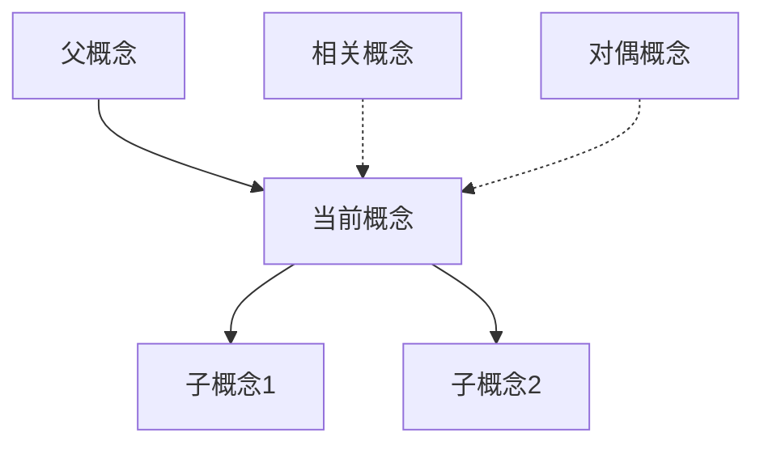

# 概念定义标准模板


> **版本**: 1.0
> **创建日期**: 2026-04-19
> **最后更新**: 2026-04-19

> 版本: v1.0
> 适用范围: FormalAlgorithm项目所有概念定义
> 最后更新: 2026-04-09

---

## 模板使用说明

本文档规定了FormalAlgorithm项目中所有概念定义的统一格式和标准。每个概念必须按照以下结构进行描述，以确保知识体系的一致性和完整性。

---

## 标准模板结构

```markdown
### [概念名称]

**优先级**: P0/P1/P2
**编码**: CONCEPT-XXX-YYY
**分类**: [所属分类]

#### 1. 形式化定义

**数学定义** (使用LaTeX格式):
```

$$[数学公式]$$

```

**定义说明**:
- 定义域: [变量的取值范围]
- 条件: [必要的前提条件]
- 结论: [定义的核心结论]

#### 2. 属性特征

##### 2.1 必要属性
概念必须满足的基本条件:
- [属性1]: [说明]
- [属性2]: [说明]
- ...

##### 2.2 充分属性
能够推出该概念的充分条件:
- [充分条件1]: [说明]
- [充分条件2]: [说明]
- ...

##### 2.3 等价刻画
该概念的不同等价表述:
- [等价表述1]: [说明]
- [等价表述2]: [说明]
- ...

#### 3. 关系网络



##### 3.1 父概念 (Generalization)

##### 3.2 子概念 (Specialization)

##### 3.3 相关概念 (Association)

##### 3.4 对偶概念 (Duality)

#### 4. 直观解释

##### 4.1 几何直观

[使用几何图形或空间关系进行解释]

##### 4.2 物理类比

[使用物理现象进行类比说明]

##### 4.3 计算视角

[从计算过程的角度进行解释]

#### 5. 形式证明

##### 5.1 核心定理

**定理 [编号]**: [定理名称]

**表述**:
$$[定理的数学表述]$$

**证明概要**:

**证明完成** ∎

##### 5.2 重要推论

- **推论1**: [推论内容]
- **推论2**: [推论内容]

##### 5.3 证明技巧

[该概念相关证明中常用的技巧和方法]

#### 6. 应用场景

##### 6.1 理论应用

##### 6.2 实际案例

- **案例1**: [案例名称]
  - 背景: [背景说明]
  - 应用: [如何应用该概念]
  - 结果: [应用效果]

##### 6.3 算法实现

```pseudocode
[伪代码或算法描述]
```

#### 7. 历史与发展

- **首次提出**: [时间、人物、文献]
- **重要发展**: [关键的发展节点]
- **现代形式**: [当前的定义形式]

#### 8. 参考资源

##### 8.1 经典文献

1. [作者]. ([年份]). *[标题]*. [出版物].

##### 8.2 推荐阅读

##### 8.3 相关链接

---

```

---

## 优先级定义

### P0 - 核心概念 (50个)
**标准**:
- 计算机科学和数学的基石概念
- 在多个领域有广泛应用
- 不掌握则无法理解后续内容

**示例**:
- 图灵机、复杂性类P/NP、λ演算、图、树、排序算法等

### P1 - 重要概念 (200个)
**标准**:
- 在特定领域具有核心地位
- 有重要的理论或实践价值
- 是P0概念的延伸和深化

**示例**:
- 动态规划、红黑树、交互式证明系统、依赖类型等

### P2 - 扩展概念 (550+个)
**标准**:
- 专门领域的进阶概念
- 特定应用场景下的优化和变体
- 前沿研究方向的概念

**示例**:
- 在线算法的竞争性分析变体、特定类型的图算法优化、高级类型系统特性等

---

## LaTeX数学符号规范

### 集合与逻辑
| 符号 | LaTeX | 含义 |
|------|-------|------|
| $\in$ | `\in` | 属于 |
| $\subseteq$ | `\subseteq` | 子集 |
| $\cup$ | `\cup` | 并集 |
| $\cap$ | `\cap` | 交集 |
| $\forall$ | `\forall` | 全称量词 |
| $\exists$ | `\exists` | 存在量词 |
| $\Rightarrow$ | `\Rightarrow` | 蕴含 |
| $\Leftrightarrow$ | `\Leftrightarrow` | 等价 |

### 计算复杂度
| 符号 | LaTeX | 含义 |
|------|-------|------|
| $O(f(n))$ | `O(f(n))` | 大O记号 |
| $\Omega(f(n))$ | `\Omega(f(n))` | 大Ω记号 |
| $\Theta(f(n))$ | `\Theta(f(n))` | 大Θ记号 |
| $\tilde{O}(f(n))$ | `\tilde{O}(f(n))` | 软O记号 |

### 类型理论
| 符号 | LaTeX | 含义 |
|------|-------|------|
| $\rightarrow$ | `\rightarrow` | 函数类型 |
| $\times$ | `\times` | 积类型 |
| $+$ | `+` | 和类型 |
| $\forall$ | `\forall` | 全称类型 |
| $\exists$ | `\exists` | 存在类型 |
| $\vdash$ | `\vdash` | 推出 |
| $\Gamma$ | `\Gamma` | 上下文 |

---

## 命名规范

### 概念编码体系

概念编码格式: `CONCEPT-[分类代码]-[序号]`

**分类代码**:
| 代码 | 分类 |
|------|------|
| ALG | 算法设计与分析 |
| DST | 数据结构家族 |
| CMP | 计算理论 |
| TYP | 类型与逻辑 |
| PRF | 证明技术 |
| APP | 应用领域 |

**示例**:
- `CONCEPT-ALG-001`: 算法设计与分析分类的第1个概念
- `CONCEPT-DST-150`: 数据结构家族分类的第150个概念

---

## 质量检查清单

在提交概念定义前，请确认以下事项:

- [ ] 概念名称准确、规范
- [ ] 形式化定义数学上严谨
- [ ] 所有属性都有明确说明
- [ ] 关系网络完整，无孤立概念
- [ ] 直观解释有助于理解
- [ ] 形式证明逻辑正确
- [ ] 应用场景真实可行
- [ ] 参考文献准确引用
- [ ] 使用正确的LaTeX格式
- [ ] 符合编码规范

---

## 版本历史

| 版本 | 日期 | 修改内容 | 作者 |
|------|------|----------|------|
| v1.0 | 2026-04-09 | 初始版本 | FormalAlgorithm Team |

---

*本模板遵循FormalAlgorithm项目文档标准*

---

## 参考文献

- [CLRS2009] T. H. Cormen et al. Introduction to Algorithms (3rd ed.). MIT Press, 2009.
- [Pierce2002] B. C. Pierce. Types and Programming Languages. MIT Press, 2002.

---

## 知识导航

- [返回目录](README.md)
