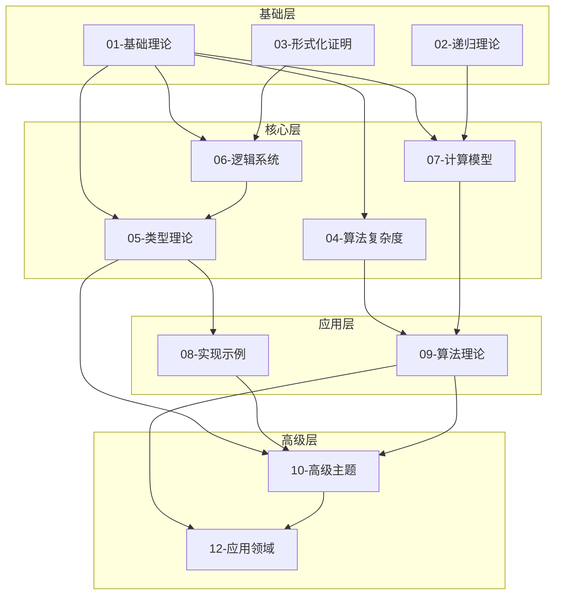
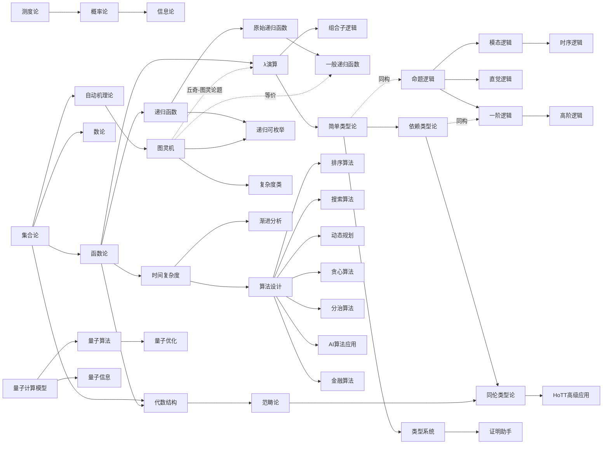
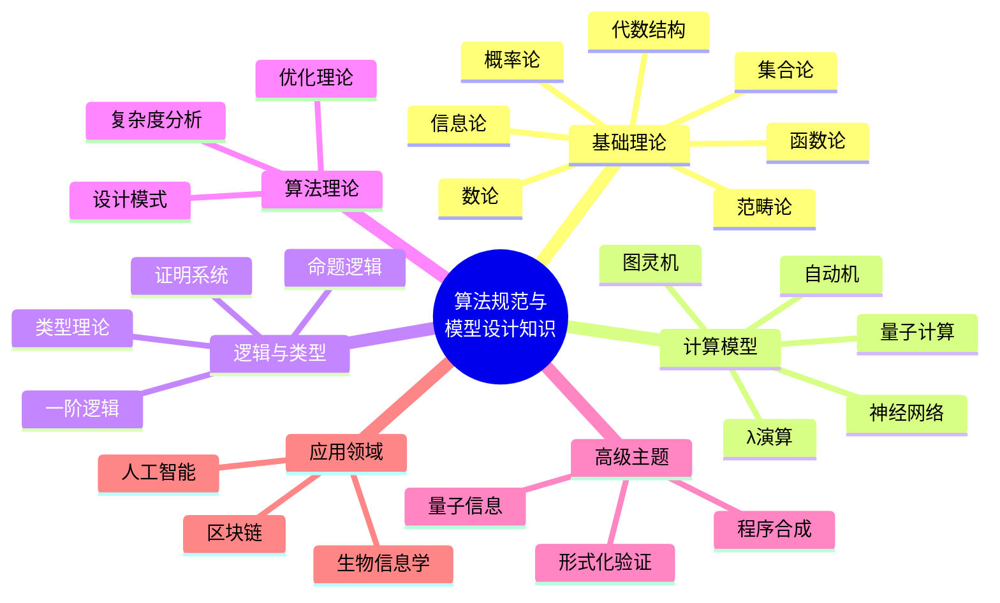
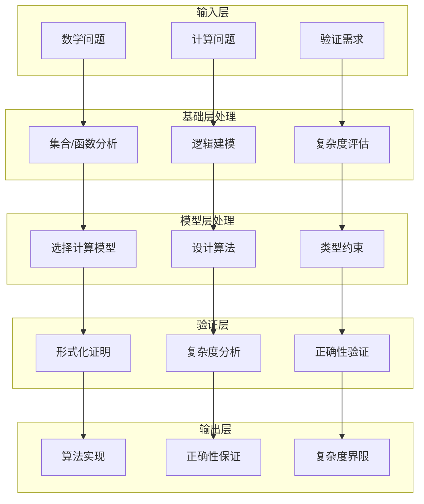

# 知识图谱 - 模块总览图

> **版本**: 1.0
> **创建日期**: 2026-04-19
> **最后更新**: 2026-04-19

## 模块关系总览

## 模块依赖详细图

## 核心模块能力映射

## 数据流图

## 模块交互矩阵

| 模块 | 01基础 | 02递归 | 03证明 | 04复杂度 | 05类型 | 06逻辑 | 07计算 | 09算法 | 10高级 |
|------|--------|--------|--------|----------|--------|--------|--------|--------|--------|
| 01基础 | - | 依赖 | 依赖 | 依赖 | 依赖 | 依赖 | 依赖 | 依赖 | 依赖 |
| 02递归 | - | - | - | - | - | - | 等价 | - | - |
| 03证明 | - | - | - | - | 同构 | 依赖 | - | - | 应用 |
| 04复杂度 | - | - | - | - | - | - | 依赖 | 依赖 | 扩展 |
| 05类型 | - | - | - | - | - | 同构 | - | - | 深化 |
| 06逻辑 | - | - | - | - | - | - | - | - | 扩展 |
| 07计算 | - | - | - | - | - | - | - | 基础 | 深化 |
| 09算法 | - | - | - | - | - | - | - | - | 深化 |
| 10高级 | - | - | - | - | - | - | - | - | - |

---

*此图表展示知识体系的整体架构和模块间关系*

---

## 参考文献

- [CLRS2009] T. H. Cormen et al. Introduction to Algorithms (3rd ed.). MIT Press, 2009.

---

## 知识导航

- [返回目录](README.md)
