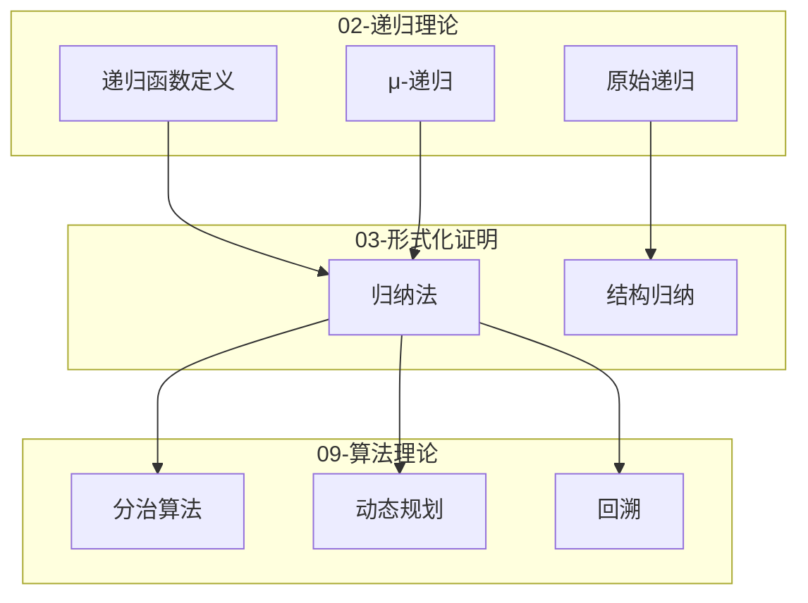
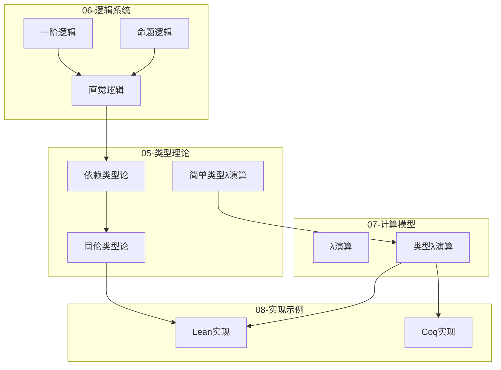
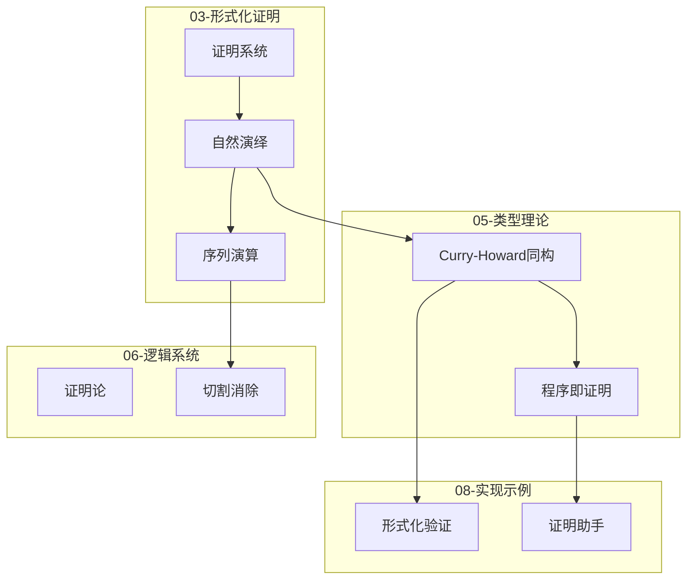
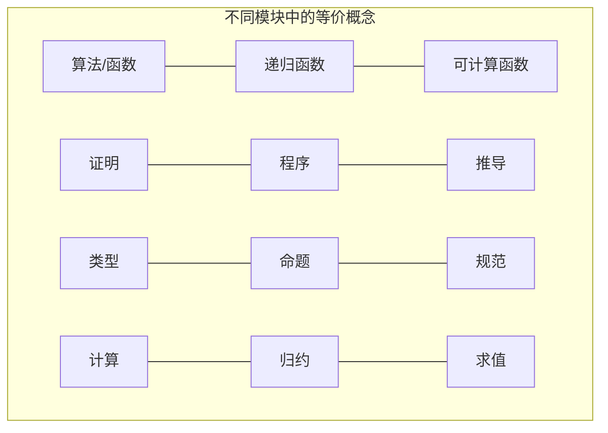
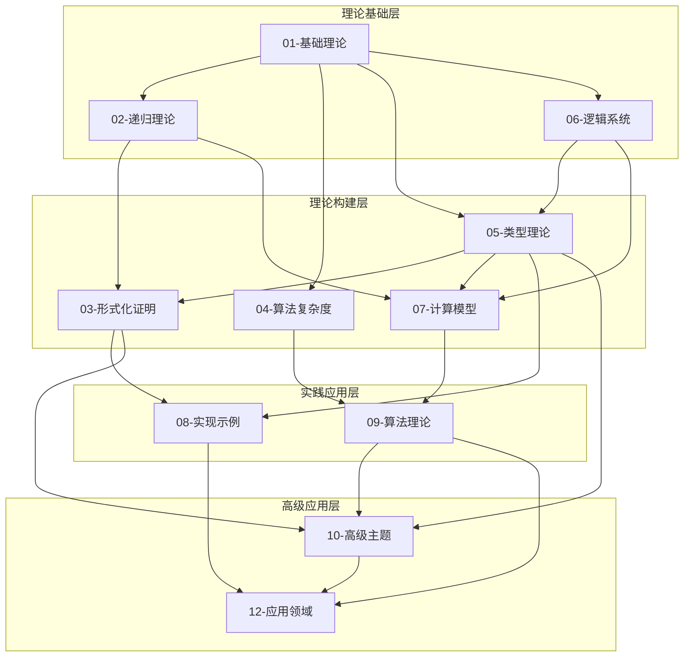
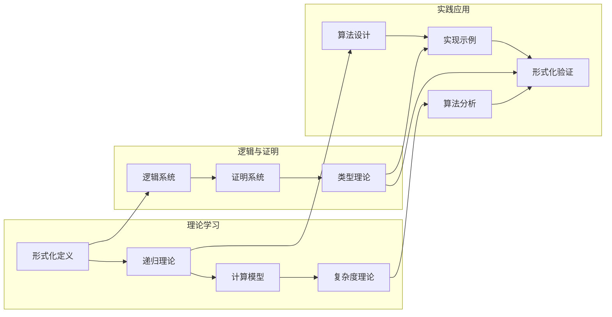

# 跨模块概念映射

> **创建日期**: 2025-04-08
> **目的**: 识别和映射跨模块的共享概念，建立统一的知识图谱视图

---

## 一、共享核心概念

### 1.1 递归 (Recursion)



**概念映射详情**:

| 模块 | 概念名称 | 定义位置 | 核心内容 |
|------|---------|---------|---------|
| 02-递归理论 | 递归函数 | 01-递归函数定义.md | 从自然数到自然数的可计算函数 |
| 02-递归理论 | 原始递归 | 02-原始递归函数.md | 通过基本函数和原始递归构造 |
| 02-递归理论 | μ-递归 | 04-μ-递归函数.md | 加入最小化算子的递归函数 |
| 03-形式化证明 | 归纳法 | 02-归纳法.md | 数学归纳、结构归纳、良基归纳 |
| 09-算法理论 | 分治 | 08-分治算法理论.md | 递归分解问题并合并结果 |
| 09-算法理论 | 动态规划 | 06-动态规划理论.md | 记忆化重叠子问题的递归 |
| 09-算法理论 | 回溯 | 09-回溯算法理论.md | 系统性搜索解空间的递归 |

### 1.2 类型 (Type)



**概念映射详情**:

| 模块 | 概念名称 | 定义位置 | 核心内容 |
|------|---------|---------|---------|
| 05-类型理论 | 简单类型 | 01-简单类型论.md | 基本类型和函数类型 |
| 05-类型理论 | 依赖类型 | 02-依赖类型论.md | 类型依赖于值的类型系统 |
| 05-类型理论 | 同伦类型论 | 03-同伦类型论.md | 类型作为空间、相等作为路径 |
| 06-逻辑系统 | 命题 | 01-命题逻辑.md | 可判断真假的陈述 |
| 07-计算模型 | 类型λ演算 | 02-λ演算.md §5 | 带类型的λ演算 |
| 08-实现示例 | 类型系统实现 | 各实现文档 | 在证明助手中的类型系统 |

### 1.3 证明 (Proof)



**概念映射详情**:

| 模块 | 概念名称 | 定义位置 | 核心内容 |
|------|---------|---------|---------|
| 03-形式化证明 | 证明系统 | 01-证明系统.md | 公理、规则、推导 |
| 03-形式化证明 | 自然演绎 | 01-证明系统.md §3 | 引入/消去规则 |
| 03-形式化证明 | 序列演算 | 01-证明系统.md §4 | sequent和切割规则 |
| 05-类型理论 | Curry-Howard同构 | 05-依赖类型系统与数理逻辑.md §5.2 | 命题即类型、证明即程序 |
| 06-逻辑系统 | 证明论 | 证明论.md | 证明的结构和性质 |
| 08-实现示例 | 形式化验证 | 04-形式化验证.md | 机器可检验的证明 |

---

## 二、概念别名映射

### 2.1 等价术语表

| 统一名称 | 01-基础理论 | 02-递归理论 | 03-形式化证明 | 05-类型理论 | 06-逻辑系统 | 07-计算模型 | 09-算法理论 |
|---------|------------|------------|--------------|-----------|-----------|-----------|-----------|
| 算法 | algorithm | 递归函数 | 构造性证明 | λ项 | - | 图灵机 | 算法 |
| 函数 | function | 递归函数 | - | 函数类型 | - | 可计算函数 | 过程 |
| 证明 | proof | - | 推导 | 程序/λ项 | 证明 | - | 正确性论证 |
| 类型 | - | - | - | type | 命题 | 类型 | 数据类型 |
| 计算 | computation | 求值 | 归约 | 归约 | - | 计算 | 执行 |
| 递归 | recursion | 递归 | 归纳 | 递归类型 | - | 递归 | 递归 |
| 复杂度 | - | 增长率 | - | - | - | - | 时间/空间复杂度 |
| 逻辑 | - | - | 推理系统 | 类型系统 | 逻辑 | - | - |

### 2.2 概念对应关系



---

## 三、跨模块依赖关系

### 3.1 核心依赖链

| 依赖链 | 路径 | 说明 |
|--------|------|------|
| 形式化 → 递归 → 可计算性 | 01 → 02 → 07 | 形式化定义到可计算性理论 |
| 逻辑 → 类型 → 证明助手 | 06 → 05 → 08 | 逻辑基础到形式化工具 |
| 复杂度 → 算法 → 应用 | 04 → 09 → 12 | 复杂度分析到实际应用 |
| 证明 → 验证 → 应用 | 03 → 08 → 12 | 形式化验证流程 |

### 3.2 依赖关系图



---

## 四、统一概念定义

### 4.1 核心跨域概念定义

| 统一概念 | 定义 | 相关模块 | 主要表述 |
|---------|------|---------|---------|
| **计算 (Computation)** | 按照明确定义的规则将输入转换为输出的过程 | 01, 02, 07 | 图灵机计算、递归函数求值、λ归约 |
| **算法 (Algorithm)** | 解决特定问题的有限、确定、有效的步骤序列 | 01, 09 | 伪代码、程序、图灵机描述 |
| **证明 (Proof)** | 从公理出发通过推理规则得到的有效论证 | 03, 05, 06 | 推导树、λ项、证明项 |
| **类型 (Type)** | 对值的分类，规定可取值的范围和可进行的操作 | 05, 07, 08 | 简单类型、依赖类型、命题 |
| **递归 (Recursion)** | 通过自身定义或引用自身的过程 | 02, 03, 09 | 递归函数、归纳证明、递归算法 |
| **复杂度 (Complexity)** | 计算资源（时间/空间）随输入规模的增长率 | 04, 09 | 渐进分析、复杂度类 |

### 4.2 概念一致性保证

```yaml
concept_alignment_rules:
  - rule: 算法概念一致性
    modules: [01, 02, 07, 09]
    unified_definition: 解决问题的明确步骤序列
    verification: 检查各模块定义是否等价于丘奇-图灵论题

  - rule: 证明概念一致性
    modules: [03, 05, 06, 08]
    unified_definition: 从公理到定理的有效推理序列
    verification: 检查Curry-Howard对应关系

  - rule: 类型概念一致性
    modules: [05, 07, 08]
    unified_definition: 对计算对象的分类和约束
    verification: 检查类型安全性和可归约性
```

---

## 五、跨模块学习路径

### 5.1 从理论到实践路径



### 5.2 交叉推荐学习顺序

**路径A: 可计算性路径**

1. 01-基础理论（形式化定义）
2. 02-递归理论（递归函数）
3. 07-计算模型（图灵机、λ演算）
4. 04-算法复杂度（可计算性限制）

**路径B: 形式化验证路径**

1. 06-逻辑系统（命题/一阶逻辑）
2. 05-类型理论（简单/依赖类型）
3. 03-形式化证明（证明系统）
4. 08-实现示例（Lean/Coq）

**路径C: 算法工程路径**

1. 01-基础理论（数学基础）
2. 04-算法复杂度（复杂度分析）
3. 09-算法理论（算法设计）
4. 08-实现示例（具体实现）

---

## 六、概念冲突解决

### 6.1 已知概念差异

| 概念 | 模块A定义 | 模块B定义 | 解决方案 | 统一表述 |
|------|----------|----------|---------|---------|
| 函数 | 01: 数学映射 | 02: 递归可计算 | 限制为可计算函数 | 可计算的全函数或部分函数 |
| 证明 | 03: 形式推导 | 05: λ项 | Curry-Howard同构 | 证明项/推导树 |
| 类型 | 05: 类型论 | 07: λ演算类型 | 统一为类型系统 | 带类型λ演算 |
| 算法 | 01: 步骤序列 | 07: 图灵机 | 丘奇-图灵论题 | 有效可计算过程 |

### 6.2 术语标准化

```yaml
terminology_standards:
  - term: 算法
    chinese: 算法
    english: Algorithm
    definition: 解决特定问题的有限、确定、有效的步骤序列
    scope: 全局

  - term: 证明
    chinese: 证明
    english: Proof
    definition: 从公理出发通过推理规则得到的有效论证
    scope: 03, 05, 06, 08

  - term: 递归
    chinese: 递归
    english: Recursion
    definition: 通过自身定义或引用自身的过程
    scope: 02, 03, 09

  - term: 类型
    chinese: 类型
    english: Type
    definition: 对计算对象的分类和约束
    scope: 05, 07, 08
```

---

**文档版本**: 1.0
**最后更新**: 2025-04-08
**状态**: 跨模块概念映射完成
