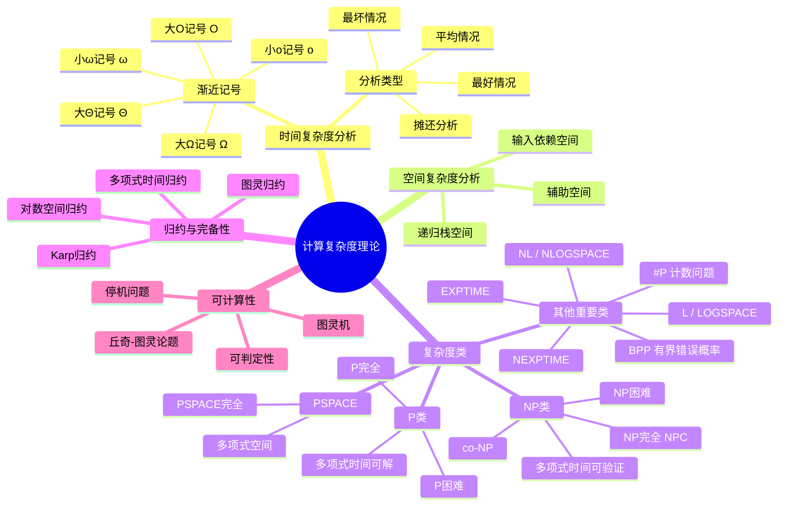

# 复杂度理论思维导图


> **版本**: 1.0
> **创建日期**: 2026-04-19
> **最后更新**: 2026-04-19

## ASCII 艺术版

```
                  ┌─────────────────────────┐
                  │      计算复杂度理论      │
                  │  Computational         │
                  │   Complexity Theory    │
                  └───────────┬─────────────┘
                              │
        ┌─────────────────────┼─────────────────────┐
        │                     │                     │
        ▼                     ▼                     ▼
┌───────────────┐    ┌────────────────┐    ┌───────────────┐
│   时间复杂度   │    │   空间复杂度    │    │   复杂度类     │
│   Time        │    │    Space       │    │  Complexity   │
│  Complexity   │    │  Complexity    │    │    Classes    │
└───────┬───────┘    └────────┬───────┘    └───────┬───────┘
        │                     │                    │
   ┌────┴────┐           ┌────┴────┐         ┌────┴────┐
   │         │           │         │         │         │
   ▼         ▼           ▼         ▼         ▼         ▼
┌──────┐  ┌──────┐   ┌──────┐  ┌──────┐  ┌──────┐  ┌──────┐
│渐近  │  │实际  │   │辅助  │  │递归  │  │P类   │  │NP类  │
│分析  │  │分析  │   │空间  │  │栈   │  │      │  │      │
└──┬───┘  └──┬───┘   └──┬───┘  └──┬───┘  └──┬───┘  └──┬───┘
   │         │          │         │         │         │
   ▼         ▼          ▼         ▼         ▼         ▼
┌────┐   ┌────┐     ┌────┐   ┌────┐    ┌────┐   ┌────┐
│Big-│   │最好│     │输入│   │调用│    │P完全│   │NP完全│
│O   │   │情况│     │依赖│   │深度│    │     │   │      │
├────┤   ├────┤     └────┘   └────┘    ├────┤   ├────┤
│Big-│   │平均│                          │P困难│   │NP困难│
│Ω   │   │情况│                          │     │   │      │
├────┤   ├────┤                          └────┘   ├────┤
│Big-│   │最坏│                                    │co-NP│
│Θ   │   │情况│                                    │     │
├────┤   └────┘                                    └────┘
│little│
│o    │
└────┘

        ┌─────────────────────┬─────────────────────┐
        │                     │                     │
        ▼                     ▼                     ▼
┌───────────────┐    ┌────────────────┐    ┌───────────────┐
│   可计算性    │    │   归约与完备性  │    │   其他重要类   │
│Computability  │    │  Reduction &   │    │  Other Classes│
└───────┬───────┘    │  Completeness  │    └───────┬───────┘
        │            └────────┬───────┘            │
   ┌────┴────┐           ┌────┴────┐          ┌────┴────┐
   │         │           │         │          │         │
   ▼         ▼           ▼         ▼          ▼         ▼
┌──────┐  ┌──────┐   ┌──────┐  ┌──────┐  ┌──────┐  ┌──────┐
│图灵机│  │停机  │   │多项式│  │对数  │  │PSPACE│  │EXPTIME│
│模型  │  │问题  │   │时间  │  │空间  │  │      │  │       │
└──────┘  └──────┘   │归约  │  │归约  │  ├──────┤  ├───────┤
                     └──────┘  └──────┘  │L     │  │NL     │
                                          │(LOG) │  │       │
                                          ├──────┤  ├───────┤
                                          │BPP   │  │#P     │
                                          │(随机)│  │       │
                                          └──────┘  └───────┘
```

---

## Mermaid 版



---

## 复杂度类关系图

```
                    ┌─────────────────┐
                    │   EXPTIME       │
                    │  (指数时间)      │
                    └────────┬────────┘
                             │
                    ┌────────▼────────┐
                    │    PSPACE       │
                    │  (多项式空间)    │
                    └────────┬────────┘
                             │
         ┌───────────────────┼───────────────────┐
         │                   │                   │
         ▼                   ▼                   ▼
┌─────────────────┐  ┌─────────────────┐  ┌─────────────────┐
│    NP           │  │   co-NP         │  │    PSPACE-完全   │
│  (验证类)        │  │                 │  │                 │
└────────┬────────┘  └────────┬────────┘  └─────────────────┘
         │                   │
         │    ┌──────────────┘
         │    │
         ▼    ▼
┌─────────────────┐
│    NP ∩ co-NP   │
│                 │
└────────┬────────┘
         │
         ▼
┌─────────────────┐
│    P            │
│  (多项式时间)    │
└────────┬────────┘
         │
         ▼
┌─────────────────┐
│    NC           │
│  (高效并行)      │
└────────┬────────┘
         │
         ▼
┌─────────────────┐
│    NL           │
│  (非确定对数空间) │
└────────┬────────┘
         │
         ▼
┌─────────────────┐
│    L            │
│  (确定对数空间)  │
└─────────────────┘
```

---

## 复杂度类包含关系

```
L ⊆ NL ⊆ P ⊆ NP ⊆ PSPACE ⊆ EXPTIME ⊆ NEXPTIME
│   │    │    │     │        │
│   │    │    │     │        └── 2^O(n^k)
│   │    │    │     └────────── O(n^k) space
│   │    │    └──────────────── O(n^k) verify
│   │    └───────────────────── O(n^k) time
│   └────────────────────────── O(log n) space, nondet
└────────────────────────────── O(log n) space
```

---

## 重要问题分类

| 类别 | 定义 | 典型问题 | 状态 |
|------|------|---------|------|
| **P** | 确定性图灵机在多项式时间可解 | 排序、最短路径、最小生成树 | 已知 |
| **NP** | 非确定性图灵机在多项式时间可解 / 多项式时间可验证 | 3-SAT、哈密顿回路、图着色 | 研究ing |
| **NP-完全** | 属于NP且所有NP问题可归约到它 | 3-SAT、子集和、旅行商 | 研究ing |
| **NP-困难** | 所有NP问题可归约到它(不一定在NP中) | 停机问题、围棋 | 研究ing |
| **PSPACE-完全** | PSPACE中最难的问题 | QSAT、博弈问题 | 已知 |

---

## P vs NP 问题

```
┌─────────────────────────────────────────────────────────────┐
│                        P vs NP 问题                          │
│                  (千禧年大奖难题之一)                          │
└─────────────────────────────────────────────────────────────┘
                              │
            ┌─────────────────┼─────────────────┐
            │                 │                 │
            ▼                 ▼                 ▼
    ┌───────────┐     ┌───────────┐     ┌───────────┐
    │   P = NP   │     │  P ≠ NP   │     │  不可判定  │
    │            │     │           │     │           │
    │  如果为真  │     │  如果为真  │     │  如果为真  │
    ├───────────┤     ├───────────┤     ├───────────┤
    │• 所有验证  │     │• NP完全问题│     │• 无法用现有│
    │  容易的问  │     │  没有高效  │     │  数学工具 │
    │  题都有高  │     │  算法     │     │  证明     │
    │  效解法   │     │• 密码学安  │     │• 可能需要 │
    │• 密码学崩  │     │  全性有保  │     │  新的数学 │
    │  溃       │     │  障       │     │  框架     │
    │• 最优化问  │     │• 某些问题  │     │           │
    │  题易解   │     │  本质困难  │     │           │
    └───────────┘     └───────────┘     └───────────┘
```

---

## 归约关系图

```
              ┌──────────────────┐
              │    停机问题       │
              │ Halting Problem  │
              │   (不可判定)      │
              └────────┬─────────┘
                       │
                       ▼ 图灵归约
              ┌──────────────────┐
              │   Post对应问题    │
              └────────┬─────────┘
                       │
        ┌──────────────┼──────────────┐
        │              │              │
        ▼              ▼              ▼
┌──────────────┐ ┌──────────┐ ┌──────────────┐
│  矩阵 mortality│ │  博弈问题  │ │  丢番图方程  │
│  问题        │ │         │ │  可解性     │
└──────────────┘ └──────────┘ └──────────────┘

              ┌──────────────────┐
              │     3-SAT        │
              │  (NP完全问题)     │
              └────────┬─────────┘
                       │
        ┌──────────────┼──────────────┬──────────────┐
        │              │              │              │
        ▼              ▼              ▼              ▼
┌──────────────┐ ┌──────────┐ ┌──────────────┐ ┌──────────┐
│   顶点覆盖    │ │  团问题   │ │   哈密顿回路  │ │ 子集和   │
│  Vertex Cover│ │   Clique │ │ Hamiltonian  │ │ Subset  │
│              │ │          │ │    Cycle     │ │  Sum    │
└──────────────┘ └──────────┘ └──────────────┘ └──────────┘
        │              │              │              │
        └──────────────┴──────────────┴──────────────┘
                              │
                              ▼
                       ┌──────────────┐
                       │   旅行商问题  │
                       │     TSP      │
                       │  (NP困难)     │
                       └──────────────┘
```

---

## 分析流程决策树

```
需要分析什么?
    │
    ├── 算法运行时间?
    │       │
    │       ├── 是递归算法? → 用主定理/递归树
    │       │
    │       └── 是迭代算法? → 统计基本操作
    │
    ├── 算法占用空间?
    │       │
    │       ├── 有递归? → 考虑调用栈
    │       │
    │       └── 无递归? → 考虑辅助空间
    │
    └── 问题属于哪个复杂度类?
            │
            ├── 有高效算法? → 检查是否属于P
            │
            ├── 解可高效验证? → 检查是否属于NP
            │
            └── 需要指数时间? → 检查是否NP困难
```

---

*本思维导图涵盖了计算复杂度理论的核心概念，深入理解这些概念对于算法设计和分析至关重要*

---

## 参考文献

- [CLRS2009] T. H. Cormen et al. Introduction to Algorithms (3rd ed.). MIT Press, 2009.
- [Knuth1997] D. E. Knuth. The Art of Computer Programming, Vol. 1. Addison-Wesley, 1997.

---

## 知识导航

- [返回目录](README.md)
