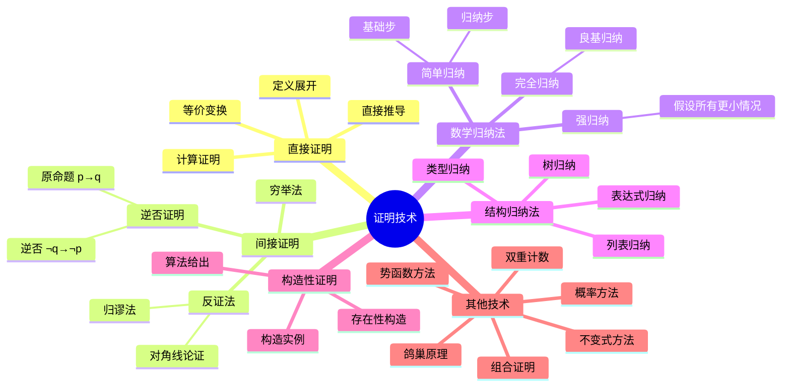

# 证明技术思维导图


> **版本**: 1.0
> **创建日期**: 2026-04-19
> **最后更新**: 2026-04-19

## ASCII 艺术版

```
                      ┌─────────────────────┐
                      │      证明技术        │
                      │  Proof Techniques   │
                      └──────────┬──────────┘
                                   │
        ┌──────────────────────────┼──────────────────────────┐
        │                          │                          │
        ▼                          ▼                          ▼
┌───────────────┐        ┌─────────────────┐        ┌───────────────┐
│   直接证明     │        │   间接证明       │        │   构造性证明   │
│  Direct Proof │        │ Indirect Proof  │        │ Constructive  │
└───────┬───────┘        └────────┬────────┘        └───────┬───────┘
        │                         │                         │
   ┌────┴────┐              ┌─────┴─────┐             ┌─────┴─────┐
   │         │              │           │             │           │
   ▼         ▼              ▼           ▼             ▼           ▼
┌──────┐  ┌──────┐     ┌──────┐   ┌──────┐      ┌──────┐   ┌──────┐
│直接  │  │定义  │     │反证法│   │逆否  │      │构造  │   │计算  │
│推导  │  │展开  │     │     │   │证明  │      │实例  │   │推导  │
└──────┘  └──────┘     └──┬───┘   └──────┘      └──────┘   └──────┘
                          │
              ┌───────────┴───────────┐
              │                       │
              ▼                       ▼
        ┌──────────┐           ┌──────────┐
        │ 归谬法   │           │对角线   │
        │ (矛盾)   │           │论证法   │
        └──────────┘           └──────────┘

        ┌──────────────────────┬──────────────────────┐
        │                      │                      │
        ▼                      ▼                      ▼
┌───────────────┐    ┌─────────────────┐    ┌───────────────┐
│   数学归纳法   │    │   结构归纳法     │    │   其他技术     │
│   Induction   │    │  Structural     │    │  Others       │
└───────┬───────┘    │   Induction     │    └───────┬───────┘
        │            └────────┬────────┘            │
   ┌────┴────┐           ┌─────┴─────┐        ┌─────┴─────┐
   │         │           │           │        │           │
   ▼         ▼           ▼           ▼        ▼           ▼
┌──────┐  ┌──────┐   ┌──────┐   ┌──────┐  ┌──────┐   ┌──────┐
│简单  │  │完全  │   │树   │   │表达式│   │鸽巢  │   │双重  │
│归纳  │  │归纳  │   │归纳 │   │归纳  │   │原理  │   │计数  │
└──────┘  └──────┘   └──────┘   └──────┘  └──────┘   └──────┘
┌──────┐  ┌──────┐   ┌──────┐   ┌──────┐  ┌──────┐   ┌──────┐
│强归纳│  │结构  │   │列表 │   │类型  │   │无穷  │   │概率  │
│     │  │归纳  │   │归纳 │   │归纳  │   │降阶  │   │方法  │
└──────┘  └──────┘   └──────┘   └──────┘  └──────┘   └──────┘
```

---

## Mermaid 版



---

## 证明方法选择指南

```
要证明什么类型的命题?
    │
    ├── "对所有n成立" 或 "递归结构"?
    │       │
    │       ├── 自然数性质? → 数学归纳法
    │       │
    │       └── 数据结构性质? → 结构归纳法
    │
    ├── "存在..." 或 "可以构造"?
    │       │
    │       ├── 能给出具体构造? → 构造性证明
    │       │
    │       └── 仅证明存在? → 非构造性证明/反证法
    │
    ├── "如果...那么..." (蕴含)?
    │       │
    │       ├── 前提信息充分? → 直接证明
    │       │
    │       └── 结论更易处理? → 逆否证明
    │
    └── "不是..." 或 "不可能..."?
            │
            └── 假设成立导出矛盾 → 反证法
```

---

## 归纳法详解

```
┌─────────────────────────────────────────────────────────────┐
│                      归纳法体系                              │
└─────────────────────────────────────────────────────────────┘

                    ┌──────────────────┐
                    │     归纳法        │
                    │   Induction      │
                    └────────┬─────────┘
                             │
        ┌────────────────────┼────────────────────┐
        │                    │                    │
        ▼                    ▼                    ▼
┌───────────────┐    ┌───────────────┐    ┌───────────────┐
│  数学归纳法    │    │  结构归纳法    │    │  良基归纳法    │
│ Mathematical │    │  Structural   │    │  Well-founded │
│  Induction   │    │  Induction    │    │  Induction    │
└───────┬───────┘    └───────┬───────┘    └───────┬───────┘
        │                    │                    │
   ┌────┴────┐          ┌────┴────┐          ┌────┴────┐
   │         │          │         │          │         │
   ▼         ▼          ▼         ▼          ▼         ▼
┌──────┐  ┌──────┐  ┌──────┐  ┌──────┐  ┌──────┐  ┌──────┐
│简单  │  │强归纳│  │树   │  │列表 │  │字典 │  │偏序 │
│归纳  │  │     │  │归纳 │  │归纳 │  │序  │  │集  │
└──────┘  └──────┘  └──────┘  └──────┘  └──────┘  └──────┘

数学归纳法模板:
─────────────────────────────────────────────────────────────
要证明: ∀n ≥ n₀, P(n)

基础步: 证明 P(n₀) 成立
归纳假设: 假设对于某个 k ≥ n₀, P(k) 成立
归纳步: 证明 P(k+1) 成立
结论: 根据归纳原理, ∀n ≥ n₀, P(n)

强归纳法模板:
─────────────────────────────────────────────────────────────
要证明: ∀n ≥ n₀, P(n)

基础步: 证明 P(n₀) 成立
归纳假设: 假设对于所有 n₀ ≤ m ≤ k, P(m) 成立
归纳步: 证明 P(k+1) 成立
结论: 根据强归纳原理, ∀n ≥ n₀, P(n)

结构归纳法模板:
─────────────────────────────────────────────────────────────
要证明: 对所有结构 S, P(S) 成立

基础步: 对基本结构(叶节点/空列表)证明 P 成立
归纳假设: 假设对子结构 S', P(S') 成立
归纳步: 证明对由子结构构造的结构 S, P(S) 成立
结论: 根据结构归纳原理, 对所有结构 P 成立
```

---

## 反证法结构

```
┌─────────────────────────────────────────────────────────────┐
│                      反证法结构                              │
└─────────────────────────────────────────────────────────────┘

原命题: P (要证明P为真)

┌───────────────────────────────────────────────────────────┐
│ 1. 假设 ¬P (假设P不成立)                                    │
├───────────────────────────────────────────────────────────┤
│ 2. 从 ¬P 出发, 通过逻辑推导                                 │
│    得到某个命题 Q                                          │
├───────────────────────────────────────────────────────────┤
│ 3. 但已知 Q 为假 (或 ¬Q 为真)                               │
│    这产生了矛盾: Q ∧ ¬Q                                    │
├───────────────────────────────────────────────────────────┤
│ 4. 因此假设 ¬P 不成立                                      │
│    故 P 为真                                                │
└───────────────────────────────────────────────────────────┘

经典例子: √2 是无理数的证明
─────────────────────────────────────────────────────────────
假设: √2 是有理数
    ↓
√2 = p/q, 其中 p,q 互质, q≠0
    ↓
2 = p²/q²  →  p² = 2q²
    ↓
p² 是偶数  →  p 是偶数 (设 p=2k)
    ↓
(2k)² = 2q²  →  4k² = 2q²  →  q² = 2k²
    ↓
q² 是偶数  →  q 是偶数
    ↓
p,q 都是偶数, 与 "p,q 互质" 矛盾!
    ↓
故 √2 是无理数 ∎
```

---

## 证明技术速查表

| 技术 | 适用场景 | 关键步骤 | 典型例子 |
|------|---------|---------|---------|
| **直接证明** | p→q 形式 | 假设p，推导q | 证明偶数平方是偶数 |
| **反证法** | 否定性命题 | 假设¬P，导出矛盾 | √2无理数、素数无穷 |
| **逆否证明** | p→q 但¬q更易处理 | 证明¬q→¬p | 若n²偶则n偶 |
| **数学归纳** | 自然数性质 | 基础步+归纳步 | 求和公式、不等式 |
| **结构归纳** | 递归数据结构 | 基本情况+归纳情况 | 树的性质、类型安全 |
| **构造证明** | 存在性命题 | 给出具体构造 | 证明存在素数对 |
| **对角线法** | 证明不可数 | 构造不在列表中的元素 | 实数不可数 |
| **鸽巢原理** | 存在性、必然性 | n+1个物体放入n个盒子 | 生日问题 |
| **双重计数** | 组合恒等式 | 两种方法计数同一对象 | 组合数恒等式 |
| **不变式法** | 算法正确性 | 找出循环不变式 | 欧几里得算法 |

---

## 证明组织模板

```
定理: [陈述要证明的命题]

证明:
[选择证明方法]

情况1: [如果分情况]
    [证明步骤]
    ∎

情况2: [如果分情况]
    [证明步骤]
    ∎

或者使用归纳法:
─────────────────────────────────────────────────────────────
我们对 n 进行归纳证明。

基础情况 (n = 0):
    [证明 P(0)]

归纳假设:
    假设 P(k) 对某个 k ≥ 0 成立。

归纳步骤:
    [证明 P(k+1)]

    由归纳假设...
    因此 P(k+1) 成立。

根据数学归纳法原理, P(n) 对所有 n ≥ 0 成立。∎
```

---

## 常见证明模式

```
算法正确性证明:
─────────────────────────────────────────────────────────────
1. 终止性证明: 证明算法必在有限步内结束
   - 使用势函数或良基关系

2. 部分正确性证明: 证明若算法终止则结果正确
   - 使用循环不变式
   - 初始化→保持→终止

复杂度下界证明:
─────────────────────────────────────────────────────────────
1. 决策树模型
2. 对手论证
3. 归约到已知下界

类型安全证明:
─────────────────────────────────────────────────────────────
1. 进展性 (Progress): 良类型项要么是值，要么可继续求值
2. 保持性 (Preservation): 求值保持类型
   (Subject Reduction)
```

---

*本思维导图涵盖了数学和计算机科学中常用的证明技术，是进行形式化证明的重要参考*

---

## 参考文献

- [CLRS2009] T. H. Cormen et al. Introduction to Algorithms (3rd ed.). MIT Press, 2009.
- [Knuth1997] D. E. Knuth. The Art of Computer Programming, Vol. 1. Addison-Wesley, 1997.

---

## 知识导航

- [返回目录](README.md)
