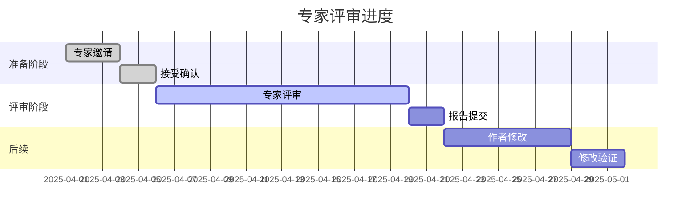

# 专家评审机制

> **版本**: 1.0
> **创建日期**: 2025-04-08
> **状态**: ✅ 已生效
> **适用范围**: 核心算法、重要定理及里程碑文档的外部专家验证

---

## 📋 机制说明

专家评审机制旨在引入外部权威验证，确保项目在学术和技术上的权威性与准确性。本机制建立了完整的专家库管理、评审流程和认可体系。

**The expert review mechanism aims to introduce external authoritative validation to ensure academic and technical authority.**

---

## 1. 专家库建设

### 1.1 专家领域分类

#### 一级领域

| 领域代码 | 领域名称 | 说明 |
|----------|----------|------|
| ALG | 算法设计与分析 | 经典算法、高级算法、优化算法 |
| DS | 数据结构 | 基础数据结构、高级数据结构 |
| CC | 计算复杂性 | 复杂性理论、可计算性理论 |
| PL | 编程语言理论 | 类型理论、形式语义 |
| LOG | 逻辑与证明 | 数理逻辑、自动推理 |
| AI | 人工智能算法 | 机器学习、深度学习理论 |
| CRYPT | 密码学 | 算法密码学、安全证明 |
| DIST | 分布式算法 | 分布式一致性、共识算法 |

#### 二级细分领域

```yaml
ALG:
  - ALG-SORT: 排序算法
  - ALG-GRAPH: 图算法
  - ALG-DP: 动态规划
  - ALG-GREEDY: 贪心算法
  - ALG-APPROX: 近似算法
  - ALG-RANDOM: 随机算法
  - ALG-PARALLEL: 并行算法

DS:
  - DS-TREE: 树结构
  - DS-HEAP: 堆结构
  - DS-HASH: 哈希表
  - DS-ADV: 高级数据结构

CC:
  - CC-CLASS: 复杂性类
  - CC-LOWER: 下界理论
  - CC-PCP: 概率可检验证明

PL:
  - PL-TYPE: 类型理论
  - PL-LAMBDA: λ演算
  - PL-SEM: 形式语义
```

### 1.2 专家信息结构

```yaml
# 专家信息模板
expert_id: "EX-2025-001"
profile:
  name:
    zh: "专家中文名"
    en: "Expert English Name"
  affiliation:
    institution: "机构名称"
    department: "院系"
    country: "国家"
  title: "教授/研究员/博士"

contact:
  email: "expert@institution.edu"
  orcid: "0000-0000-0000-0000"
  homepage: "https://..."

expertise:
  primary: ["ALG", "CC"]           # 主要领域
  secondary: ["PL", "LOG"]         # 次要领域
  specific: ["ALG-GRAPH", "CC-CLASS"]  # 具体专长

qualifications:
  h_index: 45                      # h指数
  publications: 120                # 发表论文数
  citations: 8000                  # 引用数
  key_papers:
    - title: "重要论文1"
      venue: "顶级会议/期刊"
      year: 2020
    - title: "重要论文2"
      venue: "顶级会议/期刊"
      year: 2018

experience:
  phd_institution: "博士毕业院校"
  phd_year: 2010
  positions:
    - role: "现任职位"
      institution: "机构"
      since: 2015
  awards:
    - name: "奖项名称"
      year: 2020

review_history:
  total_reviews: 15                # 总评审次数
  last_review: "2025-03-15"        # 上次评审
  avg_response_days: 10            # 平均响应天数

availability:
  status: "available"              # available/busy/unavailable
  max_reviews_per_month: 2         # 每月最大评审数
  preferred_notice_days: 14        # 期望提前通知天数

notes: "其他备注信息"
added_date: "2025-01-15"
last_updated: "2025-04-01"
```

## 1.3 专家库管理流程

### 1.3 专家库管理流程

```
┌─────────────────────────────────────────────────────────────────┐
│                     专家库管理流程                               │
└─────────────────────────────────────────────────────────────────┘

     ┌──────────┐
     │ 专家推荐 │◀──────────────────────────────┐
     │ (多渠道) │                                 │
     └────┬─────┘                                 │
          │                                       │
          ▼                                       │
     ┌──────────┐     ┌──────────┐     ┌──────────┤
     │ 资格评估 │────▶│ 专家邀请 │────▶│ 信息建档 │
     │          │     │          │     │          │
     └────┬─────┘     └────┬─────┘     └────┬─────┘
          │                │                │
          ▼                ▼                ▼
     ┌──────────┐     ┌──────────┐     ┌──────────┐
     │ 入库管理 │────▶│ 定期更新 │────▶│ 贡献追踪 │
     │          │     │          │     │          │
     └──────────┘     └──────────┘     └────┬─────┘
                                            │
                                            ▼
                                     ┌──────────┐
                                     │ 认可致谢 │
                                     │ (返回)   │
                                     └──────────┘
```

#### 专家入库标准

| 条件类型 | 具体要求 | 权重 |
|----------|----------|------|
| 学术影响力 | h-index ≥ 20 (算法领域) | 必需 |
| 专业背景 | 博士学位 + 5年相关经验 | 必需 |
| 发表记录 | 顶级会议/期刊发表 ≥ 10篇 | 必需 |
| 项目匹配 | 专长与项目领域匹配 | 重要 |
| 评审经验 | 有期刊/会议评审经验 | 加分 |

#### 专家来源渠道

1. **学术推荐**: 现有专家、项目成员推荐
2. **文献检索**: 从引用文献中识别领域专家
3. **会议接触**: 在学术会议上建立联系
4. **机构合作**: 与知名研究机构合作
5. **公开招募**: 通过项目网站公开招募

---

## 2. 评审流程

### 2.1 评审触发条件

```markdown
## 专家评审触发条件

### 自动触发 (满足任一即触发)
- [ ] 核心算法文档首次发布
- [ ] 重要定理的原创性证明
- [ ] 项目里程碑节点文档
- [ ] 质量评分 ≥ 8.5 的待发布文档

### 申请触发 (需审批)
- [ ] 作者申请专家验证
- [ ] 同行评议推荐专家验证
- [ ] 争议性内容需要仲裁

### 定期触发
- [ ] 年度核心内容复审
- [ ] 重大更新后的验证
```

### 2.2 评审流程图

```
┌─────────────────────────────────────────────────────────────────┐
│                     专家评审完整流程                             │
└─────────────────────────────────────────────────────────────────┘

  ┌──────────┐
  │ 确定评审 │
  │ 需求     │
  └────┬─────┘
       │
       ▼
  ┌──────────┐     ┌──────────┐     ┌──────────┐
  │ 选择     │────▶│ 发送     │────▶│ 专家     │
  │ 专家     │     │ 邀请     │     │ 评审     │
  └──────────┘     └──────────┘     └────┬─────┘
                                         │
       ┌─────────────────────────────────┘
       ▼
  ┌──────────┐     ┌──────────┐     ┌──────────┐
  │ 评审报告 │────▶│ 作者修改 │────▶│ 修改     │
  │ 提交     │     │          │     │ 验证     │
  └──────────┘     └──────────┘     └────┬─────┘
                                         │
       ┌─────────────────────────────────┘
       ▼
  ┌──────────┐     ┌──────────┐
  │ 最终确认 │────▶│ 致谢与   │
  │          │     │ 归档     │
  └──────────┘     └──────────┘
```

### 2.3 专家邀请流程

#### 邀请信模板

```markdown
**主题**: 邀请您评审【算法规范与模型设计知识体系】项目文档

尊敬的 [教授/博士] [姓名]:

您好！

我们诚挚地邀请您作为外部专家评审我们项目的重要文档。

## 关于项目

【算法规范与模型设计知识体系】是一个开源的算法理论文档项目，
旨在建立系统、严谨的算法知识库。项目地址: [URL]

## 评审邀请

- **评审文档**: [文档标题]
- **文档领域**: [领域分类]
- **评审重点**: [技术准确性/形式化程度/等]

## 时间承诺

- **评审周期**: [建议14-21天]
- **预计工作量**: 2-3小时

## 我们提供

- 项目完整的背景资料
- 清晰的评审指南
- 评审报告模板
- [适当的致谢/认证]

## 如何参与

如果您愿意接受邀请，请:
1. 回复确认接受
2. 签署简短的保密协议
3. 我们将发送评审材料

期待您的宝贵意见！

此致
敬礼

[项目联系人]
[日期]
```

### 邀请记录

#### 邀请记录

```markdown
## 专家邀请记录

**文档**: [文档标题]
**发送日期**: [日期]
**期望完成日期**: [日期]

### 邀请列表

| 序号 | 专家姓名 | 领域 | 邀请日期 | 状态 | 回复日期 | 备注 |
|------|----------|------|----------|------|----------|------|
| 1 | [姓名] | [领域] | [日期] | ☐待回复 ☐接受 ☐拒绝 | [日期] | |
| 2 | [姓名] | [领域] | [日期] | ☐待回复 ☐接受 ☐拒绝 | [日期] | |
| 3 | [姓名] | [领域] | [日期] | ☐待回复 ☐接受 ☐拒绝 | [日期] | |

### 拒绝原因统计
- 时间冲突: _人
- 领域不完全匹配: _人
- 其他: _人

### 接受专家
- 专家1: [姓名] - [确认日期]
- 专家2: [姓名] - [确认日期]
```

### 2.4 文档分配机制

#### 分配策略

```python
# 专家分配算法示意

def assign_experts(document, expert_pool):
    """
    为文档分配专家评审
    """
    requirements = {
        'primary_field': document.primary_field,
        'secondary_fields': document.secondary_fields,
        'complexity': document.complexity,  # simple/moderate/complex
        'urgency': document.urgency  # normal/urgent
    }

    candidates = []
    for expert in expert_pool:
        # 领域匹配
        field_match = expert.expertise.primary == requirements['primary_field']

        # 可用性检查
        availability = expert.availability.status == 'available'
        workload_ok = expert.review_history.current_month < expert.availability.max_reviews_per_month

        # 计算匹配度
        match_score = calculate_match_score(expert, requirements)

        if field_match and availability and workload_ok:
            candidates.append((expert, match_score))

    # 按匹配度排序，选择前2-3名
    candidates.sort(key=lambda x: x[1], reverse=True)
    selected = candidates[:3]

    return selected
```

## 分配记录

### 分配记录

#### 分配记录

```markdown
## 评审分配记录

**文档**: [标题]
**分配日期**: [日期]

### 主审专家
- **姓名**:
- **领域匹配度**: %
- **分配理由**:
- **截止日期**:

### 副审专家 (如需要)
- **姓名**:
- **领域匹配度**: %
- **分配理由**:
- **截止日期**:
```

### 2.5 评审周期管理

#### 标准时间线

| 阶段 | 时长 | 说明 |
|------|------|------|
| 专家邀请 | 3-5天 | 考虑时区差异 |
| 接受确认 | 2-3天 | 签署保密协议 |
| 材料发送 | 1天 | 发送评审包 |
| 专家评审 | 14-21天 | 标准评审周期 |
| 报告提交 | - | 专家提交评审意见 |
| 汇总反馈 | 2天 | 整理评审意见 |
| 作者修改 | 7-14天 | 依问题复杂度 |
| 修改验证 | 3-5天 | 专家验证修改 |

#### 进度跟踪

```markdown
## 评审进度跟踪

**文档**: [标题]
**开始日期**: [日期]
**预计完成**: [日期]

### 当前状态: [进行中/已完成/延期]

### 进度时间线



### 实际进度

```

---

## 3. 评审报告规范

### 3.1 专家评审报告模板

```markdown
# 专家评审报告

## 文档信息

- **文档标题**:
- **文档版本**:
- **提交日期**:
- **评审日期**:

## 专家信息

- **姓名**:
- **职称/职位**:
- **所属机构**:
- **专业领域**:
- **评审编号**: [EX-2025-XXX]

---

## 总体评价

### 学术质量评级

- ☐ **A (优秀)**: 达到顶级教材/学术论文标准
- ☐ **B (良好)**: 达到高质量教科书标准
- ☐ **C (合格)**: 达到一般学术标准
- ☐ **D (待改进)**: 需要重大修改
- ☐ **F (不合格)**: 需要重新撰写

### 推荐意见

- ☐ **直接接受**: 无需修改即可发布
- ☐ **小修后接受**: 需要少量修改
- ☐ **大修后复审**: 需要重大修改
- ☐ **拒稿**: 不建议发布

### 总体评价摘要

[请用3-5句话概括文档的学术价值和主要问题]

---

## 详细评审意见

### 1. 技术准确性

#### 1.1 定义与概念
- **准确性**: ☐ 优秀 ☐ 良好 ☐ 合格 ☐ 需改进 ☐ 不合格
- **评论**:

#### 1.2 定理与证明
- **正确性**: ☐ 优秀 ☐ 良好 ☐ 合格 ☐ 需改进 ☐ 不合格
- **评论**:

#### 1.3 算法描述
- **准确性**: ☐ 优秀 ☐ 良好 ☐ 合格 ☐ 需改进 ☐ 不合格
- **评论**:

### 2. 形式化严谨性

#### 2.1 符号规范
- **规范性**: ☐ 优秀 ☐ 良好 ☐ 合格 ☐ 需改进 ☐ 不合格
- **评论**:

#### 2.2 形式化程度
- **严谨性**: ☐ 优秀 ☐ 良好 ☐ 合格 ☐ 需改进 ☐ 不合格
- **评论**:

### 3. 内容完整性

#### 3.1 覆盖面
- **完整性**: ☐ 优秀 ☐ 良好 ☐ 合格 ☐ 需改进 ☐ 不合格
- **评论**:

#### 3.2 引用情况
- **充分性**: ☐ 优秀 ☐ 良好 ☐ 合格 ☐ 需改进 ☐ 不合格
- **评论**:

### 4. 表达与呈现

#### 4.1 可读性
- **清晰度**: ☐ 优秀 ☐ 良好 ☐ 合格 ☐ 需改进 ☐ 不合格
- **评论**:

---

## 具体修改建议

### 关键问题 (必须修改)

1. **问题**: [描述]
   - **位置**: [章节/页码]
   - **影响**: [技术/形式化/表达]
   - **建议**: [具体修改建议]

2. **问题**: [描述]
   - **位置**: [章节/页码]
   - **影响**: [技术/形式化/表达]
   - **建议**: [具体修改建议]

### 重要建议 (强烈建议)

1. **建议**: [描述]
   - **理由**: [说明]

### 可选改进

1. **建议**: [描述]

---

## 肯定与鼓励

[请列出文档的亮点和作者的贡献]

---

## 推荐引用

[如有遗漏的重要文献，请推荐]

---

## 其他意见

[任何其他意见或建议]

---

**专家签名**: ___________ **日期**: ___________

**是否愿意公开身份**: ☐ 是 ☐ 否 ☐ 仅显示领域
```

### 3.2 快速评审模板

适用于已成熟的文档的小修订:

```markdown
## 快速专家评审

**文档**: [标题]
**日期**: [日期]

### 变更审查

| 变更项 | 类型 | 评价 | 建议 |
|--------|------|------|------|
| [变更] | [新增/修改/删除] | [评价] | [建议] |

### 推荐
- ☐ 接受变更
- ☐ 需要修改
- ☐ 建议讨论

### 简要意见
[2-3句话评价]

**专家**: [姓名] **日期**: [日期]
```

---

## 4. 反馈收集与处理

### 4.1 反馈收集流程

```
┌────────────────────────────────────────────────────────────┐
│                   专家反馈处理流程                          │
└────────────────────────────────────────────────────────────┘

  ┌──────────┐
  │ 接收     │
  │ 评审报告 │
  └────┬─────┘
       │
       ▼
  ┌──────────┐     ┌──────────┐     ┌──────────┐
  │ 质量     │────▶│ 分类     │────▶│ 汇总     │
  │ 检查     │     │ 整理     │     │ 分析     │
  └──────────┘     └──────────┘     └────┬─────┘
                                         │
       ┌─────────────────────────────────┘
       ▼
  ┌──────────┐     ┌──────────┐     ┌──────────┐
  │ 反馈     │────▶│ 跟踪     │────▶│ 确认     │
  │ 给作者   │     │ 修改     │     │ 解决     │
  └──────────┘     └──────────┘     └──────────┘
```

### 4.2 反馈分类标准

| 类别 | 定义 | 响应时限 | 处理方式 |
|------|------|----------|----------|
| 关键 | 影响正确性的问题 | 24小时 | 必须修改 |
| 重要 | 影响质量的问题 | 3天 | 强烈建议修改 |
| 一般 | 改进建议 | 7天 | 建议考虑 |
| 咨询 | 需要澄清的问题 | 3天 | 回复说明 |

### 4.3 作者反馈模板

```markdown
## 作者对专家评审的回复

**文档**: [标题]
**回复日期**: [日期]

### 逐条回复

#### 评审意见1: [原文]

**作者回复**:
- ☐ 已接受并修改
- ☐ 部分接受
- ☐ 不同意
- ☐ 需要澄清

**详细说明**:
[说明修改内容或不同意的理由]

**修改位置**: [章节/行号]

---

### 回复统计

- 接受: _条
- 部分接受: _条
- 不同意: _条
- 需讨论: _条

### 不同意项的理由

1. **评审意见**: [原文]
   **作者理由**: [解释]

---

**作者签名**: ___________ **日期**: ___________
```

---

## 5. 专家认可计划

### 5.1 致谢机制

#### 致谢等级

| 等级 | 贡献标准 | 致谢方式 |
|------|----------|----------|
| 白金级 | 评审 ≥ 5篇核心文档 | 项目主页显著位置、年度致谢、证书 |
| 金级 | 评审 3-4篇核心文档 | 项目致谢页面、证书 |
| 银级 | 评审 1-2篇文档 | 文档内致谢、感谢信 |

#### 致谢模板

```markdown
## 专家致谢

### 白金级专家

我们对以下专家表示衷心感谢，他们对项目的核心内容进行了深入的评审：

- **Prof. [姓名]** ([机构]) - 领域: [专长] - 评审文档: [列表]
  "评价摘要或引言"

### 金级专家

感谢以下专家对项目的重要贡献：

- **Dr. [姓名]** ([机构]) - 评审文档: [列表]
- **Prof. [姓名]** ([机构]) - 评审文档: [列表]

### 银级专家

感谢以下专家参与文档评审：

[列表]

---

**致谢更新日期**: [日期]
**统计周期**: [起始日期] - [结束日期]
```

### 5.2 贡献者名单

```markdown
## 外部专家评审贡献名单

### 2025年度

#### 算法与复杂性理论
| 姓名 | 机构 | 评审文档数 | 主要贡献 |
|------|------|------------|----------|
| | | | |

#### 数据结构
| 姓名 | 机构 | 评审文档数 | 主要贡献 |
|------|------|------------|----------|
| | | | |

#### 形式化方法
| 姓名 | 机构 | 评审文档数 | 主要贡献 |
|------|------|------------|----------|
| | | | |

### 历史贡献者

[往年名单...]
```

### 5.3 认证证书

#### 证书模板

```
╔════════════════════════════════════════════════════════════════╗
║                                                                ║
║                     专家评审认证证书                            ║
║               EXPERT REVIEWER CERTIFICATE                      ║
║                                                                ║
╠════════════════════════════════════════════════════════════════╣
║                                                                ║
║  兹证明                                                      ║
║                                                                ║
║              [专家姓名]                                        ║
║                                                                ║
║  于2025年度担任【算法规范与模型设计知识体系】项目              ║
║  外部专家评审，为项目质量保障做出重要贡献。                    ║
║                                                                ║
║  评审领域: [具体领域]                                          ║
║  评审文档: [文档列表]                                          ║
║                                                                ║
║  特发此证，以资感谢。                                          ║
║                                                                ║
║                                                                ║
║  项目改进工作组                                        日期    ║
║                                                                ║
║  [签名/印章]                                          [日期]   ║
║                                                                ║
╚════════════════════════════════════════════════════════════════╝
```

---

## 6. 专家库维护

### 6.1 定期更新

| 更新项 | 频率 | 负责人 |
|--------|------|--------|
| 专家信息核实 | 每半年 | 管理员 |
| 评审记录更新 | 每次评审后 | 管理员 |
| 专家活跃度评估 | 每年 | 管理团队 |
| 专家库扩充 | 持续 | 团队 |

### 6.2 专家退出机制

**退出原因**:

- 主动退出
- 连续2次无响应
- 评审质量不达标
- 利益冲突无法解决

**退出流程**:

1. 发送通知
2. 完成进行中的评审
3. 移除专家库
4. 更新相关记录

---

**文档维护**: 项目改进工作组 - 质量保证团队
**最后更新**: 2025-04-08
**下次审查**: 2025-07-08
