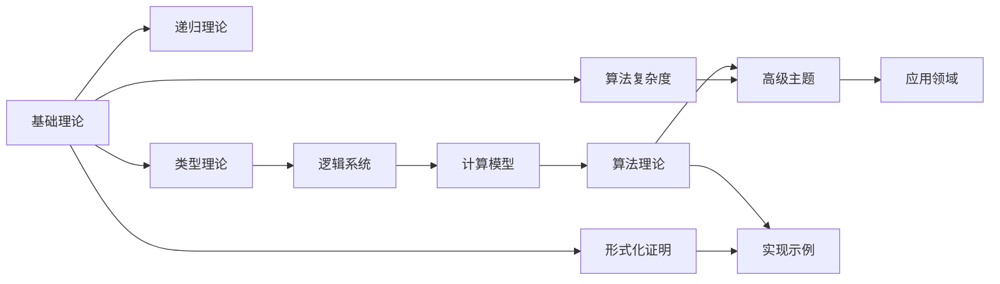

# 文档总览（Table of Contents）

> 定位：本仓库是“知识梳理与体系化文档”项目，聚焦于形式算法理论的系统化知识地图、术语规范与跨专题关联。文中的代码片段仅作解释性示例，不提供可运行工程。

## 知识地图（概览）

## 推荐阅读路径

- 初学入门：基础理论 → 形式化证明 → 算法复杂度
- 逻辑与类型：类型理论 → 逻辑系统 → 计算模型
- 算法主线：算法基础 → 复杂度理论 → 优化理论 → 高级算法理论
- 交叉专题：高级主题（解释性/鲁棒性/治理/隐私/量子）→ 应用领域

## 研究路线图（路线建议）

- 证明与合成：证明系统 → 形式化验证 → 算法合成（CEGIS/SyGuS） → 工具生态（SMT/SAT）
- 量子方向：量子计算模型 → 量子算法理论 → 量子机器学习/金融应用 → 量子复杂度
- 值得关注的安全与治理：鲁棒性/对抗 → 可解释性/透明度 → 隐私/联邦 → 治理/合规
- 系统与工程：分布式/并行 → 边缘系统 → 资源感知与自适应 → 工程验证与度量

## 能力矩阵（学习目标汇总）

| 专题 | 核心能力 | 应用场景 | 前置要求 | 推荐时长 | 难度分布 | 就业方向 |
|---|---|---|---|---|---|---|
| 算法合成 | CEGIS/SyGuS 框架、SAT/SMT 求解 | 程序生成、代码补全 | 形式化证明、类型系统 | 40-60h | 基础2/进阶2/高级1 | 程序合成工程师、形式化验证专家 |
| 量子金融 | QUBO 编码、量子优势分析 | 投资组合优化、风险度量 | 量子计算模型、优化理论 | 30-50h | 基础1/进阶2/高级2 | 量子算法工程师、金融科技专家 |
| 可解释性 | 特征归因、决策路径、透明度度量 | AI 监管、公平性审计 | 统计学习、线性模型 | 25-40h | 基础1/进阶2/高级2 | AI 伦理专家、可解释AI工程师 |
| 鲁棒性 | 对抗训练、认证鲁棒性、检测防御 | 安全系统、恶意环境 | 概率论、优化理论 | 35-55h | 基础1/进阶2/高级2 | 安全算法专家、对抗防御工程师 |
| 联邦学习 | 分布式训练、隐私保护、聚合算法 | 跨域协作、数据隐私 | 分布式系统、密码学基础 | 45-65h | 基础1/进阶2/高级2 | 联邦学习工程师、隐私保护专家 |
| 量子机器学习 | 量子特征映射、变分算法、量子核 | 量子优势、混合计算 | 量子计算、机器学习 | 50-70h | 基础1/进阶2/高级2 | 量子ML工程师、量子算法研究员 |
| AI 治理 | 风险框架、合规检查、审计追踪 | 监管合规、伦理审查 | 风险管理、法规标准 | 20-35h | 基础2/进阶2/高级1 | AI 治理专家、合规顾问 |
| 边缘计算 | 资源感知、任务调度、协同推理 | 物联网、实时系统 | 分布式系统、实时系统 | 30-45h | 基础1/进阶2/高级2 | 边缘计算工程师、IoT算法专家 |

## 撰写规范与引用

- 请参阅：`01-基础理论/00-撰写规范与引用指南.md`

## 学习路径规划器

- 个性化学习计划：`01-基础理论/01-学习路径规划器.md`
- 学习资源推荐：`01-基础理论/02-学习资源推荐清单.md`
- 学习成果认证：`01-基础理论/03-学习成果认证体系.md`

- 01-基础理论
  - 01-形式化定义.md
  - 02-数学基础.md
  - 03-集合论基础.md
  - 04-函数论基础.md
  - 05-数论基础.md
  - 06-代数结构基础.md
  - 07-概率与统计基础.md
- 02-递归理论
  - 01-递归函数定义.md
  - 02-原始递归函数.md
  - 03-一般递归函数.md
  - 04-递归可枚举性.md
  - 05-递归不可解性.md
- 03-形式化证明
  - 01-证明系统.md
  - 02-归纳法.md
  - 03-构造性证明.md
  - 04-反证法.md
- 04-算法复杂度
  - 01-时间复杂度.md
  - 02-空间复杂度.md
  - 03-渐进分析.md
  - 04-复杂度类.md
- 05-类型理论
  - 01-简单类型论.md
  - 02-依赖类型论.md
  - 03-同伦类型论.md
  - 04-类型系统.md
  - 05-依赖类型系统与数理逻辑.md
  - 06-算法类型理论.md
  - 07-高阶类型系统.md
  - 08-量子类型系统.md
- 06-逻辑系统
  - 01-命题逻辑.md
  - 02-一阶逻辑.md
  - 03-直觉逻辑.md
  - 04-模态逻辑.md
  - 05-多值逻辑理论.md
  - 06-线性逻辑.md
  - 07-时序逻辑.md
  - 08-高阶逻辑理论.md
  - 09-时序逻辑理论.md
- 07-计算模型
  - 01-图灵机.md
  - 02-λ演算.md
  - 03-组合子逻辑.md
  - 04-自动机理论.md
  - 05-量子计算模型.md
  - 06-细胞自动机理论.md
  - 07-神经网络计算模型.md
- 08-实现示例
  - 01-Rust实现.md
  - 02-Haskell实现.md
  - 03-Lean实现.md
  - 04-形式化验证.md
- 09-算法理论
  - 01-算法基础
    - 01-算法设计理论.md
    - 02-数据结构理论.md
    - 03-排序算法理论.md
    - 04-搜索算法理论.md
    - 05-图算法理论.md
    - 06-动态规划理论.md
    - 07-贪心算法理论.md
    - 08-分治算法理论.md
    - 09-回溯算法理论.md
    - 10-分支限界算法理论.md
    - 11-随机算法理论.md
    - 12-近似算法理论.md
    - 13-在线算法理论.md
    - 14-流算法理论.md
    - 15-量子算法理论.md
    - 16-生物算法理论.md
    - 17-神经网络算法理论.md
    - 18-强化学习算法理论.md
    - 19-图神经网络算法理论.md
    - 20-联邦学习算法理论.md
  - 02-复杂度理论
    - 01-计算复杂度理论.md
  - 03-优化理论
    - 01-算法优化理论.md
    - 02-并行算法理论.md
    - 03-分布式算法理论.md
    - 04-启发式算法理论.md
  - 04-高级算法理论
    - 01-量子算法理论.md
    - 02-算法工程理论.md
    - 03-算法验证理论.md
    - 04-算法优化理论.md
    - 05-算法分析理论.md
    - 06-算法设计模式理论.md
    - 13-算法合成理论.md
    - 14-算法元编程理论.md
    - 15-算法验证理论.md
    - 16-算法形式化验证理论.md
    - 17-算法合成理论.md
    - 18-算法元编程理论.md
    - 19-算法形式化验证理论.md
    - 20-算法自适应理论.md
    - 21-算法演化理论.md
- 10-高级主题
  - 01-范畴论在计算中的应用.md
  - 02-同伦类型论的高级应用.md
  - 03-证明助手的实现.md
  - 04-量子信息论.md
  - 05-量子机器学习.md
  - 06-形式化验证的高级技术.md
  - 07-程序合成技术.md
  - 08-量子计算复杂性理论.md
  - 09-量子信息论与量子编码.md
  - 10-量子优化算法理论.md
  - 11-算法合成理论.md
  - 12-算法元编程理论.md
  - 13-量子计算复杂性理论.md
  - 14-算法合成与元编程高级理论.md
  - 15-量子算法工程理论.md
  - 16-量子算法安全理论.md
  - 17-量子错误纠正理论.md
  - 18-量子算法复杂度理论.md
  - 19-量子机器学习理论.md
  - 20-量子密码学理论.md
  - 21-算法合成与元编程高级应用.md
  - 22-量子算法在金融科技中的应用.md
  - 23-算法自适应学习理论.md
  - 24-算法演化与遗传编程理论.md
  - 25-算法可解释性与透明度理论.md
  - 26-算法鲁棒性与对抗性防御理论.md
  - 27-算法联邦学习与隐私保护理论.md
  - 28-算法量子机器学习理论.md
  - 29-可信AI治理与合规模型.md
  - 30-边缘计算中的算法系统.md
- 11-国际化
  - 01-中英术语对照表.md
  - 02-Wiki国际概念对齐.md
  - 03-多语言支持准备.md
- 12-应用领域
  - 01-人工智能算法应用.md
  - 02-区块链算法应用.md
  - 03-网络安全算法应用.md
  - 04-生物信息学算法应用.md
  - 05-金融算法应用.md
  - 06-游戏算法应用.md
  - 07-物联网算法应用.md
  - 09-量子密码学算法应用.md
  - 10-量子机器学习算法应用.md
  - 11-量子金融算法应用.md
  - 12-量子网络安全算法应用.md
  - 13-量子科学计算算法应用.md
  - 14-量子材料科学算法应用.md
  - 15-量子生物信息学算法应用.md
  - 16-量子通信算法应用.md
  - 17-量子传感算法应用.md
  - 18-量子优化算法应用.md
  - 19-量子算法在材料科学中的应用.md
  - 20-算法在能源系统中的应用.md
  - 21-算法在医疗健康中的应用.md
  - 22-算法在智能制造中的应用.md
  - 23-算法在交通与物流中的应用.md

> 注：若需工程化演示，请参考各实现文档中的“最小示例片段”。本仓库不提供可运行工程或 CI。
