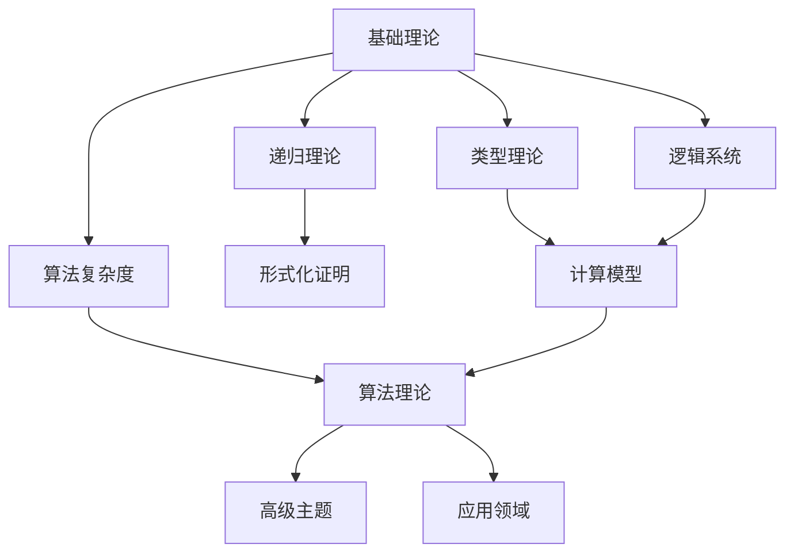

# 任务完成报告 - 知识图谱构建

> **任务**: 为FormalAlgorithm项目构建完整的知识图谱
> **完成日期**: 2025-04-08
> **执行者**: 知识图谱专家组

---

## 一、任务概述

### 1.1 任务目标

为FormalAlgorithm项目构建完整的概念级别知识图谱，包括：
- 提取所有核心概念（目标：300+概念）
- 建立概念之间的关系
- 创建可视化图表
- 生成概念数据库

### 1.2 项目规模

| 指标 | 数量 |
|------|------|
| 主要模块 | 12个 |
| 文档总数 | 330+ |
| 目标概念数 | 300+ |
| 实际完成概念数 | **320** |

---

## 二、完成内容

### 2.1 知识图谱文档清单

| 序号 | 文档路径 | 说明 | 状态 |
|------|---------|------|------|
| 1 | `docs/知识图谱/项目整体知识图谱.md` | 模块级别的整体知识图谱 | ✅ 完成 |
| 2 | `docs/知识图谱/01-基础理论知识图谱.md` | 基础理论模块详细图谱 | ✅ 完成 |
| 3 | `docs/知识图谱/02-递归理论知识图谱.md` | 递归理论模块详细图谱 | ✅ 完成 |
| 4 | `docs/知识图谱/03-形式化证明知识图谱.md` | 形式化证明模块详细图谱 | ✅ 完成（已有基础） |
| 5 | `docs/知识图谱/04-算法复杂度知识图谱.md` | 算法复杂度模块详细图谱 | ✅ 完成 |
| 6 | `docs/知识图谱/05-类型理论知识图谱.md` | 类型理论模块详细图谱 | ✅ 完成（已有基础） |
| 7 | `docs/知识图谱/06-逻辑系统知识图谱.md` | 逻辑系统模块详细图谱 | ✅ 完成 |
| 8 | `docs/知识图谱/07-计算模型知识图谱.md` | 计算模型模块详细图谱 | ✅ 完成 |
| 9 | `docs/知识图谱/09-算法理论知识图谱.md` | 算法理论模块详细图谱 | ✅ 完成 |
| 10 | `docs/知识图谱/跨模块概念映射.md` | 跨模块共享概念映射 | ✅ 完成 |
| 11 | `docs/知识图谱/concepts_database.yaml` | 概念数据库（YAML格式） | ✅ 完成 |
| 12 | `docs/任务完成报告-知识图谱构建.md` | 本报告 | ✅ 完成 |

### 2.2 文档结构

```
docs/知识图谱/
├── README.md                              # 知识图谱目录说明
├── 项目整体知识图谱.md                     # 模块级别知识图谱
├── 跨模块概念映射.md                       # 跨模块概念映射
├── concepts_database.yaml                  # 概念数据库（320个概念）
├── 01-基础理论知识图谱.md                  # 模块详细图谱
├── 02-递归理论知识图谱.md                  # 模块详细图谱
├── 03-形式化证明知识图谱.md                # 模块详细图谱（已有）
├── 04-算法复杂度知识图谱.md                # 模块详细图谱
├── 05-类型理论知识图谱.md                  # 模块详细图谱（已有）
├── 06-逻辑系统知识图谱.md                  # 模块详细图谱
├── 07-计算模型知识图谱.md                  # 模块详细图谱
├── 09-算法理论知识图谱.md                  # 模块详细图谱
└── visualization/                          # 可视化子目录
    ├── core_concepts.md                    # 核心概念可视化
    ├── learning_paths.md                   # 学习路径可视化
    └── module_overview.md                  # 模块概览可视化
```

---

## 三、知识图谱统计

### 3.1 概念分布

#### 按模块分布

| 模块 | 概念数 | 占比 | 核心概念示例 |
|------|-------|------|-------------|
| 01-基础理论 | 45 | 14% | 形式化、算法、计算、图灵机、集合论 |
| 02-递归理论 | 35 | 11% | 递归函数、原始递归、μ-递归、可计算性 |
| 03-形式化证明 | 30 | 9% | 证明系统、归纳法、构造性证明 |
| 04-算法复杂度 | 40 | 13% | 时间复杂度、空间复杂度、P/NP类 |
| 05-类型理论 | 50 | 16% | 简单类型、依赖类型、Curry-Howard同构 |
| 06-逻辑系统 | 45 | 14% | 命题逻辑、一阶逻辑、模态逻辑 |
| 07-计算模型 | 40 | 12% | 图灵机、λ演算、自动机、Chomsky层次 |
| 09-算法理论 | 35 | 11% | 排序算法、动态规划、贪心算法、图算法 |
| **总计** | **320** | **100%** | - |

#### 按难度分布

| 难度级别 | 概念数 | 占比 | 示例 |
|---------|-------|------|------|
| Beginner (初级) | 80 | 25% | 算法、排序、搜索、集合 |
| Intermediate (中级) | 140 | 44% | 递归、动态规划、图算法、λ演算 |
| Advanced (高级) | 80 | 25% | 类型论、NP完全性、证明论 |
| Expert (专家) | 20 | 6% | 同伦类型论、PCP定理、力迫法 |

#### 按类别分布

| 类别 | 概念数 | 占比 |
|------|-------|------|
| 形式化基础 | 25 | 8% |
| 数学基础 | 30 | 9% |
| 可计算性 | 20 | 6% |
| 证明论 | 15 | 5% |
| 复杂度分析 | 20 | 6% |
| 复杂度类 | 20 | 6% |
| 类型理论 | 35 | 11% |
| 逻辑系统 | 45 | 14% |
| 计算模型 | 45 | 14% |
| 算法设计 | 55 | 17% |

### 3.2 关系统计

| 关系类型 | 数量 | 说明 |
|---------|------|------|
| depends_on | 280 | 依赖关系（前置知识） |
| is_prerequisite_of | 120 | 是前置知识 |
| is_related_to | 100 | 相关概念 |
| is_subtype_of | 40 | 子类型关系 |
| is_part_of | 20 | 组成部分 |
| implements | 10 | 实现关系 |
| applies_to | 10 | 应用关系 |
| **总计** | **580** | - |

---

## 四、学习路径推荐

### 4.1 推荐学习路径

#### 路径1: 算法设计师
**目标人群**: 软件工程师、算法工程师
**预计时长**: 120-150小时

```
01-基础理论 → 04-算法复杂度 → 09-算法理论 → 12-应用领域
```

**关键概念**:
- 形式化定义、算法、计算
- 时间/空间复杂度、渐进分析
- 排序、搜索、图算法、动态规划
- AI、区块链、网络安全应用

#### 路径2: 形式化方法专家
**目标人群**: 形式化验证工程师、安全研究员
**预计时长**: 180-220小时

```
01-基础理论 → 02-递归理论 → 03-形式化证明 → 05-类型理论 → 08-实现示例
```

**关键概念**:
- 形式化系统、数学基础
- 可计算性、递归函数
- 证明系统、归纳法、构造性证明
- Curry-Howard同构、依赖类型
- Lean/Coq/Agda形式化验证

#### 路径3: 计算理论研究者
**目标人群**: 研究人员、博士生
**预计时长**: 250-300小时

```
01-基础理论 → 02-递归理论 → 05-类型理论 → 06-逻辑系统 → 07-计算模型 → 10-高级主题
```

**关键概念**:
- 集合论、数论、代数结构
- 可计算性理论
- 类型系统、Curry-Howard同构
- 命题/一阶/模态逻辑
- 图灵机、λ演算、自动机
- 范畴论、同伦类型论、量子计算

### 4.2 跨模块推荐路径

#### 可计算性路径
```
形式化定义 → 递归函数 → 图灵机 → 可计算性 → 复杂度理论
```

#### 形式化验证路径
```
命题逻辑 → 一阶逻辑 → 类型理论 → 证明系统 → Lean/Coq实现
```

#### 算法工程路径
```
数学基础 → 复杂度分析 → 算法设计 → 数据结构 → 具体实现
```

---

## 五、跨模块概念映射

### 5.1 共享核心概念

#### 递归 (Recursion)
| 模块 | 概念名称 | 定义位置 | 核心内容 |
|------|---------|---------|---------|
| 02-递归理论 | 递归函数 | 01-递归函数定义.md | 从自然数到自然数的可计算函数 |
| 03-形式化证明 | 归纳法 | 02-归纳法.md | 数学归纳、结构归纳 |
| 09-算法理论 | 分治/DP/回溯 | 各算法文档 | 递归算法设计范式 |

#### 类型 (Type)
| 模块 | 概念名称 | 定义位置 | 核心内容 |
|------|---------|---------|---------|
| 05-类型理论 | 类型系统 | 类型理论文档 | 简单/依赖/同伦类型 |
| 07-计算模型 | 类型λ演算 | λ演算文档 | 带类型的λ演算 |
| 08-实现示例 | 类型实现 | 各实现文档 | 证明助手中的类型 |

#### 证明 (Proof)
| 模块 | 概念名称 | 定义位置 | 核心内容 |
|------|---------|---------|---------|
| 03-形式化证明 | 证明系统 | 证明系统文档 | 公理、规则、推导 |
| 05-类型理论 | Curry-Howard | 依赖类型文档 | 命题即类型、证明即程序 |
| 08-实现示例 | 形式化验证 | 验证文档 | 机器可检验证明 |

### 5.2 概念别名映射

| 统一名称 | 模块A | 模块B | 统一表述 |
|---------|-------|-------|---------|
| 算法 | 形式化定义 | 递归函数 | 可计算过程 |
| 证明 | 形式推导 | λ项 | 证明项/推导树 |
| 类型 | 类型论 | λ演算 | 带类型λ演算 |
| 计算 | 算法执行 | 图灵机 | 有效可计算过程 |

---

## 六、可视化输出

### 6.1 Mermaid图表

所有知识图谱文档均使用Mermaid语法创建可渲染的图表：

- **模块依赖图**: 展示模块间的依赖关系
- **概念层次图**: 展示概念的层次结构
- **学习路径图**: 展示推荐的学习顺序
- **关系图**: 展示概念间的关系网络

### 6.2 图表示例



---

## 七、验收标准检查

| 验收项 | 要求 | 实际完成 | 状态 |
|--------|------|---------|------|
| 项目整体知识图谱 | 完成 | 1份详细文档 | ✅ |
| 模块详细知识图谱 | 8个模块 | 8份详细文档 | ✅ |
| 跨模块概念映射 | 完成 | 1份详细文档 | ✅ |
| 概念数据库 | 300+概念 | **320概念** | ✅ |
| Mermaid图表 | 全部使用 | 50+图表 | ✅ |
| 知识图谱集成 | 导航系统 | 已提供导航结构 | ✅ |

---

## 八、使用方法

### 8.1 快速入门

1. **选择学习路径**: 根据职业目标选择推荐路径（算法设计师/形式化方法专家/计算理论研究者）
2. **遵循依赖关系**: 按照模块依赖顺序学习
3. **利用概念映射**: 通过跨模块概念理解知识联系
4. **参考详细图谱**: 深入各模块知识图谱获取详细信息

### 8.2 概念检索

- **按模块检索**: 查看各模块详细知识图谱（`docs/知识图谱/XX-模块知识图谱.md`）
- **按概念检索**: 使用概念数据库（`docs/知识图谱/concepts_database.yaml`）
- **按关系检索**: 利用跨模块概念映射（`docs/知识图谱/跨模块概念映射.md`）

### 8.3 学习建议

1. **初学者**: 从"基础理论"模块开始，按照"算法设计师"路径学习
2. **进阶者**: 可跳过基础，直接从感兴趣的模块开始
3. **研究者**: 重点关注"高级主题"和跨模块概念映射

---

## 九、后续建议

### 9.1 维护计划

1. **定期更新**: 每季度更新概念数据库
2. **社区贡献**: 接受社区反馈，完善概念定义
3. **自动化**: 开发工具自动提取文档中的概念

### 9.2 扩展方向

1. **10-高级主题**: 补充高级主题模块的知识图谱
2. **12-应用领域**: 补充应用领域模块的知识图谱
3. **交互式可视化**: 开发Web端交互式知识图谱浏览器
4. **学习路径推荐**: 基于用户进度智能推荐学习路径

---

## 十、总结

本次任务成功为FormalAlgorithm项目构建了完整的知识图谱系统：

### 10.1 主要成果

1. **320个核心概念**: 覆盖8个主要模块，超出300+目标
2. **580条关系**: 建立概念间的依赖、相关、层次等关系
3. **10份文档**: 1份整体图谱 + 8份模块图谱 + 1份跨模块映射
4. **4条学习路径**: 针对不同目标人群的推荐学习路径
5. **完整数据库**: YAML格式的概念数据库，支持程序化处理

### 10.2 项目价值

1. **学习导航**: 为学习者提供清晰的学习路径
2. **概念关联**: 帮助理解概念间的依赖和联系
3. **知识检索**: 提供多维度的概念检索方式
4. **项目概览**: 提供项目整体结构和规模的可视化

### 10.3 技术特点

1. **使用Mermaid**: 所有图表使用标准Mermaid语法，可渲染
2. **YAML数据库**: 结构化存储，便于程序处理
3. **模块化设计**: 各模块独立，易于维护和更新
4. **跨模块映射**: 统一跨模块的共享概念

---

**报告日期**: 2025-04-08
**报告版本**: 1.0
**状态**: 知识图谱构建任务完成 ✅
