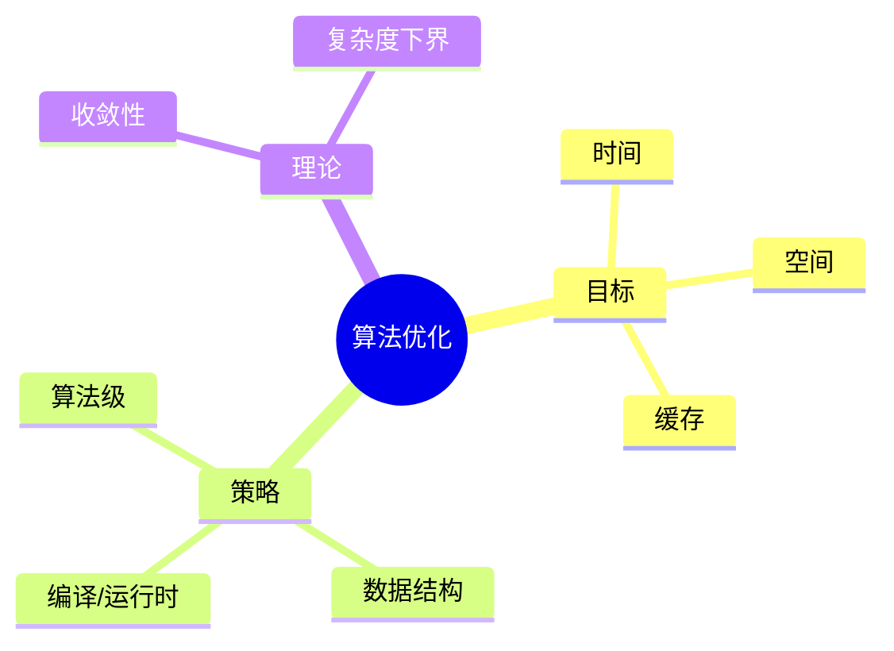

# 内容补充与思维表征全面计划方案

> **创建日期**: 2025-02-02
> **目的**: 在**不删除现有内容**（含代码与实现）的前提下，全面补充**概念定义、属性、关系、解释、论证、形式证明**，并系统引入**多种思维表征方式**（思维导图、多维矩阵概念对比、决策树图、公理定理推理证明决策树图、应用决策建模树图等），使文档兼具理论深度与可读性。
> **原则**: **只补充、不删除**；与现有代码/实现并存，形成「概念—属性—关系—解释—论证—形式证明—实现」的完整链条。

---

## 一、现状诊断与目标

### 1.1 现状诊断

| 维度 | 当前状态 | 问题简述 |
|------|----------|----------|
| **概念定义** | 部分文档有形式化定义（如算法优化系统五元组），多数文档仅有术语表级简述 | 缺乏统一「定义—属性—关系」结构，概念边界与内涵不够清晰 |
| **属性与关系** | 少数模块有知识图谱（类型理论、形式化证明），多数文档无显式属性表与概念关系图 | 概念间依赖、等价、特化、应用关系未系统呈现 |
| **解释与论证** | 部分有定理+简短证明，解释性文字偏少 | 读者难以理解「为何如此定义」「为何该定理成立」「与其它概念的逻辑联系」 |
| **形式证明** | 10 个核心算法已有形式化正确性证明；多数高级/算法理论文档仅有定义+代码 | 公理—定理—推理链不完整，证明树/证明策略未显式化 |
| **思维表征** | 个别模块有 Mermaid 概念依赖图；无统一的多维矩阵、决策树、公理定理证明决策树、应用决策建模树 | 缺少多种思维表征方式，不利于不同学习风格与决策场景 |
| **代码与实现** | 大量文档含 Rust/伪代码等实现 | 实现与概念、证明脱节，未形成「概念→性质→证明→应用决策→实现」的闭环 |

### 1.2 总体目标

1. **内容层面**：为各模块文档系统补充
   **概念定义**（形式化+自然语言）、**属性**（可列成表）、**关系**（依赖/等价/特化/应用）、**解释**（动机与直观）、**论证**（非形式推理）、**形式证明**（公理—定理—推理链，可配证明树图）。

2. **表征层面**：在文档中系统引入以下**思维表征方式**（与现有内容并存）：
   - **思维导图**：概念层次与分支（Mermaid 或等价图）。
   - **多维矩阵概念对比**：多概念在多维度上的对比表（如「算法类 × 时间复杂度 × 空间复杂度 × 稳定性 × 适用场景」）。
   - **决策树图**：选择算法/策略时的条件分支（若…则…）。
   - **公理/定理/推理证明决策树图**：从公理/定义出发的推理分支与定理依赖关系。
   - **应用决策建模树图**：从应用场景到技术选型/证明策略的决策路径。

3. **结构层面**：形成可复用的**内容标准**与**表征模板**，便于后续模块按同一规范补充，并与 [项目改进任务清单-2025.md](项目改进任务清单-2025.md)、[项目改进进度跟踪-2025-02-02.md](项目改进进度跟踪-2025-02-02.md) 衔接。

---

## 二、内容补充标准（六要素）

以下六类内容**在现有文档基础上补充**，不替代或删除已有定义与代码。

### 2.1 概念定义 (Concept Definition)

- **形式化定义**：沿用现有「定义 x.x.x」格式，必要时补全符号表与前置概念。
- **自然语言定义**：1–3 句精炼表述，可与形式化定义并列。
- **内涵与外延**：可选小节，用简短条目说明概念包含什么、不包含什么。
- **与标准/教材对齐**：注明与 ISO/教材/Wiki 的对应关系（可引用已有引用规范）。

**补充位置建议**：每章/每主题开头的「基本概念」或「定义」小节；术语表可扩展为「概念—定义—所在§」索引。

### 2.2 属性 (Properties)

- **属性表**：以表格列出概念的主要属性（名称、类型、取值范围、含义、与其它概念的关系）。
- **不变式/不变量**：若适用（如算法、数据结构），明确写出循环不变式、数据结构不变式。
- **复杂度属性**：时间/空间/通信等，以统一符号（如 $T(n)$, $S(n)$）与渐进记号表述。

**补充位置建议**：紧接在「概念定义」之后，独立小节「属性与不变量」或「概念属性表」。

### 2.3 关系 (Relations)

- **概念关系表**：源概念—目标概念—关系类型（depends_on / equivalent_to / specializes / applies_to）—强度—说明。
- **概念依赖图**：用 Mermaid `graph` 表示依赖与等价关系（可复用现有知识图谱风格）。
- **与它文档的交叉引用**：前置知识、后续概念、等价概念、应用场景（可沿用现有 Cross-References 写法）。

**补充位置建议**：每篇文档的「概念关系」或「与其它概念的关系」小节；模块级知识图谱可集中放在模块知识图谱文档中。

### 2.4 解释 (Explanation)

- **动机与直观**：为何需要该概念、为何如此定义、直观含义或类比。
- **与已有概念的联系**：用 1–3 段话说明与本模块或它模块概念的关系。
- **示例与反例**：简短正例与反例（可与现有代码示例配合）。

**补充位置建议**：在定义与属性之后、「论证/证明」之前，设「解释与直观」或「动机与示例」。

### 2.5 论证 (Argumentation)

- **非形式论证**：定理/命题的直观理由、归纳或类比说明（非形式化证明）。
- **与形式证明的衔接**：指明「形式证明见 §x.x」或「证明见下方证明树图」。
- **反例与边界**：定理不成立的条件或反例（若存在）。

**补充位置建议**：在「定理 x.x.x」之后、形式化「证明」之前，或与证明并列为「论证与证明」。

### 2.6 形式证明 (Formal Proof)

- **公理与规则**：明确列出所用公理、推理规则（可引用 01-形式化定义、03-证明系统）。
- **证明结构**：按「假设—推理步—结论」或自然演绎/序列演算风格书写。
- **证明树/证明决策树图**：用 Mermaid 或列表表示「由公理/定义到定理」的推理分支（见下文「公理定理推理证明决策树图」）。
- **与实现的关系**：若存在对应实现（如代码），用 1–2 句说明证明与实现的一致性（不删除实现）。

**补充位置建议**：在「定理」后的「证明」小节；代码块之前可加「实现与证明对应」简短说明。

---

## 三、思维表征方式标准（五类）

以下五类**思维表征**以图、表形式插入文档，与正文和代码并存。建议统一使用 **Mermaid** 以便在 Markdown 中渲染。

### 3.1 思维导图 (Mind Map)

- **用途**：表现某一主题下概念的层次与分支（从中心概念到子概念、属性、应用）。
- **格式**：Mermaid `graph` 或 `mindmap`（若环境支持）；可分层：中心节点 → 一级分支 → 二级分支。
- **内容**：概念名、关键属性、典型应用、相关文档链接（可在图中或图下用表给出）。
- **放置**：章首「本章概念结构」或节首「本节概念导图」。

**示例结构**（文字描述，实际文档中用 Mermaid 绘制）：

```text
算法优化 [中心]
├── 优化目标（时间/空间/缓存/能耗）
├── 优化策略（算法级/数据结构/编译/运行时）
├── 理论（收敛性/复杂度下界/自适应）
└── 应用（排序/搜索/图/数值）
```

### 3.2 多维矩阵概念对比 (Multi-Dimensional Concept Comparison Matrix)

- **用途**：在多维度上对比多个概念（如多种算法、多种证明策略），便于选择与辨析。
- **格式**：Markdown 表格；行 = 概念/对象，列 = 维度（如复杂度、稳定性、适用场景、形式化难度等）。
- **内容**：维度需与文档主题一致；单元格可填数值、符号、简短说明或「—」。
- **放置**：在「基本概念」或「方法对比」小节；可与「应用决策树图」配合使用。

**示例**（表格示意）：

| 概念/算法 | 时间复杂度 | 空间复杂度 | 稳定性 | 适用场景 | 形式化证明难度 |
|-----------|------------|------------|--------|----------|----------------|
| 归并排序  | $\Theta(n\log n)$ | $\Theta(n)$ | 稳定 | 通用、外部排序 | 中（归纳） |
| 快速排序  | $O(n^2)$ 期望 $\Theta(n\log n)$ | $\Theta(\log n)$ | 不稳定 | 内排序、平均最快 | 中（不变式） |
| …         | …          | …          | …      | …        | …              |

### 3.3 决策树图 (Decision Tree)

- **用途**：描述「在何种条件下选择何种算法/策略/结构」的分支过程。
- **格式**：Mermaid `graph` 或 `flowchart`：根节点为决策起点，边为条件（是/否或多分支），叶节点为选择结果。
- **内容**：条件尽量可判定（如「数据规模」「是否要求稳定」「是否有并行」）；叶节点可链接到对应 § 或文档。
- **放置**：「算法/策略选择」「应用场景」或「实现选型」小节。

**示例结构**（文字描述）：

```text
[起点：需要排序]
├── 是否要求稳定？
│   ├── 是 → 数据规模大？→ 是：归并；否：插入/归并
│   └── 否 → 平均性能优先？→ 是：快速排序；否：堆排序
└── 是否有并行？→ 是：并行归并/快速；否：上述分支
```

### 3.4 公理定理推理证明决策树图 (Axiom–Theorem–Proof Decision Tree)

- **用途**：表现从公理/定义到定理的推理依赖与分支（先证什么、再证什么；哪些引理支撑哪些定理）。
- **格式**：Mermaid `graph`：节点为公理、定义、引理、定理；有向边表示「推出」或「依赖」。
- **内容**：标出文档内 § 编号，便于与正文证明对照。
- **放置**：「定理依赖结构」或「证明结构图」小节，通常在「形式证明」或章末。

**示例结构**（文字描述）：

```text
定义 1.1.1（优化系统） → 定义 1.1.2（优化问题）
定义 1.1.2 + 有限性 → 定理 1.1.1（存在性）
定义 1.2.1（优化空间）→ 定义 1.2.2（局部最优）→ 定理 1.2.1（极值定理）
```

### 3.5 应用决策建模树图 (Application Decision Modeling Tree)

- **用途**：从应用场景或需求出发，经一系列条件判断，到具体技术选型、证明策略或实现方式。
- **格式**：Mermaid `flowchart`：根为「应用场景/需求」，中间为条件与约束，叶为推荐方法/文档/§。
- **内容**：与「多维矩阵概念对比」一致化维度（如性能、可维护性、形式化要求）；叶节点可引用 § 或它文档。
- **放置**：「应用指南」「选型建议」或「从需求到实现」小节。

**示例结构**（文字描述）：

```text
[需求：算法优化]
├── 目标：时间 / 空间 / 兼顾？
├── 约束：是否可改数据结构？是否可并行？
└── 输出：推荐策略 + 对应 §（算法级优化 §3.1 / 数据结构 §3.2 / 并行 §5.1 …）
```

---

## 四、适用范围与优先级（只补充、不删除）

### 4.1 适用范围

- **模块**：全项目 00–12 所有主题文档（含 00-算法规范设计框架、01-基础理论、02-递归理论、03-形式化证明、04-算法复杂度、05-类型理论、06-逻辑系统、07-计算模型、08-实现示例、09-算法理论、10-高级主题、11-国际化、12-应用领域）。
- **文档类型**：以「概念—理论—应用」为主的理论文档、算法理论文档、实现与验证文档；模板与清单类文档可只做「轻量补充」（如概念索引表、与主文档的链接）。
- **现有内容**：**一律保留**；代码、已有定义与证明、已有知识图谱均保留，仅在其前/后/旁补充上述六类内容与五类表征。

### 4.2 优先级与批次（建议）

| 批次 | 模块/文档范围 | 内容重点 | 表征重点 | 说明 |
|------|----------------|----------|----------|------|
| **第一批** | 01-基础理论、02-递归理论、03-形式化证明 | 概念定义、属性、关系、形式证明 | 概念依赖图、公理定理证明决策树 | 为后续模块提供概念与证明范式 |
| **第二批** | 04-算法复杂度、05-类型理论、06-逻辑系统 | 定义、属性、关系、解释、论证、证明 | 思维导图、多维矩阵、证明决策树 | 复杂度/类型/逻辑概念多，适合矩阵对比 |
| **第三批** | 07-计算模型、09-算法理论（01-算法基础、02-复杂度、03-优化理论） | 概念、属性、关系、解释、证明 | 决策树、应用决策建模树、矩阵对比 | 与实现/代码结合紧密，突出应用决策 |
| **第四批** | 09-算法理论（04-高级算法理论）、10-高级主题 | 同上，侧重与前面模块的衔接 | 思维导图、矩阵、应用决策树 | 高级主题依赖前面概念 |
| **第五批** | 00-算法规范设计框架、08-实现示例、11-国际化、12-应用领域 | 概念索引、与理论文档的关系、选型表 | 应用决策树、矩阵（规范/应用维度） | 偏应用与规范，补充概念关联与选型 |

---

## 五、阶段划分与交付物

### 5.1 阶段一：标准与模板（建议 2–3 周）

| 交付物 | 说明 |
|--------|------|
| **内容补充标准文档** | 将第二节「内容补充标准」固化为可复用的 `内容补充标准-概念定义属性关系解释论证形式证明.md`（可放在 `docs/` 或与现有撰写规范并列）。 |
| **思维表征模板集** | 五类表征的 Mermaid 模板与 1–2 个完整示例（如：选一篇文档做「概念定义+属性表+关系表+思维导图+矩阵+决策树+公理定理证明树+应用决策树」示例）。 |
| **通用文档模板更新** | 在 [\_TEMPLATE-通用文档模板.md](_TEMPLATE-通用文档模板.md) 中增加可选小节：概念属性表、概念关系、解释与直观、论证与证明、思维导图、多维矩阵、决策树图、公理定理证明决策树、应用决策建模树（均标注「可选，按需补充」）。 |

### 5.2 阶段二：试点文档（建议 2–4 周）

| 交付物 | 说明 |
|--------|------|
| **1–2 篇试点文档** | 从 09-算法理论（如 04-算法优化理论）或 03-形式化证明中选 1–2 篇，按上述标准**仅做补充**（不删代码、不删已有定义）：补概念属性表、关系表、解释、论证、形式证明结构、思维导图、多维矩阵、决策树、公理定理证明树、应用决策树各至少 1 处。 |
| **试点总结** | 简短说明补充位置、与现有内容的衔接方式、可复制到其它文档的片段或模板。 |

### 5.3 阶段三：分批推广（按第四节的批次顺序）

| 批次 | 交付物 |
|------|--------|
| 第一批 | 01、02、03 模块中优先文档的补充与五类表征的引入；更新或新建模块知识图谱（含概念关系、证明依赖）。 |
| 第二批 | 04、05、06 模块的补充与表征。 |
| 第三批 | 07、09-01/02/03 的补充与表征。 |
| 第四批 | 09-04、10 的补充与表征。 |
| 第五批 | 00、08、11、12 的补充与表征（偏概念索引与应用决策）。 |

每批结束可更新 [项目改进进度跟踪-2025-02-02.md](项目改进进度跟踪-2025-02-02.md) 与 [项目改进工作进展-2025.md](项目改进工作进展-2025.md)，在「未完成任务总表」或「计划工作」中增加「内容补充与思维表征」进度条。

---

## 六、模板与示例（要点）

### 6.1 概念定义 + 属性 + 关系（同页示例结构）

```markdown
### 2.x 概念名 / Concept Name

**定义 2.x.1** (形式化) 自然语言一句 + 数学表述。
**Definition 2.x.1** (Formal) One sentence + formula.

**解释 / Explanation**：动机与直观 1–2 句。

#### 概念属性表

| 属性名 | 类型/范围 | 含义 |
|--------|-----------|------|
| …      | …         | …    |

#### 概念关系

| 源概念 | 目标概念 | 关系类型 | 说明 |
|--------|----------|----------|------|
| …      | …        | depends_on / equivalent_to / … | … |

（可选）概念依赖图：Mermaid graph。
```

### 6.2 思维导图（Mermaid 示例）



（若环境不支持 `mindmap`，可用 `graph TD` 分层表示。）

### 6.3 多维矩阵 + 决策树 + 应用决策树

- **多维矩阵**：见 3.2 节示例表格。
- **决策树**：Mermaid `flowchart LR` 或 `TD`，节点为条件或结果，边为「是/否」或维度取值。
- **应用决策树**：根节点为「应用场景」，子节点为条件，叶节点为推荐 § 或文档名。

---

## 七、验收标准（单篇文档）

单篇文档在「内容补充与思维表征」上可视为达标时，建议满足（最低要求）：

| 类型 | 最低要求 |
|------|----------|
| 概念定义 | 至少 1 个核心概念具备「形式化定义 + 自然语言 + 解释」；可与已有定义合并增强。 |
| 属性 | 至少 1 张「概念属性表」或「不变量/不变式」表。 |
| 关系 | 至少 1 张概念关系表或 1 个概念依赖图（Mermaid）。 |
| 论证/形式证明 | 至少 1 个定理具备「论证（非形式）+ 形式证明」或「证明 + 证明结构图/证明树」。 |
| 思维导图 | 至少 1 个本章/本节概念思维导图（Mermaid）。 |
| 多维矩阵 | 至少 1 张多维概念对比表（多概念 × 多维度）。 |
| 决策树 | 至少 1 个决策树图（算法/策略选择或应用选型）。 |
| 公理定理证明树 | 理论文档至少 1 个公理—定理—推理依赖图（Mermaid）。 |
| 应用决策建模树 | 应用/实现相关文档至少 1 个从场景到选型的决策树（Mermaid）。 |

以上为「至少」要求；鼓励多概念、多定理、多图多表。**不要求删除任何现有代码或已有段落。**

---

## 八、与现有计划的关系

- 本方案**只做补充、不做删除**，与 [项目改进任务清单-2025.md](项目改进任务清单-2025.md) 中的阶段 1–5 及 [项目改进进度跟踪-2025-02-02.md](项目改进进度跟踪-2025-02-02.md) 中 P1–P3、未完成任务总表**并行**。
- 建议将「内容补充与思维表征」作为**独立跟踪项**纳入进度跟踪文档（例如新开「内容深度与表征」小节），按批次更新完成度。
- 与**知识图谱**：现有类型理论、形式化证明模块知识图谱保留并扩展；新补充的「概念关系表」「概念依赖图」可与模块知识图谱统一风格，或直接写入各文档。
- 与**复习要点/自测题**：已有复习要点与自测题的文档，可在同一文档内补充「概念—属性—关系—解释—论证—证明」与五类表征，形成「概念—证明—应用—自测」闭环。

---

## 九、总结

本方案在**不删除现有内容**的前提下，通过统一**六类内容补充**（概念定义、属性、关系、解释、论证、形式证明）和**五类思维表征**（思维导图、多维矩阵概念对比、决策树图、公理定理推理证明决策树图、应用决策建模树图），对全项目文档进行**全面梳理与后续补充**。执行时按**批次与优先级**推进，先完成标准与模板，再试点 1–2 篇文档，最后按模块分批推广，并与现有改进任务和进度跟踪衔接，形成可复用的**内容深度与思维表征**体系。

---

**文档版本**: v1.0
**最后更新**: 2025-02-02
**维护**: 项目改进工作组
