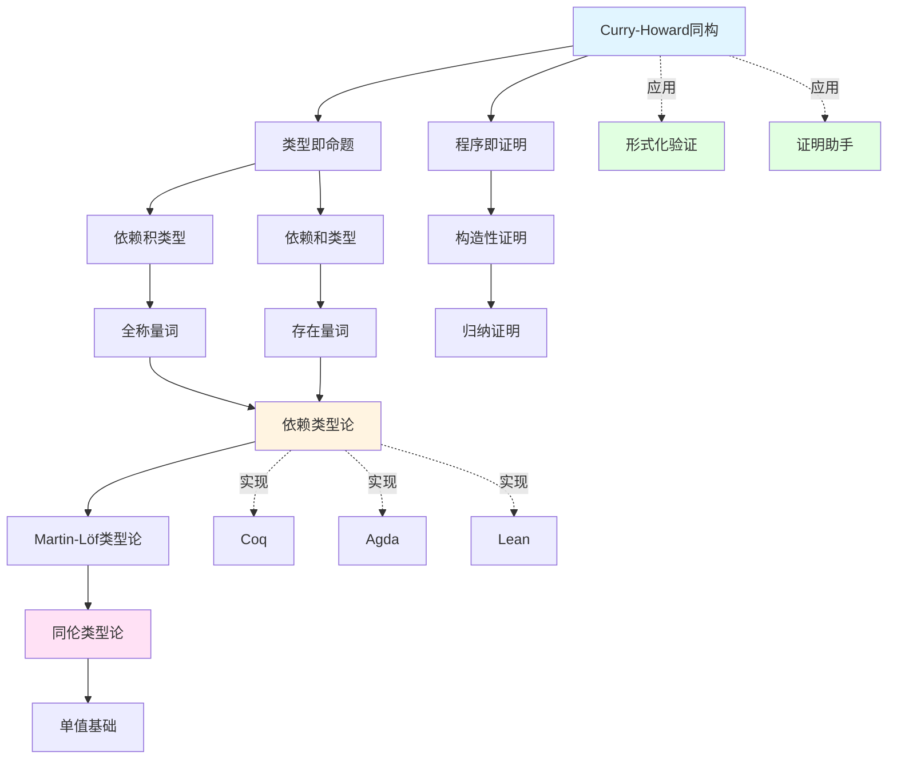
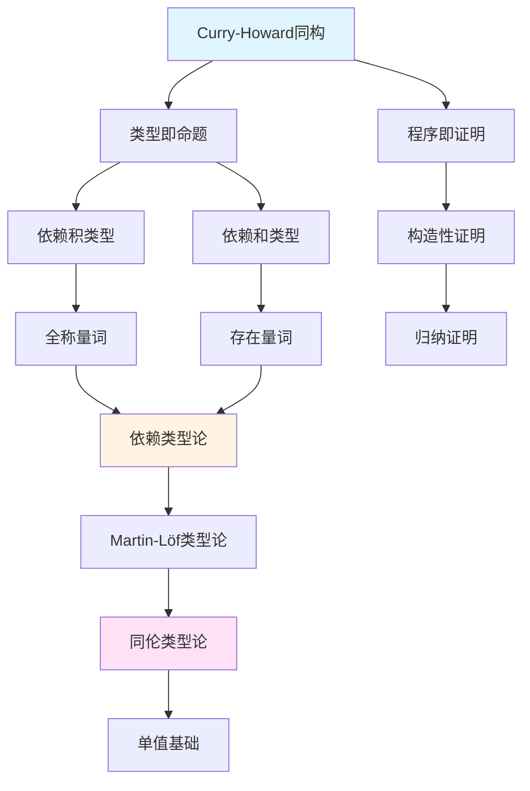

# 内容链接与补充完善方案

> **报告日期**: 2025-02-02
> **目标文档**: 项目所有文档
> **重点模块**: 类型理论模块（特别是依赖类型系统文档）
> **目标**: 建立完善的文档间链接系统，补充缺失内容，增强知识关联

---

## 📋 执行摘要

本方案详细规划了项目文档的内容链接完善和补充工作，重点关注依赖类型系统文档的改进，以及知识图谱构建和交叉引用系统的完善。通过系统化的内容补充和链接增强，提升文档的可导航性和知识关联性。

**核心任务**：

1. 更新依赖类型系统文档，补充最新研究进展
2. 完善交叉引用系统，建立完善的链接网络
3. 构建知识图谱，可视化概念关系
4. 补充缺失内容，增强文档完整性

**当前状态**: 交叉引用完整性70%，内容时效性70%
**目标状态**: 交叉引用完整性95%，内容时效性95%

---

## 一、依赖类型系统文档改进方案

### 1.1 当前文档分析

**文档位置**: `docs/05-类型理论/05-依赖类型系统与数理逻辑.md`

**当前内容评估**：

| 章节 | 内容完整性 | 时效性 | 交叉引用 | 评估 |
|-----|----------|--------|---------|------|
| §5.1 基本概念 | ✅ 完整 | ✅ 良好 | ⚠️ 部分 | 良好 |
| §5.2 Curry-Howard同构 | ✅ 完整 | ✅ 良好 | ⚠️ 部分 | 良好 |
| §5.3 逻辑量词与依赖类型 | ✅ 完整 | ✅ 良好 | ⚠️ 部分 | 良好 |
| §5.4 高阶抽象语法 | ✅ 完整 | ✅ 良好 | ⚠️ 部分 | 良好 |
| §5.5 元理论与证明自动化 | ✅ 完整 | ⚠️ 一般 | ⚠️ 部分 | 中等 |
| §5.6 实现示例 | ✅ 完整 | ⚠️ 一般 | ⚠️ 部分 | 中等 |
| §5.7 参考文献 | ✅ 完整 | ⚠️ 需更新 | N/A | 中等 |
| 最新研究进展 | ❌ 缺失 | ❌ 缺失 | N/A | 缺失 |
| 证明助手实践 | ⚠️ 部分 | ⚠️ 需更新 | ⚠️ 部分 | 不足 |
| 元理论形式化 | ❌ 缺失 | ❌ 缺失 | N/A | 缺失 |

**总体评估**:

- 基础内容完整，但缺少最新研究进展
- 交叉引用不够完善
- 实践指导需要增强

### 1.2 需要补充的内容

#### 1.2.1 最新研究进展章节（新增§5.8）

**位置**: 在§5.7参考文献之前添加新章节

**内容结构**:

```markdown
## 5.8 最新研究进展 (Recent Research Developments)

### 5.8.1 Martin-Löf类型论元理论机械化 (2024)

完整的Martin-Löf类型论（MLTT）元理论已在Coq中形式化，这是类型理论领域的重要里程碑。

**研究背景**:
传统上，类型理论的元理论（关于类型理论本身的理论）是在元语言中研究的。将元理论在类型理论中形式化，展示了类型理论的表达能力，也为类型检查器的正确性提供了机器检查的证明。

**关键成果**:
1. **完整的MLTT形式化**:
   - 语法定义（项、类型、上下文）
   - 类型检查规则
   - 归约关系（β归约、η归约）
   - 转换规则

2. **可判定性证明**:
   - 类型检查可判定性
   - 转换可判定性
   - 使用双向类型检查方法

3. **认证的类型检查器**:
   - 产生认证的可执行类型检查器
   - 支持完整的MLTT（Π、Σ、ℕ和恒等类型）
   - 在MLTT本身中形式化（仅扩展索引归纳类型和谓词宇宙）

**技术细节**:
- 使用双向类型检查（bidirectional type checking）
- 在Coq中实现，使用索引归纳类型
- 保持对象理论与元理论之间的差距最小

**意义**:
- 展示了类型理论的表达能力
- 为类型检查器提供了形式化正确性证明
- 为类型理论的进一步发展奠定基础

**参考文献**:
- [MLTT-Coq2024] Martin-Löf à la Coq (2024). HAL archives.
  URL: https://hal.science/hal-04214008v1/document

**相关链接**:
- 类型检查理论: 参见 `05-类型理论/04-类型系统.md` §类型检查
- 形式化验证: 参见 `08-实现示例/04-形式化验证.md` §Coq实践
- 元理论: 参见 `03-形式化证明/01-证明系统.md` §元理论

### 5.8.2 语义类型可靠性方法 (2024)

传统上，类型可靠性（type soundness）通过语法方法证明：如果项类型检查通过，则运行时不会出现类型错误。2024年的研究提出了语义方法，使用逻辑关系和Iris框架。

**传统语法方法**:
- 在语法层面证明类型安全
- 使用进展（progress）和保持（preservation）定理
- 适用于简单类型系统

**语义方法优势**:
1. **更高抽象层次**:
   - 在语义层面证明，而非语法层面
   - 使用逻辑关系（logical relations）
   - 建立表示独立性（representation independence）

2. **机器检查的证明**:
   - 使用Iris框架在Coq中形式化
   - 提供机器检查的证明
   - 适用于复杂类型系统

3. **更强的关系性质**:
   - 建立表示独立性
   - 类型系统的更强关系性质
   - 适用于现实类型系统

**技术细节**:
- 使用Iris框架的逻辑关系方法
- 在Coq中实现
- 适用于复杂类型系统（包括依赖类型）

**应用场景**:
- 复杂类型系统的可靠性证明
- 模块化类型系统的验证
- 类型系统的关系性质分析

**参考文献**:
- [Iris2024] Logical Type Soundness via Logical Relations (2024).
  Journal of the ACM. URL: https://iris-project.org/pdfs/2024-jacm-logical-type-soundness.pdf

**相关链接**:
- 类型可靠性: 参见 `05-类型理论/04-类型系统.md` §类型安全
- 逻辑关系: 参见 `05-类型理论/02-依赖类型论.md` §2.4.3
- 形式化验证: 参见 `08-实现示例/04-形式化验证.md`

### 5.8.3 Lean 4.8.0新特性 (2024年6月)

Lean 4.8.0是Lean证明助手的重要更新，包含370+改进，显著增强了证明助手的能力。

**主要特性**:

1. **增强终止检查**:
   - 识别更复杂的递归模式
   - 支持向上计数到边界的递归
   - 自动识别终止条件

   **示例**:
   ```lean
   -- Lean 4.8.0可以识别这种递归模式
   def count_up (n : Nat) (bound : Nat) : Nat :=
     if n ≥ bound then n
     else count_up (n + 1) bound
   ```

1. **函数归纳**:
   - 用于非结构递归证明
   - 自动生成归纳假设
   - 简化复杂证明

2. **标准库集成**:
   - 标准库直接集成到编译器
   - 不再单独维护
   - 提高编译效率

**实践指导**:

- 参见 `08-实现示例/03-Lean实现.md` §最新版本特性
- 参见 `10-高级主题/03-证明助手的实现.md` §Lean实现

**参考文献**:

- [Lean4802024] Lean 4.8.0 Release Notes (2024).
  URL: <https://lean-lang.org/blog/2024-6-1-lean-480>

**相关链接**:

- Lean实现: 参见 `08-实现示例/03-Lean实现.md`
- 证明助手: 参见 `10-高级主题/03-证明助手的实现.md`

### 5.8.4 Coq排序多态性 (POPL'25)

Coq团队开发了排序多态性（sort polymorphism）机制，用于处理多排序类型理论。

**问题背景**:
传统上，Coq区分不同的排序（sorts）：`Type`、`Prop`等。这导致需要在不同宇宙组合中复制定义，增加了维护负担。

**解决方案**:
排序多态性允许定义在不同排序间多态，减少定义重复。

**技术细节**:

- 支持`Type`、`Prop`等多排序
- 为多排序类型理论奠定基础
- 在POPL'25会议上发表

**应用场景**:

- 多排序类型系统
- 模块化类型定义
- 类型系统的统一

**参考文献**:

- [CoqSort2025] All Your Base are Belong to Us: Sort Polymorphism for Proof Assistants (POPL'25).
  URL: <https://coq.inria.fr/papers/all-your-base-are-belong-to-us-sort-polymorphism-for-proof-assistants>

**相关链接**:

- Coq实践: 参见 `08-实现示例/04-形式化验证.md` §Coq实践
- 类型系统: 参见 `05-类型理论/04-类型系统.md`

### 5.8.5 定义展开控制 (2024-2025)

使用扩展类型（extension types）控制定义展开的新机制，解决模块化和可用性问题。

**问题背景**:
在依赖类型系统中，定义默认完全展开，这可能导致：

- 类型检查性能问题
- 证明状态难以理解
- 模块化困难

**解决方案**:

- 定义默认保持不透明（opaque）
- 选择性局部展开
- 使用扩展类型控制展开

**技术实现**:

- 在cooltt中实现
- 启发Agda的独立实现
- 使用扩展类型机制

**应用场景**:

- 大型形式化项目
- 模块化开发
- 性能优化

**参考文献**:

- [ExtensionTypes2024] Controlling unfolding in type theory (2024).
  arXiv: <https://arxiv.org/pdf/2210.05420>

**相关链接**:

- 类型系统实现: 参见 `05-类型理论/04-类型系统.md`
- 模块化: 参见 `00-算法规范设计框架/05-算法规范设计生态系统.md`

```

#### 1.2.2 证明助手实践章节（扩展§5.6）

**位置**: 扩展现有§5.6实现示例章节

**新增内容**:

```markdown
### 5.6.5 证明助手实践对比 (Proof Assistant Practice Comparison)

本小节对比Coq、Agda、Lean三个主流证明助手在依赖类型系统实践中的差异。

#### Coq实践

**类型系统特点**:
- 基于构造演算（Calculus of Constructions）
- 区分`Prop`和`Type`排序
- 强大的策略（tactics）系统

**依赖类型定义示例**:
```coq
(* 依赖积类型 *)
Definition dependent_product (A : Type) (B : A -> Type) : Type :=
  forall x : A, B x.

(* 依赖和类型 *)
Inductive dependent_sum (A : Type) (B : A -> Type) : Type :=
  | exist : forall x : A, B x -> dependent_sum A B.

(* 向量类型 *)
Inductive Vec (A : Type) : nat -> Type :=
  | nil : Vec A 0
  | cons : forall n, A -> Vec A n -> Vec A (S n).
```

**最新特性**:

- 排序多态性（POPL'25）
- 改进的证明自动化
- 更好的模块化支持

**实践资源**:

- 参见 `08-实现示例/04-形式化验证.md` §Coq实践
- 参见 `10-高级主题/03-证明助手的实现.md` §Coq实现
- Coq官方文档: <https://coq.inria.fr/documentation>

#### Agda实践

**类型系统特点**:

- 基于Martin-Löf类型论
- 统一类型层次（无Prop/Type区分）
- 依赖模式匹配

**依赖类型定义示例**:

```agda
-- 依赖积类型
Π : (A : Set) -> (B : A -> Set) -> Set
Π A B = (x : A) -> B x

-- 依赖和类型
data Σ (A : Set) (B : A -> Set) : Set where
  _,_ : (x : A) -> B x -> Σ A B

-- 向量类型
data Vec (A : Set) : ℕ -> Set where
  []  : Vec A zero
  _∷_ : {n : ℕ} -> A -> Vec A n -> Vec A (suc n)
```

**HoTT/UF开发**:

- Martín Escardó的Agda教程（2025年11月更新）
- 使用Agda开发单值数学
- 完整的HoTT/UF形式化

**实践资源**:

- [Agda-HoTT2025] Introduction to HoTT/UF with Agda
  URL: <https://martinescardo.github.io/HoTT-UF-in-Agda-Lecture-Notes/>
- Agda官方文档: <https://agda.readthedocs.io/>

#### Lean实践

**类型系统特点**:

- 基于依赖类型理论
- 统一类型系统
- 强大的元编程能力

**依赖类型定义示例**:

```lean
-- 依赖积类型
def dependent_product (A : Type) (B : A -> Type) : Type :=
  Π x : A, B x

-- 依赖和类型
structure dependent_sum (A : Type) (B : A -> Type) : Type :=
  (fst : A)
  (snd : B fst)

-- 向量类型
inductive Vec (A : Type) : Nat -> Type
  | nil : Vec A 0
  | cons : (n : Nat) -> A -> Vec A n -> Vec A (n + 1)
```

**Lean 4.8.0新特性**:

- 增强终止检查
- 函数归纳
- 标准库集成

**实践资源**:

- 参见 `08-实现示例/03-Lean实现.md` §最新版本特性
- Lean官方文档: <https://leanprover.github.io/lean4/doc/>

#### 对比总结

| 特性 | Coq | Agda | Lean |
|-----|-----|------|------|
| 类型系统基础 | 构造演算 | Martin-Löf | 依赖类型理论 |
| 排序区分 | 是（Prop/Type） | 否 | 否 |
| 策略系统 | 强大 | 中等 | 强大 |
| 元编程 | 中等 | 中等 | 强大 |
| HoTT支持 | 部分 | 完整 | 部分 |
| 学习曲线 | 中等 | 中等 | 中等 |

**选择建议**:

- **研究HoTT**: 推荐Agda
- **大型项目**: 推荐Coq或Lean
- **教学**: 推荐Lean（语法简洁）
- **工业应用**: 推荐Coq或Lean

### 5.6.6 常见错误和调试技巧

#### 类型检查错误

**问题1: 依赖类型不匹配**

**错误示例**:

```coq
Definition f (n : nat) : Vec nat n :=
  cons nat 0 (nil nat).  (* 错误: 类型不匹配 *)
```

**原因**: `nil nat`的类型是`Vec nat 0`，但需要`Vec nat (n-1)`

**解决方案**:

```coq
Definition f (n : nat) : Vec nat n :=
  match n with
  | 0 => nil nat
  | S m => cons nat 0 (nil nat)
  end.
```

**问题2: 终止检查失败**

**错误示例**:

```lean
def bad_rec (n : Nat) : Nat :=
  bad_rec (n + 1)  -- 错误: 无法证明终止
```

**解决方案1: 使用结构递归**

```lean
def good_rec (n : Nat) : Nat :=
  match n with
  | 0 => 0
  | m + 1 => good_rec m
  end
```

**解决方案2: 提供终止证明**

```lean
def manual_rec (n : Nat) : Nat :=
  if n = 0 then 0
  else manual_rec (n - 1)
termination_by n
```

#### 证明策略失败

**问题: 自动化策略无法应用**

**原因**: 目标与假设不匹配，或需要中间步骤

**解决方案**:

1. 使用`unfold`展开定义
2. 使用`rewrite`重写等式
3. 手动分解目标
4. 使用更细粒度的策略

**示例**:

```coq
Lemma example : forall n m, n + m = m + n.
Proof.
  intros n m.
  (* auto无法直接解决 *)
  (* 需要先应用加法的交换律 *)
  rewrite Nat.add_comm.
  reflexivity.
Qed.
```

#### 调试技巧

1. **使用证明状态查看器**:
   - Coq: `Show Proof`
   - Agda: 类型检查器显示目标
   - Lean: `#check`和`#eval`

2. **逐步应用策略**:
   - 一次应用一个策略
   - 观察证明状态变化
   - 理解策略效果

3. **检查类型推导**:
   - 使用类型检查命令
   - 查看中间类型
   - 理解类型不匹配原因

4. **使用搜索功能**:
   - Coq: `Search`
   - Agda: 自动补全
   - Lean: `#find`

**相关链接**:

- 类型检查: 参见 `05-类型理论/04-类型系统.md` §类型检查
- 证明调试: 参见 `03-形式化证明/01-证明系统.md` §证明调试
- 实践指导: 参见 `08-实现示例/04-形式化验证.md`

```

#### 1.2.3 元理论形式化章节（新增§5.9）

**位置**: 在§5.8最新研究进展之后添加

**内容结构**:

```markdown
## 5.9 元理论形式化 (Metatheory Formalization)

### 5.9.1 元理论在Coq中的形式化

完整的Martin-Löf类型论元理论已在Coq中形式化，展示了如何在类型理论中形式化类型理论本身。

**形式化内容**:
1. **语法定义**:
   - 项（terms）的归纳定义
   - 类型（types）的归纳定义
   - 上下文（contexts）的定义

2. **类型检查规则**:
   - 类型判断规则
   - 类型推导规则
   - 双向类型检查规则

3. **归约关系**:
   - β归约
   - η归约
   - 转换规则

4. **可判定性证明**:
   - 类型检查可判定性
   - 转换可判定性
   - 使用双向类型检查方法

**技术细节**:
- 在Coq中实现，使用索引归纳类型
- 保持对象理论与元理论之间的差距最小
- 产生认证的可执行类型检查器

**意义**:
- 展示了类型理论的表达能力
- 为类型检查器提供了形式化正确性证明
- 为类型理论的进一步发展奠定基础

**参考文献**:
- [MLTT-Coq2024] Martin-Löf à la Coq (2024)

**相关链接**:
- 类型检查理论: 参见 `05-类型理论/04-类型系统.md` §类型检查
- 形式化验证: 参见 `08-实现示例/04-形式化验证.md` §Coq实践
- 元理论: 参见 `03-形式化证明/01-证明系统.md` §元理论

### 5.9.2 类型检查可判定性证明

使用双向类型检查方法证明类型检查的可判定性。

**双向类型检查**:
- **检查模式（checking mode）**: 给定项和类型，检查项是否具有该类型
- **推导模式（inference mode）**: 给定项，推导其类型

**证明思路**:
1. 定义双向类型检查规则
2. 证明类型检查的完备性（completeness）
3. 证明类型检查的可靠性（soundness）
4. 建立可判定性

**关键引理**:
- 类型检查的完备性：如果项有类型，则双向类型检查可以找到
- 类型检查的可靠性：如果双向类型检查成功，则项确实有该类型
- 转换的可判定性：类型转换是可判定的

**详细内容**: 参见 `03-形式化证明/01-证明系统.md` §元理论证明

### 5.9.3 可靠性证明的语义方法

使用逻辑关系和Iris框架的语义方法证明类型可靠性。

**传统语法方法**:
- 在语法层面证明类型安全
- 使用进展（progress）和保持（preservation）定理
- 适用于简单类型系统

**语义方法优势**:
1. **更高抽象层次**: 在语义层面证明，而非语法层面
2. **机器检查的证明**: 使用Iris框架在Coq中形式化
3. **更强的关系性质**: 建立表示独立性

**技术细节**:
- 使用逻辑关系（logical relations）
- 在Iris框架中形式化
- 适用于复杂类型系统

**应用场景**:
- 复杂类型系统的可靠性证明
- 模块化类型系统的验证
- 类型系统的关系性质分析

**参考文献**:
- [Iris2024] Logical Type Soundness via Logical Relations (2024)

**详细内容**: 参见 `05-类型理论/04-类型系统.md` §语义可靠性
```

### 1.3 交叉引用增强

#### 1.3.1 当前交叉引用分析

**现有交叉引用**:

- ✅ 有"交叉引用导航"章节
- ✅ 链接到相关文档
- ⚠️ 链接不够详细（缺少具体章节）
- ⚠️ 缺少反向链接

**需要改进**:

1. 添加具体章节锚点
2. 建立反向链接
3. 增强概念关联
4. 添加"相关概念"章节

#### 1.3.2 改进后的交叉引用结构

```markdown
### 交叉引用导航 / Cross-References

#### 基础理论链接

**依赖类型论基础**:
- 依赖类型定义: 参见 `05-类型理论/02-依赖类型论.md` §2.1.1
- 依赖积类型: 参见 `05-类型理论/02-依赖类型论.md` §2.2.1
- 依赖和类型: 参见 `05-类型理论/02-依赖类型论.md` §2.2.3
- 归纳类型: 参见 `05-类型理论/02-依赖类型论.md` §2.2.2

**简单类型论基础**:
- 类型系统基础: 参见 `05-类型理论/01-简单类型论.md` §3.2
- 类型推导: 参见 `05-类型理论/01-简单类型论.md` §3.3

**形式化证明**:
- 证明系统: 参见 `03-形式化证明/01-证明系统.md` §1-§3
- 构造性证明: 参见 `03-形式化证明/03-构造性证明.md` §2-§4
- 元理论证明: 参见 `03-形式化证明/01-证明系统.md` §4

#### 高级应用链接

**同伦类型论**:
- 同伦类型论基础: 参见 `05-类型理论/03-同伦类型论.md` §2-§4
- 单值基础: 参见 `05-类型理论/03-同伦类型论.md` §4
- 高阶归纳类型: 参见 `05-类型理论/03-同伦类型论.md` §3.2

**证明助手实现**:
- 证明助手概述: 参见 `10-高级主题/03-证明助手的实现.md` §1-§2
- Coq实现: 参见 `10-高级主题/03-证明助手的实现.md` §3.1
- Agda实现: 参见 `10-高级主题/03-证明助手的实现.md` §3.2
- Lean实现: 参见 `10-高级主题/03-证明助手的实现.md` §3.3

**形式化验证**:
- 形式化验证基础: 参见 `08-实现示例/04-形式化验证.md` §1-§3
- Coq实践: 参见 `08-实现示例/04-形式化验证.md` §4.1
- Agda实践: 参见 `08-实现示例/04-形式化验证.md` §4.2
- Lean实践: 参见 `08-实现示例/04-形式化验证.md` §4.3

#### 实践指导链接

**Lean实现**:
- Lean基础: 参见 `08-实现示例/03-Lean实现.md` §1-§3
- 最新版本特性: 参见 `08-实现示例/03-Lean实现.md` §最新版本特性
- 实践示例: 参见 `08-实现示例/03-Lean实现.md` §4-§6

**Coq实践**:
- Coq基础: 参见 `08-实现示例/04-形式化验证.md` §4.1
- 类型系统实践: 参见 `08-实现示例/04-形式化验证.md` §4.1.2
- 证明策略: 参见 `08-实现示例/04-形式化验证.md` §4.1.3

#### 相关概念链接

**Curry-Howard同构相关**:
- 类型即命题: 参见本文档 §5.2.2
- 程序即证明: 参见本文档 §5.2.3
- 逻辑量词对应: 参见本文档 §5.3

**依赖类型相关**:
- 依赖积类型: 参见 `05-类型理论/02-依赖类型论.md` §2.2.1
- 依赖和类型: 参见 `05-类型理论/02-依赖类型论.md` §2.2.3
- 归纳族: 参见 `05-类型理论/02-依赖类型论.md` §2.2.2

**逻辑系统相关**:
- 直觉逻辑: 参见 `06-逻辑系统/03-直觉逻辑.md` §2-§4
- 命题逻辑: 参见 `06-逻辑系统/01-命题逻辑.md` §2-§5
- 一阶逻辑: 参见 `06-逻辑系统/02-一阶逻辑.md` §2-§5

#### 反向链接（被引用位置）

本文档被以下文档引用：
- `05-类型理论/02-依赖类型论.md` §交叉引用导航
- `05-类型理论/03-同伦类型论.md` §交叉引用导航
- `08-实现示例/04-形式化验证.md` §相关理论
- `10-高级主题/03-证明助手的实现.md` §理论基础
```

---

## 二、知识图谱构建方案

### 2.1 知识图谱设计

#### 2.1.1 目标

建立概念间的语义链接网络，支持：

- 渐进式学习
- 概念关联发现
- 知识导航
- 学习路径规划

#### 2.1.2 结构设计

**节点类型**:

1. **概念节点**: 核心概念（如Curry-Howard同构）
2. **定理节点**: 重要定理（如类型可靠性）
3. **文档节点**: 文档位置
4. **应用节点**: 应用场景

**关系类型**:

1. **depends_on**: 依赖关系（前置知识）
2. **equivalent_to**: 等价关系
3. **specializes**: 特化关系（一般到特殊）
4. **applies_to**: 应用关系（理论到应用）
5. **instance_of**: 实例关系
6. **related_to**: 相关关系

#### 2.1.3 可视化设计

**Mermaid格式知识图谱**:



### 2.2 概念提取与标注

#### 2.2.1 概念提取范围

**从依赖类型系统文档提取**:

- Curry-Howard同构
- 依赖积类型
- 依赖和类型
- 归纳族
- 高阶归纳类型
- 元理论
- 类型可靠性

**从相关文档提取**:

- 简单类型论相关概念
- 同伦类型论相关概念
- 证明助手相关概念
- 形式化验证相关概念

#### 2.2.2 概念标注格式

**YAML格式标注**:

```yaml
concept: Curry-Howard同构
type: theorem
definition_location: docs/05-类型理论/05-依赖类型系统与数理逻辑.md#5.2.1
description: 建立类型论与直觉逻辑之间的对应关系

prerequisites:
  - concept: 简单类型论
    strength: required
    location: docs/05-类型理论/01-简单类型论.md
    mastery_required: basic
  - concept: 直觉逻辑
    strength: required
    location: docs/06-逻辑系统/03-直觉逻辑.md
    mastery_required: basic
  - concept: 形式化证明基础
    strength: recommended
    location: docs/03-形式化证明/01-证明系统.md
    mastery_required: basic

related_concepts:
  - concept: 依赖积类型
    relation: specializes
    location: docs/05-类型理论/02-依赖类型论.md#2.2.1
    description: Curry-Howard同构在依赖类型中的体现
  - concept: 依赖和类型
    relation: specializes
    location: docs/05-类型理论/02-依赖类型论.md#2.2.3
    description: Curry-Howard同构在依赖类型中的体现
  - concept: 构造性证明
    relation: applies_to
    location: docs/03-形式化证明/03-构造性证明.md
    description: Curry-Howard同构要求构造性证明

applications:
  - application: 形式化验证
    location: docs/08-实现示例/04-形式化验证.md
    description: 使用类型系统进行程序验证
  - application: 证明助手
    location: docs/10-高级主题/03-证明助手的实现.md
    description: 证明助手基于Curry-Howard同构

instances:
  - instance: Coq中的实现
    location: docs/08-实现示例/04-形式化验证.md#coq
  - instance: Agda中的实现
    location: docs/08-实现示例/04-形式化验证.md#agda
  - instance: Lean中的实现
    location: docs/08-实现示例/03-Lean实现.md

next_steps:
  - concept: 同伦类型论
    location: docs/05-类型理论/03-同伦类型论.md
    description: Curry-Howard同构在同伦类型论中的扩展
  - concept: 单值基础
    location: docs/05-类型理论/03-同伦类型论.md#单值基础
    description: 基于Curry-Howard同构的数学基础

difficulty: intermediate
estimated_time: 2-3 hours
tags: [类型理论, 逻辑, 证明, 基础]
```

### 2.3 知识图谱实现

#### 2.3.1 文档嵌入

在每个相关文档中嵌入知识图谱：

```markdown
## 概念知识图谱 (Concept Knowledge Graph)



**交互式导航**:

- 点击节点查看概念详情
- 点击边查看关系说明
- 展开/折叠子图

```

#### 2.3.2 独立知识图谱文档

创建 `docs/知识图谱/` 目录，为每个模块创建知识图谱文档：

**文件结构**:
```

docs/
├── 知识图谱/
│   ├── README.md  # 知识图谱说明
│   ├── 类型理论知识图谱.md
│   ├── 逻辑系统知识图谱.md
│   ├── 计算模型知识图谱.md
│   └── 完整知识图谱.md

```

**类型理论知识图谱文档结构**:

```markdown
# 类型理论知识图谱

## 概述

本文档提供类型理论模块的概念知识图谱，展示概念间的语义关系。

## 核心概念

### Curry-Howard同构
- **定义**: 参见 `05-类型理论/05-依赖类型系统与数理逻辑.md` §5.2.1
- **前置知识**: 简单类型论、直觉逻辑
- **相关概念**: 依赖积类型、依赖和类型、构造性证明
- **应用**: 形式化验证、证明助手

[知识图谱可视化]

## 概念关系表

| 概念A | 关系 | 概念B | 说明 |
|------|------|------|------|
| Curry-Howard同构 | specializes | 依赖积类型 | 依赖积类型是Curry-Howard同构在依赖类型中的体现 |
| Curry-Howard同构 | applies_to | 形式化验证 | 使用类型系统进行程序验证 |

## 学习路径

### 基础路径
1. 简单类型论
2. 直觉逻辑
3. Curry-Howard同构
4. 依赖类型论

### 高级路径
1. Curry-Howard同构
2. 同伦类型论
3. 单值基础
```

---

## 三、交叉引用系统完善

### 3.1 当前交叉引用分析

**现有机制**:

- ✅ 有"交叉引用导航"章节
- ✅ 有跨文档索引 (`docs/跨文档索引.md`)
- ⚠️ 链接不够详细
- ⚠️ 缺少反向链接
- ⚠️ 概念关联不够丰富

### 3.2 改进方案

#### 3.2.1 统一交叉引用格式

**标准格式**:

```markdown
### 交叉引用导航 / Cross-References

#### [主题]链接

**概念名称**:
- 简要说明: 参见 `文档路径` §章节号
- 详细说明: 参见 `文档路径` §章节号.小节号
- 相关应用: 参见 `文档路径` §章节号

**示例**:
- 依赖类型定义: 参见 `05-类型理论/02-依赖类型论.md` §2.1.1
- 依赖积类型详细说明: 参见 `05-类型理论/02-依赖类型论.md` §2.2.1
- 依赖类型在验证中的应用: 参见 `08-实现示例/04-形式化验证.md` §4.1
```

#### 3.2.2 建立反向链接

**在每个被引用的文档中添加反向链接**:

```markdown
## 反向链接 (Backward Links)

本文档被以下文档引用：

### 直接引用
- `05-类型理论/05-依赖类型系统与数理逻辑.md` §交叉引用导航
  - 引用位置: 依赖类型论基础
  - 引用内容: 依赖类型定义

### 间接引用
- `08-实现示例/04-形式化验证.md` §相关理论
  - 引用位置: 类型系统理论基础
  - 引用内容: 依赖类型系统
```

#### 3.2.3 增强概念关联

**添加"相关概念"章节**:

```markdown
## 相关概念 (Related Concepts)

### 前置概念 (Prerequisites)
- **简单类型论**: 参见 `05-类型理论/01-简单类型论.md`
  - 关系: 依赖关系
  - 说明: 简单类型论是依赖类型论的基础

### 后续概念 (Next Steps)
- **同伦类型论**: 参见 `05-类型理论/03-同伦类型论.md`
  - 关系: 扩展关系
  - 说明: 同伦类型论扩展了依赖类型论

### 等价概念 (Equivalent Concepts)
- **类型-命题对应**: 参见本文档 §5.2.2
  - 关系: 等价关系
  - 说明: Curry-Howard同构的另一种表述

### 应用概念 (Applications)
- **形式化验证**: 参见 `08-实现示例/04-形式化验证.md`
  - 关系: 应用关系
  - 说明: 使用类型系统进行程序验证
```

### 3.3 自动化检查

#### 3.3.1 链接有效性检查

**检查项目**:

1. 链接目标是否存在
2. 锚点是否正确
3. 文档路径是否正确
4. 章节号是否匹配

**工具需求**:

- Markdown链接检查工具
- 锚点验证工具
- 文档结构分析工具

#### 3.3.2 交叉引用完整性检查

**检查项目**:

1. 每个概念是否有交叉引用
2. 每个文档是否有反向链接
3. 概念关联是否完整
4. 学习路径是否清晰

**工具需求**:

- 概念提取工具
- 关联分析工具
- 完整性检查工具

---

## 四、实施计划

### 4.1 短期实施（1-3个月）

#### 任务1：更新依赖类型系统文档

**目标**: 补充最新研究进展和实践指导

**步骤**:

1. 添加§5.8最新研究进展章节
2. 扩展§5.6证明助手实践章节
3. 新增§5.9元理论形式化章节
4. 更新§5.7参考文献

**完成标准**:

- 所有2024-2025年关键研究进展已引用
- 证明助手最新特性已说明
- 元理论形式化内容已添加
- 参考文献已更新

**预计时间**: 3-4周

#### 任务2：完善交叉引用

**目标**: 建立完善的文档间链接系统

**步骤**:

1. 审查所有文档的交叉引用
2. 添加具体章节锚点
3. 建立反向链接
4. 增强概念关联

**完成标准**:

- 交叉引用完整性达到95%
- 所有概念都有明确的关联链接
- 反向链接完整

**预计时间**: 2-3周

#### 任务3：构建知识图谱试点

**目标**: 为"类型理论"模块构建知识图谱

**步骤**:

1. 提取类型理论模块的核心概念
2. 建立概念关系
3. 创建可视化知识图谱
4. 嵌入到相关文档

**完成标准**:

- 类型理论模块知识图谱完成
- 概念关系清晰可视化
- 支持交互式导航

**预计时间**: 3-4周

### 4.2 中期实施（3-6个月）

#### 任务4：扩展知识图谱

**目标**: 扩展到所有模块的知识图谱

**步骤**:

1. 提取所有模块的核心概念
2. 建立完整的概念关系网络
3. 创建模块间链接
4. 实现交互式导航

**完成标准**:

- 所有模块知识图谱完成
- 概念关系网络完整
- 交互式导航可用

**预计时间**: 8-10周

#### 任务5：自动化检查工具

**目标**: 实现交叉引用和链接的自动化检查

**步骤**:

1. 开发链接有效性检查工具
2. 开发交叉引用完整性检查工具
3. 集成到文档构建流程
4. 定期运行检查

**完成标准**:

- 自动化检查工具运行
- 检查结果报告生成
- 问题自动修复（如可能）

**预计时间**: 6-8周

---

## 五、成功指标

### 5.1 内容完整性指标

| 指标 | 当前状态 | 目标状态 | 测量方法 |
|-----|---------|---------|---------|
| 最新研究进展覆盖率 | 0% | 100% | 2024-2025年关键进展引用率 |
| 实践指导完整性 | 40% | 80% | 实践章节完整性 |
| 元理论内容完整性 | 0% | 100% | 元理论章节完整性 |

### 5.2 链接完整性指标

| 指标 | 当前状态 | 目标状态 | 测量方法 |
|-----|---------|---------|---------|
| 交叉引用完整性 | 70% | 95% | 概念交叉引用覆盖率 |
| 反向链接完整性 | 30% | 90% | 文档反向链接覆盖率 |
| 概念关联完整性 | 50% | 85% | 概念关联覆盖率 |

### 5.3 知识图谱指标

| 指标 | 当前状态 | 目标状态 | 测量方法 |
|-----|---------|---------|---------|
| 知识图谱覆盖率 | 0% | 80% | 概念知识图谱覆盖率 |
| 概念关系完整性 | 0% | 85% | 概念关系标注完整性 |
| 可视化质量 | N/A | 良好 | 用户反馈 |

---

## 六、总结与建议

### 6.1 核心发现

1. **内容需要及时更新**：
   - 缺少2024-2025年最新研究进展
   - 证明助手最新特性未说明
   - 元理论形式化内容缺失

2. **链接系统需要完善**：
   - 交叉引用不够详细
   - 缺少反向链接
   - 概念关联不够丰富

3. **知识组织需要增强**：
   - 缺少知识图谱
   - 概念关系不明确
   - 学习路径不够清晰

### 6.2 优先改进建议

**立即执行（P0）**：

1. 更新依赖类型系统文档，补充最新研究进展
2. 完善交叉引用系统，添加详细链接
3. 构建知识图谱试点

**短期执行（P1）**：

1. 扩展知识图谱到所有模块
2. 建立反向链接系统
3. 实现自动化检查工具

### 6.3 预期成果

通过实施本方案，预期达到：

1. **内容完整性显著提升**：
   - 最新研究进展覆盖率从0%到100%
   - 实践指导完整性从40%到80%
   - 元理论内容完整性从0%到100%

2. **链接系统显著改善**：
   - 交叉引用完整性从70%到95%
   - 反向链接完整性从30%到90%
   - 概念关联完整性从50%到85%

3. **知识组织显著增强**：
   - 知识图谱覆盖率从0%到80%
   - 概念关系完整性从0%到85%
   - 可视化质量达到良好水平

---

**报告完成日期**: 2025-02-02
**下次审查日期**: 2025-05-02（3个月后）
**报告版本**: 1.0
