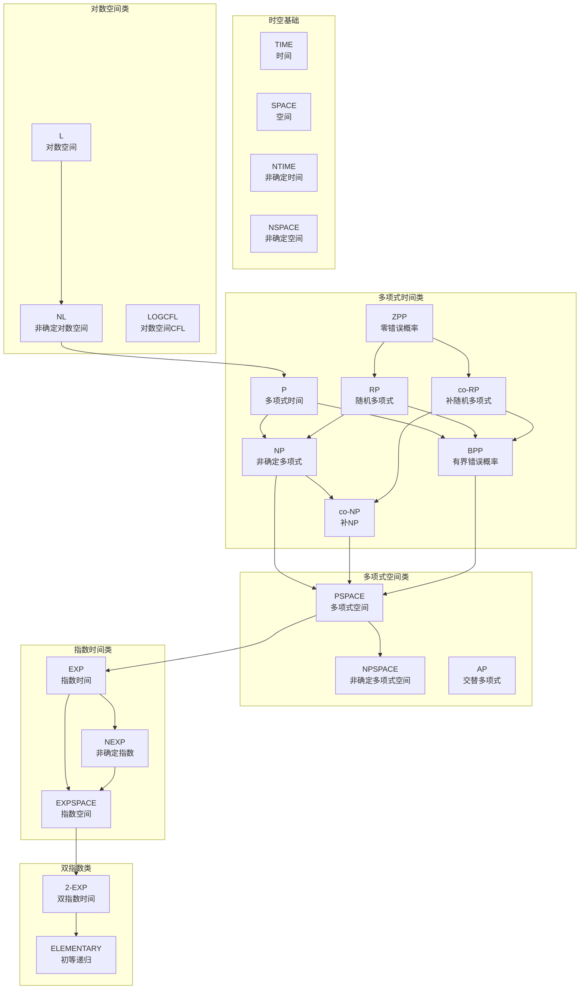
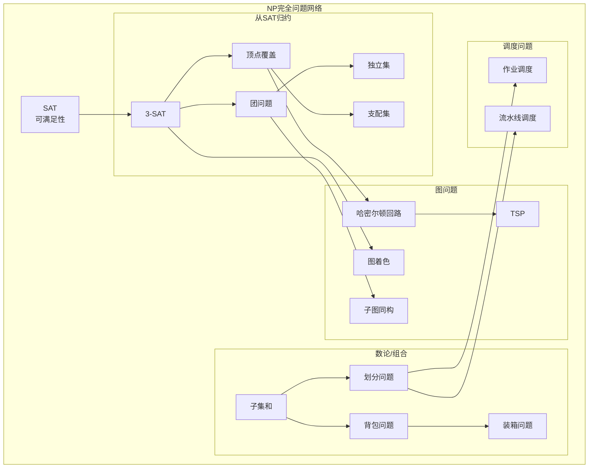
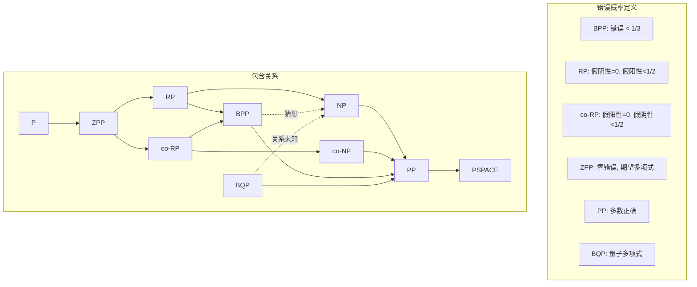
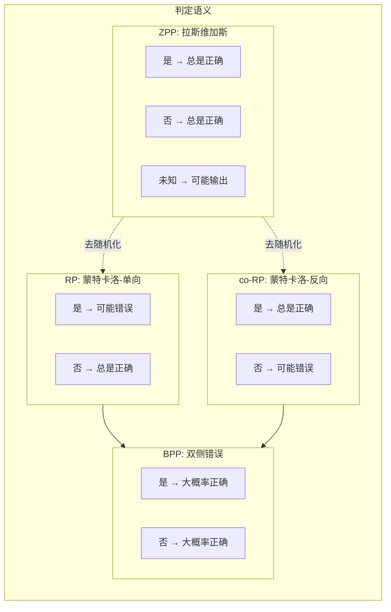
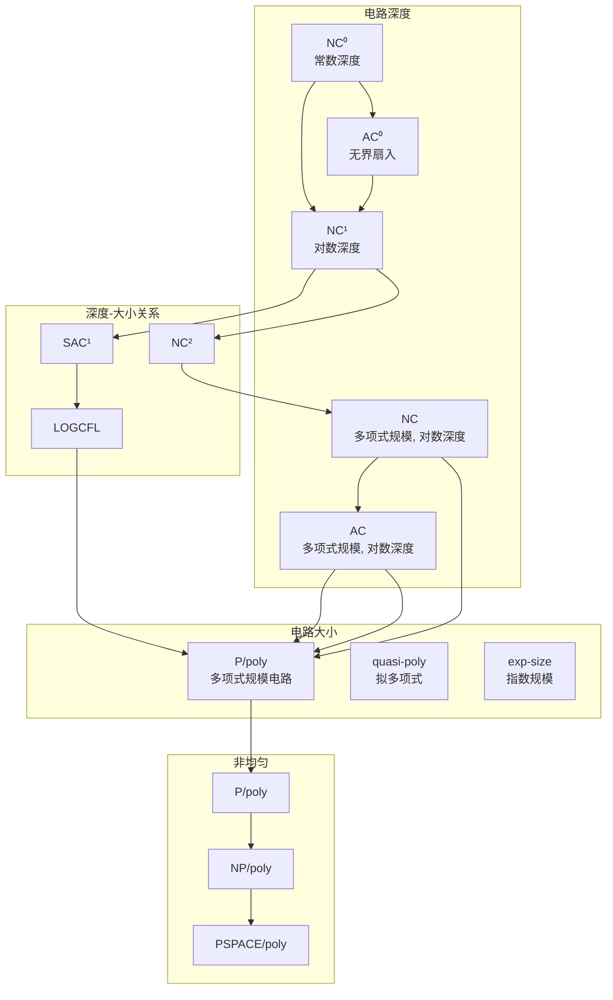
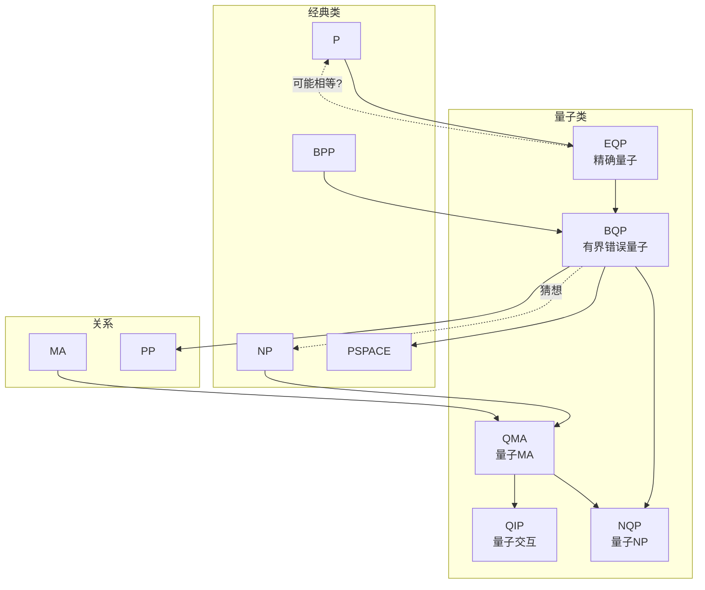
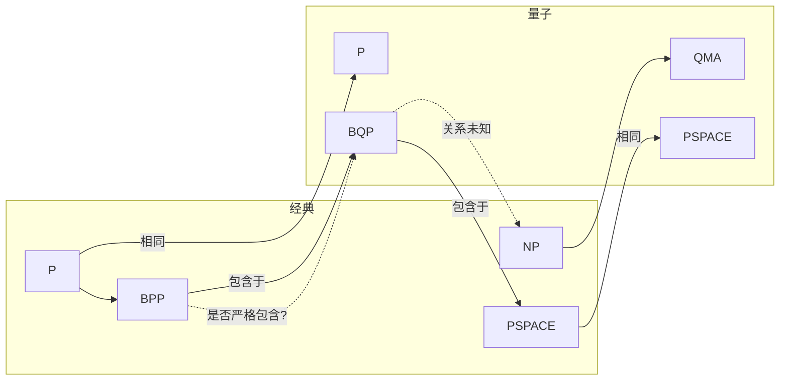
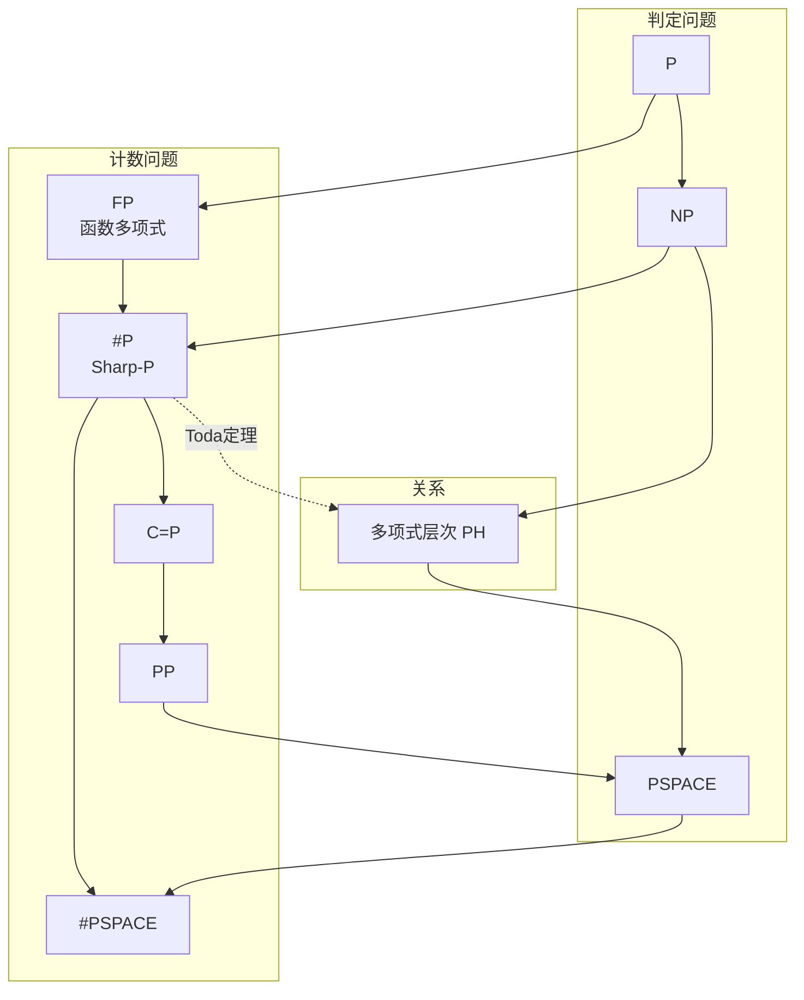

# 复杂度类层次图

> 计算复杂度理论完整图谱
> 涵盖经典、概率、交互、电路复杂度类

---

## 一、复杂度类总览

### 1.1 核心复杂度类全景图



---

## 二、P vs NP 世界

### 2.1 P, NP, NP完全关系

```mermaid
flowchart TB
    subgraph 世界划分
        direction TB
        P_AREA[P 区域]
        NPC_AREA[NP完全区域]
        NPI_AREA[NP中间区域]
    end

    subgraph 具体示例
        direction TB
        SORT[排序<br/>O(n log n)]
        MST[最小生成树<br/>Prim/Kruskal]
        LP[线性规划<br/>内点法]
        
        SAT[SAT<br/>第一个NP完全问题]
        TSP[TSP<br/>旅行商]
        CLIQUE[团问题<br/>最大团]
        3COL[3染色<br/>图着色]
        KNAP[背包问题<br/>0-1 Knapsack]
        
        FACTOR[因数分解<br/>候选NPI]
        GI[图同构<br/>准多项式时间]
        DLP[离散对数<br/>密码学基础]
    end

    P_AREA --> SORT
    P_AREA --> MST
    P_AREA --> LP
    
    NPC_AREA --> SAT
    NPC_AREA --> TSP
    NPC_AREA --> CLIQUE
    NPC_AREA --> 3COL
    NPC_AREA --> KNAP
    
    NPI_AREA --> FACTOR
    NPI_AREA --> GI
    NPI_AREA --> DLP
    
    P_AREA -.->|P = NP?| NPC_AREA
    NPI_AREA -.->|P ≠ NP时| NPC_AREA
```

### 2.2 NP完全性归约图



---

## 三、概率复杂度类

### 3.1 概率类层次结构



### 3.2 概率类语义对比



---

## 四、交互式证明系统

### 4.1 交互证明层次

```mermaid
graph TB
    subgraph 交互轮数
        IP0[IP[0] = NP]
        IP1[IP[1] = NP]
        IP2[IP[2]]
        IP_POLY[IP[poly]]
        AM[AM<br/>Arthur-Merlin]
        MA[MA<br/>Merlin-Arthur]
        MAM[MAM]
        AMA[AMA]
    end

    subgraph 概率证明
        PCP0[PCP[0] = P]
        PCP_LOG[PCP[log,1]]
        PCP_POLY[PCP[poly, 1]]
        PCP_CONST[PCP[O(1), O(1)]]
    end

    subgraph 量子交互
        QIP0[QIP[0] = PSPACE]
        QIP1[QIP[1] = PSPACE]
        QIP2[QIP[2] = PSPACE]
        QIP_POLY[QIP[poly] = PSPACE]
    end

    IP0 --> IP1
    IP1 --> IP2
    IP2 --> IP_POLY
    
    MA --> AM
    AM --> IP_POLY
    MA --> MAM
    AM --> AMA
    MAM --> AMA
    
    PCP0 --> PCP_LOG
    PCP_LOG --> PCP_CONST
    PCP_CONST --> NEXP
    
    IP_POLY --> QIP_POLY
    IP_POLY --> PSPACE
    QIP_POLY --> PSPACE
```

### 4.2 PCP定理可视化

```mermaid
flowchart TB
    subgraph PCP定理
        direction TB
        
        PCP_THM[PCP定理:<br/>NP = PCP[O(log n), O(1)]]
        
        subgraph 证明检验
            QUERY[查询位数: O(log n)]
            COINS[随机硬币: O(1)]
            VERIFY[验证概率: ≥ 3/4]
        end
        
        subgraph 等价形式
            GAP3SAT[GAP-3SAT难]
            LABEL[标签覆盖难]
            SETCOVER[集合覆盖难逼近]
        end
    end

    PCP_THM --> QUERY
    PCP_THM --> COINS
    PCP_THM --> VERIFY
    
    PCP_THM --> GAP3SAT
    GAP3SAT --> LABEL
    LABEL --> SETCOVER
```

---

## 五、空间复杂度类

### 5.1 空间层次结构

```mermaid
graph TB
    subgraph 确定性空间
        L[L = SPACE(log n)]
        LINSPACE[LINSPACE = SPACE(n)]
        PSPACE[PSPACE = SPACE(poly)]
        EXPSPACE[EXPSPACE = SPACE(exp)]
        2EXPSPACE[2-EXPSPACE]
    end

    subgraph 非确定性空间
        NL[NL = NSPACE(log n)]
        NPSPACE[NPSPACE = NSPACE(poly)]
        NEXPSPACE[NEXPSPACE]
    end

    subgraph 交替空间
        AL[AL = ASPACE(log n)]
        AP[AP = ASPACE(poly)]
    end

    subgraph 随机空间
        RL[RL]
        BPL[BPL]
        PL[PL]
    end

    L --> NL
    NL --> LINSPACE
    LINSPACE --> PSPACE
    
    L --> RL
    RL --> BPL
    BPL --> PL
    PL --> PSPACE
    
    L --> AL
    AL --> LINSPACE
    
    NL --> PSPACE
    NL --> NPSPACE
    NPSPACE --> EXPSPACE
    PSPACE --> NPSPACE
    PSPACE --> EXPSPACE
    EXPSPACE --> 2EXPSPACE
    NEXPSPACE --> 2EXPSPACE
```

### 5.2 空间-时间关系

```mermaid
graph TB
    subgraph 基本关系
        L[LOGSPACE]
        P[PTIME]
        PSPACE[PSPACE]
        EXP[EXPTIME]
    end

    subgraph 等价关系
        NL[NL]
        NPSPACE[NPSPACE = PSPACE]
        SAVITCH[Savitch定理:<br/>NSPACE(f(n)) ⊆ SPACE(f²(n))]
    end

    subgraph 非确定性
        NP[NP]
        NEXP[NEXP]
    end

    L --> NL
    NL --> P
    NL --> NP
    
    P --> NP
    NP --> PSPACE
    
    L --> P
    P --> PSPACE
    PSPACE --> EXP
    PSPACE --> NEXP
    
    NP --> NEXP
    EXP --> NEXP
```

---

## 六、电路复杂度类

### 6.1 电路类层次



### 6.2 均匀 vs 非均匀

```mermaid
flowchart TB
    subgraph 均匀复杂性
        direction TB
        
        P_U[P<br/>图灵机]
        NC_U[NC<br/>PRAM模型]
        LOG_U[L<br/>对数空间]
        
        note1["均匀: 电路可由图灵机在资源限制内生成"]
    end

    subgraph 非均匀复杂性
        direction TB
        
        P_POLY[P/poly<br/>多项式建议]
        NC_POLY[NC/poly]
        
        note2["非均匀: 允许无限建议字符串"]
    end

    subgraph 关系
        direction TB
        
        P_U ⊂ P_POLY
        NC_U ⊂ NC_POLY
        
        KARP_LIPTON[Karp-Lipton定理:<br/>NP ⊆ P/poly ⇒ PH = Σ₂]
    end

    P_U --> P_POLY
    NC_U --> NC_POLY
    NC_U --> P_U
    NC_POLY --> P_POLY
    
    P_POLY -.->|假设| KARP_LIPTON
```

---

## 七、量子复杂度类

### 7.1 量子计算层次



### 7.2 量子-经典对比



---

## 八、参数化复杂度类

### 8.1 FPT 与 W-层次

```mermaid
graph TB
    subgraph 参数化类
        FPT[FPT<br/>固定参数可解]
        XP[XP<br/>切片多项式]
        paraNP[para-NP]
    end

    subgraph W-层次
        W1[W[1]]
        W2[W[2]]
        W3[W[3]]
        Wt[W[t]]
        WH[W[P]]
        AW[AW[*]]
        AWPP[AW[P]]
        XP_para[XA]
    end

    subgraph 典型问题
        VC_FPT[顶点覆盖<br/>k-Vertex Cover]
        DS_W2[支配集<br/>k-Dominating Set]
        CLIQUE_W1[k-团<br/>W[1]-完全]
    end

    FPT --> VC_FPT
    W1 --> CLIQUE_W1
    W2 --> DS_W2
    
    FPT --> W1
    W1 --> W2
    W2 --> W3
    W3 --> Wt
    Wt --> WH
    WH --> AW
    AW --> AWPP
    AWPP --> XP_para
    
    FPT --> XP
    XP --> paraNP
    XP_para --> paraNP
```

---

## 九、计数复杂度类

### 9.1 计数类层次



---

## 十、ASCII 艺术表示

### 10.1 完整复杂度类层次 (ASCII)

```
                    复杂度类层次总览
                    ═══════════════

    确定性                    非确定性/概率
    ─────────                 ─────────────
    
                    ELEMENTARY
                         │
                         ▼
                    2-EXPSPACE
                         │
                    2-EXP ◄──┐
                         │    │
                    EXPSPACE   │
                         │     │
                    EXP ◄──────┤
                         │     │
                    NEXP ◄─────┘
                         │
                    PSPACE = NPSPACE = AP
                         │
                    PP ◄──┐
                         │  │
                    BQP ◄─┤  │
                         │  │  │
                    BPP ◄─┼──┤  │
                         │  │  │  │
                    coNP ◄─┤  │  │  │
                         │  │  │  │  │
                    NP ◄───┴──┤  │  │  │
                         │     │  │  │  │
                    RP ◄───────┤  │  │  │
                         │     │  │  │  │
                    ZPP ◄──────┴──┤  │  │
                         │        │  │  │
                    P ◄───────────┴──┴──┘
                         │
                    NC ◄──┤
                         │  │
                    NL ◄──┴──┤
                         │     │
                    L ◄────────┘

    关键包含关系: L ⊆ NL ⊆ P ⊆ NP ⊆ PSPACE ⊆ EXP ⊆ EXPSPACE
    
    已知严格包含:
    • L ⊂ PSPACE
    • P ⊂ EXPTIME
    • NL ⊂ NPSPACE (by Savitch)
```

### 10.2 多项式层次 (Polynomial Hierarchy) ASCII

```
                    多项式层次 PH
                    ════════════

    第0层:
    ┌─────────────────┐
    │      P          │
    └────────┬────────┘
             │
    第1层:   ▼
    ┌─────────────────────────────────────┐
    │   NP           │       co-NP        │
    │  (Σ₁P)         │       (Π₁P)        │
    └────────┬───────┴───────┬────────────┘
             │               │
             ▼               ▼
    第2层:
    ┌─────────────────────────────────────┐
    │  Σ₂P           │       Π₂P          │
    │  NP^NP         │       coNP^NP      │
    └────────┬───────┴───────┬────────────┘
             │               │
             ▼               ▼
    第3层:
    ┌─────────────────────────────────────┐
    │  Σ₃P           │       Π₃P          │
    │  NP^Σ₂P        │       coNP^Σ₂P     │
    └────────┬───────┴───────┬────────────┘
             │               │
             ▼               ▼
            ...             ...
             │               │
             ▼               ▼
    第k层:
    ┌─────────────────────────────────────┐
    │  ΣₖP           │       ΠₖP          │
    │  NP^Σₖ₋₁P      │       coNP^Σₖ₋₁P   │
    └────────┬───────┴───────┬────────────┘
             │               │
             └───────┬───────┘
                     ▼
    并集:
    ┌─────────────────────────────────────┐
    │              PH = ∪ₖ ΣₖP            │
    └─────────────────────────────────────┘
                     │
                     ▼
    ┌─────────────────────────────────────┐
    │             PSPACE                  │
    └─────────────────────────────────────┘

    重要性质:
    • 如果 ΣₖP = ΠₖP，则 PH 坍缩到第 k 层
    • 如果 P = NP，则 PH = P
    • PSPACE = AP (交替多项式时间)
```

### 10.3 PCP定理图示 (ASCII)

```
                    PCP定理
                    ═══════

    经典NP验证:
    ┌─────────────────────────────────────────────┐
    │  证明者            验证者                    │
    │     │                │                       │
    │     │─── 完整证明 ──▶│                       │
    │     │    (多项式长度) │                       │
    │     │                │  读取全部             │
    │     │                │  确定性计算           │
    │     │                │  接受/拒绝            │
    │     │                ▼                       │
    └─────────────────────────────────────────────┘

    PCP验证:
    ┌─────────────────────────────────────────────┐
    │  证明者            验证者                    │
    │     │                │                       │
    │     │─── 编码证明 ──▶│                       │
    │     │   (多项式长度)  │                       │
    │     │                │  随机选择 O(log n) 位 │
    │     │                │  查询 O(1) 个位置     │
    │     │                │  概率性验证           │
    │     │                │  错误 ≤ 1/3           │
    │     │                ▼                       │
    └─────────────────────────────────────────────┘

    PCP定理: NP = PCP[O(log n), O(1)]
    
    即: 任何NP问题的证明可以被转换为一种形式，使得验证者
        只需要随机选择 O(log n) 位，查询证明的 O(1) 个
        位置，即可在常数概率内正确判定。
```

---

## 十一、复杂度类速查表

| 类名 | 全称 | 定义 | 包含关系 |
|-----|------|------|---------|
| L | LOGSPACE | 对数空间 | ⊆ NL |
| NL | NLOGSPACE | 非确定对数空间 | ⊆ P |
| P | PTIME | 多项式时间 | ⊆ NP |
| NP | NPTIME | 非确定多项式时间 | ⊆ PSPACE |
| coNP | co-NP | NP的补 | ⊆ PSPACE |
| RP | Random P | 单侧错误随机 | ⊆ NP |
| coRP | co-RP | RP的补 | ⊆ coNP |
| ZPP | Zero-error P | 零错误期望多项式 | = RP ∩ coRP |
| BPP | Bounded-error P | 双侧错误随机 | ⊆ PSPACE |
| PP | Probabilistic P | 多数正确 | ⊆ PSPACE |
| PSPACE | Polynomial Space | 多项式空间 | = NPSPACE |
| EXP | Exponential Time | 指数时间 | ⊆ NEXP |
| NEXP | Nondet EXP | 非确定指数 | ⊆ EXPSPACE |
| BQP | Bounded-error Quantum P | 量子多项式 | ⊆ PP |
| QMA | Quantum MA | 量子Merlin-Arthur | ⊆ NQP |

---

*文档生成时间: 2025年4月*
*版本: v1.0*
*涵盖复杂度类: 80+* 
