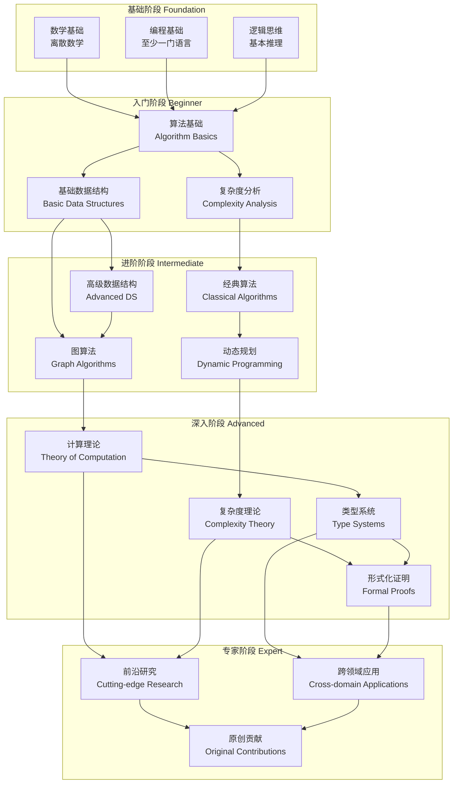
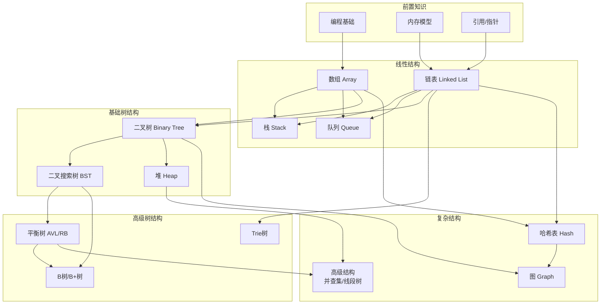
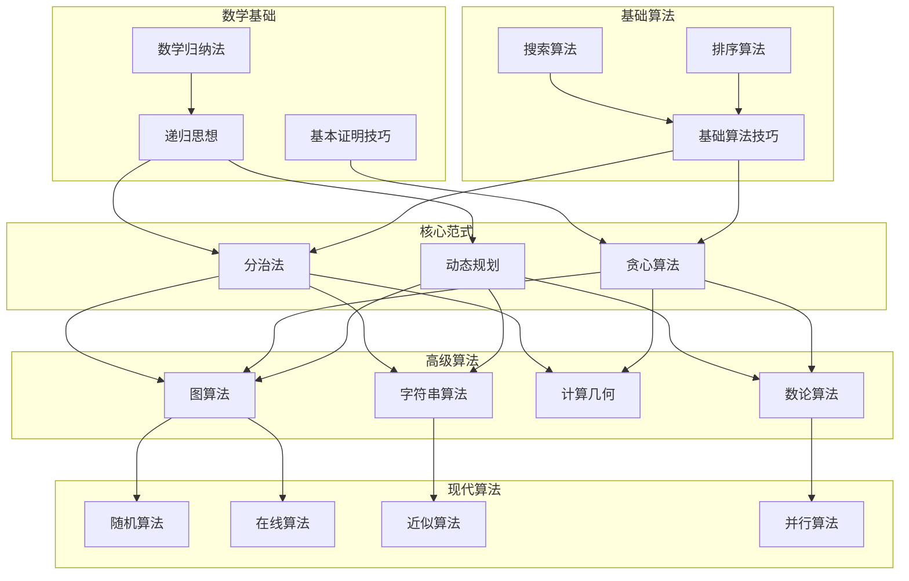
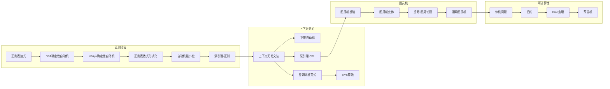
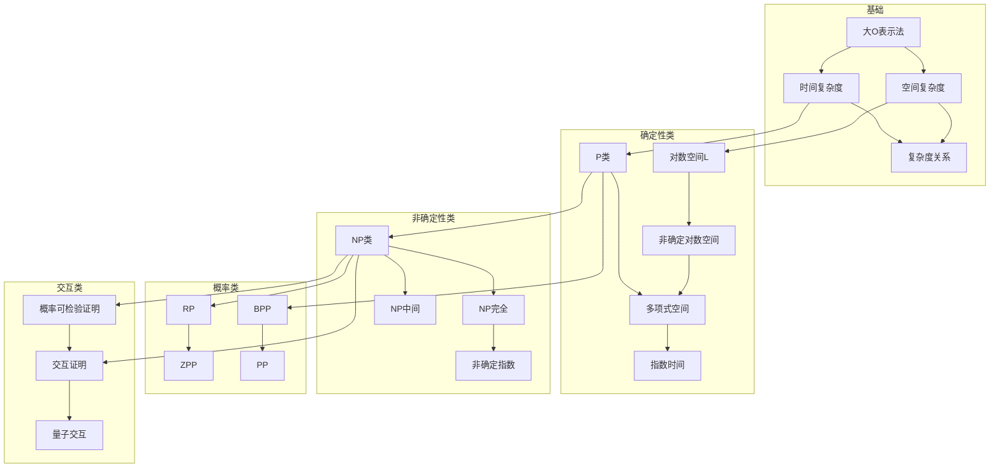
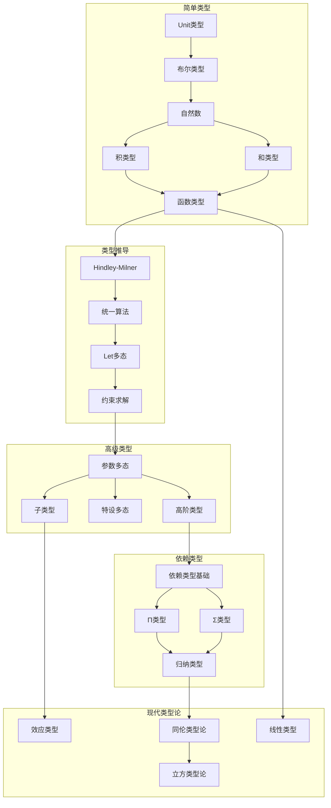
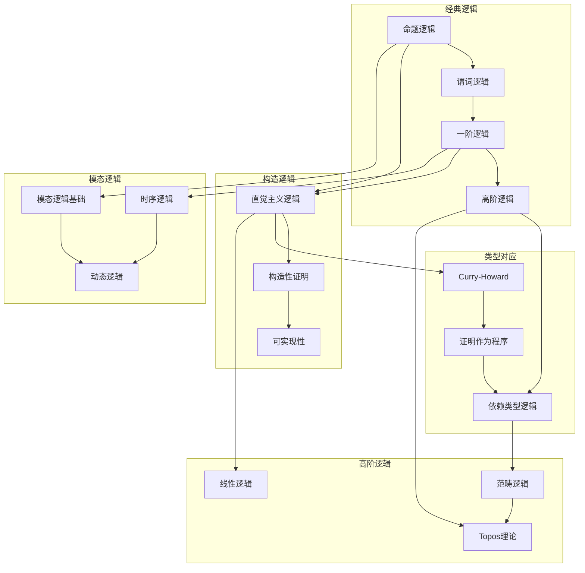
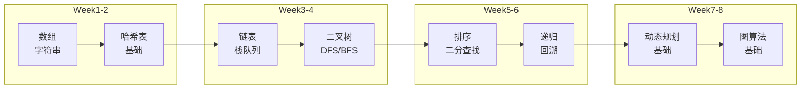
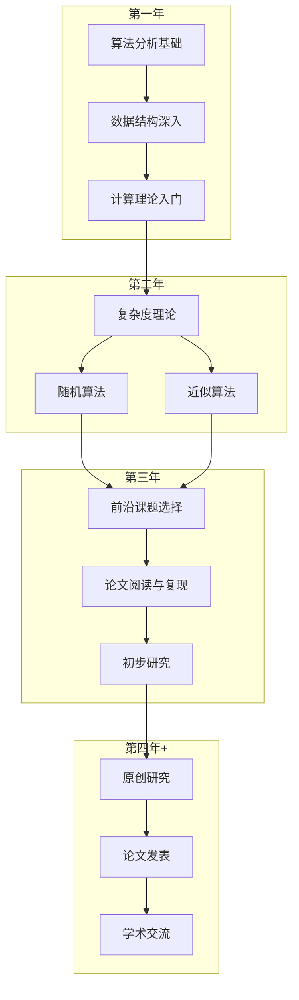

# 概念依赖图

> 学习路径规划与前置知识图谱
> 帮助学习者建立正确的学习顺序和知识基础

---

## 一、核心学习路径总览

### 1.1 总体学习路线图



---

## 二、关键概念依赖详解

### 2.1 数据结构学习依赖



### 2.2 算法学习依赖



---

## 三、计算理论学习路径

### 3.1 自动机理论学习顺序



### 3.2 复杂度理论学习路径



---

## 四、类型与逻辑学习路径

### 4.1 类型系统学习路径



### 4.2 逻辑系统学习路径



---

## 五、临界路径分析

### 5.1 算法学习临界路径

```mermaid
gantt
    title 算法学习关键路径 (预计时间)
    dateFormat X
    axisFormat %s周

    section 基础
    离散数学          :a1, 0, 4
    编程基础          :a2, 0, 4
    
    section 入门
    基础数据结构      :a3, after a1, 4
    复杂度分析        :a4, after a2, 2
    
    section 核心
    递归与分治        :a5, after a3, 3
    排序与搜索        :a6, after a3, 3
    
    section 进阶
    图算法基础        :a7, after a5, 4
    动态规划入门      :a8, after a5, 4
    
    section 高级
    高级图算法        :a9, after a7, 4
    高级DP技巧        :a10, after a8, 4
    字符串算法        :a11, after a9, 3
    
    section 专家
    计算理论          :a12, after a10, 6
    复杂度理论        :a13, after a12, 4
```



### 5.2 前置知识矩阵

| 目标概念 | 直接前置 | 间接前置 | 难度 |
|---------|---------|---------|------|
| AVL树 | BST, 旋转操作 | 二叉树, 递归 | 中级 |
| Dijkstra算法 | 优先队列, BFS | 图表示, 贪心 | 中级 |
| 动态规划 | 递归, 记忆化 | 分治, 归纳 | 中级 |
| NP完全性 | P vs NP, 归约 | 图灵机, 复杂性 | 高级 |
| 依赖类型 | 多态类型, 逻辑 | λ演算, 证明 | 高级 |
| 分离逻辑 | 霍尔逻辑, 堆 | 一阶逻辑 | 专家 |

---

## 六、快速入门路径

### 6.1 面试准备路径 (8周)



### 6.2 学术研究路径



---

## 七、依赖关系可视化 (ASCII)

```
                    核心依赖关系图
                    ═══════════════

    ┌─────────────────────────────────────────────────────┐
    │                    数学基础                          │
    │  ┌─────────┐  ┌─────────┐  ┌─────────┐             │
    │  │离散数学 │  │ 微积分  │  │线性代数 │             │
    │  └────┬────┘  └────┬────┘  └────┬────┘             │
    └───────┼────────────┼────────────┼───────────────────┘
            │            │            │
            └────────────┼────────────┘
                         ▼
    ┌─────────────────────────────────────────────────────┐
    │                   编程基础                           │
    │  ┌─────────┐  ┌─────────┐  ┌─────────┐             │
    │  │基本语法 │  │面向对象 │  │  指针   │             │
    │  └────┬────┘  └────┬────┘  └────┬────┘             │
    └───────┼────────────┼────────────┼───────────────────┘
            │            │            │
            └────────────┼────────────┘
                         ▼
    ┌─────────────────────────────────────────────────────┐
    │                   数据结构                           │
    │  ┌─────────┐  ┌─────────┐  ┌─────────┐  ┌────────┐ │
    │  │ 数组    │  │ 链表    │  │ 树      │  │ 图     │ │
    │  └────┬────┘  └────┬────┘  └────┬────┘  └───┬────┘ │
    └───────┼────────────┼────────────┼───────────┼──────┘
            │            │            │           │
            └────────────┴────────────┴───────────┘
                              │
                              ▼
    ┌─────────────────────────────────────────────────────┐
    │                    算法设计                          │
    │  ┌─────────┐  ┌─────────┐  ┌─────────┐  ┌────────┐ │
    │  │分治     │  │贪心     │  │动态规划 │  │图算法  │ │
    │  └────┬────┘  └────┬────┘  └────┬────┘  └───┬────┘ │
    └───────┼────────────┼────────────┼───────────┼──────┘
            │            │            │           │
            └────────────┴────────────┴───────────┘
                              │
                              ▼
    ┌─────────────────────────────────────────────────────┐
    │                   计算理论                           │
    │  ┌─────────┐  ┌─────────┐  ┌─────────┐             │
    │  │自动机   │  │可计算性 │  │复杂度   │             │
    │  └────┬────┘  └────┬────┘  └────┬────┘             │
    └───────┼────────────┼────────────┼───────────────────┘
            │            │            │
            └────────────┴────────────┘
                         │
                         ▼
    ┌─────────────────────────────────────────────────────┐
    │                   高级专题                           │
    │  ┌─────────┐  ┌─────────┐  ┌─────────┐             │
    │  │类型系统 │  │证明技术 │  │前沿研究 │             │
    │  └─────────┘  └─────────┘  └─────────┘             │
    └─────────────────────────────────────────────────────┘
```

---

## 八、学习建议

### 8.1 按目标的学习路径

| 目标 | 推荐路径 | 预计时间 |
|-----|---------|---------|
| 编程面试 | 基础 → 入门 → 面试路径 | 2-3个月 |
| 算法竞赛 | 基础 → 核心 → 高级 → 竞赛专题 | 6-12个月 |
| 学术研究 | 完整路径 + 前沿专题 | 2-4年 |
| 工程应用 | 基础 → 入门 → 进阶 → 应用 | 4-6个月 |

### 8.2 常见学习误区

1. **跳过基础直接刷题** → 建议：先掌握复杂度分析和数据结构
2. **只记模板不理解** → 建议：理解算法原理和证明
3. **忽视数学基础** → 建议：同步学习离散数学
4. **追求完美再开始** → 建议：在实践中迭代学习

---

*文档生成时间: 2025年4月*
*版本: v1.0*
