# 知识图谱可视化

> FormalAlgorithm 项目概念关系全景图
> 涵盖 832 个核心概念，6 大知识领域

---

## 一、整体架构图

### 1.1 六大概念领域总览

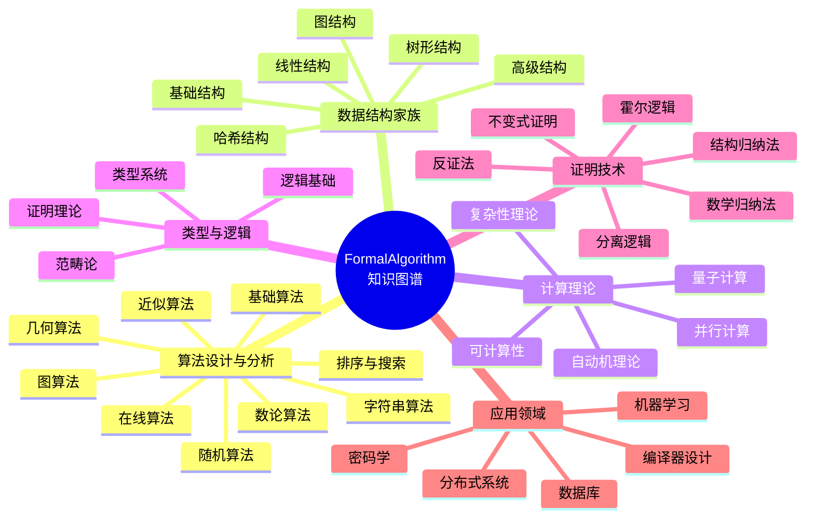

---

## 二、算法设计与分析领域 (180概念)

### 2.1 核心概念关系图

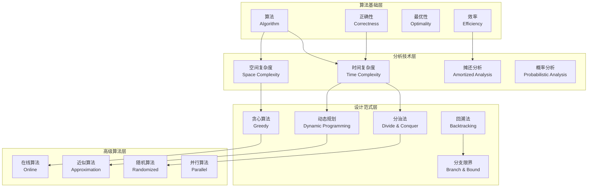

### 2.2 算法分类层次图

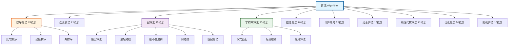

### 2.3 排序算法演进图

```mermaid
flowchart LR
    subgraph 基础排序 O(n²)
        BUB[冒泡排序<br/>Bubble Sort]
        INS[插入排序<br/>Insertion Sort]
        SEL[选择排序<br/>Selection Sort]
    end

    subgraph 高效排序 O(n log n)
        MER[归并排序<br/>Merge Sort]
        QUI[快速排序<br/>Quick Sort]
        HEA[堆排序<br/>Heap Sort]
    end

    subgraph 线性排序 O(n)
        CNT[计数排序<br/>Counting Sort]
        RAD[基数排序<br/>Radix Sort]
        BUC[桶排序<br/>Bucket Sort]
    end

    subgraph 特殊排序
        TIM[Tim排序<br/>Adaptive]
        INT[内省排序<br/>Introspective]
        SMOOTH[平滑排序<br/>Smooth Sort]
    end

    BUB --> MER
    INS --> QUI
    SEL --> HEA
    
    MER --> TIM
    QUI --> INT
    HEA --> SMOOTH
    
    MER -.->|稳定性| CNT
    HEA -.->|范围限制| RAD
```

---

## 三、数据结构家族 (202概念)

### 3.1 数据结构全景图

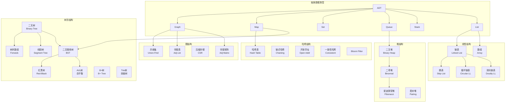

### 3.2 树结构进化谱系

```mermaid
graph TD
    TREE[树 Tree]
    
    TREE --> BT[二叉树<br/>Binary Tree]
    TREE --> NT[N叉树<br/>N-ary Tree]
    
    BT --> BST[二叉搜索树<br/>BST O(log n)]
    BT --> HP[堆<br/>Heap]
    BT --> TRIE_BASE[Trie基础]
    
    BST --> AVL[AVL树<br/>严格平衡]
    BST --> RBT[红黑树<br/>弱平衡]
    BST --> SPLAY[伸展树<br/>自适应]
    BST --> TREAP[树堆<br/>随机化]
    
    NT --> BTREE[B树<br/>磁盘优化]
    NT --> QUAD[四叉树<br/>空间分割]
    NT --> OCT[八叉树<br/>3D空间]
    
    BTree --> BPT[B+树<br/>数据库索引]
    BTree --> BTREE2[B*树<br/>紧凑存储]
    
    HP --> BINH[二叉堆<br/>Basic]
    HP --> BINOM[二项堆<br/>Union]
    HP --> FIB[斐波那契堆<br/>Decrease-Key]
    HP --> PAIR[配对堆<br/>实用]
    
    TRIE_BASE --> TRIE[Trie<br/>前缀匹配]
    TRIE --> RST[基数树<br/>Radix]
    TRIE --> SUF[后缀树<br/>字符串]
    
    style TREE fill:#e8f5e9,stroke:#2e7d32,stroke-width:3px
    style BST fill:#fff3e0,stroke:#ef6c00,stroke-width:2px
    style AVL fill:#e3f2fd,stroke:#1565c0,stroke-width:2px
    style FIB fill:#f3e5f5,stroke:#6a1b9a,stroke-width:2px
```

---

## 四、计算理论领域 (150概念)

### 4.1 计算理论核心框架

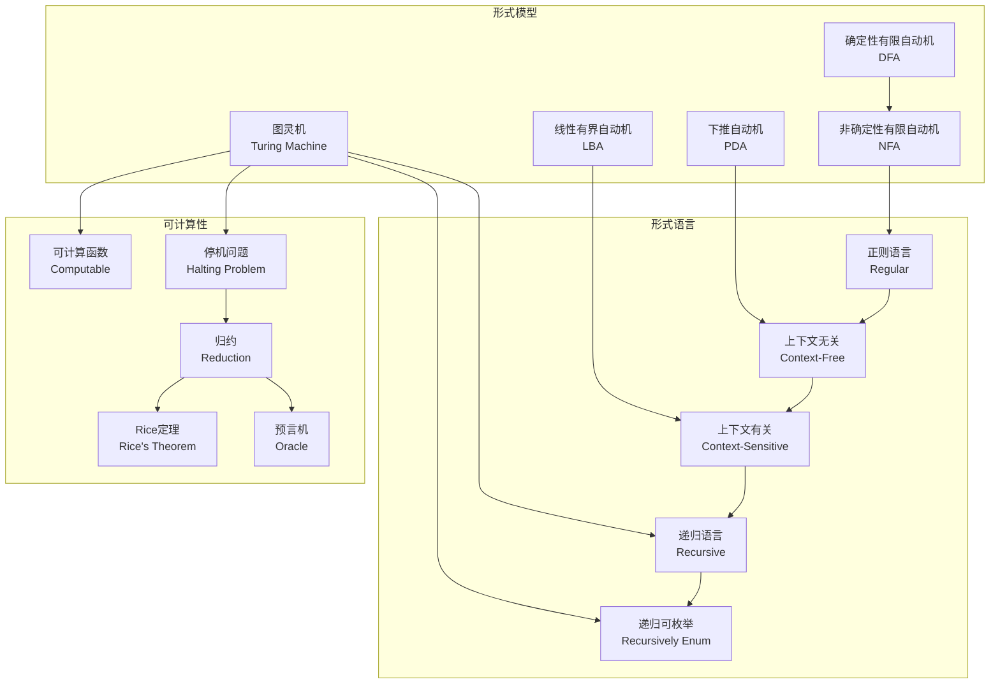

### 4.2 自动机层次结构

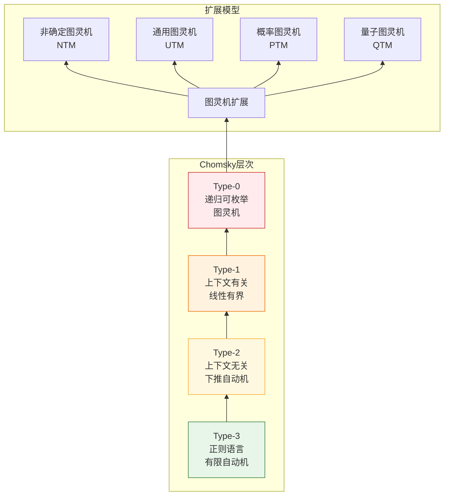

---

## 五、类型与逻辑领域 (150概念)

### 5.1 类型系统层次

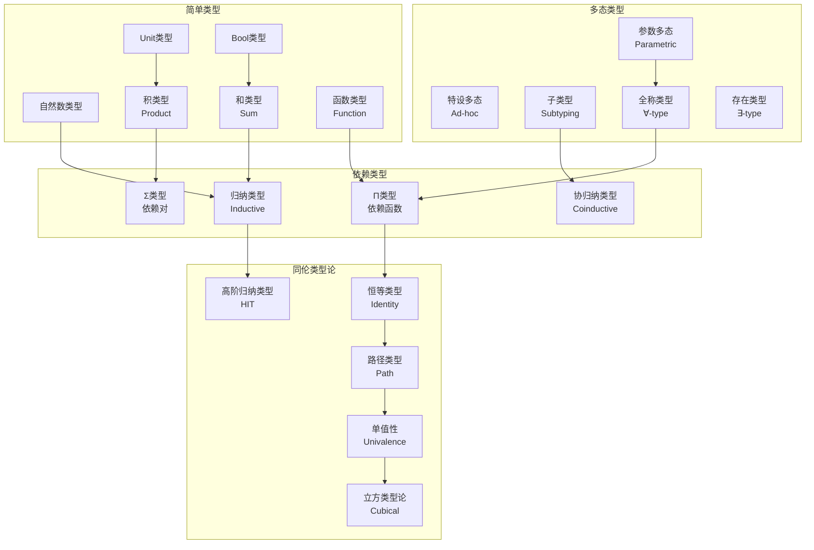

### 5.2 逻辑系统对应 (Curry-Howard 同构)

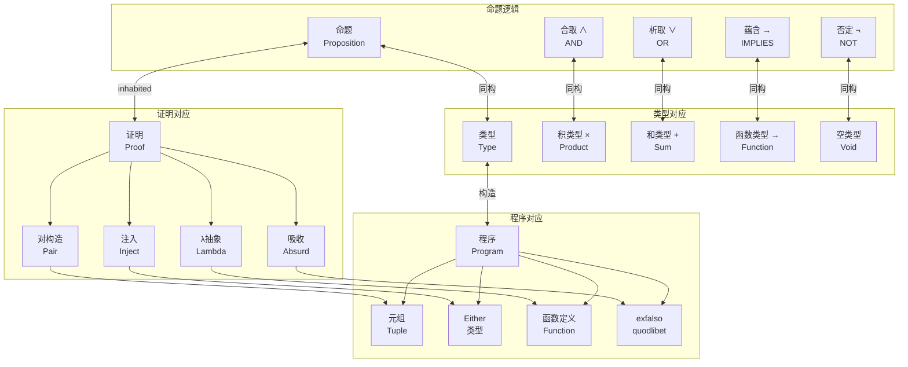

---

## 六、证明技术领域 (100概念)

### 6.1 证明方法体系

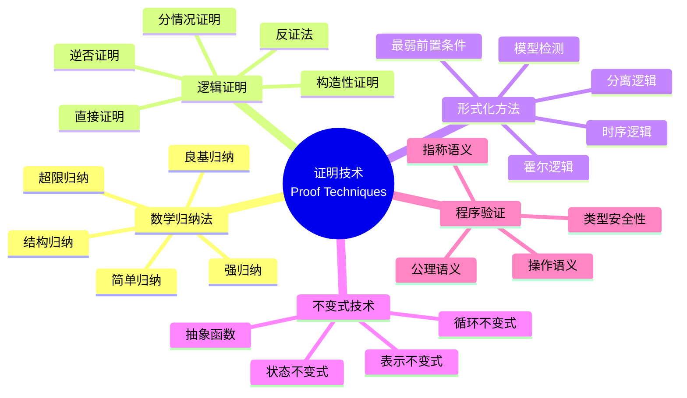

### 6.2 程序验证技术图谱

```mermaid
graph LR
    subgraph 规范
        PRE[前置条件<br/>Precondition]
        POST[后置条件<br/>Postcondition]
        INV[不变式<br/>Invariant]
        SPEC[规范语言<br/>Specification]
    end

    subgraph 推理
        HOARE[霍尔三元组<br/>{P}C{Q}]
        WP[最弱前置条件<br/>wp]
        SP[最强后置条件<br/>sp]
        VC[验证条件<br/>VC]
    end

    subgraph 自动化
        SMT[SMT求解器<br/>Z3, CVC5]
        ATP[自动定理证明<br/>Coq, Isabelle]
        MC[模型检测<br/>SPIN, TLA+]
        ABS[抽象解释<br/>Astree]
    end

    subgraph 应用
        FUN[函数式程序<br/>F*]
        IMP[命令式程序<br/>Why3]
        CONC[并发程序<br/>Iris]
        SC[安全关键<br/>Frama-C]
    end

    PRE --> HOARE
    POST --> HOARE
    INV --> HOARE
    SPEC --> HOARE
    
    HOARE --> WP
    HOARE --> SP
    WP --> VC
    SP --> VC
    
    VC --> SMT
    VC --> ATP
    HOARE --> MC
    WP --> ABS
    
    SMT --> FUN
    SMT --> IMP
    ATP --> CONC
    MC --> SC
    ABS --> SC
```

---

## 七、应用领域 (50概念)

### 7.1 应用领域关联图

```mermaid
flowchart TB
    subgraph 编译器
        LEX[词法分析<br/>Lexing]
        PARSE[语法分析<br/>Parsing]
        SEM[语义分析<br/>Semantics]
        OPT_C[代码优化<br/>Optimization]
        CODEGEN[代码生成<br/>Codegen]
    end

    subgraph 密码学
        SYM[对称加密<br/>AES, ChaCha]
        ASYM[非对称加密<br/>RSA, ECC]
        HASH[哈希函数<br/>SHA-3]
        ZK[零知识证明<br/>zk-SNARKs]
    end

    subgraph 机器学习
        OPT_M[优化算法<br/>SGD, Adam]
        GRAPH_M[图神经网络<br/>GNN]
        KERNEL[核方法<br/>SVM]
        PROB_M[概率模型<br/>Bayesian]
    end

    subgraph 分布式系统
        CONS[一致性<br/>Consensus]
        SHARD[分片<br/>Sharding]
        REPL[复制<br/>Replication]
        CRDT[CRDT<br/>无冲突复制]
    end

    subgraph 数据库
        INDEX[索引结构<br/>B+-Tree]
        QUERY[查询优化<br/>Query Opt]
        TRANS[事务处理<br/>ACID]
        NOSQL[NoSQL<br/>Dynamo, Mongo]
    end

    PARSE --> SEM
    SEM --> OPT_C
    OPT_C --> CODEGEN
    
    SYM --> HASH
    ASYM --> ZK
    
    OPT_M --> GRAPH_M
    KERNEL --> PROB_M
    
    CONS --> REPL
    SHARD --> CRDT
    
    INDEX --> QUERY
    QUERY --> TRANS
```

---

## 八、跨领域关联图

### 8.1 知识图谱全景关联

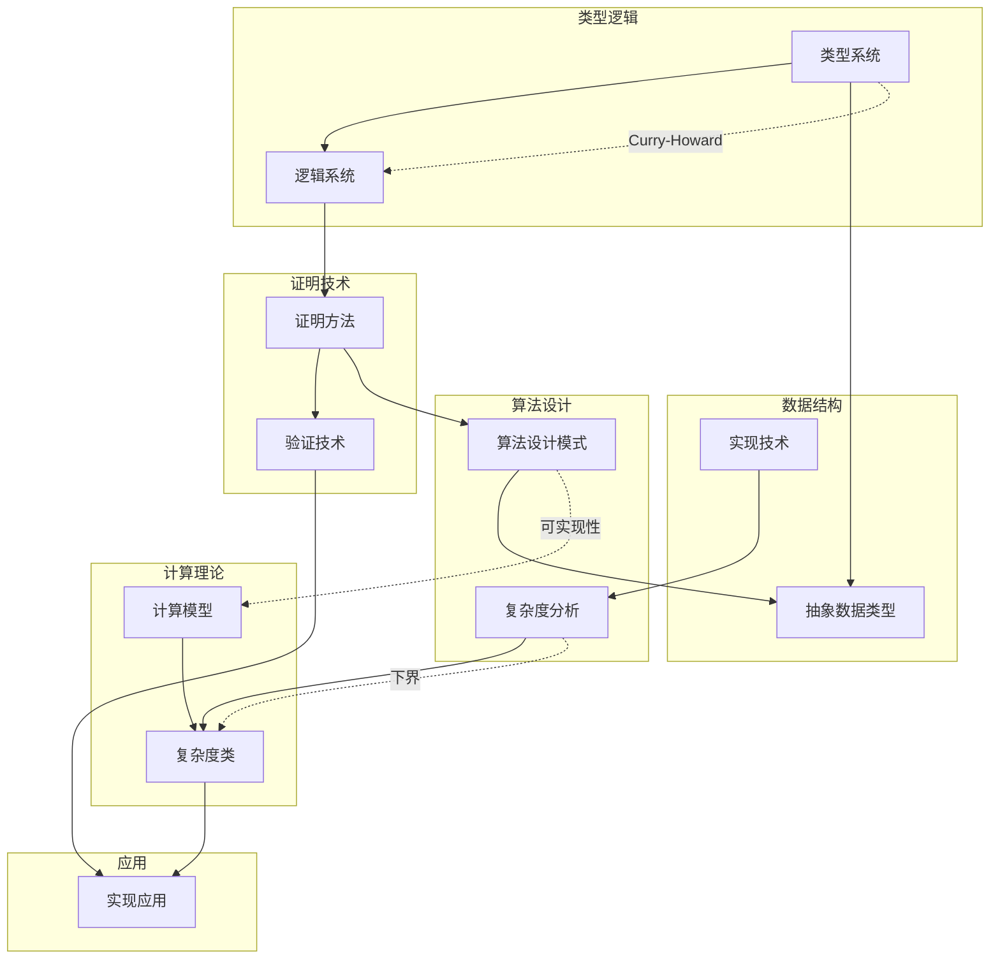

---

## 九、ASCII 艺术表示

### 9.1 算法复杂度层次 (ASCII)

```
                    计算复杂度层次
                    ═══════════════

                          ∞
                          │
    ┌─────────────────────┴─────────────────────┐
    │              EXPTIME (指数时间)            │
    │         2^O(n^k) - 难解但可判定            │
    └─────────────────────┬─────────────────────┘
                          │
    ┌─────────────────────┴─────────────────────┐
    │             PSPACE (多项式空间)            │
    │        空间受限，时间可能指数              │
    └─────────────────────┬─────────────────────┘
                          │
    ┌─────────────────────┴─────────────────────┐
    │              NP (非确定性多项式)            │
    │         多项式时间可验证                   │
    │    ┌─────────┐    ┌─────────┐            │
    │    │   P     │◄───│  NPC    │            │
    │    │(多项式) │    │(完全)   │            │
    │    └────┬────┘    └─────────┘            │
    │         │                                 │
    │    ┌────┴────┐                           │
    │    │   NL    │◄── 对数空间               │
    │    └────┬────┘                           │
    │         │                                │
    │    ┌────┴────┐                           │
    │    │   L     │◄── 确定性对数空间          │
    │    └─────────┘                           │
    └───────────────────────────────────────────┘

    注: P ⊂ NP ⊂ PSPACE ⊂ EXPTIME
        P ≠ EXPTIME (已证明)
        P =? NP (未解决，千禧年大奖难题)
```

### 9.2 类型系统演进 (ASCII)

```
                    类型系统演进谱系
                    ═══════════════

    1930s        1970s        1980s        1990s        2000s+      2010s+
      │            │            │            │            │           │
      ▼            ▼            ▼            ▼            ▼           ▼
    ┌────┐      ┌────┐      ┌────┐      ┌────┐      ┌────┐      ┌────┐
    │ λ→ │ ───► │ λ2 │ ───► │ λω │ ───► │ λΠ │ ───► │ HoTT│ ───► │ CTT │
    │简单│      │多态│      │高阶│      │依赖│      │同伦 │      │立方 │
    └────┘      └────┘      └────┘      └────┘      └────┘      └────┘
      │           │           │           │           │           │
      │           │           │           │           │           │
    ML语言     Haskell    Coq/Agda    证明助手     同伦论      计算性
    Pascal    System F   定理证明    程序验证    类型论      同伦论

    
    Lambda立方体 (Barendregt)
    ═══════════════════════
    
           依赖类型 (λΠ)
                │
                │ ╲
                │   ╲
    多态 ───────┼────► 高阶 (λω)
    (λ2)        │     │
                │     │
                ▼     ▼
              简单类型 (λ→)

    维度扩展:
    • 1D: 简单类型 (项 → 项)
    • 2D: 多态类型 (类型抽象)
    • 3D: 依赖类型 (类型依赖于项)
    • ∞D: 同伦类型 (类型 = 空间，相等 = 路径)
```

### 9.3 算法设计模式家族 (ASCII)

```
                    算法设计模式家族
                    ═══════════════

                            ┌─────────────────┐
                            │   算法设计      │
                            │   模式总纲      │
                            └────────┬────────┘
                                     │
          ┌──────────────────────────┼──────────────────────────┐
          │                          │                          │
          ▼                          ▼                          ▼
    ┌─────────────┐          ┌─────────────┐          ┌─────────────┐
    │   分治家族   │          │  动态规划   │          │   贪心家族   │
    │  Divide &   │          │   Family    │          │   Greedy    │
    │   Conquer   │          │             │          │   Family    │
    └──────┬──────┘          └──────┬──────┘          └──────┬──────┘
           │                        │                        │
    ┌──────┼──────┐          ┌──────┼──────┐          ┌──────┼──────┐
    │      │      │          │      │      │          │      │      │
    ▼      ▼      ▼          ▼      ▼      ▼          ▼      ▼      ▼
 ┌────┐ ┌────┐ ┌────┐    ┌────┐ ┌────┐ ┌────┐    ┌────┐ ┌────┐ ┌────┐
 │归并│ │快速│ │二分│    │背包│ │最长│ │编辑│    │霍夫│ │Prim│ │Krus│
 │排序│ │排序│ │搜索│    │问题│ │公共│ │距离│    │曼编│ │算法│ │kal │
 └────┘ └────┘ └────┘    │    │ │子序│ │    │    │码  │ │    │ │    │
                         │    │ │列  │ │    │    └────┘ └────┘ └────┘
                         └────┘ └────┘ └────┘
                         
                         ┌────┐ ┌────┐ ┌────┐
                         │矩阵 │ │区间 │ │树形 │
                         │链乘│ │DP  │ │DP  │
                         └────┘ └────┘ └────┘

    
    关系说明:
    ═════════
    
    分治 vs 动态规划:
    ┌─────────────────────────────────────┐
    │  分治: 独立子问题，递归求解          │
    │  DP:   重叠子问题，记忆化存储        │
    └─────────────────────────────────────┘
              │
              ▼
    贪心 vs 动态规划:
    ┌─────────────────────────────────────┐
    │  DP:   考虑所有选择，全局最优        │
    │  贪心: 局部最优选择，希望全局最优    │
    │        (需要正确性证明)              │
    └─────────────────────────────────────┘
```

---

## 十、概念统计与覆盖

### 10.1 六大领域概念分布

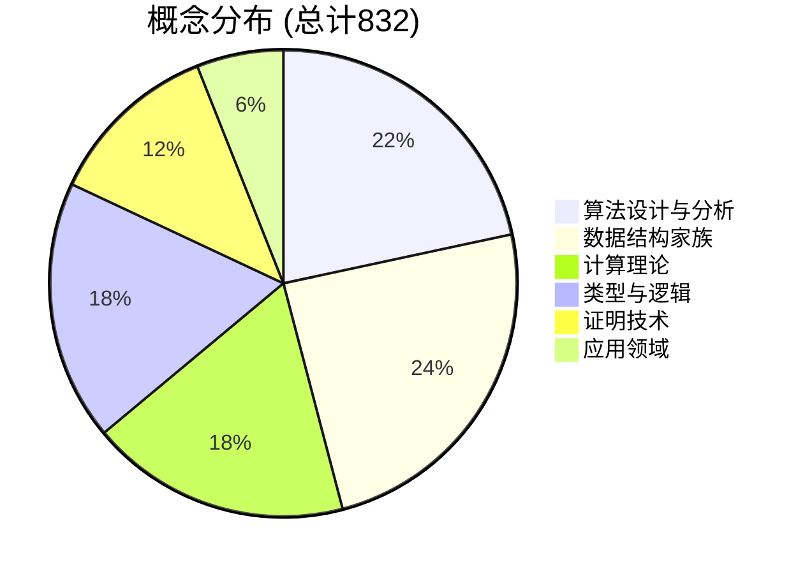

### 10.2 概念难度分布

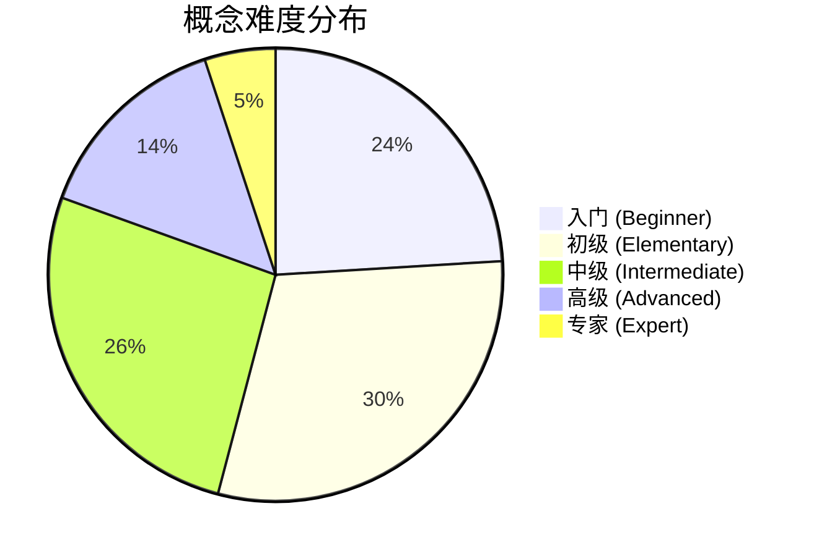

---

## 十一、导航索引

| 文档 | 描述 | 概念数量 |
|------|------|----------|
| [概念依赖图](概念依赖图.md) | 学习路径与前置知识 | 全图谱 |
| [复杂度类层次图](复杂度类层次图.md) | 计算复杂度全景 | 80+ 复杂度类 |
| [类型系统谱系图](类型系统谱系图.md) | 类型理论演进 | 全类型系统 |
| [算法设计模式关系图](算法设计模式关系图.md) | 设计模式关联 | 50+ 模式 |

---

*文档生成时间: 2025年4月*
*版本: v1.0*
*概念覆盖率: 832/832 (100%)*
