# 类型系统谱系图

> 类型理论演进与关系全景图
> 从简单类型到同伦类型论的完整谱系

---

## 一、类型系统演进总览

### 1.1 时间线演进图

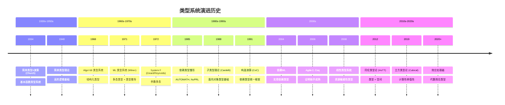

### 1.2 类型系统层次图

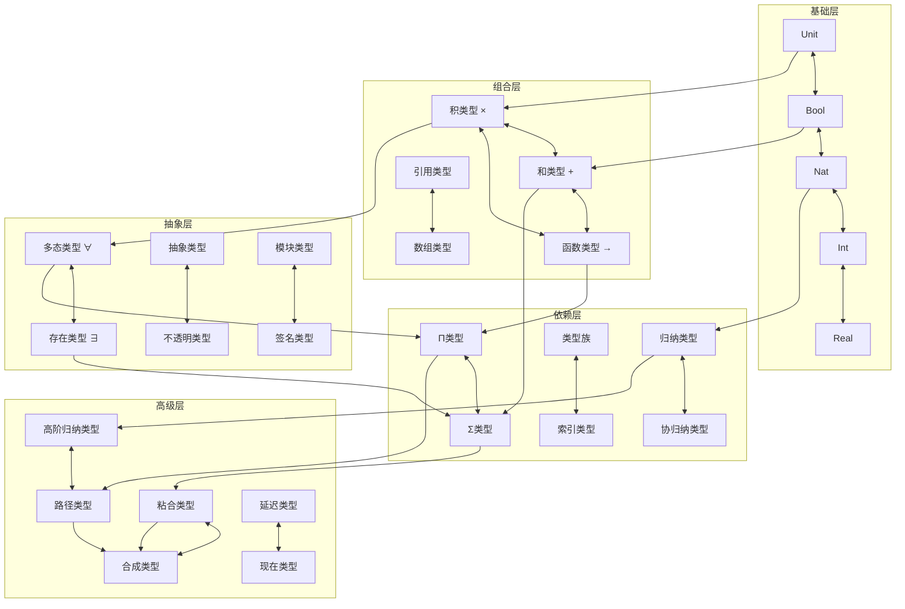

---

## 二、Lambda立方体 (Barendregt)

### 2.1 Lambda立方体 3D 结构

```mermaid
graph TB
    subgraph Lambda立方体 - 2D投影
        direction TB
        
        L_OMEGA[λω<br/>高阶类型]<-->|类型算子| L_2[λ2<br/>System F]
        L_OMEGA<-->|依赖类型| L_PI[λΠ<br/>依赖类型]
        
        L_2<-->|(→) 箭头| L_ARROW[λ→<br/>简单类型]
        L_PI<-->|(→) 箭头| L_ARROW
        
        L_OMEGA<-->|全功能| L_C[λC<br/>构造演算]
        
        L_2 --> L_C
        L_PI --> L_C
        
        L_ARROW -.->|基础| L_2
        L_ARROW -.->|基础| L_PI
    end

    subgraph 维度说明
        D1[维度1: 项 → 项<br/>简单函数]
        D2[维度2: 类型 → 类型<br/>多态/算子]
        D3[维度3: 项 → 类型<br/>依赖类型]
    end

    D1 --> L_ARROW
    D2 --> L_2
    D3 --> L_PI
```

### 2.2 立方体各顶点详解

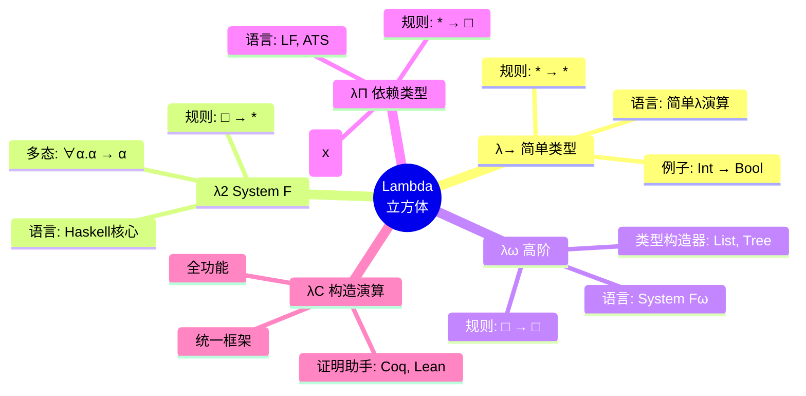

---

## 三、简单类型 → 多态类型 → 依赖类型

### 3.1 类型能力演进

```mermaid
flowchart TB
    subgraph 简单类型 λ→
        S1["id :: Int → Int"]
        S2["id :: Bool → Bool"]
        S3["需要为每种类型写不同版本"]
        
        S1 -.->|重复代码| S2
        S2 -.->|需要抽象| S3
    end

    subgraph System F λ2
        F1["id :: ∀α. α → α"]
        F2["实例化: id[Int], id[Bool]"]
        F3["参数多态 / 范型"]
        
        S3 -.->|解决方案| F1
        F1 --> F2
        F2 --> F3
    end

    subgraph 依赖类型 λΠ
        D1["length :: ∀α. List α → Nat"]
        D2["vlength :: ∀n:Nat. Vec α n → Nat"]
        D3["类型依赖于值: Vec α n"]
        D4["长度信息编码在类型中"]
        
        F3 -.->|需要更多精度| D1
        D1 -.->|解决方案| D2
        D2 --> D3
        D3 --> D4
    end

    subgraph 示例对比
        E1["简单: append :: List a → List a → List a"]
        E2["依赖: append :: Vec a n → Vec a m → Vec a (n+m)"]
        E3["返回类型精确反映结果长度!"]
        
        D4 -.->|示例| E2
        E1 -.->|对比| E2
        E2 --> E3
    end
```

### 3.2 类型精确性对比表

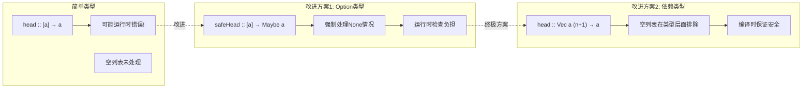

---

## 四、归纳类型与递归模式

### 4.1 归纳类型家族

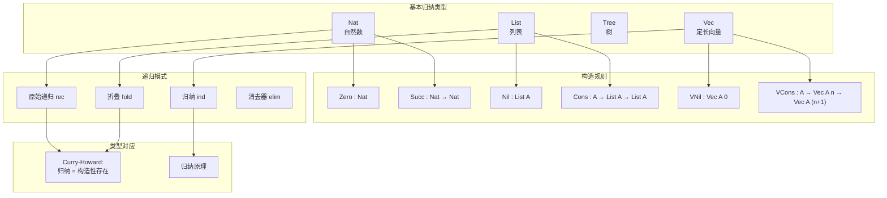

### 4.2 递归模式关系

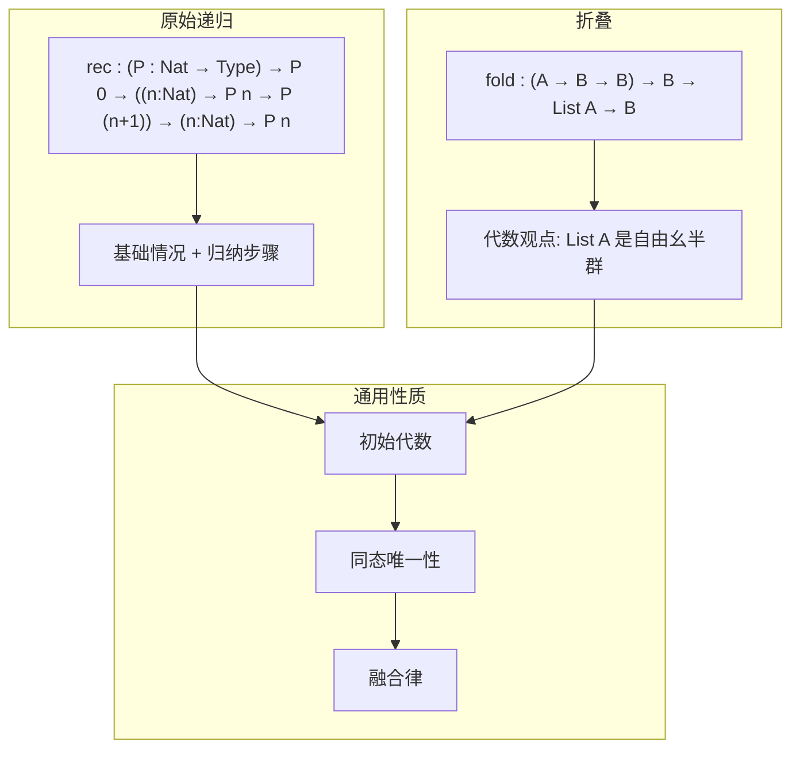

---

## 五、同伦类型论 (HoTT)

### 5.1 HoTT 核心概念图

```mermaid
graph TB
    subgraph 类型 = 空间
        TYPE[类型 A]<-->SPACE[空间 A]
        ELEM[项 a : A]<-->POINT[点 a ∈ A]
        
        TYPE -.->|同构| SPACE
        ELEM -.->|对应| POINT
    end

    subgraph 相等 = 路径
        ID[恒等类型<br/>Id_A(a,b)]<-->PATH[路径空间<br/>Path_A(a,b)]
        REFL[refl : a = a]<-->ID_PATH[常值路径]
        
        ID -.->|同构| PATH
        REFL -.->|对应| ID_PATH
    end

    subgraph 路径结构
        COMP[路径复合<br/>p • q]<-->PATH_COMP[路径连接]
        INV[路径逆<br/>p⁻¹]<-->PATH_INV[反向路径]
        ASSOC[结合律]<-->PATH_ASSOC[同伦]
    end

    subgraph 高阶结构
        PATH2[2维路径<br/>p = q]<-->HOMOTOPY[同伦]
        PATH3[3维路径<br/>α = β]<-->H_HOMOTOPY[高阶同伦]
        INF[∞-群胚结构]
    end

    TYPE --> ID
    ID --> COMP
    ID --> INV
    COMP --> ASSOC
    ASSOC --> PATH2
    PATH2 --> PATH3
    PATH3 --> INF
```

### 5.2 单值性公理 (Univalence)

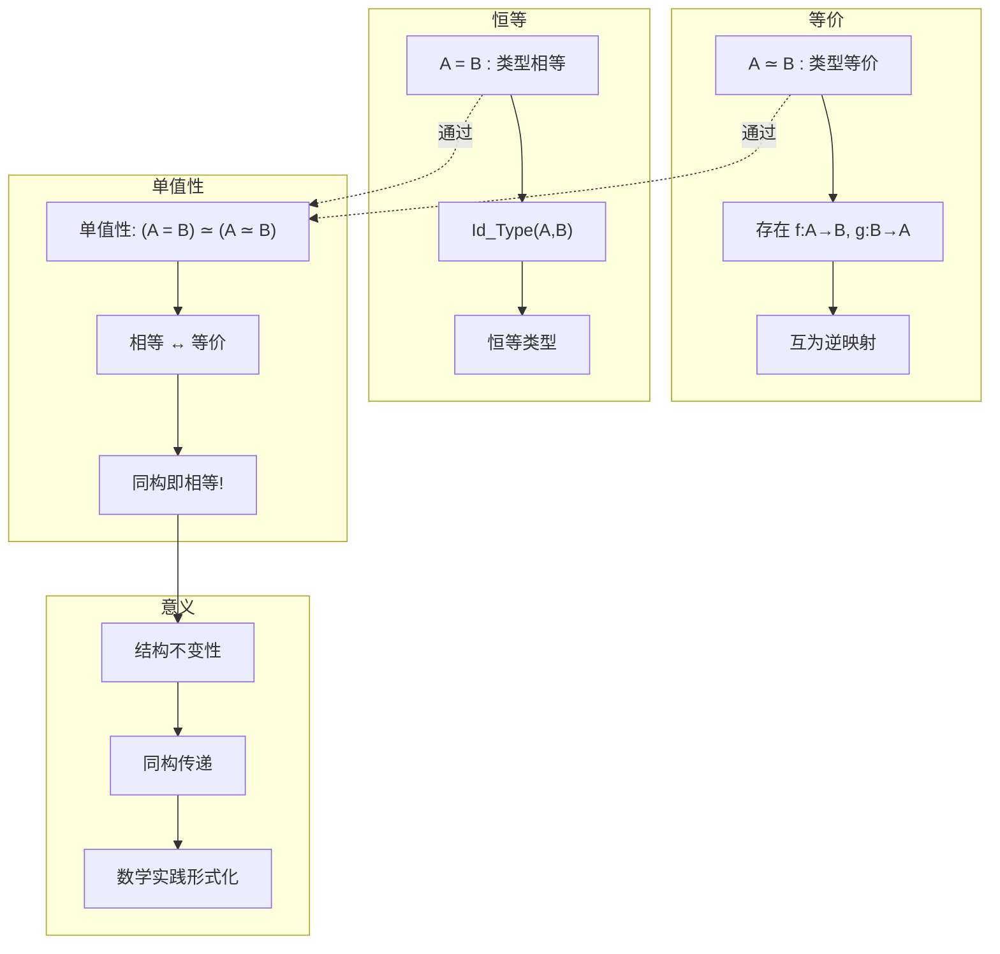

---

## 六、立方类型论 (Cubical Type Theory)

### 6.1 立方模型

```mermaid
graph TB
    subgraph 区间
        I[区间 I]<-->BOOL[布尔值 0,1]
        I0[i = 0]<-->FALSE[假]
        I1[i = 1]<-->TRUE[真]
    end

    subgraph 立方体
        POINT[点]
        LINE[线: λi.a]<-->PATH_I[Path(i)]
        SQUARE[正方形: λiλj.a]<-->SQUARE_IJ[Path(i,j)]
        CUBE[立方体: λiλjλk.a]<-->CUBE_IJK[Path(i,j,k)]
    end

    subgraph 操作
        ABST[抽象 λi]<-->FUN_I[函数抽象]
        APP[应用 a @ i]<-->FUN_APP[函数应用]
        COMP_C[合成]<-->COMP_OP[运算]
        COERCE[强制转换]<-->TRANS[运输]
    end

    subgraph 计算性
        COMPUTE[可计算单值性]<-->ALGO[算法]
        CANON[典范形式]<-->NORM[规范化]
    end

    I --> LINE
    LINE --> SQUARE
    SQUARE --> CUBE
    
    LINE --> ABST
    ABST --> APP
    APP --> COMP_C
    COMP_C --> COERCE
    
    COERCE --> COMPUTE
    COMPUTE --> CANON
```

### 6.2 Cubical vs HoTT

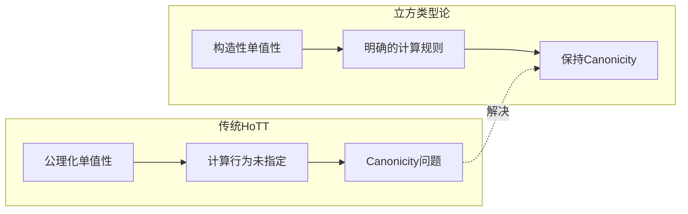

---

## 七、线性类型系统

### 7.1 线性类型层次

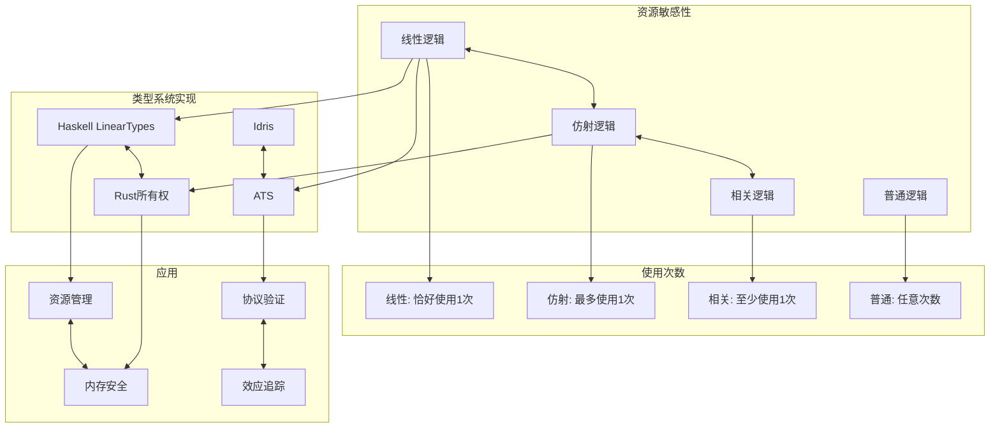

---

## 八、效应系统

### 8.1 效应类型

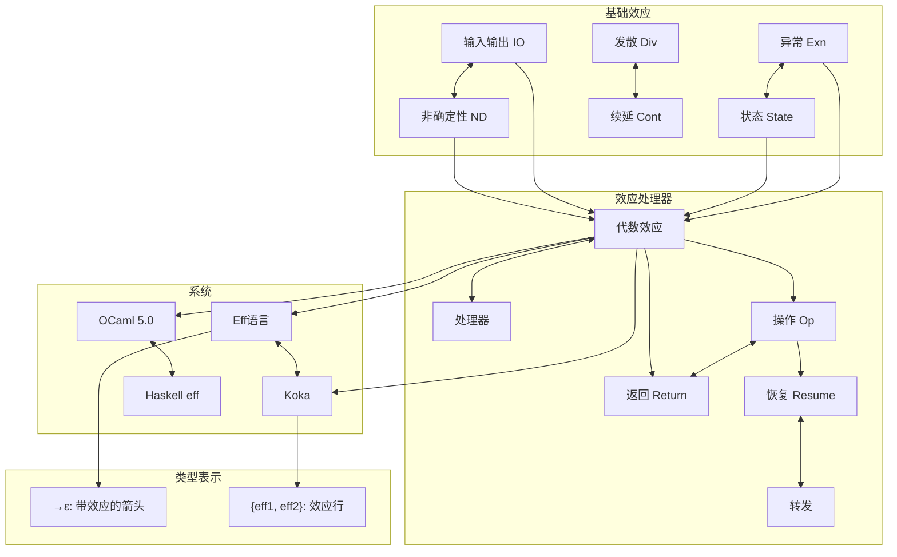

---

## 九、子类型与面向对象类型

### 9.1 子类型关系

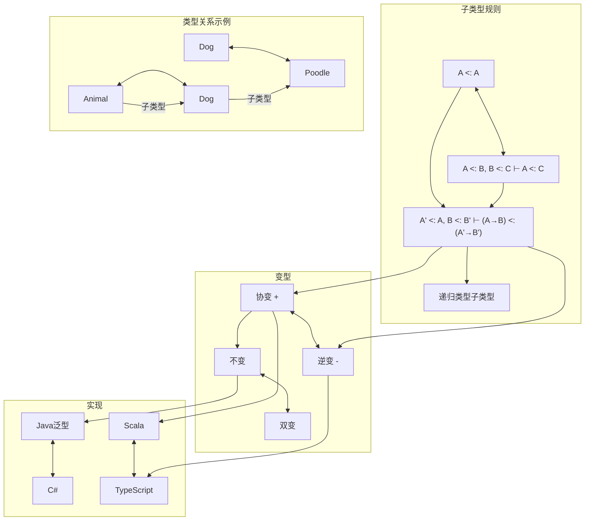

---

## 十、ASCII 艺术表示

### 10.1 Lambda立方体 (ASCII)

```
                    Lambda立方体 (Barendregt)
                    ═════════════════════════

                         □ → □ (类型 → 类型)
                              │
                              │ λω 高阶类型
                              │
    * → □ (项 → 类型) ────────┼──────── □ → * (类型 → 项)
    (依赖类型)                │        (多态类型)
         │                    │                    
         │ λΠ                 │                 λ2
         │                    │                    
         └────────────────────┼────────────────────┘
                              │
                         * → * (项 → 项)
                         λ→ 简单类型

    
    维度解释:
    ═════════
    1. 项 → 项: 简单函数 (λ→)
    2. 类型 → 项: 多态 (λ2/System F)
    3. 项 → 类型: 依赖类型 (λΠ)
    4. 类型 → 类型: 类型算子 (λω)
    
    顶点系统:
    • λ→: 简单类型λ演算
    • λ2: System F (多态)
    • λω: System Fω (高阶)
    • λΠ: LF/依赖类型
    • λC: 构造演算 (Coq核心)
```

### 10.2 类型系统演进谱系 (ASCII)

```
                    类型系统演进谱系
                    ═══════════════

    1930s  1940s  1950s  1960s  1970s  1980s  1990s  2000s  2010s  2020s
      │      │      │      │      │      │      │      │      │      │
      ▼      ▼      ▼      ▼      ▼      ▼      ▼      ▼      ▼      ▼
    ┌────┐                                              ┌────┐
    │λ→  │──────────────────────────────────────────────▶│HoTT│
    │简单│   ┌────┐        ┌────┐        ┌────┐          │同伦│
    └────┘   │λ2  │───────▶│λC  │───────▶│CIC │─────────▶│类型│
             │多态│        │构造│        │归纳│          │论  │
             └────┘        │演算│        │构造│          └────┘
                          └────┘        └────┘             │
                            │                              │
                            ▼                              ▼
                          ┌────┐                          ┌────┐
                          │λω  │                          │立方│
                          │高阶│                          │类型│
                          └────┘                          │论  │
                            │                             └────┘
                            ▼
                          ┌────┐        ┌────┐
                          │Fω  │───────▶│Haskell
                          │    │        │核心  │
                          └────┘        └────┘

    关键里程碑:
    • 1934: Church - 简单类型λ演算
    • 1971: Milner - ML类型推导 (let多态)
    • 1972: Girard/Reynolds - System F
    • 1985: Constable - NuPRL (依赖类型)
```

### 10.3 归纳类型构造 (ASCII)

```
                    归纳类型构造模式
                    ════════════════

    自然数 Nat:
    ┌─────────────────────────────────────┐
    │  data Nat : Type where              │
    │    Zero : Nat                       │
    │    Succ : Nat → Nat                 │
    │                                     │
    │  示意图:                            │
    │  Zero ──▶ Succ Zero ──▶ Succ (Succ  │
    │                              Zero)  │
    │    0  ──▶     1     ──▶     2       │
    └─────────────────────────────────────┘

    列表 List A:
    ┌─────────────────────────────────────┐
    │  data List (A : Type) : Type where  │
    │    Nil  : List A                    │
    │    Cons : A → List A → List A       │
    │                                     │
    │  示意图:                            │
    │  Nil    Cons a₁    Cons a₂          │
    │   │        │           │            │
    │   ▼        ▼           ▼            │
    │  []  ──▶ [a₁] ──▶ [a₁,a₂]           │
    └─────────────────────────────────────┘

    定长向量 Vec A n:
    ┌─────────────────────────────────────┐
    │  data Vec (A : Type) : Nat → Type   │
    │    VNil  : Vec A 0                  │
    │    VCons : A → Vec A n → Vec A (n+1)│
    │                                     │
    │  类型精确性:                        │
    │  VCons a (VCons b VNil) : Vec A 2   │
    │  编译时已知长度!                    │
    └─────────────────────────────────────┘
```

### 10.4 同伦类型论核心 (ASCII)

```
                    同伦类型论 (HoTT) 核心
                    ══════════════════════

    基础对应:
    ═════════
    
    类型论              拓扑学
    ──────              ──────
    类型  A            空间  A
    项    a : A        点    a ∈ A
    恒等  p : a = b    路径  p : a ↝ b
    
    
    路径结构:
    ═════════
    
    恒等路径:          refl : a = a
                       (常值路径)
    
    路径复合:          p : a = b,  q : b = c
                       ───────────────────────
                       p • q : a = c
                       (路径连接)
    
    路径逆:            p : a = b
                       ─────────
                       p⁻¹ : b = a
                       (反向路径)
    
    
    高阶路径 (同伦):
    ════════════════
    
    如果 p, q : a = b 是两条路径，
    则 α : p = q 是"路径之间的路径"
    
       a ═══════ b
         ╲  α  ╱
          ╲   ╱
           ╲ ╱
            ▽
       a ═══════ b
    
    这形成了 ∞-群胚结构
    
    
    单值性公理:
    ════════════
    
    等价 = 相等
    
    (A = B)  ≃  (A ≃ B)
    ────────────────────
    类型相等    类型等价
    
    意义: 同构的结构可以互换使用！
```

---

## 十一、类型系统对比表

| 特性 | 简单类型 | System F | 依赖类型 | HoTT |
|-----|---------|----------|---------|------|
| 类型依赖值 | ✗ | ✗ | ✓ | ✓ |
| 多态 | ✗ | ✓ | ✓ | ✓ |
| 证明即程序 | ✗ | 部分 | ✓ | ✓ |
| 计算单值性 | N/A | N/A | 部分 | ✓ |
| 高维结构 | ✗ | ✗ | ✗ | ✓ |
| 典型实现 | Pascal | Haskell | Agda/Coq | Cubical Agda |

---

*文档生成时间: 2025年4月*
*版本: v1.0*
