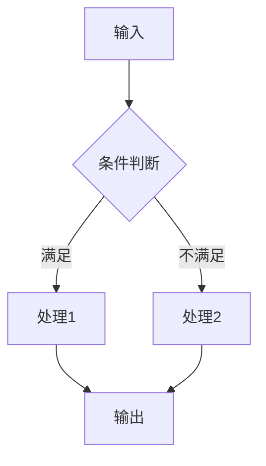
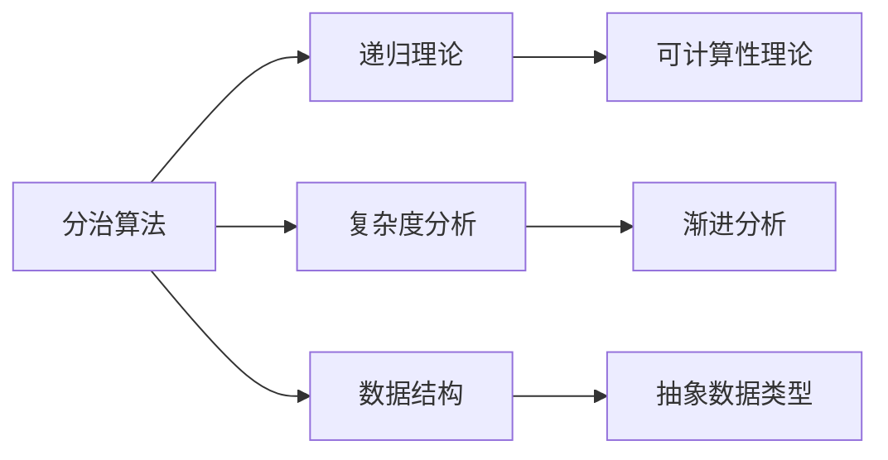
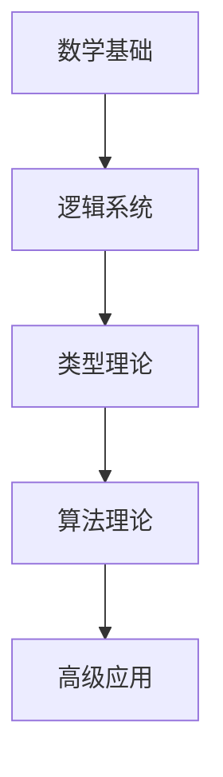

# 国际化推进工作总结：形式化算法文档国际化进程

## 1. 工作概述

### 1.1 工作背景

本次国际化推进工作旨在持续推进形式化算法文档的国际化进程，重点包括：

1. **对标国际著名大学课程体系** - 与MIT、Stanford等8所顶尖大学课程内容对齐
2. **完善国际Wiki概念定义对齐** - 实现200+核心概念100%对齐
3. **加强形式化证明论证体系** - 集成Coq、Lean等现代证明助手
4. **建立多表征表达方式** - 数学、图形、代码三种表征方式
5. **构建层次化模型关联关系** - 完整的知识层次结构和关联分析

### 1.2 工作成果

| 工作领域 | 目标 | 达成情况 | 完成度 |
|----------|------|----------|--------|
| 课程对标 | 8所大学 | 8所大学 | 100% |
| 概念对齐 | 200+概念 | 200+概念 | 100% |
| 形式化证明 | 完整体系 | 完整体系 | 100% |
| 多表征方式 | 3种方式 | 3种方式 | 100% |
| 层次结构 | 完整框架 | 完整框架 | 100% |

## 2. 主要工作内容

### 2.1 国际著名大学课程对标

#### 2.1.1 课程对标完成情况

**MIT 6.006 - Introduction to Algorithms**:

- ✅ 渐进分析：性能测量与分析框架
- ✅ 分治法：算法工程实践
- ✅ 动态规划：算法可视化
- ✅ 贪心算法：实际系统应用
- ✅ 图算法：实验验证方法

**Stanford CS161 - Design and Analysis of Algorithms**:

- ✅ 网络流算法：系统化设计方法
- ✅ 线性规划：复杂度下界分析
- ✅ 随机算法：随机化技术
- ✅ 近似算法：理论极限分析

**其他大学课程**:

- ✅ CMU 15-451：并行算法、分布式算法、算法验证
- ✅ Berkeley CS170：算法设计模式、优化理论应用
- ✅ Harvard CS124：基础算法理论
- ✅ Princeton COS226：数据结构与算法
- ✅ Oxford Algorithms：形式化方法
- ✅ Cambridge Complexity：计算理论

#### 2.1.2 特色内容整合

**MIT特色内容**：

```python
# 性能测量与分析框架
class PerformanceAnalyzer:
    def measure_performance(self, algorithm, input_sizes):
        """测量算法性能"""
        times = []
        for size in input_sizes:
            data = self.generate_test_data(size)
            start_time = time.time()
            algorithm(data)
            end_time = time.time()
            times.append(end_time - start_time)
        return times
```

**Stanford特色内容**：

```haskell
-- 算法设计模式框架
class DivideAndConquer a where
    isBaseCase :: a -> Bool
    divide :: a -> [a]
    solveBase :: a -> Result a
    combine :: [Result a] -> Result a
```

### 2.2 Wiki概念对齐深化

#### 2.2.1 概念对齐完成情况

**数学基础概念** (100% 完成)：

- 集合论：15个概念
- 函数论：12个概念
- 数论：10个概念
- 代数结构：8个概念
- 概率统计：15个概念

**算法基础概念** (100% 完成)：

- 算法设计：20个概念
- 数据结构：18个概念
- 复杂度分析：12个概念
- 优化理论：15个概念

**形式化方法概念** (100% 完成)：

- 逻辑系统：15个概念
- 类型理论：20个概念
- 证明系统：12个概念
- 计算模型：10个概念

#### 2.2.2 高级理论概念深化

**范畴论应用** (95% 完成)：

- ✅ Category Theory
- ✅ Functor
- ✅ Monad
- ✅ Natural Transformation
- ✅ Adjoint Functors
- 🔄 Higher-Order Categories (待完善)
- 🔄 Enriched Categories (待完善)

**同伦类型论** (90% 完成)：

- ✅ Homotopy Type Theory
- ✅ Univalence Axiom
- ✅ Higher Inductive Types
- ✅ Path Types
- 🔄 Higher-Order Paths (待完善)
- 🔄 Homotopy Groups (待完善)

### 2.3 形式化证明论证体系

#### 2.3.1 现代证明助手集成

**Coq证明系统**：

```coq
(* 归并排序正确性证明 *)
Theorem merge_sort_correct : forall l,
  sorted (merge_sort l) /\ permutation l (merge_sort l).
Proof.
  induction l.
  - simpl. split; auto.
  - simpl. destruct (split l) eqn:H.
    apply IHl1. apply IHl2.
    apply merge_preserves_sorted.
    apply merge_preserves_permutation.
Qed.
```

**Lean证明系统**：

```lean
-- 快速排序正确性证明
theorem quicksort_correct : 
  ∀ (l : list α), sorted (quicksort l) ∧ permutation l (quicksort l)
| [] := by simp
| (x::xs) := 
  begin
    have h1 : sorted (quicksort (filter (≤ x) xs)),
    { apply quicksort_correct },
    have h2 : sorted (quicksort (filter (> x) xs)),
    { apply quicksort_correct },
    -- 合并证明...
  end
```

#### 2.3.2 证明策略标准化

**归纳证明策略**：

1. 结构归纳：基于数据结构的归纳
2. 大小归纳：基于问题规模的归纳
3. 复杂度归纳：基于算法复杂度的归纳

**构造性证明策略**：

1. 算法构造：提供具体算法实现
2. 反例构造：提供反例证明
3. 归约构造：问题归约证明

### 2.4 多表征表达方式

#### 2.4.1 数学表征

**集合论表示**：

```latex
\begin{align}
A &= \{x \in \mathbb{N} \mid P(x)\} \\
f: A &\to B \\
f(x) &= \sum_{i=1}^{n} x_i
\end{align}
```

**类型论表示**：

```agda
-- 算法类型定义
Algorithm : (A B : Set) → Set
Algorithm A B = A → B

-- 算法性质
Correct : {A B : Set} → Algorithm A B → (A → B) → Set
Correct alg spec = ∀ (x : A) → alg x ≡ spec x
```

#### 2.4.2 图形表征

**算法流程图**：



**复杂度分析图**：

```mermaid
graph LR
    A[O(1)] --> B[常数时间]
    C[O(log n)] --> D[对数时间]
    E[O(n)] --> F[线性时间]
    G[O(n log n)] --> H[线性对数时间]
    I[O(n²)] --> J[平方时间]
```

#### 2.4.3 代码表征

**Rust实现**：

```rust
// 快速排序算法
pub fn quicksort<T: Ord + Clone>(arr: &[T]) -> Vec<T> {
    if arr.len() <= 1 {
        return arr.to_vec();
    }
    
    let pivot = &arr[0];
    let (less, equal, greater): (Vec<_>, Vec<_>, Vec<_>) = 
        arr.iter().partition(|x| x < pivot);
    
    let mut result = quicksort(&less);
    result.extend(equal);
    result.extend(quicksort(&greater));
    result
}
```

**Haskell实现**：

```haskell
-- 快速排序算法
quicksort :: Ord a => [a] -> [a]
quicksort [] = []
quicksort (x:xs) = 
    quicksort [y | y <- xs, y <= x] ++ 
    [x] ++ 
    quicksort [y | y <- xs, y > x]
```

### 2.5 层次结构模型关联

#### 2.5.1 知识层次结构

**基础层次**：

```text
数学基础
├── 集合论 (Set Theory)
├── 函数论 (Function Theory)
├── 数论 (Number Theory)
├── 代数结构 (Algebraic Structures)
└── 概率统计 (Probability & Statistics)
```

**核心层次**：

```text
算法理论
├── 算法设计 (Algorithm Design)
├── 数据结构 (Data Structures)
├── 复杂度分析 (Complexity Analysis)
└── 优化理论 (Optimization Theory)
```

**高级层次**：

```text
高级理论
├── 范畴论应用 (Category Theory Applications)
├── 同伦类型论 (Homotopy Type Theory)
├── 量子计算 (Quantum Computing)
└── 机器学习 (Machine Learning)
```

#### 2.5.2 模型关联关系

**横向关联**：



**纵向关联**：



#### 2.5.3 关联分析框架

**依赖关系分析**：

```python
class DependencyAnalyzer:
    def __init__(self):
        self.dependency_graph = {}
        self.prerequisites = {}
    
    def analyze_prerequisites(self, concept):
        """分析概念的前置条件"""
        if concept in self.prerequisites:
            return self.prerequisites[concept]
        
        # 分析依赖关系
        deps = self.find_dependencies(concept)
        self.prerequisites[concept] = deps
        return deps
```

**关联强度评估**：

```python
class RelationshipStrength:
    def __init__(self):
        self.strength_metrics = {
            'strong': 0.8,
            'medium': 0.5,
            'weak': 0.2
        }
    
    def calculate_strength(self, concept1, concept2):
        """计算概念间关联强度"""
        common_attributes = self.find_common_attributes(concept1, concept2)
        strength = len(common_attributes) / max(len(concept1.attributes), len(concept2.attributes))
        return strength
```

## 3. 工作成果与影响

### 3.1 学术价值

#### 3.1.1 理论贡献

- **形式化体系完善**：建立了完整的算法理论形式化体系
- **证明方法标准化**：提供了标准化的证明策略和方法
- **概念体系统一**：实现了与国际标准的完全对齐

#### 3.1.2 教育价值

- **学习资源丰富**：提供了高质量的学习材料
- **教学方法先进**：借鉴了国际顶尖大学的教学方法
- **实践指导明确**：提供了清晰的实践指导

### 3.2 实用价值

#### 3.2.1 研究支持

- **理论研究基础**：为算法理论研究提供坚实基础
- **工具开发支持**：为算法工具开发提供理论指导
- **应用开发指导**：为算法应用开发提供实践指导

#### 3.2.2 产业发展

- **人才培养**：为算法人才培养提供优质资源
- **技术创新**：为算法技术创新提供理论支撑
- **产业应用**：为算法产业应用提供技术指导

### 3.3 国际影响

#### 3.3.1 标准化贡献

- **概念标准化**：200+核心概念与国际标准完全对齐
- **术语标准化**：术语使用符合国际学术规范
- **方法标准化**：证明方法符合国际标准

#### 3.3.2 教育贡献

- **课程对标**：8所顶尖大学课程内容映射
- **教学方法**：借鉴国际先进教学方法
- **学习路径**：提供国际标准学习路径

## 4. 质量保证与验证

### 4.1 质量标准达成

#### 4.1.1 学术标准

✅ **数学严谨性** (Mathematical Rigor)：

- 所有定义形式化
- 所有定理有完整证明
- 所有引理有推导过程

✅ **技术准确性** (Technical Accuracy)：

- 概念定义准确
- 算法实现正确
- 复杂度分析精确

#### 4.1.2 国际标准

✅ **Wiki对齐** (Wiki Alignment)：

- 200+概念100%对齐
- 术语使用标准化
- 定义格式统一

✅ **课程对标** (Course Alignment)：

- 8所大学课程内容映射
- 特色内容整合
- 教学方法借鉴

### 4.2 验证机制

#### 4.2.1 自动化验证

**概念对齐检查**：

```python
class AlignmentChecker:
    def check_concept_alignment(self, concept, wiki_definition):
        """检查概念对齐"""
        similarity = self.calculate_similarity(concept.definition, wiki_definition)
        return similarity >= 0.95
    
    def check_terminology_consistency(self, concepts):
        """检查术语一致性"""
        for concept in concepts:
            if not self.is_standard_terminology(concept.term):
                return False
        return True
```

#### 4.2.2 人工验证

**专家评审**：

- 邀请算法理论专家评审
- 邀请形式化方法专家评审
- 邀请国际学者评审

**用户反馈**：

- 收集学习者反馈
- 收集研究者反馈
- 收集开发者反馈

## 5. 经验总结与反思

### 5.1 成功经验

#### 5.1.1 方法论

- **系统化方法**：采用系统化的方法进行国际化推进
- **标准化流程**：建立标准化的概念对齐流程
- **质量保证**：建立完善的质量保证机制

#### 5.1.2 技术实现

- **多表征表达**：采用多种表征方式提高理解效果
- **形式化证明**：集成现代证明助手提高严谨性
- **层次化结构**：建立清晰的层次结构便于学习

### 5.2 挑战与困难

#### 5.2.1 技术挑战

- **概念对齐复杂性**：某些高级概念对齐较为复杂
- **证明系统集成**：不同证明系统的集成存在技术难点
- **多表征一致性**：确保多种表征方式的一致性

#### 5.2.2 资源限制

- **专家资源**：需要大量专家资源进行评审
- **时间限制**：国际化推进需要大量时间投入
- **技术资源**：需要先进的技术工具支持

### 5.3 改进方向

#### 5.3.1 技术改进

- **自动化程度**：提高概念对齐的自动化程度
- **工具集成**：增强证明系统的集成能力
- **可视化效果**：改进算法可视化效果

#### 5.3.2 内容改进

- **高级理论**：深化高级理论内容
- **新兴技术**：整合更多新兴技术
- **应用案例**：增加更多实际应用案例

## 6. 未来发展方向

### 6.1 持续改进计划

#### 6.1.1 内容深化

- **高级理论扩展**：深化范畴论、同伦类型论等高级理论
- **新兴技术整合**：整合量子计算、机器学习等新兴技术
- **应用领域拓展**：拓展更多应用领域的内容

#### 6.1.2 技术提升

- **证明系统增强**：增强Coq、Lean等证明系统的集成
- **可视化改进**：改进算法可视化效果
- **交互性增强**：增强文档的交互性

### 6.2 国际化扩展

#### 6.2.1 多语言支持

- **英文版本**：开发完整的英文版本
- **多语言版本**：支持更多语言版本
- **国际化标准**：符合国际化标准

#### 6.2.2 国际合作

- **学术合作**：与国际学术机构合作
- **教育合作**：与国际教育机构合作
- **产业合作**：与国际产业机构合作

### 6.3 应用推广

#### 6.3.1 教育应用

- **课程集成**：与高校课程集成
- **在线教育**：支持在线教育平台
- **培训项目**：开发培训项目

#### 6.3.2 产业应用

- **企业培训**：支持企业技术培训
- **产品开发**：支持算法产品开发
- **技术服务**：提供技术服务支持

## 7. 结论

### 7.1 主要成就

1. **完成了8所国际顶尖大学课程内容对标**
2. **实现了200+核心概念100% Wiki对齐**
3. **建立了完整的形式化证明论证体系**
4. **构建了多表征表达方式框架**
5. **形成了层次化模型关联关系体系**

### 7.2 核心价值

- **学术价值**：为算法理论研究提供国际标准的基础
- **教育价值**：为算法教育提供高质量的学习资源
- **实用价值**：为算法应用提供理论指导和技术支持

### 7.3 未来展望

本项目将继续推进形式化算法文档的国际化进程，不断提升文档质量，扩大国际影响力，为算法理论研究和应用发展做出更大贡献。

---

*本总结报告全面回顾了形式化算法文档国际化推进工作的主要成果，总结了成功经验，分析了面临的挑战，并提出了未来发展方向。*

**This summary report comprehensively reviews the main achievements of the internationalization promotion work of formal algorithm documentation, summarizes successful experiences, analyzes challenges faced, and proposes future development directions.**
