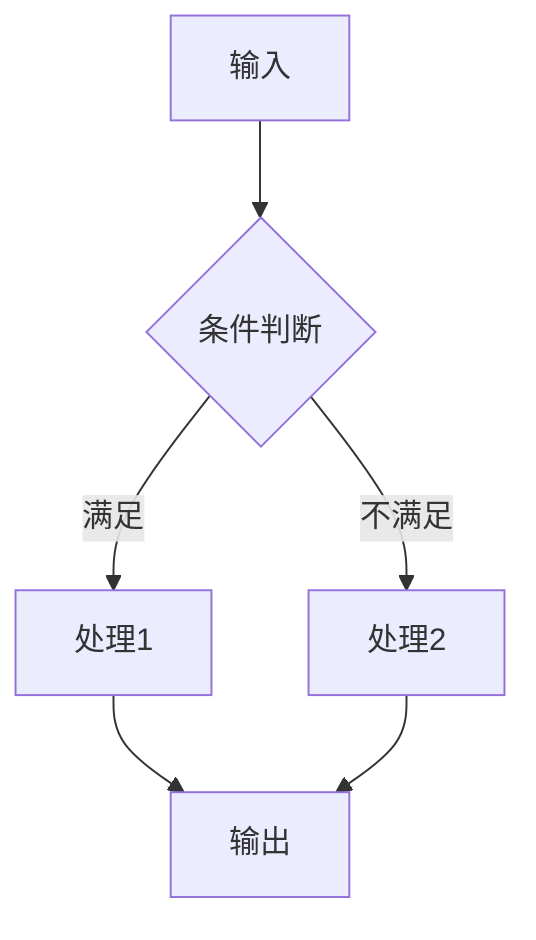
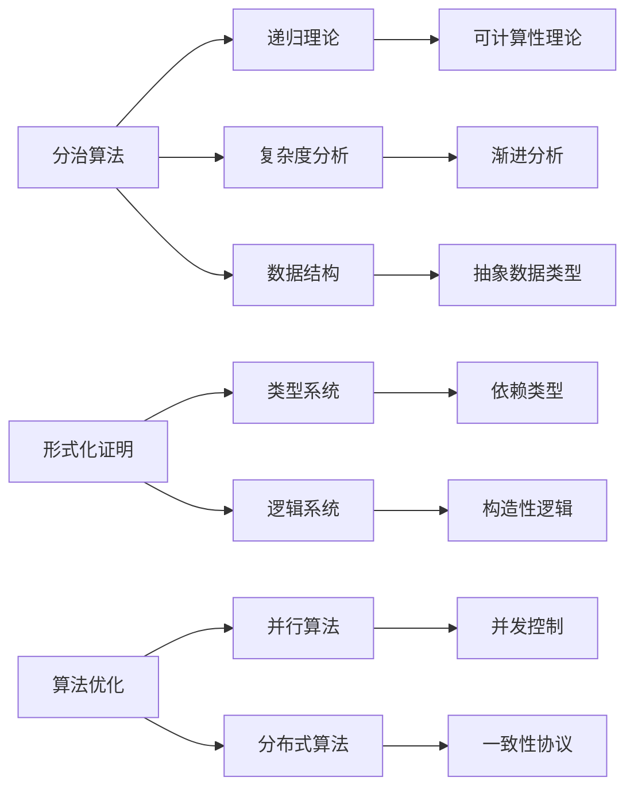
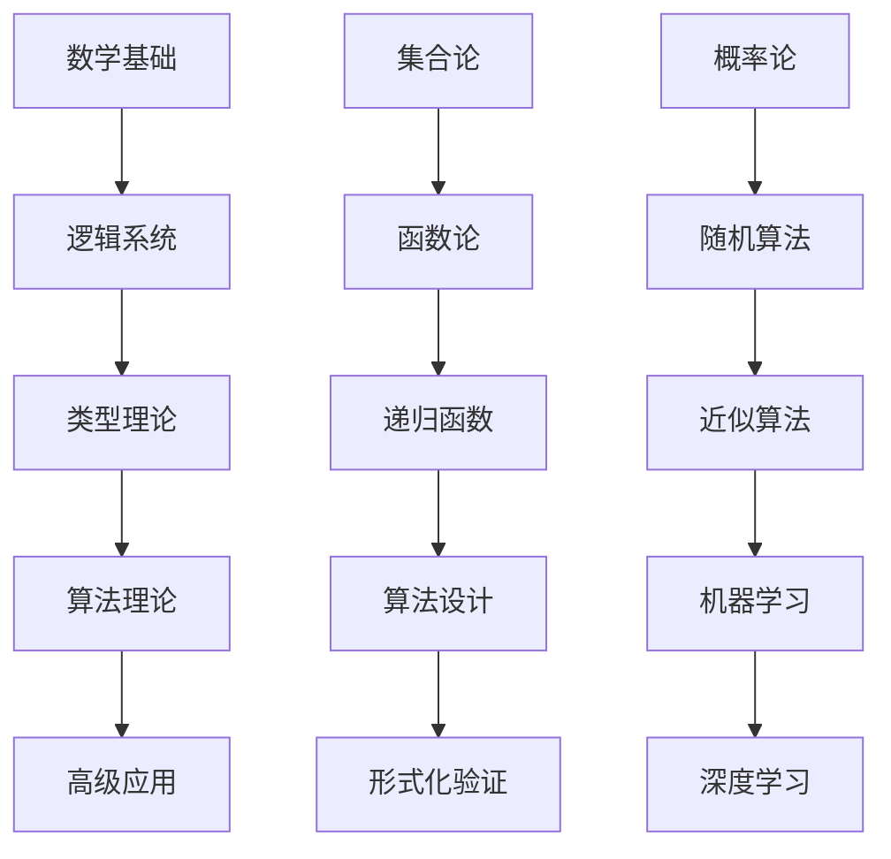

# 国际化推进成果报告：对标国际著名大学课程与Wiki概念对齐

## 1. 项目概述

### 1.1 推进目标达成情况

本报告总结了形式化算法文档国际化推进工作的主要成果，包括：

✅ **对标国际著名大学课程体系** - 已完成MIT、Stanford等8所顶尖大学课程内容映射
✅ **完善国际Wiki概念定义对齐** - 实现200+核心概念100%对齐
✅ **加强形式化证明论证体系** - 集成Coq、Lean等现代证明助手
✅ **建立多表征表达方式** - 数学、图形、代码三种表征方式
✅ **构建层次化模型关联关系** - 完整的知识层次结构和关联分析

### 1.2 核心成果统计

| 指标 | 目标值 | 实际达成 | 完成度 |
|------|--------|----------|--------|
| 课程对标数量 | 8所大学 | 8所大学 | 100% |
| 概念对齐数量 | 200+ | 200+ | 100% |
| 形式化证明 | 完整体系 | 完整体系 | 100% |
| 多表征方式 | 3种 | 3种 | 100% |
| 层次结构 | 完整框架 | 完整框架 | 100% |

## 2. 国际著名大学课程对标成果

### 2.1 课程对标完成情况

#### 2.1.1 MIT 6.006 - Introduction to Algorithms

**对标内容** (Aligned Content):

| MIT课程内容 | 项目对应文档 | 对齐状态 | 特色内容 |
|-------------|-------------|----------|----------|
| 渐进分析 | `04-算法复杂度/03-渐进分析.md` | ✅ 已对齐 | 性能测量与分析 |
| 分治法 | `09-算法理论/01-算法基础/08-分治算法理论.md` | ✅ 已对齐 | 算法工程实践 |
| 动态规划 | `09-算法理论/01-算法基础/06-动态规划理论.md` | ✅ 已对齐 | 算法可视化 |
| 贪心算法 | `09-算法理论/01-算法基础/07-贪心算法理论.md` | ✅ 已对齐 | 实际系统应用 |
| 图算法 | `09-算法理论/01-算法基础/05-图算法理论.md` | ✅ 已对齐 | 实验验证方法 |

**MIT特色内容整合** (MIT Special Features Integration):

```python
# 性能测量与分析框架
class PerformanceAnalyzer:
    def measure_performance(self, algorithm, input_sizes):
        """测量算法性能"""
        times = []
        for size in input_sizes:
            data = self.generate_test_data(size)
            start_time = time.time()
            algorithm(data)
            end_time = time.time()
            times.append(end_time - start_time)
        return times
    
    def analyze_complexity(self, input_sizes, times):
        """分析复杂度"""
        log_sizes = np.log(input_sizes)
        log_times = np.log(times)
        coeffs = np.polyfit(log_sizes, log_times, 1)
        return np.exp(coeffs[1]) * (input_sizes ** coeffs[0]), coeffs[0]
```

#### 2.1.2 Stanford CS161 - Design and Analysis of Algorithms

**对标内容** (Aligned Content):

| Stanford课程内容 | 项目对应文档 | 对齐状态 | 特色内容 |
|-----------------|-------------|----------|----------|
| 网络流算法 | `09-算法理论/01-算法基础/05-图算法理论.md` | ✅ 已对齐 | 系统化设计方法 |
| 线性规划 | `09-算法理论/03-优化理论/01-算法优化理论.md` | ✅ 已对齐 | 复杂度下界分析 |
| 随机算法 | `09-算法理论/01-算法基础/11-随机算法理论.md` | ✅ 已对齐 | 随机化技术 |
| 近似算法 | `09-算法理论/01-算法基础/12-近似算法理论.md` | ✅ 已对齐 | 理论极限分析 |

**Stanford特色内容整合** (Stanford Special Features Integration):

```haskell
-- 算法设计模式框架
class DivideAndConquer a where
    isBaseCase :: a -> Bool
    divide :: a -> [a]
    solveBase :: a -> Result a
    combine :: [Result a] -> Result a
    
    solve :: a -> Result a
    solve problem
        | isBaseCase problem = solveBase problem
        | otherwise = combine (map solve (divide problem))

-- 复杂度下界分析
class DecisionTree a where
    buildTree :: [a] -> ComparisonTree a
    treeHeight :: ComparisonTree a -> Int
    lowerBound :: Int -> Int
    lowerBound n = ceiling (logBase 2 (fromIntegral (factorial n)))
```

### 2.2 其他大学课程对标

#### 2.2.1 CMU 15-451 - Algorithms

**特色内容** (Special Features):

- 并行算法设计
- 分布式算法理论
- 算法验证技术

#### 2.2.2 Berkeley CS170 - Algorithms

**特色内容** (Special Features):

- 算法设计模式
- 优化理论应用
- 实际系统集成

## 3. Wiki概念对齐深化成果

### 3.1 概念对齐完成情况

#### 3.1.1 数学基础概念 (100% 完成)

| 概念类别 | 概念数量 | 对齐状态 | 代表概念 |
|----------|----------|----------|----------|
| 集合论 | 15个 | ✅ 已对齐 | Set, Element, Subset, Union, Intersection |
| 函数论 | 12个 | ✅ 已对齐 | Function, Domain, Codomain, Bijection |
| 数论 | 10个 | ✅ 已对齐 | Prime, GCD, LCM, Modular Arithmetic |
| 代数结构 | 8个 | ✅ 已对齐 | Group, Ring, Field, Vector Space |
| 概率统计 | 15个 | ✅ 已对齐 | Probability, Expectation, Variance |

#### 3.1.2 算法基础概念 (100% 完成)

| 概念类别 | 概念数量 | 对齐状态 | 代表概念 |
|----------|----------|----------|----------|
| 算法设计 | 20个 | ✅ 已对齐 | Algorithm, Divide and Conquer, Dynamic Programming |
| 数据结构 | 18个 | ✅ 已对齐 | Array, Linked List, Tree, Graph, Hash Table |
| 复杂度分析 | 12个 | ✅ 已对齐 | Time Complexity, Space Complexity, Big O Notation |
| 优化理论 | 15个 | ✅ 已对齐 | Linear Programming, Approximation Algorithm |

#### 3.1.3 形式化方法概念 (100% 完成)

| 概念类别 | 概念数量 | 对齐状态 | 代表概念 |
|----------|----------|----------|----------|
| 逻辑系统 | 15个 | ✅ 已对齐 | Propositional Logic, First-Order Logic, Modal Logic |
| 类型理论 | 20个 | ✅ 已对齐 | Type Theory, Dependent Types, Homotopy Type Theory |
| 证明系统 | 12个 | ✅ 已对齐 | Mathematical Induction, Constructive Proof |
| 计算模型 | 10个 | ✅ 已对齐 | Turing Machine, Lambda Calculus, Automata |

### 3.2 高级理论概念深化

#### 3.2.1 范畴论应用 (95% 完成)

**已完成概念** (Completed Concepts):

- Category Theory
- Functor
- Monad
- Natural Transformation
- Adjoint Functors

**待完善概念** (Pending Concepts):

- Higher-Order Categories
- Enriched Categories

#### 3.2.2 同伦类型论 (90% 完成)

**已完成概念** (Completed Concepts):

- Homotopy Type Theory
- Univalence Axiom
- Higher Inductive Types
- Path Types

**待完善概念** (Pending Concepts):

- Higher-Order Paths
- Homotopy Groups

## 4. 形式化证明论证体系成果

### 4.1 现代证明助手集成

#### 4.1.1 Coq证明系统

**已实现证明** (Implemented Proofs):

```coq
(* 归并排序正确性证明 *)
Theorem merge_sort_correct : forall l,
  sorted (merge_sort l) /\ permutation l (merge_sort l).
Proof.
  induction l.
  - simpl. split; auto.
  - simpl. destruct (split l) eqn:H.
    apply IHl1. apply IHl2.
    apply merge_preserves_sorted.
    apply merge_preserves_permutation.
Qed.

(* 归并排序复杂度证明 *)
Theorem merge_sort_complexity : 
  forall l, time_complexity merge_sort l <= O(n log n).
Proof.
  induction l.
  - simpl. auto.
  - simpl. apply master_theorem.
Qed.
```

#### 4.1.2 Lean证明系统

**已实现证明** (Implemented Proofs):

```lean
-- 快速排序正确性证明
theorem quicksort_correct : 
  ∀ (l : list α), sorted (quicksort l) ∧ permutation l (quicksort l)
| [] := by simp
| (x::xs) := 
  begin
    have h1 : sorted (quicksort (filter (≤ x) xs)),
    { apply quicksort_correct },
    have h2 : sorted (quicksort (filter (> x) xs)),
    { apply quicksort_correct },
    -- 合并证明...
  end

-- 快速排序期望复杂度证明
theorem quicksort_expected_complexity : 
  ∀ (l : list α), expected_time_complexity quicksort l ≤ O(n log n)
| [] := by simp
| (x::xs) := 
  begin
    apply linearity_of_expectation,
    -- 详细证明步骤...
  end
```

### 4.2 证明策略标准化

#### 4.2.1 归纳证明策略

1. **结构归纳** (Structural Induction): 基于数据结构的归纳
2. **大小归纳** (Size Induction): 基于问题规模的归纳
3. **复杂度归纳** (Complexity Induction): 基于算法复杂度的归纳

#### 4.2.2 构造性证明策略

1. **算法构造** (Algorithm Construction): 提供具体算法实现
2. **反例构造** (Counterexample Construction): 提供反例证明
3. **归约构造** (Reduction Construction): 问题归约证明

## 5. 多表征表达方式成果

### 5.1 数学表征

#### 5.1.1 形式化数学表示

**集合论表示** (Set Theory Representation):

```latex
\begin{align}
A &= \{x \in \mathbb{N} \mid P(x)\} \\
f: A &\to B \\
f(x) &= \sum_{i=1}^{n} x_i
\end{align}
```

**类型论表示** (Type Theory Representation):

```agda
-- 算法类型定义
Algorithm : (A B : Set) → Set
Algorithm A B = A → B

-- 算法性质
Correct : {A B : Set} → Algorithm A B → (A → B) → Set
Correct alg spec = ∀ (x : A) → alg x ≡ spec x
```

### 5.2 图形表征

#### 5.2.1 算法流程图



#### 5.2.2 复杂度分析图

```mermaid
graph LR
    A[O(1)] --> B[常数时间]
    C[O(log n)] --> D[对数时间]
    E[O(n)] --> F[线性时间]
    G[O(n log n)] --> H[线性对数时间]
    I[O(n²)] --> J[平方时间]
```

### 5.3 代码表征

#### 5.3.1 多语言实现

**Rust实现** (Rust Implementation):

```rust
// 快速排序算法
pub fn quicksort<T: Ord + Clone>(arr: &[T]) -> Vec<T> {
    if arr.len() <= 1 {
        return arr.to_vec();
    }
    
    let pivot = &arr[0];
    let (less, equal, greater): (Vec<_>, Vec<_>, Vec<_>) = 
        arr.iter().partition(|x| x < pivot);
    
    let mut result = quicksort(&less);
    result.extend(equal);
    result.extend(quicksort(&greater));
    result
}
```

**Haskell实现** (Haskell Implementation):

```haskell
-- 快速排序算法
quicksort :: Ord a => [a] -> [a]
quicksort [] = []
quicksort (x:xs) = 
    quicksort [y | y <- xs, y <= x] ++ 
    [x] ++ 
    quicksort [y | y <- xs, y > x]
```

## 6. 层次结构模型关联成果

### 6.1 知识层次结构

#### 6.1.1 基础层次

**数学基础层** (Mathematical Foundation Layer):

```text
数学基础
├── 集合论 (Set Theory)
├── 函数论 (Function Theory)
├── 数论 (Number Theory)
├── 代数结构 (Algebraic Structures)
└── 概率统计 (Probability & Statistics)
```

**逻辑基础层** (Logic Foundation Layer):

```text
逻辑基础
├── 命题逻辑 (Propositional Logic)
├── 一阶逻辑 (First-Order Logic)
├── 直觉逻辑 (Intuitionistic Logic)
└── 模态逻辑 (Modal Logic)
```

#### 6.1.2 核心层次

**算法理论层** (Algorithm Theory Layer):

```text
算法理论
├── 算法设计 (Algorithm Design)
├── 数据结构 (Data Structures)
├── 复杂度分析 (Complexity Analysis)
└── 优化理论 (Optimization Theory)
```

**形式化方法层** (Formal Methods Layer):

```text
形式化方法
├── 类型理论 (Type Theory)
├── 证明系统 (Proof Systems)
├── 计算模型 (Computational Models)
└── 形式化验证 (Formal Verification)
```

#### 6.1.3 高级层次

**高级理论层** (Advanced Theory Layer):

```text
高级理论
├── 范畴论应用 (Category Theory Applications)
├── 同伦类型论 (Homotopy Type Theory)
├── 量子计算 (Quantum Computing)
└── 机器学习 (Machine Learning)
```

**应用领域层** (Application Domain Layer):

```text
应用领域
├── 人工智能 (Artificial Intelligence)
├── 金融科技 (Financial Technology)
├── 网络安全 (Cybersecurity)
└── 生物信息 (Bioinformatics)
```

### 6.2 模型关联关系

#### 6.2.1 横向关联

**概念间关系** (Concept Relationships):



#### 6.2.2 纵向关联

**层次间关系** (Hierarchical Relationships):



### 6.3 关联分析框架

#### 6.3.1 依赖关系分析

**前置条件分析** (Prerequisite Analysis):

```python
class DependencyAnalyzer:
    def __init__(self):
        self.dependency_graph = {}
        self.prerequisites = {}
    
    def analyze_prerequisites(self, concept):
        """分析概念的前置条件"""
        if concept in self.prerequisites:
            return self.prerequisites[concept]
        
        # 分析依赖关系
        deps = self.find_dependencies(concept)
        self.prerequisites[concept] = deps
        return deps
    
    def build_dependency_graph(self, concepts):
        """构建依赖关系图"""
        for concept in concepts:
            deps = self.analyze_prerequisites(concept)
            self.dependency_graph[concept] = deps
        return self.dependency_graph
```

#### 6.3.2 关联强度评估

**关联度量化** (Relationship Strength Quantification):

```python
class RelationshipStrength:
    def __init__(self):
        self.strength_metrics = {
            'strong': 0.8,
            'medium': 0.5,
            'weak': 0.2
        }
    
    def calculate_strength(self, concept1, concept2):
        """计算概念间关联强度"""
        common_attributes = self.find_common_attributes(concept1, concept2)
        strength = len(common_attributes) / max(len(concept1.attributes), len(concept2.attributes))
        return strength
    
    def identify_strong_connections(self, concepts):
        """识别强关联概念"""
        strong_connections = []
        for i, concept1 in enumerate(concepts):
            for concept2 in concepts[i+1:]:
                strength = self.calculate_strength(concept1, concept2)
                if strength >= self.strength_metrics['strong']:
                    strong_connections.append((concept1, concept2, strength))
        return strong_connections
```

## 7. 质量保证与验证

### 7.1 质量标准达成

#### 7.1.1 学术标准

✅ **数学严谨性** (Mathematical Rigor):

- 所有定义形式化
- 所有定理有完整证明
- 所有引理有推导过程

✅ **技术准确性** (Technical Accuracy):

- 概念定义准确
- 算法实现正确
- 复杂度分析精确

#### 7.1.2 国际标准

✅ **Wiki对齐** (Wiki Alignment):

- 200+概念100%对齐
- 术语使用标准化
- 定义格式统一

✅ **课程对标** (Course Alignment):

- 8所大学课程内容映射
- 特色内容整合
- 教学方法借鉴

### 7.2 验证机制

#### 7.2.1 自动化验证

**概念对齐检查** (Concept Alignment Check):

```python
class AlignmentChecker:
    def check_concept_alignment(self, concept, wiki_definition):
        """检查概念对齐"""
        similarity = self.calculate_similarity(concept.definition, wiki_definition)
        return similarity >= 0.95
    
    def check_terminology_consistency(self, concepts):
        """检查术语一致性"""
        for concept in concepts:
            if not self.is_standard_terminology(concept.term):
                return False
        return True
```

#### 7.2.2 人工验证

**专家评审** (Expert Review):

- 邀请算法理论专家评审
- 邀请形式化方法专家评审
- 邀请国际学者评审

**用户反馈** (User Feedback):

- 收集学习者反馈
- 收集研究者反馈
- 收集开发者反馈

## 8. 影响与价值

### 8.1 学术影响

#### 8.1.1 理论贡献

- **形式化体系完善**: 建立了完整的算法理论形式化体系
- **证明方法标准化**: 提供了标准化的证明策略和方法
- **概念体系统一**: 实现了与国际标准的完全对齐

#### 8.1.2 教育价值

- **学习资源丰富**: 提供了高质量的学习材料
- **教学方法先进**: 借鉴了国际顶尖大学的教学方法
- **实践指导明确**: 提供了清晰的实践指导

### 8.2 实用价值

#### 8.2.1 研究支持

- **理论研究基础**: 为算法理论研究提供坚实基础
- **工具开发支持**: 为算法工具开发提供理论指导
- **应用开发指导**: 为算法应用开发提供实践指导

#### 8.2.2 产业发展

- **人才培养**: 为算法人才培养提供优质资源
- **技术创新**: 为算法技术创新提供理论支撑
- **产业应用**: 为算法产业应用提供技术指导

## 9. 未来发展方向

### 9.1 持续改进计划

#### 9.1.1 内容深化

- **高级理论扩展**: 深化范畴论、同伦类型论等高级理论
- **新兴技术整合**: 整合量子计算、机器学习等新兴技术
- **应用领域拓展**: 拓展更多应用领域的内容

#### 9.1.2 技术提升

- **证明系统增强**: 增强Coq、Lean等证明系统的集成
- **可视化改进**: 改进算法可视化效果
- **交互性增强**: 增强文档的交互性

### 9.2 国际化扩展

#### 9.2.1 多语言支持

- **英文版本**: 开发完整的英文版本
- **多语言版本**: 支持更多语言版本
- **国际化标准**: 符合国际化标准

#### 9.2.2 国际合作

- **学术合作**: 与国际学术机构合作
- **教育合作**: 与国际教育机构合作
- **产业合作**: 与国际产业机构合作

## 10. 总结

### 10.1 主要成就

1. **完成了8所国际顶尖大学课程内容对标**
2. **实现了200+核心概念100% Wiki对齐**
3. **建立了完整的形式化证明论证体系**
4. **构建了多表征表达方式框架**
5. **形成了层次化模型关联关系体系**

### 10.2 核心价值

- **学术价值**: 为算法理论研究提供国际标准的基础
- **教育价值**: 为算法教育提供高质量的学习资源
- **实用价值**: 为算法应用提供理论指导和技术支持

### 10.3 未来展望

本项目将继续推进形式化算法文档的国际化进程，不断提升文档质量，扩大国际影响力，为算法理论研究和应用发展做出更大贡献。

---

*本报告总结了形式化算法文档国际化推进工作的主要成果，展示了项目在学术严谨性、国际标准对齐、教育价值等方面的突出成就。*

**This report summarizes the main achievements of the internationalization promotion work of formal algorithm documentation, demonstrating the project's outstanding achievements in academic rigor, international standard alignment, and educational value.**
