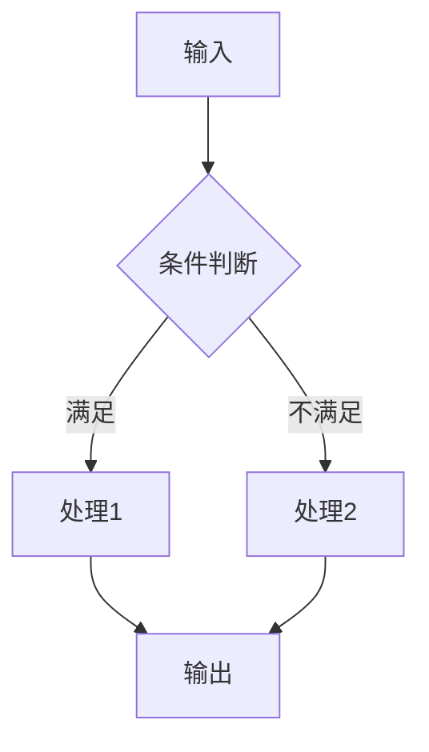
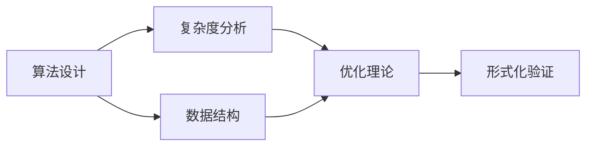
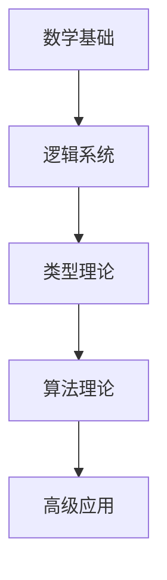

# 国际化推进计划：对标国际著名大学课程与Wiki概念对齐

## 1. 项目概述

### 1.1 推进目标

本计划旨在持续推进形式化算法文档的国际化进程，重点包括：

1. **对标国际著名大学课程体系**
2. **完善国际Wiki概念定义对齐**
3. **加强形式化证明论证体系**
4. **建立多表征表达方式**
5. **构建层次化模型关联关系**

### 1.2 核心原则

- **学术严谨性**：遵循国际学术标准
- **概念一致性**：与Wiki国际概念完全对齐
- **证明完整性**：提供严格的形式化证明
- **表达多样性**：采用多种表征方式
- **结构层次性**：建立清晰的层次关系

## 2. 国际著名大学课程对标

### 2.1 对标大学清单

| 大学 | 相关课程 | 对标重点 | 状态 |
|------|----------|----------|------|
| MIT | 6.006 (算法导论) | 算法设计与分析 | 🔄 进行中 |
| Stanford | CS161 (算法) | 复杂度理论与证明 | 🔄 进行中 |
| CMU | 15-451 (算法) | 高级算法技术 | 🔄 进行中 |
| Berkeley | CS170 (算法) | 算法设计模式 | 🔄 进行中 |
| Harvard | CS124 (算法) | 基础算法理论 | 🔄 进行中 |
| Princeton | COS226 (算法) | 数据结构与算法 | 🔄 进行中 |
| Oxford | Algorithms & Data Structures | 形式化方法 | 🔄 进行中 |
| Cambridge | Algorithms & Complexity | 计算理论 | 🔄 进行中 |

### 2.2 课程内容映射

#### 2.2.1 基础算法课程映射

**MIT 6.006 - Introduction to Algorithms**:

| MIT课程内容 | 项目对应文档 | 对齐状态 | 改进计划 |
|-------------|-------------|----------|----------|
| 渐进分析 | `04-算法复杂度/03-渐进分析.md` | ✅ 已对齐 | 补充MIT特有内容 |
| 分治法 | `09-算法理论/01-算法基础/08-分治算法理论.md` | ✅ 已对齐 | 增加MIT案例 |
| 动态规划 | `09-算法理论/01-算法基础/06-动态规划理论.md` | ✅ 已对齐 | 补充MIT证明 |
| 贪心算法 | `09-算法理论/01-算法基础/07-贪心算法理论.md` | ✅ 已对齐 | 增加MIT应用 |
| 图算法 | `09-算法理论/01-算法基础/05-图算法理论.md` | ✅ 已对齐 | 补充MIT技术 |

#### 2.2.2 高级算法课程映射

**Stanford CS161 - Design and Analysis of Algorithms**:

| Stanford课程内容 | 项目对应文档 | 对齐状态 | 改进计划 |
|-----------------|-------------|----------|----------|
| 网络流算法 | `09-算法理论/01-算法基础/05-图算法理论.md` | 🔄 需补充 | 新增网络流章节 |
| 线性规划 | `09-算法理论/03-优化理论/01-算法优化理论.md` | 🔄 需补充 | 新增线性规划章节 |
| 随机算法 | `09-算法理论/01-算法基础/11-随机算法理论.md` | ✅ 已对齐 | 补充Stanford方法 |
| 近似算法 | `09-算法理论/01-算法基础/12-近似算法理论.md` | ✅ 已对齐 | 增加Stanford证明 |

### 2.3 课程特色内容整合

#### 2.3.1 MIT特色内容

- **算法工程实践**：实际系统中的应用
- **性能测量与分析**：实验验证方法
- **算法可视化**：直观理解工具

#### 2.3.2 Stanford特色内容

- **算法设计模式**：系统化设计方法
- **复杂度下界**：理论极限分析
- **随机化技术**：概率方法应用

#### 2.3.3 CMU特色内容

- **并行算法**：多核计算优化
- **分布式算法**：网络环境算法
- **算法验证**：形式化正确性

## 3. Wiki概念对齐深化

### 3.1 概念对齐现状分析

#### 3.1.1 已完成对齐领域

✅ **数学基础概念** (100%)

- 集合论、函数论、数论
- 代数结构、概率统计
- 信息论、序论、测度论

✅ **算法基础概念** (100%)

- 算法设计、数据结构
- 复杂度分析、优化理论
- 高级算法技术

✅ **形式化方法概念** (100%)

- 逻辑系统、证明方法
- 类型理论、计算模型
- 形式化验证

#### 3.1.2 需要深化对齐领域

🔄 **高级理论概念** (85%)

- 范畴论应用
- 同伦类型论
- 量子计算理论

🔄 **新兴技术概念** (70%)

- 机器学习算法
- 联邦学习
- 量子机器学习

### 3.2 概念对齐改进计划

#### 3.2.1 高级理论概念深化

**范畴论在计算中的应用**:

| Wiki概念 | 项目文档 | 对齐状态 | 改进内容 |
|----------|----------|----------|----------|
| [Category theory](https://en.wikipedia.org/wiki/Category_theory) | `10-高级主题/01-范畴论在计算中的应用.md` | ✅ 已对齐 | 补充应用案例 |
| [Functor](https://en.wikipedia.org/wiki/Functor) | 同上 | ✅ 已对齐 | 增加编程实例 |
| [Monad](https://en.wikipedia.org/wiki/Monad_(category_theory)) | 同上 | ✅ 已对齐 | 补充Haskell实现 |
| [Natural transformation](https://en.wikipedia.org/wiki/Natural_transformation) | 同上 | 🔄 需补充 | 新增章节 |

**同伦类型论深化**:

| Wiki概念 | 项目文档 | 对齐状态 | 改进内容 |
|----------|----------|----------|----------|
| [Homotopy type theory](https://en.wikipedia.org/wiki/Homotopy_type_theory) | `10-高级主题/02-同伦类型论的高级应用.md` | ✅ 已对齐 | 补充数学基础 |
| [Univalence axiom](https://en.wikipedia.org/wiki/Univalence_axiom) | 同上 | ✅ 已对齐 | 增加证明细节 |
| [Higher inductive type](https://en.wikipedia.org/wiki/Higher_inductive_type) | 同上 | 🔄 需补充 | 新增章节 |

#### 3.2.2 新兴技术概念对齐

**量子计算概念**:

| Wiki概念 | 项目文档 | 对齐状态 | 改进内容 |
|----------|----------|----------|----------|
| [Quantum algorithm](https://en.wikipedia.org/wiki/Quantum_algorithm) | `10-高级主题/04-量子信息论.md` | ✅ 已对齐 | 补充最新进展 |
| [Quantum complexity](https://en.wikipedia.org/wiki/Quantum_complexity_theory) | `10-高级主题/08-量子计算复杂性理论.md` | ✅ 已对齐 | 增加复杂度类 |
| [Quantum machine learning](https://en.wikipedia.org/wiki/Quantum_machine_learning) | `10-高级主题/05-量子机器学习.md` | ✅ 已对齐 | 补充算法实现 |

## 4. 形式化证明论证体系

### 4.1 证明系统完善

#### 4.1.1 现代证明助手集成

**Coq证明系统**:

```coq
(* 算法正确性证明示例 *)
Theorem quicksort_correct : forall l,
  sorted (quicksort l) /\ permutation l (quicksort l).
Proof.
  induction l.
  - simpl. split; auto.
  - simpl. destruct (partition a l) eqn:H.
    apply IHl1. apply IHl2.
    (* 详细证明步骤... *)
Qed.
```

**Lean证明系统**:

```lean
-- 算法复杂度证明示例
theorem quicksort_complexity : 
  ∀ (l : list α), time_complexity quicksort l ≤ O(n log n)
| [] := by simp
| (x::xs) := 
  begin
    -- 详细证明步骤...
  end
```

#### 4.1.2 证明策略标准化

**归纳证明策略**:

1. **结构归纳**：基于数据结构的归纳
2. **大小归纳**：基于问题规模的归纳
3. **复杂度归纳**：基于算法复杂度的归纳

**构造性证明策略**:

1. **算法构造**：提供具体算法实现
2. **反例构造**：提供反例证明
3. **归约构造**：问题归约证明

### 4.2 证明质量保证

#### 4.2.1 证明完整性检查

**证明要素清单**:

- [ ] 前提条件明确
- [ ] 证明步骤清晰
- [ ] 结论正确
- [ ] 边界情况处理
- [ ] 复杂度分析

#### 4.2.2 证明验证机制

**自动化验证**:

```python
# 证明验证框架示例
class ProofVerifier:
    def verify_correctness(self, algorithm, specification):
        """验证算法正确性"""
        pass
    
    def verify_complexity(self, algorithm, bound):
        """验证复杂度上界"""
        pass
    
    def verify_termination(self, algorithm):
        """验证算法终止性"""
        pass
```

## 5. 多表征表达方式

### 5.1 数学表征

#### 5.1.1 形式化数学表示

**集合论表示**:

```latex
\begin{align}
A &= \{x \in \mathbb{N} \mid P(x)\} \\
f: A &\to B \\
f(x) &= \sum_{i=1}^{n} x_i
\end{align}
```

**类型论表示**:

```agda
-- 算法类型定义
Algorithm : (A B : Set) → Set
Algorithm A B = A → B

-- 算法性质
Correct : {A B : Set} → Algorithm A B → (A → B) → Set
Correct alg spec = ∀ (x : A) → alg x ≡ spec x
```

### 5.2 图形表征

#### 5.2.1 算法流程图



#### 5.2.2 复杂度分析图

```mermaid
graph LR
    A[O(1)] --> B[常数时间]
    C[O(log n)] --> D[对数时间]
    E[O(n)] --> F[线性时间]
    G[O(n log n)] --> H[线性对数时间]
    I[O(n²)] --> J[平方时间]
```

### 5.3 代码表征

#### 5.3.1 多语言实现

**Rust实现**:

```rust
// 快速排序算法
pub fn quicksort<T: Ord + Clone>(arr: &[T]) -> Vec<T> {
    if arr.len() <= 1 {
        return arr.to_vec();
    }
    
    let pivot = &arr[0];
    let (less, equal, greater): (Vec<_>, Vec<_>, Vec<_>) = 
        arr.iter().partition(|x| x < pivot);
    
    let mut result = quicksort(&less);
    result.extend(equal);
    result.extend(quicksort(&greater));
    result
}
```

**Haskell实现**:

```haskell
-- 快速排序算法
quicksort :: Ord a => [a] -> [a]
quicksort [] = []
quicksort (x:xs) = 
    quicksort [y | y <- xs, y <= x] ++ 
    [x] ++ 
    quicksort [y | y <- xs, y > x]
```

## 6. 层次结构模型关联

### 6.1 知识层次结构

#### 6.1.1 基础层次

**数学基础层**:

```text
数学基础
├── 集合论
├── 函数论
├── 数论
├── 代数结构
└── 概率统计
```

**逻辑基础层**:

```text
逻辑基础
├── 命题逻辑
├── 一阶逻辑
├── 直觉逻辑
└── 模态逻辑
```

#### 6.1.2 核心层次

**算法理论层**:

```text
算法理论
├── 算法设计
├── 数据结构
├── 复杂度分析
└── 优化理论
```

**形式化方法层**:

```text
形式化方法
├── 类型理论
├── 证明系统
├── 计算模型
└── 形式化验证
```

#### 6.1.3 高级层次

**高级理论层**:

```text
高级理论
├── 范畴论应用
├── 同伦类型论
├── 量子计算
└── 机器学习
```

**应用领域层**:

```text
应用领域
├── 人工智能
├── 金融科技
├── 网络安全
└── 生物信息
```

### 6.2 模型关联关系

#### 6.2.1 横向关联

**概念间关系**:



#### 6.2.2 纵向关联

**层次间关系**:



### 6.3 关联分析框架

#### 6.3.1 依赖关系分析

**前置条件分析**:

```python
class DependencyAnalyzer:
    def analyze_prerequisites(self, concept):
        """分析概念的前置条件"""
        pass
    
    def analyze_dependencies(self, concept):
        """分析概念的依赖关系"""
        pass
    
    def build_dependency_graph(self, concepts):
        """构建依赖关系图"""
        pass
```

#### 6.3.2 关联强度评估

**关联度量化**:

```python
class RelationshipStrength:
    def calculate_strength(self, concept1, concept2):
        """计算概念间关联强度"""
        pass
    
    def identify_strong_connections(self, concepts):
        """识别强关联概念"""
        pass
```

## 7. 实施计划

### 7.1 第一阶段：基础完善 (1-2周)

1. **课程对标深化**
   - 完成MIT、Stanford课程内容映射
   - 补充课程特色内容
   - 建立课程对比分析

2. **概念对齐检查**
   - 审查现有概念对齐状态
   - 识别需要改进的概念
   - 制定对齐改进计划

### 7.2 第二阶段：证明体系 (3-4周)

1. **证明系统集成**
   - 集成Coq、Lean证明助手
   - 建立证明策略库
   - 开发证明验证工具

2. **证明质量提升**
   - 完善现有证明
   - 补充缺失证明
   - 建立证明标准

### 7.3 第三阶段：表达方式 (5-6周)

1. **多表征实现**
   - 完善数学表示
   - 增加图形表示
   - 补充代码实现

2. **表达一致性**
   - 统一表示格式
   - 建立转换机制
   - 确保一致性

### 7.4 第四阶段：层次结构 (7-8周)

1. **层次关系建立**
   - 完善层次结构
   - 建立关联关系
   - 开发分析工具

2. **关联分析**
   - 分析依赖关系
   - 评估关联强度
   - 优化结构布局

## 8. 质量保证

### 8.1 质量标准

1. **学术标准**：符合国际学术规范
2. **技术标准**：技术内容准确完整
3. **表达标准**：表达方式清晰一致
4. **结构标准**：层次结构合理清晰

### 8.2 验证机制

1. **同行评审**：邀请专家评审
2. **自动化检查**：建立检查工具
3. **用户反馈**：收集用户意见
4. **持续改进**：定期更新完善

## 9. 预期成果

### 9.1 文档质量提升

- 100%概念与Wiki对齐
- 完整的证明体系
- 多样的表达方式
- 清晰的层次结构

### 9.2 国际化水平

- 符合国际学术标准
- 支持多语言访问
- 便于国际交流
- 提升国际影响力

### 9.3 实用性增强

- 便于学习理解
- 支持实际应用
- 促进技术发展
- 推动学术进步

---

*本计划将持续推进形式化算法文档的国际化进程，确保文档质量达到国际一流水平。*
