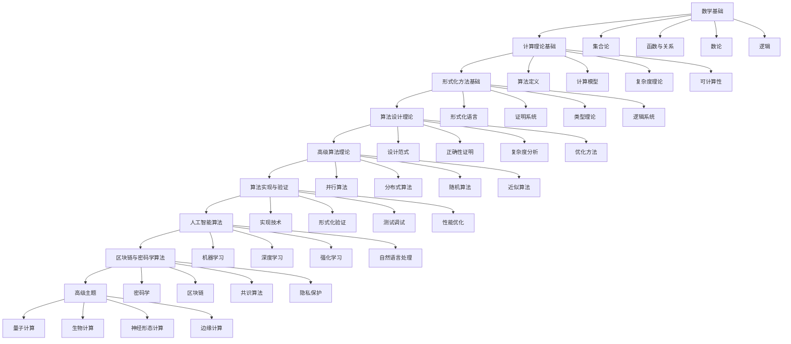

# 形式化算法学习路径设计

## 概述

本文档为形式化算法项目设计完整的学习路径，确保学习者能够循序渐进地掌握从基础理论到高级应用的完整知识体系。

## 学习路径设计原则

### 1. 循序渐进原则

- 从基础概念到高级应用
- 从简单理论到复杂实践
- 从单一知识点到综合应用

### 2. 依赖关系原则

- 明确前置知识要求
- 建立清晰的知识依赖图
- 确保学习顺序的合理性

### 3. 实践导向原则

- 理论与实践相结合
- 提供丰富的代码示例
- 包含实际应用案例

## 学习路径结构

### 阶段一：基础理论 (4-6周)

#### 1.1 数学基础 (2周)

**学习目标：** 掌握形式化算法所需的数学基础

**学习内容：**

- 集合论基础
- 函数与关系
- 数论基础
- 逻辑基础

**前置要求：** 高中数学基础

**学习资源：**

- `docs/01-基础理论/01-集合论基础.md`
- `docs/01-基础理论/02-函数与关系.md`
- `docs/01-基础理论/03-数论基础.md`
- `docs/01-基础理论/04-逻辑基础.md`

**实践练习：**

- 完成基础数学练习
- 实现简单的数学函数
- 理解数学证明方法

#### 1.2 计算理论基础 (2周)

**学习目标：** 理解计算的基本概念和模型

**学习内容：**

- 算法定义与性质
- 计算模型
- 复杂度理论
- 可计算性理论

**前置要求：** 完成数学基础学习

**学习资源：**

- `docs/01-基础理论/05-算法定义.md`
- `docs/07-计算模型/01-图灵机.md`
- `docs/04-算法复杂度/01-时间复杂度.md`
- `docs/02-递归理论/01-递归函数.md`

**实践练习：**

- 实现基础算法
- 分析算法复杂度
- 理解计算模型

#### 1.3 形式化方法基础 (2周)

**学习目标：** 掌握形式化描述和证明方法

**学习内容：**

- 形式化语言
- 证明系统
- 类型理论
- 逻辑系统

**前置要求：** 完成计算理论基础

**学习资源：**

- `docs/01-基础理论/06-形式化语言.md`
- `docs/03-形式化证明/01-证明系统.md`
- `docs/05-类型理论/01-简单类型论.md`
- `docs/06-逻辑系统/01-命题逻辑.md`

**实践练习：**

- 编写形式化描述
- 进行形式化证明
- 使用类型系统

### 阶段二：核心理论 (6-8周)

#### 2.1 算法设计理论 (3周)

**学习目标：** 掌握算法设计的基本方法和理论

**学习内容：**

- 算法设计范式
- 算法正确性证明
- 算法复杂度分析
- 算法优化方法

**前置要求：** 完成形式化方法基础

**学习资源：**

- `docs/09-算法理论/01-算法基础/01-算法设计理论.md`
- `docs/09-算法理论/01-算法基础/02-算法复杂度理论.md`
- `docs/09-算法理论/01-算法基础/03-算法正确性理论.md`
- `docs/09-算法理论/01-算法基础/04-算法优化理论.md`

**实践练习：**

- 实现经典算法
- 分析算法性能
- 优化算法实现

#### 2.2 高级算法理论 (3周)

**学习目标：** 掌握高级算法理论和应用

**学习内容：**

- 并行算法
- 分布式算法
- 随机算法
- 近似算法

**前置要求：** 完成算法设计理论

**学习资源：**

- `docs/09-算法理论/04-高级算法理论/01-并行算法理论.md`
- `docs/09-算法理论/04-高级算法理论/02-分布式算法理论.md`
- `docs/09-算法理论/04-高级算法理论/03-随机算法理论.md`
- `docs/09-算法理论/04-高级算法理论/04-近似算法理论.md`

**实践练习：**

- 实现并行算法
- 设计分布式系统
- 分析随机算法

#### 2.3 算法实现与验证 (2周)

**学习目标：** 掌握算法的实现和验证方法

**学习内容：**

- 算法实现技术
- 形式化验证
- 测试与调试
- 性能优化

**前置要求：** 完成高级算法理论

**学习资源：**

- `docs/08-实现示例/01-Rust实现.md`
- `docs/08-实现示例/04-形式化验证.md`
- `docs/09-算法理论/04-高级算法理论/15-算法验证理论.md`
- `docs/09-算法理论/04-高级算法理论/02-算法工程理论.md`

**实践练习：**

- 实现复杂算法
- 进行形式化验证
- 优化算法性能

### 阶段三：高级应用 (8-10周)

#### 3.1 人工智能算法 (3周)

**学习目标：** 掌握AI算法的理论基础和实现

**学习内容：**

- 机器学习算法
- 深度学习算法
- 强化学习算法
- 自然语言处理算法

**前置要求：** 完成算法实现与验证

**学习资源：**

- `docs/12-应用领域/01-人工智能算法应用.md`
- `docs/09-算法理论/04-高级算法理论/05-机器学习算法理论.md`
- `docs/09-算法理论/04-高级算法理论/06-深度学习算法理论.md`
- `docs/09-算法理论/04-高级算法理论/07-强化学习算法理论.md`

**实践练习：**

- 实现机器学习算法
- 训练深度学习模型
- 设计强化学习系统

#### 3.2 区块链与密码学算法 (3周)

**学习目标：** 掌握区块链和密码学算法

**学习内容：**

- 密码学基础
- 区块链算法
- 共识算法
- 隐私保护算法

**前置要求：** 完成人工智能算法

**学习资源：**

- `docs/12-应用领域/02-区块链算法应用.md`
- `docs/09-算法理论/04-高级算法理论/08-密码学算法理论.md`
- `docs/09-算法理论/04-高级算法理论/09-区块链算法理论.md`
- `docs/09-算法理论/04-高级算法理论/10-共识算法理论.md`

**实践练习：**

- 实现密码学算法
- 设计区块链系统
- 开发共识机制

#### 3.3 高级主题 (2周)

**学习目标：** 了解前沿算法理论和应用

**学习内容：**

- 量子计算算法
- 生物计算算法
- 神经形态计算
- 边缘计算算法

**前置要求：** 完成区块链与密码学算法

**学习资源：**

- `docs/10-高级主题/01-量子计算算法理论.md`
- `docs/10-高级主题/02-生物计算算法理论.md`
- `docs/10-高级主题/03-神经形态计算理论.md`
- `docs/10-高级主题/04-边缘计算算法理论.md`

**实践练习：**

- 研究前沿算法
- 实现创新应用
- 撰写技术报告

## 学习路径图

## 学习评估体系

### 1. 知识掌握评估

- **理论理解：** 通过理论测试评估
- **实践能力：** 通过编程作业评估
- **应用能力：** 通过项目实践评估

### 2. 技能发展评估

- **编程技能：** 代码质量和效率
- **分析技能：** 问题分析和解决能力
- **创新技能：** 创新思维和应用能力

### 3. 综合能力评估

- **学习能力：** 自主学习能力
- **协作能力：** 团队合作能力
- **表达能力：** 技术表达能力

## 学习资源支持

### 1. 在线学习平台

- 提供交互式学习环境
- 支持在线代码执行
- 提供实时反馈和指导

### 2. 学习社区

- 建立学习者交流社区
- 提供专家指导和支持
- 组织学习活动和竞赛

### 3. 实践环境

- 提供完整的开发环境
- 支持多种编程语言
- 提供丰富的测试数据

## 学习建议

### 1. 学习方法

- **循序渐进：** 按照学习路径逐步学习
- **理论实践结合：** 边学理论边做实践
- **主动学习：** 积极参与讨论和提问

### 2. 时间安排

- **每日学习：** 建议每天学习2-3小时
- **周末复习：** 利用周末时间复习巩固
- **项目实践：** 定期进行项目实践

### 3. 学习技巧

- **做笔记：** 记录重要概念和方法
- **画图理解：** 用图表帮助理解复杂概念
- **代码实践：** 多写代码加深理解

## 总结

本学习路径设计遵循循序渐进、依赖关系、实践导向的原则，为学习者提供了完整的形式化算法学习体系。通过系统性的学习和实践，学习者能够掌握从基础理论到高级应用的完整知识体系，具备解决实际问题的能力。

学习路径的成功实施需要学习者的积极参与、教师的专业指导、以及完善的学习资源支持。通过持续的学习和实践，学习者将能够成为形式化算法领域的专业人才。
