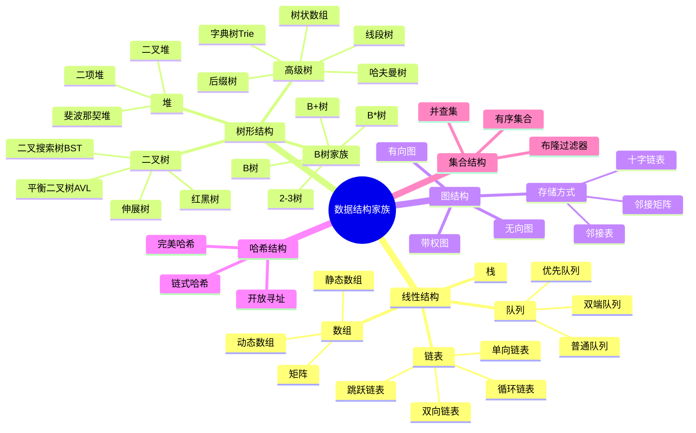

# 数据结构家族思维导图


> **版本**: 1.0
> **创建日期**: 2026-04-19
> **最后更新**: 2026-04-19

## ASCII 艺术版

```
                    ┌─────────────────────┐
                    │     数据结构家族      │
                    │   Data Structures    │
                    └──────────┬──────────┘
                               │
        ┌──────────────────────┼──────────────────────┐
        │                      │                      │
        ▼                      ▼                      ▼
┌───────────────┐    ┌─────────────────┐    ┌───────────────┐
│   线性结构     │    │    树形结构      │    │   图结构       │
│   Linear      │    │     Trees       │    │    Graphs     │
└───────┬───────┘    └────────┬────────┘    └───────┬───────┘
        │                     │                     │
   ┌────┴────┐          ┌─────┴─────┐        ┌─────┴─────┐
   │         │          │           │        │           │
   ▼         ▼          ▼           ▼        ▼           ▼
┌──────┐  ┌──────┐  ┌──────┐    ┌──────┐  ┌──────┐   ┌──────┐
│数组  │  │链表  │  │二叉树│    │B树   │  │有向图│   │无向图│
│      │  │      │  │      │    │家族  │  │      │   │      │
└──┬───┘  └──┬───┘  └──┬───┘    └──┬───┘  └──┬───┘   └──┬───┘
   │         │         │           │         │          │
   ▼         ▼         ▼           ▼         ▼          ▼
┌──────┐  ┌──────┐ ┌──┴──┐     ┌──┴──┐  ┌──┴──┐    ┌──┴──┐
│动态  │  │单向  │ │BST  │     │2-3树│  │邻接  │    │邻接  │
│数组  │  │链表  │ │     │     │     │  │矩阵  │    │表   │
│      │  │      │ └─┬───┘     └─┬───┘  │      │    │      │
├──────┤  ├──────┤   │         ┌─┴───┐  ├──────┤    ├──────┤
│队列  │  │双向  │ ┌─┴───┐     │B树  │  │邻接  │    │十字  │
│      │  │链表  │ │AVL │     │     │  │表   │    │链表 │
├──────┤  ├──────┤ ├─────┤     ├─────┤  ├──────┤    ├──────┤
│栈    │  │循环  │ │红黑 │     │B+树 │  │链式  │    │邻接  │
│      │  │链表  │ │树  │     │     │  │前向星│    │多重表│
└──────┘  └──────┘ ├─────┤     └─────┘  └──────┘    └──────┘
                   │堆   │
                   ├─────┤
                   │线段 │
                   │树  │
                   └─────┘

        ┌──────────────────────┬──────────────────────┐
        │                      │                      │
        ▼                      ▼                      ▼
┌───────────────┐    ┌─────────────────┐    ┌───────────────┐
│   哈希结构     │    │   集合结构       │    │   高级结构     │
│   Hash-based  │    │     Sets        │    │   Advanced    │
└───────┬───────┘    └────────┬────────┘    └───────┬───────┘
        │                     │                     │
   ┌────┴────┐          ┌─────┴─────┐        ┌─────┴─────┐
   │         │          │           │        │           │
   ▼         ▼          ▼           ▼        ▼           ▼
┌──────┐  ┌──────┐  ┌──────┐    ┌──────┐  ┌──────┐   ┌──────┐
│开放  │  │链式  │  │并查集│    │有序  │  │跳表  │   │Trie  │
│寻址  │  │哈希  │  │     │    │集合  │  │     │   │树    │
│      │  │      │  └─────┘    └──────┘  └──────┘   ├──────┤
├──────┤  ├──────┤                        ┌──────┐   │后缀  │
│线性  │  │Cuckoo│                        │布隆  │   │树    │
│探测  │  │哈希  │                        │过滤器│   ├──────┤
├──────┤  └──────┘                        └──────┘   │SB树 │
│二次  │                                             │      │
│探测  │                                             └──────┘
├──────┤
│双重  │
│哈希  │
└──────┘
```

---

## Mermaid 版



---

## 结构关系图

### 逻辑结构与物理结构

```
┌────────────────────────────────────────────────────────────┐
│                      数据结构分类体系                         │
└────────────────────────────────────────────────────────────┘
                              │
            ┌─────────────────┴─────────────────┐
            │                                   │
            ▼                                   ▼
    ┌───────────────┐                 ┌─────────────────┐
    │   逻辑结构     │                 │    物理结构      │
    │  (抽象层面)    │                 │   (存储层面)     │
    └───────┬───────┘                 └────────┬────────┘
            │                                  │
    ┌───────┼───────┐                 ┌───────┼───────┐
    │       │       │                 │       │       │
    ▼       ▼       ▼                 ▼       ▼       ▼
┌──────┐┌──────┐┌──────┐        ┌──────┐┌──────┐┌──────┐
│线性  ││树形  ││图形  │        │顺序  ││链式  ││索引  │
│结构  ││结构  ││结构  │        │存储  ││存储  ││存储  │
└──────┘└──────┘└──────┘        └──────┘└──────┘└──────┘
    │       │       │                 │       │       │
    ▼       ▼       ▼                 ▼       ▼       ▼
  栈、   二叉树、  有向图          数组、   链表、   B+树
  队列、  B树、   无向图          堆、    邻接表、  哈希表
  链表   堆                      矩阵
```

### 时间复杂度对比关系

```
操作/结构 ──────────────────────────────────────────────────────►
            访问    搜索    插入    删除    空间

数组        O(1)    O(n)    O(n)    O(n)    O(n)
            │       │       │       │       │
            ▼       ▼       ▼       ▼       ▼
链表        O(n)    O(n)    O(1)    O(1)    O(n)
            │       │       │       │       │
            ▼       ▼       ▼       ▼       ▼
二叉搜索树   O(logn) O(logn) O(logn) O(logn) O(n)
            │       │       │       │       │
            ▼       ▼       ▼       ▼       ▼
哈希表      N/A     O(1)    O(1)    O(1)    O(n)
            │       │       │       │       │
            ▼       ▼       ▼       ▼       ▼
B树         O(logn) O(logn) O(logn) O(logn) O(n)
```

---

## 结构选择指南

```
你的需求是什么?
    │
    ├── 快速访问任意元素?
    │       └── 数组 / 哈希表
    │
    ├── 频繁插入删除?
    │       └── 链表 / 平衡树
    │
    ├── 需要有序遍历?
    │       └── 二叉搜索树 / B+树
    │
    ├── 区间查询?
    │       └── 线段树 / 树状数组
    │
    ├── 字符串处理?
    │       └── Trie树 / 后缀树
    │
    ├── 图算法?
    │       └── 邻接表 / 邻接矩阵
    │
    └── 集合操作?
            └── 并查集 / 布隆过滤器
```

---

## 核心操作速查

| 数据结构 | 核心操作 | 典型应用 |
|---------|---------|---------|
| 数组 | 随机访问 | 缓存、矩阵运算 |
| 链表 | 动态插入删除 | LRU缓存、多项式 |
| 栈 | LIFO | 表达式求值、回溯 |
| 队列 | FIFO | BFS、任务调度 |
| 堆 | 极值获取 | 优先队列、TopK |
| BST | 有序维护 | 索引、范围查询 |
| 哈希表 | 快速查找 | 缓存、去重 |
| 图 | 连通性 | 网络、路径规划 |
| 并查集 | 连通分量 | Kruskal算法 |
| Trie | 前缀匹配 | 自动补全、拼写检查 |

---

*本思维导图展示了数据结构的层次关系，具体实现细节请参考各专题文档*

---

## 参考文献

- 待补充

---

## 知识导航

- [返回目录](README.md)

