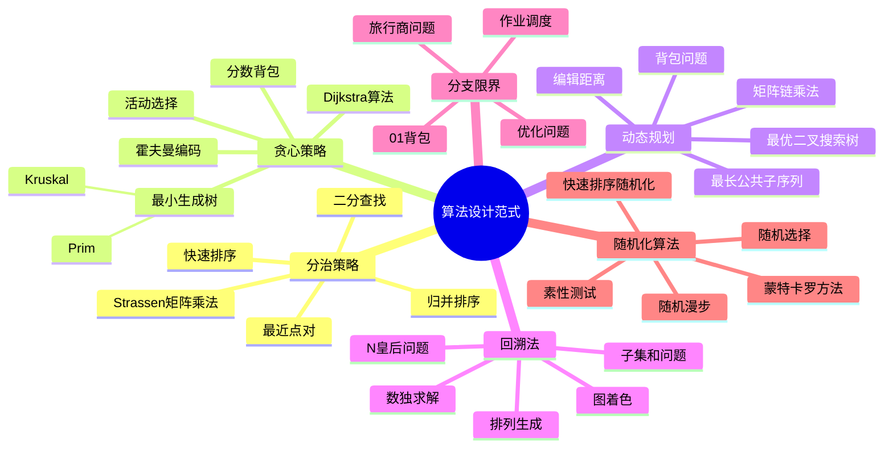

# 算法设计思维导图


> **版本**: 1.0
> **创建日期**: 2026-04-19
> **最后更新**: 2026-04-19

## ASCII 艺术版

```
                          ┌─────────────────┐
                          │   算法设计范式    │
                          │  Algorithm Design │
                          └────────┬────────┘
                                   │
        ┌──────────────────────────┼──────────────────────────┐
        │                          │                          │
        ▼                          ▼                          ▼
┌───────────────┐        ┌───────────────┐        ┌───────────────┐
│   分治策略     │        │   贪心策略     │        │   动态规划     │
│  Divide &     │        │   Greedy      │        │   Dynamic     │
│   Conquer     │        │               │        │  Programming  │
└───────┬───────┘        └───────┬───────┘        └───────┬───────┘
        │                        │                        │
   ┌────┴────┐              ┌────┴────┐              ┌────┴────┐
   │         │              │         │              │         │
   ▼         ▼              ▼         ▼              ▼         ▼
┌──────┐  ┌──────┐      ┌──────┐  ┌──────┐      ┌──────┐  ┌──────┐
│归并  │  │快速  │      │活动  │  │霍夫曼│      │背包  │  │最长  │
│排序  │  │排序  │      │选择  │  │编码  │      │问题  │  │公共  │
│      │  │      │      │      │  │      │      │      │  │子序列│
└──────┘  └──────┘      └──────┘  └──────┘      └──────┘  └──────┘
┌──────┐  ┌──────┐      ┌──────┐  ┌──────┐      ┌──────┐  ┌──────┐
│二分  │  │Strassen│    │最小  │  │Dijkstra│    │编辑  │  │矩阵  │
│查找  │  │矩阵乘法│    │生成树│  │算法   │    │距离  │  │链乘法│
└──────┘  └──────┘      └──────┘  └──────┘      └──────┘  └──────┘

        ┌──────────────────────────┬──────────────────────────┐
        │                          │                          │
        ▼                          ▼                          ▼
┌───────────────┐        ┌───────────────┐        ┌───────────────┐
│   回溯法       │        │   分支限界     │        │   随机化算法   │
│  Backtracking │        │Branch & Bound │        │  Randomized   │
└───────┬───────┘        └───────┬───────┘        └───────┬───────┘
        │                        │                        │
   ┌────┴────┐              ┌────┴────┐              ┌────┴────┐
   │         │              │         │              │         │
   ▼         ▼              ▼         ▼              ▼         ▼
┌──────┐  ┌──────┐      ┌──────┐  ┌──────┐      ┌──────┐  ┌──────┐
│N皇后 │  │数独  │      │旅行商│  │0/1   │      │快速  │  │随机  │
│问题  │  │求解  │      │问题  │  │背包  │      │排序  │  │选择  │
└──────┘  └──────┘      └──────┘  └──────┘      └──────┘  └──────┘
┌──────┐  ┌──────┐      ┌──────┐  ┌──────┐      ┌──────┐  ┌──────┐
│子集  │  │图着色│      │作业  │  │优化  │      │蒙特  │  │素性  │
│和问题│  │问题  │      │调度  │  │问题  │      │卡罗  │  │测试  │
└──────┘  └──────┘      └──────┘  └──────┘      └──────┘  └──────┘

┌─────────────────────────────────────────────────────────────────┐
│                        设计策略选择                              │
│                   Design Strategy Selection                      │
└─────────────────────────────────────────────────────────────────┘
                              │
            ┌─────────────────┼─────────────────┐
            │                 │                 │
            ▼                 ▼                 ▼
      ┌──────────┐     ┌──────────┐      ┌──────────┐
      │最优子结构│     │贪心选择  │      │重叠子问题│
      │?         │     │性质?     │      │?         │
      └────┬─────┘     └────┬─────┘      └────┬─────┘
           │                │                 │
      ┌────┴────┐      ┌────┴────┐       ┌────┴────┐
      │是   否  │      │是   否  │       │是   否  │
      ▼        ▼       ▼        ▼        ▼        ▼
  ┌──────┐ ┌──────┐ ┌──────┐ ┌──────┐ ┌──────┐ ┌──────┐
  │考虑DP│ │考虑  │ │考虑  │ │考虑  │ │考虑DP│ │考虑  │
  │或分治│ │贪心  │ │贪心  │ │DP/   │ │或记忆化│ │分治/ │
  │      │ │      │ │      │ │分治  │ │搜索  │ │贪心  │
  └──────┘ └──────┘ └──────┘ └──────┘ └──────┘ └──────┘
```

---

## Mermaid 版



---

## 结构说明

### 核心设计范式

| 范式 | 核心思想 | 适用问题特征 | 时间复杂度典型 |
|------|---------|-------------|---------------|
| **分治** | 分解-解决-合并 | 问题可分解为相似子问题 | O(n log n) |
| **贪心** | 局部最优→全局最优 | 贪心选择性质、最优子结构 | O(n log n) |
| **动态规划** | 记忆化、填表 | 最优子结构、重叠子问题 | O(n²) ~ O(n³) |
| **回溯** | 深度搜索+剪枝 | 解空间树、约束满足 | 指数级 |
| **分支限界** | BFS + 剪枝 | 优化问题、需要最优解 | 指数级 |
| **随机化** | 随机选择/采样 | 避免最坏情况、近似解 | 期望多项式 |

### 范式关系图

```
┌────────────────────────────────────────────────────────────┐
│                     问题求解方法谱系                          │
└────────────────────────────────────────────────────────────┘
                             │
            ┌────────────────┼────────────────┐
            │                │                │
            ▼                ▼                ▼
    ┌───────────┐    ┌───────────┐    ┌───────────┐
    │ 精确算法   │    │ 近似算法   │    │ 启发式算法 │
    └─────┬─────┘    └─────┬─────┘    └─────┬─────┘
          │                │                │
    ┌─────┴─────┐    ┌─────┴─────┐    ┌─────┴─────┐
    │分治│DP│回溯│    │贪心│随机 │    │遗传│模拟 │
    └───────────┘    │    │退火 │    │退火│蚁群 │
                     └───────────┘    └───────────┘
```

### 选择决策逻辑

```
问题是否可分解?
    │
    ├── 是 → 子问题是否重叠?
    │          │
    │          ├── 是 → 使用动态规划
    │          │
    │          └── 否 → 使用分治法
    │
    └── 否 → 是否具有贪心选择性质?
               │
               ├── 是 → 使用贪心算法
               │
               └── 否 → 需要遍历解空间?
                          │
                          ├── 是 → 使用回溯/分支限界
                          │
                          └── 否 → 考虑随机化或启发式
```

---

## 学习路径建议

1. **基础阶段**: 掌握分治和贪心
2. **进阶阶段**: 深入动态规划
3. **高级阶段**: 理解回溯、分支限界和随机化
4. **实践阶段**: 针对具体问题选择合适范式

---

*本思维导图持续更新，欢迎补充更多算法实例*

---

## 参考文献

- 待补充

---

## 知识导航

- [返回目录](README.md)
