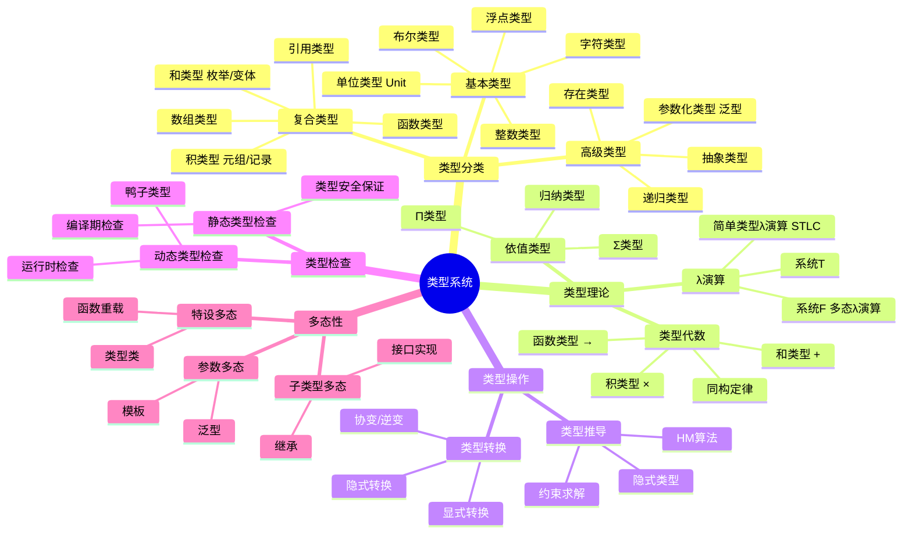

# 类型系统思维导图


> **版本**: 1.0
> **创建日期**: 2026-04-19
> **最后更新**: 2026-04-19

## ASCII 艺术版

```
                      ┌─────────────────────┐
                      │      类型系统        │
                      │    Type System      │
                      └──────────┬──────────┘
                                   │
        ┌──────────────────────────┼──────────────────────────┐
        │                          │                          │
        ▼                          ▼                          ▼
┌───────────────┐        ┌─────────────────┐        ┌───────────────┐
│   类型分类     │        │   类型操作       │        │   类型理论     │
│ Type Categories│        │  Type Operations │        │  Type Theory  │
└───────┬───────┘        └────────┬────────┘        └───────┬───────┘
        │                         │                         │
   ┌────┴────┐              ┌─────┴─────┐             ┌─────┴─────┐
   │         │              │           │             │           │
   ▼         ▼              ▼           ▼             ▼           ▼
┌──────┐  ┌──────┐     ┌──────┐   ┌──────┐      ┌──────┐   ┌──────┐
│基本  │  │复合  │     │类型  │   │类型  │      │λ演算 │   │依值  │
│类型  │  │类型  │     │推导  │   │转换  │      │     │   │类型  │
└──┬───┘  └──┬───┘     └──────┘   └──────┘      └──────┘   └──────┘
   │         │
   ▼         ▼
┌────┐   ┌──┴────┐
│数值│   │函数   │
│类型│   │类型   │
├────┤   ├───────┤
│布尔│   │代数   │
│类型│   │数据   │
├────┤   │类型   │
│字符│   ├───────┤
│类型│   │参数化 │
└────┘   │类型   │
         ├───────┤
         │递归   │
         │类型   │
         └───────┘

        ┌──────────────────────┬──────────────────────┐
        │                      │                      │
        ▼                      ▼                      ▼
┌───────────────┐    ┌─────────────────┐    ┌───────────────┐
│   类型检查     │    │   高级特性       │    │   形式化基础   │
│ Type Checking │    │ Advanced Features│    │  Formal Basis │
└───────┬───────┘    └────────┬────────┘    └───────┬───────┘
        │                     │                     │
   ┌────┴────┐           ┌─────┴─────┐        ┌─────┴─────┐
   │         │           │           │        │           │
   ▼         ▼           ▼           ▼        ▼           ▼
┌──────┐  ┌──────┐   ┌──────┐   ┌──────┐  ┌──────┐   ┌──────┐
│静态  │  │动态  │   │泛型  │   │高阶  │  │自然  │   │相继  │
│检查  │  │检查  │   │     │   │类型  │  │演绎 │   │式演算│
│      │  │      │   │     │   │     │  │     │   │     │
├──────┤  ├──────┤   ├──────┤   ├──────┤  ├──────┤   ├──────┤
│显式  │  │隐式  │   │子类型│   │线性│  │类型  │   │范畴  │
│类型  │  │类型  │   │多态  │   │类型  │  │同构 │   │论语义│
└──────┘  └──────┘   └──────┘   └──────┘  └──────┘   └──────┘
```

---

## Mermaid 版



---

## 类型系统层级

```
                    ┌─────────────────────┐
                    │    依值类型系统      │
                    │ Dependent Types    │
                    │  (如 Coq, Agda)     │
                    └──────────┬──────────┘
                               │ 可表达任意命题
                               ▼
                    ┌─────────────────────┐
                    │    多态λ演算        │
                    │ System F_ω         │
                    │  (高阶多态)         │
                    └──────────┬──────────┘
                               │ 类型构造器多态
                               ▼
                    ┌─────────────────────┐
                    │    多态λ演算        │
                    │ System F           │
                    │  (参数多态)         │
                    └──────────┬──────────┘
                               │ 泛型编程
                               ▼
                    ┌─────────────────────┐
                    │    简单类型λ演算     │
                    │ Simply Typed λ     │
                    │  (高阶函数)         │
                    └──────────┬──────────┘
                               │ 函数作为值
                               ▼
                    ┌─────────────────────┐
                    │    简单类型系统      │
                    │ Simple Types       │
                    │  (基础类型)         │
                    └──────────┬──────────┘
                               │ 类型标注
                               ▼
                    ┌─────────────────────┐
                    │    无类型λ演算       │
                    │ Untyped λ Calculus │
                    └─────────────────────┘
```

---

## 类型代数

```
┌─────────────────────────────────────────────────────────────┐
│                      类型代数结构                            │
└─────────────────────────────────────────────────────────────┘

    积类型 (Product)                和类型 (Sum)
    ─────────────────               ─────────────────

    A × B                            A + B

    ┌─────────┐                     ┌─────────┐
    │  fst    │                     │  inl    │
    │  : A×B→A │                     │  : A→A+B │
    ├─────────┤                     ├─────────┤
    │  snd    │                     │  inr    │
    │  : A×B→B │                     │  : B→A+B │
    └─────────┘                     ├─────────┤
                                    │  case   │
                                    │:A+B→(A→C)│
                                    │   →(B→C)│
                                    │   →C    │
                                    └─────────┘

    单位元: 1 (Unit)                单位元: 0 (Void)
    A × 1 ≅ A                       A + 0 ≅ A

    同构定律:
    ─────────────────────────────────────────
    A × B ≅ B × A                   A + B ≅ B + A       (交换律)
    A × (B × C) ≅ (A × B) × C       A + (B + C) ≅ (A + B) + C  (结合律)
    A × (B + C) ≅ (A × B) + (A × C)                    (分配律)
    A × 0 ≅ 0
    A^0 ≅ 1                        0^A ≅ 0 (A≠0)
    A^1 ≅ A                        1^A ≅ 1
    A^(B+C) ≅ A^B × A^C            (A × B)^C ≅ A^C × B^C
```

---

## 类型推导流程

```
┌────────────────────────────────────────────────────────────┐
│                     类型推导过程                             │
└────────────────────────────────────────────────────────────┘

表达式 e
    │
    ▼
┌─────────────────┐
│ 1. 生成约束      │
│   为子表达式     │
│   分配类型变量   │
│   收集约束条件   │
└────────┬────────┘
         │
         ▼
┌─────────────────┐
│ 2. 统一化       │
│   求解约束方程   │
│   最一般合一     │
│   MGU           │
└────────┬────────┘
         │
         ▼
┌─────────────────┐
│ 3. 应用代换      │
│   将解代入类型   │
│   变量得到       │
│   最终类型       │
└────────┬────────┘
         │
         ▼
    类型 τ

示例: λx. λy. x y

    x : α, y : β
    约束: α = β → γ
    结果: (β → γ) → β → γ
```

---

## 类型系统特性对比

| 特性 | 静态类型 | 动态类型 | 强类型 | 弱类型 |
|------|---------|---------|-------|-------|
| **检查时机** | 编译期 | 运行期 | 编译/运行 | 编译/运行 |
| **错误发现** | 早期 | 晚期 | 阻止隐式转换 | 允许隐式转换 |
| **性能** | 高(无运行时检查) | 低(需类型检查) | - | - |
| **灵活性** | 低 | 高 | 低 | 高 |
| **典型语言** | Java, Haskell | Python, Ruby | Java, Python | C, JavaScript |

---

## 子类型关系图

```
                    ┌──────────────┐
                    │     Top      │
                    │    (Object)  │
                    └──────┬───────┘
                           │
           ┌───────────────┼───────────────┐
           │               │               │
           ▼               ▼               ▼
    ┌────────────┐  ┌────────────┐  ┌────────────┐
    │  Number    │  │  Iterable  │  │  Callable  │
    └─────┬──────┘  └─────┬──────┘  └────────────┘
          │               │
    ┌─────┴─────┐   ┌─────┴─────┐
    │           │   │           │
    ▼           ▼   ▼           ▼
┌───────┐  ┌───────┐ ┌───────┐ ┌───────┐
│  Int  │  │ Float │ │  List │ │  Set  │
└───┬───┘  └───────┘ └───┬───┘ └───┬───┘
    │                    │         │
    ▼                    ▼         ▼
┌───────┐           ┌───────┐ ┌───────┐
│  Bool │           │ Tuple │ │Frozen │
│       │           │       │ │ Set   │
└───────┘           └───────┘ └───────┘
                           │
                           ▼
                    ┌──────────────┐
                    │    Bottom    │
                    │    (Never)   │
                    └──────────────┘

协变: C<T> 中若 T <: U 则 C<T> <: C<U>
逆变: C<T> 中若 U <: T 则 C<T> <: C<U>
不变: C<T> 与 C<U> 无关
```

---

## 编程语言类型系统对比

```
┌─────────────────────────────────────────────────────────────┐
│                    主流语言类型系统分类                        │
└─────────────────────────────────────────────────────────────┘

    静态类型 ─────────────────────────────────────────────►
    │
    │  简单类型            泛型                 依赖类型
    │
    ▼    ┌────────┐    ┌────────┐    ┌────────┐    ┌────────┐
    强   │   C    │    │  Java  │    │Haskell │    │  Coq   │
    类   │        │───►│        │───►│        │───►│        │
    型   └────────┘    └────────┘    └────────┘    └────────┘
         ┌────────┐    ┌────────┐    ┌────────┐    ┌────────┐
    弱   │  Asm   │    │   C++  │    │  Rust  │    │  Agda  │
    类型 │        │───►│        │───►│        │───►│        │
         └────────┘    └────────┘    └────────┘    └────────┘

    动态类型 ─────────────────────────────────────────────►

         ┌────────┐    ┌────────┐    ┌────────┐
         │  Lisp  │    │Python  │    │  Julia │
         │        │───►│        │───►│        │
         └────────┘    └────────┘    └────────┘
```

---

*本思维导图涵盖了类型系统的核心概念，从基础类型到高级类型理论，适合作为类型系统的学习路线图*

---

## 参考文献

- 待补充

---

## 知识导航

- [返回目录](README.md)

