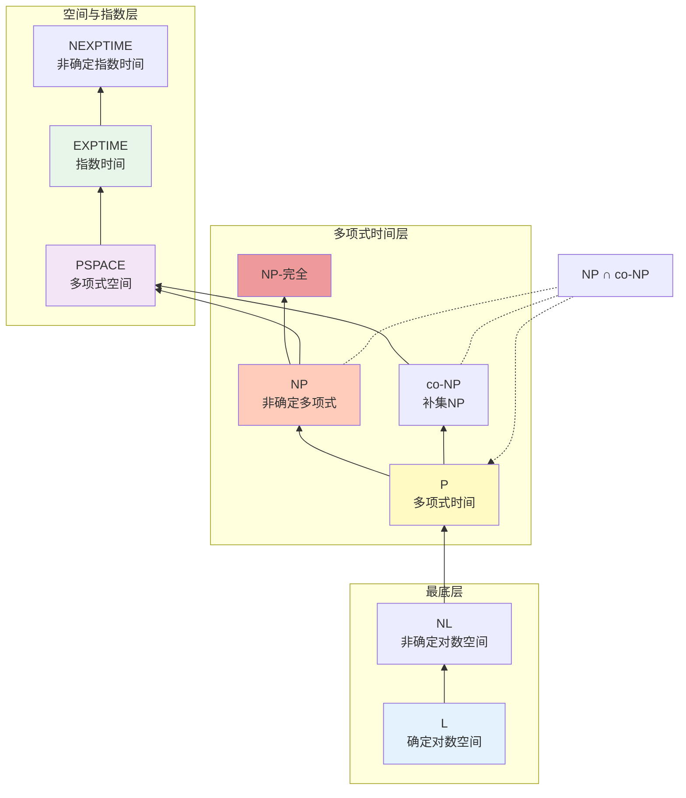

# 复杂度类包含关系图


> **版本**: 1.0
> **创建日期**: 2026-04-19
> **最后更新**: 2026-04-19

## 概述

本文档详细展示计算复杂度理论中各类复杂度类之间的包含关系，从最基本的L类到最复杂的NEXPTIME类，揭示计算问题的难度层次。

---

## ASCII 艺术版：复杂度类全景图

```
                           ┌─────────────────────────────────┐
                           │         NEXPTIME                │
                           │     (非确定指数时间)             │
                           │      2^O(n^k)                   │
                           └───────────────┬─────────────────┘
                                           │
                           ┌───────────────┴───────────────┐
                           │                               │
                           ▼                               ▼
              ┌─────────────────────────┐    ┌─────────────────────────┐
              │       EXPTIME           │    │    NEXPTIME-完全         │
              │       (指数时间)         │    │                         │
              │       2^O(n^k)          │    └─────────────────────────┘
              └────────────┬────────────┘
                           │
              ┌────────────┴────────────┐
              │                         │
              ▼                         ▼
 ┌─────────────────────────┐  ┌─────────────────────────┐
 │       PSPACE            │  │     EXPTIME-完全         │
 │     (多项式空间)         │  │                         │
 │      可被图灵机在        │  │  围棋、国际象棋          │
 │      多项式空间内解决    │  │                         │
 └────────────┬────────────┘  └─────────────────────────┘
              │
              │
              ▼
 ┌─────────────────────────────────────────────────────────────┐
 │                      PSPACE-完全                             │
 │                                                              │
 │  QSAT (量词布尔可满足性)、双人博弈问题                         │
 │  所有PSPACE问题可在多项式时间内归约到这些问题                  │
 └─────────────────────────────────────────────────────────────┘
              │
      ┌───────┴───────┐
      │               │
      ▼               ▼
┌───────────┐  ┌─────────────────────────┐
│   NP      │  │        co-NP            │
│           │  │                         │
│  非确定性 │  │  补集属于NP的问题        │
│  多项式时间│  │  如: 命题永真性问题      │
│  可验证   │  │                         │
│           │  │  NP = co-NP ? (开放问题) │
└─────┬─────┘  └─────────────────────────┘
      │
      │         ┌─────────────────────────┐
      │         │    NP ∩ co-NP           │
      └────────▶│                         │◀────────┐
                │  同时在NP和co-NP中的问题 │         │
                │  如: 整数分解、图同构     │         │
                │                         │         │
                │  如果NP完全问题在此      │         │
                │  则 NP = co-NP           │         │
                └─────────────────────────┘         │
                          │                         │
                          │                         │
                          ▼                         ▼
              ┌─────────────────────────┐  ┌─────────────────────────┐
              │         P               │  │    NP-完全 (NPC)        │
              │    (多项式时间)          │  │                         │
              │                         │  │  3-SAT、团问题、         │
              │  可被确定性图灵机在      │  │  顶点覆盖、哈密顿回路    │
              │  多项式时间内解决        │  │  子集和、背包问题        │
              │                         │  │                         │
              │  P = NP ? (千禧年难题)   │  │  所有NP问题可归约到NPC   │
              └─────────────────────────┘  └─────────────────────────┘
                          │
                          ▼
              ┌─────────────────────────┐
              │       NC                │
              │    (Nick's Class)       │
              │                         │
              │  可被高效并行化的        │
              │  多项式时间问题          │
              │                         │
              │  使用多项式个处理器      │
              │  在对数时间内解决        │
              └────────────┬────────────┘
                           │
                           ▼
              ┌─────────────────────────┐
              │        NL               │
              │   (非确定对数空间)       │
              │                         │
              │  可被非确定性图灵机      │
              │  在对数空间内解决        │
              │                         │
              │  有向图可达性问题        │
              │  是 NL-完全的            │
              └────────────┬────────────┘
                           │
                           ▼
              ┌─────────────────────────┐
              │         L               │
              │   (确定对数空间)         │
              │                         │
              │  可被确定性图灵机        │
              │  在对数空间内解决        │
              │                         │
              │  L = NL ? (开放问题)     │
              └─────────────────────────┘
```

---

## 包含关系链

```
基本包含链:
═══════════════════════════════════════════════════════════════════════════════

    L ⊆ NL ⊆ P ⊆ NP ⊆ PSPACE ⊆ EXPTIME ⊆ NEXPTIME
    │    │    │    │     │         │
    │    │    │    │     │         └─ 2^O(n^k) 非确定时间
    │    │    │    │     └─────────── O(n^k) 空间
    │    │    │    └───────────────── O(n^k) 非确定时间 / 可验证
    │    │    └────────────────────── O(n^k) 确定时间
    │    └─────────────────────────── O(log n) 空间，非确定
    └──────────────────────────────── O(log n) 空间，确定

═══════════════════════════════════════════════════════════════════════════════

扩展包含链 (包含随机复杂度类):
═══════════════════════════════════════════════════════════════════════════════

    L ⊆ NL ⊆ P ⊆ BPP ⊆ PSPACE ⊆ EXPTIME
         │         │
         │         ├─ BQP (量子多项式时间)
         │         │
         └─────────┴─ 关系尚不明确

═══════════════════════════════════════════════════════════════════════════════
```

---

## 复杂度类详细对比

```
┌─────────────────────────────────────────────────────────────────────────────┐
│                         复杂度类详细对比                                     │
├──────────┬──────────────┬────────────────┬────────────────┬─────────────────┤
│   类名   │    计算模型   │    资源限制    │    典型问题    │    状态         │
├──────────┼──────────────┼────────────────┼────────────────┼─────────────────┤
│          │              │                │                │                 │
│    L     │  确定性图灵机 │   O(log n)空间 │  无向图可达性   │   已解决        │
│          │              │                │  判断森林      │                 │
│          │              │                │                │                 │
├──────────┼──────────────┼────────────────┼────────────────┼─────────────────┤
│          │              │                │                │                 │
│   NL     │  非确定图灵机 │   O(log n)空间 │  有向图可达性   │   已解决        │
│          │              │                │  2-SAT         │                 │
│          │              │                │                │                 │
├──────────┼──────────────┼────────────────┼────────────────┼─────────────────┤
│          │              │                │                │                 │
│    P     │  确定性图灵机 │   O(n^k)时间   │  排序、最短路径 │   已解决        │
│          │              │                │  最小生成树    │                 │
│          │              │                │  线性规划      │                 │
│          │              │                │                │                 │
├──────────┼──────────────┼────────────────┼────────────────┼─────────────────┤
│          │              │                │                │                 │
│   NP     │  非确定图灵机 │   O(n^k)时间   │  3-SAT、团问题  │   开放          │
│          │              │  或多项式验证   │  哈密顿回路    │  (P vs NP)      │
│          │              │                │  图着色        │                 │
│          │              │                │                │                 │
├──────────┼──────────────┼────────────────┼────────────────┼─────────────────┤
│          │              │                │                │                 │
│  PSPACE  │  任意图灵机   │   O(n^k)空间   │  QSAT          │   已解决        │
│          │              │                │  双人博弈问题   │                 │
│          │              │                │  正则表达式    │                 │
│          │              │                │  全集问题      │                 │
│          │              │                │                │                 │
├──────────┼──────────────┼────────────────┼────────────────┼─────────────────┤
│          │              │                │                │                 │
│ EXPTIME  │  确定性图灵机 │  2^O(n^k)时间  │  国际象棋、围棋 │   已解决        │
│          │              │                │  指数级问题    │                 │
│          │              │                │                │                 │
└──────────┴──────────────┴────────────────┴────────────────┴─────────────────┘
```

---

## 已知严格包含关系

```
┌─────────────────────────────────────────────────────────────────────────────┐
│                      已知的严格包含关系                                      │
├─────────────────────────────────────────────────────────────────────────────┤
│                                                                             │
│  ✅ 已证明的严格包含:                                                        │
│  ─────────────────────────────────────────────────────────────────────────  │
│                                                                             │
│  1. L ⊊ PSPACE                                                              │
│     ──────────────────────────────────────────────────────────────────────  │
│     对数空间 vs 多项式空间                                                   │
│     证明: 空间层次定理 (Space Hierarchy Theorem)                            │
│                                                                             │
│  2. P ⊊ EXPTIME                                                             │
│     ──────────────────────────────────────────────────────────────────────  │
│     多项式时间 vs 指数时间                                                   │
│     证明: 时间层次定理 (Time Hierarchy Theorem)                             │
│                                                                             │
│  3. NL ⊊ PSPACE                                                             │
│     ──────────────────────────────────────────────────────────────────────  │
│     非确定对数空间严格小于多项式空间                                          │
│                                                                             │
├─────────────────────────────────────────────────────────────────────────────┤
│                                                                             │
│  ❓ 未解决的包含问题 (可能相等):                                              │
│  ─────────────────────────────────────────────────────────────────────────  │
│                                                                             │
│  1. L = NL ?                                                                │
│     确定对数空间是否等于非确定对数空间?                                       │
│     猜想: L ⊊ NL                                                            │
│                                                                             │
│  2. P = NP ?                                                                │
│     多项式时间是否等于非确定多项式时间?                                       │
│     千禧年大奖难题之一                                                       │
│     猜想: P ⊊ NP                                                            │
│                                                                             │
│  3. NP = PSPACE ?                                                           │
│     非确定多项式时间是否等于多项式空间?                                       │
│     猜想: NP ⊊ PSPACE (如果P≠NP则成立)                                       │
│                                                                             │
│  4. PSPACE = EXPTIME ?                                                      │
│     多项式空间是否等于指数时间?                                               │
│     猜想: PSPACE ⊊ EXPTIME                                                  │
│                                                                             │
└─────────────────────────────────────────────────────────────────────────────┘
```

---

## Mermaid 包含关系图



---

## 归约关系与完全问题

```
┌─────────────────────────────────────────────────────────────────────────────┐
│                         归约关系图                                           │
├─────────────────────────────────────────────────────────────────────────────┤
│                                                                             │
│  归约强度层次:                                                               │
│  ════════════════════════════════════════════════════════════════════════   │
│                                                                             │
│  多项式时间归约 (Karp归约)                                                   │
│  对数空间归约                                                              │
│  图灵归约                                                                   │
│                                                                             │
│  强度: 图灵归约 ≤ 多项式时间归约 ≤ 对数空间归约                               │
│                                                                             │
├─────────────────────────────────────────────────────────────────────────────┤
│                                                                             │
│  完全问题分布:                                                               │
│  ════════════════════════════════════════════════════════════════════════   │
│                                                                             │
│       ┌─────────────────────────────────────────────────────────────┐       │
│       │                    P-完全                                   │       │
│       │                                                             │       │
│       │   • 电路值问题 (CVP)                                        │       │
│       │   • 线性规划 (在P中但被认为是P-完全的)                        │       │
│       │   • 上下文无关语法成员问题 (对数空间归约下)                    │       │
│       │                                                             │       │
│       └───────────────────────────────┬─────────────────────────────┘       │
│                                       │                                     │
│       ┌───────────────────────────────┴─────────────────────────────┐       │
│       │                    NP-完全                                    │       │
│       │                                                             │       │
│       │   • 3-SAT (可满足性问题)                                     │       │
│       │   • 顶点覆盖 (Vertex Cover)                                  │       │
│       │   • 团问题 (Clique)                                          │       │
│       │   • 哈密顿回路 (Hamiltonian Cycle)                           │       │
│       │   • 旅行商问题 (TSP，判定版本)                                │       │
│       │   • 子集和 (Subset Sum)                                      │       │
│       │   • 背包问题 (Knapsack)                                      │       │
│       │   • 图着色 (Graph Coloring)                                  │       │
│       │                                                             │       │
│       └───────────────────────────────┬─────────────────────────────┘       │
│                                       │                                     │
│       ┌───────────────────────────────┴─────────────────────────────┐       │
│       │                  PSPACE-完全                                  │       │
│       │                                                             │       │
│       │   • QSAT (量词布尔可满足性)                                  │       │
│       │   • 广义地理游戏                                             │       │
│       │   • 国际象棋、围棋 (广义版本)                                │       │
│       │   • 正则表达式全集问题                                        │       │
│       │                                                             │       │
│       └───────────────────────────────┬─────────────────────────────┘       │
│                                       │                                     │
│       ┌───────────────────────────────┴─────────────────────────────┐       │
│       │                 EXPTIME-完全                                  │       │
│       │                                                             │       │
│       │   • 广义国际象棋                                             │       │
│       │   • 广义围棋                                                 │       │
│       │   • 交替图灵机停机问题 (有限时间内)                          │       │
│       │                                                             │       │
│       └─────────────────────────────────────────────────────────────┘       │
│                                                                             │
└─────────────────────────────────────────────────────────────────────────────┘
```

---

## P vs NP 问题详解

```
┌─────────────────────────────────────────────────────────────────────────────┐
│                       P vs NP 问题详解                                       │
├─────────────────────────────────────────────────────────────────────────────┤
│                                                                             │
│  问题陈述:                                                                   │
│  ════════════════════════════════════════════════════════════════════════   │
│                                                                             │
│  P = NP ?                                                                   │
│                                                                             │
│  等价表述: 如果一个问题的解可以被高效验证，是否意味着它可以被高效求解?          │
│                                                                             │
├─────────────────────────────────────────────────────────────────────────────┤
│                                                                             │
│  两种可能性:                                                                 │
│  ════════════════════════════════════════════════════════════════════════   │
│                                                                             │
│  ┌───────────────────────────┐        ┌───────────────────────────┐         │
│  │       P = NP              │        │        P ≠ NP             │         │
│  │                           │        │                           │         │
│  │  如果为真:                 │        │  如果为真:                 │         │
│  │                           │        │                           │         │
│  │  • NP-完全问题存在         │        │  • NP-完全问题不存在      │         │
│  │    多项式时间算法          │        │    多项式时间算法         │         │
│  │                           │        │                           │         │
│  │  • 许多现在看来困难        │        │  • 某些问题本质上是        │         │
│  │    的问题会变得容易        │        │    计算困难的             │         │
│  │                           │        │                           │         │
│  │  • 现代密码学崩溃          │        │  • 密码学安全性有         │         │
│  │    (RSA、ECC等)           │        │    理论基础               │         │
│  │                           │        │                           │         │
│  │  • 最优化问题(旅行商、      │        │  • 需要接受有些问题        │         │
│  │    调度等)可高效解决       │        │    没有高效解法           │         │
│  │                           │        │                           │         │
│  │  • 数学证明可能可以        │        │  • 启发式和近似算法        │         │
│  │    自动化生成              │        │    变得重要               │         │
│  │                           │        │                           │         │
│  └───────────────────────────┘        └───────────────────────────┘         │
│                                                                             │
│  当前共识: P ≠ NP (但没有证明)                                               │
│                                                                             │
└─────────────────────────────────────────────────────────────────────────────┘
```

---

## 随机复杂度类

```
┌─────────────────────────────────────────────────────────────────────────────┐
│                         随机复杂度类                                         │
├─────────────────────────────────────────────────────────────────────────────┤
│                                                                             │
│  BPP (Bounded-error Probabilistic Polynomial time)                          │
│  ════════════════════════════════════════════════════════════════════════   │
│                                                                             │
│  定义: 可被概率图灵机在多项式时间内以错误概率 ≤ 1/3 解决的问题                 │
│                                                                             │
│  包含关系: P ⊆ BPP                                                          │
│                                                                             │
│  猜想: P = BPP (去随机化是可能的)                                            │
│                                                                             │
├─────────────────────────────────────────────────────────────────────────────┤
│                                                                             │
│  RP (Randomized Polynomial time)                                            │
│  ════════════════════════════════════════════════════════════════════════   │
│                                                                             │
│  定义: 可被概率图灵机在多项式时间内解决                                       │
│        • 若答案为"是"，以概率 ≥ 1/2 接受                                    │
│        • 若答案为"否"，总是拒绝                                              │
│                                                                             │
│  包含关系: P ⊆ RP ⊆ NP                                                      │
│                                                                             │
├─────────────────────────────────────────────────────────────────────────────┤
│                                                                             │
│  co-RP                                                                      │
│  ════════════════════════════════════════════════════════════════════════   │
│                                                                             │
│  定义: RP 的补集类                                                           │
│                                                                             │
│  包含关系: P ⊆ co-RP ⊆ co-NP                                                │
│                                                                             │
├─────────────────────────────────────────────────────────────────────────────┤
│                                                                             │
│  ZPP (Zero-error Probabilistic Polynomial time)                             │
│  ════════════════════════════════════════════════════════════════════════   │
│                                                                             │
│  定义: ZPP = RP ∩ co-RP                                                     │
│                                                                             │
│  等价定义: 期望多项式时间的拉斯维加斯算法                                     │
│                                                                             │
│  包含关系: P ⊆ ZPP = RP ∩ co-RP ⊆ BPP                                       │
│                                                                             │
├─────────────────────────────────────────────────────────────────────────────┤
│                                                                             │
│  BQP (Bounded-error Quantum Polynomial time)                                │
│  ════════════════════════════════════════════════════════════════════════   │
│                                                                             │
│  定义: 可被量子计算机在多项式时间内以错误概率 ≤ 1/3 解决的问题                 │
│                                                                             │
│  包含关系: BPP ⊆ BQP ⊆ PSPACE                                               │
│                                                                             │
│  已知: 整数分解 ∈ BQP (Shor算法)                                            │
│                                                                             │
└─────────────────────────────────────────────────────────────────────────────┘
```

---

## 实用决策指南

```
                        如何判断问题属于哪个复杂度类?
                                    │
                    ┌───────────────┴───────────────┐
                    │                               │
                    ▼                               ▼
        问题是否有高效算法?             问题是否有高效验证方法?
                    │                               │
        ┌───────────┴───────────┐       ┌───────────┴───────────┐
        │                       │       │                       │
       是                      否      是                      否
        │                       │       │                       │
        ▼                       ▼       ▼                       ▼
┌───────────────┐    ┌───────────────────┐ ┌───────────────────┐ ┌───────────┐
│  属于 P       │    │  可能是 PSPACE    │ │  属于 NP          │ │  可能超出 │
│               │    │  或更难          │ │  或 NP-完全       │ │  NP       │
│ 多项式时间    │    │                   │ │                   │ │           │
│ 算法存在      │    │  需要指数时间    │ │  解可多项式验证   │ │  难以验证 │
└───────────────┘    │  或空间          │ │                   │ │           │
                     └───────────────────┘ └───────────────────┘ └───────────┘
                                                    │
                            ┌───────────────────────┴───────────────────────┐
                            │                                               │
                            ▼                                               ▼
                所有实例都难解?                                 某些实例容易?
                            │                                               │
                    ┌───────┴───────┐                               ┌───────┴───────┐
                    │               │                               │               │
                   是              否                              是              否
                    │               │                               │               │
                    ▼               ▼                               ▼               ▼
        ┌───────────────────┐ ┌───────────────────┐     ┌───────────────────┐ ┌───────────┐
        │   NP-困难         │ │   NP-完全         │     │   在 P 中         │ │   可能是  │
        │                   │ │   (同时在NP中)    │     │   或接近          │ │   NP-中间 │
        │   至少和NP中最    │ │                   │     │                   │ │   (如     │
        │   难的问题一样难  │ │   如: 3-SAT,      │     │   如: 2-SAT,      │ │   图同构) │
        │                   │ │   团问题          │     │   最短路径        │ │           │
        └───────────────────┘ └───────────────────┘     └───────────────────┘ └───────────┘
```

---

## 记忆口诀

```
┌─────────────────────────────────────────────────────────────────────────────┐
│                         记忆口诀                                             │
├─────────────────────────────────────────────────────────────────────────────┤
│                                                                             │
│  复杂度类层次:                                                               │
│  ════════════════════════════════════════════════════════════════════════   │
│                                                                             │
│  "对数空间是地基，多项式时间是主体                                           │
│   非确定性来扩展，指数空间往上提                                             │
│   NP在P的上面，PSPACE更大些                                                 │
│   如果P等于NP，世界大不同"                                                   │
│                                                                             │
├─────────────────────────────────────────────────────────────────────────────┤
│                                                                             │
│  复杂度类对比:                                                               │
│  ════════════════════════════════════════════════════════════════════════   │
│                                                                             │
│  • L:  Logarithmic space  (对数空间)                                        │
│  • NL: Nondeterministic Logarithmic space (非确定对数空间)                   │
│  • P:  Polynomial time (多项式时间)                                         │
│  • NP: Nondeterministic Polynomial time (非确定多项式时间)                   │
│  • PSPACE: Polynomial space (多项式空间)                                    │
│  • EXP: Exponential time (指数时间)                                         │
│                                                                             │
└─────────────────────────────────────────────────────────────────────────────┘
```

---

*本文档全面展示了计算复杂度类的包含关系，理解这些关系对于评估问题的计算难度和选择合适的算法策略至关重要。*

---

## 参考文献

- 待补充

---

## 知识导航

- [返回目录](README.md)

