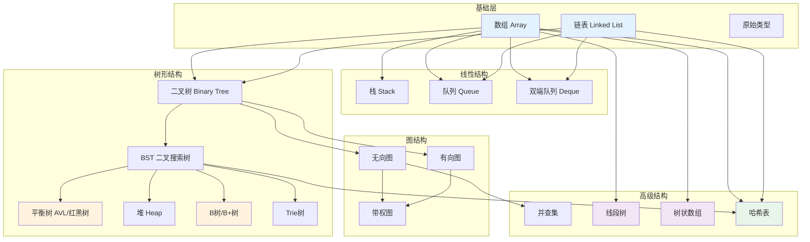

# 数据结构演化图


> **版本**: 1.0
> **创建日期**: 2026-04-19
> **最后更新**: 2026-04-19

## 概述

本文档展示数据结构从基础数组到高级结构的演化历程，揭示不同结构之间的继承、扩展和组合关系。

---

## ASCII 艺术版：数据结构演化全景

```
                              ┌─────────────────┐
                              │    基础存储      │
                              │   (内存模型)    │
                              └────────┬────────┘
                                       │
                    ┌──────────────────┼──────────────────┐
                    │                  │                  │
                    ▼                  ▼                  ▼
           ┌────────────────┐ ┌────────────────┐ ┌────────────────┐
           │     数组        │ │     链表        │ │    原始类型    │
           │   (Array)      │ │   (Linked List)│ │               │
           │   连续内存      │ │   离散内存      │ │   整数/浮点    │
           │   O(1)随机访问  │ │   O(1)插入删除  │ │   字符/布尔    │
           └────────┬───────┘ └────────┬───────┘ └────────────────┘
                    │                  │
        ┌───────────┴──────────┐       │
        │                      │       │
        ▼                      ▼       ▼
┌────────────────┐    ┌──────────────────────────────────────────┐
│   静态结构      │    │           动态结构分支                    │
│   (大小固定)    │    │                                          │
│                │    │  ┌─────────────┐    ┌─────────────┐      │
│ • 普通数组      │    │  │   单向链表   │    │   双向链表   │      │
│ • 多维数组      │    │  │  Singly     │───▶│  Doubly     │      │
│ • 字符串        │    │  │  Linked     │    │  Linked     │      │
└────────────────┘    │  └─────────────┘    └──────┬──────┘      │
                      │                            │             │
                      │                            ▼             │
                      │                     ┌─────────────┐      │
                      │                     │  循环链表    │      │
                      │                     │  Circular   │      │
                      │                     └─────────────┘      │
                      └──────────────────────────────────────────┘
                                       │
                    ┌──────────────────┼──────────────────┐
                    │                  │                  │
                    ▼                  ▼                  ▼
           ┌────────────────┐ ┌────────────────┐ ┌────────────────┐
           │   线性结构      │ │   层次结构      │ │   图状结构      │
           │   (一对一)      │ │   (一对多)      │ │   (多对多)      │
           └────────┬───────┘ └────────┬───────┘ └────────┬───────┘
                    │                  │                  │
        ┌───────────┼──────────┐       │       ┌─────────┼─────────┐
        │           │          │       │       │         │         │
        ▼           ▼          ▼       ▼       ▼         ▼         ▼
┌───────────┐ ┌───────────┐ ┌───────────┐ ┌───────────┐ ┌───────────┐
│   栈      │ │   队列    │ │    树     │ │  无向图   │ │  有向图   │
│  Stack    │ │  Queue    │ │   Tree    │ │ Undirected│ │ Directed  │
│  LIFO     │ │  FIFO     │ │           │ │   Graph   │ │   Graph   │
└─────┬─────┘ └─────┬─────┘ └─────┬─────┘ └─────┬─────┘ └─────┬─────┘
      │             │             │             │             │
      │             │             │             │             │
      ▼             ▼             ▼             ▼             ▼
┌───────────┐ ┌───────────┐ ┌───────────┐ ┌───────────┐ ┌───────────┐
│• 单调栈   │ │• 普通队列 │ │• 二叉树   │ │• 简单图   │ │• DAG      │
│• 表达式   │ │• 双端队列 │ │• 二叉搜索 │ │• 多重图   │ │• 网络流   │
│  求值     │ │  Deque    │ │  树 BST   │ │• 权重图   │ │• 状态图   │
│• 括号匹配 │ │• 优先队列 │ │• 平衡树   │ │           │ │           │
└───────────┘ │  (堆)     │ │• 堆       │ └───────────┘ └───────────┘
              └───────────┘ │• B树/B+树 │
                            │• Trie树   │
                            └───────────┘
```

---

## 二叉树家族演化

```
                              ┌─────────────────┐
                              │     二叉树       │
                              │  Binary Tree    │
                              │                │
                              │  每个节点最多   │
                              │  两个子节点     │
                              └────────┬────────┘
                                       │
            ┌──────────────────────────┼──────────────────────────┐
            │                          │                          │
            ▼                          ▼                          ▼
   ┌─────────────────┐      ┌─────────────────┐      ┌─────────────────┐
   │    二叉搜索树    │      │     完全二叉树   │      │    满二叉树      │
   │    BST          │      │  Complete Tree  │      │   Full Tree     │
   │                 │      │                 │      │                 │
   │ 左<根<右        │      │ 除最后一层外    │      │ 所有节点都有    │
   │ 有序性          │      │ 完全填满        │      │ 0或2个子节点    │
   └────────┬────────┘      │ 最后一层左对齐  │      └────────┬────────┘
            │               └────────┬────────┘               │
            │                        │                        │
   ┌────────┴────────┐               │                        │
   │                 │               ▼                        │
   ▼                 ▼      ┌─────────────────┐               │
┌────────────────┐ ┌────────────────┐  堆 Heap                │
│   平衡二叉树    │ │   红黑树        │  (最大/最小)            │
│ AVL Tree       │ │ Red-Black Tree │                         │
│                │ │                │                         │
│ 左右子树高度差 │ │ 颜色约束       │                         │
│ 不超过1        │ │ 保证近似平衡   │                         │
└────────┬───────┘ └────────┬───────┘                         │
         │                  │                                 │
         │                  │                                 │
         ▼                  ▼                                 ▼
┌─────────────────────────────────────────────────────────────────────────┐
│                         高级树结构                                        │
├─────────────────┬─────────────────┬─────────────────┬─────────────────────┤
│                 │                 │                 │                     │
│    B树家族      │    字典树       │   线段树       │     树状数组        │
│                 │                 │                 │                     │
│  ┌───────────┐  │  ┌───────────┐  │  ┌───────────┐  │   ┌───────────┐    │
│  │   B树     │  │  │   Trie    │  │  │  Segment  │  │   │  BIT/     │    │
│  │  B-Tree   │  │  │  (前缀树)  │  │  │   Tree    │  │   │ Fenwick   │    │
│  │           │  │  │           │  │  │           │  │   │           │    │
│  │ 多路搜索   │  │  │ 字符串检索 │  │  │ 区间查询   │  │   │ 前缀和    │    │
│  │ 磁盘优化   │  │  │ 前缀匹配   │  │  │ 线段表示   │  │   │ 动态维护   │    │
│  └─────┬─────┘  │  └───────────┘  │  └───────────┘  │   └───────────┘    │
│        │       │                 │                 │                     │
│        ▼       │                 │                 │                     │
│  ┌───────────┐ │                 │                 │                     │
│  │  B+树     │ │                 │                 │                     │
│  │ 所有数据  │ │                 │                 │                     │
│  │ 在叶子    │ │                 │                 │                     │
│  │ 数据库索引│ │                 │                 │                     │
│  └───────────┘ │                 │                 │                     │
│                │                 │                 │                     │
└────────────────┴─────────────────┴─────────────────┴─────────────────────┘
```

---

## 哈希表演化与碰撞处理

```
                    ┌─────────────────────────────┐
                    │         哈希表              │
                    │       Hash Table            │
                    │                             │
                    │   键 → 哈希函数 → 索引      │
                    │   O(1) 平均查找             │
                    └──────────────┬──────────────┘
                                   │
                    ┌──────────────┼──────────────┐
                    │              │              │
                    ▼              ▼              ▼
          ┌────────────────┐ ┌────────────────┐ ┌────────────────┐
          │   开放寻址法    │ │    链地址法     │ │   再哈希法      │
          │ Open Addressing│ │ Chaining       │ │ Rehashing      │
          │                │ │                │ │                │
          │ 冲突时探测      │ │ 冲突时链接      │ │ 冲突时换函数    │
          │ 其他空槽        │ │ 到链表          │ │ 重新计算        │
          └────────┬───────┘ └────────┬───────┘ └────────────────┘
                   │                  │
       ┌───────────┼───────────┐      │
       │           │           │      │
       ▼           ▼           ▼      ▼
┌───────────┐ ┌───────────┐ ┌──────────────────────────────────────────┐
│  线性探测  │ │  二次探测  │ │          链地址法变体                    │
│  Linear   │ │ Quadratic │ │                                          │
│  Probing  │ │  Probing  │ │  ┌─────────────┐    ┌─────────────┐     │
│           │ │           │ │  │   链表法    │    │   树化优化  │     │
│ +1, +2, +3│ │ +1, +4, +9│ │  │  简单链表   │───▶│  红黑树优化 │     │
│ 聚集问题   │ │ 次级聚集   │ │  │  (Java 7-)  │    │  (Java 8+)  │     │
└───────────┘ └───────────┘ │  └─────────────┘    └─────────────┘     │
                            │                                          │
                            │  ┌─────────────┐    ┌─────────────┐     │
                            │  │   跳表优化  │    │   完美哈希  │     │
                            │  │  Skip List  │    │  Perfect    │     │
                            │  │             │    │  Hashing    │     │
                            │  │ O(log n)    │    │  静态集合   │     │
                            │  │ 替代链表    │    │  O(1)最坏   │     │
                            │  └─────────────┘    └─────────────┘     │
                            └──────────────────────────────────────────┘
```

---

## 高级数据结构演化

```
┌─────────────────────────────────────────────────────────────────────────────┐
│                          高级数据结构演化路径                                 │
├─────────────────────────────────────────────────────────────────────────────┤
│                                                                             │
│  基础结构              扩展思路              高级结构              应用场景  │
│  ─────────────────────────────────────────────────────────────────────────  │
│                                                                             │
│  ┌─────────┐          ┌─────────┐          ┌─────────┐          ┌────────┐  │
│  │  数组   │─────────▶│ +有序性 │─────────▶│ 有序表  │─────────▶│ 二分查找│  │
│  └─────────┘          └─────────┘          └─────────┘          └────────┘  │
│                                                                             │
│  ┌─────────┐          ┌─────────┐          ┌─────────┐          ┌────────┐  │
│  │  数组   │─────────▶│ +稀疏性 │─────────▶│ 稀疏表  │─────────▶│ 矩阵运算│  │
│  └─────────┘          └─────────┘          └─────────┘          └────────┘  │
│                                                                             │
│  ┌─────────┐          ┌─────────┐          ┌─────────┐          ┌────────┐  │
│  │  链表   │─────────▶│ +跳表   │─────────▶│ SkipList│─────────▶│ 有序集  │  │
│  └─────────┘          └─────────┘          └─────────┘          └────────┘  │
│                                                                             │
│  ┌─────────┐          ┌─────────┐          ┌─────────┐          ┌────────┐  │
│  │  BST    │─────────▶│ +自平衡 │─────────▶│ 红黑树  │─────────▶│ 通用Map │  │
│  └─────────┘          └─────────┘          └─────────┘          └────────┘  │
│                                                                             │
│  ┌─────────┐          ┌─────────┐          ┌─────────┐          ┌────────┐  │
│  │  BST    │─────────▶│ +多路   │─────────▶│  B树   │─────────▶│ 文件系统│  │
│  └─────────┘          └─────────┘          └─────────┘          └────────┘  │
│                                                                             │
│  ┌─────────┐          ┌─────────┐          ┌─────────┐          ┌────────┐  │
│  │  BST    │─────────▶│ +位运算 │─────────▶│ 字典树  │─────────▶│ 字符串  │  │
│  └─────────┘          └─────────┘          └─────────┘          └────────┘  │
│                                                                             │
│  ┌─────────┐          ┌─────────┐          ┌─────────┐          ┌────────┐  │
│  │  数组   │─────────▶│ +树形   │─────────▶│ 线段树  │─────────▶│ 区间查询│  │
│  └─────────┘          └─────────┘          └─────────┘          └────────┘  │
│                                                                             │
│  ┌─────────┐          ┌─────────┐          ┌─────────┐          ┌────────┐  │
│  │  图     │─────────▶│ +并查集 │─────────▶│ Union-F │─────────▶│ 连通性  │  │
│  └─────────┘          └─────────┘          └─────────┘          └────────┘  │
│                                                                             │
└─────────────────────────────────────────────────────────────────────────────┘
```

---

## Mermaid 演化图



---

## 时间复杂度演进对比

```
┌─────────────────────────────────────────────────────────────────────────────┐
│                     操作复杂度对比矩阵                                       │
├──────────────────┬─────────┬─────────┬─────────┬─────────┬──────────────────┤
│     数据结构      │  访问   │  搜索   │  插入   │  删除   │     特点         │
├──────────────────┼─────────┼─────────┼─────────┼─────────┼──────────────────┤
│                  │         │         │         │         │                  │
│  数组            │  O(1)   │  O(n)   │  O(n)   │  O(n)   │  随机访问快      │
│                  │         │         │         │         │                  │
├──────────────────┼─────────┼─────────┼─────────┼─────────┼──────────────────┤
│                  │         │         │         │         │                  │
│  链表            │  O(n)   │  O(n)   │  O(1)   │  O(1)   │  插入删除快      │
│                  │         │         │         │         │  (已知位置)      │
├──────────────────┼─────────┼─────────┼─────────┼─────────┼──────────────────┤
│                  │         │         │         │         │                  │
│  栈              │  O(n)   │  O(n)   │  O(1)   │  O(1)   │  LIFO            │
│                  │         │         │         │         │                  │
├──────────────────┼─────────┼─────────┼─────────┼─────────┼──────────────────┤
│                  │         │         │         │         │                  │
│  队列            │  O(n)   │  O(n)   │  O(1)   │  O(1)   │  FIFO            │
│                  │         │         │         │         │                  │
├──────────────────┼─────────┼─────────┼─────────┼─────────┼──────────────────┤
│                  │         │         │         │         │                  │
│  BST (平衡)      │  O(log n)│ O(log n)│ O(log n)│ O(log n)│  有序、动态      │
│                  │         │         │         │         │                  │
├──────────────────┼─────────┼─────────┼─────────┼─────────┼──────────────────┤
│                  │         │         │         │         │                  │
│  堆              │  O(n)   │  O(n)   │ O(log n)│ O(log n)│  极值优先        │
│                  │         │         │         │         │                  │
├──────────────────┼─────────┼─────────┼─────────┼─────────┼──────────────────┤
│                  │         │         │         │         │                  │
│  哈希表          │  N/A    │  O(1)   │  O(1)   │  O(1)   │  键值映射        │
│                  │         │  平均   │  平均   │  平均   │                  │
├──────────────────┼─────────┼─────────┼─────────┼─────────┼──────────────────┤
│                  │         │         │         │         │                  │
│  B树             │ O(log n)│ O(log n)│ O(log n)│ O(log n)│  磁盘友好        │
│                  │         │         │         │         │                  │
├──────────────────┼─────────┼─────────┼─────────┼─────────┼──────────────────┤
│                  │         │         │         │         │                  │
│  Trie            │  O(k)   │  O(k)   │  O(k)   │  O(k)   │  字符串专用      │
│                  │         │         │         │         │  k=字符串长度    │
├──────────────────┼─────────┼─────────┼─────────┼─────────┼──────────────────┤
│                  │         │         │         │         │                  │
│  线段树          │  O(1)   │  O(log n)│ O(log n)│ O(log n)│  区间查询        │
│                  │         │         │         │         │                  │
└──────────────────┴─────────┴─────────┴─────────┴─────────┴──────────────────┘
```

---

## 选择决策树

```
需要存储数据并支持某些操作
            │
            ├── 主要需要随机访问?
            │       │
            │       ├── 是 → 数组或哈希表
            │       │           │
            │       │           ├── 知道索引? → 数组 O(1)
            │       │           │
            │       │           └── 知道键? → 哈希表 O(1)平均
            │       │
            │       └── 否 → 继续
            │
            ├── 需要维护有序性?
            │       │
            │       ├── 是 → 树结构
            │       │           │
            │       │           ├── 内存中、频繁修改? → 红黑树/AVL
            │       │           │
            │       │           ├── 磁盘存储、大数据? → B/B+树
            │       │           │
            │       │           └── 只需极值? → 堆
            │       │
            │       └── 否 → 继续
            │
            ├── 需要LIFO/FIFO?
            │       │
            │       ├── LIFO → 栈
            │       │
            │       └── FIFO → 队列/双端队列
            │
            ├── 处理字符串、前缀匹配?
            │       │
            │       └── 是 → Trie树
            │
            ├── 需要区间查询?
            │       │
            │       ├── 是 → 线段树/树状数组
            │       │
            │       └── 否 → 继续
            │
            └── 需要图遍历?
                    │
                    ├── 是 → 图结构 + 邻接表/矩阵
                    │
                    └── 否 → 链表 (最通用)
```

---

## 现代编程语言中的实现映射

```
┌─────────────────────────────────────────────────────────────────────────────┐
│                     数据结构在各语言中的实现                                 │
├──────────────────┬────────────────┬────────────────┬────────────────────────┤
│     数据结构      │     C++        │     Java       │      Python            │
├──────────────────┼────────────────┼────────────────┼────────────────────────┤
│                  │                │                │                        │
│  动态数组        │  vector        │  ArrayList     │  list (实际为动态数组) │
│                  │                │                │                        │
├──────────────────┼────────────────┼────────────────┼────────────────────────┤
│                  │                │                │                        │
│  链表            │  list          │  LinkedList    │  collections.deque     │
│                  │                │                │                        │
├──────────────────┼────────────────┼────────────────┼────────────────────────┤
│                  │                │                │                        │
│  栈              │  stack         │  Stack/Deque   │  list.append/pop       │
│                  │                │                │                        │
├──────────────────┼────────────────┼────────────────┼────────────────────────┤
│                  │                │                │                        │
│  队列            │  queue         │  Queue/Deque   │  collections.deque     │
│                  │                │                │                        │
├──────────────────┼────────────────┼────────────────┼────────────────────────┤
│                  │                │                │                        │
│  优先队列        │  priority_queue│  PriorityQueue │  heapq                 │
│                  │                │                │                        │
├──────────────────┼────────────────┼────────────────┼────────────────────────┤
│                  │                │                │                        │
│  哈希表          │  unordered_map │  HashMap       │  dict                  │
│                  │                │                │                        │
├──────────────────┼────────────────┼────────────────┼────────────────────────┤
│                  │                │                │                        │
│  有序Map         │  map           │  TreeMap       │  sortedcontainers      │
│                  │  (红黑树)       │  (红黑树)       │  (第三方库)            │
│                  │                │                │                        │
├──────────────────┼────────────────┼────────────────┼────────────────────────┤
│                  │                │                │                        │
│  集合            │  unordered_set │  HashSet       │  set                   │
│                  │                │                │                        │
├──────────────────┼────────────────┼────────────────┼────────────────────────┤
│                  │                │                │                        │
│  有序集合        │  set           │  TreeSet       │  使用 dict + heap      │
│                  │  (红黑树)       │  (红黑树)       │                        │
│                  │                │                │                        │
└──────────────────┴────────────────┴────────────────┴────────────────────────┘
```

---

## 演化趋势总结

```
┌─────────────────────────────────────────────────────────────────────────────┐
│                         数据结构演化趋势                                     │
├─────────────────────────────────────────────────────────────────────────────┤
│                                                                             │
│  1. 从静态到动态                                                            │
│     ──────────────────────────────────────────────────────────────────────  │
│     静态数组 ──▶ 动态数组 ──▶ 链表 ──▶ 各种自适应结构                        │
│     固定大小      自动扩容      按需分配      根据访问模式调整                │
│                                                                             │
├─────────────────────────────────────────────────────────────────────────────┤
│                                                                             │
│  2. 从通用到专用                                                            │
│     ──────────────────────────────────────────────────────────────────────  │
│     通用容器 ──▶ 针对特定问题的优化结构                                       │
│     如: 数组 ──▶ 线段树 (区间查询)                                           │
│         链表 ──▶ 跳表 (有序数据快速访问)                                      │
│         BST ──▶ Trie (字符串处理)                                            │
│                                                                             │
├─────────────────────────────────────────────────────────────────────────────┤
│                                                                             │
│  3. 从内存到磁盘                                                            │
│     ──────────────────────────────────────────────────────────────────────  │
│     内存优化结构 ──▶ 外存优化结构                                             │
│     BST ──▶ B树 ──▶ B+树                                                     │
│     减少磁盘I/O次数，增加分支因子                                             │
│                                                                             │
├─────────────────────────────────────────────────────────────────────────────┤
│                                                                             │
│  4. 从精确到近似                                                            │
│     ──────────────────────────────────────────────────────────────────────  │
│     精确结构 ──▶ 概率/近似结构                                               │
│     哈希表 ──▶ 布隆过滤器 (空间换概率)                                        │
│     平衡树 ──▶ Skip List (简化实现，概率平衡)                                 │
│                                                                             │
└─────────────────────────────────────────────────────────────────────────────┘
```

---

*本文档展示了数据结构从简单到复杂、从通用到专用的完整演化路径，理解这些关系有助于在实际问题中选择最合适的数据结构。*

---

## 参考文献

- 待补充

---

## 知识导航

- [返回目录](README.md)
